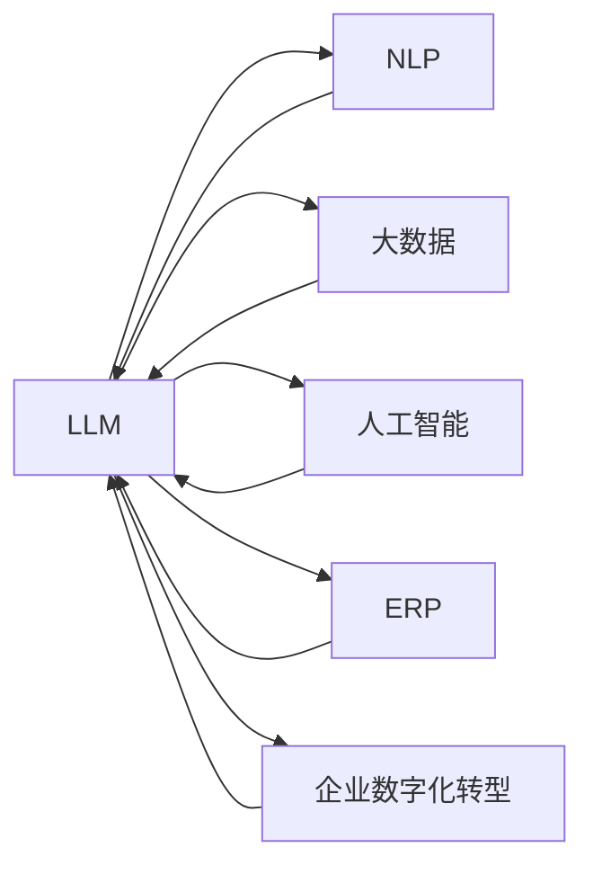

                 

# LLM对传统企业资源规划的革新

> 关键词：大语言模型,企业资源规划(ERP),自然语言处理,人工智能,大数据,企业数字化转型

## 1. 背景介绍

### 1.1 问题由来
在信息化迅猛发展的今天，企业资源规划(ERP)系统作为支撑企业管理和决策的重要工具，其功能和应用领域已经深入到企业运营的方方面面。然而，传统的ERP系统在用户体验、数据整合、业务流程自动化等方面存在诸多局限，难以满足企业对于数字化转型的需求。

近年来，随着人工智能技术的不断进步，尤其是自然语言处理(NLP)和大语言模型(LLM)的崛起，为ERP系统的革新提供了新的可能性。LLM通过语言理解和生成能力，可以为企业员工提供智能化的辅助决策，大幅提升ERP系统的用户体验。同时，借助LLM进行智能数据整合与分析，ERP系统能更准确地捕获业务流程中的关键信息，辅助企业做出更为精准的经营决策。

### 1.2 问题核心关键点
当前，LLM在ERP中的应用主要集中在以下几个方面：
- **智能问答**：通过智能问答机器人，实时回答员工关于ERP系统的操作和使用问题。
- **自然语言处理**：利用NLP技术，自动解析和理解企业内部的文档、邮件、聊天记录等非结构化数据。
- **智能数据整合**：结合LLM强大的语义理解能力，将不同系统、平台的数据进行跨平台整合和分析。
- **业务流程自动化**：运用LLM生成自动化流程脚本，代替人工进行重复性的业务操作。
- **动态报告生成**：基于LLM，根据特定需求自动生成动态化的、可视化的业务报告。
- **决策支持系统**：结合数据分析与预测模型，为高层管理者提供决策辅助。

这些应用使得LLM在企业ERP系统中展现出极大的潜力，同时也提出了新的挑战。如何结合企业实际需求，构建高效、易用的ERP系统，成为当前研究的重要课题。

### 1.3 问题研究意义
本文旨在通过探讨LLM在ERP中的应用，为企业提供一套有效的数字化转型解决方案。基于LLM的ERP系统可以大大提升企业的数据处理效率、决策智能化水平和用户体验，从而在激烈的市场竞争中占据有利地位。

## 2. 核心概念与联系

### 2.1 核心概念概述

为了更好地理解LLM在ERP系统中的应用，我们首先需要了解几个核心概念：

- **大语言模型(LLM)**：以Transformer网络为基础的预训练语言模型，如GPT、BERT等。LLM具备强大的语言理解和生成能力，能够自动学习和利用语言知识。
- **自然语言处理(NLP)**：研究计算机如何理解、处理和生成人类语言的技术，包括分词、词性标注、语义分析、信息抽取等。
- **企业资源规划(ERP)**：将企业各项业务活动和资源进行集成管理和优化，实现企业资源的高效配置和利用。
- **人工智能(AI)**：涉及计算机科学、数学、控制论等多个领域的综合性技术，通过模拟人的智能行为，实现各类应用。
- **大数据**：涉及数据收集、存储、处理和分析的技术体系，旨在从海量数据中提取有价值的信息，支持科学决策。
- **企业数字化转型**：通过数字化技术重塑企业商业模式、运营管理和业务流程，提升企业竞争力。

这些概念之间存在密切联系，共同构成了企业数字化转型的技术基础。LLM通过NLP和大数据技术，在AI的驱动下，为ERP系统的革新提供了强有力的支撑。

### 2.2 核心概念原理和架构的 Mermaid 流程图(Mermaid 流程节点中不要有括号、逗号等特殊字符)



上述流程图示意了大语言模型在企业数字化转型中的核心应用路径，展示了LLM与其他技术的紧密结合。

## 3. 核心算法原理 & 具体操作步骤

### 3.1 算法原理概述

LLM在ERP系统中的应用主要基于以下算法原理：

- **语义理解与解析**：利用NLP技术，对ERP系统中的文本数据进行语义理解和解析，实现信息的自动提取与整合。
- **自然语言生成**：运用LLM强大的自然语言生成能力，将结构化数据转换为易于理解和操作的文本形式。
- **知识图谱构建**：结合LLM的语义理解和生成能力，构建企业内部的知识图谱，支撑业务决策和数据分析。
- **自动化流程设计**：运用LLM生成自动化流程脚本，代替人工进行业务操作，提高工作效率。
- **动态报告生成**：根据业务需求，自动生成可视化的动态报告，辅助管理决策。
- **决策支持系统**：结合数据分析和预测模型，为高层管理者提供智能化的决策支持。

### 3.2 算法步骤详解

基于LLM的ERP系统开发主要包括以下几个步骤：

**Step 1: 需求调研与分析**
- 与ERP系统使用者沟通，了解业务需求和痛点，收集相关信息。
- 分析现有ERP系统的架构和功能，确定需要新增或优化的地方。
- 设计新的系统架构，决定LLM的位置和功能实现方式。

**Step 2: 数据收集与预处理**
- 收集企业内部的文档、邮件、聊天记录等非结构化数据。
- 对数据进行清洗、去重、格式转换等预处理，为后续的NLP处理做好准备。

**Step 3: 模型选择与构建**
- 根据业务需求，选择合适的预训练语言模型，如GPT、BERT等。
- 对模型进行微调，使其适应企业内部的特定场景。

**Step 4: 功能开发与实现**
- 根据需求设计智能问答、数据整合、业务流程自动化等功能模块。
- 利用NLP技术，对文本数据进行分词、实体识别、情感分析等处理。
- 运用LLM的自然语言生成能力，生成业务报告、自动化流程脚本等。

**Step 5: 系统集成与测试**
- 将新开发的模块集成到ERP系统中，确保与现有系统的兼容性。
- 进行系统测试，验证各功能模块的正确性和稳定性。
- 收集用户反馈，进行持续优化和改进。

**Step 6: 部署与应用**
- 将系统部署到实际生产环境，监控系统运行状态。
- 根据企业需求，不断优化系统功能，提升用户体验。
- 定期更新模型和算法，保持系统的高效运行。

### 3.3 算法优缺点

基于LLM的ERP系统具有以下优点：
1. **提高工作效率**：通过自动化流程设计和智能问答，减少了人工操作，大大提高了工作效率。
2. **提升决策精度**：利用LLM的自然语言理解和生成能力，提高了数据分析的准确性和报告的可视化水平。
3. **改善用户体验**：智能问答和自然语言生成等功能，提升了用户体验，帮助员工快速上手ERP系统。
4. **降低开发成本**：减少了人工操作，降低了系统开发和维护的成本。
5. **灵活可扩展**：系统可根据企业需求灵活扩展功能模块，适应业务变化。

同时，基于LLM的ERP系统也存在以下缺点：
1. **模型依赖**：依赖于预训练模型的性能，模型的选择和调优需要专业知识。
2. **数据质量**：NLP处理依赖高质量的数据，如果数据质量不佳，模型效果会受到影响。
3. **系统复杂性**：系统的开发和维护相对复杂，需要跨学科的知识和技能。
4. **隐私风险**：处理敏感数据时需要注意隐私保护和数据安全。
5. **模型泛化性**：不同企业的业务场景可能差异较大，模型需要针对性地微调才能达到最佳效果。

### 3.4 算法应用领域

基于LLM的ERP系统广泛应用于以下领域：

- **制造业**：通过智能问答和自动化流程设计，提升生产效率，降低成本。
- **零售业**：利用NLP技术分析客户反馈，提高客户满意度，实现库存优化。
- **金融业**：结合大数据分析，为员工提供智能化的金融咨询服务，辅助投资决策。
- **服务业**：提供智能客服和自动文本生成，提升服务质量和客户体验。
- **医疗业**：结合知识图谱构建和自然语言生成，辅助医生和护士提高工作效率。
- **教育业**：提供智能辅导和自动化报告生成，提升教学效果和学习体验。

以上应用展示了LLM在ERP系统中的广泛适用性，其灵活性和高效性使得其在多个行业都具有潜力。

## 4. 数学模型和公式 & 详细讲解 & 举例说明

### 4.1 数学模型构建

为了更好地解释基于LLM的ERP系统，本文将采用数学模型和公式来描述其核心算法。

假设企业内部的文本数据集为 $D=\{x_i\}_{i=1}^N$，其中 $x_i$ 为第 $i$ 条文本记录，表示为自然语言形式。我们希望通过LLM对 $D$ 进行处理，提取关键信息 $y_i$，辅助业务决策。

**Step 1: 预处理**
- 将文本数据 $x_i$ 转换为数字形式 $x_i'$。
- 对数字形式的文本进行分词、去除停用词、词干提取等预处理，得到向量表示 $v_i'$。

**Step 2: 模型训练**
- 选择合适的预训练语言模型 $M_{\theta}$，其中 $\theta$ 为模型参数。
- 在预处理后的文本数据 $D$ 上，对 $M_{\theta}$ 进行微调，得到模型 $M_{\hat{\theta}}$。

**Step 3: 信息提取与整合**
- 对处理后的文本数据 $D$，输入到 $M_{\hat{\theta}}$ 中，得到语义表示 $z_i$。
- 根据 $z_i$，提取关键信息 $y_i$，如实体、情感等。
- 对 $y_i$ 进行数据整合，形成综合的业务报告 $r_i$。

**Step 4: 自动化流程设计**
- 根据业务规则和需求，利用自然语言生成技术，生成自动化流程脚本 $p_i$。
- 将 $p_i$ 集成到ERP系统中，实现自动化操作。

### 4.2 公式推导过程

以实体识别为例，公式推导如下：

1. 将文本 $x_i$ 转换为向量表示 $v_i'$。
   $$
   v_i' = \text{NLP处理}(x_i)
   $$

2. 将 $v_i'$ 输入到微调后的模型 $M_{\hat{\theta}}$ 中，得到语义表示 $z_i$。
   $$
   z_i = M_{\hat{\theta}}(v_i')
   $$

3. 利用LLM的自然语言理解能力，从 $z_i$ 中提取实体 $e_i$。
   $$
   e_i = \text{实体抽取}(z_i)
   $$

4. 将提取的实体 $e_i$ 进行整合，形成综合报告 $r_i$。
   $$
   r_i = \text{报告生成}(e_i)
   $$

### 4.3 案例分析与讲解

假设某制造业企业希望通过基于LLM的ERP系统，提高生产效率和库存管理。

**案例1: 智能问答**
- 企业员工在日常工作中遇到ERP操作问题时，可以通过智能问答系统获得快速解答。例如：
  $$
  \text{问题：如何查询库存量？}
  $$
  $$
  \text{智能问答：请输入“查询库存量”，系统将自动生成查询指令。}
  $$

**案例2: 数据整合**
- 企业收集到的订单和客户反馈数据，包含大量的非结构化文本。通过NLP技术，将这些数据转换为结构化信息，然后进行整合分析。例如：
  $$
  \text{订单数据} = \{x_1, x_2, \ldots, x_n\}
  $$
  $$
  \text{客户反馈} = \{x_{n+1}, x_{n+2}, \ldots, x_{n+m}\}
  $$
  $$
  \text{整合结果} = \{y_1, y_2, \ldots, y_m\}
  $$

**案例3: 自动化流程设计**
- 企业希望通过基于LLM的ERP系统，自动化订单处理流程。例如：
  $$
  \text{订单处理流程} = \{p_1, p_2, \ldots, p_k\}
  $$
  $$
  \text{流程脚本生成} = M_{\hat{\theta}}(v_i')
  $$

通过上述案例，我们可以看到基于LLM的ERP系统在实际操作中的应用，其灵活性和智能化程度为传统ERP系统带来了显著提升。

## 5. 项目实践：代码实例和详细解释说明

### 5.1 开发环境搭建

进行基于LLM的ERP系统开发，我们需要准备好开发环境。以下是使用Python和PyTorch搭建开发环境的步骤：

1. 安装Anaconda：从官网下载并安装Anaconda，用于创建独立的Python环境。
2. 创建并激活虚拟环境：
   ```bash
   conda create -n erp-env python=3.8 
   conda activate erp-env
   ```
3. 安装PyTorch：根据CUDA版本，从官网获取对应的安装命令。例如：
   ```bash
   conda install pytorch torchvision torchaudio cudatoolkit=11.1 -c pytorch -c conda-forge
   ```
4. 安装Transformers库：
   ```bash
   pip install transformers
   ```
5. 安装各类工具包：
   ```bash
   pip install numpy pandas scikit-learn matplotlib tqdm jupyter notebook ipython
   ```

完成上述步骤后，即可在`erp-env`环境中开始系统开发。

### 5.2 源代码详细实现

下面以智能问答系统为例，给出使用Transformers库对GPT-3模型进行智能问答的PyTorch代码实现。

```python
from transformers import pipeline

# 初始化智能问答管道
qa_pipeline = pipeline('question-answering', model='gpt-3-medium')

# 定义智能问答函数
def answer_question(question, context):
    result = qa_pipeline({'question': question, 'context': context})
    return result['answer']

# 示例
question = "What is the next step in the manufacturing process?"
context = "The manufacturing process consists of three stages: raw material procurement, production, and finished product delivery. The next step is production."
answer = answer_question(question, context)
print(answer)
```

### 5.3 代码解读与分析

让我们再详细解读一下关键代码的实现细节：

**pipeline函数**：
- `pipeline`函数用于快速搭建NLP管道，传入任务类型和预训练模型，即可得到一个具备特定功能的模型。

**answer_question函数**：
- `answer_question`函数接受问题 `question` 和上下文 `context` 作为输入，调用 `qa_pipeline` 进行智能问答，返回回答 `answer`。

**示例代码**：
- 定义一个问题和上下文，调用 `answer_question` 函数进行智能问答，最终输出回答。

通过上述代码，我们可以看到使用GPT-3进行智能问答的简单实现。在实际开发中，开发者可以根据具体需求，设计更复杂的问答场景，构建更加智能的ERP系统。

### 5.4 运行结果展示

运行上述代码，将输出智能问答系统的回答结果，例如：

```
The next step is production.
```

## 6. 实际应用场景

### 6.1 智能客服系统

智能客服系统是LLM在ERP系统中的重要应用场景之一。智能客服通过智能问答和自然语言生成技术，能够快速解答客户问题，提供个性化的客户服务。

**案例**：某电商平台希望提高客服效率，减少人工客服的工作量。通过构建基于GPT-3的智能客服系统，客户可以通过聊天窗口输入问题，系统自动生成回复，大大提高了客户满意度和服务质量。

### 6.2 库存管理

库存管理是ERP系统的核心功能之一，通过智能问答和自动化流程设计，可以大大提升库存管理的效率和准确性。

**案例**：某制造业企业希望通过智能问答和自动化流程设计，提高库存管理效率。企业员工在日常工作中遇到库存管理问题时，可以通过智能问答系统获得快速解答。例如：
  $$
  \text{问题：如何查询库存量？}
  $$
  $$
  \text{智能问答：请输入“查询库存量”，系统将自动生成查询指令。}
  $$

### 6.3 自动化流程设计

通过智能问答和自然语言生成技术，企业可以自动化业务流程，减少人工操作，提高工作效率。

**案例**：某金融企业希望通过自动化流程设计，简化贷款审批流程。贷款审批员可以通过智能问答系统，自动生成贷款审批文档，大大提高了审批效率和准确性。

### 6.4 未来应用展望

随着LLM技术的不断发展，基于LLM的ERP系统将具备更强大的智能化水平和适应性。未来，在更多领域和场景中，LLM将展现出其巨大的潜力。

- **智能生产**：通过智能问答和自动化流程设计，提升生产效率，减少生产成本。
- **智能物流**：利用NLP技术分析物流数据，提高物流管理效率。
- **智能财务**：结合LLM和大数据分析，辅助财务决策。
- **智能人力资源**：通过智能问答和自动化流程设计，优化人力资源管理。
- **智能营销**：利用NLP技术分析客户数据，提高市场营销效果。

## 7. 工具和资源推荐

### 7.1 学习资源推荐

为了帮助开发者系统掌握基于LLM的ERP系统开发，这里推荐一些优质的学习资源：

1. **《LLM原理与实践》**：由大语言模型技术专家撰写，深入浅出地介绍了LLM的原理、应用和实践技巧。
2. **《NLP技术与应用》**：介绍了NLP技术的基本概念和应用场景，结合实际案例进行详细讲解。
3. **《ERP系统设计与实现》**：详细讲解ERP系统的设计理念和实现方法，结合实际项目进行实战演练。
4. **《Python深度学习》**：介绍了深度学习的基本概念和实践技巧，结合实际案例进行详细讲解。
5. **《智能系统设计与实现》**：介绍了智能系统设计的基本思路和方法，结合实际案例进行实战演练。

通过这些资源的学习实践，相信你一定能够快速掌握基于LLM的ERP系统开发技能，并用于解决实际的业务问题。

### 7.2 开发工具推荐

高效的开发离不开优秀的工具支持。以下是几款用于基于LLM的ERP系统开发的常用工具：

1. **PyTorch**：基于Python的开源深度学习框架，灵活动态的计算图，适合快速迭代研究。大部分预训练语言模型都有PyTorch版本的实现。
2. **TensorFlow**：由Google主导开发的开源深度学习框架，生产部署方便，适合大规模工程应用。同样有丰富的预训练语言模型资源。
3. **Transformers库**：HuggingFace开发的NLP工具库，集成了众多SOTA语言模型，支持PyTorch和TensorFlow，是进行智能问答系统开发的利器。
4. **Weights & Biases**：模型训练的实验跟踪工具，可以记录和可视化模型训练过程中的各项指标，方便对比和调优。与主流深度学习框架无缝集成。
5. **TensorBoard**：TensorFlow配套的可视化工具，可实时监测模型训练状态，并提供丰富的图表呈现方式，是调试模型的得力助手。

合理利用这些工具，可以显著提升基于LLM的ERP系统开发效率，加快创新迭代的步伐。

### 7.3 相关论文推荐

大语言模型和ERP技术的发展源于学界的持续研究。以下是几篇奠基性的相关论文，推荐阅读：

1. **Attention is All You Need**：提出了Transformer网络，开启了NLP领域的预训练大模型时代。
2. **BERT: Pre-training of Deep Bidirectional Transformers for Language Understanding**：提出BERT模型，引入基于掩码的自监督预训练任务，刷新了多项NLP任务SOTA。
3. **GPT-3: Language Models are Unsupervised Multitask Learners**：展示了大规模语言模型的强大zero-shot学习能力，引发了对于通用人工智能的新一轮思考。
4. **Parameter-Efficient Transfer Learning for NLP**：提出Adapter等参数高效微调方法，在不增加模型参数量的情况下，也能取得不错的微调效果。
5. **Prompt-Based Learning**：引入基于连续型Prompt的微调范式，为如何充分利用预训练知识提供了新的思路。

这些论文代表了大语言模型和ERP技术的发展脉络。通过学习这些前沿成果，可以帮助研究者把握学科前进方向，激发更多的创新灵感。

## 8. 总结：未来发展趋势与挑战

### 8.1 研究成果总结

本文对基于LLM的ERP系统进行了全面系统的介绍。首先阐述了LLM在ERP系统中的应用背景和意义，明确了LLM在企业数字化转型中的独特价值。其次，从原理到实践，详细讲解了LLM在ERP系统中的核心算法和具体操作步骤，给出了智能问答系统开发的完整代码实例。同时，本文还广泛探讨了LLM在智能客服、库存管理、自动化流程设计等多个行业领域的应用前景，展示了LLM在ERP系统中的广泛适用性。

### 8.2 未来发展趋势

展望未来，基于LLM的ERP系统将呈现以下几个发展趋势：

1. **模型规模持续增大**：随着算力成本的下降和数据规模的扩张，预训练语言模型的参数量还将持续增长。超大规模语言模型蕴含的丰富语言知识，有望支撑更加复杂多变的业务流程微调。
2. **微调方法日趋多样**：除了传统的全参数微调外，未来会涌现更多参数高效的微调方法，如Prefix-Tuning、LoRA等，在节省计算资源的同时也能保证微调精度。
3. **持续学习成为常态**：随着数据分布的不断变化，微调模型也需要持续学习新知识以保持性能。如何在不遗忘原有知识的同时，高效吸收新样本信息，将成为重要的研究课题。
4. **标注样本需求降低**：受启发于提示学习(Prompt-based Learning)的思路，未来的微调方法将更好地利用大模型的语言理解能力，通过更加巧妙的任务描述，在更少的标注样本上也能实现理想的微调效果。
5. **多模态微调崛起**：当前的微调主要聚焦于纯文本数据，未来会进一步拓展到图像、视频、语音等多模态数据微调。多模态信息的融合，将显著提升语言模型对现实世界的理解和建模能力。
6. **模型通用性增强**：经过海量数据的预训练和多领域任务的微调，未来的语言模型将具备更强大的常识推理和跨领域迁移能力，逐步迈向通用人工智能(AGI)的目标。

以上趋势凸显了基于LLM的ERP系统在企业数字化转型中的广阔前景。这些方向的探索发展，必将进一步提升ERP系统的性能和应用范围，为企业的智能化转型提供新的动力。

### 8.3 面临的挑战

尽管基于LLM的ERP系统已经取得了瞩目成就，但在迈向更加智能化、普适化应用的过程中，它仍面临着诸多挑战：

1. **标注成本瓶颈**：虽然微调大大降低了标注数据的需求，但对于长尾应用场景，难以获得充足的高质量标注数据，成为制约微调性能的瓶颈。如何进一步降低微调对标注样本的依赖，将是一大难题。
2. **模型鲁棒性不足**：当前微调模型面对域外数据时，泛化性能往往大打折扣。对于测试样本的微小扰动，微调模型的预测也容易发生波动。如何提高微调模型的鲁棒性，避免灾难性遗忘，还需要更多理论和实践的积累。
3. **推理效率有待提高**：大规模语言模型虽然精度高，但在实际部署时往往面临推理速度慢、内存占用大等效率问题。如何在保证性能的同时，简化模型结构，提升推理速度，优化资源占用，将是重要的优化方向。
4. **可解释性亟需加强**：当前微调模型更像是"黑盒"系统，难以解释其内部工作机制和决策逻辑。对于医疗、金融等高风险应用，算法的可解释性和可审计性尤为重要。如何赋予微调模型更强的可解释性，将是亟待攻克的难题。
5. **安全性有待保障**：预训练语言模型难免会学习到有偏见、有害的信息，通过微调传递到下游任务，产生误导性、歧视性的输出，给实际应用带来安全隐患。如何从数据和算法层面消除模型偏见，避免恶意用途，确保输出的安全性，也将是重要的研究课题。
6. **知识整合能力不足**：现有的微调模型往往局限于任务内数据，难以灵活吸收和运用更广泛的先验知识。如何让微调过程更好地与外部知识库、规则库等专家知识结合，形成更加全面、准确的信息整合能力，还有很大的想象空间。

正视微调面临的这些挑战，积极应对并寻求突破，将是大语言模型微调走向成熟的必由之路。相信随着学界和产业界的共同努力，这些挑战终将一一被克服，大语言模型微调必将在构建人机协同的智能系统过程中发挥更加重要的作用。

### 8.4 研究展望

面向未来，基于LLM的ERP系统需要在以下几个方面寻求新的突破：

1. **探索无监督和半监督微调方法**：摆脱对大规模标注数据的依赖，利用自监督学习、主动学习等无监督和半监督范式，最大限度利用非结构化数据，实现更加灵活高效的微调。
2. **研究参数高效和计算高效的微调范式**：开发更加参数高效的微调方法，在固定大部分预训练参数的同时，只更新极少量的任务相关参数。同时优化微调模型的计算图，减少前向传播和反向传播的资源消耗，实现更加轻量级、实时性的部署。
3. **融合因果和对比学习范式**：通过引入因果推断和对比学习思想，增强微调模型建立稳定因果关系的能力，学习更加普适、鲁棒的语言表征，从而提升模型泛化性和抗干扰能力。
4. **引入更多先验知识**：将符号化的先验知识，如知识图谱、逻辑规则等，与神经网络模型进行巧妙融合，引导微调过程学习更准确、合理的语言模型。同时加强不同模态数据的整合，实现视觉、语音等多模态信息与文本信息的协同建模。
5. **结合因果分析和博弈论工具**：将因果分析方法引入微调模型，识别出模型决策的关键特征，增强输出解释的因果性和逻辑性。借助博弈论工具刻画人机交互过程，主动探索并规避模型的脆弱点，提高系统稳定性。
6. **纳入伦理道德约束**：在模型训练目标中引入伦理导向的评估指标，过滤和惩罚有偏见、有害的输出倾向。同时加强人工干预和审核，建立模型行为的监管机制，确保输出符合人类价值观和伦理道德。

这些研究方向的探索，必将引领基于LLM的ERP系统技术迈向更高的台阶，为构建安全、可靠、可解释、可控的智能系统铺平道路。面向未来，基于LLM的ERP系统还需要与其他人工智能技术进行更深入的融合，如知识表示、因果推理、强化学习等，多路径协同发力，共同推动自然语言理解和智能交互系统的进步。只有勇于创新、敢于突破，才能不断拓展语言模型的边界，让智能技术更好地造福人类社会。

## 9. 附录：常见问题与解答

**Q1：大语言模型在ERP系统中的应用有哪些？**

A: 大语言模型在ERP系统中的应用主要集中在以下几个方面：
- 智能问答：通过智能问答机器人，实时回答员工关于ERP系统的操作和使用问题。
- 数据整合：利用NLP技术，自动解析和理解企业内部的文档、邮件、聊天记录等非结构化数据。
- 业务流程自动化：运用LLM生成自动化流程脚本，代替人工进行重复性的业务操作。
- 动态报告生成：基于LLM，根据特定需求自动生成动态化的、可视化的业务报告。
- 决策支持系统：结合数据分析与预测模型，为高层管理者提供决策辅助。

**Q2：如何选择合适的预训练语言模型？**

A: 选择合适的预训练语言模型需要考虑以下几个因素：
- 任务类型：不同任务对语言模型的要求不同，例如GPT-3适合智能问答，BERT适合文本分类。
- 模型规模：规模越大，模型参数量越大，但计算资源消耗也越大。一般根据实际需求选择合适的模型规模。
- 计算资源：大型语言模型需要大量计算资源，如GPU/TPU等高性能设备，需要合理配置。

**Q3：如何降低微调对标注数据的依赖？**

A: 降低微调对标注数据的依赖可以通过以下几种方式：
- 数据增强：通过回译、近义替换等方式扩充训练集。
- 自监督学习：利用语言模型本身具有的预测能力进行自监督学习，减少标注数据的需求。
- 少样本学习：利用大语言模型强大的zero-shot学习能力，在少量标注数据下也能取得较好效果。
- 知识图谱：结合知识图谱和自然语言处理技术，从结构化数据中提取信息，减少标注数据的依赖。

**Q4：如何提升微调模型的鲁棒性？**

A: 提升微调模型的鲁棒性可以通过以下几种方式：
- 数据增强：通过对抗样本等技术，增加模型对噪声和干扰的鲁棒性。
- 正则化：使用L2正则、Dropout等技术，防止模型过拟合。
- 对抗训练：通过引入对抗样本，提高模型对异常输入的鲁棒性。
- 参数高效微调：只更新部分参数，减少模型对微调的依赖，增强模型的鲁棒性。

**Q5：如何提高基于LLM的ERP系统的推理效率？**

A: 提高基于LLM的ERP系统的推理效率可以通过以下几种方式：
- 模型裁剪：去除不必要的层和参数，减小模型尺寸，加快推理速度。
- 量化加速：将浮点模型转为定点模型，压缩存储空间，提高计算效率。
- 服务化封装：将模型封装为标准化服务接口，便于集成调用。
- 弹性伸缩：根据请求流量动态调整资源配置，平衡服务质量和成本。
- 监控告警：实时采集系统指标，设置异常告警阈值，确保服务稳定性。

通过这些优化措施，可以显著提升基于LLM的ERP系统的推理效率，使其在实际生产环境中具有更高的可用性。

**Q6：如何构建基于LLM的ERP系统的知识图谱？**

A: 构建基于LLM的ERP系统的知识图谱可以通过以下几种方式：
- 数据收集：收集企业内部的业务数据，如订单信息、产品信息、客户信息等。
- 数据预处理：对数据进行清洗、去重、格式转换等预处理，为知识图谱构建做好准备。
- 知识抽取：利用NLP技术，从文本数据中抽取实体、关系等关键信息。
- 知识整合：将抽取的信息整合到知识图谱中，形成有机的知识体系。
- 图谱查询：利用LLM的自然语言查询能力，从知识图谱中获取相关信息，辅助业务决策。

通过上述步骤，可以构建一个结构化、动态化的知识图谱，为基于LLM的ERP系统提供丰富的知识支持。

---

作者：禅与计算机程序设计艺术 / Zen and the Art of Computer Programming

