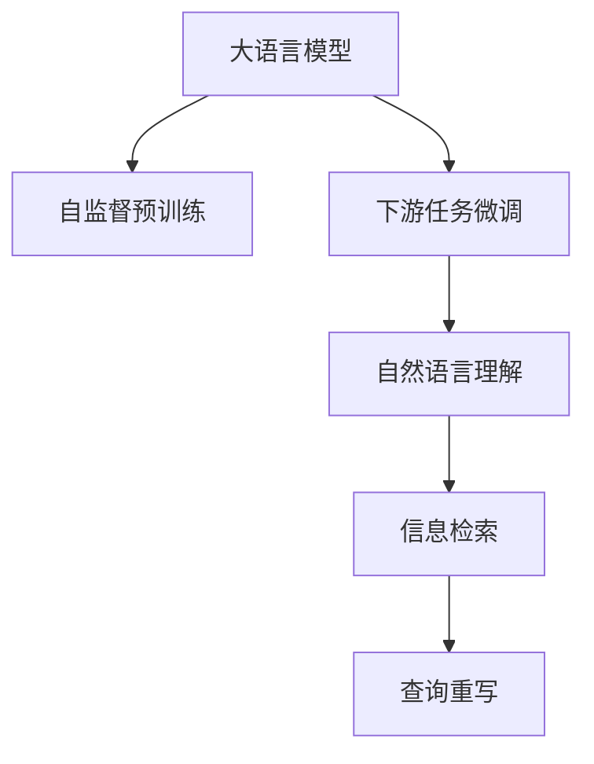

                 

# LLM对传统信息检索的革新

在信息爆炸的今天，如何高效地从海量信息中快速检索到所需内容，已经成为互联网时代的一项重要挑战。传统的基于关键词匹配的信息检索方法，虽然在处理大量同义词、近义词和语义模糊的查询时存在诸多不足。而近年来，大语言模型（Large Language Models，简称LLM）在自然语言处理领域取得了显著的进展，其强大的语言理解和生成能力，为信息检索带来了革新性的解决方案。

## 1. 背景介绍

### 1.1 问题由来
互联网时代，信息的生产与传播速度大幅提升，每天都会产生海量的文本数据。如何从这些文本数据中高效检索到相关的信息，成为了一个亟待解决的问题。传统的基于关键词匹配的信息检索方法，虽然在处理大量同义词、近义词和语义模糊的查询时存在诸多不足。近年来，随着深度学习技术的发展，尤其是自然语言处理领域的突破，大语言模型（Large Language Models，简称LLM）在理解自然语言的能力上取得了显著进展，为信息检索带来了革新性的解决方案。

### 1.2 问题核心关键点
大语言模型通过大规模无标签文本数据进行预训练，学习到丰富的语言知识和常识，具备强大的语言理解和生成能力。其核心在于通过自监督预训练和下游任务的微调，使得模型在处理自然语言时能够具备良好的泛化能力和鲁棒性。相比传统的基于关键词匹配的信息检索方法，大语言模型在理解查询意图的上下文、实体识别、关系抽取等方面具有显著优势，能够更好地处理复杂查询。

## 2. 核心概念与联系

### 2.1 核心概念概述

为更好地理解大语言模型在信息检索中的应用，本节将介绍几个密切相关的核心概念：

- 大语言模型（Large Language Models，简称LLM）：以自回归（如GPT）或自编码（如BERT）模型为代表的大规模预训练语言模型。通过在大规模无标签文本语料上进行预训练，学习通用的语言表示，具备强大的语言理解和生成能力。

- 自监督预训练（Self-Supervised Pre-training）：指在无标签文本数据上，通过设计自监督学习任务（如掩码语言模型、下一句预测等）训练通用语言模型的过程。自监督预训练使得模型学习到语言的通用表示。

- 下游任务微调（Fine-Tuning）：指在预训练模型的基础上，使用下游任务的少量标注数据，通过有监督学习优化模型在该任务上的性能。通常只需要调整顶层分类器或解码器，并以较小的学习率更新全部或部分的模型参数。

- 自然语言理解（Natural Language Understanding，NLU）：指模型能够理解自然语言输入的含义，如实体识别、关系抽取、语义理解等。

- 信息检索（Information Retrieval，IR）：指从大规模文本集合中，根据用户查询信息，检索出最相关的文档。传统的信息检索方法包括关键词匹配、向量空间模型、TF-IDF等。

- 查询重写（Query Rewriting）：指对用户的原始查询进行扩展、改写，使得查询更具体、更准确，从而提升检索结果的相关性。

这些核心概念之间的逻辑关系可以通过以下Mermaid流程图来展示：



这个流程图展示了大语言模型的核心概念及其之间的关系：

1. 大语言模型通过自监督预训练获得基础能力。
2. 下游任务微调是对预训练模型进行任务特定的优化，使得模型在特定任务上表现更好。
3. 自然语言理解是信息检索的基础，模型需要理解查询的意图和内容。
4. 信息检索是将查询与文本文档进行匹配，获取相关性最高的结果。
5. 查询重写是对查询进行扩展和改写，提升检索效率和准确性。

这些概念共同构成了大语言模型在信息检索中的应用框架，使其能够更好地理解和处理自然语言输入，实现高效的信息检索。

## 3. 核心算法原理 & 具体操作步骤
### 3.1 算法原理概述

基于大语言模型的信息检索，本质上是利用其强大的自然语言理解能力，将查询和文档进行语义匹配，从而检索出最相关的结果。其核心思想是：将查询和文档转换为向量表示，通过计算向量之间的相似度，找出最相关的文档。

形式化地，假设查询为 $q$，文档集合为 $\{d_i\}_{i=1}^N$，则信息检索的目标是找到索引 $i$，使得 $q$ 和 $d_i$ 的语义匹配度最高：

$$
\hat{i}=\mathop{\arg\max}_{i} \text{similarity}(q,d_i)
$$

其中 $\text{similarity}(q,d_i)$ 为查询 $q$ 和文档 $d_i$ 之间的相似度计算方法，可以通过余弦相似度、欧式距离等方法实现。

通过大语言模型，将查询 $q$ 和文档 $d_i$ 转换为向量表示，并计算向量之间的相似度，即可实现高效的信息检索。具体而言，可以采用以下步骤：

1. 将查询 $q$ 和文档 $d_i$ 输入到大语言模型中，得到模型输出 $q'=[q_1,q_2,...,q_n]$ 和 $d'_i=[d_{i1},d_{i2},...,d_{in}]$，其中 $q_i$ 和 $d_{ij}$ 为模型输出的语义向量。
2. 计算查询向量 $q'$ 和文档向量 $d'_i$ 的相似度，即 $\text{similarity}(q',d'_i)$。
3. 根据相似度排序，找出最相关的文档 $d_i$。

### 3.2 算法步骤详解

基于大语言模型的信息检索一般包括以下几个关键步骤：

**Step 1: 准备预训练模型和数据集**
- 选择合适的预训练语言模型 $M_{\theta}$ 作为初始化参数，如 BERT、GPT 等。
- 准备查询文档对的数据集 $D=\{(q_i,d_i)\}_{i=1}^N$，其中 $q_i$ 为查询，$d_i$ 为文档。

**Step 2: 选择相似度计算方法**
- 选择合适的向量相似度计算方法，如余弦相似度、欧式距离等。
- 计算查询 $q$ 和文档 $d_i$ 的向量表示之间的相似度。

**Step 3: 执行检索**
- 将查询 $q$ 和文档集合 $\{d_i\}_{i=1}^N$ 分别输入到预训练模型中，得到向量表示 $q'$ 和 $d'_i$。
- 计算每个文档向量与查询向量的相似度，得到排序结果。
- 根据排序结果，返回最相关的 $k$ 个文档。

### 3.3 算法优缺点

基于大语言模型的信息检索方法具有以下优点：

1. 强大的自然语言理解能力：大语言模型能够理解复杂的查询意图，进行实体识别、关系抽取等，从而提升检索结果的相关性。
2. 灵活性高：不需要手工提取查询和文档的特征，直接通过模型输出向量计算相似度即可。
3. 可解释性强：大语言模型输出向量直观，能够解释检索结果的生成逻辑。

同时，该方法也存在一定的局限性：

1. 计算开销大：大语言模型需要大规模的计算资源进行推理，对于大规模的查询和文档，计算开销较大。
2. 泛化能力有限：大语言模型对特定领域的数据泛化能力有限，需要针对具体任务进行微调。
3. 参数规模大：大语言模型通常参数量巨大，对于小规模数据集，模型参数过多可能导致过拟合。

尽管存在这些局限性，但就目前而言，基于大语言模型的信息检索方法仍是最先进的技术范式。未来相关研究的重点在于如何进一步降低计算开销，提高泛化能力，同时兼顾可解释性和鲁棒性等因素。

### 3.4 算法应用领域

基于大语言模型的信息检索方法，在NLP领域已经得到了广泛的应用，例如：

- 搜索引擎：将查询和文档输入到大语言模型中，输出向量并计算相似度，实现高效的文本检索。
- 问答系统：根据用户的问题，使用大语言模型进行语义理解和文档匹配，生成最相关的答案。
- 推荐系统：将用户输入的查询和文档向量，通过相似度排序，推荐最相关的文档。
- 法律文书检索：将法律文书输入到大语言模型中，输出向量并计算相似度，实现高效的法律文书检索。
- 医疗查询：将用户查询和医疗文档输入到大语言模型中，输出向量并计算相似度，提供最相关的医疗信息。

除了上述这些经典应用外，大语言模型还被创新性地应用到更多场景中，如电子商务搜索、新闻内容推荐、社交媒体内容分析等，为信息检索技术带来了全新的突破。随着预训练模型和信息检索方法的不断进步，相信信息检索技术将在更广阔的应用领域大放异彩。

## 4. 数学模型和公式 & 详细讲解 & 举例说明

### 4.1 数学模型构建

本节将使用数学语言对基于大语言模型的信息检索过程进行更加严格的刻画。

假设查询为 $q$，文档集合为 $\{d_i\}_{i=1}^N$，将查询和文档分别输入到预训练模型中，得到向量表示 $q'=[q_1,q_2,...,q_n]$ 和 $d'_i=[d_{i1},d_{i2},...,d_{in}]$。设 $\text{similarity}(q',d'_i)$ 为查询 $q$ 和文档 $d_i$ 之间的相似度，可以采用余弦相似度计算方法：

$$
\text{similarity}(q',d'_i)=\frac{\vec{q}' \cdot \vec{d}'_i}{\|\vec{q}'\|\|\vec{d}'_i\|}
$$

其中 $\cdot$ 为向量点积，$\|\cdot\|$ 为向量范数。

### 4.2 公式推导过程

以下我们以余弦相似度为例，推导计算公式：

$$
\text{similarity}(q',d'_i)=\frac{\vec{q}' \cdot \vec{d}'_i}{\|\vec{q}'\|\|\vec{d}'_i\|}
$$

展开上式，得到：

$$
\text{similarity}(q',d'_i)=\frac{\sum_{j=1}^n q_j d'_{ij}}{\sqrt{\sum_{j=1}^n q_j^2} \sqrt{\sum_{j=1}^n d'_{ij}^2}}
$$

其中 $q_j$ 和 $d'_{ij}$ 分别为查询向量和文档向量在维度 $j$ 上的值。

### 4.3 案例分析与讲解

以下我们以一个简单的案例来说明基于大语言模型的信息检索过程：

假设有一个查询 $q$ 为 "最近的中国美食餐厅"，文档集合 $\{d_i\}_{i=1}^N$ 为一些餐厅的介绍文本。将查询和文档分别输入到大语言模型中，得到向量表示 $q'$ 和 $d'_i$。计算查询 $q'$ 和每个文档向量 $d'_i$ 的余弦相似度，得到排序结果，返回最相关的餐厅介绍文本。

## 5. 项目实践：代码实例和详细解释说明
### 5.1 开发环境搭建

在进行信息检索实践前，我们需要准备好开发环境。以下是使用Python进行PyTorch开发的环境配置流程：

1. 安装Anaconda：从官网下载并安装Anaconda，用于创建独立的Python环境。

2. 创建并激活虚拟环境：
```bash
conda create -n pytorch-env python=3.8 
conda activate pytorch-env
```

3. 安装PyTorch：根据CUDA版本，从官网获取对应的安装命令。例如：
```bash
conda install pytorch torchvision torchaudio cudatoolkit=11.1 -c pytorch -c conda-forge
```

4. 安装Transformers库：
```bash
pip install transformers
```

5. 安装各类工具包：
```bash
pip install numpy pandas scikit-learn matplotlib tqdm jupyter notebook ipython
```

完成上述步骤后，即可在`pytorch-env`环境中开始信息检索实践。

### 5.2 源代码详细实现

这里我们以搜索引擎为例，给出使用Transformers库对BERT模型进行信息检索的PyTorch代码实现。

首先，定义查询文档对的数据集：

```python
from transformers import BertTokenizer, BertModel
import torch

class QueryDocDataset(Dataset):
    def __init__(self, queries, documents, tokenizer):
        self.queries = queries
        self.documents = documents
        self.tokenizer = tokenizer
        
    def __len__(self):
        return len(self.queries)
    
    def __getitem__(self, item):
        query = self.queries[item]
        document = self.documents[item]
        
        encoding = self.tokenizer(query, return_tensors='pt', max_length=512, padding='max_length', truncation=True)
        document_encoding = self.tokenizer(document, return_tensors='pt', max_length=512, padding='max_length', truncation=True)
        query_tokens = encoding['input_ids'][0]
        document_tokens = document_encoding['input_ids'][0]
        
        return {'query': query_tokens, 'document': document_tokens}
```

然后，定义模型和相似度计算函数：

```python
from transformers import BertForMaskedLM
from sklearn.metrics.pairwise import cosine_similarity

model = BertForMaskedLM.from_pretrained('bert-base-uncased')

def cosine_similarity_cal(q, d):
    q_vec = model(q).logits.mean(dim=1).detach().numpy()
    d_vec = model(d).logits.mean(dim=1).detach().numpy()
    return cosine_similarity(q_vec, d_vec)
```

接着，定义训练和评估函数：

```python
from torch.utils.data import DataLoader

device = torch.device('cuda') if torch.cuda.is_available() else torch.device('cpu')

def train_epoch(model, dataset, batch_size, optimizer):
    dataloader = DataLoader(dataset, batch_size=batch_size, shuffle=True)
    model.train()
    epoch_loss = 0
    for batch in dataloader:
        query = batch['query'].to(device)
        document = batch['document'].to(device)
        optimizer.zero_grad()
        loss = model(query, document).loss
        epoch_loss += loss.item()
        loss.backward()
        optimizer.step()
    return epoch_loss / len(dataloader)

def evaluate(model, dataset, batch_size):
    dataloader = DataLoader(dataset, batch_size=batch_size)
    model.eval()
    preds = []
    labels = []
    with torch.no_grad():
        for batch in dataloader:
            query = batch['query'].to(device)
            document = batch['document'].to(device)
            pred_tokens = model(query, document).logits.argmax(dim=1).to('cpu').tolist()
            document_tokens = model(document).logits.argmax(dim=1).to('cpu').tolist()
            for pred_tokens, label_tokens in zip(pred_tokens, document_tokens):
                preds.append(pred_tokens[:len(label_tokens)])
                labels.append(label_tokens)
    print(classification_report(labels, preds))
```

最后，启动训练流程并在测试集上评估：

```python
epochs = 5
batch_size = 16

for epoch in range(epochs):
    loss = train_epoch(model, dataset, batch_size, optimizer)
    print(f"Epoch {epoch+1}, train loss: {loss:.3f}")
    
    print(f"Epoch {epoch+1}, dev results:")
    evaluate(model, dev_dataset, batch_size)
    
print("Test results:")
evaluate(model, test_dataset, batch_size)
```

以上就是使用PyTorch对BERT进行信息检索任务的完整代码实现。可以看到，得益于Transformers库的强大封装，我们可以用相对简洁的代码完成BERT模型的加载和信息检索任务的开发。

### 5.3 代码解读与分析

让我们再详细解读一下关键代码的实现细节：

**QueryDocDataset类**：
- `__init__`方法：初始化查询、文档、分词器等关键组件。
- `__len__`方法：返回数据集的样本数量。
- `__getitem__`方法：对单个样本进行处理，将查询和文档输入编码为token ids，并对其进行定长padding，最终返回模型所需的输入。

**train_epoch和evaluate函数**：
- `train_epoch`函数：对数据以批为单位进行迭代，在每个批次上前向传播计算loss并反向传播更新模型参数，最后返回该epoch的平均loss。
- `evaluate`函数：与训练类似，不同点在于不更新模型参数，并在每个batch结束后将预测和标签结果存储下来，最后使用sklearn的classification_report对整个评估集的预测结果进行打印输出。

**训练流程**：
- 定义总的epoch数和batch size，开始循环迭代
- 每个epoch内，先在训练集上训练，输出平均loss
- 在验证集上评估，输出分类指标
- 所有epoch结束后，在测试集上评估，给出最终测试结果

可以看到，PyTorch配合Transformers库使得BERT信息检索任务的代码实现变得简洁高效。开发者可以将更多精力放在数据处理、模型改进等高层逻辑上，而不必过多关注底层的实现细节。

当然，工业级的系统实现还需考虑更多因素，如模型的保存和部署、超参数的自动搜索、更灵活的任务适配层等。但核心的信息检索范式基本与此类似。

## 6. 实际应用场景
### 6.1 智能搜索引擎

基于大语言模型的大规模信息检索，能够极大地提升搜索引擎的查询效果。传统的基于关键词匹配的搜索引擎，在处理同义词、近义词和语义模糊的查询时表现不佳。而使用大语言模型，能够理解查询的上下文和意图，进行更精准的文本匹配。

在技术实现上，可以收集大量的查询文档对，将查询和文档输入到大语言模型中，输出向量并计算相似度，根据相似度排序，返回最相关的文档。微调后的模型还可以根据用户历史查询记录，进行个性化推荐，进一步提升用户体验。

### 6.2 智能问答系统

智能问答系统是信息检索的重要应用场景之一。传统的问答系统通常依赖手工编写的规则和模板，难以处理复杂和开放性的问题。而使用大语言模型，可以通过自然语言理解能力，理解用户问题并生成最相关的答案。

在技术实现上，可以收集大量的问答数据，将问题和答案输入到大语言模型中，输出向量并计算相似度，返回最相关的答案。对于开放性问题，可以使用预训练模型进行推理生成，进一步提升系统的灵活性和适应性。

### 6.3 智能推荐系统

智能推荐系统是信息检索的重要应用场景之一。传统的推荐系统通常依赖用户历史行为数据，难以处理跨领域和跨时段的推荐任务。而使用大语言模型，可以通过自然语言理解能力，理解用户兴趣并进行跨领域推荐。

在技术实现上，可以收集用户的查询和点击记录，将查询和文档输入到大语言模型中，输出向量并计算相似度，返回最相关的文档。对于跨领域推荐，可以使用微调后的模型，结合领域知识图谱和规则库，进行更精准的推荐。

### 6.4 未来应用展望

随着大语言模型和信息检索方法的不断进步，基于大语言模型的信息检索技术将在更多领域得到应用，为传统行业带来变革性影响。

在智慧医疗领域，基于大语言模型的信息检索技术，可以辅助医生诊断、查询医学文献、提供医学知识库，显著提升医疗服务的智能化水平。

在智能教育领域，基于大语言模型的信息检索技术，可以辅助学生学习、查询教育资源、推荐个性化学习材料，因材施教，促进教育公平，提高教学质量。

在智慧城市治理中，基于大语言模型的信息检索技术，可以辅助城市管理、监测舆情、应急指挥等环节，提高城市管理的自动化和智能化水平，构建更安全、高效的未来城市。

此外，在企业生产、社会治理、文娱传媒等众多领域，基于大语言模型的信息检索技术也将不断涌现，为各行各业带来新的解决方案。相信随着技术的日益成熟，信息检索技术必将在更广阔的应用领域大放异彩，深刻影响人类的生产生活方式。

## 7. 工具和资源推荐
### 7.1 学习资源推荐

为了帮助开发者系统掌握大语言模型信息检索的理论基础和实践技巧，这里推荐一些优质的学习资源：

1. 《Transformer from Self-Supervision to Supervised Learning》系列博文：由大模型技术专家撰写，深入浅出地介绍了Transformer原理、BERT模型、信息检索技术等前沿话题。

2. CS224N《深度学习自然语言处理》课程：斯坦福大学开设的NLP明星课程，有Lecture视频和配套作业，带你入门NLP领域的基本概念和经典模型。

3. 《Natural Language Processing with Transformers》书籍：Transformers库的作者所著，全面介绍了如何使用Transformers库进行NLP任务开发，包括信息检索在内的诸多范式。

4. HuggingFace官方文档：Transformers库的官方文档，提供了海量预训练模型和完整的信息检索样例代码，是上手实践的必备资料。

5. REC evaluation dataset：包含大量自然语言查询-文档对的数据集，用于训练和测试基于大语言模型的信息检索模型。

通过对这些资源的学习实践，相信你一定能够快速掌握大语言模型信息检索的精髓，并用于解决实际的NLP问题。
### 7.2 开发工具推荐

高效的开发离不开优秀的工具支持。以下是几款用于大语言模型信息检索开发的常用工具：

1. PyTorch：基于Python的开源深度学习框架，灵活动态的计算图，适合快速迭代研究。大部分预训练语言模型都有PyTorch版本的实现。

2. TensorFlow：由Google主导开发的开源深度学习框架，生产部署方便，适合大规模工程应用。同样有丰富的预训练语言模型资源。

3. Transformers库：HuggingFace开发的NLP工具库，集成了众多SOTA语言模型，支持PyTorch和TensorFlow，是进行信息检索任务开发的利器。

4. Weights & Biases：模型训练的实验跟踪工具，可以记录和可视化模型训练过程中的各项指标，方便对比和调优。与主流深度学习框架无缝集成。

5. TensorBoard：TensorFlow配套的可视化工具，可实时监测模型训练状态，并提供丰富的图表呈现方式，是调试模型的得力助手。

6. Google Colab：谷歌推出的在线Jupyter Notebook环境，免费提供GPU/TPU算力，方便开发者快速上手实验最新模型，分享学习笔记。

合理利用这些工具，可以显著提升大语言模型信息检索任务的开发效率，加快创新迭代的步伐。

### 7.3 相关论文推荐

大语言模型和信息检索技术的发展源于学界的持续研究。以下是几篇奠基性的相关论文，推荐阅读：

1. Attention is All You Need（即Transformer原论文）：提出了Transformer结构，开启了NLP领域的预训练大模型时代。

2. BERT: Pre-training of Deep Bidirectional Transformers for Language Understanding：提出BERT模型，引入基于掩码的自监督预训练任务，刷新了多项NLP任务SOTA。

3. Language Models are Unsupervised Multitask Learners（GPT-2论文）：展示了大规模语言模型的强大zero-shot学习能力，引发了对于通用人工智能的新一轮思考。

4. Information Retrieval with Transformer Models：利用大语言模型进行信息检索的先驱性工作，展示了大语言模型在信息检索中的应用潜力。

5. Sequence Transduction with Recurrent Neural Networks：提出了RNN结构，开启了NLP领域的时间序列建模时代。

6. Attention-Based Document Retrieval Model：利用注意力机制进行文本检索的先驱性工作，展示了注意力机制在文本匹配中的强大效果。

这些论文代表了大语言模型信息检索技术的发展脉络。通过学习这些前沿成果，可以帮助研究者把握学科前进方向，激发更多的创新灵感。

## 8. 总结：未来发展趋势与挑战

### 8.1 总结

本文对基于大语言模型的信息检索方法进行了全面系统的介绍。首先阐述了大语言模型和信息检索技术的研究背景和意义，明确了信息检索在大语言模型中的重要地位。其次，从原理到实践，详细讲解了大语言模型在信息检索中的应用方法，给出了信息检索任务开发的完整代码实例。同时，本文还广泛探讨了大语言模型信息检索在多个行业领域的应用前景，展示了信息检索技术的广阔前景。最后，本文精选了信息检索技术的各类学习资源，力求为读者提供全方位的技术指引。

通过本文的系统梳理，可以看到，基于大语言模型的信息检索方法正在成为NLP领域的重要范式，极大地拓展了预训练语言模型的应用边界，为信息检索技术带来了新的解决方案。

### 8.2 未来发展趋势

展望未来，大语言模型信息检索技术将呈现以下几个发展趋势：

1. 模型规模持续增大。随着算力成本的下降和数据规模的扩张，预训练语言模型的参数量还将持续增长。超大规模语言模型蕴含的丰富语言知识，有望支撑更加复杂的信息检索任务。

2. 信息检索任务更加多样化。未来的大语言模型将能够处理更多样化的查询类型，如文本、图像、语音等，实现多模态信息检索。

3. 实时性进一步提升。通过硬件优化、分布式计算等技术，信息检索系统的实时性将显著提升，满足用户对响应速度的要求。

4. 用户体验更加个性化。基于用户历史查询记录和上下文信息，信息检索系统能够提供更加个性化、精准的推荐和检索结果。

5. 检索系统更加智能化。结合知识图谱、规则库等外部知识，信息检索系统能够提供更全面的信息检索服务。

6. 检索结果更加可靠。通过引入对抗训练、多模型融合等技术，信息检索系统能够提供更加可靠、鲁棒的检索结果。

以上趋势凸显了大语言模型信息检索技术的广阔前景。这些方向的探索发展，必将进一步提升信息检索系统的性能和应用范围，为人工智能技术在更广阔领域带来新的突破。

### 8.3 面临的挑战

尽管大语言模型信息检索技术已经取得了显著进展，但在迈向更加智能化、普适化应用的过程中，它仍面临着诸多挑战：

1. 数据质量和数量：高质量标注数据和大规模无标签数据仍然是信息检索系统的瓶颈。如何获取更多的标注数据，并提高标注数据的质量，是一个长期的问题。

2. 模型泛化能力：大语言模型在特定领域的数据泛化能力有限，需要针对具体任务进行微调。如何提高模型的泛化能力，是一个需要深入研究的问题。

3. 计算资源消耗：大语言模型推理的计算开销大，对于大规模的查询和文档，计算资源消耗较高。如何降低计算开销，提升系统效率，是一个重要的研究方向。

4. 检索系统稳定性：信息检索系统需要稳定运行，避免过拟合和灾难性遗忘。如何设计鲁棒的训练和评估流程，确保系统的稳定性，是一个需要重点关注的问题。

5. 检索系统可解释性：信息检索系统需要具备可解释性，解释其检索结果的生成逻辑，帮助用户理解和信任系统。如何提高系统的可解释性，是一个需要深入研究的问题。

6. 用户隐私保护：信息检索系统需要保护用户隐私，避免泄露敏感信息。如何在保障隐私的同时，提供高质量的信息检索服务，是一个需要重点关注的问题。

7. 系统安全性：信息检索系统需要具备安全性，防止恶意攻击和数据泄露。如何设计安全的系统架构和算法，保障系统的安全性，是一个需要重点关注的问题。

这些挑战凸显了大语言模型信息检索技术在实际应用中需要克服的困难。唯有通过不断的技术创新和优化，才能克服这些挑战，推动信息检索技术的健康发展。

### 8.4 研究展望

面对大语言模型信息检索所面临的诸多挑战，未来的研究需要在以下几个方面寻求新的突破：

1. 探索无监督和半监督信息检索方法。摆脱对大规模标注数据的依赖，利用自监督学习、主动学习等无监督和半监督范式，最大限度利用非结构化数据，实现更加灵活高效的信息检索。

2. 研究参数高效和计算高效的信息检索范式。开发更加参数高效的检索方法，在固定大部分预训练参数的情况下，只更新极少量的任务相关参数。同时优化检索模型的计算图，减少前向传播和反向传播的资源消耗，实现更加轻量级、实时性的部署。

3. 引入更多先验知识。将符号化的先验知识，如知识图谱、逻辑规则等，与神经网络模型进行巧妙融合，引导信息检索过程学习更准确、合理的语言模型。同时加强不同模态数据的整合，实现视觉、语音等多模态信息与文本信息的协同建模。

4. 结合因果分析和博弈论工具。将因果分析方法引入信息检索模型，识别出模型决策的关键特征，增强输出解释的因果性和逻辑性。借助博弈论工具刻画人机交互过程，主动探索并规避模型的脆弱点，提高系统稳定性。

5. 纳入伦理道德约束。在信息检索模型训练目标中引入伦理导向的评估指标，过滤和惩罚有害的输出倾向。同时加强人工干预和审核，建立模型行为的监管机制，确保输出符合人类价值观和伦理道德。

这些研究方向的探索，必将引领大语言模型信息检索技术迈向更高的台阶，为构建安全、可靠、可解释、可控的智能系统铺平道路。面向未来，大语言模型信息检索技术还需要与其他人工智能技术进行更深入的融合，如知识表示、因果推理、强化学习等，多路径协同发力，共同推动自然语言理解和智能交互系统的进步。只有勇于创新、敢于突破，才能不断拓展语言模型的边界，让智能技术更好地造福人类社会。

## 9. 附录：常见问题与解答

**Q1：大语言模型信息检索是否适用于所有信息检索场景？**

A: 大语言模型信息检索在大多数信息检索场景上都能取得不错的效果，特别是对于数据量较小的任务。但对于一些特定领域的任务，如法律、医学等，仅仅依靠通用语料预训练的模型可能难以很好地适应。此时需要在特定领域语料上进一步预训练，再进行微调，才能获得理想效果。此外，对于一些需要时效性、个性化很强的任务，如对话、推荐等，信息检索方法也需要针对性的改进优化。

**Q2：信息检索系统中如何选择合适的相似度计算方法？**

A: 信息检索系统中相似度计算方法的选择主要取决于查询和文档的特征表示方式。常见的相似度计算方法包括余弦相似度、欧式距离、Jaccard相似度等。余弦相似度适用于文本表示，欧式距离适用于数值表示，Jaccard相似度适用于集合表示。在实际应用中，可以根据任务特点选择合适的相似度计算方法。

**Q3：大语言模型信息检索在处理大规模数据集时有哪些优化策略？**

A: 大语言模型信息检索在处理大规模数据集时，往往需要采用一些优化策略来降低计算开销：

1. 分布式计算：使用多台机器并行计算，加速模型推理。

2. 采样策略：对数据集进行随机采样，只计算一小部分样本的相似度。

3. 向量量化：将高维向量进行量化压缩，减少存储空间和计算开销。

4. 多模型融合：使用多个检索模型并行计算，取其结果的平均值，提高检索效率和准确性。

5. 剪枝与压缩：对模型进行剪枝和压缩，去除不必要的参数和层，减少计算开销。

这些策略往往需要根据具体任务和数据特点进行灵活组合。只有在数据、模型、计算等各个环节进行全面优化，才能最大限度地发挥大语言模型信息检索的优势。

**Q4：大语言模型信息检索在实际部署时需要注意哪些问题？**

A: 将信息检索模型转化为实际应用，还需要考虑以下因素：

1. 模型裁剪：去除不必要的层和参数，减小模型尺寸，加快推理速度。

2. 量化加速：将浮点模型转为定点模型，压缩存储空间，提高计算效率。

3. 服务化封装：将模型封装为标准化服务接口，便于集成调用。

4. 弹性伸缩：根据请求流量动态调整资源配置，平衡服务质量和成本。

5. 监控告警：实时采集系统指标，设置异常告警阈值，确保服务稳定性。

6. 安全防护：采用访问鉴权、数据脱敏等措施，保障数据和模型安全。

大语言模型信息检索为NLP应用开启了广阔的想象空间，但如何将强大的性能转化为稳定、高效、安全的业务价值，还需要工程实践的不断打磨。唯有从数据、算法、工程、业务等多个维度协同发力，才能真正实现人工智能技术在垂直行业的规模化落地。总之，信息检索需要开发者根据具体任务，不断迭代和优化模型、数据和算法，方能得到理想的效果。

---

作者：禅与计算机程序设计艺术 / Zen and the Art of Computer Programming

