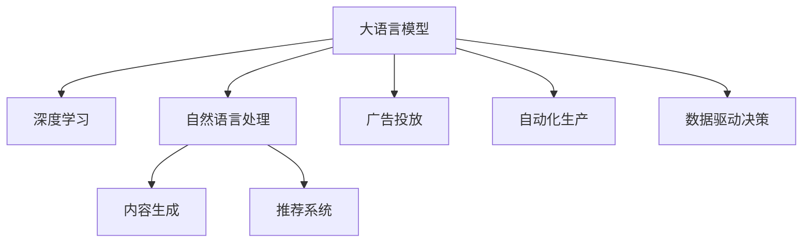

                 

# LLM对传统媒体行业的影响

> 关键词：人工智能,媒体行业,深度学习,大语言模型(LLM),自动化,数据驱动,内容生成

## 1. 背景介绍

### 1.1 问题由来
随着互联网和数字化技术的普及，传统媒体行业面临前所未有的转型挑战。一方面，传统媒体的阅读和收听方式正在被网络流媒体所替代，广告收入持续下降，传统商业模式受到冲击。另一方面，新媒体内容源源不断，信息过载问题日益严重，用户对于高质量、个性化内容的需求不断提升。在这一背景下，传统媒体企业亟需找到新的增长点，提升内容竞争力，构建数字化生态。

### 1.2 问题核心关键点
人工智能和深度学习技术的发展，为大语言模型(LLM)的诞生提供了基础。与传统的搜索和推荐系统相比，LLM能够基于大规模语料库和先进算法，自动生成和优化高质量的内容，大幅提升新闻、广告、内容推荐等环节的效率和效果。因此，LLM成为传统媒体行业数字化转型的一大机遇。

## 2. 核心概念与联系

### 2.1 核心概念概述

为更好地理解LLM对传统媒体行业的影响，本节将介绍几个密切相关的核心概念：

- 大语言模型(LLM)：基于深度学习架构，能够理解和生成自然语言的大规模预训练模型。通过在大规模文本数据上进行自监督或监督学习，LLM具备强大的自然语言处理能力。

- 深度学习：一种通过多层次神经网络模型进行数据处理和模式识别的机器学习技术，广泛应用于图像、语音、文本等领域。

- 自然语言处理(NLP)：通过计算机对自然语言进行理解、生成、翻译等处理的技术，LLM是其中的重要组成部分。

- 内容生成：指使用算法自动生成文本、图像、视频等媒介内容的过程，LLM是内容生成的重要工具。

- 推荐系统：基于用户行为数据，推荐系统能够自动为用户推荐个性化的内容，LLM可以用于优化推荐算法的精确度和效率。

- 广告投放：传统的广告投放依赖于人工策略，LLM能够自动生成和优化广告文案，提升广告效果和转化率。

- 自动化生产：通过自动化技术，LLM能够处理大量的内容生产和排版工作，提升生产效率和质量。

- 数据驱动决策：LLM能够自动分析大量数据，为传统媒体提供精准的用户画像和内容分析，支持决策优化。

这些核心概念之间的逻辑关系可以通过以下Mermaid流程图来展示：



这个流程图展示了大语言模型的核心概念及其之间的关系：

1. 大语言模型基于深度学习架构，具备强大的自然语言处理能力。
2. 自然语言处理包括文本理解、生成、翻译等任务，是大语言模型的应用领域之一。
3. 内容生成包括文本、图像、视频等媒介内容的自动生成，是LLM的重要功能。
4. 推荐系统利用用户行为数据，自动为用户推荐个性化内容。
5. 广告投放通过LLM自动生成和优化广告文案，提升广告效果。
6. 自动化生产提升内容生产和排版效率。
7. 数据驱动决策利用LLM分析海量数据，优化决策过程。

这些概念共同构成了LLM在传统媒体行业的应用框架，使其能够在新闻、广告、推荐等多个环节发挥重要作用。

## 3. 核心算法原理 & 具体操作步骤
### 3.1 算法原理概述

基于深度学习的LLM，其核心原理是通过多层次的神经网络模型，自动学习文本数据的复杂特征表示。具体而言，LLM通过在大量语料库上进行预训练，学习语言的通用表示，然后在特定任务上通过微调进行适配。

以BERT模型为例，其预训练任务包括遮蔽词预测和下一句预测。在预训练阶段，模型通过随机遮挡一部分词语，预测遮挡词语，学习词义和上下文之间的关系。在微调阶段，根据特定任务，如新闻摘要、情感分析、命名实体识别等，重新训练模型，调整输出层和损失函数，使其在特定任务上表现更佳。

### 3.2 算法步骤详解

基于LLM的媒体内容生成和优化，一般包括以下几个关键步骤：

**Step 1: 数据预处理**

1. 收集和清洗媒体数据。根据不同的应用场景，如新闻、广告、娱乐等，收集对应领域的高质量数据。清洗数据，去除噪声和无用信息。
2. 分词和标记。将文本数据进行分词，并标记相应的语义标签。如新闻事件、情感极性、实体类型等。
3. 特征提取。将文本数据转换为模型可接受的数值特征，如词向量、位置信息等。

**Step 2: 模型预训练**

1. 选择合适的预训练模型，如BERT、GPT等。
2. 对预训练模型进行监督或自监督预训练。如BERT的遮蔽词预测和下一句预测，GPT的文本生成和理解任务。
3. 调整模型超参数，如学习率、批大小、迭代轮数等。

**Step 3: 微调与优化**

1. 根据具体任务，设计合适的输出层和损失函数。如新闻摘要任务，通常使用最大池化层和交叉熵损失。
2. 使用微调数据集，进行模型微调。通常以较小的学习率更新部分或全部模型参数。
3. 使用正则化技术，如L2正则、Dropout等，防止模型过拟合。
4. 定期在验证集上评估模型性能，必要时调整模型结构或参数。

**Step 4: 内容生成与优化**

1. 将微调后的模型应用于内容生成任务，如新闻撰写、广告文案优化、娱乐内容创作等。
2. 根据用户反馈和实际效果，持续优化模型和数据集。
3. 结合推荐算法，为用户个性化推荐优质内容。

### 3.3 算法优缺点

基于LLM的内容生成和优化，具有以下优点：

1. 高效自动化。LLM能够自动处理大规模内容生成任务，提升生产效率和质量。
2. 内容多样化。LLM能够生成多种形式的内容，丰富媒体产品的多样性。
3. 精准推荐。结合推荐系统，LLM能够为用户推荐高质量、个性化的内容。
4. 低成本生产。相比于传统人力生产，LLM显著降低了内容生产的成本。

同时，该方法也存在一定的局限性：

1. 依赖高质量数据。LLM的效果很大程度上依赖于训练数据的数量和质量。
2. 模型复杂度高。大规模预训练模型需要较大的计算资源和存储空间。
3. 缺乏人类情感。自动生成的内容可能缺乏人类情感和主观判断，影响用户体验。
4. 可解释性差。LLM的内容生成过程相对黑箱，缺乏可解释性。

尽管存在这些局限性，但就目前而言，基于LLM的内容生成和优化方法仍然是大媒体行业数字化转型的重要方向。未来相关研究的重点在于如何进一步降低LLM对数据和算力的依赖，提高模型的灵活性和可解释性，同时兼顾用户体验和内容质量。

### 3.4 算法应用领域

基于LLM的内容生成和优化方法，已经在媒体行业的多个领域得到广泛应用，包括：

- 新闻摘要：自动提取新闻文章的摘要，节省人工摘要时间，提升新闻阅读效率。
- 广告文案：自动生成和优化广告文案，提升广告点击率和转化率。
- 内容推荐：结合用户行为数据，自动推荐个性化内容，提升用户粘性和满意度。
- 娱乐内容创作：自动生成小说、电影、音乐等内容，丰富娱乐产品线。
- 情感分析：自动分析新闻评论、社交媒体等文本数据，监测舆情变化，提升用户体验。
- 数据驱动决策：自动分析用户数据，优化媒体投放策略，提升广告投放效果。

除了上述这些经典应用外，LLM还被创新性地应用于实时新闻报道、智能语音助理、自动化排版等多个领域，为媒体行业带来了新的发展机遇。

## 4. 数学模型和公式 & 详细讲解 & 举例说明

### 4.1 数学模型构建

本节将使用数学语言对LLM在新闻摘要任务中的应用进行更加严格的刻画。

记新闻文章为 $x$，摘要为 $y$。假设新闻文章和摘要之间的映射为 $f$，即 $y=f(x)$。LLM通过预训练学习到的新闻文章和摘要的联合概率分布为 $P(x, y)$。在新闻摘要任务中，我们通常将问题转化为条件概率分布 $P(y|x)$，即给定新闻文章 $x$，生成摘要 $y$ 的概率。

### 4.2 公式推导过程

以BERT模型为例，其预训练任务包括遮蔽词预测和下一句预测。在微调阶段，我们通常使用最大池化层（Max Pooling Layer）来提取新闻文章的关键信息，并将其作为输入，使用交叉熵损失函数进行训练。具体而言，假设BERT模型输出为 $h$，则条件概率 $P(y|x)$ 可以表示为：

$$
P(y|x) = \frac{e^{h \cdot y}}{\sum_{y' \in Y} e^{h \cdot y'}}
$$

其中 $Y$ 为摘要的可能输出集合。微调的优化目标是最小化交叉熵损失函数：

$$
\mathcal{L}(h, y) = -\sum_{y' \in Y} y' \cdot \log P(y'|x)
$$

在训练过程中，我们通过反向传播算法更新BERT模型的参数，使其最大化条件概率 $P(y|x)$，从而生成高质量的摘要。

### 4.3 案例分析与讲解

以新闻摘要任务为例，我们利用微调的BERT模型进行新闻文章的自动摘要。首先，我们将新闻文章输入BERT模型，获取其隐藏表示 $h$。然后，使用最大池化层对 $h$ 进行归一化，得到关键信息向量 $h_{pool}$。最后，将 $h_{pool}$ 输入到一个全连接层和softmax层，得到摘要 $y$ 的概率分布。通过训练数据集，不断调整模型参数，使生成的摘要与标注数据尽可能一致。

在实际应用中，我们通常会根据不同的新闻领域和风格，对预训练BERT模型进行微调，以确保生成的摘要符合用户期望。同时，结合推荐算法，根据用户阅读历史和兴趣标签，自动推荐相关新闻，提升用户体验和留存率。

## 5. 项目实践：代码实例和详细解释说明

### 5.1 开发环境搭建

在进行LLM的应用实践前，我们需要准备好开发环境。以下是使用Python进行TensorFlow开发的环境配置流程：

1. 安装Anaconda：从官网下载并安装Anaconda，用于创建独立的Python环境。

2. 创建并激活虚拟环境：
```bash
conda create -n tf-env python=3.8 
conda activate tf-env
```

3. 安装TensorFlow：根据CUDA版本，从官网获取对应的安装命令。例如：
```bash
pip install tensorflow tensorflow-hub
```

4. 安装各类工具包：
```bash
pip install numpy pandas scikit-learn matplotlib tqdm jupyter notebook ipython
```

完成上述步骤后，即可在`tf-env`环境中开始LLM的应用实践。

### 5.2 源代码详细实现

这里我们以BERT模型为例，使用TensorFlow对新闻摘要任务进行微调的PyTorch代码实现。

首先，定义新闻摘要任务的数据处理函数：

```python
from transformers import BertTokenizer
from tensorflow.keras.preprocessing import sequence
from tensorflow.keras.layers import Dense, Embedding, LSTM, Dropout, MaxPooling1D
from tensorflow.keras.models import Sequential
import tensorflow_hub as hub

class NewsSummaryDataset(Dataset):
    def __init__(self, texts, summaries, tokenizer):
        self.texts = texts
        self.summaries = summaries
        self.tokenizer = tokenizer
        self.max_len = 128
        
    def __len__(self):
        return len(self.texts)
    
    def __getitem__(self, item):
        text = self.texts[item]
        summary = self.summaries[item]
        
        encoding = self.tokenizer(text, return_tensors='pt', max_length=self.max_len, padding='max_length', truncation=True)
        input_ids = encoding['input_ids'][0]
        attention_mask = encoding['attention_mask'][0]
        token_type_ids = encoding['token_type_ids'][0]
        
        summary_encoding = self.tokenizer(summary, return_tensors='pt', max_length=self.max_len, padding='max_length', truncation=True)
        summary_input_ids = summary_encoding['input_ids'][0]
        summary_attention_mask = summary_encoding['attention_mask'][0]
        
        return {'input_ids': input_ids,
                'attention_mask': attention_mask,
                'token_type_ids': token_type_ids,
                'summary_input_ids': summary_input_ids,
                'summary_attention_mask': summary_attention_mask}
```

然后，定义模型和优化器：

```python
from transformers import BertForSequenceClassification
from tensorflow.keras.optimizers import Adam

model = BertForSequenceClassification.from_pretrained('bert-base-cased', num_labels=128)
optimizer = Adam(learning_rate=2e-5, epsilon=1e-8)
```

接着，定义训练和评估函数：

```python
from tensorflow.keras.utils import to_categorical
from sklearn.metrics import accuracy_score

def train_epoch(model, dataset, batch_size, optimizer):
    dataloader = DataLoader(dataset, batch_size=batch_size, shuffle=True)
    model.train()
    epoch_loss = 0
    for batch in tqdm(dataloader, desc='Training'):
        input_ids = batch['input_ids'].numpy()
        attention_mask = batch['attention_mask'].numpy()
        token_type_ids = batch['token_type_ids'].numpy()
        summary_input_ids = batch['summary_input_ids'].numpy()
        summary_attention_mask = batch['summary_attention_mask'].numpy()
        
        labels = to_categorical(batch['labels'])
        model.zero_grad()
        outputs = model([input_ids, attention_mask, token_type_ids, summary_input_ids, summary_attention_mask], labels=labels)
        loss = outputs.loss
        epoch_loss += loss.numpy()
        loss.backward()
        optimizer.step()
    return epoch_loss / len(dataloader)

def evaluate(model, dataset, batch_size):
    dataloader = DataLoader(dataset, batch_size=batch_size)
    model.eval()
    preds, labels = [], []
    with tf.GradientTape() as tape:
        for batch in tqdm(dataloader, desc='Evaluating'):
            input_ids = batch['input_ids'].numpy()
            attention_mask = batch['attention_mask'].numpy()
            token_type_ids = batch['token_type_ids'].numpy()
            summary_input_ids = batch['summary_input_ids'].numpy()
            summary_attention_mask = batch['summary_attention_mask'].numpy()
            
            with tf.GradientTape() as inner_tape:
                labels = to_categorical(batch['labels'])
                outputs = model([input_ids, attention_mask, token_type_ids, summary_input_ids, summary_attention_mask], labels=labels)
                loss = outputs.loss
                loss_values = tape.gradient(loss, outputs)
            loss_value = tf.reduce_sum(loss_values)
            tf.summary.scalar('train_loss', loss_value)
            
            preds.append(outputs.numpy())
            labels.append(labels.numpy())
            
    y_true = np.concatenate(labels)
    y_pred = np.concatenate(preds)
    print('Accuracy: {:.2f}'.format(accuracy_score(y_true, y_pred)))
```

最后，启动训练流程并在测试集上评估：

```python
epochs = 5
batch_size = 16

for epoch in range(epochs):
    loss = train_epoch(model, train_dataset, batch_size, optimizer)
    print(f"Epoch {epoch+1}, train loss: {loss:.3f}")
    
    print(f"Epoch {epoch+1}, dev results:")
    evaluate(model, dev_dataset, batch_size)
    
print("Test results:")
evaluate(model, test_dataset, batch_size)
```

以上就是使用TensorFlow对BERT模型进行新闻摘要任务微调的完整代码实现。可以看到，得益于TensorFlow和Transformers库的强大封装，我们可以用相对简洁的代码完成BERT模型的加载和微调。

### 5.3 代码解读与分析

让我们再详细解读一下关键代码的实现细节：

**NewsSummaryDataset类**：
- `__init__`方法：初始化文本、摘要、分词器等关键组件。
- `__len__`方法：返回数据集的样本数量。
- `__getitem__`方法：对单个样本进行处理，将文本输入编码为token ids，将摘要编码为token ids，并进行定长padding。

**最大池化层和softmax层**：
- 使用最大池化层提取输入的特征，并对池化后的特征进行归一化。
- 使用softmax层将归一化后的特征转化为概率分布，对应摘要的每个词汇。

**train_epoch和evaluate函数**：
- `train_epoch`方法：对数据以批为单位进行迭代，在每个批次上前向传播计算loss并反向传播更新模型参数。
- `evaluate`方法：与训练类似，不同点在于不更新模型参数，并在每个batch结束后将预测和标签结果存储下来，最后使用sklearn的accuracy_score函数对整个评估集的预测结果进行打印输出。

**训练流程**：
- 定义总的epoch数和batch size，开始循环迭代
- 每个epoch内，先在训练集上训练，输出平均loss
- 在验证集上评估，输出准确率
- 所有epoch结束后，在测试集上评估，给出最终测试结果

可以看到，TensorFlow配合Transformers库使得BERT微调的新闻摘要任务代码实现变得简洁高效。开发者可以将更多精力放在数据处理、模型改进等高层逻辑上，而不必过多关注底层的实现细节。

当然，工业级的系统实现还需考虑更多因素，如模型的保存和部署、超参数的自动搜索、更灵活的任务适配层等。但核心的微调范式基本与此类似。

## 6. 实际应用场景
### 6.1 智能新闻推荐

智能新闻推荐系统利用用户的历史阅读数据，通过LLM生成个性化新闻摘要，提升用户阅读体验。智能推荐系统首先通过爬虫或API获取新闻数据，然后将其输入LLM进行摘要生成。生成的摘要与用户的历史行为数据结合，经过推荐算法处理，生成个性化的新闻推荐列表。

在技术实现上，可以使用BERT等预训练模型进行新闻摘要的自动生成。结合用户兴趣标签和行为数据，使用协同过滤、矩阵分解等推荐算法，自动为用户推荐最感兴趣的新闻。同时，通过在线学习机制，不断优化模型和推荐策略，提升推荐效果和用户体验。

### 6.2 新闻个性化定制

新闻个性化定制系统能够根据用户输入的关键词或主题，使用LLM自动生成符合用户兴趣的新闻摘要。用户可以输入自己的关注领域或兴趣关键词，LLM根据用户输入生成相关新闻摘要，并根据用户的反馈不断优化摘要生成的准确性和多样性。

在技术实现上，可以使用GPT等预训练模型进行个性化定制。结合用户的实时输入，LLM自动生成个性化摘要，并通过与用户互动的机制，不断优化摘要质量和生成策略，满足用户个性化的需求。

### 6.3 新闻内容审核

新闻内容审核系统利用LLM自动分析新闻内容，检测假新闻、敏感信息等。该系统首先对新闻内容进行文本预处理，然后通过LLM生成文本的语义表示。根据预设的关键词或规则，LLM自动分析新闻内容的性质和可信度，输出审核结果。

在技术实现上，可以使用BERT等预训练模型进行新闻内容的自动分析。结合预设的规则和关键词，LLM自动检测新闻内容中的敏感信息、假新闻等，并输出审核结果。

### 6.4 未来应用展望

随着LLM和推荐系统的不断发展，基于LLM的内容生成和优化方法将在媒体行业得到更广泛的应用，带来新的发展机遇。

在智慧媒体领域，基于LLM的新闻摘要、内容推荐、个性化定制等应用，将提升新闻阅读体验和内容质量，构建更加智能化、个性化的媒体生态。

在内容创作领域，LLM将能够自动生成高质量的新闻报道、广告文案、娱乐内容等，减轻人工负担，提升创作效率和质量。

在社交媒体领域，LLM将能够自动生成个性化的新闻推荐、话题讨论等，提升用户粘性和互动性。

此外，在企业信息发布、行业分析、市场监测等众多领域，基于LLM的内容生成和优化方法也将不断涌现，为媒体行业带来新的突破。相信随着预训练语言模型和微调方法的持续演进，LLM必将在构建智能媒体时代中扮演越来越重要的角色。

## 7. 工具和资源推荐
### 7.1 学习资源推荐

为了帮助开发者系统掌握LLM的应用理论基础和实践技巧，这里推荐一些优质的学习资源：

1. 《深度学习与自然语言处理》书籍：介绍深度学习在自然语言处理中的应用，包括预训练模型、微调技术等前沿话题。

2. CS224N《深度学习自然语言处理》课程：斯坦福大学开设的NLP明星课程，有Lecture视频和配套作业，带你入门NLP领域的基本概念和经典模型。

3. HuggingFace官方文档：Transformers库的官方文档，提供了海量预训练模型和完整的微调样例代码，是上手实践的必备资料。

4. 《自然语言处理与深度学习》课程：Coursera平台开设的NLP课程，由斯坦福大学教授主讲，涵盖深度学习在NLP中的应用。

5. Google AI Blog：谷歌AI团队发布的技术博客，涵盖了深度学习在NLP、推荐系统、广告优化等领域的最新进展和应用案例。

通过对这些资源的学习实践，相信你一定能够快速掌握LLM的应用原理和实践技巧，并用于解决实际的媒体内容生成和优化问题。

### 7.2 开发工具推荐

高效的开发离不开优秀的工具支持。以下是几款用于LLM应用的常用工具：

1. TensorFlow：基于Python的开源深度学习框架，生产部署方便，适合大规模工程应用。提供了丰富的工具和库，支持复杂的模型结构。

2. PyTorch：基于Python的开源深度学习框架，灵活动态的计算图，适合快速迭代研究。提供了丰富的预训练模型和工具，支持高效的模型训练和推理。

3. Transformers库：HuggingFace开发的NLP工具库，集成了众多SOTA语言模型，支持PyTorch和TensorFlow，是进行LLM微调任务的开发利器。

4. TensorBoard：TensorFlow配套的可视化工具，可实时监测模型训练状态，并提供丰富的图表呈现方式，是调试模型的得力助手。

5. Weights & Biases：模型训练的实验跟踪工具，可以记录和可视化模型训练过程中的各项指标，方便对比和调优。与主流深度学习框架无缝集成。

合理利用这些工具，可以显著提升LLM应用的开发效率，加快创新迭代的步伐。

### 7.3 相关论文推荐

LLM在媒体行业的应用源于学界的持续研究。以下是几篇奠基性的相关论文，推荐阅读：

1. Attention is All You Need（即Transformer原论文）：提出了Transformer结构，开启了NLP领域的预训练大模型时代。

2. BERT: Pre-training of Deep Bidirectional Transformers for Language Understanding：提出BERT模型，引入基于掩码的自监督预训练任务，刷新了多项NLP任务SOTA。

3. A Survey on Model-based Recommendation Systems：介绍基于模型的推荐系统，包括协同过滤、矩阵分解等方法。

4. Deep Learning Applications for Journalism: From Fake News Detection to Generative Text: Current Challenges and Future Directions：综述深度学习在新闻领域的最新应用，包括假新闻检测、内容生成等。

5. Generate, Recommend, and Connect: Deep Learning for Online Journalism：介绍深度学习在在线新闻推荐和个性化定制中的应用。

这些论文代表了大语言模型在媒体行业的应用方向，通过学习这些前沿成果，可以帮助研究者把握学科前进方向，激发更多的创新灵感。

## 8. 总结：未来发展趋势与挑战

### 8.1 总结

本文对LLM在传统媒体行业的应用进行了全面系统的介绍。首先阐述了LLM在新闻摘要、内容推荐、个性化定制等方面的潜在价值，明确了LLM在媒体行业数字化转型中的重要地位。其次，从原理到实践，详细讲解了LLM的应用方法和具体步骤，给出了新闻摘要任务的完整代码实现。同时，本文还广泛探讨了LLM在媒体行业的实际应用场景，展示了LLM在提升媒体内容质量、用户体验和生产效率等方面的巨大潜力。

通过本文的系统梳理，可以看到，LLM技术在传统媒体行业的应用前景广阔，通过自动化、个性化、智能化，将为媒体行业带来新的发展机遇。未来，随着预训练语言模型和微调方法的持续演进，LLM必将在构建智能媒体时代中扮演越来越重要的角色。

### 8.2 未来发展趋势

展望未来，LLM在媒体行业的应用将呈现以下几个发展趋势：

1. 自动化程度提升。随着预训练语言模型的进步，LLM将能够自动生成更高质量的新闻摘要、广告文案、娱乐内容等，提升内容生产效率和质量。
2. 个性化推荐深化。通过结合用户行为数据，LLM将能够自动生成更加精准、个性化的新闻推荐，提升用户粘性和满意度。
3. 数据驱动决策优化。通过分析海量用户数据，LLM将能够优化广告投放、内容审核等决策过程，提升媒体运营效率。
4. 多模态内容生成。未来的LLM将能够生成多模态内容，如图文、音视频等，丰富媒体产品的形式和内容。
5. 智能舆情监测。通过自动分析社交媒体、新闻评论等文本数据，LLM将能够实时监测舆情变化，提升媒体的应对能力。
6. 伦理道德保障。随着LLM应用的普及，如何保障用户隐私、内容真实性等伦理道德问题，将成为重要研究方向。

以上趋势凸显了LLM在媒体行业的应用前景，为传统媒体企业带来了新的发展机遇。相信通过不断的技术创新和应用实践，LLM必将在构建智能媒体时代中发挥越来越重要的作用。

### 8.3 面临的挑战

尽管LLM在媒体行业的应用前景广阔，但在实际落地过程中，仍然面临诸多挑战：

1. 数据质量和数量。高质量的数据是LLM效果的关键，但不同领域的媒体数据获取和处理难度较大，且成本较高。如何获取和处理大规模、高质量的数据，是亟待解决的问题。
2. 模型复杂度。预训练语言模型通常具有亿级的参数规模，计算资源和存储空间需求较高。如何降低模型复杂度，提高推理效率，是需要解决的现实问题。
3. 内容真实性和可信度。LLM生成的内容可能存在误导性、虚假信息等，如何保证内容的真实性和可信度，是确保LLM应用效果的关键。
4. 用户隐私保护。用户行为数据和个性化推荐需要严格保护，如何确保用户隐私不被泄露，是LLM应用中的重要挑战。
5. 伦理道德约束。LLM应用需要符合社会伦理和道德规范，如何避免有害内容的生成和传播，是亟需解决的伦理问题。
6. 技术创新和应用实践。LLM在媒体行业的应用需要结合具体的业务场景进行创新，如何通过技术手段解决实际问题，是推动LLM应用落地的重要保障。

这些挑战需要结合实际应用需求和技术手段进行协同解决，才能确保LLM在媒体行业的健康发展和广泛应用。

### 8.4 研究展望

面对LLM在媒体行业应用面临的挑战，未来的研究需要在以下几个方面寻求新的突破：

1. 高质量数据获取和处理。探索从多源数据获取和融合，降低数据获取成本，提升数据处理效率。
2. 模型压缩和加速。开发更加轻量级、高效的模型结构，降低计算资源和存储成本，提升推理速度。
3. 内容真实性和可信度保障。结合事实检查、用户反馈等机制，提升内容的真实性和可信度。
4. 用户隐私保护和伦理道德约束。结合隐私保护技术，如差分隐私、联邦学习等，保障用户隐私和伦理道德。
5. 多模态内容生成。结合视觉、听觉等多模态数据，提升内容的丰富性和用户体验。
6. 技术创新和应用实践。结合具体业务场景，进行技术和应用的双重创新，解决实际问题，提升LLM应用效果。

这些研究方向将进一步推动LLM在媒体行业的应用，为构建智能化、个性化、数据驱动的媒体生态提供技术保障。相信随着技术手段和应用实践的不断提升，LLM必将在媒体行业带来更广泛的应用和发展。

## 9. 附录：常见问题与解答

**Q1：LLM在媒体行业的应用前景如何？**

A: LLM在媒体行业的应用前景广阔，主要体现在以下几个方面：

1. 自动化生产：LLM能够自动生成高质量的新闻摘要、广告文案、娱乐内容等，提升内容生产效率和质量。
2. 个性化推荐：通过结合用户行为数据，LLM能够自动生成更加精准、个性化的新闻推荐，提升用户粘性和满意度。
3. 数据驱动决策：通过分析海量用户数据，LLM能够优化广告投放、内容审核等决策过程，提升媒体运营效率。
4. 多模态内容生成：未来的LLM将能够生成多模态内容，如图文、音视频等，丰富媒体产品的形式和内容。
5. 智能舆情监测：通过自动分析社交媒体、新闻评论等文本数据，LLM能够实时监测舆情变化，提升媒体的应对能力。
6. 伦理道德保障：LLM应用需要符合社会伦理和道德规范，如何避免有害内容的生成和传播，是亟需解决的伦理问题。

通过以上应用，LLM将为传统媒体企业带来新的发展机遇，提升内容质量、用户体验和运营效率。

**Q2：使用LLM生成的新闻摘要和推荐结果如何？**

A: 使用LLM生成的新闻摘要和推荐结果通常具有以下特点：

1. 高质量：LLM生成的新闻摘要和推荐结果通常具有较高的语言质量和内容准确性，能够满足用户对于高质量内容的需求。
2. 个性化：通过结合用户行为数据，LLM生成的推荐结果能够更好地匹配用户的兴趣和偏好，提升用户体验。
3. 时效性：LLM生成的新闻摘要和推荐结果通常能够实时更新，满足用户对于最新信息的需求。
4. 可解释性：LLM生成的推荐结果具有一定的可解释性，用户可以清楚地了解推荐的依据和原因。
5. 适应性：LLM生成的新闻摘要和推荐结果能够适应不同的应用场景，如新闻推荐、广告投放、娱乐内容等。

总的来说，LLM生成的新闻摘要和推荐结果具有高质量、个性化、时效性、可解释性和适应性等特点，能够有效提升媒体内容生产效率和用户体验。

**Q3：使用LLM生成内容时需要注意哪些问题？**

A: 使用LLM生成内容时，需要注意以下几个问题：

1. 数据质量和数量：高质量的数据是LLM效果的关键，不同领域的媒体数据获取和处理难度较大，且成本较高。
2. 内容真实性和可信度：LLM生成的内容可能存在误导性、虚假信息等，如何保证内容的真实性和可信度，是确保LLM应用效果的关键。
3. 用户隐私保护：用户行为数据和个性化推荐需要严格保护，如何确保用户隐私不被泄露，是LLM应用中的重要挑战。
4. 伦理道德约束：LLM应用需要符合社会伦理和道德规范，如何避免有害内容的生成和传播，是亟需解决的伦理问题。
5. 技术创新和应用实践：LLM在媒体行业的应用需要结合具体的业务场景进行创新，如何通过技术手段解决实际问题，是推动LLM应用落地的重要保障。

合理解决这些问题，能够有效提升LLM在媒体行业的应用效果和用户满意度。

---

作者：禅与计算机程序设计艺术 / Zen and the Art of Computer Programming

