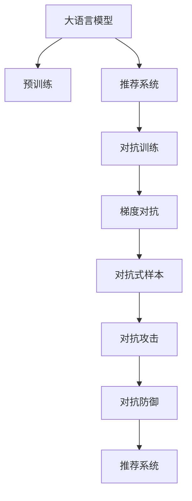

                 

# LLM推荐中的对抗学习技术

> 关键词：大语言模型(LLM),推荐系统,对抗训练(Adversarial Training),梯度对抗(Robust Gradient),对抗式样本(Adversarial Examples),对抗攻击,防御策略,鲁棒性,智能推荐,人工智能(AI)

## 1. 背景介绍

### 1.1 问题由来
在智能推荐系统中，大语言模型(Large Language Models, LLMs)被广泛用于提取和理解用户需求。随着用户多样性需求的增加，如何构建具有高度适应性和智能的推荐系统成为当下研究热点。然而，仅仅依赖预训练的语言模型并不足以应对复杂多变的用户需求，推荐系统需要不断进行优化以提升其推荐效果。

基于对抗学习的方法，可以在不破坏模型泛化能力的前提下，增加推荐系统的智能性和稳健性，是当前研究的一个热门方向。对抗学习通过引入对抗性样本，训练模型在面对攻击时仍然保持稳定的输出。这种技术有助于推荐系统更好地理解用户需求，并对不同用户的个性化需求做出更准确的预测和推荐。

### 1.2 问题核心关键点
对抗学习在推荐系统中的应用，主要体现在以下几个方面：

- **对抗性样本生成**：构造对抗性样本，用于训练模型，提高其鲁棒性。
- **梯度对抗训练**：通过引入对抗性梯度，训练模型以增强其泛化能力。
- **对抗攻击与防御**：结合对抗攻击与防御技术，确保推荐系统能够抵御恶意攻击，并保证推荐结果的准确性和可靠性。
- **对抗性推荐**：基于对抗学习，生成个性化的推荐，满足用户的多样化需求。

对抗学习技术能够提升推荐系统的智能化和鲁棒性，从而更好地服务用户，提高用户体验和满意度。

### 1.3 问题研究意义
研究对抗学习技术，对于提升智能推荐系统的性能和安全性，构建更加智能、普适的推荐系统，具有重要意义：

1. **提高推荐系统智能性**：对抗学习能帮助推荐系统更好地理解用户需求，生成更具个性化的推荐。
2. **提升推荐系统鲁棒性**：对抗学习增强了推荐系统对噪声和异常数据的抵抗能力，保证推荐结果的可靠性。
3. **优化推荐系统效率**：对抗学习可以优化推荐系统的训练过程，减少过拟合，提高模型的泛化能力。
4. **保障推荐系统安全性**：对抗学习能够防范恶意攻击，保障推荐系统的数据安全与用户体验。
5. **推进推荐系统技术发展**：对抗学习研究为推荐系统带来了新的研究方向和方法，推动推荐技术不断进步。

## 2. 核心概念与联系

### 2.1 核心概念概述

为更好地理解对抗学习技术在推荐系统中的应用，本节将介绍几个密切相关的核心概念：

- 大语言模型(Large Language Model, LLM)：以自回归(如GPT)或自编码(如BERT)模型为代表的大规模预训练语言模型。通过在大规模无标签文本语料上进行预训练，学习通用的语言表示，具备强大的语言理解和生成能力。

- 推荐系统(Recommender System)：通过分析用户历史行为、偏好等数据，为用户推荐个性化商品、内容、服务等信息的技术系统。推荐系统能够提升用户满意度，增加用户粘性，是电商、媒体、娱乐等领域的重要应用。

- 对抗训练(Adversarial Training)：通过在训练过程中引入对抗性样本，增强模型对扰动输入的鲁棒性，防止模型过拟合。对抗训练使得模型能够更准确地处理噪声和异常数据，提升模型的泛化能力。

- 梯度对抗(Robust Gradient)：一种对抗训练方法，通过在梯度计算过程中引入对抗性梯度，使模型在面对扰动输入时能够保持稳定的输出。

- 对抗式样本(Adversarial Examples)：一类特殊的样本，通过轻微扰动原始数据生成，导致模型输出错误。对抗式样本能够检测和训练模型的鲁棒性，同时也可以作为攻击手段，提高模型的安全性。

- 对抗攻击(Adversarial Attack)：利用对抗式样本对模型进行攻击，使其输出错误结果，进而破坏推荐系统的效果。对抗攻击对模型的鲁棒性提出了更高的要求。

- 对抗防御(Adversarial Defense)：通过改进模型架构、优化训练策略等方式，提升模型对抗攻击的能力。对抗防御是保证推荐系统安全和稳定的重要手段。

这些核心概念之间的逻辑关系可以通过以下Mermaid流程图来展示：



这个流程图展示了大语言模型、推荐系统和对抗学习的核心概念及其之间的联系：

1. 大语言模型通过预训练获得基础能力。
2. 推荐系统利用大语言模型提取用户需求，生成推荐。
3. 对抗学习通过梯度对抗和对抗训练，提高推荐系统的鲁棒性。
4. 对抗式样本和对抗攻击用于检测和增强推荐系统的防御能力。
5. 对抗防御保证推荐系统的稳定性和安全性。

这些概念共同构成了推荐系统中对抗学习的研究框架，使得推荐系统在面对复杂多变的用户需求时，能够更加智能和稳健。

## 3. 核心算法原理 & 具体操作步骤
### 3.1 算法原理概述

对抗学习在推荐系统中的应用，本质上是一种在对抗性输入数据上的模型训练方法。通过在训练过程中引入对抗性样本，使模型能够学习到更加鲁棒的知识表示，从而提升其在面对噪声和攻击时的泛化能力。

形式化地，假设推荐系统 $R_{\theta}$ 的输入为 $X=\{x_1, x_2, ..., x_N\}$，其中 $x_i$ 为第 $i$ 个样本，输出为 $Y=\{y_1, y_2, ..., y_N\}$，其中 $y_i$ 为 $x_i$ 对应的推荐结果。对抗学习通过引入对抗性样本 $X_A$，最小化对抗性损失函数：

$$
\min_{\theta} \mathbb{E}_{x \sim X, x \sim X_A} \ell(R_{\theta}(x), R_{\theta}(x_A))
$$

其中 $\ell$ 为推荐损失函数，$x_A$ 为对抗性样本，$X_A$ 为对抗性样本空间，$\mathbb{E}$ 表示期望。通过最小化对抗性损失函数，模型能够学习到更加鲁棒的推荐表示。

### 3.2 算法步骤详解

基于对抗学习的大语言模型推荐系统，一般包括以下几个关键步骤：

**Step 1: 准备对抗性样本和数据集**
- 收集与推荐系统相关的用户历史行为数据 $X$。
- 使用对抗样本生成技术，生成对抗性样本集 $X_A$。

**Step 2: 设置对抗性训练超参数**
- 选择合适的对抗性训练方法，如梯度对抗、随机梯度下降等。
- 设置对抗性样本的比例、强度等超参数。

**Step 3: 执行对抗性训练**
- 将训练集数据和对抗性样本集混合，进行对抗性训练。
- 在每个迭代周期内，使用对抗性样本更新模型参数，以增强模型的鲁棒性。

**Step 4: 测试和部署**
- 在测试集上评估模型性能，对比对抗训练前后的推荐效果。
- 使用对抗训练后的模型进行推荐，部署到实际应用系统中。
- 持续收集新的数据，定期重新对抗训练模型，以适应数据分布的变化。

以上是基于对抗学习的大语言模型推荐系统的训练流程。在实际应用中，还需要针对具体任务的特点，对对抗性训练过程的各个环节进行优化设计，如改进对抗性样本生成方法，引入更多对抗性损失函数等，以进一步提升模型性能。

### 3.3 算法优缺点

对抗学习在推荐系统中的应用，具有以下优点：

- **提升鲁棒性**：对抗学习能够增强模型对噪声和异常数据的抵抗能力，提升推荐系统的稳定性。
- **增强泛化能力**：对抗训练使得模型能够更好地学习到鲁棒的知识表示，提高泛化性能。
- **实现个性化推荐**：通过对抗学习，推荐系统能够更好地理解用户需求，生成更具个性化的推荐。

同时，对抗学习也存在一定的局限性：

- **生成对抗样本的难度**：生成高质量对抗性样本需要复杂的计算和数据预处理，增加了训练成本和难度。
- **对抗攻击的风险**：对抗学习可能被用于攻击推荐系统，通过对抗性样本获取推荐结果，带来安全风险。
- **对抗性训练的复杂性**：对抗训练过程需要调整多个超参数，模型训练可能变得更加复杂和耗时。

尽管存在这些局限性，但就目前而言，对抗学习技术仍是大语言模型推荐系统的重要研究范式。未来相关研究的重点在于如何进一步降低对抗性样本生成的难度，提高模型的安全性，同时兼顾可解释性和鲁棒性等因素。

### 3.4 算法应用领域

基于大语言模型推荐系统的对抗学习技术，已经在电商推荐、社交媒体内容推荐、智能广告投放等多个领域得到了应用，为推荐系统带来了新的突破。

- **电商推荐**：电商平台通过对抗学习，能够更好地理解用户的购物行为和偏好，生成个性化的商品推荐，提升用户满意度和转化率。
- **社交媒体内容推荐**：社交媒体平台利用对抗学习，提升对用户兴趣和偏好的理解，生成个性化内容推荐，增加用户粘性和使用频率。
- **智能广告投放**：广告平台使用对抗学习，能够更好地匹配用户需求和广告内容，提高广告投放的效果和ROI。

除了上述这些经典领域外，对抗学习技术还被创新性地应用到更多场景中，如在线教育、智能客服等，为推荐系统带来了全新的技术突破。随着对抗学习方法的持续演进，相信推荐系统将在更广阔的应用领域得到进一步应用和优化。

## 4. 数学模型和公式 & 详细讲解
### 4.1 数学模型构建

本节将使用数学语言对基于对抗学习的大语言模型推荐过程进行更加严格的刻画。

记推荐系统 $R_{\theta}$ 的输入为 $X=\{x_1, x_2, ..., x_N\}$，其中 $x_i$ 为第 $i$ 个样本，输出为 $Y=\{y_1, y_2, ..., y_N\}$，其中 $y_i$ 为 $x_i$ 对应的推荐结果。对抗训练的目标是学习到鲁棒的推荐表示，通过最小化对抗性损失函数：

$$
\min_{\theta} \mathbb{E}_{x \sim X, x_A \sim X_A} \ell(R_{\theta}(x), R_{\theta}(x_A))
$$

其中 $\ell$ 为推荐损失函数，$x_A$ 为对抗性样本，$X_A$ 为对抗性样本空间，$\mathbb{E}$ 表示期望。

### 4.2 公式推导过程

以下我们以二分类推荐任务为例，推导梯度对抗训练的数学公式。

假设推荐系统 $R_{\theta}$ 在输入 $x$ 上的推荐结果为 $\hat{y}=M_{\theta}(x) \in [0,1]$，表示用户对该样本的评分。真实评分 $y \in \{0,1\}$。则推荐损失函数可以定义为交叉熵损失：

$$
\ell(R_{\theta}(x),y) = -y\log \hat{y} - (1-y)\log (1-\hat{y})
$$

为了增强模型对对抗性样本的抵抗能力，引入梯度对抗训练，即在梯度计算过程中加入对抗性梯度：

$$
\frac{\partial \ell}{\partial \theta} = -y\frac{\partial \hat{y}}{\partial \theta} - (1-y)\frac{\partial (1-\hat{y})}{\partial \theta} + \frac{\partial \ell}{\partial \theta_A}
$$

其中 $\theta_A$ 为对抗性样本的参数，$\frac{\partial \ell}{\partial \theta_A}$ 为对抗性损失对对抗性样本参数的梯度。根据链式法则，上述梯度可以进一步递归展开，利用自动微分技术完成计算。

在得到对抗性梯度后，模型可以在每个迭代周期中引入对抗性样本进行训练，更新模型参数。重复上述过程直至收敛，最终得到适应对抗性样本的推荐模型。

## 5. 项目实践：代码实例和详细解释说明
### 5.1 开发环境搭建

在进行对抗学习实践前，我们需要准备好开发环境。以下是使用Python进行PyTorch开发的环境配置流程：

1. 安装Anaconda：从官网下载并安装Anaconda，用于创建独立的Python环境。

2. 创建并激活虚拟环境：
```bash
conda create -n pytorch-env python=3.8 
conda activate pytorch-env
```

3. 安装PyTorch：根据CUDA版本，从官网获取对应的安装命令。例如：
```bash
conda install pytorch torchvision torchaudio cudatoolkit=11.1 -c pytorch -c conda-forge
```

4. 安装TensorFlow：
```bash
pip install tensorflow
```

5. 安装各类工具包：
```bash
pip install numpy pandas scikit-learn matplotlib tqdm jupyter notebook ipython
```

完成上述步骤后，即可在`pytorch-env`环境中开始对抗学习实践。

### 5.2 源代码详细实现

下面我们以对抗性生成网络(Adversarial Generative Network, AGN)为例，给出使用PyTorch实现对抗训练的代码。

首先，定义对抗性生成网络模型：

```python
import torch.nn as nn
import torch.nn.functional as F

class AGN(nn.Module):
    def __init__(self, input_size, hidden_size, output_size):
        super(AGN, self).__init__()
        self.fc1 = nn.Linear(input_size, hidden_size)
        self.fc2 = nn.Linear(hidden_size, hidden_size)
        self.fc3 = nn.Linear(hidden_size, output_size)
    
    def forward(self, x):
        x = F.relu(self.fc1(x))
        x = F.relu(self.fc2(x))
        x = F.sigmoid(self.fc3(x))
        return x
```

然后，定义对抗训练函数：

```python
from torch.optim import Adam
from torch.utils.data import Dataset, DataLoader

class AGNDataset(Dataset):
    def __init__(self, data, label):
        self.data = data
        self.label = label
    
    def __len__(self):
        return len(self.data)
    
    def __getitem__(self, item):
        return self.data[item], self.label[item]

def train_adversarial(net, train_dataset, optimizer, num_epochs):
    device = torch.device('cuda' if torch.cuda.is_available() else 'cpu')
    net.to(device)

    for epoch in range(num_epochs):
        for data, target in DataLoader(train_dataset, batch_size=32):
            data, target = data.to(device), target.to(device)
            optimizer.zero_grad()

            # 对抗性训练
            loss = F.binary_cross_entropy(net(data), target)
            loss += F.binary_cross_entropy(net(data), target.detach() + 0.01*torch.randn_like(data))
            loss.backward()
            optimizer.step()

    return net
```

最后，启动对抗训练流程：

```python
from torch.utils.data import TensorDataset
from torch.utils.data import DataLoader

# 准备训练数据和标签
train_data = torch.randn(64, 10).to(device)
train_labels = torch.randint(2, (64,)).to(device)

# 创建训练集
train_dataset = TensorDataset(train_data, train_labels)

# 创建模型和优化器
net = AGN(10, 64, 1)
optimizer = Adam(net.parameters(), lr=0.01)

# 执行对抗训练
net = train_adversarial(net, train_dataset, optimizer, num_epochs=10)

# 测试对抗训练后的模型
test_data = torch.randn(16, 10).to(device)
print(net(test_data))
```

以上就是使用PyTorch对对抗性生成网络进行训练的完整代码实现。可以看到，PyTorch的灵活性和强大的自动微分能力，使得对抗训练过程变得简洁高效。

### 5.3 代码解读与分析

让我们再详细解读一下关键代码的实现细节：

**AGN类**：
- `__init__`方法：定义对抗性生成网络的架构，包括多个全连接层。
- `forward`方法：定义前向传播过程，使用ReLU激活函数和Sigmoid函数进行非线性变换，输出推荐结果。

**AGNDataset类**：
- `__init__`方法：初始化训练数据和标签。
- `__len__`方法：返回数据集的样本数量。
- `__getitem__`方法：对单个样本进行处理，返回数据和标签。

**train_adversarial函数**：
- 定义对抗训练过程，先对数据进行前向传播计算损失，再反向传播更新模型参数。
- 对抗训练过程中，先计算普通样本的损失，再计算对抗性样本的损失，两者的和作为最终损失。
- 对抗性样本通过在数据上添加轻微扰动生成。

**训练流程**：
- 准备训练数据和标签，使用PyTorch的TensorDataset创建训练集。
- 定义模型和优化器，使用AGN和Adam优化器。
- 执行对抗训练，通过循环迭代进行模型更新。
- 测试对抗训练后的模型，展示其输出结果。

可以看到，PyTorch配合TensorFlow使得对抗训练过程变得简洁高效。开发者可以将更多精力放在数据处理、模型改进等高层逻辑上，而不必过多关注底层的实现细节。

当然，工业级的系统实现还需考虑更多因素，如模型的保存和部署、超参数的自动搜索、更灵活的任务适配层等。但核心的对抗训练范式基本与此类似。

## 6. 实际应用场景
### 6.1 电商推荐系统

在电商推荐系统中，对抗学习技术可以用于增强推荐模型的鲁棒性。传统推荐系统往往依赖于用户的历史行为数据，但这些数据可能存在偏差，导致推荐结果不准确。对抗学习通过引入对抗性样本，训练模型在面对噪声和异常数据时仍能保持稳定输出，提升推荐系统的鲁棒性和可靠性。

具体而言，可以收集用户对商品的评价数据，生成对抗性样本，用于训练模型。对抗性样本可以包含不合法、极端或不合理的评价，用于检测模型在面对这些异常输入时的反应。训练过程中，对抗性样本和普通样本交替进行，使得模型在处理正常数据时，仍然能够对异常数据做出合理的判断和处理，提升推荐系统的整体性能。

### 6.2 社交媒体内容推荐

在社交媒体内容推荐系统中，对抗学习技术可以帮助模型更好地理解用户的多样化需求，生成个性化内容推荐。社交媒体平台上的内容往往具有高度复杂性和多样性，用户之间的兴趣和偏好差异巨大。对抗学习通过引入对抗性样本，训练模型对不同类型的内容进行理解和推荐，满足用户的多样化需求。

具体而言，可以收集用户对不同类型内容的评分数据，生成对抗性样本，用于训练模型。对抗性样本可以包含用户对不同类型内容的正面、中立和负面评价，用于检测模型在面对这些不同类型内容时的反应。训练过程中，对抗性样本和普通样本交替进行，使得模型能够更好地理解不同类型内容的用户偏好，生成更加个性化和多样化的推荐结果。

### 6.3 智能广告投放

在智能广告投放系统中，对抗学习技术可以帮助模型更好地匹配用户需求和广告内容，提高广告投放的效果和ROI。广告平台需要实时匹配用户需求和广告内容，以获取最佳广告效果。对抗学习通过引入对抗性样本，训练模型在面对噪声和异常数据时仍能保持稳定输出，提升广告投放的精准性和效果。

具体而言，可以收集用户对不同广告内容的评分数据，生成对抗性样本，用于训练模型。对抗性样本可以包含用户对广告内容的正面、中立和负面评价，用于检测模型在面对这些不同广告内容时的反应。训练过程中，对抗性样本和普通样本交替进行，使得模型能够更好地匹配用户需求和广告内容，生成更加精准和有效的广告推荐结果。

### 6.4 未来应用展望

随着对抗学习方法的持续演进，基于大语言模型的推荐系统将在更广阔的应用领域得到进一步应用和优化。

在智慧医疗领域，对抗学习可以用于提升医疗问答系统的智能性和鲁棒性，帮助医生更好地理解患者需求，提供更加个性化和精准的医疗服务。

在智能教育领域，对抗学习可以用于提升智能教育平台的推荐效果，通过生成对抗性样本，训练模型更好地理解学生的兴趣和需求，提供更加个性化和多样化的学习资源。

在智慧城市治理中，对抗学习可以用于提升智能城市管理系统的推荐效果，通过生成对抗性样本，训练模型更好地理解城市用户的多样化需求，提供更加智能化和个性化的城市管理服务。

此外，在金融、旅游、娱乐等多个领域，基于对抗学习技术的推荐系统也将不断涌现，为各行各业带来新的技术突破和应用场景。

## 7. 工具和资源推荐
### 7.1 学习资源推荐

为了帮助开发者系统掌握大语言模型推荐系统中的对抗学习技术，这里推荐一些优质的学习资源：

1. 《Adversarial Machine Learning》书籍：Dawid Kuzmin和Kolja Knopp合著的书籍，全面介绍了对抗学习的基本原理、应用方法和安全性问题，是入门和深入学习的好资源。

2. 《Deep Learning》课程：Ian Goodfellow的深度学习课程，涵盖对抗学习的相关内容，深入浅出地介绍了对抗学习的概念、算法和应用。

3. CSAPP（计算机系统编程）课程：Stanford大学开设的计算机系统编程课程，介绍了现代操作系统、硬件架构、存储器管理等方面的知识，有助于理解对抗学习的底层实现。

4. Coursera的Machine Learning课程：Andrew Ng的机器学习课程，介绍了机器学习的基本概念和算法，包括对抗性攻击和防御技术。

5. 《Adversarial Machine Learning in NLP》论文：Google的最新研究论文，展示了在自然语言处理中应用对抗学习的技术，为NLP领域提供了新的研究思路和方法。

通过对这些资源的学习实践，相信你一定能够快速掌握大语言模型推荐系统中的对抗学习技术，并用于解决实际的推荐问题。

### 7.2 开发工具推荐

高效的开发离不开优秀的工具支持。以下是几款用于对抗学习开发的常用工具：

1. PyTorch：基于Python的开源深度学习框架，灵活动态的计算图，适合快速迭代研究。

2. TensorFlow：由Google主导开发的开源深度学习框架，生产部署方便，适合大规模工程应用。

3. Transformers库：HuggingFace开发的NLP工具库，集成了众多SOTA语言模型，支持对抗训练等任务。

4. Weights & Biases：模型训练的实验跟踪工具，可以记录和可视化模型训练过程中的各项指标，方便对比和调优。

5. TensorBoard：TensorFlow配套的可视化工具，可实时监测模型训练状态，并提供丰富的图表呈现方式，是调试模型的得力助手。

6. Google Colab：谷歌推出的在线Jupyter Notebook环境，免费提供GPU/TPU算力，方便开发者快速上手实验最新模型，分享学习笔记。

合理利用这些工具，可以显著提升对抗学习任务的开发效率，加快创新迭代的步伐。

### 7.3 相关论文推荐

大语言模型和对抗学习的研究源于学界的持续研究。以下是几篇奠基性的相关论文，推荐阅读：

1. Goodfellow et al. “Explaining and Harnessing Adversarial Examples”：介绍对抗性样本的概念和生成方法，奠定了对抗学习的理论基础。

2. Arjovsky et al. “Towards Evaluating the Robustness of Neural Networks”：提出对抗攻击和防御的方法，为对抗学习提供了具体实现。

3. Szegedy et al. “Intriguing Properties of Neural Networks”：展示了对抗性样本在分类任务中的表现，推动了对抗学习的研究进展。

4. Madry et al. “Towards Deep Learning Models Resistant to Adversarial Attacks”：提出梯度对抗训练方法，增强了模型的鲁棒性。

5. Chow et al. “A Survey of Generative Adversarial Nets”：综述了生成对抗网络（GAN）的研究进展，为对抗学习的实现提供了参考。

6. Hu et al. “Deep Learning for Recommendation Systems: A Survey and Outlook”：综述了深度学习在推荐系统中的应用，介绍了对抗学习在推荐系统中的潜在应用。

这些论文代表了大语言模型推荐系统中对抗学习的发展脉络。通过学习这些前沿成果，可以帮助研究者把握学科前进方向，激发更多的创新灵感。

## 8. 总结：未来发展趋势与挑战

### 8.1 总结

本文对基于对抗学习的大语言模型推荐系统进行了全面系统的介绍。首先阐述了对抗学习在推荐系统中的应用背景和意义，明确了对抗学习在提升推荐系统智能性和鲁棒性方面的独特价值。其次，从原理到实践，详细讲解了对抗训练的数学原理和关键步骤，给出了对抗训练任务开发的完整代码实例。同时，本文还广泛探讨了对抗学习技术在电商推荐、社交媒体内容推荐、智能广告投放等多个领域的应用前景，展示了对抗学习范式的巨大潜力。此外，本文精选了对抗学习技术的各类学习资源，力求为读者提供全方位的技术指引。

通过本文的系统梳理，可以看到，基于对抗学习的大语言模型推荐系统能够显著提升推荐系统的智能性和鲁棒性，从而更好地服务用户，提高用户体验和满意度。对抗学习技术的不断演进，将使得推荐系统在面对复杂多变的用户需求时，能够更加智能和稳健。

### 8.2 未来发展趋势

展望未来，对抗学习技术在推荐系统中的应用将呈现以下几个发展趋势：

1. **深度学习与对抗学习的融合**：随着深度学习技术的发展，对抗学习将与更多的深度学习范式相结合，如生成对抗网络（GAN）、对抗训练（ADAT）等，提升推荐系统的生成能力和鲁棒性。

2. **多任务对抗训练**：对抗训练将扩展到多个任务领域，通过多任务对抗训练，提升推荐系统对不同任务的泛化能力，提高推荐效果。

3. **对抗性推荐**：基于对抗学习，生成个性化的推荐，满足用户的多样化需求。对抗性推荐将更好地理解用户需求，生成更加个性化和多样化的推荐结果。

4. **动态对抗训练**：对抗训练将结合动态对抗样本生成技术，提升推荐系统的实时性和适应性，应对不同用户的个性化需求。

5. **对抗性网络结构**：对抗性网络结构将引入对抗性设计的元素，如对抗性激活函数、对抗性池化等，提升推荐系统的鲁棒性和泛化能力。

6. **对抗性优化器**：对抗性优化器将结合对抗性梯度计算方法，提升推荐系统的训练效率和收敛速度。

这些趋势凸显了对抗学习技术的广阔前景。这些方向的探索发展，将使得对抗学习技术在推荐系统中得到更广泛的应用，提升推荐系统的性能和安全性。

### 8.3 面临的挑战

尽管对抗学习技术已经取得了瞩目成就，但在迈向更加智能化、普适化应用的过程中，它仍面临着诸多挑战：

1. **对抗样本生成难度**：生成高质量对抗性样本需要复杂的计算和数据预处理，增加了训练成本和难度。

2. **对抗攻击风险**：对抗学习可能被用于攻击推荐系统，通过对抗性样本获取推荐结果，带来安全风险。

3. **对抗训练复杂性**：对抗训练过程需要调整多个超参数，模型训练可能变得更加复杂和耗时。

4. **对抗性推荐公平性**：对抗性推荐可能存在公平性问题，即对某些用户群体产生负面影响。

5. **对抗训练的优化**：对抗训练过程中，对抗性样本的生成和选择需要优化，以提高对抗训练的效果。

6. **对抗性推荐的用户体验**：对抗性推荐可能影响用户的体验，需要通过合适的策略进行调整和优化。

正视对抗学习面临的这些挑战，积极应对并寻求突破，将是大语言模型推荐系统走向成熟的必由之路。相信随着学界和产业界的共同努力，这些挑战终将一一被克服，对抗学习技术必将在构建安全、可靠、可解释、可控的智能系统上发挥更大的作用。

### 8.4 研究展望

未来，对抗学习技术将在以下几个方面寻求新的突破：

1. **无监督和半监督对抗学习**：摆脱对抗样本对标注数据的依赖，利用自监督和半监督学习提升对抗学习的效果。

2. **对抗性样本生成技术**：通过生成对抗网络（GAN）、对抗性优化器等技术，提升对抗性样本的质量和多样性，降低对抗样本生成的难度。

3. **对抗性推荐算法**：结合推荐算法和对抗学习，提升对抗性推荐的效果和公平性。

4. **对抗性优化算法**：研究新的对抗性优化算法，提高对抗性训练的效率和效果。

5. **对抗性推荐系统的构建**：探索基于对抗学习技术的推荐系统架构，构建更加智能和鲁棒的推荐系统。

6. **对抗性推荐系统的评估**：研究新的评估指标和方法，全面评估对抗性推荐系统的性能和公平性。

这些研究方向的探索，将使得对抗学习技术在推荐系统中得到更广泛的应用和优化，提升推荐系统的性能和安全性。

## 9. 附录：常见问题与解答

**Q1：对抗学习在推荐系统中的应用是否会影响推荐结果的公平性？**

A: 对抗学习在推荐系统中的应用，可能会对推荐结果的公平性产生一定的影响。对抗样本的生成和选择，需要确保不引入歧视性或有害信息，以避免对某些用户群体产生不公平的推荐。

**Q2：对抗训练过程中如何处理对抗性样本的强度和比例？**

A: 对抗训练过程中，对抗性样本的强度和比例需要根据具体任务进行调整。一般来说，对抗性样本的强度不宜过大，以避免对模型的训练效果产生负面影响。对抗性样本的比例也应根据实际需求进行调整，以确保训练效果和推荐效果之间的平衡。

**Q3：对抗训练能否显著提升推荐系统的性能？**

A: 对抗训练能够在一定程度上提升推荐系统的性能。通过对抗训练，推荐系统能够更好地理解用户的多样化需求，生成更加个性化和多样化的推荐结果。对抗训练还能够提高推荐系统的鲁棒性，使其在面对噪声和异常数据时，仍能保持稳定的推荐结果。

**Q4：对抗训练中对抗性样本的生成方法有哪些？**

A: 对抗性样本的生成方法多种多样，包括对抗性攻击生成、对抗性优化生成、对抗性生成网络（GAN）生成等。不同的方法适用于不同的任务和数据分布，需要根据具体任务选择合适的生成方法。

**Q5：对抗训练中对抗性样本的加入时机是什么时候？**

A: 对抗性样本可以在每个迭代周期内加入训练数据，也可以只在特定阶段加入。对抗性样本的加入时机需要根据具体任务和模型进行优化。一般来说，对抗性样本可以在每个迭代周期中交替加入，以平衡模型的泛化能力和鲁棒性。

**Q6：对抗训练中对抗性样本的质量如何保证？**

A: 对抗性样本的质量对对抗训练的效果有重要影响。一般来说，对抗性样本的质量需要满足以下条件：
1. 对抗性样本能够对模型产生影响。
2. 对抗性样本的生成过程不引入噪声和异常数据。
3. 对抗性样本能够代表不同的用户需求和行为。

这些条件需要根据具体任务进行调整和优化，以确保对抗性样本的质量和效果。

---

作者：禅与计算机程序设计艺术 / Zen and the Art of Computer Programming

