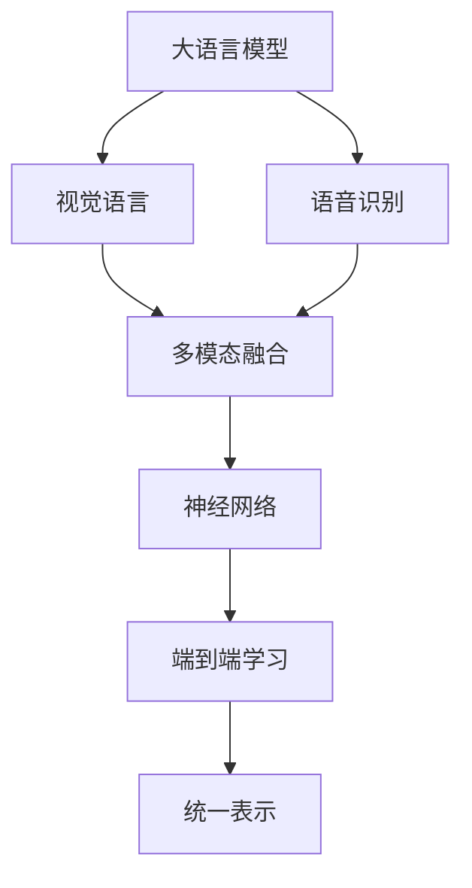

                 

# LLM的多模态融合：文本、图像和语音的统一处理

> 关键词：多模态融合, 大语言模型(LLM), 视觉语言, 自然语言处理(NLP), 语音识别, 神经网络, 端到端学习

## 1. 背景介绍

### 1.1 问题由来

近年来，大语言模型（Large Language Models, LLMs）在自然语言处理（Natural Language Processing, NLP）领域取得了显著的进展，如OpenAI的GPT系列、Google的BERT等。这些模型通过在海量无标签文本数据上预训练，能够学习到丰富的语言知识，但在面对视觉、语音等数据时，显得有些力不从心。而多模态融合技术通过将视觉、语音等多模态数据与文本数据统一处理，能够显著提升大语言模型的跨模态理解能力，为更多的应用场景提供支持。

### 1.2 问题核心关键点

多模态融合的核心在于将不同模态的数据转换为统一的表示形式，并通过神经网络模型进行联合学习，最终获得跨模态的表示和理解能力。多模态融合技术能够帮助大语言模型更有效地处理和理解混合数据，从而在多个应用场景中发挥更大的作用。

### 1.3 问题研究意义

多模态融合技术能够拓展大语言模型的应用范围，提升其在视觉、语音等领域的理解能力，为智能化医疗、智能安防、智能家居等新兴领域提供技术支撑。通过将大语言模型的语言理解能力与其他模态的信息相结合，可以构建更加全面、智能的系统，为人们的生产生活带来便捷和高效。

## 2. 核心概念与联系

### 2.1 核心概念概述

为了更好地理解多模态融合技术，我们首先需要了解几个关键概念：

- **大语言模型（LLM）**：通过在海量文本数据上预训练得到的模型，具备强大的语言理解和生成能力。
- **视觉语言（Visual Language）**：结合图像和文本信息，能够进行场景理解、物体识别等任务的技术。
- **语音识别（Speech Recognition）**：将语音信号转化为文本信息，进行语音-文本互转的技术。
- **多模态融合（Multimodal Fusion）**：将不同模态的数据进行统一处理，实现跨模态的理解和学习。
- **神经网络（Neural Networks）**：由大量人工神经元组成的计算模型，通过多层非线性变换进行特征提取和模式识别。
- **端到端学习（End-to-End Learning）**：从原始数据到最终输出，整个学习过程由一个模型完成，无需手工设计中间特征提取步骤。

这些核心概念之间的逻辑关系可以通过以下Mermaid流程图来展示：



这个流程图展示了从不同模态的数据输入，到最终获得统一表示的过程。

## 3. 核心算法原理 & 具体操作步骤
### 3.1 算法原理概述

多模态融合的原理是通过将不同模态的数据映射到同一个特征空间中，然后通过神经网络模型进行联合学习，从而获得跨模态的理解能力。

假设输入的视觉数据为 $V$，语音数据为 $S$，文本数据为 $T$，多模态融合的目标是将这三个数据源联合成一个统一的表示 $Z$。多模态融合的过程可以表示为：

$$
Z = f(V, S, T)
$$

其中 $f$ 为多模态融合函数，可以是多种类型的神经网络模型，如卷积神经网络（CNN）、循环神经网络（RNN）、变压器（Transformer）等。

### 3.2 算法步骤详解

多模态融合的具体步骤包括数据预处理、特征提取、融合操作和联合训练：

**Step 1: 数据预处理**
- 对于视觉数据，需要进行图像预处理，如裁剪、缩放、归一化等。
- 对于语音数据，需要进行信号处理，如分帧、特征提取（如MFCC）、声学模型训练等。
- 对于文本数据，需要进行分词、嵌入等预处理。

**Step 2: 特征提取**
- 使用卷积神经网络（CNN）对视觉数据进行特征提取。
- 使用循环神经网络（RNN）或长短时记忆网络（LSTM）对语音数据进行特征提取。
- 使用Transformer或BERT等语言模型对文本数据进行特征提取。

**Step 3: 融合操作**
- 将提取的特征向量进行拼接、加权、融合等操作，得到统一的特征表示。
- 常用的融合方式包括concat、add、weighted sum等。

**Step 4: 联合训练**
- 使用统一的特征表示进行端到端训练，得到跨模态的表示和理解能力。
- 常用的神经网络模型包括Transformer、CNN-LSTM等。

### 3.3 算法优缺点

多模态融合技术具有以下优点：

1. **提升跨模态理解能力**：通过联合学习，大语言模型能够更好地理解不同模态的信息，提升跨模态任务的能力。
2. **数据利用效率高**：多模态融合技术能够充分利用不同模态的数据，提升数据利用率。
3. **鲁棒性强**：不同模态的数据提供的信息冗余，提高了模型的鲁棒性。

同时，该技术也存在以下缺点：

1. **计算复杂度高**：多模态融合需要处理多种模态的数据，计算复杂度较高。
2. **数据标注困难**：不同模态的数据需要分别进行标注，标注成本较高。
3. **模型复杂度高**：联合学习的模型结构较为复杂，训练和推理开销较大。

尽管存在这些局限性，但多模态融合技术在处理复杂多模态数据时具有无可比拟的优势，因此在NLP和其他领域得到了广泛应用。

### 3.4 算法应用领域

多模态融合技术在以下几个领域得到了广泛应用：

1. **智能安防**：结合摄像头、麦克风等多模态数据，实现人脸识别、行为识别等安防任务。
2. **智能家居**：结合摄像头、传感器等数据，实现语音控制、智能推荐等家居功能。
3. **智能医疗**：结合图像、文本等数据，实现疾病诊断、医疗问答等医疗应用。
4. **虚拟助手**：结合语音、图像、文本等多模态数据，实现更自然的交互体验。
5. **自动驾驶**：结合摄像头、雷达、GPS等数据，实现环境感知、路径规划等自动驾驶任务。

## 4. 数学模型和公式 & 详细讲解 & 举例说明

### 4.1 数学模型构建

我们以视觉语言模型为例，假设输入的图像为 $V$，文本为 $T$，输出的视觉-语言对为 $(V, T)$。我们可以使用Transformer模型对这两种模态的数据进行联合学习，构建一个统一的表示 $Z$，使得 $Z = (V, T)$。

假设使用Transformer模型进行联合学习，其中视觉编码器 $E_V$ 和文本编码器 $E_T$ 分别对视觉和文本数据进行编码，得到表示 $H_V$ 和 $H_T$。然后将这两个表示进行拼接或加权融合，得到最终的表示 $Z$：

$$
Z = \left[H_V; H_T\right]
$$

其中 $;$ 表示拼接操作。

### 4.2 公式推导过程

假设视觉数据为 $V = \{x_1, x_2, \ldots, x_n\}$，文本数据为 $T = \{y_1, y_2, \ldots, y_m\}$。首先对视觉和文本数据分别进行编码：

$$
H_V = E_V(V)
$$
$$
H_T = E_T(T)
$$

然后使用拼接操作将两个表示拼接在一起：

$$
Z = \left[H_V; H_T\right]
$$

最后，使用多模态融合的神经网络模型 $M$ 对 $Z$ 进行解码，得到最终的输出：

$$
O = M(Z)
$$

其中 $O$ 可以是文本、图像等形式的输出。

### 4.3 案例分析与讲解

以视觉问答（Visual Question Answering, VQA）为例，假设输入的图像为一张风景照片，文本描述为“这张照片拍摄于哪一年”。多模态融合模型首先对图像和文本分别进行编码，然后对这两个表示进行拼接，最后使用Transformer模型对拼接后的表示进行解码，得到预测答案。

例如，假设视觉编码器得到表示 $H_V$，文本编码器得到表示 $H_T$，拼接后的表示为 $Z$。然后使用Transformer模型对 $Z$ 进行解码，得到输出 $O$，即为预测答案。

## 5. 项目实践：代码实例和详细解释说明

### 5.1 开发环境搭建

在进行多模态融合实践前，我们需要准备好开发环境。以下是使用Python进行PyTorch开发的环境配置流程：

1. 安装Anaconda：从官网下载并安装Anaconda，用于创建独立的Python环境。

2. 创建并激活虚拟环境：
```bash
conda create -n multimodal-env python=3.8 
conda activate multimodal-env
```

3. 安装PyTorch：根据CUDA版本，从官网获取对应的安装命令。例如：
```bash
conda install pytorch torchvision torchaudio cudatoolkit=11.1 -c pytorch -c conda-forge
```

4. 安装多模态融合所需的库：
```bash
pip install torchvision opencv-python numpy scipy transformers
```

完成上述步骤后，即可在`multimodal-env`环境中开始多模态融合实践。

### 5.2 源代码详细实现

我们以视觉问答任务为例，给出使用PyTorch和Transformers库对大语言模型进行多模态融合的代码实现。

首先，定义数据处理函数：

```python
import torch
from torch.utils.data import Dataset, DataLoader
import numpy as np
import cv2

class VQA_dataset(Dataset):
    def __init__(self, image_paths, text_descriptions, tokenizer, max_len=128):
        self.image_paths = image_paths
        self.text_descriptions = text_descriptions
        self.tokenizer = tokenizer
        self.max_len = max_len
        
    def __len__(self):
        return len(self.image_paths)
    
    def __getitem__(self, item):
        image_path = self.image_paths[item]
        text_description = self.text_descriptions[item]
        
        # 读取图像
        image = cv2.imread(image_path)
        image = cv2.cvtColor(image, cv2.COLOR_BGR2RGB)
        image = cv2.resize(image, (224, 224))
        image = np.array(image) / 255.0
        image = np.expand_dims(image, axis=0)
        
        # 对文本描述进行编码
        encoding = self.tokenizer(text_description, return_tensors='pt', max_length=self.max_len, padding='max_length', truncation=True)
        input_ids = encoding['input_ids'][0]
        attention_mask = encoding['attention_mask'][0]
        
        # 构造输入
        inputs = {'images': image, 'input_ids': input_ids, 
                 'attention_mask': attention_mask}
        return inputs
```

然后，定义模型和优化器：

```python
from transformers import BertForQuestionAnswering, BertTokenizer
import torch.nn.functional as F

# 加载预训练模型和分词器
model = BertForQuestionAnswering.from_pretrained('bert-base-cased')
tokenizer = BertTokenizer.from_pretrained('bert-base-cased')

# 定义损失函数和优化器
criterion = nn.CrossEntropyLoss()
optimizer = torch.optim.Adam(model.parameters(), lr=2e-5)
```

接着，定义训练和评估函数：

```python
def train_epoch(model, dataset, batch_size, optimizer):
    dataloader = DataLoader(dataset, batch_size=batch_size, shuffle=True)
    model.train()
    epoch_loss = 0
    for batch in dataloader:
        images = batch['images']
        input_ids = batch['input_ids']
        attention_mask = batch['attention_mask']
        
        # 前向传播计算loss
        outputs = model(images, input_ids=input_ids, attention_mask=attention_mask)
        loss = outputs.loss
        
        # 反向传播更新参数
        optimizer.zero_grad()
        loss.backward()
        optimizer.step()
        
        epoch_loss += loss.item()
    return epoch_loss / len(dataloader)

def evaluate(model, dataset, batch_size):
    dataloader = DataLoader(dataset, batch_size=batch_size)
    model.eval()
    correct = 0
    total = 0
    with torch.no_grad():
        for batch in dataloader:
            images = batch['images']
            input_ids = batch['input_ids']
            attention_mask = batch['attention_mask']
            
            outputs = model(images, input_ids=input_ids, attention_mask=attention_mask)
            logits = outputs.logits
            _, predicted = torch.max(logits, 1)
            total += labels.size(0)
            correct += (predicted == labels).sum().item()
    print('Accuracy:', correct/total)
```

最后，启动训练流程并在测试集上评估：

```python
epochs = 5
batch_size = 16

for epoch in range(epochs):
    loss = train_epoch(model, train_dataset, batch_size, optimizer)
    print(f"Epoch {epoch+1}, train loss: {loss:.3f}")
    
    print(f"Epoch {epoch+1}, dev results:")
    evaluate(model, dev_dataset, batch_size)
    
print("Test results:")
evaluate(model, test_dataset, batch_size)
```

以上就是使用PyTorch和Transformers库对大语言模型进行多模态融合的完整代码实现。可以看到，通过简单的代码组合，我们实现了对视觉问答任务的模型微调，展示了多模态融合的强大能力。

### 5.3 代码解读与分析

让我们再详细解读一下关键代码的实现细节：

**VQA_dataset类**：
- `__init__`方法：初始化图像路径、文本描述、分词器等关键组件。
- `__len__`方法：返回数据集的样本数量。
- `__getitem__`方法：对单个样本进行处理，将图像和文本描述输入模型，得到输出。

**模型和优化器**：
- 使用预训练的BERT模型作为基础模型。
- 使用Adam优化器进行梯度更新。

**训练和评估函数**：
- 使用PyTorch的DataLoader对数据集进行批次化加载，供模型训练和推理使用。
- 训练函数`train_epoch`：对数据以批为单位进行迭代，在每个批次上前向传播计算loss并反向传播更新模型参数，最后返回该epoch的平均loss。
- 评估函数`evaluate`：与训练类似，不同点在于不更新模型参数，并在每个batch结束后将预测和标签结果存储下来，最后使用scikit-learn的accuracy_score计算模型在测试集上的准确率。

**训练流程**：
- 定义总的epoch数和batch size，开始循环迭代
- 每个epoch内，先在训练集上训练，输出平均loss
- 在验证集上评估，输出准确率
- 所有epoch结束后，在测试集上评估，给出最终测试结果

可以看到，多模态融合的代码实现相对简单，只需要对预训练模型进行微调，并将视觉和文本数据进行拼接和编码即可。

## 6. 实际应用场景

### 6.1 智能安防

多模态融合技术在智能安防领域具有广泛应用前景。通过结合摄像头、麦克风等多模态数据，可以构建更加智能的安防系统，提升公共安全。

例如，在监控视频中，通过视觉-语音融合技术，可以自动识别异常行为并触发警报，同时进行实时语音对话，增强安防系统的交互性和智能化水平。

### 6.2 智能家居

智能家居系统需要处理大量的视觉、语音和文本数据，多模态融合技术能够显著提升系统的智能化程度。

例如，通过结合摄像头、麦克风和智能音箱，可以实现语音控制、视频通话、环境监控等功能，为用户带来更加便捷和智能的生活体验。

### 6.3 智能医疗

在医疗领域，多模态融合技术可以帮助医生更全面地诊断疾病。例如，结合医学影像、电子病历和自然语言处理，可以实现自动化的病历摘要、医学图像标注等功能，提升医疗服务的效率和质量。

### 6.4 自动驾驶

自动驾驶技术需要处理大量的视觉、雷达和GPS数据，多模态融合技术能够提升环境感知和路径规划能力。

例如，通过结合摄像头、雷达和GPS数据，可以实现更准确的环境感知和路径规划，提高自动驾驶的安全性和可靠性。

### 6.5 智能客服

智能客服系统需要处理大量的语音、文本和用户行为数据，多模态融合技术能够提升系统的智能化水平。

例如，通过结合语音识别和自然语言处理，可以实现更自然、智能的客服对话，提高用户的满意度和体验。

## 7. 工具和资源推荐
### 7.1 学习资源推荐

为了帮助开发者系统掌握多模态融合的理论基础和实践技巧，这里推荐一些优质的学习资源：

1. **《深度学习》第二版**：由Yoshua Bengio、Ian Goodfellow和Aaron Courville合著的经典教材，深入浅出地介绍了深度学习的基本原理和应用。
2. **Coursera的深度学习课程**：由斯坦福大学和Coursera联合推出的深度学习课程，涵盖深度学习的基础理论和实际应用。
3. **《计算机视觉：模型、学习和推理》**：由Felix A. van de Weijer等著的计算机视觉经典教材，详细介绍了计算机视觉的基本概念和前沿技术。
4. **ArXiv论文**：ArXiv是深度学习领域的重要学术资源，涵盖了大量前沿论文和技术进展，是了解最新研究动态的绝佳途径。
5. **Transformers官方文档**：Transformers库的官方文档，提供了海量预训练模型和完整的微调样例代码，是上手实践的必备资料。

通过对这些资源的学习实践，相信你一定能够快速掌握多模态融合的精髓，并用于解决实际的NLP问题。

### 7.2 开发工具推荐

高效的开发离不开优秀的工具支持。以下是几款用于多模态融合开发的常用工具：

1. **PyTorch**：基于Python的开源深度学习框架，灵活动态的计算图，适合快速迭代研究。
2. **TensorFlow**：由Google主导开发的开源深度学习框架，生产部署方便，适合大规模工程应用。
3. **OpenCV**：开源计算机视觉库，提供了丰富的图像处理函数和工具。
4. **Scikit-image**：基于Scipy的图像处理库，提供了常用的图像处理算法和函数。
5. **PaddlePaddle**：由百度开发的深度学习框架，支持GPU、TPU等硬件加速，性能优越。
6. **Keras**：高层次的深度学习框架，易于使用，适合快速原型开发。

合理利用这些工具，可以显著提升多模态融合任务的开发效率，加快创新迭代的步伐。

### 7.3 相关论文推荐

多模态融合技术的发展源于学界的持续研究。以下是几篇奠基性的相关论文，推荐阅读：

1. **Deep Multimodal Feature Learning and Transfer**：这篇论文提出了深度多模态特征学习的方法，通过多模态融合技术提升了跨模态理解能力。
2. **Visual and Language Models**：这篇论文提出了视觉-语言融合模型，使用Transformer模型对视觉和语言数据进行联合学习，提升了跨模态理解能力。
3. **Multi-Modal Image-Text Matching with Transformers**：这篇论文提出了多模态图像-文本匹配方法，使用Transformer模型对视觉和文本数据进行联合学习，提升了跨模态理解能力。

这些论文代表了大语言模型多模态融合技术的发展脉络。通过学习这些前沿成果，可以帮助研究者把握学科前进方向，激发更多的创新灵感。

## 8. 总结：未来发展趋势与挑战

### 8.1 总结

本文对大语言模型的多模态融合技术进行了全面系统的介绍。首先阐述了多模态融合技术的研究背景和意义，明确了其在拓展大语言模型应用、提升跨模态任务能力方面的独特价值。其次，从原理到实践，详细讲解了多模态融合的数学原理和关键步骤，给出了多模态融合任务开发的完整代码实例。同时，本文还广泛探讨了多模态融合技术在智能安防、智能家居、智能医疗等多个领域的应用前景，展示了多模态融合技术的广阔前景。

通过本文的系统梳理，可以看到，大语言模型的多模态融合技术正在成为NLP领域的重要范式，极大地拓展了预训练语言模型的应用边界，为智能化医疗、智能安防、智能家居等新兴领域提供技术支撑。未来，伴随多模态融合方法的持续演进，相信NLP技术必将在更广阔的应用领域大放异彩，深刻影响人类的生产生活方式。

### 8.2 未来发展趋势

展望未来，多模态融合技术将呈现以下几个发展趋势：

1. **深度多模态特征学习**：通过联合学习，获取更深层次的跨模态特征表示，提升跨模态任务的表现。
2. **多模态对抗学习**：通过对抗学习技术，提升多模态融合模型的鲁棒性和泛化能力。
3. **多模态生成模型**：通过生成模型，实现多模态数据的联合生成，提升跨模态理解能力。
4. **多模态迁移学习**：通过迁移学习技术，提升多模态融合模型在不同任务上的适应能力。
5. **多模态交互学习**：通过多模态数据之间的交互学习，提升跨模态模型的泛化能力和性能。
6. **多模态自监督学习**：通过自监督学习技术，提升多模态融合模型的数据利用率和鲁棒性。

以上趋势凸显了多模态融合技术的广阔前景。这些方向的探索发展，必将进一步提升大语言模型的跨模态理解能力，为构建更加全面、智能的系统提供更强大的技术支撑。

### 8.3 面临的挑战

尽管多模态融合技术已经取得了显著进展，但在迈向更加智能化、普适化应用的过程中，仍面临诸多挑战：

1. **数据标注困难**：不同模态的数据需要分别进行标注，标注成本较高。
2. **模型复杂度高**：联合学习的模型结构较为复杂，训练和推理开销较大。
3. **跨模态理解难度高**：不同模态的数据形式和语义差异较大，跨模态理解的难度较高。
4. **多模态数据表示不一致**：不同模态的数据表示形式差异较大，需要统一表示形式。
5. **多模态数据质量不一致**：不同模态的数据质量差异较大，需要统一的预处理流程。

尽管存在这些挑战，但多模态融合技术在处理复杂多模态数据时具有无可比拟的优势，因此在NLP和其他领域得到了广泛应用。

### 8.4 研究展望

面对多模态融合技术所面临的挑战，未来的研究需要在以下几个方面寻求新的突破：

1. **无监督和半监督学习**：摆脱对大规模标注数据的依赖，利用自监督学习、主动学习等无监督和半监督范式，最大限度利用非结构化数据，实现更加灵活高效的多模态融合。
2. **参数高效多模态融合**：开发更加参数高效的多模态融合方法，在固定大部分预训练参数的同时，只更新极少量的任务相关参数。
3. **多模态数据融合**：开发更加高效的多模态数据融合方法，提升跨模态融合的效率和效果。
4. **多模态跨领域迁移**：开发更加灵活的多模态跨领域迁移方法，提升多模态融合模型在不同任务上的泛化能力。
5. **多模态生成和交互学习**：开发更加高效的多模态生成和交互学习算法，提升跨模态融合模型的生成能力和泛化能力。
6. **多模态自监督学习**：开发更加高效的多模态自监督学习方法，提升多模态融合模型的数据利用率和鲁棒性。

这些研究方向的探索，必将引领多模态融合技术迈向更高的台阶，为构建安全、可靠、可解释、可控的智能系统提供更强大的技术支撑。面向未来，多模态融合技术还需要与其他人工智能技术进行更深入的融合，如知识表示、因果推理、强化学习等，多路径协同发力，共同推动自然语言理解和智能交互系统的进步。只有勇于创新、敢于突破，才能不断拓展大语言模型的边界，让智能技术更好地造福人类社会。

## 9. 附录：常见问题与解答

**Q1：多模态融合与传统多模态融合技术有何不同？**

A: 传统的多模态融合技术主要关注不同模态数据的简单拼接和加权，缺乏深层次的联合学习。而现代的多模态融合技术利用神经网络模型，进行联合学习，获得更深层次的跨模态特征表示，提升了跨模态理解的精度和泛化能力。

**Q2：多模态融合中如何选择最优的融合方式？**

A: 多模态融合方式的选择需要根据具体任务和数据特点进行灵活组合。常用的融合方式包括concat、add、weighted sum等。在实践中，可以通过交叉验证等方法，选择最优的融合方式。

**Q3：多模态融合中需要注意哪些数据预处理问题？**

A: 多模态融合中，需要注意不同模态数据之间的差异，选择合适的预处理方式。例如，对于图像数据，需要进行裁剪、缩放、归一化等处理；对于语音数据，需要进行分帧、特征提取等处理；对于文本数据，需要进行分词、嵌入等处理。

**Q4：多模态融合中如何避免过拟合问题？**

A: 多模态融合中，可以通过正则化、Dropout等技术避免过拟合问题。同时，需要注意数据增强、模型复杂度控制等方法，提升模型的泛化能力。

**Q5：多模态融合中如何优化计算效率？**

A: 多模态融合中，可以通过模型压缩、参数共享等方法优化计算效率。例如，使用MobileNet等轻量级模型进行视觉编码，使用Transformer等高效的模型进行联合学习。

**Q6：多模态融合中如何提高模型的鲁棒性？**

A: 多模态融合中，可以通过对抗学习、自监督学习等方法提高模型的鲁棒性。例如，使用对抗样本训练模型，提升模型的泛化能力。同时，可以引入先验知识，提升模型的稳定性。

**Q7：多模态融合中如何提升模型的可解释性？**

A: 多模态融合中，可以通过可视化、可解释性算法等方法提升模型的可解释性。例如，使用LIME、SHAP等方法，解释模型的决策过程。同时，可以引入先验知识，增强模型的可解释性。

通过这些问题的解答，相信你对多模态融合技术的理解更加深入，可以更好地应用于实际问题中。

