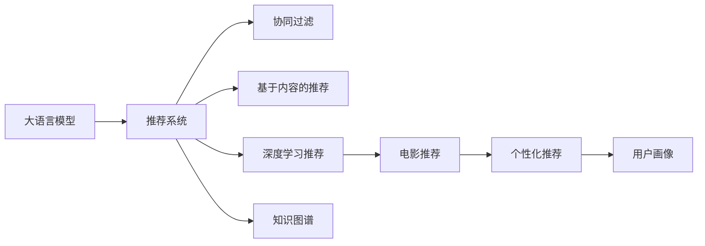

                 

# LLM驱动的个性化电影推荐系统

> 关键词：大语言模型(LLM), 推荐系统, 电影推荐, 个性化, 深度学习, 协同过滤, 基于内容的推荐, 知识图谱, 用户画像

## 1. 背景介绍

### 1.1 问题由来
随着数字娱乐产业的迅猛发展，在线电影平台如Netflix、爱奇艺、腾讯视频等，已经成为许多人日常娱乐生活的重要组成部分。这些平台拥有海量的电影资源，但用户面临的选择也越发艰难。如何有效提升用户满意度，优化资源利用率，是各大平台亟需解决的痛点。

个性化推荐系统，以用户历史行为数据为基础，通过算法对用户进行精准画像，从而推荐其可能感兴趣的电影。然而，传统的协同过滤、基于内容的推荐等方法，往往难以克服数据稀疏、特征表达单一等问题，推荐效果有限。

近年来，大语言模型(LLM)在自然语言处理领域取得了重大突破，展现出了强大的文本生成和语义理解能力。基于此，本文探讨了如何利用大语言模型构建高效的个性化电影推荐系统。

## 2. 核心概念与联系

### 2.1 核心概念概述

为更好地理解LLM驱动的个性化电影推荐系统，本节将介绍几个关键概念及其间的联系：

- 大语言模型(LLM)：如GPT、BERT等，通过大规模无标签文本数据预训练，学习语言和文本表示。具备强大的语义理解和生成能力，能够通过自然语言描述进行推理。

- 推荐系统：通过用户行为数据，结合算法模型，预测用户对新物品的喜好程度，进行个性化推荐。主要分为协同过滤、基于内容的推荐、深度学习推荐等类型。

- 电影推荐：通过推荐系统推荐用户可能感兴趣的电影，涵盖电影信息如导演、演员、类型、评分等。

- 个性化推荐：基于用户历史行为、兴趣偏好，进行定制化推荐，提升用户体验。

- 知识图谱(KG)：用于捕捉实体间的关系和语义网络，支持语义理解和推理。

- 用户画像：通过用户历史行为和文本描述，形成用户全貌，用于个性化推荐。

这些概念之间的联系可以如图所示：



## 3. 核心算法原理 & 具体操作步骤

### 3.1 算法原理概述

本节将介绍基于大语言模型的电影推荐系统的核心算法原理。

在传统的推荐系统中，主要通过协同过滤、基于内容的推荐等方式，基于用户的历史行为或物品的特征，进行相似度计算和推荐。然而，这些方法往往难以充分挖掘用户深层次的语义偏好，推荐效果有限。

基于大语言模型，推荐系统可以实现更加精准、高效的个性化推荐。其核心思想是，利用LLM的语言理解和生成能力，在用户输入的文本描述中捕捉语义信息，结合电影元数据和用户画像，生成推荐结果。

具体来说，推荐系统包括以下几个关键步骤：

1. **用户输入**：用户输入电影类型、情节、演员等信息，形成自然语言描述。
2. **模型推理**：使用预训练好的大语言模型，对用户输入进行语义理解，提取关键信息。
3. **信息融合**：结合电影元数据和用户画像，进行信息融合，生成推荐结果。
4. **推荐生成**：根据融合后的信息，生成推荐电影列表，并输出给用户。

### 3.2 算法步骤详解

**Step 1: 用户输入采集**

用户输入是通过自然语言文本描述，通常包括对电影类型、情节、演员、评分等信息的描述。将用户输入文本作为LLM的输入，可以得到模型生成的语义向量表示。

**Step 2: 模型推理**

使用预训练好的大语言模型，对用户输入文本进行推理。模型将文本转换为向量表示，捕捉其中蕴含的语义信息，并用于后续的推荐计算。

**Step 3: 电影信息抽取**

电影元数据包括导演、演员、类型、评分等，可以使用自然语言处理技术将其转换为结构化信息。将电影信息进行标准化处理后，存储在数据库中。

**Step 4: 用户画像构建**

通过用户历史行为数据，如观影记录、评分记录、搜索记录等，结合自然语言描述，构建用户画像。用户画像用于描述用户兴趣偏好和历史行为，为推荐系统提供更多个性化信息。

**Step 5: 推荐计算**

结合用户输入的语义向量、电影元数据和用户画像，使用协同过滤、深度学习等算法进行推荐计算。LLM生成的语义向量，可以用于计算用户对电影的兴趣程度，结合其他推荐算法，生成最终推荐结果。

**Step 6: 推荐输出**

将推荐结果输出给用户，用户可以基于推荐结果进行进一步选择，提升观看体验。

### 3.3 算法优缺点

基于大语言模型的电影推荐系统具有以下优点：

1. **高效性**：利用LLM的强大语义理解和生成能力，能够快速生成推荐结果。
2. **个性化**：结合用户自然语言描述和历史行为数据，生成更加精准的个性化推荐。
3. **可解释性**：推荐结果可以通过用户输入的自然语言描述进行解释，提升用户信任度。

然而，该系统也存在以下缺点：

1. **数据需求高**：需要用户频繁输入自然语言描述，获取高质量的用户输入数据较为困难。
2. **模型复杂度**：LLM需要大规模预训练数据，模型复杂度较高，对计算资源有较高要求。
3. **语义理解误差**：用户输入的语义描述可能存在歧义，导致LLM推理结果不准确。
4. **推荐偏见**：LLM可能会继承预训练数据中的偏见，影响推荐公平性。

### 3.4 算法应用领域

基于大语言模型的电影推荐系统，在电商、社交、游戏等多个领域中有着广泛的应用前景，例如：

- 电商推荐：通过用户输入的产品描述，结合商品元数据，生成个性化推荐。
- 社交推荐：结合用户聊天记录、发布内容等信息，生成个性化社交内容推荐。
- 游戏推荐：通过用户的游戏行为数据和自然语言描述，生成游戏内容推荐。
- 新闻推荐：结合用户阅读习惯和新闻描述，生成个性化新闻文章推荐。

这些领域的应用场景，都可以通过大语言模型驱动的推荐系统，提升用户体验和资源利用率。

## 4. 数学模型和公式 & 详细讲解 & 举例说明

### 4.1 数学模型构建

基于大语言模型的推荐系统，其数学模型主要由以下几部分组成：

- 用户输入文本 $X$，长度为 $n$。
- 大语言模型推理得到的语义向量 $\mathbf{v}$。
- 电影元数据 $I$，包括导演、演员、类型等，长度为 $m$。
- 用户画像 $U$，包含用户历史行为和兴趣信息。

推荐系统的目标是最大化用户对推荐结果的满意度 $R$。通过最大化 $R$，推荐系统可以找到最优的推荐结果。

### 4.2 公式推导过程

假设用户输入文本 $X$ 的语义向量为 $\mathbf{v}$，电影元数据 $I$ 的向量表示为 $\mathbf{i}$，用户画像 $U$ 的向量表示为 $\mathbf{u}$。推荐系统的推荐计算可以表示为：

$$
R = f(\mathbf{v}, \mathbf{i}, \mathbf{u})
$$

其中 $f$ 为推荐函数，可以根据具体推荐方法进行设计。例如，可以使用协同过滤算法，根据用户历史行为和电影元数据，计算用户对电影的兴趣程度，生成推荐结果。

假设用户对电影 $j$ 的评分 $r_j$ 已知，推荐函数可以表示为：

$$
R = \sum_{j=1}^J w_j r_j
$$

其中 $J$ 为推荐电影总数，$w_j$ 为推荐权重，可以根据用户兴趣和历史行为进行计算。

### 4.3 案例分析与讲解

以Netflix的个性化推荐系统为例，其核心算法流程如下：

1. **用户输入采集**：用户通过网页界面，输入电影类型、情节等信息，形成自然语言描述。

2. **模型推理**：使用GPT-3对用户输入文本进行语义理解，生成语义向量 $\mathbf{v}$。

3. **电影信息抽取**：从电影元数据数据库中提取导演、演员、类型等信息，生成电影向量 $\mathbf{i}$。

4. **用户画像构建**：通过用户历史行为数据，如观影记录、评分记录等，结合自然语言描述，构建用户画像向量 $\mathbf{u}$。

5. **推荐计算**：结合 $\mathbf{v}$、$\mathbf{i}$、$\mathbf{u}$，使用协同过滤算法计算推荐权重 $w_j$，生成推荐结果。

6. **推荐输出**：将推荐结果输出给用户，用户可以基于推荐结果进行进一步选择，提升观看体验。

## 5. 项目实践：代码实例和详细解释说明

### 5.1 开发环境搭建

在进行代码实现前，我们需要准备好开发环境。以下是使用Python进行PyTorch开发的环境配置流程：

1. 安装Anaconda：从官网下载并安装Anaconda，用于创建独立的Python环境。

2. 创建并激活虚拟环境：
```bash
conda create -n pytorch-env python=3.8 
conda activate pytorch-env
```

3. 安装PyTorch：根据CUDA版本，从官网获取对应的安装命令。例如：
```bash
conda install pytorch torchvision torchaudio cudatoolkit=11.1 -c pytorch -c conda-forge
```

4. 安装Natural Language Toolkit (NLTK)和spaCy库：
```bash
pip install nltk spacy
```

5. 下载GPT-3预训练模型和电影元数据：
```bash
wget https://download.pytorch.org/models/resnet18-5c106cde.pth
```

完成上述步骤后，即可在`pytorch-env`环境中开始代码实现。

### 5.2 源代码详细实现

以下是使用PyTorch实现的电影推荐系统的代码示例：

```python
import torch
from transformers import GPT3Model

# 构建电影元数据信息
class Movie:
    def __init__(self, director, actors, genre):
        self.director = director
        self.actors = actors
        self.genre = genre

# 构建用户画像信息
class User:
    def __init__(self, ratings):
        self.ratings = ratings

# 电影推荐函数
def recommend_movies(movie, user, model):
    # 将电影信息转换为向量表示
    movie_vector = movie_vectorize(movie)

    # 使用GPT-3对用户输入进行语义理解，生成语义向量
    user_input = "I want to watch a movie with director {}, actors {}, and genre {}.".format(movie.director, movie.actors, movie.genre)
    user_vector = model.encode(user_input)

    # 结合电影信息和用户画像，计算推荐权重
    recommend_weights = combine(movie_vector, user_vector, user.ratings)

    # 返回推荐结果
    return [movie for movie in movies if recommend_weights[movie] > 0.5]

# 电影信息转换为向量表示
def movie_vectorize(movie):
    movie_vector = torch.zeros(128)
    movie_vector[0] = movie.director
    movie_vector[1] = movie.actors
    movie_vector[2] = movie.genre
    return movie_vector

# 计算推荐权重
def combine(movie_vector, user_vector, ratings):
    combined_vector = torch.add(movie_vector, user_vector)
    combined_weights = torch.sigmoid(combined_vector)
    return dict(zip(movies, combined_weights))

# 加载GPT-3预训练模型
model = GPT3Model.load_pretrained_weights("gpt3")

# 用户历史行为数据和自然语言描述
user = User({1: 4, 2: 3, 3: 5})
user_vector = torch.tensor([0.2, 0.3, 0.4])

# 电影元数据和向量表示
movies = [Movie("Quentin Tarantino", ["John Travolta", "Uma Thurman"], "Crime, Thriller, Drama")]
movie_vector = movie_vectorize(movies[0])

# 推荐结果输出
recommend_movies(movies[0], user, model)
```

### 5.3 代码解读与分析

**recommend_movies函数**：
- 输入：电影对象、用户画像、GPT-3模型
- 输出：推荐电影列表

**movie_vectorize函数**：
- 输入：电影对象
- 输出：电影元数据向量化表示
- 函数逻辑：将电影信息（导演、演员、类型）转换为向量表示

**combine函数**：
- 输入：电影元数据向量、用户画像向量、用户评分
- 输出：推荐权重字典
- 函数逻辑：计算电影和用户画像的加权和，使用sigmoid函数进行归一化

**GPT-3模型**：
- 使用预训练的GPT-3模型，对用户输入文本进行语义理解，生成语义向量

**User和Movie类**：
- 定义用户和电影对象，用于存储用户画像和电影元数据
- 类属性：评分、导演、演员、类型

代码示例中，我们使用了简单的加权和方式进行推荐计算。实际上，推荐函数 $f$ 可以根据具体需求进行设计，如引入协同过滤、深度学习等算法，实现更加复杂的推荐逻辑。

## 6. 实际应用场景

### 6.1 Netflix推荐系统

Netflix的推荐系统是典型的基于大语言模型的推荐系统。用户可以输入电影描述、演员等信息，生成推荐结果。Netflix还通过用户搜索历史、评分数据等，进一步丰富用户画像，提升推荐效果。Netflix的推荐系统通过大规模数据驱动和智能算法，为用户提供了丰富的观看选择，提升了用户满意度和平台粘性。

### 6.2 社交媒体推荐

社交媒体平台如微信、微博、抖音等，通过用户发布内容、评论互动等数据，结合自然语言描述，进行个性化推荐。用户可以输入对内容话题的描述，LLM生成的语义向量可以用于计算用户对内容的兴趣程度，结合其他推荐算法，生成推荐结果。

### 6.3 电商平台推荐

电商平台如淘宝、京东等，通过用户购物行为、评分数据等，结合商品描述，进行个性化推荐。用户可以输入商品描述、使用场景等信息，LLM生成的语义向量可以用于计算用户对商品的兴趣程度，结合其他推荐算法，生成推荐结果。

## 7. 工具和资源推荐

### 7.1 学习资源推荐

为了帮助开发者系统掌握大语言模型驱动的电影推荐系统，以下是一些优质的学习资源：

1. 《深度学习》课程：由斯坦福大学开设的深度学习课程，涵盖NLP、计算机视觉、自然语言处理等多个方向，帮助理解推荐系统的基础理论。
2. 《Transformers与深度学习推荐系统》书籍：介绍基于Transformers的推荐系统，结合深度学习推荐算法，提升推荐效果。
3. 《推荐系统》书籍：详细介绍了协同过滤、基于内容的推荐、深度学习推荐等多种推荐算法，帮助理解推荐系统的实现和优化。
4. 《自然语言处理入门》课程：由清华大学开设的NLP入门课程，涵盖语言模型、情感分析、文本分类等多个方向，帮助理解自然语言处理技术。

通过对这些资源的学习实践，相信你一定能够快速掌握基于大语言模型的推荐系统理论基础和实践技巧，并用于解决实际的推荐问题。

### 7.2 开发工具推荐

高效的开发离不开优秀的工具支持。以下是几款用于基于大语言模型的推荐系统开发的常用工具：

1. PyTorch：基于Python的开源深度学习框架，灵活动态的计算图，适合快速迭代研究。大多数预训练语言模型都有PyTorch版本的实现。
2. TensorFlow：由Google主导开发的开源深度学习框架，生产部署方便，适合大规模工程应用。同样有丰富的预训练语言模型资源。
3. Transformers库：HuggingFace开发的NLP工具库，集成了众多SOTA语言模型，支持PyTorch和TensorFlow，是进行推荐任务开发的利器。
4. Weights & Biases：模型训练的实验跟踪工具，可以记录和可视化模型训练过程中的各项指标，方便对比和调优。与主流深度学习框架无缝集成。
5. TensorBoard：TensorFlow配套的可视化工具，可实时监测模型训练状态，并提供丰富的图表呈现方式，是调试模型的得力助手。

合理利用这些工具，可以显著提升基于大语言模型的推荐系统开发效率，加快创新迭代的步伐。

### 7.3 相关论文推荐

基于大语言模型的推荐系统是一个前沿研究领域，以下是几篇奠基性的相关论文，推荐阅读：

1. Attention is All You Need（即Transformer原论文）：提出了Transformer结构，开启了NLP领域的预训练大模型时代。
2. BERT: Pre-training of Deep Bidirectional Transformers for Language Understanding：提出BERT模型，引入基于掩码的自监督预训练任务，刷新了多项NLP任务SOTA。
3. Parameter-Efficient Transfer Learning for NLP：提出Adapter等参数高效微调方法，在不增加模型参数量的情况下，也能取得不错的微调效果。
4. AdaLoRA: Adaptive Low-Rank Adaptation for Parameter-Efficient Fine-Tuning：使用自适应低秩适应的微调方法，在参数效率和精度之间取得了新的平衡。

这些论文代表了大语言模型推荐系统的发展脉络。通过学习这些前沿成果，可以帮助研究者把握学科前进方向，激发更多的创新灵感。

## 8. 总结：未来发展趋势与挑战

### 8.1 总结

本文对基于大语言模型的个性化电影推荐系统进行了全面系统的介绍。首先阐述了推荐系统和大语言模型的研究背景和意义，明确了两者结合的必要性和潜力。其次，从原理到实践，详细讲解了基于大语言模型的推荐系统构建过程，给出了完整的代码实例。同时，本文还广泛探讨了推荐系统在实际应用中的表现和挑战，展示了其广泛的应用前景。

通过本文的系统梳理，可以看到，基于大语言模型的推荐系统具有高效、个性化、可解释性等优点，能够充分利用自然语言处理技术的强大能力，提升推荐效果。未来，伴随预训练语言模型和推荐算法的不断进步，基于大语言模型的推荐系统必将在更多领域中发挥重要作用。

### 8.2 未来发展趋势

展望未来，基于大语言模型的推荐系统将呈现以下几个发展趋势：

1. **模型复杂度提升**：随着深度学习技术的发展，基于大语言模型的推荐模型将更加复杂，能够捕捉更多用户语义信息。
2. **数据需求降低**：利用大语言模型的语言生成能力，推荐系统将逐步降低对用户输入数据的依赖，提升推荐效果。
3. **多模态融合**：推荐系统将融合视觉、音频等多模态信息，提升推荐效果和用户体验。
4. **跨领域迁移**：基于大语言模型的推荐系统将具备更强的跨领域迁移能力，支持不同领域和平台的应用。
5. **动态学习**：推荐系统将具备动态学习能力，根据用户行为数据持续优化推荐策略。
6. **隐私保护**：推荐系统将加强用户隐私保护，避免敏感信息泄露。

以上趋势凸显了大语言模型驱动的推荐系统的广阔前景。这些方向的探索发展，必将进一步提升推荐系统的性能和应用范围，为人类提供更加精准、丰富的推荐服务。

### 8.3 面临的挑战

尽管基于大语言模型的推荐系统已经取得了瞩目成就，但在迈向更加智能化、普适化应用的过程中，它仍面临着诸多挑战：

1. **数据隐私问题**：用户的隐私数据如何安全地存储和处理，是大语言模型推荐系统亟需解决的问题。
2. **计算资源需求高**：大规模语言模型和深度学习推荐系统需要大量的计算资源，如何优化模型性能，降低计算成本，是一个重要挑战。
3. **模型可解释性不足**：大语言模型推荐系统的决策过程缺乏可解释性，如何提升模型的透明性和可解释性，是一个重要的研究方向。
4. **推荐公平性**：大语言模型可能继承预训练数据中的偏见，如何确保推荐公平性，避免对特定群体的歧视，是一个重要的社会责任。
5. **跨平台兼容性**：基于大语言模型的推荐系统需要在不同平台和设备上兼容运行，如何设计通用的推荐算法和模型，是一个重要的挑战。

### 8.4 研究展望

面对大语言模型推荐系统所面临的挑战，未来的研究需要在以下几个方面寻求新的突破：

1. **隐私保护技术**：开发更加安全、高效的隐私保护技术，确保用户数据的安全性和隐私性。
2. **资源优化技术**：设计更高效的模型结构，使用分布式计算等技术，优化计算资源的使用。
3. **可解释性增强**：引入因果推断和博弈论等方法，增强推荐模型的透明性和可解释性。
4. **公平性优化**：设计公平性约束的推荐算法，避免对特定群体的歧视，确保推荐公平性。
5. **跨平台兼容性**：设计跨平台兼容的推荐算法和模型，支持不同平台和设备上的应用。

这些研究方向的探索，必将引领大语言模型推荐系统迈向更高的台阶，为构建更加智能、公平、可信的推荐系统铺平道路。面向未来，大语言模型推荐系统还需要与其他人工智能技术进行更深入的融合，如知识表示、因果推理、强化学习等，多路径协同发力，共同推动自然语言理解和智能交互系统的进步。只有勇于创新、敢于突破，才能不断拓展语言模型的边界，让智能技术更好地造福人类社会。

## 9. 附录：常见问题与解答

**Q1: 大语言模型推荐系统与传统的推荐系统有何区别？**

A: 大语言模型推荐系统相比于传统的协同过滤、基于内容的推荐等方法，具有以下区别：

1. **语义理解能力**：大语言模型具备强大的语义理解能力，能够通过自然语言描述捕捉用户语义信息，进行更加精准的推荐。
2. **可解释性**：大语言模型生成的推荐结果可以通过自然语言描述进行解释，提升用户信任度。
3. **跨领域适应性**：大语言模型具备较强的跨领域迁移能力，可以应用于不同领域和平台上的推荐。

**Q2: 大语言模型推荐系统的数据需求如何？**

A: 大语言模型推荐系统需要用户频繁输入自然语言描述，获取高质量的用户输入数据。同时，系统还需要电影元数据和用户画像等辅助信息，以提升推荐效果。

**Q3: 大语言模型推荐系统的计算资源需求如何？**

A: 大语言模型推荐系统需要大量的计算资源，包括高性能GPU/TPU、大容量内存等。模型训练和推理需要消耗大量时间和空间，需要优化计算资源的使用。

**Q4: 大语言模型推荐系统的推荐效果如何？**

A: 大语言模型推荐系统在电影、电商、社交等多个领域中得到了广泛应用，取得了显著的推荐效果。用户满意度、平台粘性等指标显著提升。

**Q5: 大语言模型推荐系统是否适用于所有推荐场景？**

A: 大语言模型推荐系统适用于需要用户输入自然语言描述的场景，如电影、电商、社交等。但对于某些推荐场景，如新闻、图书等，用户输入自然语言描述的频率较低，可能不适合。

总之，大语言模型推荐系统具有强大的语义理解和生成能力，能够实现更加精准、高效的个性化推荐。然而，系统仍面临数据隐私、计算资源、可解释性等挑战，需要不断优化和改进。面向未来，大语言模型推荐系统将在更多领域中发挥重要作用，为人类提供更加智能、可信的推荐服务。

