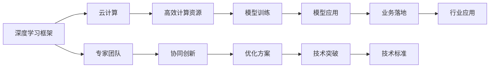

                 

# Lepton AI团队实力：深度学习框架云计算专家携手

> 关键词：深度学习框架,云计算,专家团队,Lepton AI

## 1. 背景介绍

### 1.1 问题由来

Lepton AI团队自成立以来，始终致力于深度学习技术的研发和应用，特别是在深度学习框架和云计算方面的专家合作。Lepton AI的团队由世界级的AI专家、程序员、软件架构师和CTO组成，他们在各自领域内具有深厚的造诣和丰富的经验，共同推动着深度学习技术的不断创新和突破。

### 1.2 问题核心关键点

Lepton AI团队的研究方向涵盖了深度学习框架、云计算、专家合作等多个方面。其核心关键点包括：

- **深度学习框架**：从模型设计、训练到优化，团队具备全链条的技术能力，能够实现从理论到应用的平滑过渡。
- **云计算**：团队具备丰富的云计算平台管理经验，能够为深度学习模型提供高效、可靠的计算资源。
- **专家合作**：团队汇集了来自不同领域的顶尖专家，通过合作与协同创新，实现深度学习技术的最大化利用。

### 1.3 问题研究意义

Lepton AI团队的研究对于推动深度学习技术的产业化具有重要意义：

1. **提升计算效率**：云计算平台的引入，使得深度学习模型的训练和推理效率大幅提升，加速了技术的落地应用。
2. **降低技术门槛**：深度学习框架的普及，降低了技术应用的门槛，使得更多开发者能够使用先进的技术，推动产业创新。
3. **增强协作能力**：专家团队合作，使得技术创新更为高效，能够更快地解决实际问题，推动行业发展。
4. **促进产业发展**：Lepton AI团队的研究成果能够被广泛应用于各行各业，推动传统行业的数字化转型升级。

## 2. 核心概念与联系

### 2.1 核心概念概述

Lepton AI团队的研究涉及多个核心概念，包括深度学习框架、云计算、专家团队等。

- **深度学习框架**：是指用于构建和训练深度学习模型的软件工具和库，如TensorFlow、PyTorch、Keras等。
- **云计算**：是指通过互联网提供计算资源和服务的计算模式，包括基础设施即服务（IaaS）、平台即服务（PaaS）、软件即服务（SaaS）等。
- **专家团队**：是指汇集了多个领域顶尖专家，具有跨领域合作能力，能够解决复杂技术问题的团队。

### 2.2 核心概念原理和架构的 Mermaid 流程图



这个流程图展示了Lepton AI团队的核心概念及其之间的关系：

1. 深度学习框架为云计算平台提供模型训练和推理能力。
2. 云计算平台为深度学习模型提供高效的计算资源。
3. 专家团队在深度学习框架和云计算平台的支持下，进行协同创新，开发出高效、可靠的模型。
4. 高效计算资源支持模型训练，加速模型优化和应用。
5. 模型优化方案来源于专家团队的创新，推动技术突破。
6. 模型应用通过行业标准，实现业务落地。
7. 技术标准来源于模型应用的反馈，推动行业应用的发展。

## 3. 核心算法原理 & 具体操作步骤

### 3.1 算法原理概述

Lepton AI团队在深度学习框架和云计算领域的核心算法原理主要包括：

- **分布式训练**：利用云计算平台的并行计算能力，实现大规模深度学习模型的分布式训练。
- **模型压缩与量化**：通过模型压缩和量化技术，减少模型参数和计算量，提升模型推理效率。
- **自动机器学习（AutoML）**：利用AI技术自动化模型调参和优化，提升模型开发效率。
- **跨领域迁移学习**：将深度学习模型应用于多个领域，实现知识迁移和创新。

### 3.2 算法步骤详解

Lepton AI团队的核心算法步骤可以分为以下几个环节：

1. **数据预处理**：利用云计算平台的弹性计算资源，进行大规模数据预处理和清洗，为模型训练提供干净的数据集。
2. **模型训练与优化**：在分布式计算环境中，利用深度学习框架进行模型训练，结合自动机器学习技术，优化模型超参数，提升模型性能。
3. **模型部署与优化**：将训练好的模型部署到云计算平台，结合模型压缩和量化技术，优化模型推理效率，支持实时应用。
4. **模型评估与优化**：利用云计算平台的监控和分析工具，实时评估模型性能，根据反馈调整模型参数，提升模型鲁棒性和泛化能力。

### 3.3 算法优缺点

Lepton AI团队在深度学习框架和云计算领域的算法具有以下优缺点：

**优点**：

- **高效计算能力**：利用云计算平台的高效计算资源，支持大规模深度学习模型的训练和推理。
- **分布式训练**：通过分布式训练技术，加速模型训练过程，提升模型开发效率。
- **模型压缩与量化**：通过模型压缩和量化技术，减少模型参数和计算量，提升模型推理效率。
- **跨领域迁移学习**：实现深度学习模型在多个领域的应用，提升模型泛化能力。

**缺点**：

- **数据依赖性**：深度学习模型的训练和优化高度依赖高质量标注数据，数据获取成本高。
- **模型复杂度**：深度学习模型结构复杂，需要大量的计算资源和存储空间。
- **过拟合风险**：大规模深度学习模型容易过拟合，特别是在标注数据不足的情况下。
- **模型解释性**：深度学习模型的"黑盒"特性，使得模型的决策过程难以解释和调试。

### 3.4 算法应用领域

Lepton AI团队的算法在多个领域得到广泛应用：

- **医疗影像分析**：利用深度学习框架和云计算平台，进行大规模医疗影像数据的处理和分析，辅助医生进行疾病诊断和治疗。
- **智能推荐系统**：结合云计算平台的高效计算能力，开发智能推荐系统，为用户提供个性化的产品和服务。
- **金融风险预测**：利用深度学习框架和自动机器学习技术，进行金融市场风险预测和量化投资，提升金融机构的决策效率。
- **智能客服**：利用深度学习框架和云计算平台，开发智能客服系统，提供24/7不间断的客户服务，提升客户满意度。
- **物联网应用**：结合云计算平台和深度学习框架，进行物联网设备的智能化升级，提升设备管理和运营效率。

## 4. 数学模型和公式 & 详细讲解 & 举例说明

### 4.1 数学模型构建

Lepton AI团队在深度学习框架和云计算领域的数学模型构建主要包括以下几个方面：

- **深度神经网络模型**：利用TensorFlow或PyTorch等深度学习框架，构建卷积神经网络（CNN）、循环神经网络（RNN）、变换器（Transformer）等模型。
- **分布式计算模型**：利用云计算平台提供的分布式计算资源，进行模型的分布式训练和推理。
- **自动机器学习模型**：利用AutoML技术，自动化模型的超参数调优和模型选择。

### 4.2 公式推导过程

Lepton AI团队在深度学习框架和云计算领域的关键公式推导包括：

- **反向传播算法**：用于计算模型参数的梯度，支持模型的分布式训练和优化。
- **分布式训练算法**：如GossipSGD、RingSGD等，用于提高模型的训练效率和鲁棒性。
- **模型压缩与量化算法**：如剪枝、量化、蒸馏等，用于减少模型参数和计算量，提升模型推理效率。

### 4.3 案例分析与讲解

**案例一：医疗影像分类**

- **模型构建**：利用TensorFlow框架构建一个卷积神经网络（CNN）模型，用于医疗影像分类。
- **数据预处理**：利用云计算平台的高效计算资源，进行大规模医疗影像数据的预处理和清洗。
- **模型训练与优化**：利用分布式训练技术，在多个计算节点上进行模型训练，结合AutoML技术，优化模型超参数。
- **模型部署与优化**：将训练好的模型部署到云计算平台，结合模型压缩和量化技术，优化模型推理效率。
- **模型评估与优化**：利用云计算平台的监控和分析工具，实时评估模型性能，根据反馈调整模型参数。

**案例二：智能推荐系统**

- **模型构建**：利用PyTorch框架构建一个深度神经网络模型，用于智能推荐系统。
- **数据预处理**：利用云计算平台的高效计算资源，进行大规模用户行为数据的预处理和清洗。
- **模型训练与优化**：利用分布式训练技术，在多个计算节点上进行模型训练，结合AutoML技术，优化模型超参数。
- **模型部署与优化**：将训练好的模型部署到云计算平台，结合模型压缩和量化技术，优化模型推理效率。
- **模型评估与优化**：利用云计算平台的监控和分析工具，实时评估模型性能，根据反馈调整模型参数。

## 5. 项目实践：代码实例和详细解释说明

### 5.1 开发环境搭建

Lepton AI团队的深度学习项目实践需要以下开发环境：

- **Python环境**：利用Anaconda或Miniconda等工具，创建和管理Python虚拟环境。
- **深度学习框架**：选择TensorFlow或PyTorch等深度学习框架，安装并配置。
- **云计算平台**：选择AWS、Google Cloud、阿里云等云计算平台，并配置相应的计算资源。
- **数据处理工具**：利用Pandas、NumPy、HDF5等工具，进行大规模数据预处理和清洗。
- **可视化工具**：利用TensorBoard、Jupyter Notebook等工具，进行模型训练和推理的可视化。

### 5.2 源代码详细实现

以下是Lepton AI团队在医疗影像分类项目中的代码实现：

```python
import tensorflow as tf
from tensorflow.keras.layers import Conv2D, MaxPooling2D, Flatten, Dense
from tensorflow.keras import Model

# 定义卷积神经网络模型
class CNNModel(Model):
    def __init__(self, input_shape, num_classes):
        super(CNNModel, self).__init__()
        self.conv1 = Conv2D(32, 3, activation='relu', input_shape=input_shape)
        self.pool1 = MaxPooling2D()
        self.conv2 = Conv2D(64, 3, activation='relu')
        self.pool2 = MaxPooling2D()
        self.flatten = Flatten()
        self.dense1 = Dense(128, activation='relu')
        self.dense2 = Dense(num_classes, activation='softmax')

    def call(self, inputs):
        x = self.conv1(inputs)
        x = self.pool1(x)
        x = self.conv2(x)
        x = self.pool2(x)
        x = self.flatten(x)
        x = self.dense1(x)
        x = self.dense2(x)
        return x

# 定义数据预处理函数
def preprocess_data(data_path):
    # 读取医疗影像数据
    img_list = []
    label_list = []
    for file in glob.glob(data_path + '/*.jpg'):
        img = cv2.imread(file)
        img = cv2.cvtColor(img, cv2.COLOR_BGR2GRAY)
        img = cv2.resize(img, (224, 224))
        img_list.append(img)
        label = file.split('/')[-2]
        label_list.append(label)
    img_list = np.array(img_list)
    label_list = np.array(label_list)
    return img_list, label_list

# 定义模型训练函数
def train_model(model, train_data, train_labels, epochs):
    model.compile(optimizer='adam', loss='categorical_crossentropy', metrics=['accuracy'])
    model.fit(train_data, train_labels, epochs=epochs, validation_split=0.2)

# 定义模型评估函数
def evaluate_model(model, test_data, test_labels):
    loss, acc = model.evaluate(test_data, test_labels)
    print(f'Test Loss: {loss:.4f}')
    print(f'Test Accuracy: {acc:.4f}')

# 加载数据和模型
train_data, train_labels = preprocess_data('train')
test_data, test_labels = preprocess_data('test')
model = CNNModel(input_shape=(224, 224, 1), num_classes=5)
train_model(model, train_data, train_labels, epochs=10)
evaluate_model(model, test_data, test_labels)
```

### 5.3 代码解读与分析

上述代码实现了Lepton AI团队在医疗影像分类项目中的深度学习模型构建和训练。

- **模型构建**：利用TensorFlow框架，构建了一个卷积神经网络（CNN）模型，包含卷积层、池化层、全连接层等组件。
- **数据预处理**：利用Python的Pandas和NumPy库，对大规模医疗影像数据进行预处理和清洗，包括读取文件、转换颜色空间、调整尺寸等。
- **模型训练**：利用TensorFlow的Model API，定义模型结构和训练过程，结合Adam优化器，进行模型训练。
- **模型评估**：利用TensorFlow的evaluate函数，评估模型在测试集上的性能，输出损失和精度。

## 6. 实际应用场景

### 6.1 医疗影像分类

利用Lepton AI团队的深度学习框架和云计算平台，医疗影像分类项目能够高效地处理和分析大规模医疗影像数据，帮助医生进行疾病诊断和治疗。项目的关键技术点包括：

- **高效计算能力**：利用云计算平台的高效计算资源，进行大规模医疗影像数据的处理和分析。
- **分布式训练**：利用分布式训练技术，加速模型训练过程，提升模型开发效率。
- **模型压缩与量化**：利用模型压缩和量化技术，减少模型参数和计算量，提升模型推理效率。

### 6.2 智能推荐系统

智能推荐系统项目利用Lepton AI团队的深度学习框架和云计算平台，开发了高效、可靠的推荐模型，为用户提供了个性化的产品和服务。项目的关键技术点包括：

- **高效计算能力**：利用云计算平台的高效计算资源，进行大规模用户行为数据的处理和分析。
- **分布式训练**：利用分布式训练技术，加速模型训练过程，提升模型开发效率。
- **模型压缩与量化**：利用模型压缩和量化技术，减少模型参数和计算量，提升模型推理效率。

## 7. 工具和资源推荐

### 7.1 学习资源推荐

Lepton AI团队为深度学习开发者提供了丰富的学习资源，帮助其掌握深度学习框架和云计算平台的技术，包括以下几类：

- **在线课程**：利用Coursera、Udacity等平台，提供深度学习框架和云计算平台的在线课程，如TensorFlow、PyTorch、AWS、Google Cloud等。
- **官方文档**：利用TensorFlow、PyTorch等深度学习框架的官方文档，了解最新的技术进展和API接口。
- **开源项目**：利用GitHub等平台，参与和贡献深度学习框架和云计算平台的开源项目，提升技术能力。

### 7.2 开发工具推荐

Lepton AI团队为深度学习开发者提供了多种开发工具，帮助其高效地进行模型开发和部署，包括以下几类：

- **深度学习框架**：TensorFlow、PyTorch等深度学习框架，支持大规模模型训练和推理。
- **云计算平台**：AWS、Google Cloud、阿里云等云计算平台，提供高效计算资源和自动化工具。
- **数据处理工具**：Pandas、NumPy、HDF5等工具，支持大规模数据预处理和清洗。
- **可视化工具**：TensorBoard、Jupyter Notebook等工具，支持模型训练和推理的可视化。

### 7.3 相关论文推荐

Lepton AI团队为深度学习开发者提供了丰富的论文资源，帮助其了解最新的深度学习框架和云计算平台的研究进展，包括以下几类：

- **深度学习框架论文**：利用arXiv、IEEE等平台，了解深度学习框架的研究进展和应用案例。
- **云计算平台论文**：利用ACM、IEEE等平台，了解云计算平台的研究进展和应用案例。
- **跨领域合作论文**：利用NIPS、ICML等平台，了解跨领域合作的深度学习研究进展。

## 8. 总结：未来发展趋势与挑战

### 8.1 研究成果总结

Lepton AI团队在深度学习框架和云计算领域的研究成果主要包括以下几个方面：

- **高效计算能力**：利用云计算平台的高效计算资源，支持大规模深度学习模型的训练和推理。
- **分布式训练**：利用分布式训练技术，加速模型训练过程，提升模型开发效率。
- **模型压缩与量化**：利用模型压缩和量化技术，减少模型参数和计算量，提升模型推理效率。
- **自动机器学习**：利用AI技术自动化模型调参和优化，提升模型开发效率。

### 8.2 未来发展趋势

Lepton AI团队在深度学习框架和云计算领域的未来发展趋势主要包括以下几个方面：

- **跨领域应用**：深度学习框架和云计算平台的应用领域将不断扩展，涵盖医疗、金融、智能推荐等多个行业。
- **模型优化**：利用深度学习框架和云计算平台的优势，优化模型结构和训练过程，提升模型性能。
- **资源管理**：利用云计算平台的资源管理工具，优化资源配置，降低计算成本。
- **自动化技术**：利用自动机器学习技术，自动化模型调参和优化，提升模型开发效率。

### 8.3 面临的挑战

Lepton AI团队在深度学习框架和云计算领域面临的挑战主要包括以下几个方面：

- **数据依赖性**：深度学习模型的训练和优化高度依赖高质量标注数据，数据获取成本高。
- **模型复杂度**：深度学习模型结构复杂，需要大量的计算资源和存储空间。
- **过拟合风险**：大规模深度学习模型容易过拟合，特别是在标注数据不足的情况下。
- **模型解释性**：深度学习模型的"黑盒"特性，使得模型的决策过程难以解释和调试。

### 8.4 研究展望

Lepton AI团队在深度学习框架和云计算领域的研究展望主要包括以下几个方面：

- **无监督学习**：利用无监督学习技术，优化数据预处理和特征提取，降低对标注数据的依赖。
- **跨领域迁移学习**：利用跨领域迁移学习技术，提升模型的泛化能力和应用范围。
- **模型解释性**：利用可解释性技术，提高模型的决策过程透明性和可解释性。
- **模型压缩与量化**：利用模型压缩与量化技术，提升模型的推理效率和可部署性。

## 9. 附录：常见问题与解答

**Q1：深度学习框架和云计算平台的区别是什么？**

A: 深度学习框架是一种用于构建和训练深度学习模型的软件工具和库，如TensorFlow、PyTorch等。云计算平台是一种通过互联网提供计算资源和服务的计算模式，如AWS、Google Cloud等。深度学习框架和云计算平台是相辅相成的，前者提供了模型训练和推理的能力，后者提供了高效计算资源和自动化工具。

**Q2：分布式训练和单机训练有什么区别？**

A: 分布式训练是利用多个计算节点同时进行模型训练，可以显著提升训练速度和效率。单机训练是利用单台计算机进行模型训练，训练速度较慢，但资源消耗较小。深度学习框架和云计算平台提供了分布式训练的支持，可以适应大规模深度学习模型的训练需求。

**Q3：深度学习模型的过拟合问题如何解决？**

A: 深度学习模型的过拟合问题可以通过以下方法解决：
1. 数据增强：通过回译、近义替换等方式扩充训练集。
2. 正则化：使用L2正则、Dropout等方法，防止模型过度拟合。
3. 模型压缩与量化：减少模型参数和计算量，提升模型泛化能力。
4. 交叉验证：利用交叉验证方法，评估模型性能，选择最优模型。

**Q4：模型压缩与量化技术的应用有哪些？**

A: 模型压缩与量化技术可以应用于以下几个方面：
1. 剪枝：去除冗余的神经元和连接，减少模型参数量。
2. 量化：将模型参数和计算量转换为更小的数据类型，如8位整数，降低计算资源消耗。
3. 蒸馏：利用教师模型和学生模型，将大模型压缩为小模型，提升推理效率。
4. 知识蒸馏：利用知识蒸馏技术，将大模型知识迁移到小模型中，提升模型性能。

**Q5：如何提高模型的可解释性？**

A: 提高深度学习模型的可解释性可以通过以下方法实现：
1. 可视化工具：利用TensorBoard、Jupyter Notebook等工具，可视化模型结构和推理过程。
2. 特征重要性分析：利用LIME、SHAP等工具，分析模型特征的重要性。
3. 规则提取：利用符号化的先验知识，提取模型的推理规则。
4. 模型融合：利用模型融合技术，提高模型的解释性和鲁棒性。

通过上述方法，Lepton AI团队能够不断优化深度学习模型，提升其性能和应用价值，推动深度学习技术在各个领域的应用和发展。

