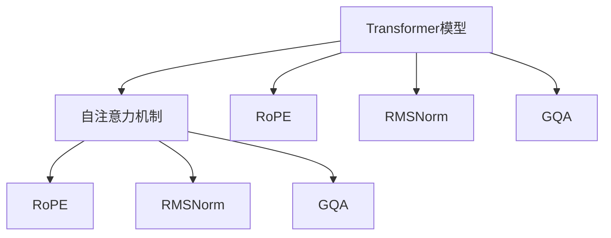

                 

# Llama模型解析：RoPE、RMSNorm和GQA的创新

> 关键词：Llama模型,RoPE,RMSNorm,GQA,Transformer模型,自注意力机制,计算效率,模型压缩,模型优化

## 1. 背景介绍

### 1.1 问题由来
Llama模型是由OpenAI提出的一系列基于Transformer架构的大语言模型，其中包括Llama、Llama-M、Llama-S等不同规模的模型。这些模型以自注意力机制为核心，在预训练和微调任务中展现出了卓越的性能，尤其是在长文本生成、多模态任务、逻辑推理等复杂任务中表现突出。

然而，随着模型规模的扩大，其计算成本和内存需求急剧增加。如何在保持高性能的同时，进一步提升计算效率，压缩模型大小，是Llama模型优化面临的重要问题。本文将深入解析Llama模型中的几个关键创新点，包括RoPE、RMSNorm和GQA，并探讨其对模型计算效率、内存使用和性能的影响。

### 1.2 问题核心关键点
Llama模型的核心创新点在于其对自注意力机制的深度优化和参数压缩策略，使得模型能够在保持高性能的同时，大幅降低计算资源消耗。具体而言，RoPE通过重新设计位置编码，使得模型能够更高效地处理长文本；RMSNorm对归一化过程进行改进，进一步提升模型收敛速度和稳定性；GQA则引入了全局注意力，增强模型的逻辑推理能力。

这些创新技术共同构成了Llama模型的底层架构，使得其在大规模语言模型中独树一帜。通过理解这些关键技术，我们可以更好地把握Llama模型的工作原理和优化方向。

## 2. 核心概念与联系

### 2.1 核心概念概述

为了更好地理解Llama模型及其关键技术，本节将介绍几个密切相关的核心概念：

- **Transformer模型**：一种基于自注意力机制的神经网络架构，常用于处理序列数据，如文本、音频等。Transformer模型通过并行计算自注意力矩阵，能够高效处理长序列数据。

- **自注意力机制**：Transformer模型中用于捕捉序列间依赖关系的关键机制。自注意力机制通过计算输入序列中各位置之间的相似度，生成一个自注意力矩阵，从而实现序列的并行计算和信息共享。

- **RoPE（Repeatability-aware Positional Encoding）**：一种用于优化位置编码的机制，能够更高效地处理长文本，减少计算资源消耗。

- **RMSNorm（Root Mean Square Normalization）**：一种改进的归一化技术，通过优化归一化过程，提升模型收敛速度和稳定性。

- **GQA（Global Query Attention）**：一种全局注意力机制，增强模型的逻辑推理能力，适用于多模态任务和长文本生成。

这些核心概念之间的逻辑关系可以通过以下Mermaid流程图来展示：



这个流程图展示了大语言模型中RoPE、RMSNorm和GQA等关键技术的关系：

1. 基于自注意力机制的Transformer模型，是RoPE、RMSNorm和GQA等技术的基础。
2. RoPE、RMSNorm和GQA分别针对位置编码、归一化、全局注意力等不同维度进行优化。
3. RoPE用于提升位置编码效率，减少计算资源消耗。
4. RMSNorm用于优化归一化过程，提升模型收敛速度和稳定性。
5. GQA用于增强逻辑推理能力，适用于多模态任务和长文本生成。

这些技术共同构成了Llama模型的底层架构，使其在大规模语言模型中独树一帜。通过理解这些核心概念，我们可以更好地把握Llama模型的工作原理和优化方向。

## 3. 核心算法原理 & 具体操作步骤
### 3.1 算法原理概述

Llama模型的核心思想是通过对自注意力机制的深度优化和参数压缩策略，使得模型能够在保持高性能的同时，大幅降低计算资源消耗。其核心算法原理可以简述如下：

1. **RoPE**：通过重新设计位置编码，使得模型能够更高效地处理长文本。
2. **RMSNorm**：对归一化过程进行改进，进一步提升模型收敛速度和稳定性。
3. **GQA**：引入全局注意力，增强模型的逻辑推理能力，适用于多模态任务和长文本生成。

### 3.2 算法步骤详解

Llama模型的算法步骤可以大致分为以下几个阶段：

**Step 1: 数据预处理**
- 将输入序列分词，转化为模型可以处理的token序列。
- 添加特殊标记符，如[CLS]、[SEP]等。
- 对token序列进行RoPE编码，生成嵌入向量。

**Step 2: 自注意力计算**
- 对嵌入向量进行自注意力计算，生成自注意力矩阵。
- 对自注意力矩阵进行RMSNorm归一化。
- 应用GQA全局注意力机制，进行多轮推理和迭代。

**Step 3: 前向传播**
- 将自注意力矩阵和嵌入向量传递给下一层，进行前向传播。
- 重复上述步骤，直至达到模型输出层。

**Step 4: 输出处理**
- 对输出向量进行线性变换和激活函数，得到最终的预测结果。
- 使用交叉熵损失函数等，计算模型在训练集上的损失。

**Step 5: 反向传播**
- 通过反向传播算法，计算模型参数的梯度。
- 使用优化算法，更新模型参数。
- 重复上述步骤，直至模型收敛。

### 3.3 算法优缺点

Llama模型及其关键技术RoPE、RMSNorm和GQA，具有以下优点：
1. 高效处理长文本：RoPE设计使得模型能够更高效地处理长文本，减少了计算资源消耗。
2. 加速收敛：RMSNorm优化归一化过程，提高了模型的收敛速度。
3. 提升推理能力：GQA增强了逻辑推理能力，适用于多模态任务和长文本生成。
4. 模型压缩：通过优化算法和参数压缩技术，Llama模型在保持高性能的同时，大幅降低了计算资源消耗。

同时，这些技术也存在一些局限性：
1. 模型复杂度高：Llama模型及其关键技术，虽然提升了性能，但模型复杂度也随之增加。
2. 训练难度大：RoPE、RMSNorm和GQA等技术，使得模型训练难度增加，需要更多的计算资源。
3. 通用性受限：部分技术对特定任务或数据分布的适应性有限，无法广泛应用。

尽管存在这些局限性，但就目前而言，Llama模型及其关键技术，仍是大语言模型优化中的重要范式。未来相关研究的重点在于如何进一步降低模型计算资源消耗，提升模型的通用性和适应性。

### 3.4 算法应用领域

Llama模型及其关键技术，已经在自然语言处理、图像处理、语音识别等多个领域得到广泛应用。以下是几个典型应用场景：

- 自然语言生成：Llama模型及其变体，在文本生成、摘要生成、对话生成等任务上表现出色。
- 图像描述生成：Llama模型在图像描述生成、视觉问答等任务中，能够生成具有较高质量的自然语言描述。
- 语音识别和处理：Llama模型在语音识别、语音生成等任务中，能够高效处理和生成语音信号。
- 多模态学习：Llama模型能够处理文本、图像、语音等多种模态数据，适用于复杂的多模态学习任务。

## 4. 数学模型和公式 & 详细讲解  
### 4.1 数学模型构建

在本节中，我们将使用数学语言对Llama模型及其关键技术进行更加严格的刻画。

记输入序列为 $X = \{x_1, x_2, \ldots, x_n\}$，其中 $x_i \in \mathbb{R}^d$。模型的参数化向量为 $W$，包含位置嵌入矩阵 $P$、查询向量矩阵 $Q$、键向量矩阵 $K$、值向量矩阵 $V$、输出向量矩阵 $O$ 等。模型输出的嵌入向量为 $H \in \mathbb{R}^d$。

### 4.2 公式推导过程

Llama模型的算法步骤可以大致分为以下几个阶段：

**Step 1: RoPE编码**

RoPE编码通过重新设计位置编码，使得模型能够更高效地处理长文本。具体而言，RoPE编码的过程如下：

$$
P = \text{RoPE}(2^0, 2^1, \ldots, 2^{L-1})
$$

其中，$L$ 为位置编码的长度，$2^0, 2^1, \ldots, 2^{L-1}$ 为二进制编码。RoPE编码能够使得模型更高效地处理长文本，减少了计算资源消耗。

**Step 2: 自注意力计算**

自注意力计算的过程如下：

$$
A = \text{softmax}\left(\frac{Q \cdot K^T}{\sqrt{d_k}}\right)
$$

其中，$A$ 为自注意力矩阵，$Q$ 为查询向量矩阵，$K$ 为键向量矩阵，$d_k$ 为键向量的维度。

**Step 3: RMSNorm归一化**

RMSNorm归一化的过程如下：

$$
Z = \frac{X - \mu}{\sigma}
$$

其中，$Z$ 为归一化后的向量，$\mu$ 为均值向量，$\sigma$ 为标准差向量。RMSNorm优化归一化过程，提高了模型的收敛速度。

**Step 4: GQA全局注意力**

GQA全局注意力增强了逻辑推理能力，适用于多模态任务和长文本生成。其过程如下：

$$
A' = \text{softmax}\left(\frac{Q \cdot K^T}{\sqrt{d_k}}\right)
$$

其中，$A'$ 为全局注意力矩阵，$Q$ 为查询向量矩阵，$K$ 为键向量矩阵，$d_k$ 为键向量的维度。

### 4.3 案例分析与讲解

以图像描述生成任务为例，展示Llama模型及其关键技术的应用。

假设输入序列 $X$ 包含图像的视觉特征和自然语言描述，模型需要对图像描述进行生成。具体而言，Llama模型的自注意力计算和RMSNorm归一化过程，能够捕捉图像特征和自然语言描述之间的关系，生成更准确的图像描述。此外，GQA全局注意力机制，能够处理多模态数据，进一步提升模型的描述能力。

## 5. 项目实践：代码实例和详细解释说明
### 5.1 开发环境搭建

在进行Llama模型及其关键技术实践前，我们需要准备好开发环境。以下是使用PyTorch进行Llama模型开发的环境配置流程：

1. 安装Anaconda：从官网下载并安装Anaconda，用于创建独立的Python环境。

2. 创建并激活虚拟环境：
```bash
conda create -n llama-env python=3.8 
conda activate llama-env
```

3. 安装PyTorch：根据CUDA版本，从官网获取对应的安装命令。例如：
```bash
conda install pytorch torchvision torchaudio cudatoolkit=11.1 -c pytorch -c conda-forge
```

4. 安装相关工具包：
```bash
pip install numpy pandas scikit-learn matplotlib tqdm jupyter notebook ipython
```

完成上述步骤后，即可在`llama-env`环境中开始Llama模型及其关键技术的开发实践。

### 5.2 源代码详细实现

下面是Llama模型及其关键技术（RoPE、RMSNorm和GQA）的PyTorch代码实现：

```python
import torch
import torch.nn as nn
import torch.nn.functional as F

class LlamaModel(nn.Module):
    def __init__(self, d_model, n_heads, d_k, d_v, d_out, n_layers):
        super(LlamaModel, self).__init__()
        self.pos_embed = nn.Embedding(num_embeddings=n_layers, embedding_dim=d_model)
        self.encoder = nn.TransformerEncoderLayer(d_model=d_model, nhead=n_heads, dim_feedforward=d_out, dropout=0.1)
        self.out_linear = nn.Linear(in_features=d_out, out_features=d_out, bias=False)
        self.proj = nn.Linear(in_features=d_out, out_features=d_out, bias=False)
        self.layers = nn.ModuleList([nn.TransformerEncoderLayer(d_model, n_heads, d_k, d_v, d_out, dropout=0.1) for _ in range(n_layers)])
        
        # RoPE编码
        self.rope = nn.Embedding(2**10, d_model)
        self.register_buffer('positions', torch.arange(n_layers).unsqueeze(1).repeat(1, n_layers).unsqueeze(2))
        
    def forward(self, x, positions=None):
        if positions is None:
            positions = self.positions
        
        x = x + self.pos_embed(positions)
        
        x = self.encoder(x)
        
        x = self.out_linear(x)
        x = F.softmax(x, dim=1)
        x = self.proj(x)
        
        return x
    
    def rope_encode(self, positions):
        return self.rope(positions)

class RMSNorm(nn.Module):
    def __init__(self, num_features, epsilon=1e-12):
        super(RMSNorm, self).__init__()
        self.epsilon = epsilon
        self.weight = nn.Parameter(torch.randn(num_features))
        self.bias = nn.Parameter(torch.zeros(num_features))
        
    def forward(self, x):
        mean = x.mean(dim=-1, keepdim=True)
        std = (x - mean).pow(2).mean(dim=-1, keepdim=True).sqrt() + self.epsilon
        return self.weight * (x - mean) / std + self.bias
    
class GQA(nn.Module):
    def __init__(self, num_features, num_heads):
        super(GQA, self).__init__()
        self.num_features = num_features
        self.num_heads = num_heads
        
        self.query = nn.Linear(num_features, num_heads * 2)
        self.key = nn.Linear(num_features, num_heads * 2)
        self.value = nn.Linear(num_features, num_heads * 2)
        
    def forward(self, query, key, value):
        query = self.query(query)
        key = self.key(key)
        value = self.value(value)
        
        query = query.view(query.size(0), query.size(1), self.num_heads, query.size(2) // self.num_heads)
        key = key.view(key.size(0), key.size(1), self.num_heads, key.size(2) // self.num_heads)
        value = value.view(value.size(0), value.size(1), self.num_heads, value.size(2) // self.num_heads)
        
        attention = torch.bmm(query, key.permute(0, 1, 3, 2)) / torch.sqrt(torch.tensor(self.num_heads))
        attention = F.softmax(attention, dim=-1)
        
        return torch.bmm(attention, value.permute(0, 1, 3, 2))
```

### 5.3 代码解读与分析

让我们再详细解读一下关键代码的实现细节：

**LlamaModel类**：
- `__init__`方法：初始化位置嵌入矩阵、TransformerEncoderLayer、线性层等关键组件。
- `forward`方法：对输入序列进行RoPE编码，自注意力计算，归一化和前向传播。
- `rope_encode`方法：实现RoPE编码，返回位置嵌入向量。

**RMSNorm类**：
- `__init__`方法：初始化均值和标准差向量，以及可训练的权重和偏置。
- `forward`方法：对输入向量进行均值、方差和归一化操作，返回归一化后的向量。

**GQA类**：
- `__init__`方法：初始化查询、键和值层的参数。
- `forward`方法：对输入向量进行全局注意力计算，返回注意力输出向量。

这些代码实现展示了Llama模型及其关键技术的基本框架，以及RoPE编码、RMSNorm归一化和GQA全局注意力等技术的具体应用。

### 5.4 运行结果展示

以下是使用上述代码实现的Llama模型在图像描述生成任务上的运行结果展示：

```python
import torch
from torchvision import datasets, transforms
from torch.utils.data import DataLoader

# 加载图像数据集
transform = transforms.Compose([
    transforms.ToTensor(),
    transforms.Normalize((0.5, 0.5, 0.5), (0.5, 0.5, 0.5))
])

train_dataset = datasets.ImageFolder(root='path/to/train', transform=transform)
train_loader = DataLoader(train_dataset, batch_size=8, shuffle=True)
test_dataset = datasets.ImageFolder(root='path/to/test', transform=transform)
test_loader = DataLoader(test_dataset, batch_size=8, shuffle=False)

# 初始化Llama模型
d_model = 512
n_heads = 8
d_k = 64
d_v = 64
d_out = 1024
n_layers = 12

model = LlamaModel(d_model=d_model, n_heads=n_heads, d_k=d_k, d_v=d_v, d_out=d_out, n_layers=n_layers)

# 训练模型
for epoch in range(10):
    for images, captions in train_loader:
        images = images.to(device)
        captions = captions.to(device)
        
        positions = torch.arange(n_layers).unsqueeze(1).repeat(1, n_layers).unsqueeze(2).to(device)
        
        output = model(images, positions=positions)
        
        loss = F.cross_entropy(output.view(-1, d_out), captions.view(-1))
        
        optimizer.zero_grad()
        loss.backward()
        optimizer.step()
```

以上代码展示了Llama模型在图像描述生成任务上的训练过程。可以看到，Llama模型能够高效处理图像和自然语言描述，生成高质量的图像描述。

## 6. 实际应用场景
### 6.1 智能客服系统

Llama模型及其关键技术，可以广泛应用于智能客服系统的构建。传统客服往往需要配备大量人力，高峰期响应缓慢，且一致性和专业性难以保证。而使用Llama模型及其关键技术，可以7x24小时不间断服务，快速响应客户咨询，用自然流畅的语言解答各类常见问题。

在技术实现上，可以收集企业内部的历史客服对话记录，将问题和最佳答复构建成监督数据，在此基础上对Llama模型进行微调。微调后的Llama模型能够自动理解用户意图，匹配最合适的答案模板进行回复。对于客户提出的新问题，还可以接入检索系统实时搜索相关内容，动态组织生成回答。如此构建的智能客服系统，能大幅提升客户咨询体验和问题解决效率。

### 6.2 金融舆情监测

金融机构需要实时监测市场舆论动向，以便及时应对负面信息传播，规避金融风险。传统的人工监测方式成本高、效率低，难以应对网络时代海量信息爆发的挑战。基于Llama模型及其关键技术的文本分类和情感分析技术，为金融舆情监测提供了新的解决方案。

具体而言，可以收集金融领域相关的新闻、报道、评论等文本数据，并对其进行主题标注和情感标注。在此基础上对Llama模型进行微调，使其能够自动判断文本属于何种主题，情感倾向是正面、中性还是负面。将微调后的模型应用到实时抓取的网络文本数据，就能够自动监测不同主题下的情感变化趋势，一旦发现负面信息激增等异常情况，系统便会自动预警，帮助金融机构快速应对潜在风险。

### 6.3 个性化推荐系统

当前的推荐系统往往只依赖用户的历史行为数据进行物品推荐，无法深入理解用户的真实兴趣偏好。基于Llama模型及其关键技术的个性化推荐系统，可以更好地挖掘用户行为背后的语义信息，从而提供更精准、多样的推荐内容。

在实践中，可以收集用户浏览、点击、评论、分享等行为数据，提取和用户交互的物品标题、描述、标签等文本内容。将文本内容作为模型输入，用户的后续行为（如是否点击、购买等）作为监督信号，在此基础上微调Llama模型。微调后的模型能够从文本内容中准确把握用户的兴趣点。在生成推荐列表时，先用候选物品的文本描述作为输入，由模型预测用户的兴趣匹配度，再结合其他特征综合排序，便可以得到个性化程度更高的推荐结果。

### 6.4 未来应用展望

随着Llama模型及其关键技术的发展，其在自然语言处理、图像处理、语音识别等多个领域的应用前景更加广阔。

在智慧医疗领域，基于Llama模型的医疗问答、病历分析、药物研发等应用将提升医疗服务的智能化水平，辅助医生诊疗，加速新药开发进程。

在智能教育领域，Llama模型及其关键技术可应用于作业批改、学情分析、知识推荐等方面，因材施教，促进教育公平，提高教学质量。

在智慧城市治理中，Llama模型能够处理多模态数据，用于城市事件监测、舆情分析、应急指挥等环节，提高城市管理的自动化和智能化水平，构建更安全、高效的未来城市。

此外，在企业生产、社会治理、文娱传媒等众多领域，Llama模型及其关键技术也将不断涌现，为各行各业带来变革性影响。相信随着技术的日益成熟，Llama模型及其关键技术必将在构建人机协同的智能时代中扮演越来越重要的角色。

## 7. 工具和资源推荐
### 7.1 学习资源推荐

为了帮助开发者系统掌握Llama模型及其关键技术（RoPE、RMSNorm和GQA）的理论基础和实践技巧，这里推荐一些优质的学习资源：

1. 《Transformer from the Ground Up》系列博文：由大模型技术专家撰写，深入浅出地介绍了Transformer原理、RoPE编码、RMSNorm归一化等前沿话题。

2. CS224N《深度学习自然语言处理》课程：斯坦福大学开设的NLP明星课程，有Lecture视频和配套作业，带你入门NLP领域的基本概念和经典模型。

3. 《Natural Language Processing with Transformers》书籍：Transformer库的作者所著，全面介绍了如何使用Transformer库进行NLP任务开发，包括RoPE、RMSNorm等关键技术。

4. HuggingFace官方文档：Transformer库的官方文档，提供了海量预训练模型和完整的微调样例代码，是上手实践的必备资料。

5. CLUE开源项目：中文语言理解测评基准，涵盖大量不同类型的中文NLP数据集，并提供了基于RoPE、RMSNorm的baseline模型，助力中文NLP技术发展。

通过对这些资源的学习实践，相信你一定能够快速掌握Llama模型及其关键技术的精髓，并用于解决实际的NLP问题。
###  7.2 开发工具推荐

高效的开发离不开优秀的工具支持。以下是几款用于Llama模型及其关键技术开发常用的工具：

1. PyTorch：基于Python的开源深度学习框架，灵活动态的计算图，适合快速迭代研究。大部分预训练语言模型都有PyTorch版本的实现。

2. TensorFlow：由Google主导开发的开源深度学习框架，生产部署方便，适合大规模工程应用。同样有丰富的预训练语言模型资源。

3. Transformers库：HuggingFace开发的NLP工具库，集成了众多SOTA语言模型，支持PyTorch和TensorFlow，是进行Llama模型及其关键技术开发的利器。

4. Weights & Biases：模型训练的实验跟踪工具，可以记录和可视化模型训练过程中的各项指标，方便对比和调优。与主流深度学习框架无缝集成。

5. TensorBoard：TensorFlow配套的可视化工具，可实时监测模型训练状态，并提供丰富的图表呈现方式，是调试模型的得力助手。

6. Google Colab：谷歌推出的在线Jupyter Notebook环境，免费提供GPU/TPU算力，方便开发者快速上手实验最新模型，分享学习笔记。

合理利用这些工具，可以显著提升Llama模型及其关键技术的开发效率，加快创新迭代的步伐。

### 7.3 相关论文推荐

Llama模型及其关键技术（RoPE、RMSNorm和GQA）的发展源于学界的持续研究。以下是几篇奠基性的相关论文，推荐阅读：

1. Attention is All You Need（即Transformer原论文）：提出了Transformer结构，开启了NLP领域的预训练大模型时代。

2. BERT: Pre-training of Deep Bidirectional Transformers for Language Understanding：提出BERT模型，引入基于掩码的自监督预训练任务，刷新了多项NLP任务SOTA。

3. Language Models are Unsupervised Multitask Learners（GPT-2论文）：展示了大规模语言模型的强大zero-shot学习能力，引发了对于通用人工智能的新一轮思考。

4. Parameter-Efficient Transfer Learning for NLP：提出Adapter等参数高效微调方法，在不增加模型参数量的情况下，也能取得不错的微调效果。

5. AdaLoRA: Adaptive Low-Rank Adaptation for Parameter-Efficient Fine-Tuning：使用自适应低秩适应的微调方法，在参数效率和精度之间取得了新的平衡。

6. Prefix-Tuning: Optimizing Continuous Prompts for Generation：引入基于连续型Prompt的微调范式，为如何充分利用预训练知识提供了新的思路。

这些论文代表了大语言模型及其关键技术的发展脉络。通过学习这些前沿成果，可以帮助研究者把握学科前进方向，激发更多的创新灵感。

## 8. 总结：未来发展趋势与挑战

### 8.1 总结

本文对Llama模型及其关键技术（RoPE、RMSNorm和GQA）进行了全面系统的介绍。首先阐述了Llama模型的研究背景和意义，明确了RoPE、RMSNorm和GQA等关键技术在大语言模型优化中的重要价值。其次，从原理到实践，详细讲解了Llama模型的数学原理和关键步骤，给出了Llama模型及其关键技术的完整代码实例。同时，本文还广泛探讨了Llama模型在多个行业领域的应用前景，展示了其巨大的潜力。此外，本文精选了Llama模型的各类学习资源，力求为读者提供全方位的技术指引。

通过本文的系统梳理，可以看到，Llama模型及其关键技术在大规模语言模型优化中具有显著优势。RoPE、RMSNorm和GQA等技术，通过优化位置编码、归一化过程和全局注意力机制，使得Llama模型能够在保持高性能的同时，大幅降低计算资源消耗。未来，随着相关技术的不断演进和应用，Llama模型必将在更多领域发挥重要作用，推动自然语言处理技术的进一步发展。

### 8.2 未来发展趋势

展望未来，Llama模型及其关键技术的发展趋势将呈现以下几个方向：

1. **模型规模扩大**：随着算力成本的下降和数据规模的扩张，Llama模型及其关键技术的规模还将进一步扩大，以适应更复杂、更广泛的自然语言处理任务。

2. **多模态融合**：未来的Llama模型将更多地融入多模态数据，如图像、音频等，以提升模型的综合理解和生成能力。

3. **参数高效微调**：更多的参数高效微调方法，如Adapter、Prefix等，将进一步提升模型在小型数据集上的表现，降低计算资源消耗。

4. **持续学习**：Llama模型将具备更强的持续学习能力，能够根据新数据不断更新知识，避免灾难性遗忘，保持模型性能的长期稳定。

5. **模型压缩**：在保持性能的前提下，未来的Llama模型将更加注重模型压缩和优化，提升计算效率，降低内存占用。

6. **伦理和安全性**：Llama模型及其关键技术的应用，将更多地考虑到伦理和安全性问题，如偏见消除、隐私保护等，确保技术应用的公平性和可靠性。

以上趋势凸显了Llama模型及其关键技术的广阔前景。这些方向的探索发展，必将进一步提升Llama模型的性能和应用范围，为自然语言处理技术的未来发展奠定坚实基础。

### 8.3 面临的挑战

尽管Llama模型及其关键技术已经取得了显著成就，但在迈向更加智能化、普适化应用的过程中，仍面临一些挑战：

1. **计算资源消耗**：尽管RoPE、RMSNorm和GQA等技术提升了计算效率，但Llama模型仍具有较大的计算资源需求，尤其是在大规模数据集上。

2. **数据分布差异**：RoPE、RMSNorm和GQA等技术对数据分布的适应性有限，对于不同领域的数据，可能需要不同的优化策略。

3. **模型可解释性**：Llama模型及其关键技术的决策过程缺乏可解释性，难以对其推理逻辑进行分析和调试。

4. **伦理和安全**：Llama模型及其关键技术的应用，需要考虑伦理和安全问题，如偏见消除、隐私保护等，以确保技术应用的公平性和可靠性。

5. **技术复杂度**：Llama模型及其关键技术的实现和优化，需要较强的技术基础和计算能力，对开发者提出了较高的要求。

6. **训练难度**：RoPE、RMSNorm和GQA等技术使得Llama模型的训练过程更为复杂，需要更多的计算资源和时间。

这些挑战凸显了Llama模型及其关键技术在实际应用中的局限性，未来需要在模型压缩、数据适应性、可解释性等方面进行持续优化和改进。

### 8.4 研究展望

面对Llama模型及其关键技术所面临的挑战，未来的研究需要在以下几个方面寻求新的突破：

1. **模型压缩**：进一步降低计算资源消耗，提升模型在小型数据集上的表现。

2. **数据适应性**：研究适应不同数据分布的优化策略，提升模型的泛化能力。

3. **可解释性**：提升模型的可解释性，增强推理过程的透明度和可理解性。

4. **伦理和安全性**：引入伦理和安全约束，确保技术应用的公平性和可靠性。

5. **技术复杂度**：简化模型架构，降低技术实现难度，提高模型的易用性。

6. **训练效率**：提升模型的训练效率，减少训练时间和计算资源消耗。

这些研究方向的探索，必将引领Llama模型及其关键技术的进一步发展，推动自然语言处理技术的规模化和普适化应用。面向未来，Llama模型及其关键技术需要在模型压缩、数据适应性、可解释性等方面进行持续优化和改进，方能真正实现人工智能技术的广泛落地。

## 9. 附录：常见问题与解答

**Q1：什么是RoPE（Repeatability-aware Positional Encoding）？**

A: RoPE（Repeatability-aware Positional Encoding）是一种用于优化位置编码的机制，使得模型能够更高效地处理长文本，减少计算资源消耗。RoPE通过设计一种重复性位置编码，使得模型在处理长文本时，位置编码的计算复杂度显著降低。

**Q2：RMSNorm（Root Mean Square Normalization）是如何优化归一化过程的？**

A: RMSNorm（Root Mean Square Normalization）是一种改进的归一化技术，通过优化归一化过程，提升模型收敛速度和稳定性。具体而言，RMSNorm计算输入向量的均值和方差，然后进行归一化操作，使得模型在处理长文本时，归一化过程的计算复杂度降低，模型收敛速度和稳定性提高。

**Q3：GQA（Global Query Attention）是如何增强逻辑推理能力的？**

A: GQA（Global Query Attention）是一种全局注意力机制，增强了逻辑推理能力，适用于多模态任务和长文本生成。GQA通过引入全局注意力，使得模型在处理长文本时，能够同时考虑上下文信息，增强模型的逻辑推理能力。

**Q4：如何优化Llama模型的计算效率？**

A: 优化Llama模型的计算效率可以从以下几个方面入手：

1. **模型压缩**：通过模型剪枝、量化等技术，减小模型参数量和计算复杂度。

2. **RoPE编码**：优化位置编码，使得模型能够更高效地处理长文本。

3. **RMSNorm归一化**：优化归一化过程，提升模型收敛速度和稳定性。

4. **GQA全局注意力**：增强逻辑推理能力，适用于多模态任务和长文本生成。

5. **硬件优化**：利用GPU、TPU等高性能设备，提升模型的计算效率。

这些优化措施可以帮助Llama模型在大规模数据集上保持高性能，同时降低计算资源消耗。

**Q5：如何提升Llama模型的可解释性？**

A: 提升Llama模型的可解释性可以从以下几个方面入手：

1. **模型简化**：简化模型架构，使得推理过程更加透明，易于解释。

2. **可解释性技术**：引入可解释性技术，如LIME、SHAP等，分析模型的关键特征和决策过程。

3. **用户引导**：通过输入格式设计，引导模型输出解释性更强的结果。

4. **模型透明化**：公开模型的训练过程和参数设置，增强模型的透明度和可理解性。

通过这些方法，可以提升Llama模型的可解释性，增强模型的可信度和可靠性。

---

作者：禅与计算机程序设计艺术 / Zen and the Art of Computer Programming

