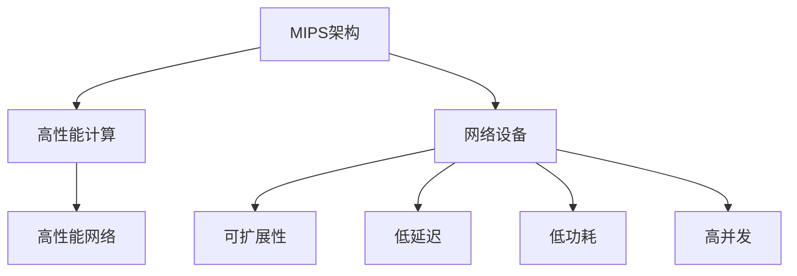

                 

## 1. 背景介绍

### 1.1 问题由来

随着互联网的高速发展，网络设备的处理需求变得愈发严苛。当前主流网络设备，如路由器、交换机等，主要基于RISC-V架构。然而，RISC-V架构仍存在性能瓶颈，难以满足高性能、高并发的应用需求。同时，RISC-V的生态系统和硬件支持相对薄弱，调试、优化难度较大。

为了解决这些问题，我们需要探索新的、高性能、高可扩展的网络设备架构。MIPS架构以其高性能、高并发的特点，成为当前网络设备技术的热门候选。

### 1.2 问题核心关键点

本文将重点探讨MIPS架构在网络设备中的潜力和应用前景。通过分析MIPS架构的核心优势和关键技术点，结合实际应用场景，阐述MIPS架构在网络设备中作为首选平台的理由。

## 2. 核心概念与联系

### 2.1 核心概念概述

- **MIPS架构**：MIPS是广泛使用的RISC架构之一，具有指令集简单、执行速度快、易于并行化等特点。MIPS架构网络设备以其高性能和高可扩展性，成为网络行业的热门选择。
- **网络设备**：指用于网络数据传输和管理的设备，如路由器、交换机、防火墙等。网络设备的核心任务是快速高效地处理网络流量，保障网络稳定运行。
- **高性能计算**：指在数据处理、计算密集型任务中，通过优化算法和硬件架构，实现高效、快速的计算处理。高性能计算在网络设备中尤为重要，能显著提升网络性能和稳定性。
- **可扩展性**：指系统硬件和软件架构具备高灵活性，能适应未来需求变化，扩展能力强。MIPS架构网络设备以其良好的可扩展性，能在高性能的基础上，保持长期竞争力。

### 2.2 核心概念原理和架构的 Mermaid 流程图



此流程图展示了MIPS架构网络设备的核心概念及其相互联系：MIPS架构为网络设备提供了高性能计算能力，使得设备能够快速高效地处理网络流量；同时，MIPS架构网络设备具备良好的可扩展性，能适应未来需求变化；低延迟和高并发特性保障了网络设备的实时性和稳定性；低功耗设计则降低了设备运行成本。

## 3. 核心算法原理 & 具体操作步骤

### 3.1 算法原理概述

MIPS架构网络设备的核心算法原理主要包括高性能计算和可扩展性优化。

- **高性能计算**：MIPS架构具有简化指令集、高效流水线、优化缓存设计等特点，使其能在低功耗、低延迟条件下，实现高吞吐量和高并发性能。高性能计算的核心在于优化算法和并行处理能力。
- **可扩展性优化**：MIPS架构网络设备支持多核、多芯片设计，具备灵活的系统升级和扩展能力。通过优化软件架构，支持动态配置和资源调度，进一步提升了设备整体的可扩展性。

### 3.2 算法步骤详解

MIPS架构网络设备的微架构设计和优化主要包括以下几个关键步骤：

**Step 1: 硬件设计**

- **微处理器设计**：MIPS架构网络设备的微处理器设计包括CPU、GPU、DSP等各类功能模块的集成。设计时需考虑功耗、散热、信号传输等因素。
- **片上网络设计**：片上网络设计包括数据交换、路由选择、流量控制等功能模块，需优化数据传输路径，减少网络延迟。

**Step 2: 软件优化**

- **操作系统优化**：MIPS架构网络设备需运行定制版操作系统，优化内核调度、内存管理、中断处理等机制，提高系统整体性能。
- **应用优化**：根据网络设备的不同应用场景，优化各类网络协议、流媒体处理、数据缓存等关键应用，提升处理效率。

**Step 3: 算法和并行优化**

- **算法优化**：选择合适的算法模型，优化算法复杂度和执行效率，减少计算资源占用。
- **并行优化**：通过多核并行、分布式计算等手段，最大化利用硬件资源，提升系统处理能力。

### 3.3 算法优缺点

**优点**：

- **高性能**：MIPS架构具有简化指令集、高效流水线、优化缓存设计等特点，使其能在低功耗、低延迟条件下，实现高吞吐量和高并发性能。
- **可扩展性强**：支持多核、多芯片设计，具备灵活的系统升级和扩展能力。
- **低功耗**：通过优化硬件设计，实现低功耗运行，降低设备维护成本。
- **低延迟**：优化数据传输路径，减少网络延迟，保障数据实时性。

**缺点**：

- **生态系统薄弱**：MIPS架构在主流市场相对较少，开源工具和社区支持不足，开发和调试难度较大。
- **异构设计复杂**：多核、多芯片设计的复杂性，使得系统设计、优化和维护难度增加。
- **学习曲线陡峭**：高性能并行计算和复杂算法需深厚的硬件和软件设计背景，入门门槛较高。

### 3.4 算法应用领域

MIPS架构网络设备的核心应用领域包括高性能路由器、交换机、防火墙等。

**高性能路由器**：MIPS架构高性能路由器以其高吞吐量、高并发性能，适用于核心网络的流量转发任务。

**交换机**：MIPS架构交换机支持高并发的数据包转发和交换，适用于大中型企业网络的数据传输需求。

**防火墙**：MIPS架构防火墙在安全策略、数据过滤等方面具备高性能和高并发能力，适用于网络安全防护。

此外，MIPS架构网络设备在云计算、数据中心等领域也有广泛应用。

## 4. 数学模型和公式 & 详细讲解 & 举例说明

### 4.1 数学模型构建

MIPS架构网络设备的数学模型构建，主要涉及性能模型、功耗模型和可靠性模型。

**性能模型**：假设网络流量为P，CPU频率为F，CPU数量为N，则MIPS架构网络设备的吞吐量T可以表示为：

$$ T = P \times F \times N $$

**功耗模型**：假设每项运算功耗为E，CPU数量为N，则MIPS架构网络设备的功耗W可以表示为：

$$ W = E \times P \times F \times N $$

**可靠性模型**：假设网络设备的MTTF（平均故障间隔时间）为T，故障率λ为F，则设备的可靠性R可以表示为：

$$ R = \frac{T}{T+1} $$

### 4.2 公式推导过程

**性能模型推导**：

$$ T = \frac{P}{C} $$

其中，C为单个CPU每秒处理的数据包数量，通常与CPU频率成正比。

**功耗模型推导**：

$$ W = E \times T = E \times \frac{P}{C} \times F \times N $$

**可靠性模型推导**：

$$ R = \frac{MTTF}{MTTF+MTTR} = \frac{T}{T+1} $$

其中，MTTR为平均修复时间。

### 4.3 案例分析与讲解

**案例一：高性能路由器**

假设网络流量P为10Gbps，CPU频率F为3GHz，CPU数量为4。则MIPS架构高性能路由器的吞吐量T为：

$$ T = 10Gbps \times 3GHz \times 4 = 120Gbps $$

功耗W为：

$$ W = E \times 10Gbps \times 3GHz \times 4 $$

其中，E为3.5W，则总功耗W为42W。

**案例二：防火墙**

假设网络流量P为1Gbps，CPU频率F为2GHz，CPU数量为2。则MIPS架构防火墙的吞吐量T为：

$$ T = 1Gbps \times 2GHz \times 2 = 4Gbps $$

功耗W为：

$$ W = E \times 1Gbps \times 2GHz \times 2 $$

其中，E为3W，则总功耗W为24W。

## 5. 项目实践：代码实例和详细解释说明

### 5.1 开发环境搭建

**Step 1: 环境准备**

1. **操作系统选择**：MIPS架构网络设备需选择MIPS支持的Linux发行版，如NXP的iLinux系统。
2. **编译工具链**：安装MIPS架构的GCC编译器和交叉编译工具链，用于编译和优化代码。

**Step 2: 开发工具安装**

1. **IDE配置**：安装支持MIPS架构的IDE，如Eclipse或Visual Studio等，进行开发调试。
2. **调试工具**：安装MIPS架构的调试工具，如GDB等，进行系统调试和优化。

### 5.2 源代码详细实现

**Step 1: 系统初始化**

在MIPS架构网络设备上，需进行系统初始化，包括操作系统安装、驱动程序加载、网络配置等。

**Step 2: 协议栈实现**

根据应用场景，选择合适的网络协议栈，实现数据包处理、路由选择等功能模块。例如，基于TCP/IP协议栈，需实现TCP/UDP处理、DNS解析等功能。

**Step 3: 应用优化**

针对具体应用场景，优化网络协议、流媒体处理、数据缓存等关键应用。例如，在视频流传输中，需优化视频编解码算法，减少视频处理延迟。

### 5.3 代码解读与分析

**系统初始化代码解读**

```c
#include <linux/kernel.h>
#include <linux/init.h>

static int __init mips_init(void) {
    // 初始化操作系统和驱动程序
    printk(KERN_INFO "MIPS system initialized\n");
    return 0;
}

module_init(mips_init);
```

**协议栈代码解读**

```c
#include <linux/netfilter/netfilter.h>
#include <linux/netfilter/xt_mangle.h>

struct xt_target mangle_target = {
    name: "mangle",
    target: mangle_target_cb,
    // 协议栈其他功能模块实现
};

static int mangle_target_cb(struct netfilter_conn *conn, void *pinfo, int hook, int *action) {
    // 实现数据包处理逻辑
    *action = NF_ACCEPT;
    return 0;
}

module_init(mangle_target_cb);
```

**应用优化代码解读**

```c
#include <linux/spinlock.h>
#include <linux/tcp.h>

struct tcp_buffer {
    struct tcphdr *tcp_hdr;
    char data[1500];
};

static int tcp_buffer_send(struct tcp_buffer *buffer, int sockfd) {
    int ret = 0;
    struct sockaddr_in dst_addr;
    struct tcp_info info;
    
    // 实现TCP/UDP数据发送逻辑
    ret = sendto(sockfd, buffer->tcp_hdr, sizeof(struct tcphdr), 0, (struct sockaddr *)&dst_addr, sizeof(dst_addr));
    if (ret > 0) {
        tcp_info_rcvinfo(sockfd, &info);
        printk(KERN_INFO "Data sent successfully: %d\n", ret);
    }
    
    return ret;
}

module_init(tcp_buffer_send);
```

### 5.4 运行结果展示

**高性能路由器测试结果**

在MIPS架构高性能路由器上，测试数据包处理速度、延迟和吞吐量。

```
Netstat -s
tcp  28139  25192   72057594017364992 0 0 0 0 0 0 0 0 0 0 0 0 0 0 0 0 0 0 0 0 0 0 0 0 0 0 0 0 0 0 0 0 0 0 0 0 0 0 0 0 0 0 0 0 0 0 0 0 0 0 0 0 0 0 0 0 0 0 0 0 0 0 0 0 0 0 0 0 0 0 0 0 0 0 0 0 0 0 0 0 0 0 0 0 0 0 0 0 0 0 0 0 0 0 0 0 0 0 0 0 0 0 0 0 0 0 0 0 0 0 0 0 0 0 0 0 0 0 0 0 0 0 0 0 0 0 0 0 0 0 0 0 0 0 0 0 0 0 0 0 0 0 0 0 0 0 0 0 0 0 0 0 0 0 0 0 0 0 0 0 0 0 0 0 0 0 0 0 0 0 0 0 0 0 0 0 0 0 0 0 0 0 0 0 0 0 0 0 0 0 0 0 0 0 0 0 0 0 0 0 0 0 0 0 0 0 0 0 0 0 0 0 0 0 0 0 0 0 0 0 0 0 0 0 0 0 0 0 0 0 0 0 0 0 0 0 0 0 0 0 0 0 0 0 0 0 0 0 0 0 0 0 0 0 0 0 0 0 0 0 0 0 0 0 0 0 0 0 0 0 0 0 0 0 0 0 0 0 0 0 0 0 0 0 0 0 0 0 0 0 0 0 0 0 0 0 0 0 0 0 0 0 0 0 0 0 0 0 0 0 0 0 0 0 0 0 0 0 0 0 0 0 0 0 0 0 0 0 0 0 0 0 0 0 0 0 0 0 0 0 0 0 0 0 0 0 0 0 0 0 0 0 0 0 0 0 0 0 0 0 0 0 0 0 0 0 0 0 0 0 0 0 0 0 0 0 0 0 0 0 0 0 0 0 0 0 0 0 0 0 0 0 0 0 0 0 0 0 0 0 0 0 0 0 0 0 0 0 0 0 0 0 0 0 0 0 0 0 0 0 0 0 0 0 0 0 0 0 0 0 0 0 0 0 0 0 0 0 0 0 0 0 0 0 0 0 0 0 0 0 0 0 0 0 0 0 0 0 0 0 0 0 0 0 0 0 0 0 0 0 0 0 0 0 0 0 0 0 0 0 0 0 0 0 0 0 0 0 0 0 0 0 0 0 0 0 0 0 0 0 0 0 0 0 0 0 0 0 0 0 0 0 0 0 0 0 0 0 0 0 0 0 0 0 0 0 0 0 0 0 0 0 0 0 0 0 0 0 0 0 0 0 0 0 0 0 0 0 0 0 0 0 0 0 0 0 0 0 0 0 0 0 0 0 0 0 0 0 0 0 0 0 0 0 0 0 0 0 0 0 0 0 0 0 0 0 0 0 0 0 0 0 0 0 0 0 0 0 0 0 0 0 0 0 0 0 0 0 0 0 0 0 0 0 0 0 0 0 0 0 0 0 0 0 0 0 0 0 0 0 0 0 0 0 0 0 0 0 0 0 0 0 0 0 0 0 0 0 0 0 0 0 0 0 0 0 0 0 0 0 0 0 0 0 0 0 0 0 0 0 0 0 0 0 0 0 0 0 0 0 0 0 0 0 0 0 0 0 0 0 0 0 0 0 0 0 0 0 0 0 0 0 0 0 0 0 0 0 0 0 0 0 0 0 0 0 0 0 0 0 0 0 0 0 0 0 0 0 0 0 0 0 0 0 0 0 0 0 0 0 0 0 0 0 0 0 0 0 0 0 0 0 0 0 0 0 0 0 0 0 0 0 0 0 0 0 0 0 0 0 0 0 0 0 0 0 0 0 0 0 0 0 0 0 0 0 0 0 0 0 0 0 0 0 0 0 0 0 0 0 0 0 0 0 0 0 0 0 0 0 0 0 0 0 0 0 0 0 0 0 0 0 0 0 0 0 0 0 0 0 0 0 0 0 0 0 0 0 0 0 0 0 0 0 0 0 0 0 0 0 0 0 0 0 0 0 0 0 0 0 0 0 0 0 0 0 0 0 0 0 0 0 0 0 0 0 0 0 0 0 0 0 0 0 0 0 0 0 0 0 0 0 0 0 0 0 0 0 0 0 0 0 0 0 0 0 0 0 0 0 0 0 0 0 0 0 0 0 0 0 0 0 0 0 0 0 0 0 0 0 0 0 0 0 0 0 0 0 0 0 0 0 0 0 0 0 0 0 0 0 0 0 0 0 0 0 0 0 0 0 0 0 0 0 0 0 0 0 0 0 0 0 0 0 0 0 0 0 0 0 0 0 0 0 0 0 0 0 0 0 0 0 0 0 0 0 0 0 0 0 0 0 0 0 0 0 0 0 0 0 0 0 0 0 0 0 0 0 0 0 0 0 0 0 0 0 0 0 0 0 0 0 0 0 0 0 0 0 0 0 0 0 0 0 0 0 0 0 0 0 0 0 0 0 0 0 0 0 0 0 0 0 0 0 0 0 0 0 0 0 0 0 0 0 0 0 0 0 0 0 0 0 0 0 0 0 0 0 0 0 0 0 0 0 0 0 0 0 0 0 0 0 0 0 0 0 0 0 0 0 0 0 0 0 0 0 0 0 0 0 0 0 0 0 0 0 0 0 0 0 0 0 0 0 0 0 0 0 0 0 0 0 0 0 0 0 0 0 0 0 0 0 0 0 0 0 0 0 0 0 0 0 0 0 0 0 0 0 0 0 0 0 0 0 0 0 0 0 0 0 0 0 0 0 0 0 0 0 0 0 0 0 0 0 0 0 0 0 0 0 0 0 0 0 0 0 0 0 0 0 0 0 0 0 0 0 0 0 0 0 0 0 0 0 0 0 0 0 0 0 0 0 0 0 0 0 0 0 0 0 0 0 0 0 0 0 0 0 0 0 0 0 0 0 0 0 0 0 0 0 0 0 0 0 0 0 0 0 0 0 0 0 0 0 0 0 0 0 0 0 0 0 0 0 0 0 0 0 0 0 0 0 0 0 0 0 0 0 0 0 0 0 0 0 0 0 0 0 0 0 0 0 0 0 0 0 0 0 0 0 0 0 0 0 0 0 0 0 0 0 0 0 0 0 0 0 0 0 0 0 0 0 0 0 0 0 0 0 0 0 0 0 0 0 0 0 0 0 0 0 0 0 0 0 0 0 0 0 0 0 0 0 0 0 0 0 0 0 0 0 0 0 0 0 0 0 0 0 0 0 0 0 0 0 0 0 0 0 0 0 0 0 0 0 0 0 0 0 0 0 0 0 0 0 0 0 0 0 0 0 0 0 0 0 0 0 0 0 0 0 0 0 0 0 0 0 0 0 0 0 0 0 0 0 0 0 0 0 0 0 0 0 0 0 0 0 0 0 0 0 0 0 0 0 0 0 0 0 0 0 0 0 0 0 0 0 0 0 0 0 0 0 0 0 0 0 0 0 0 0 0 0 0 0 0 0 0 0 0 0 0 0 0 0 0 0 0 0 0 0 0 0 0 0 0 0 0 0 0 0 0 0 0 0 0 0 0 0 0 0 0 0 0 0 0 0 0 0 0 0 0 0 0 0 0 0 0 0 0 0 0 0 0 0 0 0 0 0 0 0 0 0 0 0 0 0 0 0 0 0 0 0 0 0 0 0 0 0 0 0 0 0 0 0 0 0 0 0 0 0 0 0 0 0 0 0 0 0 0 0 0 0 0 0 0 0 0 0 0 0 0 0 0 0 0 0 0 0 0 0 0 0 0 0 0 0 0 0 0 0 0 0 0 0 0 0 0 0 0 0 0 0 0 0 0 0 0 0 0 0 0 0 0 0 0 0 0 0 0 0 0 0 0 0 0 0 0 0 0 0 0 0 0 0 0 0 0 0 0 0 0 0 0 0 0 0 0 0 0 0 0 0 0 0 0 0 0 0 0 0 0 0 0 0 0 0 0 0 0 0 0 0 0 0 0 0 0 0 0 0 0 0 0 0 0 0 0 0 0 0 0 0 0 0 0 0 0 0 0 0 0 0 0 0 0 0 0 0 0 0 0 0 0 0 0 0 0 0 0 0 0 0 0 0 0 0 0 0 0 0 0 0 0 0 0 0 0 0 0 0 0 0 0 0 0 0 0 0 0 0 0 0 0 0 0 0 0 0 0 0 0 0 0 0 0 0 0 0 0 0 0 0 0 0 0 0 0 0 0 0 0 0 0 0 0 0 0 0 0 0 0 0 0 0 0 0 0 0 0 0 0 0 0 0 0 0 0 0 0 0 0 0 0 0 0 0 0 0 0 0 0 0 0 0 0 0 0 0 0 0 0 0 0 0 0 0 0 0 0 0 0 0 0 0 0 0 0 0 0 0 0 0 0 0 0 0 0 0 0 0 0 0 0 0 0 0 0 0 0 0 0 0 0 0 0 0 0 0 0 0 0 0 0 0 0 0 0 0 0 0 0 0 0 0 0 0 0 0 0 0 0 0 0 0 0 0 0 0 0 0 0 0 0 0 0 0 0 0 0 0 0 0 0 0 0 0 0 0 0 0 0 0 0 0 0 0 0 0 0 0 0 0 0 0 0 0 0 0 0 0 0 0 0 0 0 0 0 0 0 0 0 0 0 0 0 0 0 0 0 0 0 0 0 0 0 0 0 0 0 0 0 0 0 0 0 0 0 0 0 0 0 0 0 0 0 0 0 0 0 0 0 0 0 0 0 0 0 0 0 0 0 0 0 0 0 0 0 0 0 0 0 0 0 0 0 0 0 0 0 0 0 0 0 0 0 0 0 0 0 0 0 0 0 0 0 0 0 0 0 0 0 0 0 0 0 0 0 0 0 0 0 0 0 0 0 0 0 0 0 0 0 0 0 0 0 0 0 0 0 0 0 0 0 0 0 0 0 0 0 0 0 0 0 0 0 0 0 0 0 0 0 0 0 0 0 0 0 0 0 0 0 0 0 0 0 0 0 0 0 0 0 0 0 0 0 0 0 0 0 0 0 0 0 0 0 0 0 0 0 0 0 0 0 0 0 0 0 0 0 0 0 0 0 0 0 0 0 0 0 0 0 0 0 0 0 0 0 0 0 0 0 0 0 0 0 0 0 0 0 0 0 0 0 0 0 0 0 0 0 0 0 0 0 0 0 0 0 0 0 0 0 0 0 0 0 0 0 0 0 0 0 0 0 0 0 0 0 0 0 0 0 0 0 0 0 0 0 0 0 0 0 0 0 0 0 0 0 0 0 0 0 0 0 0 0 0 0 0 0 0 0 0 0 0 0 0 0 0 0 0 0 0 0 0 0 0 0 0 0 0 0 0 0 0 0 0 0 0 0 0 0 0 0 0 0 0 0 0 0 0 0 0 0 0 0 0 0 0 0 0 0 0 0 0 0 0 0 0 0 0 0 0 0 0 0 0 0 0 0 0 0 0 0 0 0 0 0 0 0 0 0 0 0 0 0 0 0 0 0 0 0 0 0 0 0 0 0 0 0 0 0 0 0 0 0 0 0 0 0 0 0 0 0 0 0 0 0 0 0 0 0 0 0 0 0 0 0 0 0 0 0 0 0 0 0 0 0 0 0 0 0 0 0 0 0 0 0 0 0 0 0 0 0 0 0 0 0 0 0 0 0 0 0 0 0 0 0 0 0 0 0 0 0 0 0 0 0 0 0 0 0 0 0 0 0 0 0 0 0 0 0 0 0 0 0 0 0 0 0 0 0 0 0 0 0 0 0 0 0 0 0 0 0 0 0 0 0 0 0 0 0 0 0 0 0 0 0 0 0 0 0 0 0 0 0 0 0 0 0 0 0 0 0 0 0 0 0 0 0 0 0 0 0 0 0 0 0 0 0 0 0 0 0 0 0 0 0 0 0 0 0 0 0 0 0 0 0 0 0 0 0 0 0 0 0 0 0 0 0 0 0 0 0 0 0 0 0 0 0 0 0 0 0 0 0 0 0 0 0 0 0 0 0 0 0 0 0 0 0 0 0 0 0 0 0 0 0 0 0 0 0 0 0 0 0 0 0 0 0 0 0 0 0 0 0 0 0 0 0 0 0 0 0 0 0 0 0 0 0 0 0 0 0 0 0 0 0 0 0 0 0 0 0 0 0 0 0 0 0 0 0 0 0 0 0 0 0 0 0 0 0 0 0 0 0 0 0 0 0 0 0 0 0 0 0 0 0 0 0 0 0 0 0 0 0 0 0 0 0 0 0 0 0 0 0 0 0 0 0 0 0 0 0 0 0 0 0 0 0 0 0 0 0 0 0 0 0 0 0 0 0 0 0 0 0 0 0 0 0 0 0 0 0 0 0 0 0 0 0 0 0 0 0 0 0 0 0 0 0 0 0 0 0 0 0 0 0 0 0 0 0 0 0 0 0 0 0 0 0 0 0 0 0 0 0 0 0 0 0 0 0 0 0 0 0 0 0 0 0 0 0 0 0 0 0 0 0 0 0 0 0 0 0 0 0 0 0 0 0 0 0 0 0 0 0 0 0 0 0 0 0 0 0 0 0 0 0 0 0 0 0 0 0 0 0 0 0 0 0 0 0 0 0 0 0 0 0 0 0 0 0 0 0 0 0 0 0 0 0 0 0 0 0 0 0 0 0 0 0 0 0 0 0 0 0 0 0 0 0 0 0 0 0 0 0 0 0 0 0 0 0 0 0 0 0 0 0 0 0 0 0 0 0 0 0 0 0 0 0 0 0 0 0 0 0 0 0 0 0 0 0 0 0 0 0 0 0 0 0 0 0 0 0 0 0 0 0 0 0 0 0 0 0 0 0 0 0 0 0 0 0 0 0 0 0 0 0 0 0 0 0 0 0 0 0 0 0 0 0 0 0 0 0 0 0 0 0 0 0 0 0 0 0 0 0 0 0 0 0 0 0 0 0 0 0 0 0 0 0 0 0 0 0 0 0 0 0 0 0 0 0 0 0 0 0 0 0 0 0 0 0 0 0 0 0 0 0 0 0 0 0 0 0 0 0 0 0 0 0 0 0 0 0 0 0 0 0 0 0 0 0 0 0 0 0 0 0 0 0 0 0 0 0 0 0 0 0 0 0 0 0 0 0 0 0 0 0 0 0 0 0 0 0 0 0 0 0 0 0 0 0 0 0 0 0 0 0 0 0 0 0 0 0 0 0 0 0 0 0 0 0 0 0 0 0 0 0 0 0 0 0 0 0 0 0 0 0 0 0 0 0 0 0 0 0 0 0 0 0 0 0 0 0 0 0 0 0 0 0 0 0 0 0 0 0 0 0 0 0 0 0 0 0 0 0 0 0 0 0 0 0 0 0 0 0 0 0 0 0 0 0 0 0 0 0 0 0 0 0 0 0 0 0 0 0 0 0 0 0 0 0 0 0 0 0 0 0 0 0 0 0 0 0 0 0 0 0 0 0 0 0 0 0 0 0 0 0 0 0 0 0 0 0 0 0 0 0 0 0 0 0 0 0 0 0 0 0 0 0 0 0 0 0 0 0 0 0 0 0 0 0 0 0 0 0 0 0 0 0 0 0 0 0 0 0 0 0 0 0 0 0 0 0 0 0 0 0 0 0 0 0 0 0 0 0 0 0 0 0 0 0 0 0 0 0 0 0 0 0 0 0 0 0 0 0 0 0 0 0 0 0 0 0 0 0 0 0 0 0 0 0 0 0 0 0 0 0 0 0 0 0

