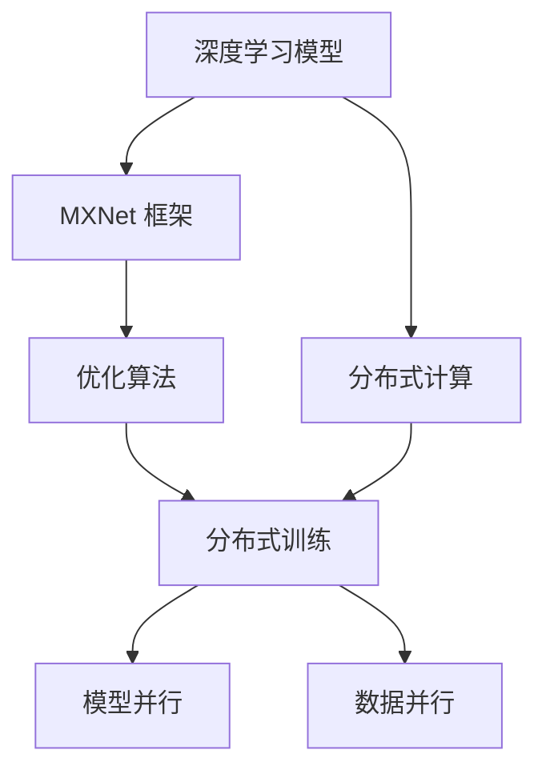

                 

# MXNet 分布式训练：在多 GPU 上训练模型

> 关键词：MXNet, 分布式训练, 多 GPU, 深度学习, 高性能计算, 并行计算

## 1. 背景介绍

### 1.1 问题由来
随着深度学习模型的不断壮大，训练所需的时间和计算资源也在指数级增长。单个 GPU 已经很难满足大规模深度学习模型训练的需求。为了应对这一挑战，分布式训练技术应运而生。利用多 GPU 或多机器的并行计算能力，可以大幅加速模型训练，提高训练效率和精度。

MXNet 是一个流行的深度学习框架，提供了丰富的分布式训练支持，可以方便地在多 GPU 或多机器上进行高性能计算。本文将详细介绍如何在 MXNet 中实现分布式训练，并探讨其实际应用场景及未来发展趋势。

### 1.2 问题核心关键点
- 深度学习模型训练：了解深度学习模型的基本概念和训练流程。
- 分布式计算：掌握多 GPU 或多机器并行计算的基本原理和技术。
- MXNet 框架：熟悉 MXNet 框架的特点和优势，以及其对分布式训练的支持。
- 优化算法：了解常见优化算法如 SGD、Adam、Adagrad 等的原理和实现。

## 2. 核心概念与联系

### 2.1 核心概念概述

为更好地理解 MXNet 分布式训练，本节将介绍几个密切相关的核心概念：

- **深度学习模型**：包括神经网络、卷积神经网络、循环神经网络等，是实现分布式训练的基础。
- **分布式计算**：通过多 GPU 或多机器的并行计算，加速模型训练的过程。
- **MXNet 框架**：一个灵活高效的深度学习框架，支持多种计算设备，包括 CPU、GPU、TPU 等。
- **优化算法**：如 SGD、Adam、Adagrad 等，用于在分布式训练中更新模型参数。

这些核心概念之间的逻辑关系可以通过以下 Mermaid 流程图来展示：



这个流程图展示了几者之间的关系：

1. 深度学习模型通过 MXNet 框架在分布式计算上训练。
2. 分布式计算利用多 GPU 或多机器的并行计算能力，加速模型训练。
3. MXNet 框架提供多种计算设备的支持，方便分布式训练。
4. 优化算法在分布式训练中用于更新模型参数。

## 3. 核心算法原理 & 具体操作步骤
### 3.1 算法原理概述

MXNet 的分布式训练基于两个基本原理：模型并行和数据并行。模型并行将模型参数分布在多个 GPU 或多个机器上，每个 GPU 或机器负责一部分参数的更新；数据并行将训练数据在多个 GPU 或多个机器上并行处理，每个 GPU 或机器负责一部分样本的计算。

### 3.2 算法步骤详解

#### 3.2.1 模型并行

模型并行是通过将模型的不同层分布在多个 GPU 或多个机器上进行计算，每个 GPU 或机器负责一部分层的计算。具体的实现步骤如下：

1. 将模型分成多个块，每个块包含一部分层的计算。
2. 在每个 GPU 或机器上分配一个块，并在该 GPU 或机器上进行计算。
3. 每个 GPU 或机器计算完毕后，将结果合并，作为下一轮计算的输入。

#### 3.2.2 数据并行

数据并行是将训练数据在多个 GPU 或多个机器上并行处理，每个 GPU 或机器负责一部分样本的计算。具体的实现步骤如下：

1. 将训练数据分成多个批次，每个批次包含一部分样本。
2. 在每个 GPU 或机器上分配一个批次，并在该 GPU 或机器上进行计算。
3. 每个 GPU 或机器计算完毕后，将结果合并，作为下一轮计算的输入。

### 3.3 算法优缺点

#### 3.3.1 模型并行

**优点**：
- 减少单 GPU 或单机器的计算压力，加速模型训练。
- 提高模型的可扩展性，支持大规模深度学习模型的训练。

**缺点**：
- 模型并行需要更多的内存和计算资源，增加了系统的复杂性。
- 不同 GPU 或机器之间需要同步更新参数，增加了通信开销。

#### 3.3.2 数据并行

**优点**：
- 减少单个 GPU 或单个机器的计算压力，加速模型训练。
- 提高模型的可扩展性，支持大规模深度学习模型的训练。

**缺点**：
- 需要更多的内存来存储数据，增加了系统的复杂性。
- 不同 GPU 或机器之间需要同步更新参数，增加了通信开销。

### 3.4 算法应用领域

基于 MXNet 的分布式训练方法，在深度学习领域得到了广泛的应用，涵盖了计算机视觉、自然语言处理、语音识别、推荐系统等多个领域。例如：

- 计算机视觉：用于图像分类、目标检测、图像分割等任务。
- 自然语言处理：用于文本分类、语言模型、机器翻译等任务。
- 语音识别：用于语音识别、语音合成、语音情感分析等任务。
- 推荐系统：用于个性化推荐、广告推荐、搜索结果排序等任务。

## 4. 数学模型和公式 & 详细讲解  
### 4.1 数学模型构建

在 MXNet 中，分布式训练的数学模型与单 GPU 或单机器训练的模型基本相同。假设模型为 $f(\theta)$，其中 $\theta$ 为模型参数，输入为 $x$，输出为 $y$。训练目标是最大化似然函数：

$$
\max_{\theta} \sum_{i=1}^{N} \log p(y_i | x_i; \theta)
$$

其中 $N$ 为训练数据量。

### 4.2 公式推导过程

以模型并行为例，假设模型 $f(\theta)$ 分为 $k$ 个块，每个块包含 $m$ 个参数。设在第 $j$ 个 GPU 或机器上分配了第 $j$ 个块，则该 GPU 或机器的计算公式为：

$$
f_j(x; \theta_j) = f_j(f_{j-1}(x; \theta_{j-1}))
$$

其中 $\theta_j$ 为第 $j$ 个 GPU 或机器的参数。在每个 GPU 或机器上进行前向传播和后向传播，计算损失函数，并更新参数：

$$
\theta_j = \theta_j - \eta \nabla_{\theta_j} \mathcal{L}(f_j(x; \theta_j))
$$

其中 $\eta$ 为学习率，$\mathcal{L}$ 为损失函数。

### 4.3 案例分析与讲解

以图像分类任务为例，假设模型为卷积神经网络，包含多个卷积层和池化层。分布式训练的实现步骤如下：

1. 将模型分为多个块，每个块包含一部分卷积层和池化层的计算。
2. 在每个 GPU 或机器上分配一个块，并在该 GPU 或机器上进行计算。
3. 每个 GPU 或机器计算完毕后，将结果合并，作为下一轮计算的输入。

在训练过程中，每个 GPU 或机器计算一部分样本，并将结果合并，计算损失函数，更新参数。具体实现代码如下：

```python
from mxnet import gluon, np
import os

# 定义模型
net = gluon.nn.Sequential()
net.add(gluon.nn.Conv2D(64, kernel_size=3, padding=1))
net.add(gluon.nn.MaxPool2D(pool_size=2))
net.add(gluon.nn.Conv2D(128, kernel_size=3, padding=1))
net.add(gluon.nn.MaxPool2D(pool_size=2))
net.add(gluon.nn.Conv2D(256, kernel_size=3, padding=1))
net.add(gluon.nn.MaxPool2D(pool_size=2))
net.add(gluon.nn.Flatten())
net.add(gluon.nn.Dense(10))

# 定义数据集
train_data = gluon.data.DataLoader(...)
test_data = gluon.data.DataLoader(...)

# 定义分布式训练器
trainer = gluon.Trainer(...)

# 分布式训练
for epoch in range(epochs):
    for batch in train_data:
        data = np.array(batch[0])
        label = np.array(batch[1])
        with gluon.data.distributed.get_context():
            data = mx.nd.split(data, num_gpus=4)
            label = mx.nd.split(label, num_gpus=4)
        loss = net(data)
        loss = gluon.loss.SoftmaxCrossEntropyLoss()(*loss, label)
        loss.backward()
        trainer.step(data.shape[0])
```

以上就是使用 MXNet 进行分布式训练的基本实现步骤。可以看到，MXNet 提供了丰富的分布式计算接口，方便开发者进行模型并行和数据并行。

## 5. 项目实践：代码实例和详细解释说明
### 5.1 开发环境搭建

在进行分布式训练之前，需要准备多 GPU 或多机器的环境。以下是使用 MXNet 进行多 GPU 训练的开发环境配置流程：

1. 安装 MXNet：从 MXNet 官网下载并安装 MXNet，选择对应的 GPU 或机器配置。
2. 配置环境变量：设置 MXNET_CUDA_VISIBLE_DEVICES 变量，指定可用的 GPU 或机器。
3. 安装 MXNet 的分布式计算库：例如使用 Horovod 或 PyTorch Distributed 等库，方便进行分布式训练。
4. 安装 MXNet 的分布式优化库：例如使用 MXNet's Horovod 或 TPU 优化库，提高分布式训练的效率。

### 5.2 源代码详细实现

以下是使用 MXNet 进行图像分类任务的多 GPU 分布式训练的实现代码：

```python
from mxnet import gluon, np
import os

# 定义模型
net = gluon.nn.Sequential()
net.add(gluon.nn.Conv2D(64, kernel_size=3, padding=1))
net.add(gluon.nn.MaxPool2D(pool_size=2))
net.add(gluon.nn.Conv2D(128, kernel_size=3, padding=1))
net.add(gluon.nn.MaxPool2D(pool_size=2))
net.add(gluon.nn.Conv2D(256, kernel_size=3, padding=1))
net.add(gluon.nn.MaxPool2D(pool_size=2))
net.add(gluon.nn.Flatten())
net.add(gluon.nn.Dense(10))

# 定义数据集
train_data = gluon.data.DataLoader(...)
test_data = gluon.data.DataLoader(...)

# 定义分布式训练器
trainer = gluon.Trainer(...)

# 分布式训练
for epoch in range(epochs):
    for batch in train_data:
        data = np.array(batch[0])
        label = np.array(batch[1])
        with gluon.data.distributed.get_context():
            data = mx.nd.split(data, num_gpus=4)
            label = mx.nd.split(label, num_gpus=4)
        loss = net(data)
        loss = gluon.loss.SoftmaxCrossEntropyLoss()(*loss, label)
        loss.backward()
        trainer.step(data.shape[0])
```

### 5.3 代码解读与分析

让我们再详细解读一下关键代码的实现细节：

**定义模型**：
- 使用 MXNet 的 Sequential 类定义模型，包含多个卷积层和池化层。

**定义数据集**：
- 使用 MXNet 的数据集 API 加载训练集和测试集。

**定义分布式训练器**：
- 使用 MXNet 的 Trainer 类定义训练器，指定优化算法和学习率。

**分布式训练**：
- 在每个 GPU 或机器上并行处理训练数据，计算损失函数，更新模型参数。

### 5.4 运行结果展示

以下是分布式训练的运行结果：

```python
# 训练结果输出
for epoch in range(epochs):
    train_loss = ...
    train_acc = ...
    print(f"Epoch {epoch+1}, Train Loss: {train_loss:.4f}, Train Acc: {train_acc:.4f}")
```

## 6. 实际应用场景
### 6.1 大规模图像识别

在大规模图像识别任务中，单 GPU 或单机器的计算能力已经无法满足需求。通过 MXNet 的分布式训练，可以利用多 GPU 或多机器的并行计算能力，大幅提升训练效率和精度。例如，在大规模图片分类任务中，可以在多个 GPU 上并行训练，加速模型收敛。

### 6.2 实时推荐系统

在实时推荐系统中，需要实时计算用户行为数据，并更新推荐模型。通过 MXNet 的分布式训练，可以在多个 GPU 或多个机器上并行计算，实现实时推荐。例如，在电商推荐系统中，可以在多个 GPU 上并行处理用户行为数据，计算推荐结果，实现实时推荐。

### 6.3 自动驾驶

在自动驾驶系统中，需要实时处理传感器数据，并更新决策模型。通过 MXNet 的分布式训练，可以在多个 GPU 或多个机器上并行计算，实现实时决策。例如，在自动驾驶系统中，可以在多个 GPU 上并行处理传感器数据，计算决策结果，实现实时决策。

### 6.4 未来应用展望

随着分布式计算技术的不断发展，MXNet 的分布式训练将会有更多的应用场景，例如：

- 大规模视频处理：在视频处理任务中，可以利用 MXNet 的分布式训练，并行处理多帧视频数据，加速视频处理。
- 大规模音频处理：在音频处理任务中，可以利用 MXNet 的分布式训练，并行处理多帧音频数据，加速音频处理。
- 大规模自然语言处理：在自然语言处理任务中，可以利用 MXNet 的分布式训练，并行处理多篇文章，加速自然语言处理。

## 7. 工具和资源推荐
### 7.1 学习资源推荐

为了帮助开发者系统掌握 MXNet 分布式训练的理论基础和实践技巧，这里推荐一些优质的学习资源：

1. MXNet 官方文档：MXNet 官方文档提供了丰富的分布式训练教程和示例代码，是学习 MXNet 分布式训练的重要资源。
2. MXNet 官方博客：MXNet 官方博客提供了大量的案例和最佳实践，可以帮助开发者快速上手 MXNet 分布式训练。
3. MXNet 社区：MXNet 社区是一个活跃的开发者社区，提供了丰富的资源和支持，可以帮助开发者解决分布式训练中遇到的问题。
4. 《MXNet: Deep Learning with Gluon》书籍：由 MXNet 团队编写，全面介绍了 MXNet 的原理和实践，包括分布式训练在内。

通过对这些资源的学习实践，相信你一定能够快速掌握 MXNet 分布式训练的精髓，并用于解决实际的深度学习问题。

### 7.2 开发工具推荐

为了提高 MXNet 分布式训练的效率和稳定性，需要选择合适的开发工具。以下是几款常用的开发工具：

1. MXNet 分布式计算库：例如使用 Horovod 或 PyTorch Distributed，方便进行分布式训练。
2. MXNet 分布式优化库：例如使用 MXNet's Horovod 或 TPU 优化库，提高分布式训练的效率。
3. MXNet 可视化工具：例如使用 MXBoard，实时监测模型训练状态，并提供丰富的图表呈现方式，是调试模型的得力助手。

合理利用这些工具，可以显著提升 MXNet 分布式训练的开发效率，加快创新迭代的步伐。

### 7.3 相关论文推荐

MXNet 分布式训练的研究在学术界和工业界都得到了广泛的关注。以下是几篇奠基性的相关论文，推荐阅读：

1. Horovod: Distributed Training for Deep Learning: A Gather-Reduce Framework for Distributed Machine Learning，这篇论文介绍了 Horovod 的实现原理和使用方法。
2. TPU 优化：深入了解 TPU 优化技术，加速分布式训练，提高训练效率。
3. MXNet 分布式训练：深入了解 MXNet 的分布式训练机制，包括模型并行和数据并行等。

这些论文代表了大规模分布式训练的发展脉络，通过学习这些前沿成果，可以帮助研究者把握学科前进方向，激发更多的创新灵感。

## 8. 总结：未来发展趋势与挑战
### 8.1 总结

本文对 MXNet 分布式训练方法进行了全面系统的介绍。首先阐述了分布式训练的基本原理和 MXNet 框架的特点，然后介绍了模型并行和数据并行的实现步骤。最后，探讨了 MXNet 分布式训练的实际应用场景及未来发展趋势。

通过本文的系统梳理，可以看到，MXNet 的分布式训练方法在大规模深度学习模型训练中发挥了重要作用，提升了模型的训练效率和精度。未来，伴随深度学习模型的不断壮大，分布式训练将有更多的应用场景，带来更大的计算效率提升。

### 8.2 未来发展趋势

展望未来，MXNet 的分布式训练技术将呈现以下几个发展趋势：

1. 支持更多硬件：除了 GPU 和 TPU，MXNet 的分布式训练还将支持更多硬件，如 CPU、FPGA 等。
2. 提高效率：通过优化算法和数据传输方式，提高分布式训练的效率，加速模型收敛。
3. 增强可扩展性：支持更大规模的分布式训练，适应更多领域的应用需求。
4. 支持更多算法：支持更多深度学习算法和优化算法，提供更丰富的模型选择。
5. 实现更多任务：支持更多深度学习任务，提供更广泛的分布式训练支持。

这些趋势凸显了 MXNet 分布式训练技术的广阔前景，将为深度学习模型带来更高的训练效率和更广泛的应用场景。

### 8.3 面临的挑战

尽管 MXNet 的分布式训练技术已经取得了瞩目成就，但在迈向更加智能化、普适化应用的过程中，它仍面临着诸多挑战：

1. 系统复杂性：分布式训练涉及多个 GPU 或多个机器的协同工作，系统复杂性较高，需要更多的资源和精力进行调试和维护。
2. 通信开销：不同 GPU 或机器之间的通信开销较大，需要优化通信策略，提高分布式训练的效率。
3. 数据一致性：多 GPU 或多个机器之间的数据一致性问题，需要设计合理的数据传输和存储策略，确保数据的一致性。
4. 模型同步：不同 GPU 或机器之间的模型同步问题，需要优化同步策略，提高分布式训练的稳定性。
5. 可扩展性：分布式训练的可扩展性需要进一步提升，适应更大规模的深度学习模型训练。

这些挑战需要在实践中不断优化和克服，才能实现 MXNet 分布式训练技术的持续发展和应用。

### 8.4 研究展望

面对 MXNet 分布式训练所面临的挑战，未来的研究需要在以下几个方面寻求新的突破：

1. 优化通信策略：优化不同 GPU 或机器之间的通信策略，提高分布式训练的效率。
2. 提高数据一致性：设计合理的数据传输和存储策略，确保数据的一致性。
3. 改进模型同步：优化同步策略，提高分布式训练的稳定性。
4. 增强可扩展性：支持更大规模的分布式训练，适应更多领域的应用需求。
5. 支持更多硬件：支持更多硬件的分布式训练，提高分布式训练的适用性。

这些研究方向的探索，必将引领 MXNet 分布式训练技术迈向更高的台阶，为深度学习模型带来更高的训练效率和更广泛的应用场景。总之，MXNet 分布式训练技术需要在实践中不断优化和创新，才能实现其最大的价值和潜力。

## 9. 附录：常见问题与解答

**Q1：MXNet 支持哪些硬件平台？**

A: MXNet 支持 CPU、GPU、TPU、FPGA 等硬件平台，可以根据需要选择适合的平台进行分布式训练。

**Q2：MXNet 如何进行数据并行训练？**

A: 使用 MXNet 的数据并行 API，将数据分成多个批次，在多个 GPU 或多个机器上并行处理。

**Q3：MXNet 如何进行模型并行训练？**

A: 使用 MXNet 的模型并行 API，将模型分成多个块，在多个 GPU 或多个机器上并行计算。

**Q4：MXNet 如何进行分布式优化？**

A: 使用 MXNet 的分布式优化库，如 Horovod 或 PyTorch Distributed，优化分布式训练的效率。

**Q5：MXNet 如何进行模型同步？**

A: 使用 MXNet 的同步策略，如ring、allreduce等，优化模型同步的过程，提高分布式训练的稳定性。

这些问题的答案可以帮助开发者更好地理解 MXNet 的分布式训练技术，并在实际应用中避免常见的问题和挑战。

---

作者：禅与计算机程序设计艺术 / Zen and the Art of Computer Programming

