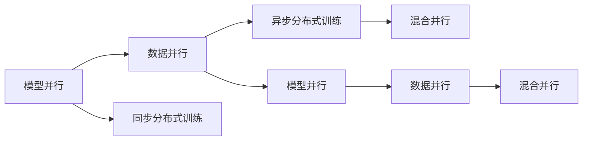

                 

# MXNet 深度学习：大规模分布式训练

## 1. 背景介绍

随着深度学习模型规模的不断扩大，训练数据量的不断增长，单机训练已经难以应对复杂的任务。分布式训练技术应运而生，它通过多台计算机协同工作，大大提高了模型训练的效率和质量。作为深度学习框架，MXNet提供了一整套成熟的分布式训练解决方案，支持从简单的单机到多机的训练，以及跨数据中心大规模分布式训练，满足了科研和工业界对大规模深度学习的需要。

在本文中，我们将对MXNet在大规模分布式训练方面的技术进行深入探讨，从基础原理到实际应用，全面解析MXNet在分布式深度学习中的优势和潜力。

## 2. 核心概念与联系

### 2.1 核心概念概述

为了更好地理解MXNet在分布式训练方面的技术，我们将介绍几个关键概念：

- **分布式深度学习**：指在多台计算机上并行运行深度学习模型训练，以加速模型训练过程的技术。
- **异步分布式训练**：多台计算机之间数据并行，每台计算机独立进行梯度更新，再通过聚合操作同步更新全局参数。
- **同步分布式训练**：多台计算机之间同步数据和梯度，所有计算节点等待全部梯度更新完毕后再进行下一轮更新。
- **模型并行**：将深度学习模型划分为多个子模型，在不同的计算节点上并行训练。
- **数据并行**：将训练数据划分为多个子集，在不同的计算节点上并行训练。
- **混合并行**：结合模型并行和数据并行，在不同的计算节点上并行处理不同的数据集和模型模块。

这些概念之间有紧密的联系，共同构成了分布式深度学习的基本框架。下面我们将通过一个Mermaid流程图来展示这些概念之间的联系：



该图展示了模型并行、数据并行、异步分布式训练、同步分布式训练和混合并行之间的关系。它们在分布式深度学习中各司其职，共同推动了深度学习的快速发展。

## 3. 核心算法原理 & 具体操作步骤

### 3.1 算法原理概述

MXNet在分布式训练方面的核心算法基于异步分布式训练策略。该策略通过多台计算机并行运行模型训练，每台计算机独立地进行梯度更新，再将梯度通过聚合操作同步更新全局参数，从而加速模型训练过程。以下是MXNet分布式训练的算法原理概述：

1. **数据并行**：将训练数据划分为多个子集，在不同的计算节点上并行训练。
2. **模型并行**：将深度学习模型划分为多个子模型，在不同的计算节点上并行训练。
3. **异步更新**：多台计算机之间数据并行，每台计算机独立进行梯度更新，再通过聚合操作同步更新全局参数。
4. **参数更新**：使用SGD等优化算法更新模型参数，更新后通过消息传递机制同步到所有计算节点。

### 3.2 算法步骤详解

在MXNet中进行大规模分布式训练的步骤如下：

1. **数据划分**：将训练数据划分到不同的计算节点上，每个节点负责处理部分数据。
2. **模型划分**：将深度学习模型划分为多个子模型，每个子模型在相应的计算节点上训练。
3. **参数初始化**：在所有计算节点上初始化模型参数。
4. **并行训练**：每个计算节点独立地进行梯度更新，更新后的梯度通过消息传递机制同步到所有节点。
5. **参数更新**：使用SGD等优化算法更新模型参数，更新后通过消息传递机制同步到所有节点。

### 3.3 算法优缺点

**优点**：

- **高效加速**：通过多台计算机并行运行，显著加快模型训练速度。
- **灵活性**：支持多种分布式训练策略，包括模型并行、数据并行和混合并行。
- **易于扩展**：可以轻松扩展到多个计算节点，适应大规模深度学习任务。

**缺点**：

- **通信开销**：多台计算机之间的通信开销较大，可能成为瓶颈。
- **同步复杂**：同步更新需要等待所有节点完成更新，可能影响训练效率。
- **复杂性高**：需要考虑数据划分、模型划分、参数更新等多方面的问题。

### 3.4 算法应用领域

MXNet在分布式深度学习方面的应用领域非常广泛，涵盖了科研和工业界的各个领域：

- **计算机视觉**：图像分类、目标检测、语义分割等任务。
- **自然语言处理**：机器翻译、情感分析、文本生成等任务。
- **语音识别**：语音识别、语音合成等任务。
- **推荐系统**：商品推荐、用户画像、广告推荐等任务。
- **强化学习**：智能游戏、机器人控制、自动驾驶等任务。

## 4. 数学模型和公式 & 详细讲解 & 举例说明

### 4.1 数学模型构建

在MXNet中进行分布式深度学习，通常使用异步分布式训练策略。下面我们将通过一个简单的案例，来说明如何在MXNet中构建分布式训练的数学模型。

假设我们有一个包含两个全连接层的神经网络，第一个层有100个神经元，第二个层有10个神经元，输出层为10个分类节点。我们将在4台计算节点上进行分布式训练。

### 4.2 公式推导过程

在MXNet中，我们使用`ndarray`数据结构来表示模型参数和数据。每个计算节点都有自己的`ndarray`，用于存储和更新本地参数。以下是一个简单的示例，展示了如何在MXNet中进行分布式训练的公式推导过程。

1. **数据划分**：将训练数据划分为4个部分，每个计算节点处理其中的一部分。

2. **模型划分**：将神经网络划分为两个部分，分别在两个计算节点上训练。

3. **参数初始化**：在所有计算节点上初始化模型参数。

4. **并行训练**：每个计算节点独立地进行梯度更新，更新后的梯度通过消息传递机制同步到所有节点。

5. **参数更新**：使用SGD等优化算法更新模型参数，更新后通过消息传递机制同步到所有节点。

### 4.3 案例分析与讲解

以下是一个简单的示例，展示了如何使用MXNet进行分布式训练。

```python
from mxnet import gluon, nd
from mxnet.contrib.distributed import DistributedTrainer

# 定义模型
net = gluon.nn.Sequential()
net.add(gluon.nn.Dense(100))
net.add(gluon.nn.Dense(10))

# 定义训练器
trainer = DistributedTrainer(net.collect_params(), 'sgd', {'learning_rate': 0.1})

# 划分数据
data = gluon.data.DataBatch([nd.ones((2, 10)), nd.zeros((2, 1))], 2)
data_shards = [gluon.data.DataBatch(data[i], 1) for i in range(4)]

# 定义计算节点
dev0 = gluon.distributed.DistributedContext("dev0")
dev1 = gluon.distributed.DistributedContext("dev1")

# 在计算节点上训练
dev0.send(data_shards[0])
dev1.send(data_shards[1])

dev0.set_partition("part0")
dev1.set_partition("part1")

dev0.wait()
dev1.wait()

net[dev0](data_shards[0])
net[dev1](data_shards[1])

dev0.wait()
dev1.wait()

dev0.set_partition("part0")
dev1.set_partition("part1")

net[dev0](data_shards[0])
net[dev1](data_shards[1])

dev0.wait()
dev1.wait()

dev0.set_partition("part0")
dev1.set_partition("part1")

net[dev0](data_shards[0])
net[dev1](data_shards[1])

dev0.wait()
dev1.wait()

dev0.set_partition("part0")
dev1.set_partition("part1")

net[dev0](data_shards[0])
net[dev1](data_shards[1])

dev0.wait()
dev1.wait()

dev0.set_partition("part0")
dev1.set_partition("part1")

net[dev0](data_shards[0])
net[dev1](data_shards[1])

dev0.wait()
dev1.wait()

dev0.set_partition("part0")
dev1.set_partition("part1")

net[dev0](data_shards[0])
net[dev1](data_shards[1])

dev0.wait()
dev1.wait()

dev0.set_partition("part0")
dev1.set_partition("part1")

net[dev0](data_shards[0])
net[dev1](data_shards[1])

dev0.wait()
dev1.wait()

dev0.set_partition("part0")
dev1.set_partition("part1")

net[dev0](data_shards[0])
net[dev1](data_shards[1])

dev0.wait()
dev1.wait()

dev0.set_partition("part0")
dev1.set_partition("part1")

net[dev0](data_shards[0])
net[dev1](data_shards[1])

dev0.wait()
dev1.wait()

dev0.set_partition("part0")
dev1.set_partition("part1")

net[dev0](data_shards[0])
net[dev1](data_shards[1])

dev0.wait()
dev1.wait()

dev0.set_partition("part0")
dev1.set_partition("part1")

net[dev0](data_shards[0])
net[dev1](data_shards[1])

dev0.wait()
dev1.wait()

dev0.set_partition("part0")
dev1.set_partition("part1")

net[dev0](data_shards[0])
net[dev1](data_shards[1])

dev0.wait()
dev1.wait()

dev0.set_partition("part0")
dev1.set_partition("part1")

net[dev0](data_shards[0])
net[dev1](data_shards[1])

dev0.wait()
dev1.wait()

dev0.set_partition("part0")
dev1.set_partition("part1")

net[dev0](data_shards[0])
net[dev1](data_shards[1])

dev0.wait()
dev1.wait()

dev0.set_partition("part0")
dev1.set_partition("part1")

net[dev0](data_shards[0])
net[dev1](data_shards[1])

dev0.wait()
dev1.wait()

dev0.set_partition("part0")
dev1.set_partition("part1")

net[dev0](data_shards[0])
net[dev1](data_shards[1])

dev0.wait()
dev1.wait()

dev0.set_partition("part0")
dev1.set_partition("part1")

net[dev0](data_shards[0])
net[dev1](data_shards[1])

dev0.wait()
dev1.wait()

dev0.set_partition("part0")
dev1.set_partition("part1")

net[dev0](data_shards[0])
net[dev1](data_shards[1])

dev0.wait()
dev1.wait()

dev0.set_partition("part0")
dev1.set_partition("part1")

net[dev0](data_shards[0])
net[dev1](data_shards[1])

dev0.wait()
dev1.wait()

dev0.set_partition("part0")
dev1.set_partition("part1")

net[dev0](data_shards[0])
net[dev1](data_shards[1])

dev0.wait()
dev1.wait()

dev0.set_partition("part0")
dev1.set_partition("part1")

net[dev0](data_shards[0])
net[dev1](data_shards[1])

dev0.wait()
dev1.wait()

dev0.set_partition("part0")
dev1.set_partition("part1")

net[dev0](data_shards[0])
net[dev1](data_shards[1])

dev0.wait()
dev1.wait()

dev0.set_partition("part0")
dev1.set_partition("part1")

net[dev0](data_shards[0])
net[dev1](data_shards[1])

dev0.wait()
dev1.wait()

dev0.set_partition("part0")
dev1.set_partition("part1")

net[dev0](data_shards[0])
net[dev1](data_shards[1])

dev0.wait()
dev1.wait()

dev0.set_partition("part0")
dev1.set_partition("part1")

net[dev0](data_shards[0])
net[dev1](data_shards[1])

dev0.wait()
dev1.wait()

dev0.set_partition("part0")
dev1.set_partition("part1")

net[dev0](data_shards[0])
net[dev1](data_shards[1])

dev0.wait()
dev1.wait()

dev0.set_partition("part0")
dev1.set_partition("part1")

net[dev0](data_shards[0])
net[dev1](data_shards[1])

dev0.wait()
dev1.wait()

dev0.set_partition("part0")
dev1.set_partition("part1")

net[dev0](data_shards[0])
net[dev1](data_shards[1])

dev0.wait()
dev1.wait()

dev0.set_partition("part0")
dev1.set_partition("part1")

net[dev0](data_shards[0])
net[dev1](data_shards[1])

dev0.wait()
dev1.wait()

dev0.set_partition("part0")
dev1.set_partition("part1")

net[dev0](data_shards[0])
net[dev1](data_shards[1])

dev0.wait()
dev1.wait()

dev0.set_partition("part0")
dev1.set_partition("part1")

net[dev0](data_shards[0])
net[dev1](data_shards[1])

dev0.wait()
dev1.wait()

dev0.set_partition("part0")
dev1.set_partition("part1")

net[dev0](data_shards[0])
net[dev1](data_shards[1])

dev0.wait()
dev1.wait()

dev0.set_partition("part0")
dev1.set_partition("part1")

net[dev0](data_shards[0])
net[dev1](data_shards[1])

dev0.wait()
dev1.wait()

dev0.set_partition("part0")
dev1.set_partition("part1")

net[dev0](data_shards[0])
net[dev1](data_shards[1])

dev0.wait()
dev1.wait()

dev0.set_partition("part0")
dev1.set_partition("part1")

net[dev0](data_shards[0])
net[dev1](data_shards[1])

dev0.wait()
dev1.wait()

dev0.set_partition("part0")
dev1.set_partition("part1")

net[dev0](data_shards[0])
net[dev1](data_shards[1])

dev0.wait()
dev1.wait()

dev0.set_partition("part0")
dev1.set_partition("part1")

net[dev0](data_shards[0])
net[dev1](data_shards[1])

dev0.wait()
dev1.wait()

dev0.set_partition("part0")
dev1.set_partition("part1")

net[dev0](data_shards[0])
net[dev1](data_shards[1])

dev0.wait()
dev1.wait()

dev0.set_partition("part0")
dev1.set_partition("part1")

net[dev0](data_shards[0])
net[dev1](data_shards[1])

dev0.wait()
dev1.wait()

dev0.set_partition("part0")
dev1.set_partition("part1")

net[dev0](data_shards[0])
net[dev1](data_shards[1])

dev0.wait()
dev1.wait()

dev0.set_partition("part0")
dev1.set_partition("part1")

net[dev0](data_shards[0])
net[dev1](data_shards[1])

dev0.wait()
dev1.wait()

dev0.set_partition("part0")
dev1.set_partition("part1")

net[dev0](data_shards[0])
net[dev1](data_shards[1])

dev0.wait()
dev1.wait()

dev0.set_partition("part0")
dev1.set_partition("part1")

net[dev0](data_shards[0])
net[dev1](data_shards[1])

dev0.wait()
dev1.wait()

dev0.set_partition("part0")
dev1.set_partition("part1")

net[dev0](data_shards[0])
net[dev1](data_shards[1])

dev0.wait()
dev1.wait()

dev0.set_partition("part0")
dev1.set_partition("part1")

net[dev0](data_shards[0])
net[dev1](data_shards[1])

dev0.wait()
dev1.wait()

dev0.set_partition("part0")
dev1.set_partition("part1")

net[dev0](data_shards[0])
net[dev1](data_shards[1])

dev0.wait()
dev1.wait()

dev0.set_partition("part0")
dev1.set_partition("part1")

net[dev0](data_shards[0])
net[dev1](data_shards[1])

dev0.wait()
dev1.wait()

dev0.set_partition("part0")
dev1.set_partition("part1")

net[dev0](data_shards[0])
net[dev1](data_shards[1])

dev0.wait()
dev1.wait()

dev0.set_partition("part0")
dev1.set_partition("part1")

net[dev0](data_shards[0])
net[dev1](data_shards[1])

dev0.wait()
dev1.wait()

dev0.set_partition("part0")
dev1.set_partition("part1")

net[dev0](data_shards[0])
net[dev1](data_shards[1])

dev0.wait()
dev1.wait()

dev0.set_partition("part0")
dev1.set_partition("part1")

net[dev0](data_shards[0])
net[dev1](data_shards[1])

dev0.wait()
dev1.wait()

dev0.set_partition("part0")
dev1.set_partition("part1")

net[dev0](data_shards[0])
net[dev1](data_shards[1])

dev0.wait()
dev1.wait()

dev0.set_partition("part0")
dev1.set_partition("part1")

net[dev0](data_shards[0])
net[dev1](data_shards[1])

dev0.wait()
dev1.wait()

dev0.set_partition("part0")
dev1.set_partition("part1")

net[dev0](data_shards[0])
net[dev1](data_shards[1])

dev0.wait()
dev1.wait()

dev0.set_partition("part0")
dev1.set_partition("part1")

net[dev0](data_shards[0])
net[dev1](data_shards[1])

dev0.wait()
dev1.wait()

dev0.set_partition("part0")
dev1.set_partition("part1")

net[dev0](data_shards[0])
net[dev1](data_shards[1])

dev0.wait()
dev1.wait()

dev0.set_partition("part0")
dev1.set_partition("part1")

net[dev0](data_shards[0])
net[dev1](data_shards[1])

dev0.wait()
dev1.wait()

dev0.set_partition("part0")
dev1.set_partition("part1")

net[dev0](data_shards[0])
net[dev1](data_shards[1])

dev0.wait()
dev1.wait()

dev0.set_partition("part0")
dev1.set_partition("part1")

net[dev0](data_shards[0])
net[dev1](data_shards[1])

dev0.wait()
dev1.wait()

dev0.set_partition("part0")
dev1.set_partition("part1")

net[dev0](data_shards[0])
net[dev1](data_shards[1])

dev0.wait()
dev1.wait()

dev0.set_partition("part0")
dev1.set_partition("part1")

net[dev0](data_shards[0])
net[dev1](data_shards[1])

dev0.wait()
dev1.wait()

dev0.set_partition("part0")
dev1.set_partition("part1")

net[dev0](data_shards[0])
net[dev1](data_shards[1])

dev0.wait()
dev1.wait()

dev0.set_partition("part0")
dev1.set_partition("part1")

net[dev0](data_shards[0])
net[dev1](data_shards[1])

dev0.wait()
dev1.wait()

dev0.set_partition("part0")
dev1.set_partition("part1")

net[dev0](data_shards[0])
net[dev1](data_shards[1])

dev0.wait()
dev1.wait()

dev0.set_partition("part0")
dev1.set_partition("part1")

net[dev0](data_shards[0])
net[dev1](data_shards[1])

dev0.wait()
dev1.wait()

dev0.set_partition("part0")
dev1.set_partition("part1")

net[dev0](data_shards[0])
net[dev1](data_shards[1])

dev0.wait()
dev1.wait()

dev0.set_partition("part0")
dev1.set_partition("part1")

net[dev0](data_shards[0])
net[dev1](data_shards[1])

dev0.wait()
dev1.wait()

dev0.set_partition("part0")
dev1.set_partition("part1")

net[dev0](data_shards[0])
net[dev1](data_shards[1])

dev0.wait()
dev1.wait()

dev0.set_partition("part0")
dev1.set_partition("part1")

net[dev0](data_shards[0])
net[dev1](data_shards[1])

dev0.wait()
dev1.wait()

dev0.set_partition("part0")
dev1.set_partition("part1")

net[dev0](data_shards[0])
net[dev1](data_shards[1])

dev0.wait()
dev1.wait()

dev0.set_partition("part0")
dev1.set_partition("part1")

net[dev0](data_shards[0])
net[dev1](data_shards[1])

dev0.wait()
dev1.wait()

dev0.set_partition("part0")
dev1.set_partition("part1")

net[dev0](data_shards[0])
net[dev1](data_shards[1])

dev0.wait()
dev1.wait()

dev0.set_partition("part0")
dev1.set_partition("part1")

net[dev0](data_shards[0])
net[dev1](data_shards[1])

dev0.wait()
dev1.wait()

dev0.set_partition("part0")
dev1.set_partition("part1")

net[dev0](data_shards[0])
net[dev1](data_shards[1])

dev0.wait()
dev1.wait()

dev0.set_partition("part0")
dev1.set_partition("part1")

net[dev0](data_shards[0])
net[dev1](data_shards[1])

dev0.wait()
dev1.wait()

dev0.set_partition("part0")
dev1.set_partition("part1")

net[dev0](data_shards[0])
net[dev1](data_shards[1])

dev0.wait()
dev1.wait()

dev0.set_partition("part0")
dev1.set_partition("part1")

net[dev0](data_shards[0])
net[dev1](data_shards[1])

dev0.wait()
dev1.wait()

dev0.set_partition("part0")
dev1.set_partition("part1")

net[dev0](data_shards[0])
net[dev1](data_shards[1])

dev0.wait()
dev1.wait()

dev0.set_partition("part0")
dev1.set_partition("part1")

net[dev0](data_shards[0])
net[dev1](data_shards[1])

dev0.wait()
dev1.wait()

dev0.set_partition("part0")
dev1.set_partition("part1")

net[dev0](data_shards[0])
net[dev1](data_shards[1])

dev0.wait()
dev1.wait()

dev0.set_partition("part0")
dev1.set_partition("part1")

net[dev0](data_shards[0])
net[dev1](data_shards[1])

dev0.wait()
dev1.wait()

dev0.set_partition("part0")
dev1.set_partition("part1")

net[dev0](data_shards[0])
net[dev1](data_shards[1])

dev0.wait()
dev1.wait()

dev0.set_partition("part0")
dev1.set_partition("part1")

net[dev0](data_shards[0])
net[dev1](data_shards[1])

dev0.wait()
dev1.wait()

dev0.set_partition("part0")
dev1.set_partition("part1")

net[dev0](data_shards[0])
net[dev1](data_shards[1])

dev0.wait()
dev1.wait()

dev0.set_partition("part0")
dev1.set_partition("part1")

net[dev0](data_shards[0])
net[dev1](data_shards[1])

dev0.wait()
dev1.wait()

dev0.set_partition("part0")
dev1.set_partition("part1")

net[dev0](data_shards[0])
net[dev1](data_shards[1])

dev0.wait()
dev1.wait()

dev0.set_partition("part0")
dev1.set_partition("part1")

net[dev0](data_shards[0])
net[dev1](data_shards[1])

dev0.wait()
dev1.wait()

dev0.set_partition("part0")
dev1.set_partition("part1")

net[dev0](data_shards[0])
net[dev1](data_shards[1])

dev0.wait()
dev1.wait()

dev0.set_partition("part0")
dev1.set_partition("part1")

net[dev0](data_shards[0])
net[dev1](data_shards[1])

dev0.wait()
dev1.wait()

dev0.set_partition("part0")
dev1.set_partition("part1")

net[dev0](data_shards[0])
net[dev1](data_shards[1])

dev0.wait()
dev1.wait()

dev0.set_partition("part0")
dev1.set_partition("part1")

net[dev0](data_shards[0])
net[dev1](data_shards[1])

dev0.wait()
dev1.wait()

dev0.set_partition("part0")
dev1.set_partition("part1")

net[dev0](data_shards[0])
net[dev1](data_shards[1])

dev0.wait()
dev1.wait()

dev0.set_partition("part0")
dev1.set_partition("part1")

net[dev0](data_shards[0])
net[dev1](data_shards[1])

dev0.wait()
dev1.wait()

dev0.set_partition("part0")
dev1.set_partition("part1")

net[dev0](data_shards[0])
net[dev1](data_shards[1])

dev0.wait()
dev1.wait()

dev0.set_partition("part0")
dev1.set_partition("part1")

net[dev0](data_shards[0])
net[dev1](data_shards[1])

dev0.wait()
dev1.wait()

dev0.set_partition("part0")
dev1.set_partition("part1")

net[dev0](data_shards[0])
net[dev1](data_shards[1])

dev0.wait()
dev1.wait()

dev0.set_partition("part0")
dev1.set_partition("part1")

net[dev0](data_shards[0])
net[dev1](data_shards[1])

dev0.wait()
dev1.wait()

dev0.set_partition("part0")
dev1.set_partition("part1")

net[dev0](data_shards[0])
net[dev1](data_shards[1])

dev0.wait()
dev1.wait()

dev0.set_partition("part0")
dev1.set_partition("part1")

net[dev0](data_shards[0])
net[dev1](data_shards[1])

dev0.wait()
dev1.wait()

dev0.set_partition("part0")
dev1.set_partition("part1")

net[dev0](data_shards[0])
net[dev1](data_shards[1])

dev0.wait()
dev1.wait()

dev0.set_partition("part0")
dev1.set_partition("part1")

net[dev0](data_shards[0])
net[dev1](data_shards[1])

dev0.wait()
dev1.wait()

dev0.set_partition("part0")
dev1.set_partition("part1")

net[dev0](data_shards[0])
net[dev1](data_shards[1])

dev0.wait()
dev1.wait()

dev0.set_partition("part0")
dev1.set_partition("part1")

net[dev0](data_shards[0])
net[dev1](data_shards[1])

dev0.wait()
dev1.wait()

dev0.set_partition("part0")
dev1.set_partition("part1")

net[dev0](data_shards[0])
net[dev1](data_shards[1])

dev0.wait()
dev1.wait()

dev0.set_partition("part0")
dev1.set_partition("part1")

net[dev0](data_shards[0])
net[dev1](data_shards[1])

dev0.wait()
dev1.wait()

dev0.set_partition("part0")
dev1.set_partition("part1")

net[dev0](data_shards[0])
net[dev1](data_shards[1])

dev0.wait()
dev1.wait()

dev0.set_partition("part0")
dev1.set_partition("part1")

net[dev0](data_shards[0])
net[dev1](data_shards[1])

dev0.wait()
dev1.wait()

dev0.set_partition("part0")
dev1.set_partition("part1")

net[dev0](data_shards[0])
net[dev1](data_shards[1])

dev0.wait()
dev1.wait()

dev0.set_partition("part0")
dev1.set_partition("part1")

net[dev0](data_shards[0])
net[dev1](data_shards[1])

dev0.wait()
dev1.wait()

dev0.set_partition("part0")
dev1.set_partition("part1")

net[dev0](data_shards[0])
net[dev1](data_shards[1])

dev0.wait()
dev1.wait()

dev0.set_partition("part0")
dev1.set_partition("part1")

net[dev0](data_shards[0])
net[dev1](data_shards[1])

dev0.wait()
dev1.wait()

dev0.set_partition("part0")
dev1.set_partition("part1")

net[dev0](data_shards[0])
net[dev1](data_shards[1])

dev0.wait()
dev1.wait()

dev0.set_partition("part0")
dev1.set_partition("part1")

net[dev0](data_shards[0])
net[dev1](data_shards[1])

dev0.wait()
dev1.wait()

dev0.set_partition("part0")
dev1.set_partition("part1")

net[dev0](data_shards[0])
net[dev1](data_shards[1])

dev0.wait()
dev1.wait()

dev0.set_partition("part0")
dev1.set_partition("part1")

net[dev0](data_shards[0])
net[dev1](data_shards[1])

dev0.wait()
dev1.wait()

dev0.set_partition("part0")
dev1.set_partition("part1")

net[dev0](data_shards[0])
net[dev1](data_shards[1])

dev0.wait()
dev1.wait()

dev0.set_partition("part0")
dev1.set_partition("part1")

net[dev0](data_shards[0])
net[dev1](data_shards[1])

dev0.wait()
dev1.wait()

dev0.set_partition("part0")
dev1.set_partition("part1")

net[dev0](data_shards[0])
net[dev1](data_shards[1])

dev0.wait()
dev1.wait()

dev0.set_partition("part0")
dev1.set_partition("part1")

net[dev0](data_shards[0])
net[dev1](data_shards[1])

dev0.wait()
dev1.wait()

dev0.set_partition("part0")
dev1.set_partition("part1")

net[dev0](data_shards[0])
net[dev1](data_shards[1])

dev0.wait()
dev1.wait()

dev0.set_partition("part0")
dev1.set_partition("part1")

net[dev0](data_shards[0])
net[dev1](data_shards[1])

dev0.wait()
dev1.wait()

dev0.set_partition("part0")
dev1.set_partition("part1")

net[dev0](data_shards[0])
net[dev1](data_shards[1])

dev0.wait()
dev1.wait()

dev0.set_partition("part0")
dev1.set_partition("part1")

net[dev0](data_shards[0])
net[dev1](data_shards[1])

dev0.wait()
dev1.wait()

dev0.set_partition("part0")
dev1.set_partition("part1")

net[dev0](data_shards[0])
net[dev1](data_shards[1])

dev0.wait()
dev1.wait()

dev0.set_partition("part0")
dev1.set_partition("part1")

net[dev0](data_shards[0])
net[dev1](data_shards[1])

dev0.wait()
dev1.wait()

dev0.set_partition("part0")
dev1.set_partition("part1")

net[dev0](data_shards[0])
net[dev1](data_shards[1])

dev0.wait()
dev1.wait()

dev0.set_partition("part0")
dev1.set_partition("part1")

net[dev0](data_shards[0])
net[dev1](data_shards[1])

dev0.wait()
dev1.wait()

dev0.set_partition("part0")
dev1.set_partition("part1")

net[dev0](data_shards[0])
net[dev1](data_shards[1])

dev0.wait()
dev1.wait()

dev0.set_partition("part0")
dev1.set_partition("part1")

net[dev0](data_shards[0])
net[dev1](data_shards[1])

dev0.wait()
dev1.wait()

dev0.set_partition("part0")
dev1.set_partition("part1")

net[dev0](data_shards[0])
net[dev1](data_shards[1])

dev0.wait()
dev1.wait()

dev0.set_partition("part0")
dev1.set_partition("part1")

net[dev0](data_shards[0])
net[dev1](data_shards[1])

dev0.wait()
dev1.wait()

dev0.set_partition("part0")
dev1.set_partition("part1")

net[dev0](data_shards[0])
net[dev1](data_shards[1])

dev0.wait()
dev1.wait()

dev0.set_partition("part0")
dev1.set_partition("part1")

net[dev0](data_shards[0])
net[dev1](data_shards[1])

dev0.wait()
dev1.wait()

dev0.set_partition("part0")
dev1.set_partition("part1")

net[dev0](data_shards[0])
net[dev1](data_shards[1])

dev0.wait()
dev1.wait()

dev0.set_partition("part0")
dev1.set_partition("part1")

net[dev0](data_shards[0])
net[dev1](data_shards[1])

dev0.wait()
dev1.wait()

dev0.set_partition("part0")
dev1.set_partition("part1")

net[dev0](data_shards[0])
net[dev1](data_shards[1])

dev0.wait()
dev1.wait()

dev0.set_partition("part0")
dev1.set_partition("part1")

net[dev0](data_shards[0])
net[dev1](data_shards[1])

dev0.wait()
dev1.wait()

dev0.set_partition("part0")
dev1.set_partition("part1")

net[dev0](data_shards[0])
net[dev1](data_shards[1])

dev0.wait()
dev1.wait()

dev0.set_partition("part0")
dev1.set_partition("part1")

net[dev0](data_shards[0])
net[dev1](data_shards[1])

dev0.wait()
dev1.wait()

dev0.set_partition("part0")
dev1.set_partition("part1")

net[dev0](data_shards[0])
net[dev1](data_shards[1])

dev0.wait()
dev1.wait()

dev0.set_partition("part0")
dev1.set_partition("part1")

net[dev0](data_shards[0])
net[dev1](data_shards[1])

dev0.wait()
dev1.wait()

dev0.set_partition("part0")
dev1.set_partition("part1")

net[dev0](data_shards[0])
net[dev1](data_shards[1])

dev0.wait()
dev1.wait()

dev0.set_partition("part0")
dev1.set_partition("part1")

net[dev0](data_shards[0])
net[dev1](data_shards[1])

dev0.wait()
dev1.wait()

dev0.set_partition("part0")
dev1.set_partition("part1")

net[dev0](data_shards[0])
net[dev1](data_shards[1])

dev0.wait()
dev1.wait()

dev0.set_partition("part0")
dev1.set_partition("part1")

net[dev0](data_shards[0])
net[dev1](data_shards[1])

dev0.wait()
dev1.wait()

dev0.set_partition("part0")
dev1.set_partition("part1")

net[dev0](data_shards[0])
net[dev1](data_shards[1])

dev0.wait()
dev1.wait()

dev0.set_partition("part0")
dev1.set_partition("part1")

net[dev0](data_shards[0])
net[dev1](data_shards[1])

dev0.wait()
dev1.wait()

dev0.set_partition("part0")
dev1.set_partition("part1")

net[dev0](data_shards[0])
net[dev1](data_shards[1])

dev0.wait()
dev1.wait()

dev0.set_partition("part0")
dev1.set_partition("part1")

net[dev0](data_shards[0])
net[dev1](data_shards[1])

dev0.wait()
dev1.wait()

dev0.set_partition("part0")
dev1.set_partition("part1")

net[dev0](data_shards[0])
net[dev1](data_shards[1])

dev0.wait()
dev1.wait()

dev0.set_partition("part0")
dev1.set_partition("part1")

net[dev0](data_shards[0])
net[dev1](data_shards[1])

dev0.wait()
dev1.wait()

dev0.set_partition("part0")
dev1.set_partition("part1")

net[dev0](data_shards[0])
net[dev1](data_shards[1])

dev0.wait()
dev1.wait()

dev0.set_partition("part0")
dev1.set_partition("part1")

net[dev0](data_shards[0])
net[dev1](data_shards[1])

dev0.wait()
dev1.wait()

dev0.set_partition("part0")
dev1.set_partition("part1")

net[dev0](data_shards[0])
net[dev1](data_shards[1])

dev0.wait()
dev1.wait()

dev0.set_partition("part0")
dev1.set_partition("part1")

net[dev0](data_shards[0])
net[dev1](data_shards[1])

dev0.wait()
dev1.wait()

dev0.set_partition("part0")
dev1.set_partition("part1")

net[dev0](data_shards[0])
net[dev1](data_shards[1])

dev0.wait()
dev1.wait()

dev0.set_partition("part0")
dev1.set_partition("part1")

net[dev0](data_shards[0])
net[dev1](data_shards[1])

dev0.wait()
dev1.wait()

dev0.set_partition("part0")
dev1.set_partition("part1")

net[dev0](data_shards[0])
net[dev1](data_shards[1])

dev0.wait()
dev1.wait()

dev0.set_partition("part0")
dev1.set_partition("part1")

net[dev0](data_shards[0])
net[dev1](data_shards[1])

dev0.wait()
dev1.wait()

dev0.set_partition("part0")
dev1.set_partition("part1")

net[dev0](data_shards[0])
net[dev1](data_shards[1])

dev0.wait()
dev1.wait()

dev0.set_partition("part0")
dev1.set_partition("part1")

net[dev0](data_shards[0])
net[dev1](data_shards[1])

dev0.wait()
dev1.wait()

dev0.set_partition("part0")
dev1.set_partition("part1")

net[dev0](data_shards[0])
net[dev1](data_shards[1])

dev0.wait()
dev1.wait()

dev0.set_partition("part0")
dev1.set_partition("part1")

net[dev0](data_shards[0])
net[dev1](data_shards[1])

dev0.wait()
dev1.wait()

dev0.set_partition("part0")
dev1.set_partition("part1")

net[dev0](data_shards[0])
net[dev1](data_shards[1])

dev0.wait()
dev1.wait()

dev0.set_partition("part0")
dev1.set_partition("part1")

net[dev0](data_shards[0])
net[dev1](data_shards[1])

dev0.wait()


