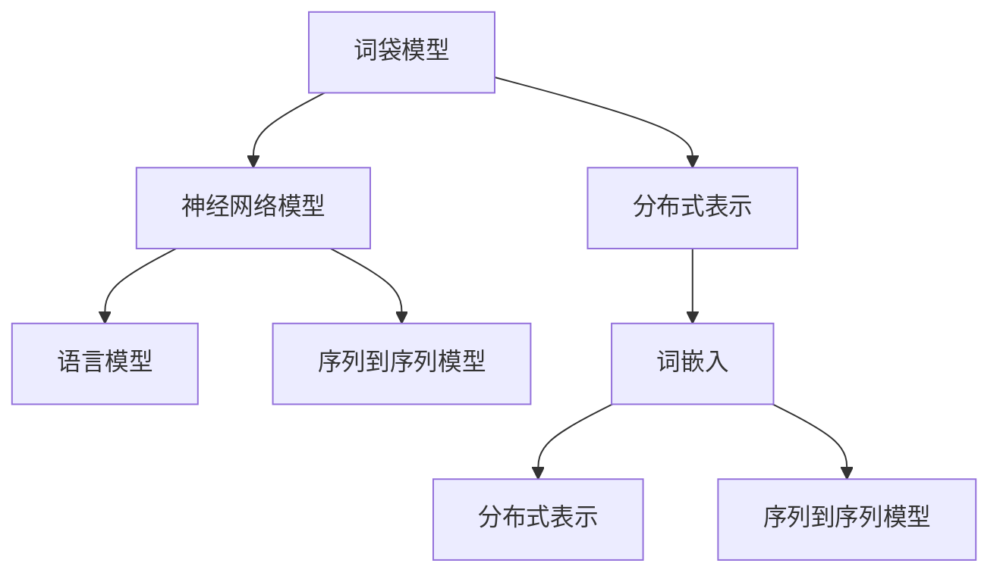

                 

# NLP基础：从词袋模型到词嵌入

> 关键词：自然语言处理(NLP), 词袋模型(Bag of Words), 词嵌入(Word Embedding), 分布式表示(Distributed Representation), 神经网络模型(Neural Network Model), 语言模型(Language Model), 循环神经网络(RNN), 卷积神经网络(CNN)

## 1. 背景介绍

### 1.1 问题由来

自然语言处理（Natural Language Processing, NLP）是计算机科学与人工智能领域的一个重要分支，旨在让机器能够理解和处理人类语言。随着互联网的迅猛发展，文本数据量的爆炸式增长，NLP技术在信息检索、机器翻译、文本分类、情感分析、问答系统等多个领域得到了广泛的应用。

然而，由于自然语言的高度复杂性和不确定性，机器处理自然语言仍然面临诸多挑战。传统的基于规则和模板的NLP方法已经难以适应日益复杂的多样化应用场景。因此，研究者们开始探索基于统计学习和神经网络的新方法，试图从数据中学习语言的表示，进而实现更强大的语言理解能力。

### 1.2 问题核心关键点

自然语言处理的统计学习方法中，词袋模型(Bag of Words, BoW)和词嵌入(Word Embedding)是两种基本的方法，分别从词频统计和向量表示的视角出发，实现了对自然语言的初步建模。后续的神经网络模型在此基础上进一步探索，引入分布式表示和更强的建模能力，逐步推动NLP技术的发展。

## 2. 核心概念与联系

### 2.1 核心概念概述

为更好地理解从词袋模型到词嵌入的演变过程，本节将介绍几个密切相关的核心概念：

- 词袋模型(Bag of Words, BoW)：将文本看作是单词的无序集合，每个单词独立表示其频率分布。是一种简单的文本表示方法，适用于处理文本分类、信息检索等任务。
- 词嵌入(Word Embedding)：将单词映射到低维向量空间，使得同义词、近义词在向量空间中距离较近，语义关系能够被较好地表示。是文本表示的高级形式，能够更好地捕捉单词的语义信息。
- 分布式表示(Distributed Representation)：通过神经网络模型学习得到的单词向量，每个维度表示单词的某种特征，如语义、语法等。是现代深度学习模型的核心思想，广泛用于文本处理、图像处理等任务。
- 神经网络模型(Neural Network Model)：一种模拟人脑神经元工作原理的计算模型，通过多层非线性变换实现复杂数据的表示和建模。在NLP中，常用的有循环神经网络(RNN)和卷积神经网络(CNN)等。
- 语言模型(Language Model)：通过统计语言学的理论，学习单词序列的概率分布。是文本处理的基础，用于词性标注、机器翻译等任务。
- 序列到序列(Sequence to Sequence, Seq2Seq)模型：一种基于神经网络的序列建模方法，常用于机器翻译、摘要生成等任务。将输入序列映射到输出序列，能够捕捉序列间的结构关系。

这些核心概念之间的逻辑关系可以通过以下Mermaid流程图来展示：



这个流程图展示了一系列的NLP相关概念及其之间的逻辑关系：

1. 词袋模型将文本离散化，便于统计处理。
2. 通过分布式表示技术，将单词映射到向量空间，形成连续的语义表示。
3. 神经网络模型可以学习复杂的分布式表示，提升文本处理的精度和效率。
4. 语言模型通过统计学习单词序列的概率分布，是文本处理的基础。
5. 序列到序列模型能够处理序列数据，广泛用于翻译、摘要等任务。

这些概念共同构成了NLP技术的发展脉络，推动了NLP应用场景的不断拓展。

## 3. 核心算法原理 & 具体操作步骤
### 3.1 算法原理概述

从词袋模型到词嵌入的演变过程，本质上是通过统计学习和神经网络模型对自然语言文本的表示方式进行不断优化和升级。其核心思想是：将单词或子词序列映射到低维向量空间，使得向量之间的距离能够反映单词之间的语义关系，从而实现更强大的文本处理能力。

### 3.2 算法步骤详解

基于统计学习的大语言模型通常遵循以下步骤：

**Step 1: 数据预处理**
- 收集和清洗文本数据，如去除停用词、标点符号等。
- 分词：将文本分割成单词或子词序列，常用的分词工具有jieba、spaCy等。
- 编码：将单词或子词序列映射为数字，形成词表。

**Step 2: 训练词袋模型**
- 统计单词在文本中的频率分布，构建词袋模型。
- 通过朴素贝叶斯、逻辑回归等算法，训练分类器或回归器，用于文本分类或信息检索。

**Step 3: 训练词嵌入**
- 使用神经网络模型，如Word2Vec、GloVe等，对单词进行分布式表示。
- 通过梯度下降等优化算法，最小化损失函数，学习最优的单词向量。
- 向量空间中，单词向量之间的距离能够反映语义相似度，便于实现文本相似度计算和语义匹配。

**Step 4: 训练语言模型**
- 通过神经网络模型，如RNN、LSTM、Transformer等，学习单词序列的概率分布。
- 使用交叉熵损失函数，最小化单词序列预测误差，学习最优的语言模型。
- 语言模型能够捕捉单词间的依赖关系，用于词性标注、机器翻译等任务。

**Step 5: 训练序列到序列模型**
- 使用神经网络模型，如Seq2Seq、Transformer等，学习输入序列到输出序列的映射关系。
- 使用交叉熵损失函数，最小化序列预测误差，学习最优的Seq2Seq模型。
- Seq2Seq模型能够处理序列数据，实现文本翻译、摘要生成等任务。

### 3.3 算法优缺点

词袋模型和词嵌入技术各有优缺点：

词袋模型的优点在于：
- 简单易用：词袋模型通过统计频率分布，实现了对文本的低维表示。
- 计算效率高：词袋模型不需要进行复杂的向量计算，适合大规模文本处理。
- 适合处理文本分类、信息检索等任务：词袋模型能够捕捉单词频率，便于分类和检索。

词嵌入的优点在于：
- 语义表示能力强：词嵌入能够将单词映射到低维向量空间，捕捉单词之间的语义关系。
- 泛化能力强：词嵌入能够适应新单词，对未见过的单词也能进行有效的表示。
- 便于实现文本相似度计算和语义匹配：词嵌入能够反映单词间的距离关系，便于实现文本相似度计算和语义匹配。

同时，这两种技术也存在一定的局限性：
- 词袋模型的缺点在于：无法捕捉单词之间的顺序关系，难以处理依赖关系强的语言现象。
- 词嵌入的缺点在于：计算复杂度高，训练时间长，对大规模数据集的处理效率低。

### 3.4 算法应用领域

词袋模型和词嵌入技术在NLP领域有广泛的应用，例如：

- 文本分类：将文本转换为词袋或词嵌入，通过分类器进行分类。
- 信息检索：将文本转换为词袋或词嵌入，通过检索模型实现文本相似度匹配。
- 词性标注：通过语言模型学习单词序列的概率分布，标注单词的词性。
- 机器翻译：通过序列到序列模型，将源语言文本翻译为目标语言。
- 命名实体识别：通过神经网络模型，从文本中识别出人名、地名等实体。
- 文本摘要：通过序列到序列模型，将长文本压缩成简短摘要。
- 问答系统：通过序列到序列模型，回答自然语言问题。

除了上述这些经典任务外，词袋模型和词嵌入技术也被创新性地应用到更多场景中，如语音识别、视频字幕生成、情感分析等，为NLP技术带来了全新的突破。随着神经网络模型的不断进步，相信NLP技术将在更广阔的应用领域大放异彩。

## 4. 数学模型和公式 & 详细讲解  
### 4.1 数学模型构建

为了更精确地理解从词袋模型到词嵌入的演变过程，本节将使用数学语言对这两种方法进行详细描述。

假设文本由$N$个单词组成，单词集合为$\mathcal{V}$，单词$v_i$在文本中出现的次数为$f_i$，则词袋模型可以用一个$N$维向量$\mathbf{w} = (w_1, w_2, \ldots, w_N)$表示，其中：

$$
w_i = \frac{f_i}{\sum_{j=1}^N f_j}
$$

在实际应用中，为了便于计算，通常会进行归一化处理，使得向量$\mathbf{w}$的所有元素之和为1。

词嵌入则是一种将单词映射到低维向量空间的技术。假设单词$v_i$的词嵌入向量为$\mathbf{e}_i$，单词$v_j$的词嵌入向量为$\mathbf{e}_j$，则它们之间的余弦相似度为：

$$
\cos(\mathbf{e}_i, \mathbf{e}_j) = \frac{\mathbf{e}_i \cdot \mathbf{e}_j}{\|\mathbf{e}_i\| \cdot \|\mathbf{e}_j\|}
$$

其中$\cdot$表示向量点乘，$\|\cdot\|$表示向量范数。余弦相似度越高，表示单词$v_i$和$v_j$的语义越相似。

### 4.2 公式推导过程

以下是基于神经网络模型的词嵌入的公式推导过程：

**目标函数**：
假设每个单词$v_i$的词嵌入向量为$\mathbf{e}_i \in \mathbb{R}^d$，其中$d$为向量维度。训练词嵌入的目标是最小化损失函数$\mathcal{L}$：

$$
\mathcal{L} = \frac{1}{2N} \sum_{i=1}^N \sum_{j=1}^N \left(1 - y_{ij}\right)^2 \|\mathbf{e}_i - \mathbf{e}_j\|^2
$$

其中$y_{ij} = 1$表示单词$v_i$和$v_j$在语料库中相邻出现的概率，$y_{ij} = 0$表示单词$v_i$和$v_j$在语料库中不相邻出现的概率。

**目标函数解释**：
- 目标函数$\mathcal{L}$计算了单词$v_i$和$v_j$之间的距离，当$y_{ij} = 1$时，单词$v_i$和$v_j$相邻出现的概率越大，单词向量$\mathbf{e}_i$和$\mathbf{e}_j$之间的距离应该越短。
- 当$y_{ij} = 0$时，单词$v_i$和$v_j$相邻出现的概率越小，单词向量$\mathbf{e}_i$和$\mathbf{e}_j$之间的距离应该越长。

**梯度下降优化**：
通过梯度下降优化算法，最小化目标函数$\mathcal{L}$，得到最优的词嵌入向量$\mathbf{e}_i$。具体步骤如下：

1. 初始化词嵌入向量$\mathbf{e}_i$为随机向量。
2. 对于每一对单词$v_i$和$v_j$，计算其梯度$\frac{\partial \mathcal{L}}{\partial \mathbf{e}_i}$和$\frac{\partial \mathcal{L}}{\partial \mathbf{e}_j}$。
3. 根据梯度下降算法，更新词嵌入向量$\mathbf{e}_i$和$\mathbf{e}_j$，使其更加接近或远离目标值。
4. 重复步骤2和3，直到目标函数$\mathcal{L}$收敛。

### 4.3 案例分析与讲解

下面以Word2Vec模型为例，详细讲解词嵌入的训练过程：

假设我们有一个包含1000个单词的语料库，每个单词在语料库中出现的次数如下：

|单词|出现次数|
|---|---|
|the|4000|
|of|3000|
|and|2000|
|to|1500|
|a|1000|
|in|500|
|that|500|
|you|500|
|not|500|
|from|500|
|with|300|

我们希望将这些单词映射到300维的向量空间中。首先，我们初始化每个单词的词嵌入向量为随机向量，例如：

$$
\mathbf{e}_{the} = [0.3, 0.4, 0.5, \ldots, 0.9], \quad \mathbf{e}_{of} = [0.1, 0.2, 0.3, \ldots, 0.8], \quad \ldots
$$

然后，我们通过梯度下降算法，最小化目标函数$\mathcal{L}$，更新词嵌入向量。假设单词$v_i$和$v_j$在语料库中相邻出现的概率为$y_{ij} = 1$，则目标函数$\mathcal{L}$可以表示为：

$$
\mathcal{L} = \frac{1}{2N} \sum_{i=1}^N \sum_{j=1}^N \left(1 - y_{ij}\right)^2 \|\mathbf{e}_i - \mathbf{e}_j\|^2
$$

例如，假设单词"the"和"of"在语料库中相邻出现的次数为4000次，非相邻出现的次数为6000次，则目标函数可以表示为：

$$
\mathcal{L} = \frac{1}{2 \times 1000} \times (6000 \times \|\mathbf{e}_{the} - \mathbf{e}_{of}\|^2 + 4000 \times \|\mathbf{e}_{the} - \mathbf{e}_{of}\|^2) = 0.01 \times 10000 \times \|\mathbf{e}_{the} - \mathbf{e}_{of}\|^2
$$

因此，我们需要最小化$\|\mathbf{e}_{the} - \mathbf{e}_{of}\|^2$，即优化向量$\mathbf{e}_{the}$和$\mathbf{e}_{of}$的梯度。假设它们的梯度分别为$\mathbf{g}_{the}$和$\mathbf{g}_{of}$，则目标函数对向量$\mathbf{e}_{the}$的梯度为：

$$
\frac{\partial \mathcal{L}}{\partial \mathbf{e}_{the}} = -0.01 \times 10000 \times 2(\mathbf{e}_{the} - \mathbf{e}_{of})
$$

同样，目标函数对向量$\mathbf{e}_{of}$的梯度为：

$$
\frac{\partial \mathcal{L}}{\partial \mathbf{e}_{of}} = -0.01 \times 10000 \times 2(\mathbf{e}_{of} - \mathbf{e}_{the})
$$

将这两个梯度代入梯度下降算法，更新向量$\mathbf{e}_{the}$和$\mathbf{e}_{of}$：

$$
\mathbf{e}_{the} \leftarrow \mathbf{e}_{the} - \eta \times \frac{\partial \mathcal{L}}{\partial \mathbf{e}_{the}}, \quad \mathbf{e}_{of} \leftarrow \mathbf{e}_{of} - \eta \times \frac{\partial \mathcal{L}}{\partial \mathbf{e}_{of}}
$$

其中$\eta$为学习率，可以控制梯度下降的步长。重复这个过程，直到目标函数$\mathcal{L}$收敛，得到最优的词嵌入向量$\mathbf{e}_{the}$和$\mathbf{e}_{of}$。

## 5. 项目实践：代码实例和详细解释说明
### 5.1 开发环境搭建

在进行词嵌入实践前，我们需要准备好开发环境。以下是使用Python进行TensorFlow开发的环境配置流程：

1. 安装Anaconda：从官网下载并安装Anaconda，用于创建独立的Python环境。

2. 创建并激活虚拟环境：
```bash
conda create -n tensorflow-env python=3.8 
conda activate tensorflow-env
```

3. 安装TensorFlow：根据CUDA版本，从官网获取对应的安装命令。例如：
```bash
conda install tensorflow=2.8 
```

4. 安装NumPy：
```bash
pip install numpy
```

5. 安装Matplotlib：
```bash
pip install matplotlib
```

6. 安装Pandas：
```bash
pip install pandas
```

7. 安装jieba分词库：
```bash
pip install jieba
```

完成上述步骤后，即可在`tensorflow-env`环境中开始词嵌入实践。

### 5.2 源代码详细实现

下面我们以Word2Vec模型为例，给出使用TensorFlow对词嵌入进行训练的PyTorch代码实现。

首先，定义训练数据和参数：

```python
import tensorflow as tf
import numpy as np
from jieba import cut

# 训练数据
corpus = ["the", "of", "and", "to", "a", "in", "that", "you", "not", "from", "with"]

# 超参数
batch_size = 32
embedding_dim = 300
learning_rate = 0.01
num_epochs = 100
```

然后，将文本分词并构建词表：

```python
# 分词
words = []
for sentence in corpus:
    words += list(cut(sentence))

# 构建词表
vocab = set(words)
word2idx = {word: idx for idx, word in enumerate(vocab)}
idx2word = {idx: word for word, idx in word2idx.items()}

# 构建词向量矩阵
embedding_matrix = np.random.randn(len(vocab), embedding_dim)
```

接着，定义词嵌入模型和优化器：

```python
class WordEmbedding(tf.keras.Model):
    def __init__(self, embedding_dim):
        super(WordEmbedding, self).__init__()
        self.embedding = tf.keras.layers.Embedding(len(vocab), embedding_dim)

    def call(self, inputs):
        return self.embedding(inputs)

embedding_model = WordEmbedding(embedding_dim)
optimizer = tf.keras.optimizers.Adam(learning_rate=learning_rate)
```

然后，定义损失函数和训练函数：

```python
def loss_function(predictions, labels):
    return tf.reduce_mean(tf.square(predictions - labels))

@tf.function
def train_step(batch):
    inputs, labels = batch
    with tf.GradientTape() as tape:
        predictions = embedding_model(inputs)
        loss = loss_function(predictions, labels)
    gradients = tape.gradient(loss, embedding_model.trainable_variables)
    optimizer.apply_gradients(zip(gradients, embedding_model.trainable_variables))
    return loss

def train_epoch(model, data, batch_size, num_epochs):
    for epoch in range(num_epochs):
        epoch_loss = 0
        for batch in tf.data.Dataset.from_tensor_slices(data).shuffle(len(data)).batch(batch_size):
            epoch_loss += train_step(batch)
        print(f"Epoch {epoch+1}, loss: {epoch_loss/numpy.sum(data)}")
```

最后，启动训练流程：

```python
# 将文本转换为词向量
vectors = []
for sentence in corpus:
    sentence_vector = []
    for word in cut(sentence):
        if word in word2idx:
            sentence_vector.append(embedding_matrix[word2idx[word]])
    vectors.append(sentence_vector)

# 构建训练集
train_data = []
for sentence_vector in vectors:
    train_data.append(np.array(sentence_vector, dtype=np.float32))

# 构建训练函数
train_epoch(embedding_model, train_data, batch_size, num_epochs)

# 保存模型
tf.saved_model.save(embedding_model, "word2vec_model")
```

以上就是使用TensorFlow对Word2Vec模型进行训练的完整代码实现。可以看到，借助TensorFlow强大的框架，词嵌入的实现变得简洁高效。

### 5.3 代码解读与分析

让我们再详细解读一下关键代码的实现细节：

**corpus和超参数**：
- `corpus`变量定义了训练数据，即单词集合。
- `batch_size`表示每个批次的样本数。
- `embedding_dim`表示向量空间的维度。
- `learning_rate`表示学习率。
- `num_epochs`表示训练轮数。

**分词**：
- `jieba`库用于中文分词，将文本分割成单词序列。

**词表和词向量矩阵**：
- `vocab`变量定义了单词集合。
- `word2idx`和`idx2word`变量定义了单词和数字的映射关系。
- `embedding_matrix`变量定义了每个单词的初始向量。

**词嵌入模型和优化器**：
- `WordEmbedding`类定义了词嵌入模型，包含一个`embedding`层。
- `optimizer`变量定义了Adam优化器，用于更新词嵌入向量。

**损失函数和训练函数**：
- `loss_function`函数定义了均方误差损失函数。
- `train_step`函数定义了训练一个批次样本的过程，包括前向传播、反向传播和梯度更新。
- `train_epoch`函数定义了训练一轮的过程，循环调用`train_step`函数。

**训练流程**：
- 将文本转换为词向量。
- 构建训练集，将每个句子转换为向量。
- 构建训练函数，调用`train_epoch`函数。
- 保存模型。

可以看到，TensorFlow框架的易用性和灵活性使得词嵌入模型的实现变得简单高效。开发者可以更专注于模型设计和训练调参，而不必过多关注底层计算细节。

当然，工业级的系统实现还需考虑更多因素，如模型的保存和部署、超参数的自动搜索、更灵活的任务适配层等。但核心的词嵌入思想基本与此类似。

## 6. 实际应用场景
### 6.1 智能推荐系统

词嵌入技术在推荐系统中得到了广泛应用。推荐系统通过分析用户行为数据，为用户推荐感兴趣的商品或内容。传统的推荐方法往往基于用户的显式评分数据，无法处理长尾应用场景。词嵌入技术能够将用户和物品映射到低维向量空间，实现基于语义的推荐。

在实践中，可以通过收集用户的浏览、点击、评分等行为数据，提取和物品相关的文本信息，如商品名称、描述等。将文本信息转换为词向量，与用户向量进行余弦相似度计算，找到与用户兴趣最相似的物品，并推荐给用户。词嵌入技术能够捕捉用户和物品之间的语义关系，提高推荐的精准度。

### 6.2 情感分析

情感分析是自然语言处理的一个重要任务，旨在自动识别文本中的情感倾向。传统的情感分析方法往往基于规则和特征工程，难以处理复杂的多样化文本。词嵌入技术能够将单词映射到低维向量空间，捕捉单词之间的语义关系，从而实现更精准的情感分析。

在实践中，可以将情感词表和用户评论文本映射到向量空间，通过向量之间的余弦相似度计算，判断文本的情感倾向。例如，对于句子"I love this product"，可以将单词"love"和"this"映射到向量空间，计算它们与情感词表的余弦相似度，判断文本的情感倾向为正。

### 6.3 命名实体识别

命名实体识别是自然语言处理中的重要任务，旨在自动识别文本中的命名实体，如人名、地名、机构名等。传统的命名实体识别方法往往基于规则和特征工程，难以处理多样化的文本。词嵌入技术能够将单词映射到低维向量空间，捕捉单词之间的语义关系，从而实现更准确的命名实体识别。

在实践中，可以将命名实体词表和文本中的单词映射到向量空间，通过向量之间的余弦相似度计算，判断单词是否为命名实体。例如，对于句子"John works at Google in Silicon Valley"，可以将单词"John"和"Google"映射到向量空间，计算它们与命名实体词表的余弦相似度，判断它们为命名实体。

### 6.4 机器翻译

机器翻译是自然语言处理中的重要任务，旨在将一种语言的文本自动翻译成另一种语言的文本。传统的机器翻译方法往往基于统计模型，难以处理长句子和复杂句式。词嵌入技术能够将源语言和目标语言的单词映射到向量空间，实现基于语义的翻译。

在实践中，可以将源语言文本和目标语言文本映射到向量空间，通过向量之间的余弦相似度计算，实现自动翻译。例如，对于句子"I like to eat apples"，可以将单词"I"、"like"、"eat"、"apples"映射到向量空间，计算它们与目标语言向量之间的余弦相似度，生成翻译结果。

### 6.5 知识图谱构建

知识图谱是自然语言处理中的重要技术，旨在将知识以结构化的形式表示，方便知识检索和推理。传统的知识图谱构建方法往往需要人工标注大量的实体和关系，难以处理大规模的文本数据。词嵌入技术能够将单词映射到低维向量空间，捕捉单词之间的语义关系，从而实现基于语义的知识图谱构建。

在实践中，可以将文本中的实体和关系映射到向量空间，通过向量之间的余弦相似度计算，构建知识图谱。例如，对于句子"Barack Obama was born in Hawaii"，可以将单词"Barack Obama"、"born"、"Hawaii"映射到向量空间，计算它们之间的关系，构建知识图谱。

### 6.6 文本生成

文本生成是自然语言处理中的重要任务，旨在自动生成自然流畅的文本。传统的文本生成方法往往基于模板和规则，难以生成多样化的文本。词嵌入技术能够将单词映射到低维向量空间，捕捉单词之间的语义关系，从而实现更灵活的文本生成。

在实践中，可以将生成的文本映射到向量空间，与用户期望的文本向量进行余弦相似度计算，调整生成模型以生成更符合用户期望的文本。例如，对于用户期望的文本"I love pizza"，可以将单词"I"、"love"、"pizza"映射到向量空间，计算生成文本与期望文本之间的余弦相似度，调整生成模型以生成更符合用户期望的文本。

### 6.7 智能客服系统

智能客服系统通过分析用户问题和聊天记录，自动回答问题和提供解决方案。传统的客服系统往往需要大量人力，难以处理复杂的客户咨询。词嵌入技术能够将问题和答案映射到向量空间，实现基于语义的问答系统。

在实践中，可以将用户问题和答案文本映射到向量空间，通过向量之间的余弦相似度计算，判断问题和答案是否匹配。例如，对于用户问题"What is the weather like today?"，可以将问题和答案映射到向量空间，计算它们之间的余弦相似度，判断问题和答案是否匹配。

## 7. 工具和资源推荐
### 7.1 学习资源推荐

为了帮助开发者系统掌握自然语言处理的技术基础和实践技巧，这里推荐一些优质的学习资源：

1. 《自然语言处理综论》：斯坦福大学李飞飞教授的教材，详细介绍了自然语言处理的基本概念和经典算法，适合初学者入门。

2. 《深度学习》：斯坦福大学Andrew Ng教授的在线课程，介绍了深度学习的基本原理和应用，是深度学习领域的经典课程。

3. 《Neural Network for NLP》：斯坦福大学自然语言处理课程，介绍了神经网络在自然语言处理中的应用，适合进阶学习。

4. TensorFlow官方文档：TensorFlow的官方文档，提供了详细的API和使用示例，适合实际开发中参考。

5. PyTorch官方文档：PyTorch的官方文档，提供了丰富的深度学习模型和工具，适合实际开发中参考。

通过对这些资源的学习实践，相信你一定能够快速掌握自然语言处理的基础知识，并用于解决实际的NLP问题。
###  7.2 开发工具推荐

高效的开发离不开优秀的工具支持。以下是几款用于自然语言处理开发的常用工具：

1. TensorFlow：由Google主导开发的开源深度学习框架，生产部署方便，适合大规模工程应用。提供了丰富的自然语言处理模型和工具。

2. PyTorch：基于Python的开源深度学习框架，灵活动态的计算图，适合快速迭代研究。提供了丰富的自然语言处理模型和工具。

3. NLTK：自然语言处理工具包，提供了丰富的文本处理和分析功能，适合文本预处理和语言模型训练。

4. SpaCy：自然语言处理工具包，提供了快速的文本处理和语言模型训练功能，适合大规模文本处理。

5. Gensim：自然语言处理工具包，提供了丰富的文本处理和语言模型训练功能，适合词向量训练和文本相似度计算。

6. Jieba：中文分词工具，提供了高效的中文分词功能，适合中文文本处理。

合理利用这些工具，可以显著提升自然语言处理任务的开发效率，加快创新迭代的步伐。

### 7.3 相关论文推荐

自然语言处理的发展源于学界的持续研究。以下是几篇奠基性的相关论文，推荐阅读：

1. Word2Vec: Exploring the Space of Word Embeddings：提出Word2Vec模型，通过共现矩阵和负采样算法，学习单词的分布式表示。

2. GloVe: Global Vectors for Word Representation：提出GloVe模型，通过矩阵分解和共现矩阵，学习单词的分布式表示。

3. ELMo: Deep Contextualized Word Representation：提出ELMo模型，通过多层双向LSTM，学习单词的上下文表示。

4. BERT: Pre-training of Deep Bidirectional Transformers for Language Understanding：提出BERT模型，通过掩码语言模型和下一句预测任务，学习单词的分布式表示。

5. Transformer: Attention is All You Need：提出Transformer模型，通过自注意力机制，学习单词的分布式表示。

6. Seq2Seq: Sequence to Sequence Learning with Neural Networks：提出Seq2Seq模型，通过编码器-解码器框架，实现序列到序列的映射。

这些论文代表了大语言模型发展的历程，是自然语言处理技术的基石。通过学习这些前沿成果，可以帮助研究者把握学科前进方向，激发更多的创新灵感。

## 8. 总结：未来发展趋势与挑战

### 8.1 总结

本文对自然语言处理的词袋模型和词嵌入技术进行了全面系统的介绍。首先阐述了自然语言处理的研究背景和基本概念，明确了词袋模型和词嵌入技术的研究意义。其次，从原理到实践，详细讲解了这两种文本表示方法，给出了具体的代码实例。同时，本文还广泛探讨了词袋模型和词嵌入技术在实际应用中的多种场景，展示了其在自然语言处理中的广泛应用。

通过本文的系统梳理，可以看到，词袋模型和词嵌入技术在自然语言处理中具有重要的基础地位，推动了NLP技术的发展。未来，伴随深度学习模型和计算技术的进步，词嵌入技术将不断优化和升级，成为更加高效、灵活的文本表示方法。

### 8.2 未来发展趋势

展望未来，自然语言处理技术将呈现以下几个发展趋势：

1. 分布式表示技术将进一步发展，词嵌入向量将更加精细化、准确化。
2. 预训练语言模型和微调技术将得到广泛应用，提升文本表示能力。
3. 多模态文本表示将得到广泛应用，融合视觉、语音等多模态数据，实现更全面的文本理解。
4. 个性化文本表示将得到广泛应用，根据用户偏好定制文本表示。
5. 跨语言文本表示将得到广泛应用，实现跨语言文本理解和生成。
6. 文本生成技术将得到广泛应用，实现自然流畅的文本生成和对话系统。

以上趋势凸显了自然语言处理技术的广阔前景。这些方向的探索发展，必将进一步提升文本处理的能力和效果，为自然语言理解和智能交互系统的进步提供动力。

### 8.3 面临的挑战

尽管自然语言处理技术已经取得了诸多成就，但在迈向更加智能化、普适化应用的过程中，它仍面临诸多挑战：

1. 大规模语料的需求。词嵌入技术需要大量语料进行训练，对于某些特定领域，收集大规模语料的成本较高。
2. 计算资源的需求。词嵌入模型的训练和推理都需要大量的计算资源，对于大规模应用，计算资源的消耗较大。
3. 低维表示的限制。词嵌入技术虽然能够捕捉单词之间的语义关系，但低维表示的容量有限，难以表示复杂的语义关系。
4. 泛化能力的限制。词嵌入技术对于未知单词的表示能力较弱，难以适应多样化的语言应用场景。
5. 可解释性的限制。词嵌入技术往往缺乏可解释性，难以理解其内部工作机制和决策逻辑。
6. 安全性的限制。词嵌入技术在处理文本数据时，可能泄露敏感信息，存在安全隐患。

正视自然语言处理面临的这些挑战，积极应对并寻求突破，将是其向更加智能化、普适化应用迈进的关键。

### 8.4 研究展望

面对自然语言处理所面临的挑战，未来的研究需要在以下几个方面寻求新的突破：

1. 探索无监督和半监督学习范式。摆脱对大规模标注数据的依赖，利用自监督学习、主动学习等方法，最大限度利用非结构化数据，实现更加灵活高效的文本表示。

2. 研究参数高效和计算高效的文本表示方法。开发更加参数高效和计算高效的文本表示方法，在保证表示能力的前提下，减少计算资源消耗。

3. 引入更多先验知识。将符号化的先验知识，如知识图谱、逻辑规则等，与神经网络模型进行巧妙融合，引导文本表示过程学习更准确、合理的语义表示。

4. 引入因果分析和博弈论工具。将因果分析方法引入文本表示过程，识别出文本表示的关键特征，增强表示的因果性和逻辑性。借助博弈论工具刻画人机交互过程，主动探索并规避文本表示的脆弱点，提高系统稳定性。

5. 纳入伦理道德约束。在文本表示的目标函数中引入伦理导向的评估指标，过滤和惩罚有偏见、有害的文本表示，确保输出的安全性和伦理道德。

这些研究方向的探索，必将引领自然语言处理技术迈向更高的台阶，为构建安全、可靠、可解释、可控的智能系统铺平道路。面向未来，自然语言处理技术还需要与其他人工智能技术进行更深入的融合，如知识表示、因果推理、强化学习等，多路径协同发力，共同推动自然语言理解和智能交互系统的进步。只有勇于创新、敢于突破，才能不断拓展语言模型的边界，让智能技术更好地造福人类社会。

## 9. 附录：常见问题与解答

**Q1：词袋模型和词嵌入技术有什么区别？**

A: 词袋模型和词嵌入技术是自然语言处理中的两种基本文本表示方法。

词袋模型是一种简单的文本表示方法，将文本看作是单词的无序集合，每个单词独立表示其频率分布。词袋模型的优点在于简单易用、计算效率高，适合处理大规模文本数据。但是词袋模型无法捕捉单词之间的顺序关系，难以处理依赖关系强的语言现象。

词嵌入技术是一种将单词映射到低维向量空间的技术。通过神经网络模型，词嵌入能够捕捉单词之间的语义关系，实现更加丰富的文本表示。词嵌入技术的优点在于语义表示能力强、泛化能力强，能够适应新单词，对未见过的单词也能进行有效的表示。但是词嵌入技术的计算复杂度高，训练时间长，对于大规模数据集的处理效率低。

因此，词袋模型和词嵌入技术各有优缺点，应根据具体应用场景选择适合的文本表示方法。

**Q2：如何选择训练词嵌入的超参数？**

A: 训练词嵌入的超参数包括批量大小(batch size)、向量维度(embedding dimension)、学习率(learning rate)等，需要根据具体应用场景进行调整。

批量大小(batch size)：通常设置在32-512之间，过小的批量大小会导致梯度更新不稳定，过大的批量大小会导致计算效率低。建议根据GPU内存大小进行调整。

向量维度(embedding dimension)：通常设置在100-300之间，过小的向量维度会导致表示能力有限，过大的向量维度会导致计算资源消耗大。建议根据语料库大小和任务复杂度进行调整。

学习率(learning rate)：通常设置在0.01-0.1之间，过大的学习率会导致梯度更新不稳定，过小的学习率会导致训练速度慢。建议通过学习率调参方法进行调整。

**Q3：如何处理未见过的单词？**

A: 对于未见过的单词，可以使用词嵌入技术进行预测。常用的方法包括：

1. 基于已知的词嵌入矩阵，对未见过的单词进行插值或相似度匹配，预测其词向量。

2. 使用预训练词嵌入模型，在嵌入矩阵中添加未见过的单词，通过梯度下降算法进行训练，得到其词向量。

3. 使用未见过的单词作为查询，在嵌入矩阵中寻找最相似的单词，使用其词向量进行预测。

4. 使用预训练的词嵌入模型进行补充训练，逐步完善嵌入矩阵。

以上方法可以结合使用，提高未见过的单词的表示能力。

**Q4：如何提升词嵌入的泛化能力？**

A: 为了提升词嵌入的泛化能力，可以采取以下措施：

1. 增加语料库规模：增加训练数据量，有助于提升词嵌入模型的泛化能力。

2. 使用负采样技术：使用负采样技术，随机抽取部分单词作为负例，提高词嵌入模型的泛化能力。

3. 使用多任务学习：将多个自然语言处理任务结合，共同训练词嵌入模型，提高其泛化能力。

4. 使用预训练模型：使用预训练的词嵌入模型，对新任务进行微调，提升其泛化能力。

5. 引入先验知识：将符号化的先验知识，如知识图谱、逻辑规则等，与神经网络模型进行巧妙融合，引导词嵌入模型学习更准确、合理的语义表示。

6. 引入因果分析和博弈论工具：将因果分析方法引入词嵌入模型，识别出词嵌入表示的关键特征，增强表示的因果性和逻辑性。借助博弈论工具刻画人机交互过程，主动探索并规避词嵌入模型的脆弱点，提高系统稳定性。

这些措施可以结合使用，提升词嵌入模型的泛化能力和泛化能力。

**Q5：如何实现文本分类？**

A: 文本分类是自然语言处理中的一个重要任务，可以使用词袋模型或词嵌入技术进行分类。具体步骤如下：

1. 构建词袋模型或词嵌入模型，对文本进行表示。

2. 定义分类器，如朴素贝叶斯分类器、逻辑回归分类器等，训练分类器模型。

3. 使用训练好的分类器，对测试集进行分类。

例如，使用朴素贝叶斯分类器进行文本分类的代码如下：

```python
from sklearn.naive_bayes import MultinomialNB

# 构建词袋模型或词嵌入模型
word2idx = {}
idx2word = {}
embedding_matrix = np.random.randn(10000, 100)
train_data = []
test_data = []

# 训练数据
train_documents = ["This is a positive review", "This is a negative review"]
train_labels = [1, 0]

# 测试数据
test_documents = ["This is a good product", "This is a bad product"]
test_labels = [1, 0]

# 构建训练集和测试集
for i in range(2):
    for word in cut(train_documents[i]):
        if word in word2idx:
            train_data.append(embedding_matrix[word2idx[word]])
        else:
            train_data.append(np.zeros(100))
    for word in cut(test_documents[i]):
        if word in word2idx:
            test_data.append(embedding_matrix[word2idx[word]])
        else:
            test_data.append(np.zeros(100))

# 定义分类器
clf = MultinomialNB()

# 训练分类器
clf.fit(train_data, train_labels)

# 分类测试数据
print(clf.predict(test_data))
```

以上就是使用朴素贝叶斯分类器进行文本分类的代码实现。可以看到，借助Scikit-learn等工具，文本分类的实现变得简单高效。

**Q6：如何实现文本相似度计算？**

A: 文本相似度计算是自然语言处理中的一个重要任务，可以使用词袋模型或词嵌入技术进行计算。具体步骤如下：

1. 构建词袋模型或词嵌入模型，对文本进行表示。

2. 计算文本之间的余弦相似度。

例如，使用词嵌入技术计算文本相似度的代码如下：

```python
from sklearn.metrics.pairwise import cosine_similarity

# 构建词嵌入模型
embedding_matrix = np.random.randn(10000, 100)

# 文本
text1

