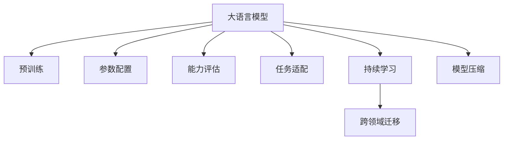

                 

# NLP领域的大模型标准与应用：参数、能力、任务

> 关键词：大模型标准、NLP应用、参数配置、模型能力、任务适配

## 1. 背景介绍

### 1.1 问题由来
近年来，随着深度学习技术的快速发展，预训练大语言模型(如BERT、GPT、T5等)在自然语言处理(NLP)领域取得了显著进展。这些大模型通过在海量无标签文本上预训练，学习到了丰富的语言知识和常识，具备强大的语言理解和生成能力。但与此同时，不同应用场景的NLP任务对模型的要求千差万别，单一的大模型可能难以完全适配各种需求。

### 1.2 问题核心关键点
为更好地适配NLP任务的特定需求，学术界和工业界提出了大模型标准化的概念，旨在通过定义参数配置、能力评估和任务适配等标准，指导大模型的使用和开发。大模型标准化不仅有助于提升模型的通用性和适用性，还能够促进NLP技术在不同领域的快速落地和迭代升级。

### 1.3 问题研究意义
大模型标准化在NLP领域具有重要意义：

1. **通用性与适用性**：标准化大模型可以适应多种NLP任务，减少从头开发所需的数据、计算和人力成本。
2. **性能优化**：通过参数配置和任务适配，可以显著提升模型在特定任务上的性能，避免过拟合。
3. **可解释性增强**：标准化的参数和能力评估，有助于提高模型的可解释性，促进技术透明度和用户信任。
4. **跨领域应用**：标准化的大模型能够跨领域复用，加速新领域的应用和技术迁移。
5. **技术迭代**：标准化的技术指标和评价体系，指导模型开发和优化，推动NLP技术的持续进步。

## 2. 核心概念与联系

### 2.1 核心概念概述

为全面理解NLP领域的大模型标准化，本文将介绍几个核心概念：

- **大语言模型(Large Language Model, LLM)**：以BERT、GPT、T5等预训练模型为代表的超大规模语言模型，具备强大的语言理解和生成能力。
- **预训练(Pre-training)**：在无标签文本数据上进行的自监督学习，以获得通用的语言表示。
- **参数配置(Parameter Configuration)**：定义模型的参数规模、层数、深度等配置，以适应不同任务的需求。
- **能力评估(Capability Evaluation)**：通过标准化的评估指标，量化模型的语言理解和生成能力。
- **任务适配(Task Adaptation)**：在预训练模型的基础上，通过微调或提示学习等方法，适配特定任务的要求。
- **持续学习(Continual Learning)**：使模型能够不断学习新知识，避免过时或遗忘。
- **跨领域迁移(Cross-domain Transfer)**：将预训练模型在不同领域中的知识进行迁移，提升模型的泛化能力。
- **模型压缩(Model Compression)**：减少模型的参数和计算量，提升模型的部署效率和推理速度。

这些概念通过以下Mermaid流程图展示其联系：



这个流程图展示了大语言模型从预训练到微调过程中的主要步骤和概念：

1. 大语言模型通过预训练获得基础能力。
2. 参数配置决定了模型的结构和大小，适应具体任务需求。
3. 能力评估量化模型性能，指导参数优化。
4. 任务适配通过微调或提示学习，将通用模型适配特定任务。
5. 持续学习使模型不断学习新知识，保持最新状态。
6. 跨领域迁移促进知识迁移，提升模型泛化能力。
7. 模型压缩减小模型规模，提升计算效率。

## 3. 核心算法原理 & 具体操作步骤
### 3.1 算法原理概述

大模型标准化过程中，核心算法原理主要包括以下几个方面：

- **预训练与微调**：在无标签数据上进行预训练，然后在有标签数据上进行微调，以适应特定任务的需求。
- **参数配置**：定义模型的参数规模、层数、深度等配置，以适应不同任务的需求。
- **能力评估**：通过标准化的评估指标，量化模型的语言理解和生成能力。
- **任务适配**：在预训练模型的基础上，通过微调或提示学习等方法，适配特定任务的要求。
- **持续学习**：使模型能够不断学习新知识，避免过时或遗忘。

### 3.2 算法步骤详解

基于上述算法原理，NLP领域的大模型标准化过程一般包括以下几个关键步骤：

**Step 1: 准备预训练模型和数据集**
- 选择合适的预训练语言模型 $M_{\theta}$，如BERT、GPT、T5等。
- 准备下游任务 $T$ 的标注数据集 $D=\{(x_i,y_i)\}_{i=1}^N$，划分为训练集、验证集和测试集。

**Step 2: 定义参数配置**
- 根据任务需求，确定模型的参数规模、层数、深度等配置。
- 调整模型的参数配置，使模型能够在有限的计算资源下，达到最佳的性能表现。

**Step 3: 设计能力评估指标**
- 根据任务特点，选择合适的评估指标，如BLEU、ROUGE、METEOR等。
- 在验证集上评估模型性能，确定微调的学习率、正则化强度等超参数。

**Step 4: 执行任务适配**
- 根据任务特点，选择微调方法，如全参数微调、参数高效微调(PEFT)、提示学习等。
- 应用微调方法，对预训练模型进行适配，提升模型在特定任务上的性能。

**Step 5: 持续学习与更新**
- 收集新的标注数据，定期重新微调模型，保持模型的最新状态。
- 引入对抗训练等技术，增强模型的鲁棒性和泛化能力。

### 3.3 算法优缺点

大模型标准化在NLP领域具有以下优点：

1. **通用性**：标准化大模型可以适应多种NLP任务，减少从头开发所需的数据、计算和人力成本。
2. **性能提升**：通过参数配置和任务适配，可以显著提升模型在特定任务上的性能，避免过拟合。
3. **可解释性**：标准化的参数和能力评估，有助于提高模型的可解释性，促进技术透明度和用户信任。
4. **跨领域应用**：标准化的大模型能够跨领域复用，加速新领域的应用和技术迁移。

同时，该方法也存在一些局限性：

1. **对标注数据的依赖**：微调效果很大程度上取决于标注数据的质量和数量。
2. **模型泛化能力**：当目标任务与预训练数据的分布差异较大时，模型泛化能力可能受限。
3. **可解释性不足**：微调模型决策过程缺乏可解释性，难以调试和优化。
4. **参数优化困难**：参数配置和微调过程涉及复杂的超参数调优，需要大量实验和调试。

尽管存在这些局限性，但就目前而言，大模型标准化仍是NLP领域的重要范式，通过不断优化和改进，可以更好地适应不同任务的需求。

### 3.4 算法应用领域

大模型标准化方法在NLP领域已经得到了广泛应用，覆盖了几乎所有常见任务，例如：

- **文本分类**：如情感分析、主题分类、意图识别等。通过微调使模型学习文本-标签映射。
- **命名实体识别**：识别文本中的人名、地名、机构名等特定实体。通过微调使模型掌握实体边界和类型。
- **关系抽取**：从文本中抽取实体之间的语义关系。通过微调使模型学习实体-关系三元组。
- **问答系统**：对自然语言问题给出答案。将问题-答案对作为微调数据，训练模型学习匹配答案。
- **机器翻译**：将源语言文本翻译成目标语言。通过微调使模型学习语言-语言映射。
- **文本摘要**：将长文本压缩成简短摘要。将文章-摘要对作为微调数据，使模型学习抓取要点。
- **对话系统**：使机器能够与人自然对话。将多轮对话历史作为上下文，微调模型进行回复生成。

除了上述这些经典任务外，大模型标准化方法还被创新性地应用到更多场景中，如可控文本生成、常识推理、代码生成、数据增强等，为NLP技术带来了全新的突破。

## 4. 数学模型和公式 & 详细讲解  
### 4.1 数学模型构建

本节将使用数学语言对NLP领域的大模型标准化过程进行更加严格的刻画。

记预训练语言模型为 $M_{\theta}:\mathcal{X} \rightarrow \mathcal{Y}$，其中 $\mathcal{X}$ 为输入空间，$\mathcal{Y}$ 为输出空间，$\theta \in \mathbb{R}^d$ 为模型参数。假设微调任务的训练集为 $D=\{(x_i,y_i)\}_{i=1}^N, x_i \in \mathcal{X}, y_i \in \mathcal{Y}$。

定义模型 $M_{\theta}$ 在输入 $x$ 上的损失函数为 $\ell(M_{\theta}(x),y)$，则在数据集 $D$ 上的经验风险为：

$$
\mathcal{L}(\theta) = \frac{1}{N} \sum_{i=1}^N \ell(M_{\theta}(x_i),y_i)
$$

微调的优化目标是最小化经验风险，即找到最优参数：

$$
\theta^* = \mathop{\arg\min}_{\theta} \mathcal{L}(\theta)
$$

在实践中，我们通常使用基于梯度的优化算法（如SGD、Adam等）来近似求解上述最优化问题。设 $\eta$ 为学习率，$\lambda$ 为正则化系数，则参数的更新公式为：

$$
\theta \leftarrow \theta - \eta \nabla_{\theta}\mathcal{L}(\theta) - \eta\lambda\theta
$$

其中 $\nabla_{\theta}\mathcal{L}(\theta)$ 为损失函数对参数 $\theta$ 的梯度，可通过反向传播算法高效计算。

### 4.2 公式推导过程

以下我们以二分类任务为例，推导交叉熵损失函数及其梯度的计算公式。

假设模型 $M_{\theta}$ 在输入 $x$ 上的输出为 $\hat{y}=M_{\theta}(x) \in [0,1]$，表示样本属于正类的概率。真实标签 $y \in \{0,1\}$。则二分类交叉熵损失函数定义为：

$$
\ell(M_{\theta}(x),y) = -[y\log \hat{y} + (1-y)\log (1-\hat{y})]
$$

将其代入经验风险公式，得：

$$
\mathcal{L}(\theta) = -\frac{1}{N}\sum_{i=1}^N [y_i\log M_{\theta}(x_i)+(1-y_i)\log(1-M_{\theta}(x_i))]
$$

根据链式法则，损失函数对参数 $\theta_k$ 的梯度为：

$$
\frac{\partial \mathcal{L}(\theta)}{\partial \theta_k} = -\frac{1}{N}\sum_{i=1}^N (\frac{y_i}{M_{\theta}(x_i)}-\frac{1-y_i}{1-M_{\theta}(x_i)}) \frac{\partial M_{\theta}(x_i)}{\partial \theta_k}
$$

其中 $\frac{\partial M_{\theta}(x_i)}{\partial \theta_k}$ 可进一步递归展开，利用自动微分技术完成计算。

## 5. 项目实践：代码实例和详细解释说明
### 5.1 开发环境搭建

在进行大模型标准化实践前，我们需要准备好开发环境。以下是使用Python进行PyTorch开发的环境配置流程：

1. 安装Anaconda：从官网下载并安装Anaconda，用于创建独立的Python环境。

2. 创建并激活虚拟环境：
```bash
conda create -n pytorch-env python=3.8 
conda activate pytorch-env
```

3. 安装PyTorch：根据CUDA版本，从官网获取对应的安装命令。例如：
```bash
conda install pytorch torchvision torchaudio cudatoolkit=11.1 -c pytorch -c conda-forge
```

4. 安装Transformers库：
```bash
pip install transformers
```

5. 安装各类工具包：
```bash
pip install numpy pandas scikit-learn matplotlib tqdm jupyter notebook ipython
```

完成上述步骤后，即可在`pytorch-env`环境中开始大模型标准化的实践。

### 5.2 源代码详细实现

下面我们以命名实体识别(NER)任务为例，给出使用Transformers库对BERT模型进行标准化的PyTorch代码实现。

首先，定义NER任务的数据处理函数：

```python
from transformers import BertTokenizer
from torch.utils.data import Dataset
import torch

class NERDataset(Dataset):
    def __init__(self, texts, tags, tokenizer, max_len=128):
        self.texts = texts
        self.tags = tags
        self.tokenizer = tokenizer
        self.max_len = max_len
        
    def __len__(self):
        return len(self.texts)
    
    def __getitem__(self, item):
        text = self.texts[item]
        tags = self.tags[item]
        
        encoding = self.tokenizer(text, return_tensors='pt', max_length=self.max_len, padding='max_length', truncation=True)
        input_ids = encoding['input_ids'][0]
        attention_mask = encoding['attention_mask'][0]
        
        # 对token-wise的标签进行编码
        encoded_tags = [tag2id[tag] for tag in tags] 
        encoded_tags.extend([tag2id['O']] * (self.max_len - len(encoded_tags)))
        labels = torch.tensor(encoded_tags, dtype=torch.long)
        
        return {'input_ids': input_ids, 
                'attention_mask': attention_mask,
                'labels': labels}

# 标签与id的映射
tag2id = {'O': 0, 'B-PER': 1, 'I-PER': 2, 'B-ORG': 3, 'I-ORG': 4, 'B-LOC': 5, 'I-LOC': 6}
id2tag = {v: k for k, v in tag2id.items()}

# 创建dataset
tokenizer = BertTokenizer.from_pretrained('bert-base-cased')

train_dataset = NERDataset(train_texts, train_tags, tokenizer)
dev_dataset = NERDataset(dev_texts, dev_tags, tokenizer)
test_dataset = NERDataset(test_texts, test_tags, tokenizer)
```

然后，定义模型和优化器：

```python
from transformers import BertForTokenClassification, AdamW

model = BertForTokenClassification.from_pretrained('bert-base-cased', num_labels=len(tag2id))

optimizer = AdamW(model.parameters(), lr=2e-5)
```

接着，定义训练和评估函数：

```python
from torch.utils.data import DataLoader
from tqdm import tqdm
from sklearn.metrics import classification_report

device = torch.device('cuda') if torch.cuda.is_available() else torch.device('cpu')
model.to(device)

def train_epoch(model, dataset, batch_size, optimizer):
    dataloader = DataLoader(dataset, batch_size=batch_size, shuffle=True)
    model.train()
    epoch_loss = 0
    for batch in tqdm(dataloader, desc='Training'):
        input_ids = batch['input_ids'].to(device)
        attention_mask = batch['attention_mask'].to(device)
        labels = batch['labels'].to(device)
        model.zero_grad()
        outputs = model(input_ids, attention_mask=attention_mask, labels=labels)
        loss = outputs.loss
        epoch_loss += loss.item()
        loss.backward()
        optimizer.step()
    return epoch_loss / len(dataloader)

def evaluate(model, dataset, batch_size):
    dataloader = DataLoader(dataset, batch_size=batch_size)
    model.eval()
    preds, labels = [], []
    with torch.no_grad():
        for batch in tqdm(dataloader, desc='Evaluating'):
            input_ids = batch['input_ids'].to(device)
            attention_mask = batch['attention_mask'].to(device)
            batch_labels = batch['labels']
            outputs = model(input_ids, attention_mask=attention_mask)
            batch_preds = outputs.logits.argmax(dim=2).to('cpu').tolist()
            batch_labels = batch_labels.to('cpu').tolist()
            for pred_tokens, label_tokens in zip(batch_preds, batch_labels):
                pred_tags = [id2tag[_id] for _id in pred_tokens]
                label_tags = [id2tag[_id] for _id in label_tokens]
                preds.append(pred_tags[:len(label_tags)])
                labels.append(label_tags)
                
    print(classification_report(labels, preds))
```

最后，启动训练流程并在测试集上评估：

```python
epochs = 5
batch_size = 16

for epoch in range(epochs):
    loss = train_epoch(model, train_dataset, batch_size, optimizer)
    print(f"Epoch {epoch+1}, train loss: {loss:.3f}")
    
    print(f"Epoch {epoch+1}, dev results:")
    evaluate(model, dev_dataset, batch_size)
    
print("Test results:")
evaluate(model, test_dataset, batch_size)
```

以上就是使用PyTorch对BERT进行命名实体识别任务标准化的完整代码实现。可以看到，得益于Transformers库的强大封装，我们可以用相对简洁的代码完成BERT模型的加载和标准化。

### 5.3 代码解读与分析

让我们再详细解读一下关键代码的实现细节：

**NERDataset类**：
- `__init__`方法：初始化文本、标签、分词器等关键组件。
- `__len__`方法：返回数据集的样本数量。
- `__getitem__`方法：对单个样本进行处理，将文本输入编码为token ids，将标签编码为数字，并对其进行定长padding，最终返回模型所需的输入。

**tag2id和id2tag字典**：
- 定义了标签与数字id之间的映射关系，用于将token-wise的预测结果解码回真实的标签。

**训练和评估函数**：
- 使用PyTorch的DataLoader对数据集进行批次化加载，供模型训练和推理使用。
- 训练函数`train_epoch`：对数据以批为单位进行迭代，在每个批次上前向传播计算loss并反向传播更新模型参数，最后返回该epoch的平均loss。
- 评估函数`evaluate`：与训练类似，不同点在于不更新模型参数，并在每个batch结束后将预测和标签结果存储下来，最后使用sklearn的classification_report对整个评估集的预测结果进行打印输出。

**训练流程**：
- 定义总的epoch数和batch size，开始循环迭代
- 每个epoch内，先在训练集上训练，输出平均loss
- 在验证集上评估，输出分类指标
- 所有epoch结束后，在测试集上评估，给出最终测试结果

可以看到，PyTorch配合Transformers库使得BERT标准化的代码实现变得简洁高效。开发者可以将更多精力放在数据处理、模型改进等高层逻辑上，而不必过多关注底层的实现细节。

当然，工业级的系统实现还需考虑更多因素，如模型的保存和部署、超参数的自动搜索、更灵活的任务适配层等。但核心的标准化范式基本与此类似。

## 6. 实际应用场景
### 6.1 智能客服系统

基于大模型标准化的对话技术，可以广泛应用于智能客服系统的构建。传统客服往往需要配备大量人力，高峰期响应缓慢，且一致性和专业性难以保证。而使用标准化后的对话模型，可以7x24小时不间断服务，快速响应客户咨询，用自然流畅的语言解答各类常见问题。

在技术实现上，可以收集企业内部的历史客服对话记录，将问题和最佳答复构建成监督数据，在此基础上对标准化对话模型进行微调。微调后的对话模型能够自动理解用户意图，匹配最合适的答案模板进行回复。对于客户提出的新问题，还可以接入检索系统实时搜索相关内容，动态组织生成回答。如此构建的智能客服系统，能大幅提升客户咨询体验和问题解决效率。

### 6.2 金融舆情监测

金融机构需要实时监测市场舆论动向，以便及时应对负面信息传播，规避金融风险。传统的人工监测方式成本高、效率低，难以应对网络时代海量信息爆发的挑战。基于大模型标准化的文本分类和情感分析技术，为金融舆情监测提供了新的解决方案。

具体而言，可以收集金融领域相关的新闻、报道、评论等文本数据，并对其进行主题标注和情感标注。在此基础上对标准化预训练语言模型进行微调，使其能够自动判断文本属于何种主题，情感倾向是正面、中性还是负面。将标准化微调后的模型应用到实时抓取的网络文本数据，就能够自动监测不同主题下的情感变化趋势，一旦发现负面信息激增等异常情况，系统便会自动预警，帮助金融机构快速应对潜在风险。

### 6.3 个性化推荐系统

当前的推荐系统往往只依赖用户的历史行为数据进行物品推荐，无法深入理解用户的真实兴趣偏好。基于大模型标准化的个性化推荐系统可以更好地挖掘用户行为背后的语义信息，从而提供更精准、多样的推荐内容。

在实践中，可以收集用户浏览、点击、评论、分享等行为数据，提取和用户交互的物品标题、描述、标签等文本内容。将文本内容作为模型输入，用户的后续行为（如是否点击、购买等）作为监督信号，在此基础上对标准化预训练语言模型进行微调。微调后的模型能够从文本内容中准确把握用户的兴趣点。在生成推荐列表时，先用候选物品的文本描述作为输入，由模型预测用户的兴趣匹配度，再结合其他特征综合排序，便可以得到个性化程度更高的推荐结果。

### 6.4 未来应用展望

随着大模型标准化的不断发展，基于标准化范式将在更多领域得到应用，为传统行业带来变革性影响。

在智慧医疗领域，基于标准化的大语言模型微调的医疗问答、病历分析、药物研发等应用将提升医疗服务的智能化水平，辅助医生诊疗，加速新药开发进程。

在智能教育领域，标准化微调技术可应用于作业批改、学情分析、知识推荐等方面，因材施教，促进教育公平，提高教学质量。

在智慧城市治理中，标准化微调模型可应用于城市事件监测、舆情分析、应急指挥等环节，提高城市管理的自动化和智能化水平，构建更安全、高效的未来城市。

此外，在企业生产、社会治理、文娱传媒等众多领域，基于标准化大模型的微调方法也将不断涌现，为NLP技术带来了全新的突破。相信随着技术的日益成熟，标准化大模型微调技术将成为NLP落地应用的重要范式，推动人工智能技术在各个垂直行业的快速渗透。

## 7. 工具和资源推荐
### 7.1 学习资源推荐

为了帮助开发者系统掌握大模型标准化的理论基础和实践技巧，这里推荐一些优质的学习资源：

1. 《Transformer从原理到实践》系列博文：由大模型技术专家撰写，深入浅出地介绍了Transformer原理、BERT模型、标准化技术等前沿话题。

2. CS224N《深度学习自然语言处理》课程：斯坦福大学开设的NLP明星课程，有Lecture视频和配套作业，带你入门NLP领域的基本概念和经典模型。

3. 《Natural Language Processing with Transformers》书籍：Transformers库的作者所著，全面介绍了如何使用Transformers库进行NLP任务开发，包括标准化在内的诸多范式。

4. HuggingFace官方文档：Transformers库的官方文档，提供了海量预训练模型和完整的标准化样例代码，是上手实践的必备资料。

5. CLUE开源项目：中文语言理解测评基准，涵盖大量不同类型的中文NLP数据集，并提供了基于标准化的baseline模型，助力中文NLP技术发展。

通过对这些资源的学习实践，相信你一定能够快速掌握大模型标准化的精髓，并用于解决实际的NLP问题。
###  7.2 开发工具推荐

高效的开发离不开优秀的工具支持。以下是几款用于大模型标准化开发的常用工具：

1. PyTorch：基于Python的开源深度学习框架，灵活动态的计算图，适合快速迭代研究。大部分预训练语言模型都有PyTorch版本的实现。

2. TensorFlow：由Google主导开发的开源深度学习框架，生产部署方便，适合大规模工程应用。同样有丰富的预训练语言模型资源。

3. Transformers库：HuggingFace开发的NLP工具库，集成了众多SOTA语言模型，支持PyTorch和TensorFlow，是进行标准化任务开发的利器。

4. Weights & Biases：模型训练的实验跟踪工具，可以记录和可视化模型训练过程中的各项指标，方便对比和调优。与主流深度学习框架无缝集成。

5. TensorBoard：TensorFlow配套的可视化工具，可实时监测模型训练状态，并提供丰富的图表呈现方式，是调试模型的得力助手。

6. Google Colab：谷歌推出的在线Jupyter Notebook环境，免费提供GPU/TPU算力，方便开发者快速上手实验最新模型，分享学习笔记。

合理利用这些工具，可以显著提升大模型标准化的开发效率，加快创新迭代的步伐。

### 7.3 相关论文推荐

大模型标准化在NLP领域的发展源于学界的持续研究。以下是几篇奠基性的相关论文，推荐阅读：

1. Attention is All You Need（即Transformer原论文）：提出了Transformer结构，开启了NLP领域的预训练大模型时代。

2. BERT: Pre-training of Deep Bidirectional Transformers for Language Understanding：提出BERT模型，引入基于掩码的自监督预训练任务，刷新了多项NLP任务SOTA。

3. Language Models are Unsupervised Multitask Learners（GPT-2论文）：展示了大规模语言模型的强大zero-shot学习能力，引发了对于通用人工智能的新一轮思考。

4. Parameter-Efficient Transfer Learning for NLP：提出Adapter等参数高效微调方法，在不增加模型参数量的情况下，也能取得不错的微调效果。

5. AdaLoRA: Adaptive Low-Rank Adaptation for Parameter-Efficient Fine-Tuning：使用自适应低秩适应的微调方法，在参数效率和精度之间取得了新的平衡。

6. Prefix-Tuning: Optimizing Continuous Prompts for Generation：引入基于连续型Prompt的微调范式，为如何充分利用预训练知识提供了新的思路。

这些论文代表了大模型标准化的发展脉络。通过学习这些前沿成果，可以帮助研究者把握学科前进方向，激发更多的创新灵感。

## 8. 总结：未来发展趋势与挑战
### 8.1 总结

本文对NLP领域的大模型标准化方法进行了全面系统的介绍。首先阐述了大语言模型和标准化的研究背景和意义，明确了标准化大模型可以适应多种NLP任务，减少从头开发所需的数据、计算和人力成本。其次，从原理到实践，详细讲解了标准化过程的数学原理和关键步骤，给出了标准化任务开发的完整代码实例。同时，本文还广泛探讨了标准化方法在智能客服、金融舆情、个性化推荐等多个行业领域的应用前景，展示了标准化范式的巨大潜力。此外，本文精选了标准化技术的各类学习资源，力求为读者提供全方位的技术指引。

通过本文的系统梳理，可以看到，基于大模型标准化的NLP应用开启了广阔的想象空间，极大地拓展了预训练语言模型的应用边界，催生了更多的落地场景。得益于大规模语料的预训练和标准化的技术指导，标准化大模型在各种任务上均能取得不错的性能，为NLP技术在垂直行业的应用提供了有力支持。未来，伴随预训练语言模型和标准化方法的持续演进，相信NLP技术将在更广阔的应用领域大放异彩，深刻影响人类的生产生活方式。

### 8.2 未来发展趋势

展望未来，大模型标准化技术将呈现以下几个发展趋势：

1. **模型规模增大**：随着算力成本的下降和数据规模的扩张，预训练语言模型的参数量还将持续增长。超大参数量的模型蕴含的丰富语言知识，有望支撑更加复杂多变的下游任务标准化。

2. **参数配置多样化**：为适应不同任务的需求，标准化大模型将配备多种参数配置选项，如模型深度、层数、参数大小等，以供用户选择。

3. **能力评估精确化**：通过引入更精细化的评估指标和标准，量化模型的语言理解和生成能力，指导模型优化和参数配置。

4. **任务适配细粒度**：基于微调和提示学习等技术，进行更细粒度的任务适配，提升模型在特定任务上的性能。

5. **跨领域迁移增强**：通过引入多领域预训练和知识迁移技术，提高标准化模型在不同领域间的泛化能力。

6. **技术自动化**：通过自动化超参数调优、模型压缩等技术，提升标准化模型的部署效率和推理速度。

7. **伦理与安全加强**：在模型设计中引入伦理导向的评价指标，过滤和消除模型偏见，确保输出的安全性。

以上趋势凸显了大模型标准化的广阔前景。这些方向的探索发展，必将进一步提升NLP系统的性能和应用范围，为人类认知智能的进化带来深远影响。

### 8.3 面临的挑战

尽管大模型标准化技术已经取得了显著成就，但在迈向更加智能化、普适化应用的过程中，它仍面临着诸多挑战：

1. **对标注数据的依赖**：微调效果很大程度上取决于标注数据的质量和数量，获取高质量标注数据的成本较高。如何进一步降低微调对标注样本的依赖，将是一大难题。

2. **模型鲁棒性不足**：当目标任务与预训练数据的分布差异较大时，模型泛化能力可能受限。对于域外数据，微调模型的鲁棒性需要进一步提升。

3. **可解释性不足**：微调模型决策过程缺乏可解释性，难以调试和优化。对于高风险应用，算法的可解释性和可审计性尤为重要。

4. **参数优化困难**：参数配置和微调过程涉及复杂的超参数调优，需要大量实验和调试。

5. **知识整合能力不足**：现有的微调模型往往局限于任务内数据，难以灵活吸收和运用更广泛的先验知识。

6. **资源消耗高**：超大规模语言模型对算力、内存、存储等资源消耗较大，需要高效的资源管理策略。

尽管存在这些挑战，但通过持续的技术创新和优化，大模型标准化技术将在NLP领域发挥更大的作用，推动人工智能技术在各个垂直行业的广泛应用。

### 8.4 研究展望

面对大模型标准化面临的种种挑战，未来的研究需要在以下几个方面寻求新的突破：

1. **无监督和半监督标准化**：摆脱对大规模标注数据的依赖，利用自监督学习、主动学习等无监督和半监督范式，最大限度利用非结构化数据，实现更加灵活高效的模型标准化。

2. **参数高效和计算高效标准化**：开发更加参数高效和计算高效的标准化方法，如Parameter-Efficient Transfer Learning、LoRA等，在减少资源消耗的同时，保证模型性能。

3. **持续学习与跨领域迁移**：使模型能够不断学习新知识，避免过时或遗忘，同时在不同领域间进行知识迁移，提升泛化能力。

4. **融合因果和对比学习**：通过引入因果推断和对比学习思想，增强模型的稳定因果关系能力和语言表征，提升泛化性和抗干扰能力。

5. **知识表示与逻辑推理**：将符号化的先验知识，如知识图谱、逻辑规则等，与神经网络模型进行融合，引导标准化过程学习更准确、合理的语言模型。

6. **伦理与安全约束**：在模型设计中引入伦理导向的评价指标，过滤和消除模型偏见，确保输出的安全性，建立模型行为的监管机制。

这些研究方向的探索，必将引领大模型标准化技术迈向更高的台阶，为构建安全、可靠、可解释、可控的智能系统铺平道路。面向未来，大模型标准化技术还需要与其他人工智能技术进行更深入的融合，如知识表示、因果推理、强化学习等，多路径协同发力，共同推动自然语言理解和智能交互系统的进步。只有勇于创新、敢于突破，才能不断拓展语言模型的边界，让智能技术更好地造福人类社会。

## 9. 附录：常见问题与解答

**Q1：大模型标准化是否适用于所有NLP任务？**

A: 大模型标准化在大多数NLP任务上都能取得不错的效果，特别是对于数据量较小的任务。但对于一些特定领域的任务，如医学、法律等，仅仅依靠通用语料预训练的模型可能难以很好地适应。此时需要在特定领域语料上进一步预训练，再进行标准化。此外，对于一些需要时效性、个性化很强的任务，如对话、推荐等，标准化方法也需要针对性的改进优化。

**Q2：如何选择合适的学习率？**

A: 微调的学习率一般要比预训练时小1-2个数量级，如果使用过大的学习率，容易破坏预训练权重，导致过拟合。一般建议从1e-5开始调参，逐步减小学习率，直至收敛。也可以使用warmup策略，在开始阶段使用较小的学习率，再逐渐过渡到预设值。需要注意的是，不同的优化器(如AdamW、Adafactor等)以及不同的学习率调度策略，可能需要设置不同的学习率阈值。

**Q3：采用大模型标准化时会面临哪些资源瓶颈？**

A: 当前主流的预训练大模型动辄以亿计的参数规模，对算力、内存、存储等资源消耗较大。GPU/TPU等高性能设备是必不可少的，但即便如此，超大批次的训练和推理也可能遇到显存不足的问题。因此需要采用一些资源优化技术，如梯度积累、混合精度训练、模型并行等，来突破硬件瓶颈。同时，模型的存储和读取也可能占用大量时间和空间，需要采用模型压缩、稀疏化存储等方法进行优化。

**Q4：如何缓解微调过程中的过拟合问题？**

A: 过拟合是微调面临的主要挑战，尤其是在标注数据不足的情况下。常见的缓解策略包括：
1. 数据增强：通过回译、近义替换等方式扩充训练集
2. 正则化：使用L2正则、Dropout、Early Stopping等避免过拟合
3. 对抗训练：引入对抗样本，提高模型鲁棒性
4. 参数高效微调(PEFT)：只调整少量参数(如Adapter、Prefix等)，减小过拟合风险
5. 多模型集成：训练多个标准化模型，取平均输出，抑制过拟合

这些策略往往需要根据具体任务和数据特点进行灵活组合。只有在数据、模型、训练、推理等各环节进行全面优化，才能最大限度地发挥大模型标准化的威力。

**Q5：微调模型在落地部署时需要注意哪些问题？**

A: 将微调模型转化为实际应用，还需要考虑以下因素：
1. 模型裁剪：去除不必要的层和参数，减小模型尺寸，加快推理速度
2. 量化加速：将浮点模型转为定点模型，压缩存储空间，提高计算效率
3. 服务化封装：将模型封装为标准化服务接口，便于集成调用
4. 弹性伸缩：根据请求流量动态调整资源配置，平衡服务质量和成本
5. 监控告警：实时采集系统指标，设置异常告警阈值，确保服务稳定性
6. 安全防护：采用访问鉴权、数据脱敏等措施，保障数据和模型安全

大模型标准化为NLP应用开启了广阔的想象空间，但如何将强大的性能转化为稳定、高效、安全的业务价值，还需要工程实践的不断打磨。唯有从数据、算法、工程、业务等多个维度协同发力，才能真正实现人工智能技术在垂直行业的规模化落地。总之，标准化需要开发者根据具体任务，不断迭代和优化模型、数据和算法，方能得到理想的效果。

---

作者：禅与计算机程序设计艺术 / Zen and the Art of Computer Programming

