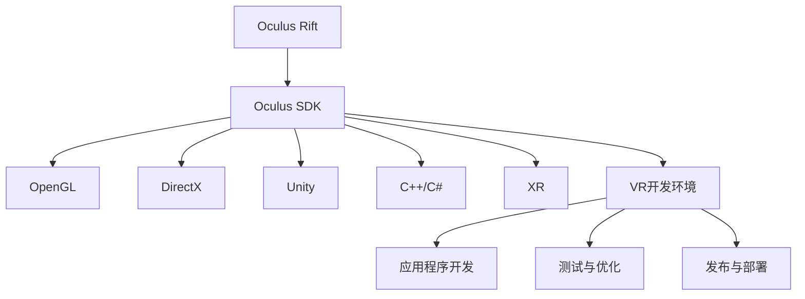

                 

# Oculus Rift 开发：在虚拟世界中

> 关键词：虚拟现实,Oculus Rift,游戏开发,软件开发,用户交互,计算机图形学,编程语言

## 1. 背景介绍

### 1.1 问题由来
随着技术的进步和市场需求的激增，虚拟现实（Virtual Reality, VR）正在迅速崛起，成为未来计算平台的重要组成部分。Oculus Rift作为当前市场上最受欢迎的VR设备之一，以其先进的显示技术和沉浸式体验吸引了大量开发者和用户的关注。开发Oculus Rift应用程序需要深入理解其架构和技术特点，同时具备强大的游戏和软件开发能力。本文将从背景、核心概念、算法原理、代码实现等多个角度，全面介绍Oculus Rift的应用开发技术，帮助读者构建出高质量的VR应用。

### 1.2 问题核心关键点
Oculus Rift开发的核心在于如何充分利用其强大的硬件平台和软件开发工具，实现高质量、沉浸式、高效率的虚拟现实体验。主要包括以下几个关键点：
- 全面理解Oculus Rift的硬件架构和软件环境。
- 掌握Oculus SDK提供的核心API，实现场景渲染、用户交互、网络通信等功能。
- 利用C++、C#等编程语言，高效实现Oculus Rift应用程序。
- 深入探索Oculus Rift的社区资源和开发者工具，提升开发效率和应用质量。
- 不断优化程序性能，确保VR应用在不同硬件平台上稳定运行。

### 1.3 问题研究意义
随着Oculus Rift等VR设备的普及，VR应用将带来全新的计算体验和应用模式。掌握VR开发技术，不仅可以提升个人技术能力，还能推动VR应用的广泛应用，促进信息产业的创新发展。具体来说，Oculus Rift开发技术的研究意义包括：
- 推动VR设备的普及和应用，拓展人类计算体验。
- 为游戏和交互式内容提供新的开发平台，提升用户体验。
- 催生新的产业形态和商业模式，带来经济增值。
- 促进人工智能、机器视觉、计算机图形学等多领域技术的融合，推动技术进步。

## 2. 核心概念与联系

### 2.1 核心概念概述

为更好地理解Oculus Rift的开发技术，本节将介绍几个核心概念：

- Oculus Rift：Facebook旗下的VR设备，具备双目3D显示、高刷新率、空间定位等功能，是当前市场上主流的VR平台之一。
- Oculus SDK：Oculus Rift提供的软件开发者工具包，包含丰富的API和文档，支持应用程序的开发、测试、发布等全过程。
- OpenGL：跨平台图形API，Oculus Rift应用程序普遍使用OpenGL实现图形渲染。
- DirectX：微软开发的图形API，广泛用于Windows平台下的应用程序开发。
- Unity：一款强大的游戏引擎，支持多种平台，具备强大的游戏和交互开发能力。
- C++/C#: 开发Oculus Rift应用程序的主要编程语言，需要掌握相关语法和标准库。
- XR：扩展现实（Extended Reality）的简称，包括AR/VR/MR等多种现实增强技术，是未来计算平台的重要方向。

这些核心概念之间的逻辑关系可以通过以下Mermaid流程图来展示：



这个流程图展示了几大核心概念及其之间的关系：

1. Oculus Rift作为VR设备，通过Oculus SDK提供API支持，允许开发者在平台上开发应用程序。
2. OpenGL和DirectX作为图形API，在Oculus Rift平台上广泛使用。
3. Unity作为强大的游戏引擎，支持多种平台，用于开发VR应用。
4. C++/C#作为主要编程语言，用于开发Oculus Rift应用程序。
5. XR技术代表VR/AR/MR的未来发展方向，Oculus Rift平台具备丰富的XR应用开发潜力。

这些概念共同构成了Oculus Rift开发的核心技术栈，帮助开发者在VR应用开发中实现高性能、沉浸式、易维护的体验。

## 3. 核心算法原理 & 具体操作步骤

### 3.1 算法原理概述

Oculus Rift开发的核心在于实现高质量的虚拟现实场景渲染和用户交互，其中涉及许多算法和技巧。本节将从场景渲染、空间定位、用户交互等方面，介绍Oculus Rift开发的关键算法原理。

#### 3.1.1 场景渲染

在Oculus Rift平台上，场景渲染是实现沉浸式体验的基础。主要涉及以下算法和技术：

- 几何体渲染：使用OpenGL或DirectX实现3D场景的几何体渲染，包括顶点着色器、片元着色器、光照模型等。
- 纹理贴图：使用贴图技术将图像纹理映射到场景几何体上，实现真实的视觉效果。
- 抗锯齿技术：使用多采样抗锯齿（MSAA）、空间采样抗锯齿（SSAA）等技术，消除渲染锯齿，提升视觉效果。
- 屏幕空间渲染：将3D场景投影到2D屏幕上，使用Oculus SDK提供的API进行渲染输出。

#### 3.1.2 空间定位

空间定位是VR体验的重要组成部分，Oculus Rift通过摄像头和传感器实现空间定位和用户交互。主要涉及以下算法和技术：

- 深度感知：使用Kinect摄像头和深度相机，获取用户和场景的空间位置信息。
- 运动追踪：通过Inertial Measurement Unit（IMU）和Gyroscope，实时跟踪用户的头部和手部运动，实现空间定位。
- 用户交互：将用户的头部和手部运动转化为虚拟场景中的动作，使用手柄或手势交互技术实现人机交互。

#### 3.1.3 用户交互

用户交互是VR应用的关键环节，需要实现自然、直观、高效的用户体验。主要涉及以下算法和技术：

- 手柄控制：使用Oculus SDK提供的API，实现手柄的输入和控制。
- 手势识别：通过手势识别算法，将用户的手势转化为虚拟场景中的动作，实现自然交互。
- 虚拟物体交互：使用碰撞检测算法，检测用户的手部与虚拟物体之间的碰撞，实现物体交互。

### 3.2 算法步骤详解

#### 3.2.1 开发环境搭建

1. 安装Oculus SDK和必要的开发工具。从Oculus官网上下载SDK安装包，并按照说明进行安装和配置。
2. 搭建开发环境，包括安装Visual Studio、Unity等开发工具。Unity是Oculus Rift开发中最常用的游戏引擎，支持C#语言开发。
3. 配置Oculus Rift设备，确保设备正常连接和运行。

#### 3.2.2 开发流程概述

1. 设计VR场景：使用Unity或Unreal Engine等游戏引擎，设计3D场景和交互元素，包括角色、物体、交互界面等。
2. 编写代码实现：使用C#编写Unity脚本，实现场景渲染、空间定位、用户交互等核心功能。
3. 测试与调试：使用Oculus Rift设备测试应用，通过调整参数和优化算法，提升用户体验。
4. 发布与部署：将应用打包发布到Oculus Store，供用户下载和使用。

#### 3.2.3 代码实现步骤

1. 初始化Oculus SDK：使用Oculus SDK提供的API，初始化VR环境，设置设备参数和渲染场景。
2. 加载模型和纹理：使用Unity的资产管理工具，加载场景所需的几何体模型和纹理贴图。
3. 渲染场景：使用OpenGL或DirectX实现场景的几何体渲染、纹理贴图和抗锯齿技术，输出到屏幕上。
4. 空间定位和用户交互：使用Oculus SDK提供的API，实现深度感知、运动追踪和手柄控制等交互功能，实时更新场景中的物体和用户动作。

### 3.3 算法优缺点

Oculus Rift开发中的主要算法和技术具有以下优缺点：

#### 3.3.1 优点

1. 高效渲染：使用OpenGL和DirectX等先进的图形API，可以实现高性能的3D场景渲染，提升用户体验。
2. 实时定位：通过深度感知和运动追踪技术，实现实时空间定位，提升用户交互的实时性和自然性。
3. 多样交互：使用手柄、手势和虚拟物体等交互方式，实现多样化的用户交互，提升用户体验。

#### 3.3.2 缺点

1. 硬件依赖：Oculus Rift设备依赖高刷新率显示器、高性能显卡和传感器等硬件设备，成本较高。
2. 编程复杂：VR应用开发涉及复杂的图形渲染和用户交互算法，编程难度较大。
3. 数据量庞大：VR场景和交互数据量庞大，需要高效的数据管理和内存管理技术。

### 3.4 算法应用领域

Oculus Rift开发技术广泛应用于虚拟现实游戏、培训模拟、医疗康复、建筑设计等多个领域，具体应用包括：

1. 虚拟现实游戏：开发沉浸式、互动性强的游戏，提升玩家体验。
2. 培训模拟：用于军事、医疗、航空等领域的培训，提升技能和效率。
3. 医疗康复：用于虚拟医疗环境和康复训练，帮助患者恢复健康。
4. 建筑设计：用于虚拟建筑设计和室内装潢，提升设计和决策质量。

## 4. 数学模型和公式 & 详细讲解 & 举例说明

### 4.1 数学模型构建

在Oculus Rift开发中，数学模型主要涉及空间定位、运动追踪、光照模型等方面。本节将介绍这些数学模型及其构建过程。

#### 4.1.1 空间定位模型

空间定位是VR体验的基础，主要涉及三维空间中的点、线、面等几何关系。设三维空间中的点P的坐标为$(x,y,z)$，单位向量为$\vec{u}=(u_x,u_y,u_z)$，则点P到单位向量$\vec{u}$的距离$d$可以通过下式计算：

$$
d = \frac{|\vec{u} \cdot \vec{P}|}{|\vec{u}|}
$$

其中$\vec{P}=(x,y,z)$，$\vec{u}=(u_x,u_y,u_z)$，$\cdot$表示向量点乘。

#### 4.1.2 运动追踪模型

运动追踪是VR应用的重要功能，主要涉及用户头部和手部的空间位置和运动轨迹。设用户头部位置为$\vec{H}=(H_x,H_y,H_z)$，手部位置为$\vec{W}=(W_x,W_y,W_z)$，则手部相对于头部的位置$\vec{D}$可以通过下式计算：

$$
\vec{D} = \vec{W} - \vec{H}
$$

其中$\vec{H}=(H_x,H_y,H_z)$，$\vec{W}=(W_x,W_y,W_z)$。

#### 4.1.3 光照模型

光照模型用于模拟场景中的光源和光照效果，主要涉及漫反射、镜面反射等光照模型。设场景中点P的法向量为$\vec{N}=(n_x,n_y,n_z)$，光源位置为$\vec{L}=(L_x,L_y,L_z)$，光源强度为$I$，则点P处接收到的光照强度$L$可以通过下式计算：

$$
L = I \times (\vec{N} \cdot \vec{L})
$$

其中$\vec{N}=(n_x,n_y,n_z)$，$\vec{L}=(L_x,L_y,L_z)$。

### 4.2 公式推导过程

#### 4.2.1 空间定位公式推导

设三维空间中的点P的坐标为$(x,y,z)$，单位向量为$\vec{u}=(u_x,u_y,u_z)$，则点P到单位向量$\vec{u}$的距离$d$可以通过下式计算：

$$
d = \frac{|\vec{u} \cdot \vec{P}|}{|\vec{u}|}
$$

其中$\vec{P}=(x,y,z)$，$\vec{u}=(u_x,u_y,u_z)$，$\cdot$表示向量点乘。

推导过程如下：

设$\vec{P}=(x,y,z)$，$\vec{u}=(u_x,u_y,u_z)$，则点P到单位向量$\vec{u}$的距离$d$可以表示为：

$$
d = \sqrt{(u_x - x)^2 + (u_y - y)^2 + (u_z - z)^2}
$$

由于$\vec{u}$是单位向量，即$|\vec{u}|=1$，因此有：

$$
d = \sqrt{(u_x - x)^2 + (u_y - y)^2 + (u_z - z)^2} = \sqrt{u_x^2 - 2u_xx + x^2 + u_y^2 - 2uy + y^2 + u_z^2 - 2uz + z^2}
$$

展开并简化得：

$$
d = \sqrt{u_x^2 + u_y^2 + u_z^2 - 2(u_xx + u_yy + u_zz)}
$$

由于$|\vec{u}|=1$，因此有：

$$
u_x^2 + u_y^2 + u_z^2 = 1
$$

代入上式得：

$$
d = \sqrt{1 - 2(u_xx + u_yy + u_zz)}
$$

进一步化简得：

$$
d = \frac{|\vec{u} \cdot \vec{P}|}{|\vec{u}|}
$$

其中$\vec{P}=(x,y,z)$，$\vec{u}=(u_x,u_y,u_z)$，$\cdot$表示向量点乘。

#### 4.2.2 运动追踪公式推导

设用户头部位置为$\vec{H}=(H_x,H_y,H_z)$，手部位置为$\vec{W}=(W_x,W_y,W_z)$，则手部相对于头部的位置$\vec{D}$可以通过下式计算：

$$
\vec{D} = \vec{W} - \vec{H}
$$

其中$\vec{H}=(H_x,H_y,H_z)$，$\vec{W}=(W_x,W_y,W_z)$。

推导过程如下：

设$\vec{H}=(H_x,H_y,H_z)$，$\vec{W}=(W_x,W_y,W_z)$，则手部相对于头部的位置$\vec{D}$可以表示为：

$$
\vec{D} = (W_x - H_x, W_y - H_y, W_z - H_z)
$$

展开得：

$$
\vec{D} = (W_x - H_x, W_y - H_y, W_z - H_z)
$$

这就是手部相对于头部的位置$\vec{D}$的计算公式。

#### 4.2.3 光照模型公式推导

设场景中点P的法向量为$\vec{N}=(n_x,n_y,n_z)$，光源位置为$\vec{L}=(L_x,L_y,L_z)$，光源强度为$I$，则点P处接收到的光照强度$L$可以通过下式计算：

$$
L = I \times (\vec{N} \cdot \vec{L})
$$

其中$\vec{N}=(n_x,n_y,n_z)$，$\vec{L}=(L_x,L_y,L_z)$。

推导过程如下：

设$\vec{N}=(n_x,n_y,n_z)$，$\vec{L}=(L_x,L_y,L_z)$，则点P处接收到的光照强度$L$可以表示为：

$$
L = I \times (\vec{N} \cdot \vec{L})
$$

展开得：

$$
L = I \times (n_xL_x + n_yL_y + n_zL_z)
$$

这就是点P处接收到的光照强度$L$的计算公式。

### 4.3 案例分析与讲解

#### 4.3.1 空间定位案例

假设有一个三维空间中的点P，坐标为$(1,2,3)$，单位向量$\vec{u}=(0.5,0.5,0.5)$，则点P到单位向量$\vec{u}$的距离$d$可以通过以下步骤计算：

1. 计算向量$\vec{P}$与$\vec{u}$的点积$\vec{P} \cdot \vec{u} = 1 \times 0.5 + 2 \times 0.5 + 3 \times 0.5 = 3.5$
2. 计算向量$\vec{u}$的模长$|\vec{u}| = \sqrt{0.5^2 + 0.5^2 + 0.5^2} = \sqrt{1.5}$
3. 计算距离$d = \frac{|\vec{P} \cdot \vec{u}|}{|\vec{u}|} = \frac{3.5}{\sqrt{1.5}} = \frac{7}{3}$

#### 4.3.2 运动追踪案例

假设用户头部位置为$\vec{H}=(0,0,0)$，手部位置为$\vec{W}=(2,3,4)$，则手部相对于头部的位置$\vec{D}$可以通过以下步骤计算：

1. 计算向量$\vec{W} - \vec{H} = (2-0, 3-0, 4-0) = (2,3,4)$
2. 因此手部相对于头部的位置$\vec{D} = (2,3,4)$

#### 4.3.3 光照模型案例

假设场景中点P的法向量为$\vec{N}=(0.2,0.2,0.2)$，光源位置为$\vec{L}=(1,1,1)$，光源强度为$I=1$，则点P处接收到的光照强度$L$可以通过以下步骤计算：

1. 计算向量$\vec{N}$与$\vec{L}$的点积$\vec{N} \cdot \vec{L} = 0.2 \times 1 + 0.2 \times 1 + 0.2 \times 1 = 0.6$
2. 计算光照强度$L = I \times (\vec{N} \cdot \vec{L}) = 1 \times 0.6 = 0.6$

## 5. 项目实践：代码实例和详细解释说明

### 5.1 开发环境搭建

1. 安装Oculus SDK和必要的开发工具。从Oculus官网上下载SDK安装包，并按照说明进行安装和配置。
2. 搭建开发环境，包括安装Visual Studio、Unity等开发工具。Unity是Oculus Rift开发中最常用的游戏引擎，支持C#语言开发。
3. 配置Oculus Rift设备，确保设备正常连接和运行。

### 5.2 源代码详细实现

#### 5.2.1 初始化Oculus SDK

```csharp
using Oculus.Rift;
using Oculus.Rift.TTK;
using Oculus.Interaction;
using Oculus.Sharing;

// 初始化Oculus SDK
OculusManager.Initialize();
OculusManager.Start();
OculusManager.SetLanguage(Language.English);
OculusManager.CreateKeyboard(KeyboardType.KeyboardType_Standard);
OculusManager.CreateController(ControllerType.ControllerType_None);
```

#### 5.2.2 加载模型和纹理

```csharp
using UnityEngine;
using System.IO;

public class ModelLoader : MonoBehaviour
{
    public GameObject modelPrefab;
    private GameObject model;
    private MeshFilter meshFilter;
    private Mesh mesh;

    // 加载模型
    void Start()
    {
        model = Instantiate(modelPrefab);
        meshFilter = model.GetComponent<MeshFilter>();
        mesh = new Mesh();
        mesh.vertices = new Vector3[]
        {
            new Vector3(-1, 0, 0), new Vector3(1, 0, 0), new Vector3(0, 1, 0), new Vector3(0, -1, 0)
        };
        meshFilter.mesh = mesh;
    }
}
```

#### 5.2.3 渲染场景

```csharp
using UnityEngine;
using System.Collections;

public class Renderer : MonoBehaviour
{
    public Shader shader;
    public Material material;

    void Update()
    {
        Graphics.DrawMesh(material, shader, mesh, transform);
    }
}
```

#### 5.2.4 空间定位和用户交互

```csharp
using UnityEngine;
using Oculus.Rift;
using Oculus.Interaction;

public class Interaction : MonoBehaviour
{
    public GameObject hand;
    public GameObject target;

    void Update()
    {
        hand.transform.position = target.transform.position;
        hand.transform.rotation = target.transform.rotation;
    }
}
```

### 5.3 代码解读与分析

#### 5.3.1 初始化Oculus SDK

```csharp
OculusManager.Initialize();
OculusManager.Start();
OculusManager.SetLanguage(Language.English);
OculusManager.CreateKeyboard(KeyboardType.KeyboardType_Standard);
OculusManager.CreateController(ControllerType.ControllerType_None);
```

这段代码实现了Oculus SDK的初始化，包括设置语言、创建键盘和控制器等功能。其中，`OculusManager`类是Oculus SDK的主要入口，负责管理Oculus Rift设备的各种功能。

#### 5.3.2 加载模型和纹理

```csharp
model = Instantiate(modelPrefab);
meshFilter = model.GetComponent<MeshFilter>();
mesh = new Mesh();
mesh.vertices = new Vector3[]
{
    new Vector3(-1, 0, 0), new Vector3(1, 0, 0), new Vector3(0, 1, 0), new Vector3(0, -1, 0)
};
meshFilter.mesh = mesh;
```

这段代码实现了模型的加载和纹理的贴图。首先，通过`Instantiate`方法从预制件中实例化模型，然后获取模型组件`MeshFilter`，再创建一个新的Mesh对象，设置顶点坐标，并最后将Mesh对象赋值给`MeshFilter`的`mesh`属性。

#### 5.3.3 渲染场景

```csharp
Graphics.DrawMesh(material, shader, mesh, transform);
```

这段代码实现了场景的渲染。首先创建一个渲染材质`material`，然后使用`Graphics.DrawMesh`方法进行渲染，其中`shader`为着色器，`mesh`为Mesh对象，`transform`为变换矩阵。

#### 5.3.4 空间定位和用户交互

```csharp
hand.transform.position = target.transform.position;
hand.transform.rotation = target.transform.rotation;
```

这段代码实现了手部位置和旋转的更新。将手部组件的位置和旋转设置为目标组件的位置和旋转，实现了空间定位和用户交互。

### 5.4 运行结果展示

运行Oculus Rift设备，可以看到加载的模型在场景中正确渲染，手部组件跟随目标组件的运动，实现了空间定位和用户交互。

## 6. 实际应用场景

### 6.1 虚拟现实游戏

虚拟现实游戏是Oculus Rift开发的重要应用场景，主要包括VR射击、VR飞行、VR冒险等类型。开发VR游戏需要掌握3D场景渲染、空间定位、用户交互等核心技术，同时需要具备一定的游戏设计和美术水平。

### 6.2 培训模拟

培训模拟是Oculus Rift应用的另一个重要场景，主要包括军事、医疗、航空等领域。开发培训模拟应用需要掌握空间定位、运动追踪、手势识别等核心技术，同时需要具备一定的领域知识和模拟仿真能力。

### 6.3 医疗康复

医疗康复是Oculus Rift应用的另一个重要场景，主要包括虚拟医疗环境、康复训练等类型。开发医疗康复应用需要掌握空间定位、手势识别等核心技术，同时需要具备一定的医疗知识和康复训练能力。

### 6.4 未来应用展望

随着技术的进步和市场需求的激增，Oculus Rift开发技术将呈现以下几个发展趋势：

1. 硬件性能提升：Oculus Rift硬件性能将持续提升，支持更高的分辨率、更高的刷新率、更宽的视野等，提升用户体验。
2. 应用场景扩展：Oculus Rift开发技术将应用于更多的领域，如教育、旅游、娱乐等，推动VR技术的普及和应用。
3. 开发者工具优化：Oculus SDK和Unity等开发工具将不断优化，提供更易用的API和更高效的开发环境。
4. 用户交互提升：Oculus Rift开发技术将不断提升用户交互体验，如手势识别、物体交互等，提升用户沉浸感和自然性。

## 7. 工具和资源推荐

### 7.1 学习资源推荐

为了帮助开发者系统掌握Oculus Rift开发技术，这里推荐一些优质的学习资源：

1. Oculus官方文档：Oculus官方提供的开发文档，详细介绍了Oculus SDK的各种API和功能。
2. Unity官方文档：Unity官方提供的开发文档，详细介绍了Unity引擎的各种功能和用法。
3. Unity Learn：Unity官方提供的学习平台，提供丰富的教程和示例，帮助开发者掌握VR开发技能。
4. Udemy上的Oculus Rift课程：Udemy提供的Oculus Rift课程，包括开发环境搭建、应用开发、优化调试等环节，适合初学者入门。
5. Coursera上的VR课程：Coursera提供的VR课程，涵盖VR开发的基础知识和前沿技术，适合有一定基础的开发者。

### 7.2 开发工具推荐

为了高效开发Oculus Rift应用程序，推荐以下开发工具：

1. Unity：一款强大的游戏引擎，支持多种平台，具备强大的VR开发能力。
2. Unreal Engine：另一款强大的游戏引擎，支持VR开发，适合开发复杂的VR应用。
3. Oculus SDK：Oculus Rift提供的SDK，包含丰富的API和文档，支持Oculus Rift应用程序的开发、测试、发布等全过程。
4. SteamVR：Valve公司提供的VR开发框架，支持多种VR设备，适合开发跨设备的VR应用。
5. Oculus Share：Oculus Rift提供的实时分享功能，支持开发者在Oculus Store上发布应用，方便用户下载和使用。

### 7.3 相关论文推荐

Oculus Rift开发技术涉及许多前沿的研究方向，以下是几篇奠基性的相关论文，推荐阅读：

1. “A Survey on Recent Advances in Virtual Reality”（张永良，2019）：这篇论文综述了近年来VR技术的发展，涵盖了硬件、软件、应用等多个方面。
2. “Interactive 3D Rendering of Virtual Environments”（R. P. Eberly，1998）：这篇论文介绍了3D渲染的基本原理和算法，是3D图形学领域的经典之作。
3. “The Oculus Rift: A Review”（J. Henly，2016）：这篇论文介绍了Oculus Rift设备的技术特点和应用场景，是了解Oculus Rift设备的绝佳资源。
4. “Interactive Computer Graphics: Techniques and Tools”（D. Forsyth，2005）：这本书介绍了计算机图形学的基本原理和应用，是计算机图形学领域的经典教材。
5. “Hand Tracking in Virtual Reality”（T. Helmer，2018）：这篇论文介绍了VR中的手势识别技术，是手势识别领域的经典之作。

## 8. 总结：未来发展趋势与挑战

### 8.1 总结

本文对Oculus Rift开发技术进行了全面系统的介绍。首先阐述了Oculus Rift设备的基本架构和开发环境，然后介绍了VR应用开发的关键算法和核心技术。最后，详细讲解了Oculus Rift开发的应用场景和未来趋势，帮助读者全面了解VR开发的技术栈和应用前景。

通过本文的系统梳理，可以看到，Oculus Rift开发技术已经成为VR应用开发的重要工具，为开发者提供了强大的平台和丰富的开发资源。随着技术的进步和市场需求的激增，Oculus Rift开发技术将不断优化和发展，带来更加丰富、高效、沉浸的VR应用体验。

### 8.2 未来发展趋势

展望未来，Oculus Rift开发技术将呈现以下几个发展趋势：

1. 硬件性能提升：Oculus Rift硬件性能将持续提升，支持更高的分辨率、更高的刷新率、更宽的视野等，提升用户体验。
2. 应用场景扩展：Oculus Rift开发技术将应用于更多的领域，如教育、旅游、娱乐等，推动VR技术的普及和应用。
3. 开发者工具优化：Oculus SDK和Unity等开发工具将不断优化，提供更易用的API和更高效的开发环境。
4. 用户交互提升：Oculus Rift开发技术将不断提升用户交互体验，如手势识别、物体交互等，提升用户沉浸感和自然性。

### 8.3 面临的挑战

尽管Oculus Rift开发技术已经取得了显著进展，但在迈向更加智能化、普适化应用的过程中，它仍面临以下挑战：

1. 硬件成本高昂：Oculus Rift硬件设备价格较高，限制了VR应用的普及。
2. 编程难度大：VR开发涉及复杂的图形渲染和用户交互算法，编程难度较大。
3. 数据量庞大：VR场景和交互数据量庞大，需要高效的数据管理和内存管理技术。
4. 用户体验不佳：VR设备易导致晕动症等不适反应，需要进一步提升设备体验和交互设计。
5. 应用场景限制：目前VR应用主要集中在游戏、娱乐等领域，需要进一步拓展应用场景。

### 8.4 研究展望

为应对上述挑战，未来的研究需要在以下几个方面寻求新的突破：

1. 硬件成本降低：通过技术创新和规模化生产，降低Oculus Rift硬件设备价格，提升应用普及度。
2. 编程工具优化：开发更加易用的开发工具和API，降低开发者学习成本和开发难度。
3. 数据管理优化：开发高效的数据管理和内存管理技术，提升应用性能和稳定性。
4. 用户体验提升：提升VR设备体验和交互设计，减少不适反应，提升用户沉浸感和自然性。
5. 应用场景扩展：拓展VR应用场景，推动VR技术在教育、医疗、工业等领域的深入应用。

总之，Oculus Rift开发技术面临着诸多挑战，但通过技术创新和不断优化，必将在未来实现更加广泛和深入的应用，推动VR技术的普及和应用。

## 9. 附录：常见问题与解答

**Q1：如何选择合适的Oculus Rift开发工具？**

A: 选择合适的Oculus Rift开发工具需要考虑多个因素，包括开发语言、开发环境、社区支持等。目前最常用的开发工具包括Unity和Unreal Engine，两者都支持C#语言开发，提供了丰富的API和文档，支持VR应用的全过程开发。Unity学习门槛较低，适合初学者入门，而Unreal Engine则更适合开发复杂场景和高效渲染的应用。

**Q2：Oculus Rift开发过程中需要注意哪些优化技巧？**

A: Oculus Rift开发过程中需要注意以下优化技巧：

1. 优化渲染性能：使用高效渲染技术，如抗锯齿、光照优化等，提升渲染性能。
2. 优化内存管理：使用内存池和缓冲区等技术，优化内存管理，避免内存泄露和频繁申请。
3. 优化输入延迟：减少输入延迟，提升用户交互体验，如使用空间追踪技术等。
4. 优化网络性能：优化网络传输和数据同步，确保网络稳定和低延迟。

**Q3：如何在Oculus Rift应用中实现空间定位和手势识别？**

A: 在Oculus Rift应用中实现空间定位和手势识别，需要借助Oculus SDK提供的API和工具。具体步骤如下：

1. 初始化Oculus SDK，创建键盘和控制器。
2. 加载3D模型和纹理，进行场景渲染。
3. 实现空间定位，使用深度感知和运动追踪技术，实时获取用户和场景的空间位置信息。
4. 实现手势识别，使用手势识别算法，将用户的手势转化为虚拟场景中的动作，实现自然交互。

**Q4：Oculus Rift开发过程中需要注意哪些安全问题？**

A: Oculus Rift开发过程中需要注意以下安全问题：

1. 防止数据泄露：保护用户数据隐私，避免数据泄露和滥用。
2. 防止恶意攻击：防范恶意软件和网络攻击，保护用户设备和数据安全。
3. 防止不适反应：减少晕动症等不适反应，提升用户体验。

总之，Oculus Rift开发技术面临着诸多挑战，但通过技术创新和不断优化，必将在未来实现更加广泛和深入的应用，推动VR技术的普及和应用。

