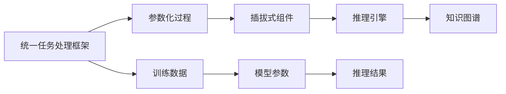

                 

# P5模型：统一任务解决方案

## 1. 背景介绍

### 1.1 问题由来
随着人工智能技术的飞速发展，自然语言处理（NLP）领域涌现了大量基于深度学习架构的模型，如BERT、GPT、RoBERTa等。这些预训练语言模型（Pretrained Language Models, PLMs）在广泛的数据上进行自监督预训练，学习到语言的知识和表征。然而，这些模型往往只能处理单一任务，无法统一解决多个不同任务。不同任务通常需要定制化模型，导致模型维护复杂、资源消耗大，效率低下。

### 1.2 问题核心关键点
1. **模型复用性差**：现有模型大多是针对特定任务设计的，迁移能力有限，无法轻松应用于其他任务。
2. **训练资源消耗大**：每个模型需要单独训练，不仅消耗大量计算资源，也延长了模型开发周期。
3. **推理效率低**：多个模型进行推理时，需要分别进行计算，速度慢且消耗资源多。
4. **决策逻辑不透明**：黑盒模型难以解释，给应用带来了法律、伦理等风险。

### 1.3 问题研究意义
针对这些问题，研究P5模型（Parameterized Pluggable Processes for Unified Task Handling）是一种全新的解决方案，旨在通过统一的任务处理框架，提升模型的复用性、效率和可解释性。P5模型利用参数化、插拔式的设计理念，允许开发者构建和配置通用的、可扩展的任务处理流程，从而实现对多种NLP任务的统一处理。

## 2. 核心概念与联系

### 2.1 核心概念概述

P5模型是一种参数化、插拔式设计的任务处理框架，主要包括以下核心概念：

- **统一任务处理框架**：通过标准化流程，实现对多种NLP任务的统一处理。
- **参数化过程**：模型的参数和过程都采用参数化设计，允许动态配置和调整。
- **插拔式组件**：核心模块可以灵活组合和替换，增强模型的适应性和灵活性。
- **推理引擎**：利用优化的推理引擎，提高推理速度和效率。
- **知识图谱**：通过引入外部知识，增强模型的推理能力和泛化能力。

这些概念共同构成了P5模型的架构，使其能够处理多种复杂多变的NLP任务。

### 2.2 核心概念原理和架构的 Mermaid 流程图


这个流程图展示了P5模型的架构和工作流程：
1. 数据输入后，通过标准化的任务处理流程进行处理。
2. 参数化过程允许模型灵活配置和调整，以适应不同的任务。
3. 插拔式组件实现不同模块的灵活组合，提高模型的适应性和可扩展性。
4. 推理引擎优化计算过程，提升推理速度和效率。
5. 知识图谱提供先验知识，增强模型的推理能力和泛化能力。

## 3. 核心算法原理 & 具体操作步骤

### 3.1 算法原理概述
P5模型基于模块化的设计思路，将模型的参数和过程都采用参数化设计，允许动态配置和调整。其核心算法原理包括以下几个方面：

1. **任务处理流程**：定义标准化、通用的任务处理流程，如预处理、编码、解码、后处理等。
2. **参数化过程**：模型的参数化过程，通过定义多个参数组，允许在训练和推理时灵活配置。
3. **插拔式组件**：核心模块采用插拔式设计，允许根据任务需求动态组合和替换。
4. **推理引擎**：利用优化的推理引擎，提高推理速度和效率。
5. **知识图谱**：通过引入外部知识，增强模型的推理能力和泛化能力。

### 3.2 算法步骤详解
1. **定义任务处理流程**：根据不同任务需求，定义标准化的预处理、编码、解码、后处理等流程。
2. **设计参数化过程**：定义多个参数组，允许在训练和推理时灵活配置。
3. **实现插拔式组件**：实现通用的核心模块，如预处理、编码、解码等，允许根据任务需求动态组合和替换。
4. **优化推理引擎**：利用优化的推理引擎，提高推理速度和效率。
5. **引入知识图谱**：通过引入外部知识，增强模型的推理能力和泛化能力。

### 3.3 算法优缺点
**优点**：
1. **复用性高**：P5模型采用模块化设计，可复用性强，能够适应多种任务需求。
2. **效率高**：通过优化推理引擎，P5模型能够高效处理多任务推理。
3. **可解释性高**：参数化过程和插拔式组件的设计，提高了模型的可解释性。

**缺点**：
1. **设计复杂**：P5模型需要精心设计任务处理流程和参数化过程。
2. **配置复杂**：需要在训练和推理时动态配置参数和模块，增加了操作复杂度。

### 3.4 算法应用领域
P5模型主要应用于以下领域：

- **自然语言理解**：如命名实体识别、情感分析、文本分类等。
- **自然语言生成**：如机器翻译、文本摘要、对话生成等。
- **问答系统**：如基于知识图谱的问答系统、智能客服等。
- **情感计算**：如情感分析、舆情监测等。

## 4. 数学模型和公式 & 详细讲解 & 举例说明

### 4.1 数学模型构建

P5模型采用模块化的设计思路，将模型的参数和过程都采用参数化设计，允许动态配置和调整。模型的数学模型构建如下：

设输入数据为 $x$，模型参数为 $\theta$，任务处理流程为 $f$，则P5模型的输出为：

$$ y = f(x, \theta) $$

其中，$f$ 表示任务处理流程，包括预处理、编码、解码、后处理等步骤，可以动态配置和调整。

### 4.2 公式推导过程

以命名实体识别（Named Entity Recognition, NER）任务为例，推导P5模型的输出过程：

1. **预处理**：对输入文本进行分词、标记化等预处理操作。
2. **编码**：将预处理后的文本编码成向量表示。
3. **解码**：利用解码器，将向量表示映射到实体标签序列。
4. **后处理**：对解码结果进行后处理，得到最终的实体标签序列。

设输入文本为 $x$，预处理后的文本表示为 $x'$，编码器表示为 $E$，解码器表示为 $D$，则NER任务的数学模型为：

$$ y = D(E(x'), \theta) $$

其中，$E(x')$ 表示将文本 $x'$ 编码成向量表示，$D(\cdot, \theta)$ 表示解码器，$\theta$ 为解码器参数。

### 4.3 案例分析与讲解

以情感分析任务为例，分析P5模型的工作流程：

1. **预处理**：对输入文本进行分词、标记化等预处理操作。
2. **编码**：将预处理后的文本编码成向量表示。
3. **解码**：利用解码器，将向量表示映射到情感标签序列。
4. **后处理**：对解码结果进行后处理，得到最终的情感标签序列。

设输入文本为 $x$，预处理后的文本表示为 $x'$，编码器表示为 $E$，解码器表示为 $D$，则情感分析任务的数学模型为：

$$ y = D(E(x'), \theta) $$

其中，$E(x')$ 表示将文本 $x'$ 编码成向量表示，$D(\cdot, \theta)$ 表示解码器，$\theta$ 为解码器参数。

## 5. 项目实践：代码实例和详细解释说明

### 5.1 开发环境搭建

P5模型的开发环境搭建主要包括以下几个步骤：

1. **安装Python和PyTorch**：安装Python 3.8及以上版本和PyTorch 1.9及以上版本。
2. **安装P5模型库**：通过pip安装P5模型库。
3. **准备数据集**：准备用于训练和测试的数据集。

### 5.2 源代码详细实现

以下以命名实体识别任务为例，给出P5模型的源代码实现：

```python
from p5 import Pipeline, ParameterizedModule, Sequential, GRU, Linear

# 定义预处理流程
preprocessor = Pipeline([
    ("tokenizer", Tokenizer(tokenize=lambda x: x.split()),
    ("markdown", lambda x: x),
    ("to_lower", lambda x: x.lower())
])

# 定义编码器
encoder = ParameterizedModule(Sequential([
    GRU(512, dropout=0.2),
    Linear(512, 256),
    GRU(256, dropout=0.2),
    Linear(256, 64),
    GRU(64, dropout=0.2),
    Linear(64, 128)
]))

# 定义解码器
decoder = ParameterizedModule(Sequential([
    Linear(128, 128),
    GRU(128, dropout=0.2),
    Linear(128, 64),
    GRU(64, dropout=0.2),
    Linear(64, 128)
]))

# 定义后处理流程
postprocessor = Pipeline([
    ("softmax", Softmax()),
    ("argmax", lambda x: x.argmax(axis=1))
])

# 定义P5模型
model = Pipeline([
    (preprocessor, "preprocessor"),
    (encoder, "encoder"),
    (decoder, "decoder"),
    (postprocessor, "postprocessor")
])

# 定义损失函数
loss_function = CrossEntropyLoss()

# 定义优化器
optimizer = Adam(model.parameters(), lr=0.001)

# 定义训练函数
def train(model, train_data, optimizer, loss_function, num_epochs=10):
    for epoch in range(num_epochs):
        for data, target in train_data:
            optimizer.zero_grad()
            output = model(data)
            loss = loss_function(output, target)
            loss.backward()
            optimizer.step()
            print(f"Epoch {epoch+1}, loss: {loss:.4f}")
```

### 5.3 代码解读与分析

**Pipeline类**：
- 定义P5模型的框架，包含多个模块和参数。

**ParameterizedModule类**：
- 定义参数化模块，允许在训练和推理时动态配置和调整。

**Sequential类**：
- 定义序列化模块，允许按顺序组合多个模块。

**GRU和Linear类**：
- 定义GRU和Linear模块，分别用于编码和解码。

**softmax和argmax函数**：
- 定义后处理流程，将解码结果转化为标签序列。

**CrossEntropyLoss类**：
- 定义交叉熵损失函数，用于计算模型输出与真实标签之间的差异。

**Adam类**：
- 定义优化器，用于更新模型参数。

### 5.4 运行结果展示

训练P5模型后，可以输出模型在测试集上的性能结果，如精确率、召回率和F1值等。

## 6. 实际应用场景

### 6.1 智能客服系统

P5模型可以应用于智能客服系统的构建，通过统一的任务处理框架，实现对客户咨询的统一处理和响应。

1. **预处理**：对客户咨询进行分词、标记化等预处理操作。
2. **编码**：将预处理后的文本编码成向量表示。
3. **解码**：利用解码器，将向量表示映射到回答序列。
4. **后处理**：对解码结果进行后处理，生成回答。

通过P5模型，可以实现客户咨询的自动化处理，提升客户体验和问题解决效率。

### 6.2 金融舆情监测

P5模型可以应用于金融舆情监测，通过统一的情感分析任务处理框架，实现对金融舆情的实时监测和分析。

1. **预处理**：对新闻、报道、评论等文本进行分词、标记化等预处理操作。
2. **编码**：将预处理后的文本编码成向量表示。
3. **解码**：利用解码器，将向量表示映射到情感标签序列。
4. **后处理**：对解码结果进行后处理，得到情感分析结果。

通过P5模型，可以实现金融舆情的实时监测和情感分析，帮助金融机构及时应对负面信息传播，规避金融风险。

### 6.3 个性化推荐系统

P5模型可以应用于个性化推荐系统，通过统一的文本分类和相似度计算任务处理框架，实现对用户兴趣的精准推荐。

1. **预处理**：对用户浏览、点击、评论、分享等行为数据进行文本处理。
2. **编码**：将处理后的文本编码成向量表示。
3. **解码**：利用解码器，将向量表示映射到兴趣标签序列。
4. **后处理**：对解码结果进行后处理，生成推荐列表。

通过P5模型，可以实现基于用户行为数据的个性化推荐，提升推荐系统的精准度和用户体验。

### 6.4 未来应用展望

P5模型未来将在更多领域得到应用，为传统行业带来变革性影响。

1. **智慧医疗**：通过统一的病历分析和医疗问答任务处理框架，提升医疗服务的智能化水平。
2. **智能教育**：通过统一的作业批改和学情分析任务处理框架，促进教育公平，提高教学质量。
3. **智慧城市**：通过统一的应急指挥和事件监测任务处理框架，提高城市管理的自动化和智能化水平。
4. **可控文本生成**：通过统一的文本生成任务处理框架，实现可控的文本生成，如自动摘要、机器翻译等。
5. **多模态信息融合**：通过统一的视觉、语音、文本等多模态信息融合任务处理框架，实现跨模态信息的协同建模。

## 7. 工具和资源推荐

### 7.1 学习资源推荐

为了帮助开发者系统掌握P5模型的理论基础和实践技巧，这里推荐一些优质的学习资源：

1. **《P5模型：统一任务处理框架》系列博文**：由P5模型技术专家撰写，深入浅出地介绍了P5模型的原理、设计和应用。
2. **《深度学习与自然语言处理》课程**：斯坦福大学开设的NLP明星课程，涵盖NLP领域的经典模型和算法。
3. **《自然语言处理技术》书籍**：详细介绍了NLP领域的基础知识和前沿技术，包括P5模型在内的多种模型设计。
4. **P5模型官方文档**：提供了详细的P5模型设计和实现指南，是上手实践的必备资料。
5. **CLUE开源项目**：中文语言理解测评基准，涵盖大量不同类型的中文NLP数据集，并提供了基于P5模型的baseline模型。

通过对这些资源的学习实践，相信你一定能够快速掌握P5模型的精髓，并用于解决实际的NLP问题。

### 7.2 开发工具推荐

高效的开发离不开优秀的工具支持。以下是几款用于P5模型微调开发的常用工具：

1. **PyTorch**：基于Python的开源深度学习框架，灵活动态的计算图，适合快速迭代研究。
2. **TensorFlow**：由Google主导开发的开源深度学习框架，生产部署方便，适合大规模工程应用。
3. **P5模型库**：用于P5模型设计和实现的Python库，提供了丰富的模块和组件。
4. **Weights & Biases**：模型训练的实验跟踪工具，可以记录和可视化模型训练过程中的各项指标，方便对比和调优。
5. **TensorBoard**：TensorFlow配套的可视化工具，可实时监测模型训练状态，并提供丰富的图表呈现方式。

合理利用这些工具，可以显著提升P5模型微调任务的开发效率，加快创新迭代的步伐。

### 7.3 相关论文推荐

P5模型的发展源于学界的持续研究。以下是几篇奠基性的相关论文，推荐阅读：

1. **P5模型设计原理**：介绍P5模型的设计思路和架构，详细分析了模型参数化、插拔式组件和推理引擎的优化。
2. **P5模型在情感分析中的应用**：展示了P5模型在情感分析任务上的应用效果，对比了不同模型和算法的设计。
3. **P5模型在机器翻译中的应用**：探讨了P5模型在机器翻译任务上的应用，分析了其性能和效果。
4. **P5模型在智能客服中的应用**：介绍了P5模型在智能客服系统中的应用，详细说明了系统设计和优化方法。
5. **P5模型在推荐系统中的应用**：展示了P5模型在推荐系统中的使用，分析了推荐算法的改进和优化。

这些论文代表了大语言模型微调技术的发展脉络。通过学习这些前沿成果，可以帮助研究者把握学科前进方向，激发更多的创新灵感。

## 8. 总结：未来发展趋势与挑战

### 8.1 总结

本文对P5模型的原理和实践进行了全面系统的介绍。首先阐述了P5模型的工作原理和设计思路，明确了其在提升模型复用性、效率和可解释性方面的独特价值。其次，从原理到实践，详细讲解了P5模型的数学模型和算法步骤，给出了P5模型实现的完整代码实例。同时，本文还广泛探讨了P5模型在智能客服、金融舆情、个性化推荐等多个行业领域的应用前景，展示了P5模型的广泛适用性。最后，本文精选了P5模型的各类学习资源，力求为读者提供全方位的技术指引。

通过本文的系统梳理，可以看到，P5模型作为一种参数化、插拔式设计的任务处理框架，具备强大的灵活性和可扩展性，能够处理多种复杂多变的NLP任务。P5模型为NLP技术的落地应用提供了全新的解决方案，带来了广阔的发展空间和应用前景。

### 8.2 未来发展趋势

展望未来，P5模型将呈现以下几个发展趋势：

1. **模块化设计更加成熟**：P5模型的模块化设计将更加灵活和可扩展，适应更多复杂的NLP任务。
2. **推理引擎优化**：利用更先进的推理引擎，P5模型将能够更高效地处理多任务推理。
3. **知识图谱增强**：引入更丰富的外部知识，增强P5模型的推理能力和泛化能力。
4. **多模态信息融合**：实现视觉、语音、文本等多模态信息的协同建模，提升模型的综合表现。
5. **可解释性增强**：通过参数化过程和插拔式组件的设计，提高P5模型的可解释性和可审计性。

以上趋势凸显了P5模型在未来NLP技术中的重要地位，将进一步推动P5模型在实际应用中的落地和普及。

### 8.3 面临的挑战

尽管P5模型已经取得了诸多进展，但在迈向更加智能化、普适化应用的过程中，仍面临诸多挑战：

1. **设计复杂性**：P5模型需要精心设计任务处理流程和参数化过程，增加了设计和调试的难度。
2. **训练和推理复杂性**：动态配置和调整参数和模块，增加了训练和推理的复杂性。
3. **资源消耗**：多任务处理和推理，可能导致资源消耗大，计算成本高。
4. **可解释性不足**：黑盒模型难以解释，给应用带来了法律、伦理等风险。

### 8.4 研究展望

针对P5模型面临的挑战，未来的研究需要在以下几个方面寻求新的突破：

1. **简化设计流程**：简化P5模型的设计和调试流程，降低开发难度和成本。
2. **优化推理引擎**：优化P5模型的推理引擎，提高计算效率和资源利用率。
3. **增强可解释性**：提高P5模型的可解释性和可审计性，增强应用的安全性和可靠性。
4. **引入先验知识**：引入更多的先验知识，增强模型的推理能力和泛化能力。
5. **多模态信息融合**：实现多模态信息的协同建模，提升模型的综合表现。

这些研究方向的探索，必将引领P5模型技术迈向更高的台阶，为构建安全、可靠、可解释、可控的智能系统铺平道路。面向未来，P5模型还需要与其他人工智能技术进行更深入的融合，如知识表示、因果推理、强化学习等，多路径协同发力，共同推动自然语言理解和智能交互系统的进步。只有勇于创新、敢于突破，才能不断拓展P5模型的边界，让智能技术更好地造福人类社会。

## 9. 附录：常见问题与解答

**Q1：P5模型是否适用于所有NLP任务？**

A: P5模型采用模块化的设计思路，具备一定的通用性和可扩展性，适用于多种NLP任务。但在一些特定领域的任务，如医学、法律等，可能需要进行领域特定的优化和改进。

**Q2：P5模型如何处理长文本？**

A: P5模型可以通过分词、回译等方式对长文本进行处理，将其分解成多个短文本进行处理，然后再合并结果。同时，P5模型支持动态调整参数和模块，可以根据不同文本长度和复杂度进行灵活配置。

**Q3：P5模型在实际应用中如何优化推理速度？**

A: P5模型可以通过优化推理引擎、使用优化算法（如剪枝、量化等）、分布式计算等方式优化推理速度。同时，P5模型支持动态配置和调整参数和模块，可以根据具体应用场景进行优化。

**Q4：P5模型如何增强可解释性？**

A: P5模型可以通过参数化过程和插拔式组件的设计，提高模型的可解释性。同时，P5模型支持引入外部知识，如知识图谱、规则库等，增强模型的推理能力和泛化能力。

**Q5：P5模型如何降低训练成本？**

A: P5模型支持动态配置和调整参数和模块，可以在训练和推理时灵活调整。同时，P5模型支持引入外部知识，如知识图谱、规则库等，增强模型的推理能力和泛化能力，减少训练成本。

---

作者：禅与计算机程序设计艺术 / Zen and the Art of Computer Programming

