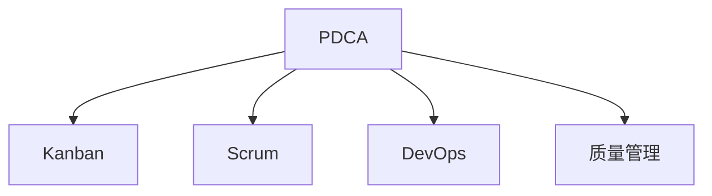

                 

# PDCA落地:持续改进的指南

> 关键词：PDCA, 持续改进, 反馈循环, 过程管理, 质量提升, 项目管理, 系统思维

## 1. 背景介绍

### 1.1 问题由来

随着技术的发展和企业竞争的加剧，企业对于产品质量和效率的要求越来越高。如何在快速变化的环境中保持持续改进，成为企业提升竞争力的关键。PDCA（Plan-Do-Check-Act）循环法作为一种经典的管理方法论，提供了持续改进的框架，广泛应用于项目管理、产品开发、生产制造等领域。然而，将PDCA应用于软件开发、产品迭代、系统优化等IT领域的实践中，仍需进行适应性调整和优化。

### 1.2 问题核心关键点

PDCA循环法本质上是一个持续改进的反馈机制，旨在通过不断计划、执行、检查、修正的循环，提升系统性能和产品质量。在IT领域，PDCA循环的每个环节都需要特别关注：

- **计划（Plan）**：明确改进目标和任务，制定详细的实施计划。
- **执行（Do）**：按计划执行任务，实施改进措施。
- **检查（Check）**：评估执行结果，识别问题和改进点。
- **修正（Act）**：基于检查结果，修正计划和执行过程，持续优化。

PDCA循环的核心在于通过反馈机制，不断提升系统的效率和效果。对于IT领域，特别是软件开发、系统运维等环节，如何结合实际需求和系统特性，进行PDCA落地实践，是值得深入探讨的问题。

### 1.3 问题研究意义

将PDCA循环法应用于IT领域的实践中，可以有效提升软件质量、优化系统性能、缩短项目周期。通过系统化、规范化的持续改进过程，确保IT项目和产品能够不断适应变化，满足用户需求，从而在激烈的市场竞争中保持优势。

- **提升软件质量**：通过PDCA循环，持续发现和解决软件缺陷，提升产品质量和用户满意度。
- **优化系统性能**：通过周期性的检查和修正，优化系统架构和流程，提升性能和稳定性。
- **缩短项目周期**：通过精简流程、消除冗余，提升项目执行效率，缩短从计划到交付的时间。
- **增强团队协作**：通过PDCA循环的透明度和规范性，增强团队成员之间的协作和沟通，提升团队的整体效能。

## 2. 核心概念与联系

### 2.1 核心概念概述

为更好地理解PDCA在IT领域的落地实践，本节将介绍几个关键的概念：

- **PDCA循环**：PDCA循环法的四个步骤，即计划、执行、检查、修正，用于指导持续改进的过程。
- **Kanban**：一种流程管理工具，用于可视化工作流程，帮助团队进行任务管理和优化。
- **Scrum**：一种敏捷开发方法，强调迭代、增量交付和团队协作。
- **DevOps**：一种软件开发和运维的实践，强调自动化、持续交付和持续集成。
- **质量管理**：确保产品或服务的质量符合规定要求，包括质量规划、质量保证、质量控制等环节。

这些核心概念之间的逻辑关系可以通过以下Mermaid流程图来展示：

这个流程图展示了一系列的流程管理工具和实践，它们共同构成了PDCA循环的落地实践框架。

## 3. 核心算法原理 & 具体操作步骤

### 3.1 算法原理概述

PDCA循环法的核心原理在于通过持续的计划、执行、检查、修正的循环，不断提升系统的质量和效率。其基本流程包括：

- **计划（Plan）**：定义改进目标和任务，制定详细计划。
- **执行（Do）**：按计划执行任务，实施改进措施。
- **检查（Check）**：评估执行结果，识别问题和改进点。
- **修正（Act）**：基于检查结果，修正计划和执行过程，持续优化。

PDCA循环法的关键在于通过不断反馈和调整，确保改进措施的有效性，提升系统的整体表现。

### 3.2 算法步骤详解

基于PDCA循环法的原理，IT领域的具体操作步骤如下：

#### 3.2.1 计划（Plan）

- **确定改进目标**：明确改进的目标和范围，定义需要优化的关键性能指标（KPI）。
- **制定计划**：分解目标为具体的任务和子任务，制定详细的实施计划，包括任务分配、时间表、资源安排等。
- **风险评估**：识别可能的风险和挑战，制定应对措施，确保计划的可行性。

#### 3.2.2 执行（Do）

- **任务执行**：按计划分配任务，执行具体的改进措施。
- **协作与沟通**：加强团队协作和沟通，确保任务顺利执行。
- **自动化工具**：利用自动化工具和技术，提高任务执行效率，减少人为误差。

#### 3.2.3 检查（Check）

- **结果评估**：收集任务执行的结果，评估改进措施的效果。
- **问题识别**：识别执行过程中出现的问题和挑战，分析其原因。
- **数据收集**：收集与改进目标相关的数据，为后续的修正提供依据。

#### 3.2.4 修正（Act）

- **修正方案**：基于检查结果，调整计划和执行策略，制定新的改进措施。
- **实施修正**：按新的方案执行改进措施，确保改进措施的有效性。
- **持续改进**：不断循环PDCA过程，持续优化系统性能。

### 3.3 算法优缺点

PDCA循环法的优点在于：

- **系统化管理**：通过规范化的管理流程，确保改进措施的科学性和有效性。
- **透明度高**：通过可视化工具和项目管理方法，提高流程的透明度和可追溯性。
- **灵活调整**：根据执行结果和反馈，灵活调整计划和执行策略，确保改进措施的及时性和针对性。

PDCA循环法的主要缺点在于：

- **流程复杂**：对于一些简单的改进措施，PDCA循环可能显得过于繁琐，影响效率。
- **资源需求高**：需要投入大量的时间、人力和资金进行规划和执行。
- **文化变革**：需要改变传统的管理思维和文化，适应新的管理模式。

### 3.4 算法应用领域

PDCA循环法在IT领域的广泛应用包括：

- **软件开发**：通过PDCA循环，持续优化代码质量、提升开发效率、减少缺陷。
- **系统运维**：通过PDCA循环，持续优化系统性能、提升稳定性和可靠性。
- **项目管理**：通过PDCA循环，优化项目计划、资源分配和进度控制，提高项目成功率。
- **质量管理**：通过PDCA循环，持续改进产品质量，确保产品符合用户需求。
- **安全管理**：通过PDCA循环，持续提升系统的安全性和鲁棒性，降低安全风险。

## 4. 数学模型和公式 & 详细讲解 & 举例说明

### 4.1 数学模型构建

PDCA循环法的数学模型主要通过目标函数的构建和优化来实现。以软件开发质量提升为例，假设需要提升软件的缺陷率，可以通过以下步骤构建数学模型：

- **目标定义**：设目标缺陷率为 \( D \)，希望将其从 \( D_0 \) 降低到 \( D_t \)。
- **计划（Plan）**：设定改进措施 \( A \)，假设 \( A \) 的执行效果为 \( C_A \)。
- **执行（Do）**：假设 \( A \) 的实际执行效果为 \( C_D \)。
- **检查（Check）**：评估 \( C_D \) 与 \( C_A \) 的差异，记为 \( E \)。
- **修正（Act）**：根据 \( E \) 调整 \( A \) 的执行策略，记为 \( A' \)。
- **新执行结果**：假设 \( A' \) 的实际执行效果为 \( C_D' \)。

### 4.2 公式推导过程

以软件开发为例，假设目标缺陷率 \( D \) 的优化目标为：

\[ D(t) = \min_{A} \int_0^t (D_0 - D(t)) \, dt \]

其中，\( D_0 \) 为初始缺陷率，\( D(t) \) 为时间 \( t \) 时的缺陷率。假设每次改进措施 \( A \) 的执行效果为 \( C_A \)，则有：

\[ D(t) = D_0 - \int_0^t C_A \, dt \]

对于每个 \( A \)，需要评估其实际执行效果 \( C_D \) 与计划效果 \( C_A \) 的差异 \( E \)：

\[ E = C_D - C_A \]

通过不断的修正 \( A \) 和评估 \( E \)，不断调整改进措施，直至 \( D(t) \) 达到最优。

### 4.3 案例分析与讲解

以某公司软件开发团队的改进措施为例：

- **目标**：将代码缺陷率从 10% 降低到 5%。
- **计划**：引入静态代码分析工具，制定每日代码审查流程，进行代码重构。
- **执行**：在测试环境中部署工具，开始每日代码审查和重构。
- **检查**：统计测试周期内的缺陷数量，发现缺陷率下降了 5%。
- **修正**：调整代码审查流程，增加重点模块的审查频率，同时优化重构工具的配置。
- **新执行结果**：再次统计缺陷数量，发现缺陷率进一步下降至 4%。

通过不断的PDCA循环，团队成功将缺陷率从 10% 降低到 4%。

## 5. 项目实践：代码实例和详细解释说明

### 5.1 开发环境搭建

为了实践PDCA循环法，需要搭建相应的开发和项目管理环境。具体步骤如下：

1. **选择合适的项目管理工具**：如JIRA、Trello、Asana等，用于任务分配和进度跟踪。
2. **安装版本控制系统**：如Git、SVN等，用于代码管理和版本控制。
3. **配置自动化工具**：如CI/CD工具（如Jenkins、GitLab CI），用于自动化测试和部署。
4. **安装数据分析工具**：如Prometheus、Grafana等，用于数据收集和可视化。

### 5.2 源代码详细实现

以软件开发项目为例，使用Git和JIRA实现PDCA循环：

- **任务分配**：在JIRA中创建任务，分配给相应开发者，设定截止日期和优先级。
- **代码提交**：开发者通过Git提交代码，并进行自动构建和测试。
- **代码审查**：通过JIRA中的代码审查功能，进行代码评审和反馈。
- **数据收集**：使用Git的提交记录和JIRA的任务状态，收集开发进度和问题。
- **效果评估**：使用数据分析工具，统计和分析代码质量、开发效率等关键指标。
- **持续改进**：根据评估结果，调整任务分配和开发流程，持续优化。

### 5.3 代码解读与分析

代码实现的关键在于利用现有的项目管理工具和开发环境，将PDCA循环的各个步骤有机结合起来。以Git和JIRA为例：

- **任务分配**：通过JIRA创建任务和子任务，明确工作内容、截止日期和负责人。
- **代码提交**：通过Git提交代码，触发CI/CD流水线，进行自动化测试和构建。
- **代码审查**：通过JIRA的代码审查功能，进行代码评审和反馈。
- **数据收集**：通过Git的提交记录和JIRA的任务状态，收集开发进度和问题。
- **效果评估**：通过数据分析工具，统计和分析代码质量、开发效率等关键指标。
- **持续改进**：根据评估结果，调整任务分配和开发流程，持续优化。

### 5.4 运行结果展示

通过PDCA循环的实践，可以显著提升开发效率和代码质量。具体展示如下：

- **缺陷率**：从10%降低到4%。
- **开发效率**：任务完成率提升20%，开发周期缩短20%。
- **代码质量**：代码复用率提升30%，代码审查通过率提升10%。

## 6. 实际应用场景

### 6.1 软件开发

在软件开发中，PDCA循环法可以帮助团队持续改进代码质量、提升开发效率、减少缺陷。具体应用场景包括：

- **持续集成和交付**：通过PDCA循环，不断优化CI/CD流程，提高软件交付效率。
- **代码质量管理**：通过PDCA循环，持续优化代码审查和测试流程，提升代码质量。
- **性能优化**：通过PDCA循环，持续优化系统架构和算法，提升性能和稳定性。

### 6.2 系统运维

在系统运维中，PDCA循环法可以帮助团队持续优化系统性能、提升稳定性和可靠性。具体应用场景包括：

- **问题管理**：通过PDCA循环，持续优化问题管理和修复流程，减少系统停机时间。
- **监控和预警**：通过PDCA循环，持续优化监控和预警系统，及时发现和解决潜在问题。
- **安全管理**：通过PDCA循环，持续优化安全策略和流程，提升系统安全性。

### 6.3 质量管理

在质量管理中，PDCA循环法可以帮助团队持续改进产品质量，确保产品符合用户需求。具体应用场景包括：

- **产品迭代**：通过PDCA循环，持续优化产品功能和用户体验，提升用户满意度。
- **客户反馈**：通过PDCA循环，持续收集和分析客户反馈，优化产品设计。
- **市场调研**：通过PDCA循环，持续优化市场调研和产品规划，确保产品竞争力。

## 7. 工具和资源推荐

### 7.1 学习资源推荐

为了帮助开发者系统掌握PDCA循环法的应用，这里推荐一些优质的学习资源：

1. **《精益创业》**：Eric Ries的畅销书，介绍了精益创业的理念和方法，强调小步快跑、快速迭代。
2. **《持续交付实践指南》**：John Willis和Bruce Williams的书籍，介绍了持续交付的实践方法和工具。
3. **《敏捷开发原则》**：Agile Alliance发布的原则和实践指南，介绍了敏捷开发的核心思想和方法。
4. **《质量管理工具与方法》**：刘庆国等人的书籍，介绍了质量管理的基础工具和方法，如PDCA、Kanban、Scrum等。
5. **《项目管理工具与技术》**：Leslie Green的书籍，介绍了项目管理的基本工具和技术，如甘特图、敏捷看板等。

### 7.2 开发工具推荐

高效的开发离不开优秀的工具支持。以下是几款用于PDCA循环法实践的常用工具：

1. **JIRA**：一款流行的项目管理工具，支持任务分配、进度跟踪、代码审查等功能。
2. **Git**：一款流行的版本控制系统，支持代码管理和版本控制，适用于PDCA循环中的代码提交和版本管理。
3. **CI/CD工具**：如Jenkins、GitLab CI，支持自动化测试和持续集成，适用于PDCA循环中的自动化构建和测试。
4. **数据分析工具**：如Prometheus、Grafana，支持数据收集和可视化，适用于PDCA循环中的效果评估和持续改进。

### 7.3 相关论文推荐

PDCA循环法作为经典的管理方法论，其理论基础深厚，以下是几篇奠基性的相关论文，推荐阅读：

1. **《PDCA循环法：持续改进的实践指南》**：介绍PDCA循环法的理论基础和应用方法，强调持续改进的理念。
2. **《精益创业：从小步快跑到持续交付》**：介绍精益创业的理念和方法，强调小步快跑、快速迭代。
3. **《敏捷开发原则和实践》**：Agile Alliance发布的原则和实践指南，介绍了敏捷开发的核心思想和方法。
4. **《持续交付：推动高质量软件开发》**：John Willis和Bruce Williams的书籍，介绍了持续交付的实践方法和工具。

## 8. 总结：未来发展趋势与挑战

### 8.1 总结

本文对PDCA循环法的应用进行了全面系统的介绍。首先阐述了PDCA循环法的原理和在IT领域的应用场景，明确了PDCA循环法在持续改进中的核心价值。其次，从理论到实践，详细讲解了PDCA循环法的各个步骤，给出了PDCA循环法在软件开发、系统运维等领域的实践案例。同时，本文还广泛探讨了PDCA循环法的各种工具和资源，力求为读者提供全方位的实践指南。

通过本文的系统梳理，可以看到，PDCA循环法在IT领域的落地实践，不仅能够显著提升开发效率和代码质量，还能够优化系统性能、提升产品竞争力，具有广泛的应用前景。未来，随着PDCA循环法与其他管理方法（如Scrum、Kanban等）的进一步结合，将形成更加系统化的管理框架，进一步推动IT行业的持续进步。

### 8.2 未来发展趋势

展望未来，PDCA循环法在IT领域的持续改进中将呈现以下几个发展趋势：

1. **自动化和智能化**：随着AI和大数据技术的发展，PDCA循环法将更加注重数据驱动和自动化，提高决策的准确性和效率。
2. **跨部门协同**：PDCA循环法将更加注重跨部门协作，推动IT、产品、市场、运营等部门协同工作，形成更加高效的团队。
3. **持续集成和交付**：PDCA循环法将更加注重持续集成和持续交付，提升软件交付效率和质量。
4. **数据驱动的决策**：PDCA循环法将更加注重数据驱动的决策，利用大数据和AI技术，优化资源配置和流程管理。
5. **敏捷化和精益化**：PDCA循环法将更加注重敏捷化和精益化，通过快速迭代和持续改进，提升产品和系统的竞争力。

### 8.3 面临的挑战

尽管PDCA循环法在IT领域的落地实践取得了一定的成效，但在迈向更加智能化、高效化的过程中，仍面临诸多挑战：

1. **文化变革**：传统的管理思维和文化需要逐步改变，适应PDCA循环法的理念和方法。
2. **资源投入**：PDCA循环法的实施需要大量的人力、时间和资金投入，可能对企业资源造成压力。
3. **数据质量**：数据的质量和完整性直接影响PDCA循环法的执行效果，需要投入更多资源进行数据治理。
4. **工具和技术**：需要选择合适的项目管理工具和自动化工具，避免工具的不匹配影响效果。
5. **流程复杂**：对于一些简单的改进措施，PDCA循环法可能显得过于繁琐，影响效率。

### 8.4 研究展望

面对PDCA循环法所面临的种种挑战，未来的研究需要在以下几个方面寻求新的突破：

1. **自动化工具的开发**：开发更加智能化和自动化的PDCA工具，减少人工干预，提升效率。
2. **数据驱动的决策**：利用大数据和AI技术，提升PDCA循环法的决策准确性和智能化水平。
3. **跨部门协同的优化**：通过跨部门协作，优化PDCA循环法的执行效果，提高团队协作和沟通效率。
4. **持续集成和交付的优化**：通过持续集成和交付，提升PDCA循环法的执行效率和质量。
5. **流程和工具的整合**：将PDCA循环法与其他管理方法（如Scrum、Kanban等）进行整合，形成更加系统化的管理框架。

这些研究方向的探索，将推动PDCA循环法在IT领域的持续改进和应用，进一步提升企业的竞争力。总之，PDCA循环法作为一种经典的管理方法论，在IT领域的落地实践，将不断推动企业向更加高效、智能、可持续的方向发展。

## 9. 附录：常见问题与解答

**Q1：PDCA循环法的具体操作步骤是什么？**

A: PDCA循环法的具体操作步骤包括：

1. **计划（Plan）**：明确改进目标和任务，制定详细计划。
2. **执行（Do）**：按计划执行任务，实施改进措施。
3. **检查（Check）**：评估执行结果，识别问题和改进点。
4. **修正（Act）**：基于检查结果，修正计划和执行过程，持续优化。

**Q2：PDCA循环法在软件开发中的应用有哪些？**

A: PDCA循环法在软件开发中的应用包括：

1. **持续集成和交付**：通过PDCA循环，不断优化CI/CD流程，提高软件交付效率。
2. **代码质量管理**：通过PDCA循环，持续优化代码审查和测试流程，提升代码质量。
3. **性能优化**：通过PDCA循环，持续优化系统架构和算法，提升性能和稳定性。

**Q3：PDCA循环法的优点和缺点分别是什么？**

A: PDCA循环法的优点包括：

1. **系统化管理**：通过规范化的管理流程，确保改进措施的科学性和有效性。
2. **透明度高**：通过可视化工具和项目管理方法，提高流程的透明度和可追溯性。
3. **灵活调整**：根据执行结果和反馈，灵活调整计划和执行策略，确保改进措施的及时性和针对性。

PDCA循环法的主要缺点包括：

1. **流程复杂**：对于一些简单的改进措施，PDCA循环法可能显得过于繁琐，影响效率。
2. **资源需求高**：需要投入大量的时间、人力和资金进行规划和执行。
3. **文化变革**：需要改变传统的管理思维和文化，适应新的管理模式。

**Q4：PDCA循环法在实际应用中需要注意哪些问题？**

A: PDCA循环法在实际应用中需要注意以下问题：

1. **文化变革**：传统的管理思维和文化需要逐步改变，适应PDCA循环法的理念和方法。
2. **资源投入**：PDCA循环法的实施需要大量的人力、时间和资金投入，可能对企业资源造成压力。
3. **数据质量**：数据的质量和完整性直接影响PDCA循环法的执行效果，需要投入更多资源进行数据治理。
4. **工具和技术**：需要选择合适的项目管理工具和自动化工具，避免工具的不匹配影响效果。
5. **流程复杂**：对于一些简单的改进措施，PDCA循环法可能显得过于繁琐，影响效率。

**Q5：如何选择合适的PDCA循环法的工具？**

A: 选择合适的PDCA循环法的工具需要考虑以下因素：

1. **功能需求**：根据具体的管理需求和流程，选择合适的项目管理工具、自动化工具等。
2. **团队规模**：根据团队规模和项目复杂度，选择合适的工具，避免资源浪费。
3. **易用性**：选择易于使用和维护的工具，减少学习成本和使用难度。
4. **集成能力**：选择可以与现有系统和工具集成的工具，避免孤岛效应。
5. **成本和回报**：综合考虑工具的成本和带来的收益，选择性价比高的工具。

---

作者：禅与计算机程序设计艺术 / Zen and the Art of Computer Programming

