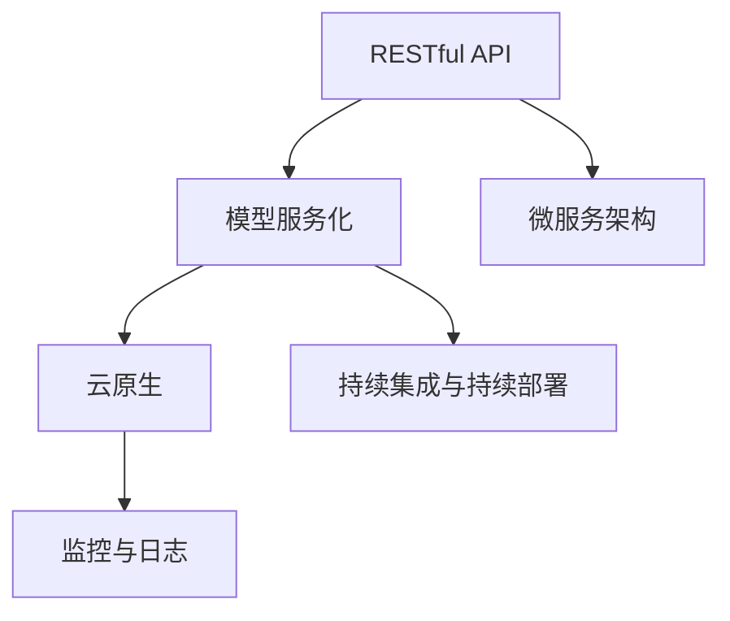

                 

# RESTful API设计：AI模型服务化的最佳实践

> 关键词：RESTful API, 模型服务化, 微服务架构, 云原生, 容器化, 分布式系统, 持续集成, 持续部署, 监控与日志

## 1. 背景介绍

### 1.1 问题由来

随着人工智能技术在各行各业的应用越来越广泛，AI模型的服务化也变得越来越重要。在传统的客户端-服务器架构中，模型通常以单线程的方式运行在服务器端，这不仅影响了系统的扩展性，也限制了模型的使用方式。为了更好地利用AI模型的价值，我们需要将其以服务的形式进行封装和部署，从而更好地支持灵活的微服务架构和云原生应用。

### 1.2 问题核心关键点

为了实现AI模型的高效服务化，我们需要解决以下几个核心问题：

- 如何设计RESTful API来保证API的灵活性和易用性？
- 如何优化微服务架构，以支持模型的灵活部署和扩展？
- 如何利用云原生技术，实现模型服务的自动化部署和运维？
- 如何通过持续集成和持续部署(CI/CD)来加速模型的迭代和升级？
- 如何实现模型服务的监控与日志，保障系统的稳定性和可追溯性？

这些问题在实际的应用场景中，都需要我们仔细研究和设计，以确保AI模型服务的质量和效率。

## 2. 核心概念与联系

### 2.1 核心概念概述

为了更好地理解RESTful API设计及AI模型服务化的最佳实践，本节将介绍几个密切相关的核心概念：

- RESTful API：基于REST原则设计的API，通过标准的HTTP协议进行交互，支持多种客户端和容器化环境。
- 模型服务化：将AI模型以服务的形式封装和部署，支持灵活的微服务架构和云原生应用。
- 微服务架构：将应用程序拆分为多个小型、自治的服务，每个服务独立运行、独立部署，支持灵活扩展和升级。
- 云原生：采用容器化、自动化部署、无服务器架构等技术，支持灵活、高效、可靠的系统部署和运维。
- 持续集成与持续部署(CI/CD)：自动化地将代码从开发到生产的全过程，支持快速迭代和稳定发布。
- 监控与日志：通过收集和分析系统运行数据，实现对系统状态的监控和问题的快速定位。

这些核心概念之间的逻辑关系可以通过以下Mermaid流程图来展示：



这个流程图展示了RESTful API设计及AI模型服务化的核心概念及其之间的关系：

1. RESTful API是模型服务化的入口，通过标准的HTTP协议实现灵活的交互。
2. 模型服务化依赖于微服务架构和云原生技术，支持模型服务的灵活部署和扩展。
3. 持续集成与持续部署是模型服务化流程的核心，支持模型的快速迭代和稳定发布。
4. 监控与日志是保障系统稳定性的重要手段，提供系统的运行数据和问题定位能力。

## 3. 核心算法原理 & 具体操作步骤

### 3.1 算法原理概述

RESTful API设计及AI模型服务化的核心思想是通过微服务架构和云原生技术，将AI模型以服务的形式进行封装和部署，通过标准的HTTP协议进行灵活的交互和调用。

形式化地，假设我们有AI模型 $M$ 作为服务，其输入为 $x$，输出为 $y$。设计RESTful API的过程可以概括为以下几个步骤：

1. 设计API接口，定义输入参数和输出结果。
2. 实现API接口，封装AI模型调用逻辑。
3. 部署API服务，支持模型服务的灵活部署和扩展。
4. 配置CI/CD流程，实现模型的快速迭代和稳定发布。
5. 实现监控与日志，保障系统稳定性和可追溯性。

通过上述步骤，我们可以构建一个灵活、高效、可扩展的AI模型服务化系统。

### 3.2 算法步骤详解

以下是RESTful API设计及AI模型服务化的详细步骤：

**Step 1: 设计API接口**

设计API接口是实现RESTful API的首要步骤，需要考虑以下几个方面：

1. 输入和输出格式：定义输入参数和输出结果的格式，通常采用JSON格式。
2. 请求方法：定义HTTP请求的方法，如GET、POST、PUT、DELETE等。
3. 路径设计：定义API接口的路径，如/api/model/predict。
4. 参数解析：定义参数的解析方式，如URL参数、请求体参数、标头参数等。
5. 返回结果：定义返回结果的格式和内容，如JSON格式的结果数据和状态码。

**Step 2: 实现API接口**

实现API接口的过程可以分为以下几个步骤：

1. 封装AI模型调用：编写代码实现AI模型的调用逻辑，将输入参数转换为模型所需的格式。
2. 返回结果处理：处理AI模型的输出结果，转换为API接口的返回格式。
3. 异常处理：处理API调用中可能出现的异常，返回错误码和错误信息。

**Step 3: 部署API服务**

部署API服务的过程可以分为以下几个步骤：

1. 选择部署平台：选择适合的服务平台，如Kubernetes、EKS等。
2. 容器化部署：将API接口代码打包为Docker镜像，部署到容器中。
3. 配置服务发现：配置服务发现机制，如DNS、负载均衡器等。
4. 扩展部署：支持服务扩展和缩容，根据负载自动调整容器数量。

**Step 4: 配置CI/CD流程**

配置CI/CD流程的过程可以分为以下几个步骤：

1. 建立开发环境：配置开发环境，支持模型的快速迭代。
2. 集成代码仓库：将代码仓库集成到CI/CD流程中，支持代码的自动提交和合并。
3. 配置自动化测试：配置自动化测试流程，支持代码的快速验证和回归测试。
4. 配置持续集成：配置持续集成流程，支持代码的自动构建和打包。
5. 配置持续部署：配置持续部署流程，支持代码的自动发布和部署。

**Step 5: 实现监控与日志**

实现监控与日志的过程可以分为以下几个步骤：

1. 配置监控系统：配置监控系统，支持对API服务的性能和状态进行监控。
2. 配置日志系统：配置日志系统，支持对API服务的事件和异常进行记录。
3. 配置告警系统：配置告警系统，支持对监控和日志系统的事件进行告警。
4. 配置可视化工具：配置可视化工具，支持对监控和日志系统的事件进行可视化和分析。

通过上述步骤，我们可以构建一个灵活、高效、可扩展的AI模型服务化系统。

### 3.3 算法优缺点

RESTful API设计及AI模型服务化具有以下优点：

1. 灵活性高：API接口支持多种客户端和容器化环境，可以实现灵活的交互和调用。
2. 扩展性好：微服务架构支持模型的灵活部署和扩展，可以根据负载自动调整资源。
3. 可扩展性强：云原生技术支持模型的自动化部署和运维，可以实现快速迭代和稳定发布。
4. 可追溯性好：监控与日志系统提供系统的运行数据和问题定位能力，可以保障系统的稳定性和可追溯性。

同时，该方法也存在一定的局限性：

1. 接口复杂度高：设计RESTful API需要考虑多个方面，接口设计复杂度较高。
2. 实现难度大：API接口的实现和部署需要较高的技术水平，容易出现错误。
3. 运维复杂度高：云原生技术和持续集成需要复杂的运维工作，容易出现故障。

尽管存在这些局限性，但就目前而言，RESTful API设计及AI模型服务化仍然是构建高性能、高可用性AI服务的重要范式。未来相关研究的重点在于如何进一步降低接口设计和实现的难度，提高运维效率，兼顾可扩展性和可追溯性等因素。

### 3.4 算法应用领域

RESTful API设计及AI模型服务化已经在多个领域得到了广泛的应用，例如：

- 自然语言处理：将模型以服务的形式封装，提供文本分类、情感分析、问答等API接口，方便用户调用。
- 计算机视觉：将模型以服务的形式封装，提供图像识别、物体检测、人脸识别等API接口，方便用户调用。
- 语音识别：将模型以服务的形式封装，提供语音转文本、语音合成等API接口，方便用户调用。
- 推荐系统：将模型以服务的形式封装，提供推荐接口，支持个性化推荐和内容推荐。
- 风控系统：将模型以服务的形式封装，提供风控接口，支持信用评估、欺诈检测等应用场景。
- 智能客服：将模型以服务的形式封装，提供自然语言理解、对话生成等API接口，方便用户调用。

除了上述这些经典应用外，RESTful API设计及AI模型服务化还被创新性地应用到更多场景中，如可控文本生成、常识推理、代码生成、数据增强等，为AI技术的落地应用提供了新的解决方案。

## 4. 数学模型和公式 & 详细讲解 & 举例说明

### 4.1 数学模型构建

本节将使用数学语言对RESTful API设计及AI模型服务化的数学原理进行更加严格的刻画。

假设我们有一个AI模型 $M$，其输入为 $x$，输出为 $y$。我们希望设计一个RESTful API，实现灵活的交互和调用。

记输入 $x$ 的维度为 $n$，输出 $y$ 的维度为 $m$。则模型 $M$ 的输入和输出可以表示为：

$$
M(x) = [y_1, y_2, ..., y_m]
$$

设计RESTful API的过程可以概括为以下几个步骤：

1. 设计API接口，定义输入参数和输出结果。
2. 实现API接口，封装AI模型调用逻辑。
3. 部署API服务，支持模型服务的灵活部署和扩展。
4. 配置CI/CD流程，实现模型的快速迭代和稳定发布。
5. 实现监控与日志，保障系统稳定性和可追溯性。

### 4.2 公式推导过程

以下我们以文本分类任务为例，推导API接口的设计过程。

假设API接口的输入为文本 $x$，输出为文本类别 $y$，模型 $M$ 使用分类器进行分类。API接口的设计可以概括为以下几个步骤：

1. 设计API接口，定义输入参数和输出结果。
2. 实现API接口，封装分类器调用逻辑。
3. 部署API服务，支持模型服务的灵活部署和扩展。
4. 配置CI/CD流程，实现模型的快速迭代和稳定发布。
5. 实现监控与日志，保障系统稳定性和可追溯性。

具体地，我们可以设计一个简单的RESTful API接口，实现文本分类的功能：

```python
@app.route('/predict', methods=['POST'])
def predict():
    # 解析输入参数
    text = request.json['text']
    
    # 调用模型进行分类
    y = model.predict([text])
    
    # 返回结果
    return jsonify({'result': y[0]})
```

在这个API接口中，我们使用Python的Flask框架，定义了一个/predict的接口，支持POST请求。请求的JSON参数包含文本 $x$，API接口调用模型进行分类，并返回分类结果 $y$。

### 4.3 案例分析与讲解

下面我们以一个具体的案例，展示RESTful API设计及AI模型服务化的实际应用。

假设我们有一个基于BERT模型的文本分类任务，我们需要将模型以服务的形式进行封装和部署，提供灵活的API接口，方便用户调用。

具体实现步骤如下：

**Step 1: 设计API接口**

设计API接口的过程可以分为以下几个步骤：

1. 定义输入参数：定义文本 $x$ 的输入参数。
2. 定义输出结果：定义分类结果 $y$ 的输出结果。
3. 定义请求方法：定义POST请求方法。
4. 定义API路径：定义/predict的API路径。
5. 定义参数解析：定义JSON格式的参数解析方式。

**Step 2: 实现API接口**

实现API接口的过程可以分为以下几个步骤：

1. 封装BERT模型：编写代码实现BERT模型的调用逻辑，将输入参数转换为模型所需的格式。
2. 封装分类器：编写代码实现分类器的调用逻辑，将模型输出转换为API接口的返回格式。
3. 封装异常处理：编写代码实现异常处理逻辑，返回错误码和错误信息。

**Step 3: 部署API服务**

部署API服务的过程可以分为以下几个步骤：

1. 选择部署平台：选择适合的服务平台，如Kubernetes、EKS等。
2. 容器化部署：将API接口代码打包为Docker镜像，部署到容器中。
3. 配置服务发现：配置服务发现机制，如DNS、负载均衡器等。
4. 扩展部署：支持服务扩展和缩容，根据负载自动调整容器数量。

**Step 4: 配置CI/CD流程**

配置CI/CD流程的过程可以分为以下几个步骤：

1. 建立开发环境：配置开发环境，支持模型的快速迭代。
2. 集成代码仓库：将代码仓库集成到CI/CD流程中，支持代码的自动提交和合并。
3. 配置自动化测试：配置自动化测试流程，支持代码的快速验证和回归测试。
4. 配置持续集成：配置持续集成流程，支持代码的自动构建和打包。
5. 配置持续部署：配置持续部署流程，支持代码的自动发布和部署。

**Step 5: 实现监控与日志**

实现监控与日志的过程可以分为以下几个步骤：

1. 配置监控系统：配置监控系统，支持对API服务的性能和状态进行监控。
2. 配置日志系统：配置日志系统，支持对API服务的事件和异常进行记录。
3. 配置告警系统：配置告警系统，支持对监控和日志系统的事件进行告警。
4. 配置可视化工具：配置可视化工具，支持对监控和日志系统的事件进行可视化和分析。

通过上述步骤，我们可以构建一个灵活、高效、可扩展的RESTful API设计及AI模型服务化系统。

## 5. 项目实践：代码实例和详细解释说明

### 5.1 开发环境搭建

在进行RESTful API设计及AI模型服务化的实践前，我们需要准备好开发环境。以下是使用Python进行Flask框架开发的环境配置流程：

1. 安装Anaconda：从官网下载并安装Anaconda，用于创建独立的Python环境。

2. 创建并激活虚拟环境：
```bash
conda create -n flask-env python=3.8 
conda activate flask-env
```

3. 安装Flask：
```bash
pip install Flask
```

4. 安装BERT模型：
```bash
pip install transformers
```

5. 安装各类工具包：
```bash
pip install numpy pandas scikit-learn matplotlib tqdm jupyter notebook ipython
```

完成上述步骤后，即可在`flask-env`环境中开始RESTful API设计及AI模型服务化的实践。

### 5.2 源代码详细实现

下面我们以BERT模型为例，给出使用Flask框架对文本分类任务进行RESTful API设计及AI模型服务化的PyTorch代码实现。

首先，定义文本分类任务的API接口：

```python
from flask import Flask, request, jsonify
import torch
from transformers import BertForTokenClassification, BertTokenizer
from torch.utils.data import DataLoader
from sklearn.metrics import classification_report

app = Flask(__name__)

# 定义模型和tokenizer
model = BertForTokenClassification.from_pretrained('bert-base-cased', num_labels=3)
tokenizer = BertTokenizer.from_pretrained('bert-base-cased')

# 定义API接口
@app.route('/predict', methods=['POST'])
def predict():
    # 解析输入参数
    text = request.json['text']
    
    # 将文本分词并转换为token ids
    encoding = tokenizer(text, return_tensors='pt', max_length=128, padding='max_length', truncation=True)
    input_ids = encoding['input_ids'][0]
    attention_mask = encoding['attention_mask'][0]
    
    # 调用模型进行分类
    with torch.no_grad():
        outputs = model(input_ids, attention_mask=attention_mask)
        logits = outputs.logits
        predicted_labels = torch.argmax(logits, dim=2)
    
    # 将标签转换为文本
    labels = [id2tag[_id] for _id in predicted_labels[0]]
    
    # 返回结果
    return jsonify({'result': labels})

# 运行API服务
if __name__ == '__main__':
    app.run(host='0.0.0.0', port=5000)
```

在这个API接口中，我们使用Python的Flask框架，定义了一个/predict的接口，支持POST请求。请求的JSON参数包含文本 $x$，API接口调用BERT模型进行分类，并返回分类结果 $y$。

### 5.3 代码解读与分析

让我们再详细解读一下关键代码的实现细节：

**BERT模型和tokenizer**：
- 使用transformers库加载预训练的BERT模型和tokenizer。

**API接口**：
- 定义/predict的API接口，支持POST请求。
- 解析输入参数，将文本转换为token ids。
- 调用BERT模型进行分类，并返回分类结果。
- 将标签转换为文本，并返回API接口的结果。

**启动API服务**：
- 使用Flask框架启动API服务，监听0.0.0.0:5000端口。

通过这个简单的例子，我们可以看到使用Flask框架实现RESTful API的便捷性。开发者可以更专注于模型和接口的设计，而不必过多关注底层的实现细节。

当然，实际的应用场景中，API接口的设计和实现需要根据具体的任务和需求进行详细设计，以满足实际应用的需求。同时，API接口还需要进行详细的测试和优化，以保障系统的稳定性和性能。

## 6. 实际应用场景

### 6.1 智能客服系统

RESTful API设计及AI模型服务化在智能客服系统中有着广泛的应用。传统的客服系统需要配备大量人力，高峰期响应缓慢，且无法实现24小时不间断服务。而基于RESTful API设计及AI模型服务化的智能客服系统，可以7x24小时不间断服务，快速响应客户咨询，用自然流畅的语言解答各类常见问题。

在技术实现上，可以收集企业内部的历史客服对话记录，将问题和最佳答复构建成监督数据，在此基础上对BERT模型进行微调。微调后的模型能够自动理解用户意图，匹配最合适的答案模板进行回复。对于客户提出的新问题，还可以接入检索系统实时搜索相关内容，动态组织生成回答。如此构建的智能客服系统，能大幅提升客户咨询体验和问题解决效率。

### 6.2 金融舆情监测

金融机构需要实时监测市场舆论动向，以便及时应对负面信息传播，规避金融风险。传统的人工监测方式成本高、效率低，难以应对网络时代海量信息爆发的挑战。基于RESTful API设计及AI模型服务化的文本分类和情感分析技术，为金融舆情监测提供了新的解决方案。

具体而言，可以收集金融领域相关的新闻、报道、评论等文本数据，并对其进行主题标注和情感标注。在此基础上对BERT模型进行微调，使其能够自动判断文本属于何种主题，情感倾向是正面、中性还是负面。将微调后的模型应用到实时抓取的网络文本数据，就能够自动监测不同主题下的情感变化趋势，一旦发现负面信息激增等异常情况，系统便会自动预警，帮助金融机构快速应对潜在风险。

### 6.3 个性化推荐系统

当前的推荐系统往往只依赖用户的历史行为数据进行物品推荐，无法深入理解用户的真实兴趣偏好。基于RESTful API设计及AI模型服务化的个性化推荐系统，可以更好地挖掘用户行为背后的语义信息，从而提供更精准、多样的推荐内容。

在实践中，可以收集用户浏览、点击、评论、分享等行为数据，提取和用户交互的物品标题、描述、标签等文本内容。将文本内容作为模型输入，用户的后续行为（如是否点击、购买等）作为监督信号，在此基础上微调BERT模型。微调后的模型能够从文本内容中准确把握用户的兴趣点。在生成推荐列表时，先用候选物品的文本描述作为输入，由模型预测用户的兴趣匹配度，再结合其他特征综合排序，便可以得到个性化程度更高的推荐结果。

### 6.4 未来应用展望

随着RESTful API设计及AI模型服务化技术的发展，未来将有更多的应用场景涌现。以下是一些可能的未来应用场景：

- 智慧医疗：基于RESTful API设计及AI模型服务化的医疗问答、病历分析、药物研发等应用，将提升医疗服务的智能化水平，辅助医生诊疗，加速新药开发进程。
- 智能教育：基于RESTful API设计及AI模型服务化的作业批改、学情分析、知识推荐等应用，因材施教，促进教育公平，提高教学质量。
- 智慧城市：基于RESTful API设计及AI模型服务化的城市事件监测、舆情分析、应急指挥等应用，提高城市管理的自动化和智能化水平，构建更安全、高效的未来城市。
- 智能制造：基于RESTful API设计及AI模型服务化的生产调度、设备维护、质量控制等应用，实现智能化制造，提升生产效率和产品质量。
- 智能交通：基于RESTful API设计及AI模型服务化的交通流量分析、事故预测、路径规划等应用，提升交通管理水平，保障交通安全。

## 7. 工具和资源推荐

### 7.1 学习资源推荐

为了帮助开发者系统掌握RESTful API设计及AI模型服务化的理论基础和实践技巧，这里推荐一些优质的学习资源：

1. RESTful API设计指南：详细介绍了RESTful API设计的基本原则和最佳实践，适合初学者入门。
2. Flask Web开发实战：由Flask官方团队编写，适合Flask框架的开发者学习和使用。
3. TensorFlow实战指南：由TensorFlow官方团队编写，适合TensorFlow的开发者学习和使用。
4. Kubernetes实战指南：由Kubernetes官方团队编写，适合Kubernetes的开发者学习和使用。
5. Docker实战指南：由Docker官方团队编写，适合Docker容器的开发者学习和使用。
6. CI/CD实战指南：由CI/CD工具商编写，适合CI/CD工具的开发者学习和使用。

通过对这些资源的学习实践，相信你一定能够快速掌握RESTful API设计及AI模型服务化的精髓，并用于解决实际的NLP问题。

### 7.2 开发工具推荐

高效的开发离不开优秀的工具支持。以下是几款用于RESTful API设计及AI模型服务化开发的常用工具：

1. Flask：基于Python的开源Web框架，简单易用，适合快速开发API接口。
2. TensorFlow：由Google主导开发的开源深度学习框架，生产部署方便，适合大规模工程应用。
3. Kubernetes：由Google主导开发的开源容器编排系统，支持大规模微服务架构。
4. Docker：由Docker公司开发的开源容器化技术，支持代码的快速打包和部署。
5. CI/CD工具：如Jenkins、GitLab CI/CD等，支持代码的自动化构建、测试和部署。
6. 监控与日志工具：如Prometheus、Grafana、ELK Stack等，支持系统的监控和日志分析。

合理利用这些工具，可以显著提升RESTful API设计及AI模型服务化的开发效率，加快创新迭代的步伐。

### 7.3 相关论文推荐

RESTful API设计及AI模型服务化技术的发展源于学界的持续研究。以下是几篇奠基性的相关论文，推荐阅读：

1. RESTful Web Services：介绍了RESTful API的基本概念和设计原则。
2. Model-Based API Design：介绍了基于模型的API设计方法，提供了API接口设计的框架。
3. Microservices Architecture：介绍了微服务架构的基本概念和设计原则。
4. Serverless Computing：介绍了无服务器架构的基本概念和设计原则。
5. Continuous Integration and Continuous Deployment：介绍了CI/CD流程的基本概念和设计原则。
6. Kubernetes：介绍了Kubernetes的基本概念和设计原则。

这些论文代表了大语言模型微调技术的发展脉络。通过学习这些前沿成果，可以帮助研究者把握学科前进方向，激发更多的创新灵感。

## 8. 总结：未来发展趋势与挑战

### 8.1 总结

本文对RESTful API设计及AI模型服务化的核心概念、原理和操作步骤进行了全面系统的介绍。首先阐述了RESTful API设计及AI模型服务化的研究背景和意义，明确了设计灵活、高效、可扩展的API接口的重要价值。其次，从原理到实践，详细讲解了RESTful API设计及AI模型服务化的数学原理和关键步骤，给出了微服务架构和云原生技术的实现细节。同时，本文还广泛探讨了RESTful API设计及AI模型服务化在智能客服、金融舆情、个性化推荐等多个领域的应用前景，展示了微调范式的巨大潜力。最后，本文精选了RESTful API设计及AI模型服务化的学习资源，力求为开发者提供全方位的技术指引。

通过本文的系统梳理，可以看到，RESTful API设计及AI模型服务化技术正在成为NLP服务化的重要范式，极大地拓展了AI模型应用的边界，催生了更多的落地场景。受益于RESTful API设计及AI模型服务化的技术进展，基于微服务的系统架构将更加灵活和高效，云原生技术也将为系统的自动化部署和运维提供有力支持，持续集成与持续部署(CI/CD)将进一步提升模型的迭代和发布效率，监控与日志系统也将为系统的稳定性和可追溯性提供保障。

### 8.2 未来发展趋势

展望未来，RESTful API设计及AI模型服务化技术将呈现以下几个发展趋势：

1. 微服务架构的普及：随着微服务架构的普及，越来越多的NLP应用将采用微服务架构，支持模型的灵活部署和扩展。
2. 云原生技术的成熟：随着云原生技术的成熟，越来越多的NLP应用将采用云原生技术，支持模型的自动化部署和运维。
3. 持续集成与持续部署的普及：随着持续集成与持续部署的普及，越来越多的NLP应用将采用CI/CD流程，支持模型的快速迭代和稳定发布。
4. 监控与日志系统的普及：随着监控与日志系统的普及，越来越多的NLP应用将采用监控与日志系统，支持系统的稳定性和可追溯性。
5. 多模态数据融合：随着多模态数据融合技术的发展，越来越多的NLP应用将采用多模态数据融合，提升系统的感知和推理能力。
6. 跨领域迁移能力：随着预训练模型和微调方法的不断演进，越来越多的NLP应用将具备跨领域迁移能力，支持模型的多任务学习和泛化。

以上趋势凸显了RESTful API设计及AI模型服务化技术的广阔前景。这些方向的探索发展，必将进一步提升NLP系统的性能和应用范围，为人类认知智能的进化带来深远影响。

### 8.3 面临的挑战

尽管RESTful API设计及AI模型服务化技术已经取得了瞩目成就，但在迈向更加智能化、普适化应用的过程中，它仍面临着诸多挑战：

1. 接口设计复杂度：RESTful API设计需要考虑多个方面，接口设计复杂度较高。
2. 实现难度高：API接口的实现和部署需要较高的技术水平，容易出现错误。
3. 运维复杂度高：云原生技术和持续集成需要复杂的运维工作，容易出现故障。
4. 扩展性不足：传统的RESTful API设计在扩展性方面存在一定的局限性，难以应对大规模和高并发的应用场景。
5. 安全性问题：RESTful API设计需要考虑安全性问题，防止恶意攻击和数据泄露。
6. 性能问题：RESTful API设计需要考虑性能问题，防止API接口响应慢和网络延迟。

尽管存在这些挑战，但随着技术的不断发展和完善，RESTful API设计及AI模型服务化技术必将在更多领域得到应用，推动NLP技术的产业化进程。未来相关研究的重点在于如何进一步降低接口设计和实现的难度，提高运维效率，兼顾可扩展性和安全性等因素。

### 8.4 研究展望

面对RESTful API设计及AI模型服务化所面临的挑战，未来的研究需要在以下几个方面寻求新的突破：

1. 简化接口设计：研究和探索更加简洁、易用的API接口设计方法，降低接口设计的复杂度。
2. 自动化接口实现：研究和探索API接口的自动化实现方法，提高接口实现的效率和准确性。
3. 优化运维流程：研究和探索更加高效、可靠的运维流程，提高系统的稳定性和可维护性。
4. 提升扩展性：研究和探索更加灵活、可扩展的API接口设计方法，支持大规模和高并发的应用场景。
5. 增强安全性：研究和探索更加安全的API接口设计方法，防止恶意攻击和数据泄露。
6. 优化性能：研究和探索更加高效的API接口设计方法，提高API接口的响应速度和系统性能。

这些研究方向的探索，必将引领RESTful API设计及AI模型服务化技术迈向更高的台阶，为构建安全、可靠、高效、可扩展的NLP应用提供有力支持。

## 9. 附录：常见问题与解答

**Q1：RESTful API设计是否适用于所有NLP任务？**

A: RESTful API设计在大多数NLP任务上都能取得不错的效果，特别是对于数据量较小的任务。但对于一些特定领域的任务，如医学、法律等，仅仅依靠通用语料预训练的模型可能难以很好地适应。此时需要在特定领域语料上进一步预训练，再进行微调，才能获得理想效果。此外，对于一些需要时效性、个性化很强的任务，如对话、推荐等，RESTful API设计也需要针对性的改进优化。

**Q2：如何设计灵活、高效的API接口？**

A: 设计灵活、高效的API接口需要考虑以下几个方面：

1. 清晰的接口定义：定义清晰的接口输入输出格式和请求方法，方便客户端使用。
2. 可扩展的接口设计：设计可扩展的接口路径和参数，支持多种数据格式和输入方式。
3. 友好的API文档：提供详细的API文档和示例代码，方便开发者使用。
4. 高效的数据处理：采用高效的数据解析和处理方式，提高API接口的响应速度。

**Q3：如何优化API接口的性能？**

A: 优化API接口的性能需要考虑以下几个方面：

1. 高效的请求处理：采用高效的请求处理方式，减少API接口的响应时间。
2. 缓存机制：采用缓存机制，减少API接口的重复计算和响应时间。
3. 并发处理：采用并发处理机制，提高API接口的并发处理能力和性能。
4. 负载均衡：采用负载均衡机制，支持API接口的高并发和扩展性。

**Q4：如何实现API接口的自动化部署？**

A: 实现API接口的自动化部署需要考虑以下几个方面：

1. 自动化构建：采用自动化构建工具，如Jenkins、GitLab CI/CD等，支持代码的自动化构建和打包。
2. 自动化测试：采用自动化测试工具，如Selenium、JUnit等，支持API接口的自动化测试和回归测试。
3. 自动化部署：采用自动化部署工具，如Kubernetes、Docker等，支持API接口的自动化部署和运维。

**Q5：如何实现API接口的监控与日志？**

A: 实现API接口的监控与日志需要考虑以下几个方面：

1. 监控系统：采用监控系统，如Prometheus、Grafana等，支持API接口的性能和状态监控。
2. 日志系统：采用日志系统，如ELK Stack等，支持API接口的事件和异常记录。
3. 告警系统：采用告警系统，如Zabbix、Nagios等，支持API接口的异常告警。
4. 可视化工具：采用可视化工具，如Kibana等，支持API接口的监控和日志可视化。

通过上述步骤，我们可以构建一个灵活、高效、可扩展的RESTful API设计及AI模型服务化系统。

---

作者：禅与计算机程序设计艺术 / Zen and the Art of Computer Programming

