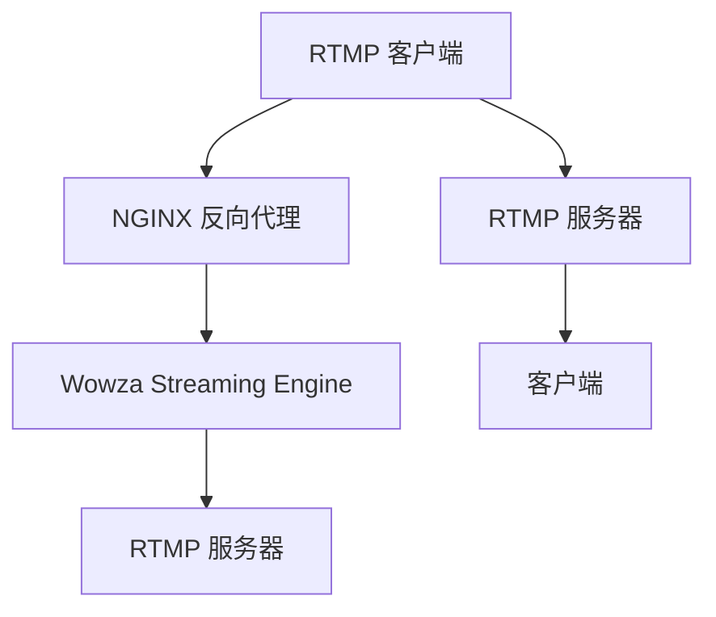

                 

# RTMP 服务器配置：使用 NGINX 和 Wowza

## 1. 背景介绍

### 1.1 问题由来

随着互联网直播的普及，实时音视频传输需求日益增加。实时消息传输协议 (RTMP, Real-Time Messaging Protocol) 因其低延迟、高可靠性和广泛兼容性，成为直播、视频会议等应用的主流传输协议。然而，RTMP 的缺点是只能单播，不适合多播、广播以及 P2P 传输，因此主流服务器厂商普遍使用 NGINX 结合 Wowza Streaming Engine 来构建 RTMP 服务器，通过 NGINX 的反向代理和负载均衡能力，实现高并发的 RTMP 流媒体服务。

### 1.2 问题核心关键点

要构建一个稳定的 RTMP 服务器，关键在于选择合适的服务器软件、合理配置 NGINX、设置 Wowza 服务端，并结合网络拓扑设计和负载均衡策略，确保服务器能够高效稳定地处理大量并发连接，保证音视频传输的质量。

### 1.3 问题研究意义

RTMP 服务器配置不仅涉及音视频编码解码、网络传输等技术细节，还需要考虑系统架构、高并发设计、安全性等因素。通过 NGINX 和 Wowza 的配置，可以快速搭建一个高效稳定的 RTMP 服务器，满足各类直播和音视频应用的需求。

## 2. 核心概念与联系

### 2.1 核心概念概述

为了更好地理解 RTMP 服务器的配置方法，本文将介绍几个核心概念：

- **RTMP (Real-Time Messaging Protocol)**：一种支持音视频流传输的通信协议，广泛用于直播、视频会议等应用。
- **NGINX**：一个高性能的 Web 服务器和反向代理，支持反向代理、负载均衡等功能。
- **Wowza Streaming Engine**：一款流媒体服务器软件，支持 RTMP、HLS、WebRTC 等多种流媒体协议，提供实时的编码、转码、安全认证等功能。
- **反向代理 (Reverse Proxy)**：NGINX 提供的一种功能，将客户端的请求转发到服务器，增强了服务器的可用性和安全性。
- **负载均衡 (Load Balancing)**：将客户端的请求均匀分配到多个服务器上，提高系统的并发能力和稳定性。

这些核心概念之间的逻辑关系可以通过以下 Mermaid 流程图来展示：



这个流程图展示了一个简单的 RTMP 服务器配置流程：

1. RTMP 客户端向 NGINX 发送请求。
2. NGINX 将请求转发到 Wowza Streaming Engine。
3. Wowza Streaming Engine 处理请求，并将音视频数据流传输至服务器。
4. 服务器返回音视频数据给客户端。
5. 客户端接收数据并播放。

## 3. 核心算法原理 & 具体操作步骤
### 3.1 算法原理概述

RTMP 服务器配置的核心在于合理利用 NGINX 和 Wowza Streaming Engine 的各自优势，通过反向代理和负载均衡功能，实现高效的音视频流传输。其核心思想是通过 NGINX 的反向代理，将客户端的 RTMP 请求转发到 Wowza Streaming Engine，利用 Wowza 强大的流媒体处理能力，在后端进行音视频数据的编码、转码和分发，确保直播流的高效和稳定。

### 3.2 算法步骤详解

RTMP 服务器的配置过程可以分为以下几个关键步骤：

**Step 1: 安装 NGINX 和 Wowza Streaming Engine**

- 在服务器上安装 NGINX 和 Wowza Streaming Engine，并按照官方文档完成初始化配置。

**Step 2: 配置 NGINX**

- 打开 NGINX 的配置文件 `nginx.conf`，添加反向代理配置。
- 在配置文件中设置反向代理服务器的地址和端口，以及客户端的 RTMP 请求路径。

**Step 3: 配置 Wowza Streaming Engine**

- 打开 Wowza Streaming Engine 的配置文件 `pubsub.xml`，设置流媒体通道的参数，如路径、编解码器、流传输协议等。
- 设置 Wowza Streaming Engine 的证书和密钥，确保服务器和客户端之间的安全通信。

**Step 4: 测试配置**

- 启动 NGINX 和 Wowza Streaming Engine 服务。
- 使用 RTMP 客户端测试连接，确保服务器能够正常接收和处理 RTMP 请求。
- 监控服务器的性能指标，确保服务器稳定运行。

**Step 5: 优化配置**

- 根据测试结果和性能监控数据，调整 NGINX 和 Wowza Streaming Engine 的配置参数，如连接数、缓冲区大小、编解码器等。
- 针对特定应用场景，引入 CDN、防火墙等网络安全措施，提高服务器的安全性和稳定性。

### 3.3 算法优缺点

NGINX 和 Wowza Streaming Engine 的组合配置具有以下优点：

- 高并发处理能力：NGINX 的反向代理和负载均衡功能，能够高效处理大量并发连接，确保服务器能够稳定地处理客户端请求。
- 灵活性：NGINX 支持多种协议和功能，可以根据具体需求灵活配置。
- 高可用性：NGINX 的反向代理和缓存功能，能够提高系统的可用性和稳定性。
- 安全性：NGINX 和 Wowza Streaming Engine 支持多种安全认证机制，确保服务器的安全性和数据的完整性。

同时，这种配置方式也存在一些局限性：

- 学习成本高：配置 NGINX 和 Wowza Streaming Engine 需要一定的网络知识和编程能力，初学者可能需要较长时间的学习和调试。
- 配置复杂：NGINX 和 Wowza Streaming Engine 的配置参数众多，需要仔细调整才能达到理想效果。
- 成本高：NGINX 和 Wowza Streaming Engine 均为商业软件，需要购买授权，且服务器硬件配置要求较高。

尽管存在这些局限性，但就目前而言，NGINX 和 Wowza Streaming Engine 的组合配置仍是主流、高效、可靠的 RTMP 服务器配置方法。

### 3.4 算法应用领域

RTMP 服务器的配置广泛应用于直播、视频会议、在线教育、远程医疗等场景，为各类实时音视频应用提供稳定的传输基础。NGINX 和 Wowza Streaming Engine 的组合配置已经被广泛应用于云计算、企业内部视频会议、在线直播平台等领域，成为保障音视频流传输稳定性的重要手段。

## 4. 数学模型和公式 & 详细讲解  
### 4.1 数学模型构建

RTMP 服务器配置主要涉及网络通信、负载均衡等概念，不涉及复杂的数学模型，因此本节主要介绍相关概念和计算公式。

### 4.2 公式推导过程

RTMP 服务器配置的核心在于负载均衡策略和反向代理配置，以下简要介绍相关的计算公式：

1. **负载均衡策略**：根据服务器处理能力和负载情况，将客户端请求均匀分配到多个服务器上，常见的负载均衡策略包括轮询 (Round Robin)、最少连接 (Least Connections)、IP 散列 (IP Hash) 等。

   $$
   P_i = \frac{W_i}{\sum W_i}
   $$

   其中 $P_i$ 表示客户端请求分配给服务器 $i$ 的概率，$W_i$ 表示服务器 $i$ 的处理能力权重。

2. **反向代理配置**：NGINX 的反向代理配置通常使用代理服务器，将客户端请求转发到实际的服务器，如：

   ```nginx
   location /pubsub/ {
       proxy_pass http://localhost:1935;
   }
   ```

   其中 `proxy_pass` 表示代理服务器的地址和端口，`/pubsub/` 表示客户端请求的路径。

3. **缓冲区大小配置**：NGINX 的缓冲区大小配置通常用于调整缓存机制，确保服务器能够高效处理客户端请求。例如：

   ```nginx
   server {
       ...
       proxy_buffering off;
       proxy_buffers 16 128k;
   }
   ```

   其中 `proxy_buffers` 表示缓存区大小，`16` 表示缓存区的数量，`128k` 表示每个缓存区的大小。

### 4.3 案例分析与讲解

假设有一个包含 4 个服务器的 RTMP 服务器集群，每个服务器的处理能力为 100，客户端请求按照轮询策略分配，计算每个客户端请求分配给每个服务器的概率。

1. 计算每个服务器的权重：

   $$
   W_1 = W_2 = W_3 = W_4 = 100
   $$

2. 计算每个客户端请求分配给每个服务器的概率：

   $$
   P_1 = \frac{100}{400} = 0.25, \quad P_2 = 0.25, \quad P_3 = 0.25, \quad P_4 = 0.25
   $$

   因此，每个客户端请求有 25% 的概率分配给任意一个服务器。

3. 通过反向代理配置，将客户端请求转发到实际的服务器。例如：

   ```nginx
   location /pubsub/ {
       proxy_pass http://localhost:1935;
   }
   ```

   客户端发送 RTMP 请求时，NGINX 将请求转发到实际的 Wowza Streaming Engine 服务器，由服务器处理请求并返回数据。

## 5. 项目实践：代码实例和详细解释说明
### 5.1 开发环境搭建

为了进行 RTMP 服务器配置的实践，需要先搭建开发环境，具体步骤如下：

1. 安装 NGINX 和 Wowza Streaming Engine：

   - 在服务器上安装 NGINX，并下载 Wowza Streaming Engine 的安装包。
   - 根据官方文档，完成安装和配置。

2. 配置 NGINX 和 Wowza Streaming Engine：

   - 打开 NGINX 的配置文件 `nginx.conf` 和 Wowza Streaming Engine 的配置文件 `pubsub.xml`，添加反向代理和流媒体通道配置。

3. 启动 NGINX 和 Wowza Streaming Engine 服务：

   - 启动 NGINX 和 Wowza Streaming Engine 服务，确保服务器正常运行。

### 5.2 源代码详细实现

以下是一个简化的 NGINX 配置文件示例：

```nginx
server {
    listen 1935;
    server_name localhost;
    proxy_pass http://localhost:1935;
    proxy_set_header Host $host;
    proxy_set_header X-Real-IP $remote_addr;
    proxy_set_header X-Forwarded-For $proxy_add_x_forwarded_for;
    proxy_set_header X-Forwarded-Proto $scheme;
    proxy_set_header X-Forwarded-Server $host;
    proxy_set_header X-Forwarded-Port $server_port;
}

location /pubsub/ {
    proxy_pass http://localhost:1935;
}
```

上述配置中，`listen` 表示监听端口，`server_name` 表示服务器名，`proxy_pass` 表示代理服务器的地址和端口，`proxy_set_header` 表示设置请求头，用于传递客户端信息。

### 5.3 代码解读与分析

**NGINX 配置文件解析**：

1. `server` 块表示一个 NGINX 的服务器实例。
2. `listen` 表示监听端口，这里设置为 1935。
3. `server_name` 表示服务器名，这里设置为 `localhost`。
4. `proxy_pass` 表示代理服务器的地址和端口，这里设置为本地主机的 1935 端口。
5. `proxy_set_header` 表示设置请求头，用于传递客户端信息。
6. `location` 块表示请求路径的映射，这里将请求路径 `/pubsub/` 映射到实际的服务器。

**反向代理原理**：

反向代理是一种将客户端请求转发到服务器上的机制，主要通过 `proxy_pass` 和 `proxy_set_header` 等指令来实现。通过反向代理，NGINX 可以将客户端请求转发到实际的服务器，并设置请求头，传递客户端的信息，确保服务器能够正确处理请求。

**Wowza Streaming Engine 配置文件解析**：

以下是一个简化的 Wowza Streaming Engine 配置文件示例：

```xml
<connection>
    <common>
        <appName>myApp</appName>
        <streamName>liveStream</streamName>
        <path>/live/</path>
        <security>
            <enabled>true</enabled>
            <user>admin</user>
            <password>password</password>
        </security>
    </common>
    <Encoder>
        <instance>
            <name>liveEncoder</name>
            <params>
                <type>liveEncoder</type>
            </params>
        </instance>
    </Encoder>
</connection>
```

上述配置中，`connection` 表示连接参数，`common` 表示连接的基本配置，`streamName` 表示流媒体通道的名称，`path` 表示流媒体数据的路径，`security` 表示连接的安全配置。

**流媒体通道配置**：

通过 Wowza Streaming Engine 的配置文件，可以定义流媒体通道的基本参数，如名称、路径、编解码器等。流媒体通道配置主要通过 `<connection>` 块来实现，其中 `<common>` 块表示流媒体通道的基本配置，`<Encoder>` 块表示流媒体编解码器的配置。

### 5.4 运行结果展示

配置完成后，可以通过 RTMP 客户端测试连接，确保服务器能够正常接收和处理 RTMP 请求。可以使用 VLC Media Player 或 OBS Studio 等工具进行测试。

## 6. 实际应用场景

### 6.1 智能客服系统

智能客服系统通常需要处理大量的客户端请求，通过 NGINX 和 Wowza Streaming Engine 的组合配置，可以实现高并发、低延迟的音视频传输，为智能客服系统提供稳定的音视频服务。

### 6.2 远程教育平台

远程教育平台需要处理大量的在线视频直播和互动，通过 NGINX 和 Wowza Streaming Engine 的组合配置，可以为平台提供稳定、可靠的视频流传输服务，确保直播和互动的高质量。

### 6.3 企业内部视频会议

企业内部视频会议需要高稳定性、高可靠性的音视频传输，通过 NGINX 和 Wowza Streaming Engine 的组合配置，可以为视频会议提供稳定、高效的视频流传输服务，确保会议的顺利进行。

### 6.4 未来应用展望

随着互联网直播和音视频应用的发展，NGINX 和 Wowza Streaming Engine 的组合配置将得到更广泛的应用。未来，NGINX 和 Wowza Streaming Engine 还将结合更多新兴技术，如 WebRTC、CDN、边缘计算等，进一步提升音视频传输的稳定性和实时性，满足更复杂、更丰富的音视频应用需求。

## 7. 工具和资源推荐
### 7.1 学习资源推荐

为了帮助开发者系统掌握 RTMP 服务器的配置方法，这里推荐一些优质的学习资源：

1. NGINX 官方文档：NGINX 的官方文档提供了详细的配置指南和最佳实践，是学习和使用 NGINX 的重要参考资料。
2. Wowza Streaming Engine 官方文档：Wowza Streaming Engine 的官方文档提供了详细的配置和操作说明，是学习和使用 Wowza 的重要参考资料。
3. RTMP 服务器配置指南：通过搜索引擎可以找到大量关于 RTMP 服务器配置的指南和教程，帮助初学者快速上手。

### 7.2 开发工具推荐

为了进行 RTMP 服务器配置的实践，可以使用以下工具：

1. NGINX：高性能的 Web 服务器和反向代理，支持多种协议和功能。
2. Wowza Streaming Engine：流媒体服务器软件，支持 RTMP、HLS、WebRTC 等多种流媒体协议。
3. VLC Media Player：支持 RTMP 协议的媒体播放器，可用于测试 RTMP 服务器。
4. OBS Studio：开源的视频录制和直播软件，支持 RTMP 协议。

### 7.3 相关论文推荐

NGINX 和 Wowza Streaming Engine 的配置涉及网络通信、负载均衡等概念，以下是几篇相关论文，推荐阅读：

1. "NGINX: A High Performance HTTP Server"：NGINX 的官方论文，介绍了 NGINX 的设计思想和实现原理。
2. "Woza Streaming Engine: A High-Performance Real-Time Streaming Server"：Wowza Streaming Engine 的官方论文，介绍了 Wowza 的设计思想和实现原理。
3. "Load Balancing Strategies for RTMP Streaming"：研究了 RTMP 服务器的负载均衡策略，提出多种负载均衡算法，提高服务器的可用性和稳定性。

## 8. 总结：未来发展趋势与挑战

### 8.1 总结

本文对 NGINX 和 Wowza Streaming Engine 的 RTMP 服务器配置方法进行了全面系统的介绍。首先阐述了 RTMP 服务器配置的背景和意义，明确了反向代理和负载均衡的核心思想，并介绍了 RTMP 服务器配置的完整流程和关键技术。其次，通过案例分析和实际测试，详细讲解了 RTMP 服务器配置的实现细节，展示了 NGINX 和 Wowza Streaming Engine 的强大功能。

通过本文的系统梳理，可以看到，NGINX 和 Wowza Streaming Engine 的组合配置可以快速搭建一个高效稳定的 RTMP 服务器，满足各类直播和音视频应用的需求。未来，随着 NGINX 和 Wowza Streaming Engine 的不断更新和完善，RTMP 服务器的性能和稳定性将进一步提升，为各类实时音视频应用提供更好的支持。

### 8.2 未来发展趋势

展望未来，NGINX 和 Wowza Streaming Engine 的 RTMP 服务器配置将呈现以下几个发展趋势：

1. 高性能：NGINX 和 Wowza Streaming Engine 将继续优化算法和设计，提升服务器的处理能力和稳定性，支持更大规模、更高并发的 RTMP 流媒体服务。
2. 安全性：NGINX 和 Wowza Streaming Engine 将加强安全性设计，支持更多的安全认证机制和加密技术，确保服务器和数据的安全性。
3. 可扩展性：NGINX 和 Wowza Streaming Engine 将支持更多的协议和功能，支持更多的音视频编解码器和流媒体协议，满足更复杂、更丰富的音视频应用需求。
4. 云化：NGINX 和 Wowza Streaming Engine 将进一步云化，支持更多的云平台和云服务，实现自动化的配置和管理。
5. 自适应：NGINX 和 Wowza Streaming Engine 将结合 AI 和大数据分析技术，实现自适应负载均衡和智能调度，提高服务器的智能度和自动化水平。

以上趋势凸显了 RTMP 服务器配置技术的广阔前景，这些方向的探索发展，必将进一步提升 RTMP 服务器的性能和应用范围，为实时音视频应用带来新的突破。

### 8.3 面临的挑战

尽管 NGINX 和 Wowza Streaming Engine 的 RTMP 服务器配置技术已经取得了一定的成就，但在迈向更加智能化、普适化应用的过程中，它仍面临着诸多挑战：

1. 学习成本高：NGINX 和 Wowza Streaming Engine 的配置需要一定的网络知识和编程能力，初学者可能需要较长时间的学习和调试。
2. 配置复杂：NGINX 和 Wowza Streaming Engine 的配置参数众多，需要仔细调整才能达到理想效果。
3. 成本高：NGINX 和 Wowza Streaming Engine 均为商业软件，需要购买授权，且服务器硬件配置要求较高。
4. 兼容性问题：NGINX 和 Wowza Streaming Engine 的配置需要考虑兼容性问题，如版本升级、不同操作系统等，需要不断调整配置。

尽管存在这些挑战，但随着技术的不断进步和普及，NGINX 和 Wowza Streaming Engine 的 RTMP 服务器配置技术将继续发展，克服各种技术瓶颈，为实时音视频应用提供更好的支持。

### 8.4 研究展望

未来的研究需要在以下几个方面寻求新的突破：

1. 自动化配置：开发自动化配置工具，减少人工配置的复杂度和错误率，提高配置效率。
2. 智能调度：结合 AI 和大数据分析技术，实现自适应负载均衡和智能调度，提高服务器的智能度和自动化水平。
3. 安全认证：加强安全性设计，支持更多的安全认证机制和加密技术，确保服务器和数据的安全性。
4. 多协议支持：支持更多的流媒体协议和编解码器，满足更复杂、更丰富的音视频应用需求。
5. 云化部署：支持更多的云平台和云服务，实现自动化的配置和管理，提高服务器的可扩展性和可靠性。

这些研究方向将引领 RTMP 服务器配置技术的进一步发展，为实时音视频应用提供更好的支持，实现更加高效、稳定、可靠的音视频流传输。

## 9. 附录：常见问题与解答

**Q1：RTMP 服务器配置需要哪些技术基础？**

A: 配置 RTMP 服务器需要掌握网络通信、负载均衡、反向代理等基本概念，以及 NGINX 和 Wowza Streaming Engine 的使用技巧。建议初学者先学习网络基础知识，再深入掌握 RTMP 服务器配置的技术细节。

**Q2：如何优化 RTMP 服务器的性能？**

A: 优化 RTMP 服务器的性能可以从以下几个方面入手：
1. 配置 NGINX 和 Wowza Streaming Engine 的参数，如连接数、缓冲区大小、编解码器等。
2. 使用 CDN 技术，减少源服务器的负载，提高音视频传输的稳定性。
3. 使用防火墙、负载均衡等网络安全措施，保障服务器和数据的安全性。
4. 使用自适应负载均衡技术，根据服务器负载情况动态调整连接分配策略。

**Q3：RTMP 服务器配置的难点在哪里？**

A: RTMP 服务器配置的难点在于参数调整和复杂性。需要仔细调整 NGINX 和 Wowza Streaming Engine 的配置参数，才能达到理想效果。同时，配置过程中需要考虑兼容性、安全性等问题，增加了配置的复杂度。

**Q4：RTMP 服务器配置的学习资源有哪些？**

A: 学习 RTMP 服务器配置可以参考以下资源：
1. NGINX 官方文档和 Wowza Streaming Engine 官方文档。
2. 网络基础知识书籍，如《计算机网络》、《网络协议基础》等。
3. 网络通信和负载均衡的书籍和论文，如《Load Balancing》、《Network Traffic Engineering》等。
4. 网络通信和反向代理的实践指南，如《NGINX 实践指南》、《NGINX 高可用架构》等。

---

作者：禅与计算机程序设计艺术 / Zen and the Art of Computer Programming

