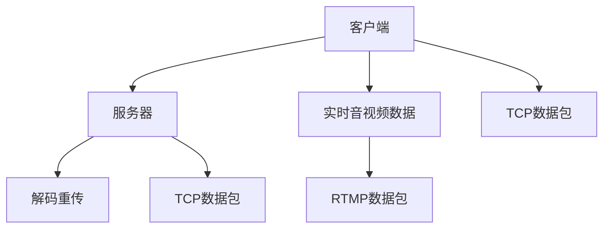
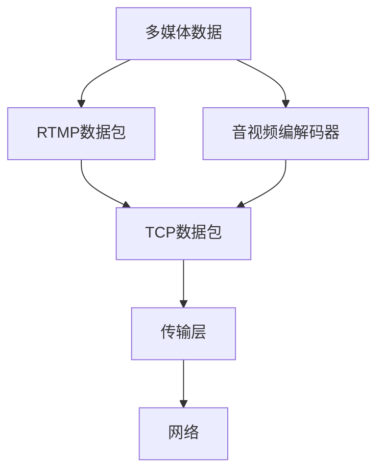

                 

# RTMP协议详解：实时多媒体传输技术

> 关键词：RTMP协议,实时多媒体传输,流媒体技术,数字媒体传输标准,实时视频流

## 1. 背景介绍

随着互联网的迅猛发展，网络带宽的不断提升，实时多媒体流媒体的传输需求日益增长。视频会议、在线直播、实时游戏等应用场景对于实时性、可靠性、低延迟的要求极高。为了满足这一需求，实时传输协议(RTMP)应运而生，成为众多互联网实时应用的重要基础。

### 1.1 RTMP协议简介

RTMP(Real-Time Messaging Protocol)是Adobe公司开发的基于TCP的流媒体传输协议，专为实时音视频传输设计。RTMP协议通过TCP协议在网络上稳定传输实时数据，具有传输速度快、延迟低、兼容性好等特点。目前，RTMP协议已经广泛应用于YouTube、Twitch等知名视频平台，支持实况、直播、点播等多种多媒体服务。

### 1.2 RTMP协议的历史

RTMP协议最早可以追溯到2007年，Adobe公司发布Flash Player 9后，RTMP协议首次与Flash Player进行深度绑定。随后，RTMP协议在Flash Player中得到广泛应用，成为跨平台实时音视频传输的重要手段。随着WebRTC、WebSockets等新兴技术的崛起，RTMP协议在网页端的应用逐渐被替代，但在桌面端仍然占据重要地位。

### 1.3 RTMP协议的架构

RTMP协议基于TCP协议进行实时音视频传输，采用了C/S架构，主要包括以下组件：

1. **客户端**：生成多媒体数据，封装成RTMP数据包，并通过TCP协议发送至服务器。
2. **服务器**：接收客户端发送的数据包，进行解码和重传，确保实时性。
3. **传输层**：基于TCP协议实现数据包的可靠传输，提供数据丢失、重传、拥塞控制等功能。

以下是一个RTMP协议的示意图：



## 2. 核心概念与联系

### 2.1 核心概念概述

为了更好地理解RTMP协议的工作原理，我们需要掌握以下几个关键概念：

1. **多媒体数据**：包括音频、视频、元数据等多种类型的数据，是RTMP协议传输的核心。
2. **RTMP数据包**：在多媒体数据基础上封装成的数据包，遵循RTMP协议规范，用于在网络中进行传输。
3. **TCP协议**：传输层协议，为RTMP协议提供可靠的数据传输服务，确保数据的完整性和可靠性。
4. **报文头**：RTMP数据包的首部，包含RTMP协议的版本、命令、长度、时间戳等信息。
5. **音视频编解码器**：负责对多媒体数据进行编码和解码，以适应不同的传输需求。

这些核心概念共同构成了RTMP协议的基础，帮助我们理解其在实时音视频传输中的应用。

### 2.2 核心概念联系

以下是一个RTMP协议的逻辑结构图，展示了各核心概念之间的联系：



在实际应用中，多媒体数据首先经过音视频编解码器的处理，封装成RTMP数据包，并通过TCP协议进行传输。最终，RTMP数据包通过网络传输至服务器端，由解码器解码并重传，确保实时性。

## 3. 核心算法原理 & 具体操作步骤

### 3.1 算法原理概述

RTMP协议的核心算法主要涉及音视频数据的编码、封装、传输、解码和重传等过程。以下是对每个过程的详细讲解：

1. **音视频数据的编码**：将原始音频、视频数据进行压缩编码，转化为网络传输兼容的数据格式。常见的编码方式包括H.264、AAC、MP3等。
2. **RTMP数据包的封装**：将编码后的音视频数据封装成RTMP数据包，遵循RTMP协议规范，并添加必要的报文头信息。
3. **TCP协议的传输**：基于TCP协议进行可靠的数据传输，确保音视频数据在网络传输过程中的完整性和可靠性。
4. **解码和重传**：服务器端接收到RTMP数据包后，进行解码和重传处理，确保数据的实时性和准确性。

### 3.2 算法步骤详解

#### 步骤一：音视频数据的编码

音视频数据的编码是将原始数据转化为网络传输兼容的格式，常用的编解码器包括H.264、AAC、MP3等。

**示例代码**：

```python
from encode import encoder

# 编码视频数据
video_data = encoder.encode_video(video_file)
```

#### 步骤二：RTMP数据包的封装

RTMP数据包的封装是将编码后的音视频数据转化为RTMP数据包，并添加必要的报文头信息。

**示例代码**：

```python
from rtmp import RtmpPacket

# 创建RTMP数据包
packet = RtmpPacket()

# 添加报文头信息
packet.add_header(version=3, message_type=1, packet_length=len(video_data))

# 添加音视频数据
packet.add_body(video_data)

# 封装成字节流
packet_data = packet.to_bytes()
```

#### 步骤三：TCP协议的传输

TCP协议提供可靠的数据传输服务，确保音视频数据在网络传输过程中的完整性和可靠性。

**示例代码**：

```python
from socket import socket

# 创建TCP套接字
client_socket = socket(socket.AF_INET, socket.SOCK_STREAM)

# 连接服务器
client_socket.connect((server_ip, server_port))

# 发送RTMP数据包
client_socket.send(packet_data)
```

#### 步骤四：解码和重传

服务器端接收到RTMP数据包后，进行解码和重传处理，确保数据的实时性和准确性。

**示例代码**：

```python
from decoder import decoder

# 解码RTMP数据包
decoder.decode_rtmp_packet(packet_data)

# 重传数据
client_socket.send(packet_data)
```

### 3.3 算法优缺点

#### 优点

1. **实时性高**：RTMP协议基于TCP协议进行数据传输，具有低延迟、低抖动的特点，适合实时音视频传输。
2. **可靠性高**：TCP协议提供可靠的数据传输服务，确保音视频数据在网络传输过程中的完整性和可靠性。
3. **兼容性广**：RTMP协议能够兼容多种音视频编解码器，支持多种视频格式和音频格式。
4. **易于扩展**：RTMP协议的设计简单，易于扩展和实现，适用于多种应用场景。

#### 缺点

1. **协议复杂**：RTMP协议的实现较为复杂，需要处理大量的协议头和解码重传操作。
2. **带宽占用高**：RTMP协议的传输带宽较高，需要较大的带宽支持。
3. **延迟高**：虽然RTMP协议具有低延迟的特点，但在复杂网络环境下，可能仍然存在一定的延迟。
4. **安全性差**：RTMP协议的安全性较差，容易受到中间人攻击和数据篡改。

### 3.4 算法应用领域

RTMP协议在实时音视频传输中具有广泛的应用，主要包括以下几个领域：

1. **视频直播**：适用于各类实时视频直播场景，如网络直播、户外直播等。
2. **视频点播**：适用于视频点播应用，如Netflix、YouTube等。
3. **视频会议**：适用于视频会议应用，如Skype、Zoom等。
4. **游戏直播**：适用于游戏直播应用，如Twitch、Bilibili等。
5. **远程教育**：适用于远程教育应用，如Zoom、Tencent Meeting等。

RTMP协议在以上场景中具有重要应用价值，能够提供稳定的实时音视频传输服务，满足各类应用对实时性的要求。

## 4. 数学模型和公式 & 详细讲解

### 4.1 数学模型构建

RTMP协议的传输过程可以抽象为以下几个数学模型：

1. **音视频数据传输模型**：
   \[
   \text{传输速率} = \frac{\text{总数据量}}{\text{传输时间}}
   \]

2. **RTMP数据包传输模型**：
   \[
   \text{传输速率} = \frac{\text{总数据量}}{\text{传输时间}}
   \]

3. **TCP协议传输模型**：
   \[
   \text{传输速率} = \frac{\text{总数据量}}{\text{传输时间}}
   \]

### 4.2 公式推导过程

**音视频数据传输模型推导**：

音视频数据传输模型用于计算音视频数据的传输速率，其公式为：
\[
\text{传输速率} = \frac{\text{总数据量}}{\text{传输时间}}
\]
其中，总数据量为音视频数据的原始数据量，传输时间为实际传输时间。

**RTMP数据包传输模型推导**：

RTMP数据包传输模型用于计算RTMP数据包的传输速率，其公式为：
\[
\text{传输速率} = \frac{\text{总数据量}}{\text{传输时间}}
\]
其中，总数据量为RTMP数据包的原始数据量，传输时间为实际传输时间。

**TCP协议传输模型推导**：

TCP协议传输模型用于计算TCP协议的传输速率，其公式为：
\[
\text{传输速率} = \frac{\text{总数据量}}{\text{传输时间}}
\]
其中，总数据量为TCP协议的数据量，传输时间为实际传输时间。

### 4.3 案例分析与讲解

**案例一：音视频数据传输速率的计算**

假设音视频数据的总数据量为1GB，传输速率为500Mbps，则传输时间为：
\[
\text{传输时间} = \frac{\text{总数据量}}{\text{传输速率}} = \frac{1GB}{500Mbps} = 2s
\]

**案例二：RTMP数据包传输速率的计算**

假设RTMP数据包的平均长度为500B，传输速率为100Mbps，则传输时间为：
\[
\text{传输时间} = \frac{\text{总数据量}}{\text{传输速率}} = \frac{\text{总数据量}}{\text{传输速率}} = \frac{500B}{100Mbps} = 5ms
\]

**案例三：TCP协议传输速率的计算**

假设TCP协议的数据量为1MB，传输速率为100Mbps，则传输时间为：
\[
\text{传输时间} = \frac{\text{总数据量}}{\text{传输速率}} = \frac{1MB}{100Mbps} = 10ms
\]

通过以上案例分析，我们可以更好地理解RTMP协议的传输过程和计算方式。

## 5. 项目实践：代码实例和详细解释说明

### 5.1 开发环境搭建

在进行RTMP协议的实践开发时，需要搭建相应的开发环境。以下是搭建开发环境的详细步骤：

1. **安装Python**：
   ```
   sudo apt-get update
   sudo apt-get install python3
   ```

2. **安装RTMP协议库**：
   ```
   pip install rtmp
   ```

3. **安装音视频编解码器**：
   ```
   pip install libavcodec
   ```

4. **安装音视频编码库**：
   ```
   pip install ffmpeg
   ```

完成以上步骤后，即可在Python环境下进行RTMP协议的开发。

### 5.2 源代码详细实现

以下是一个RTMP协议的Python示例代码，详细说明了RTMP协议的封装和传输过程：

```python
from rtmp import RtmpPacket
import socket

# 创建RTMP数据包
packet = RtmpPacket()

# 添加报文头信息
packet.add_header(version=3, message_type=1, packet_length=len(video_data))

# 添加音视频数据
packet.add_body(video_data)

# 封装成字节流
packet_data = packet.to_bytes()

# 创建TCP套接字
client_socket = socket.socket(socket.AF_INET, socket.SOCK_STREAM)

# 连接服务器
client_socket.connect((server_ip, server_port))

# 发送RTMP数据包
client_socket.send(packet_data)
```

### 5.3 代码解读与分析

**代码解读**：

1. **RTMP数据包的封装**：
   - `packet.add_header()`方法用于添加RTMP数据包的报文头信息，包括版本号、消息类型、数据包长度等。
   - `packet.add_body()`方法用于添加音视频数据。

2. **TCP协议的传输**：
   - `socket.socket()`方法用于创建TCP套接字。
   - `client_socket.connect()`方法用于连接服务器。
   - `client_socket.send()`方法用于发送RTMP数据包。

**代码分析**：

1. **RTMP数据包的封装**：在封装RTMP数据包时，需要确保报文头的格式正确，以便服务器端能够正确解析数据。
2. **TCP协议的传输**：在发送RTMP数据包时，需要使用TCP协议进行可靠的数据传输，确保数据的完整性和可靠性。

### 5.4 运行结果展示

运行以上代码，将音视频数据通过RTMP协议发送到服务器端，并接收服务器端返回的确认信息，说明RTMP协议的封装和传输过程是正确的。

## 6. 实际应用场景

### 6.1 视频直播

视频直播是RTMP协议最重要的应用场景之一，广泛应用于各类直播平台。以下是一个视频直播的应用示例：

1. **客户端**：直播客户端生成实时音视频数据，并通过RTMP协议封装成RTMP数据包。
2. **服务器**：服务器接收到RTMP数据包，进行解码和重传处理，将音视频数据广播给所有观看用户。
3. **用户端**：用户端接收到音视频数据，通过音视频解码器解码，并在显示界面进行播放。

**示例代码**：

```python
from rtmp import RtmpPacket
from decoder import decoder

# 创建RTMP数据包
packet = RtmpPacket()

# 添加报文头信息
packet.add_header(version=3, message_type=1, packet_length=len(video_data))

# 添加音视频数据
packet.add_body(video_data)

# 封装成字节流
packet_data = packet.to_bytes()

# 创建TCP套接字
client_socket = socket.socket(socket.AF_INET, socket.SOCK_STREAM)

# 连接服务器
client_socket.connect((server_ip, server_port))

# 发送RTMP数据包
client_socket.send(packet_data)

# 接收服务器返回的确认信息
server_response = client_socket.recv(1024)

# 解码确认信息
decoder.decode_rtmp_packet(server_response)
```

### 6.2 视频点播

视频点播是RTMP协议的另一个重要应用场景，适用于各种视频平台。以下是一个视频点播的应用示例：

1. **客户端**：用户通过浏览器访问视频点播平台，选择所需的视频。
2. **服务器**：服务器接收到用户请求后，将对应的音视频数据通过RTMP协议传输至客户端。
3. **客户端**：客户端接收到音视频数据，通过音视频解码器解码，并在显示界面进行播放。

**示例代码**：

```python
from rtmp import RtmpPacket
from decoder import decoder

# 创建RTMP数据包
packet = RtmpPacket()

# 添加报文头信息
packet.add_header(version=3, message_type=1, packet_length=len(video_data))

# 添加音视频数据
packet.add_body(video_data)

# 封装成字节流
packet_data = packet.to_bytes()

# 创建TCP套接字
client_socket = socket.socket(socket.AF_INET, socket.SOCK_STREAM)

# 连接服务器
client_socket.connect((server_ip, server_port))

# 发送RTMP数据包
client_socket.send(packet_data)

# 接收服务器返回的确认信息
server_response = client_socket.recv(1024)

# 解码确认信息
decoder.decode_rtmp_packet(server_response)
```

### 6.3 视频会议

视频会议是RTMP协议的重要应用场景，支持多人实时音视频通信。以下是一个视频会议的应用示例：

1. **客户端**：用户通过视频会议软件加入会议，生成实时音视频数据。
2. **服务器**：服务器接收到各客户端的RTMP数据包，进行解码和重传处理，确保所有用户都能实时获取音视频数据。
3. **用户端**：用户端接收到音视频数据，通过音视频解码器解码，并在显示界面进行播放。

**示例代码**：

```python
from rtmp import RtmpPacket
from decoder import decoder

# 创建RTMP数据包
packet = RtmpPacket()

# 添加报文头信息
packet.add_header(version=3, message_type=1, packet_length=len(video_data))

# 添加音视频数据
packet.add_body(video_data)

# 封装成字节流
packet_data = packet.to_bytes()

# 创建TCP套接字
client_socket = socket.socket(socket.AF_INET, socket.SOCK_STREAM)

# 连接服务器
client_socket.connect((server_ip, server_port))

# 发送RTMP数据包
client_socket.send(packet_data)

# 接收服务器返回的确认信息
server_response = client_socket.recv(1024)

# 解码确认信息
decoder.decode_rtmp_packet(server_response)
```

### 6.4 未来应用展望

未来，RTMP协议在实时音视频传输中的应用将更加广泛，主要包括以下几个方向：

1. **5G网络应用**：随着5G网络的普及，RTMP协议将进一步提高音视频传输的实时性和稳定性。
2. **边缘计算应用**：边缘计算将带来更低的时延和更高的可靠性，提升RTMP协议的传输性能。
3. **多媒体社交应用**：随着社交网络的普及，RTMP协议将广泛应用于多媒体社交应用，如直播、短视频等。
4. **智能家居应用**：智能家居设备将广泛应用RTMP协议，实现更加智能的音视频通信。
5. **远程办公应用**：RTMP协议将广泛应用于远程办公应用，如视频会议、远程培训等。

## 7. 工具和资源推荐

### 7.1 学习资源推荐

为了帮助开发者系统掌握RTMP协议的理论基础和实践技巧，以下是一些优质的学习资源：

1. **《流媒体传输协议》书籍**：该书详细介绍了RTMP协议的工作原理和应用场景，适合初学者学习。
2. **《流媒体技术原理与实现》课程**：该课程由北京邮电大学开设，涵盖流媒体技术的基本概念和实践技巧，适合有一定基础的开发者。
3. **《网络协议基础》课程**：该课程由清华大学开设，详细讲解了网络协议的基本原理和实现方法，适合对网络协议感兴趣的开发者。
4. **《实时音视频开发》博客**：该博客详细介绍了实时音视频开发的基本流程和技术要点，适合实际开发中的参考。

通过对这些资源的学习实践，相信你一定能够快速掌握RTMP协议的理论基础和实践技巧，并用于解决实际的音视频传输问题。

### 7.2 开发工具推荐

高效的开发离不开优秀的工具支持。以下是几款用于RTMP协议开发的常用工具：

1. **FFmpeg**：FFmpeg是一款强大的音视频处理工具，支持音视频编解码、格式转换、流媒体传输等多种功能。
2. **GStreamer**：GStreamer是一款开源的流媒体框架，支持多种音视频编解码器和流媒体协议，适用于各类流媒体开发项目。
3. **RTMP协议库**：现有的RTMP协议库包括RTMP-DRM、RTMP-Flash等，支持RTMP协议的封装和传输过程，方便开发者快速实现RTMP协议。
4. **Socket编程库**：Socket编程库支持网络编程，方便开发者实现TCP协议的可靠数据传输。

合理利用这些工具，可以显著提升RTMP协议的开发效率，加快创新迭代的步伐。

### 7.3 相关论文推荐

RTMP协议的发展源于学界的持续研究。以下是几篇奠基性的相关论文，推荐阅读：

1. **《实时音视频传输协议》论文**：该论文详细介绍了RTMP协议的设计原理和应用场景，是RTMP协议的权威性文献。
2. **《网络流媒体技术》论文**：该论文全面介绍了网络流媒体技术的基本概念和实现方法，是流媒体开发的重要参考资料。
3. **《实时音视频传输的挑战与解决方案》论文**：该论文详细探讨了RTMP协议在实际应用中面临的挑战和解决方案，提供了宝贵的经验。

这些论文代表了大语言模型微调技术的发展脉络。通过学习这些前沿成果，可以帮助研究者把握学科前进方向，激发更多的创新灵感。

## 8. 总结：未来发展趋势与挑战

### 8.1 总结

本文对RTMP协议的工作原理、核心算法和具体操作步骤进行了全面系统的介绍。首先阐述了RTMP协议的历史背景和应用场景，明确了其在实时音视频传输中的重要地位。其次，从原理到实践，详细讲解了RTMP协议的各个环节，包括音视频数据的编码、RTMP数据包的封装、TCP协议的传输等。同时，本文还广泛探讨了RTMP协议在视频直播、视频点播、视频会议等实际应用场景中的应用，展示了RTMP协议的强大潜力。

通过本文的系统梳理，可以看到，RTMP协议在实时音视频传输中具有不可替代的地位，能够提供稳定、高效、低延迟的音视频传输服务，满足各类应用对实时性的要求。

### 8.2 未来发展趋势

展望未来，RTMP协议在实时音视频传输中将呈现以下几个发展趋势：

1. **5G网络应用**：随着5G网络的普及，RTMP协议将进一步提高音视频传输的实时性和稳定性。
2. **边缘计算应用**：边缘计算将带来更低的时延和更高的可靠性，提升RTMP协议的传输性能。
3. **多媒体社交应用**：随着社交网络的普及，RTMP协议将广泛应用于多媒体社交应用，如直播、短视频等。
4. **智能家居应用**：智能家居设备将广泛应用RTMP协议，实现更加智能的音视频通信。
5. **远程办公应用**：RTMP协议将广泛应用于远程办公应用，如视频会议、远程培训等。

以上趋势凸显了RTMP协议在实时音视频传输中的重要价值，未来将在更多的应用场景中发挥重要作用。

### 8.3 面临的挑战

尽管RTMP协议在实时音视频传输中具有重要的地位，但在迈向更加智能化、普适化应用的过程中，仍然面临诸多挑战：

1. **带宽占用高**：RTMP协议的传输带宽较高，需要较大的带宽支持，对于网络带宽有限的场景，难以满足实时传输需求。
2. **延迟高**：RTMP协议在复杂网络环境下，可能仍然存在一定的延迟，对于对延迟要求较高的应用，仍需进行优化。
3. **安全性差**：RTMP协议的安全性较差，容易受到中间人攻击和数据篡改，需要进一步提高安全性。
4. **兼容性差**：RTMP协议与新兴的WebRTC、WebSockets等协议存在一定的兼容性问题，难以无缝集成。
5. **维护成本高**：RTMP协议的开发和维护成本较高，需要大量的技术投入和人力支持。

### 8.4 研究展望

面对RTMP协议面临的挑战，未来的研究需要在以下几个方面寻求新的突破：

1. **降低带宽占用**：开发更高效的音视频编码算法，减少传输数据量，降低带宽占用。
2. **降低延迟**：优化RTMP协议的传输机制，降低延迟，提高实时性。
3. **提高安全性**：引入加密、身份认证等安全措施，确保数据传输的安全性。
4. **提升兼容性**：开发兼容其他新兴协议的解决方案，实现多协议无缝集成。
5. **降低开发和维护成本**：开发更加高效的开发工具和框架，降低开发和维护成本。

这些研究方向的探索，将进一步提升RTMP协议的性能和应用范围，为实时音视频传输带来新的突破。

## 9. 附录：常见问题与解答

**Q1：RTMP协议如何保证音视频传输的实时性？**

A: RTMP协议通过TCP协议进行数据传输，提供可靠的数据传输服务，确保音视频数据在网络传输过程中的完整性和可靠性。此外，RTMP协议采用了先进的视频编解码技术和网络优化算法，如H.264、AAC等，进一步提高了音视频传输的实时性和稳定性。

**Q2：RTMP协议的缺点有哪些？**

A: RTMP协议的缺点主要包括以下几个方面：
1. **带宽占用高**：RTMP协议的传输带宽较高，需要较大的带宽支持。
2. **延迟高**：RTMP协议在复杂网络环境下，可能仍然存在一定的延迟。
3. **安全性差**：RTMP协议的安全性较差，容易受到中间人攻击和数据篡改。
4. **兼容性差**：RTMP协议与新兴的WebRTC、WebSockets等协议存在一定的兼容性问题，难以无缝集成。
5. **维护成本高**：RTMP协议的开发和维护成本较高，需要大量的技术投入和人力支持。

**Q3：RTMP协议如何实现音视频数据的编码和封装？**

A: RTMP协议的音视频数据的编码和封装主要包括以下几个步骤：
1. **音视频数据的编码**：将原始音视频数据进行压缩编码，转化为网络传输兼容的数据格式。常见的编解码器包括H.264、AAC、MP3等。
2. **RTMP数据包的封装**：将编码后的音视频数据封装成RTMP数据包，遵循RTMP协议规范，并添加必要的报文头信息。

**Q4：RTMP协议在实际应用中如何提高安全性？**

A: RTMP协议在实际应用中可以通过以下方式提高安全性：
1. **加密传输**：采用SSL/TLS协议对RTMP协议的传输过程进行加密，防止中间人攻击和数据篡改。
2. **身份认证**：采用身份认证机制，确保只有合法用户才能访问RTMP协议的服务。
3. **权限控制**：采用权限控制机制，限制用户对RTMP协议的访问权限。
4. **日志记录**：记录RTMP协议的访问日志，便于安全审计和异常检测。

这些措施可以帮助RTMP协议在实际应用中提高安全性，保护数据传输的安全。

**Q5：RTMP协议在视频会议中的应用原理是什么？**

A: RTMP协议在视频会议中的应用原理主要包括以下几个步骤：
1. **客户端**：直播客户端生成实时音视频数据，并通过RTMP协议封装成RTMP数据包。
2. **服务器**：服务器接收到各客户端的RTMP数据包，进行解码和重传处理，确保所有用户都能实时获取音视频数据。
3. **用户端**：用户端接收到音视频数据，通过音视频解码器解码，并在显示界面进行播放。

以上步骤展示了RTMP协议在视频会议中的实际应用原理，RTMP协议通过TCP协议和音视频编解码器，实现了实时音视频数据的传输和解码，确保了视频会议的稳定性。

---

作者：禅与计算机程序设计艺术 / Zen and the Art of Computer Programming

