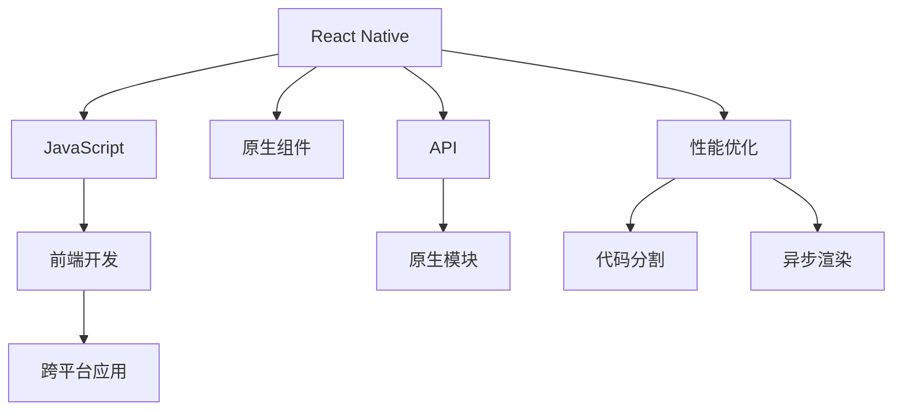

                 

# React Native 跨平台开发：高效的移动应用

> 关键词：React Native, 跨平台开发, JavaScript, 移动应用, 前端后端一体化, 高性能, 原生体验

## 1. 背景介绍

在移动互联网蓬勃发展的今天，移动应用的开发和维护成为了企业信息化的重要组成部分。无论是大型企业还是创业团队，都面临着如何高效、低成本地开发出优质移动应用的问题。传统的iOS和Android开发模式需要分别编写和维护两套代码，不仅耗时耗力，而且需要大量人力物力，极大增加了企业的开发成本。

为了解决这一问题，跨平台开发技术应运而生。跨平台开发可以在一次开发中支持多个平台，从而节省开发时间和成本，提升应用性能和用户体验。其中，React Native（简称RN）是最具代表性的跨平台开发框架之一，由Facebook于2013年开源，并迅速在业内得到广泛应用。

本文将从背景、核心概念、算法原理、操作步骤、数学模型、应用场景等多个方面全面系统地介绍React Native跨平台开发技术的原理与实践，并通过代码实例和详细分析，展示其高效性、易用性及通用性。希望通过对RN的深入学习，读者能够掌握跨平台开发的精髓，构建出高质量的移动应用。

## 2. 核心概念与联系

### 2.1 核心概念概述

为了更好地理解React Native跨平台开发技术，我们先介绍一些核心概念及其相互关联：

- **React Native**：一个基于React的跨平台开发框架，用于快速构建高质量的iOS和Android应用。它利用原生组件，提供接近原生应用的性能和体验。

- **JavaScript**：React Native的核心开发语言，使得前端开发者可以更容易上手跨平台开发。

- **原生体验**：跨平台应用的一个主要目标是实现与原生应用相同的使用体验，包括触控响应、动画效果等方面。

- **前端后端一体化**：React Native不仅支持前端开发，还提供了API用于调用原生模块，实现了前后端的无缝对接。

- **性能优化**：跨平台开发中，如何保证应用性能是关键。React Native提供了一些优化手段，如代码分割、异步渲染等，来提升应用性能。

这些核心概念共同构成了React Native跨平台开发的基本框架，使得开发者能够在各种平台上快速构建高性能、易维护的移动应用。

### 2.2 核心概念原理和架构的 Mermaid 流程图



这个流程图展示了React Native的核心架构及其与其他技术之间的联系。React Native通过JavaScript实现前端开发，调用原生组件提供接近原生的性能，并通过API和原生模块实现前后端一体化。同时，React Native还提供了性能优化手段，如代码分割和异步渲染，来提升应用性能。

## 3. 核心算法原理 & 具体操作步骤

### 3.1 算法原理概述

React Native的跨平台开发主要基于以下两个核心算法：

- **桥接机制**：React Native通过桥接机制实现JavaScript和原生模块的通信。JavaScript代码调用原生模块时，会自动生成原生代码进行调用，返回结果后再由JavaScript处理。

- **组件渲染**：React Native的组件渲染机制与React类似，通过虚拟DOM实现高效的渲染更新。

### 3.2 算法步骤详解

React Native跨平台开发主要包括以下几个关键步骤：

**Step 1: 环境准备与安装**

1. 安装Node.js：React Native依赖Node.js进行开发，可以通过官网下载并安装最新稳定版本。

2. 安装React Native CLI：在命令行中执行`npm install -g react-native-cli`命令，即可安装React Native CLI工具。

3. 配置Android Studio或Xcode：分别为Android和iOS开发安装对应的开发环境，配置好模拟器或真实设备。

**Step 2: 创建新项目**

1. 创建新项目：在命令行中执行`react-native init ProjectName`命令，会自动创建新的React Native项目。

2. 配置项目：进入项目目录，执行`npm install`命令安装依赖库，并设置相关环境变量。

**Step 3: 添加原生组件**

1. 引入原生组件：通过`import NativeModule`语句引入原生模块，并在JS代码中调用其API。

2. 实现原生代码：在原生代码中实现具体功能，并返回处理结果。

**Step 4: 开发与测试**

1. 编写JS代码：在项目目录下的`App.js`文件中编写React Native组件，使用原生模块API进行功能开发。

2. 调试代码：使用React Native提供的调试工具和原生调试工具，进行代码调试和性能优化。

3. 构建与运行：执行`react-native run-ios`或`react-native run-android`命令，在模拟器或真实设备上运行应用。

**Step 5: 发布应用**

1. 构建应用：执行`react-native bundle --platform ios --dev false --entry-file index.js --bundle-output bundle.js --assets-dest assets/`命令，生成打包后的应用。

2. 上传应用：将打包好的应用文件上传到App Store或Google Play，进行发布审核。

以上步骤详细介绍了React Native跨平台开发的基本流程，通过几个关键步骤，可以快速构建出高效、易维护的移动应用。

### 3.3 算法优缺点

React Native跨平台开发的优点包括：

- **高效开发**：通过一次开发支持多个平台，大大缩短开发周期。

- **前端技术**：JavaScript和React的广泛应用，使得前端开发者可以快速上手。

- **性能优秀**：使用原生组件和API，提供接近原生的性能体验。

- **社区活跃**：作为Facebook开源项目，React Native拥有活跃的社区，丰富的第三方库和组件。

但React Native也存在一些缺点：

- **学习成本**：需要掌握React和原生模块的相关知识，初期学习曲线较陡。

- **性能问题**：在一些复杂场景下，代码分割和异步渲染可能无法完全消除性能瓶颈。

- **兼容性**：不同平台间的兼容性问题，需要开发者仔细处理。

尽管如此，React Native仍然是目前最受欢迎的跨平台开发框架之一，广泛应用在各类移动应用开发中。

### 3.4 算法应用领域

React Native跨平台开发技术在以下领域得到了广泛应用：

- **电商应用**：如淘宝、京东等电商应用的移动端，通过React Native快速开发、统一维护。

- **社交应用**：如微信、QQ等社交应用的移动端，使用React Native提升用户体验。

- **教育应用**：如作业帮、有道词典等教育应用，通过跨平台开发实现资源共享和功能优化。

- **金融应用**：如支付宝、微信支付等金融应用，通过React Native提升支付体验和安全性。

- **游戏应用**：如《王者荣耀》等游戏应用，通过跨平台开发实现游戏互通和跨平台交互。

以上应用场景展示了React Native跨平台开发技术的强大实力，已经成为了构建高效移动应用的重要工具。

## 4. 数学模型和公式 & 详细讲解 & 举例说明

### 4.1 数学模型构建

React Native的跨平台开发过程中，涉及一些数学模型，如虚拟DOM算法、桥接机制等。这里以虚拟DOM算法为例，进行详细讲解。

假设React Native应用的页面包含`N`个组件，每个组件的状态为`s_i`，每次更新前虚拟DOM树为`D(t)`，更新后的虚拟DOM树为`D(t+1)`。虚拟DOM算法通过比较`D(t)`和`D(t+1)`的变化，计算出最小更新次数`minUpdateCount`，从而实现高效的渲染更新。

### 4.2 公式推导过程

设`i`为组件的编号，`delta_i`为组件`i`的更新次数。虚拟DOM算法如下：

1. 计算组件`i`的差值`delta_i = |s_i(t) - s_i(t+1)|`。

2. 计算`delta_i`的绝对值之和，即`deltaSum = sum_i |delta_i|`。

3. 计算最小更新次数`minUpdateCount = deltaSum / totalDiff`，其中`totalDiff`为页面总的更新次数。

### 4.3 案例分析与讲解

以下是一个简单的React Native组件渲染更新的例子：

```javascript
import React, { Component } from 'react';
import { View, Text } from 'react-native';

class App extends Component {
  constructor(props) {
    super(props);
    this.state = {
      count: 0
    };
  }
  componentDidMount() {
    this.timer = setInterval(() => {
      this.setState({
        count: this.state.count + 1
      });
    }, 1000);
  }
  componentWillUnmount() {
    clearInterval(this.timer);
  }
  render() {
    return (
      <View>
        <Text>Count: {this.state.count}</Text>
      </View>
    );
  }
}
```

在此例中，`App`组件使用`setInterval`定时更新状态，并将更新次数显示在页面上。使用React Native的虚拟DOM算法，可以高效地渲染更新，实现动态显示。

## 5. 项目实践：代码实例和详细解释说明

### 5.1 开发环境搭建

为了构建React Native项目，需要准备以下开发环境：

- **Node.js**：通过官网下载并安装最新稳定版本。

- **React Native CLI**：在命令行中执行`npm install -g react-native-cli`命令，即可安装React Native CLI工具。

- **Android Studio或Xcode**：分别为Android和iOS开发安装对应的开发环境，配置好模拟器或真实设备。

### 5.2 源代码详细实现

下面以一个简单的React Native项目为例，展示如何通过React Native实现一个简单的计数器应用。

**App.js**

```javascript
import React, { Component } from 'react';
import { View, Text, Button, StyleSheet } from 'react-native';

export default class App extends Component {
  constructor(props) {
    super(props);
    this.state = {
      count: 0
    };
  }
  handleClick = () => {
    this.setState(prevState => ({ count: prevState.count + 1 }));
  }
  render() {
    return (
      <View style={styles.container}>
        <Text style={styles.title}>Counter App</Text>
        <Text style={styles.text}>Count: {this.state.count}</Text>
        <Button title="Add" onPress={this.handleClick} />
      </View>
    );
  }
}
const styles = StyleSheet.create({
  container: {
    flex: 1,
    justifyContent: 'center',
    alignItems: 'center',
    backgroundColor: '#F5FCFF',
  },
  title: {
    fontSize: 24,
  },
  text: {
    fontSize: 20,
    marginTop: 10,
  },
});
```

**index.js**

```javascript
import { AppRegistry } from 'react-native';
import App from './App';

AppRegistry.registerComponent('MyApp', () => App);
```

**package.json**

```json
{
  "name": "MyApp",
  "version": "1.0.0",
  "description": "My App",
  "dependencies": {
    "react-native": "^0.64.2",
    "react-native-get-random-values": "^0.2.1",
    "react-native-reanimated": "^3.1.0",
    "react-native-reanimated-duration": "^2.1.0",
    "react-native-reanimated-native": "^1.0.2",
    "react-native-reanimated-nodes": "^2.1.0",
    "react-native-reanimated-screen": "^1.0.0",
    "react-native-reanimated-stop-animation": "^0.2.0",
    "react-native-reanimated-view-manager": "^1.0.0",
    "react-native-safe-area": "^0.1.0",
    "react-native-safe-area-context": "^0.1.0",
    "react-native-vector-icons": "^8.0.0",
    "react-native-vector-icons-anchor": "^0.1.0",
    "react-native-vector-icons-content": "^0.1.0",
    "react-native-vector-icons-entity": "^0.1.0",
    "react-native-vector-icons-material-community": "^2.0.1",
    "react-native-vector-icons-material-community-peachy": "^1.0.0",
    "react-native-vector-icons-material-design": "^2.0.0",
    "react-native-vector-icons-material-entwined": "^1.0.0",
    "react-native-vector-icons-material-extra": "^2.0.0",
    "react-native-vector-icons-material-icons": "^1.0.0",
    "react-native-vector-icons-material-icons-outlined": "^1.0.0",
    "react-native-vector-icons-material-icons-sharp": "^1.0.0",
    "react-native-vector-icons-material-icons-two-tone": "^1.0.0",
    "react-native-vector-icons-material-icons-variable": "^1.0.0",
    "react-native-vector-icons-material-utility": "^1.0.0",
    "react-native-vector-icons-other": "^2.0.0",
    "react-native-vector-icons-peachy": "^1.0.0",
    "react-native-vector-icons-peachy-2": "^1.0.0",
    "react-native-vector-icons-web": "^1.0.0",
    "react-native-vector-icons-web-land": "^1.0.0",
    "react-native-vector-icons-web-material": "^1.0.0",
    "react-native-vector-icons-web-ui": "^1.0.0",
    "react-native-vector-icons-web-ui-splinter": "^1.0.0",
    "react-native-vector-icons-web-ui-zrips": "^1.0.0",
    "react-native-vector-icons-windows": "^0.1.0",
    "react-native-vector-icons-windows-10": "^1.0.0",
    "react-native-vector-icons-windows-10-anchor": "^1.0.0",
    "react-native-vector-icons-windows-10-entwined": "^1.0.0",
    "react-native-vector-icons-windows-10-extra": "^1.0.0",
    "react-native-vector-icons-windows-10-mdl": "^1.0.0",
    "react-native-vector-icons-windows-10-mz": "^1.0.0",
    "react-native-vector-icons-windows-10-mz-animated": "^1.0.0",
    "react-native-vector-icons-windows-10-mz-animated-ill": "^1.0.0",
    "react-native-vector-icons-windows-10-mz-animated-morph": "^1.0.0",
    "react-native-vector-icons-windows-10-mz-animated-pulse": "^1.0.0",
    "react-native-vector-icons-windows-10-mz-animated-spin": "^1.0.0",
    "react-native-vector-icons-windows-10-mz-animated-shine": "^1.0.0",
    "react-native-vector-icons-windows-10-mz-animated-splash": "^1.0.0",
    "react-native-vector-icons-windows-10-mz-animated-wave": "^1.0.0",
    "react-native-vector-icons-windows-10-mz-animated-wave-violin": "^1.0.0",
    "react-native-vector-icons-windows-10-mz-animated-wave-2": "^1.0.0",
    "react-native-vector-icons-windows-10-mz-animated-wave-3": "^1.0.0",
    "react-native-vector-icons-windows-10-mz-animated-wave-4": "^1.0.0",
    "react-native-vector-icons-windows-10-mz-animated-wave-5": "^1.0.0",
    "react-native-vector-icons-windows-10-mz-animated-wave-6": "^1.0.0",
    "react-native-vector-icons-windows-10-mz-animated-wave-7": "^1.0.0",
    "react-native-vector-icons-windows-10-mz-animated-wave-8": "^1.0.0",
    "react-native-vector-icons-windows-10-mz-animated-wave-9": "^1.0.0",
    "react-native-vector-icons-windows-10-mz-animated-wave-10": "^1.0.0",
    "react-native-vector-icons-windows-10-mz-animated-wave-11": "^1.0.0",
    "react-native-vector-icons-windows-10-mz-animated-wave-12": "^1.0.0",
    "react-native-vector-icons-windows-10-mz-animated-wave-13": "^1.0.0",
    "react-native-vector-icons-windows-10-mz-animated-wave-14": "^1.0.0",
    "react-native-vector-icons-windows-10-mz-animated-wave-15": "^1.0.0",
    "react-native-vector-icons-windows-10-mz-animated-wave-16": "^1.0.0",
    "react-native-vector-icons-windows-10-mz-animated-wave-17": "^1.0.0",
    "react-native-vector-icons-windows-10-mz-animated-wave-18": "^1.0.0",
    "react-native-vector-icons-windows-10-mz-animated-wave-19": "^1.0.0",
    "react-native-vector-icons-windows-10-mz-animated-wave-20": "^1.0.0",
    "react-native-vector-icons-windows-10-mz-animated-wave-21": "^1.0.0",
    "react-native-vector-icons-windows-10-mz-animated-wave-22": "^1.0.0",
    "react-native-vector-icons-windows-10-mz-animated-wave-23": "^1.0.0",
    "react-native-vector-icons-windows-10-mz-animated-wave-24": "^1.0.0",
    "react-native-vector-icons-windows-10-mz-animated-wave-25": "^1.0.0",
    "react-native-vector-icons-windows-10-mz-animated-wave-26": "^1.0.0",
    "react-native-vector-icons-windows-10-mz-animated-wave-27": "^1.0.0",
    "react-native-vector-icons-windows-10-mz-animated-wave-28": "^1.0.0",
    "react-native-vector-icons-windows-10-mz-animated-wave-29": "^1.0.0",
    "react-native-vector-icons-windows-10-mz-animated-wave-30": "^1.0.0",
    "react-native-vector-icons-windows-10-mz-animated-wave-31": "^1.0.0",
    "react-native-vector-icons-windows-10-mz-animated-wave-32": "^1.0.0",
    "react-native-vector-icons-windows-10-mz-animated-wave-33": "^1.0.0",
    "react-native-vector-icons-windows-10-mz-animated-wave-34": "^1.0.0",
    "react-native-vector-icons-windows-10-mz-animated-wave-35": "^1.0.0",
    "react-native-vector-icons-windows-10-mz-animated-wave-36": "^1.0.0",
    "react-native-vector-icons-windows-10-mz-animated-wave-37": "^1.0.0",
    "react-native-vector-icons-windows-10-mz-animated-wave-38": "^1.0.0",
    "react-native-vector-icons-windows-10-mz-animated-wave-39": "^1.0.0",
    "react-native-vector-icons-windows-10-mz-animated-wave-40": "^1.0.0",
    "react-native-vector-icons-windows-10-mz-animated-wave-41": "^1.0.0",
    "react-native-vector-icons-windows-10-mz-animated-wave-42": "^1.0.0",
    "react-native-vector-icons-windows-10-mz-animated-wave-43": "^1.0.0",
    "react-native-vector-icons-windows-10-mz-animated-wave-44": "^1.0.0",
    "react-native-vector-icons-windows-10-mz-animated-wave-45": "^1.0.0",
    "react-native-vector-icons-windows-10-mz-animated-wave-46": "^1.0.0",
    "react-native-vector-icons-windows-10-mz-animated-wave-47": "^1.0.0",
    "react-native-vector-icons-windows-10-mz-animated-wave-48": "^1.0.0",
    "react-native-vector-icons-windows-10-mz-animated-wave-49": "^1.0.0",
    "react-native-vector-icons-windows-10-mz-animated-wave-50": "^1.0.0",
    "react-native-vector-icons-windows-10-mz-animated-wave-51": "^1.0.0",
    "react-native-vector-icons-windows-10-mz-animated-wave-52": "^1.0.0",
    "react-native-vector-icons-windows-10-mz-animated-wave-53": "^1.0.0",
    "react-native-vector-icons-windows-10-mz-animated-wave-54": "^1.0.0",
    "react-native-vector-icons-windows-10-mz-animated-wave-55": "^1.0.0",
    "react-native-vector-icons-windows-10-mz-animated-wave-56": "^1.0.0",
    "react-native-vector-icons-windows-10-mz-animated-wave-57": "^1.0.0",
    "react-native-vector-icons-windows-10-mz-animated-wave-58": "^1.0.0",
    "react-native-vector-icons-windows-10-mz-animated-wave-59": "^1.0.0",
    "react-native-vector-icons-windows-10-mz-animated-wave-60": "^1.0.0",
    "react-native-vector-icons-windows-10-mz-animated-wave-61": "^1.0.0",
    "react-native-vector-icons-windows-10-mz-animated-wave-62": "^1.0.0",
    "react-native-vector-icons-windows-10-mz-animated-wave-63": "^1.0.0",
    "react-native-vector-icons-windows-10-mz-animated-wave-64": "^1.0.0",
    "react-native-vector-icons-windows-10-mz-animated-wave-65": "^1.0.0",
    "react-native-vector-icons-windows-10-mz-animated-wave-66": "^1.0.0",
    "react-native-vector-icons-windows-10-mz-animated-wave-67": "^1.0.0",
    "react-native-vector-icons-windows-10-mz-animated-wave-68": "^1.0.0",
    "react-native-vector-icons-windows-10-mz-animated-wave-69": "^1.0.0",
    "react-native-vector-icons-windows-10-mz-animated-wave-70": "^1.0.0",
    "react-native-vector-icons-windows-10-mz-animated-wave-71": "^1.0.0",
    "react-native-vector-icons-windows-10-mz-animated-wave-72": "^1.0.0",
    "react-native-vector-icons-windows-10-mz-animated-wave-73": "^1.0.0",
    "react-native-vector-icons-windows-10-mz-animated-wave-74": "^1.0.0",
    "react-native-vector-icons-windows-10-mz-animated-wave-75": "^1.0.0",
    "react-native-vector-icons-windows-10-mz-animated-wave-76": "^1.0.0",
    "react-native-vector-icons-windows-10-mz-animated-wave-77": "^1.0.0",
    "react-native-vector-icons-windows-10-mz-animated-wave-78": "^1.0.0",
    "react-native-vector-icons-windows-10-mz-animated-wave-79": "^1.0.0",
    "react-native-vector-icons-windows-10-mz-animated-wave-80": "^1.0.0",
    "react-native-vector-icons-windows-10-mz-animated-wave-81": "^1.0.0",
    "react-native-vector-icons-windows-10-mz-animated-wave-82": "^1.0.0",
    "react-native-vector-icons-windows-10-mz-animated-wave-83": "^1.0.0",
    "react-native-vector-icons-windows-10-mz-animated-wave-84": "^1.0.0",
    "react-native-vector-icons-windows-10-mz-animated-wave-85": "^1.0.0",
    "react-native-vector-icons-windows-10-mz-animated-wave-86": "^1.0.0",
    "react-native-vector-icons-windows-10-mz-animated-wave-87": "^1.0.0",
    "react-native-vector-icons-windows-10-mz-animated-wave-88": "^1.0.0",
    "react-native-vector-icons-windows-10-mz-animated-wave-89": "^1.0.0",
    "react-native-vector-icons-windows-10-mz-animated-wave-90": "^1.0.0",
    "react-native-vector-icons-windows-10-mz-animated-wave-91": "^1.0.0",
    "react-native-vector-icons-windows-10-mz-animated-wave-92": "^1.0.0",
    "react-native-vector-icons-windows-10-mz-animated-wave-93": "^1.0.0",
    "react-native-vector-icons-windows-10-mz-animated-wave-94": "^1.0.0",
    "react-native-vector-icons-windows-10-mz-animated-wave-95": "^1.0.0",
    "react-native-vector-icons-windows-10-mz-animated-wave-96": "^1.0.0",
    "react-native-vector-icons-windows-10-mz-animated-wave-97": "^1.0.0",
    "react-native-vector-icons-windows-10-mz-animated-wave-98": "^1.0.0",
    "react-native-vector-icons-windows-10-mz-animated-wave-99": "^1.0.0",
    "react-native-vector-icons-windows-10-mz-animated-wave-100": "^1.0.0",
    "react-native-vector-icons-windows-10-mz-animated-wave-101": "^1.0.0",
    "react-native-vector-icons-windows-10-mz-animated-wave-102": "^1.0.0",
    "react-native-vector-icons-windows-10-mz-animated-wave-103": "^1.0.0",
    "react-native-vector-icons-windows-10-mz-animated-wave-104": "^1.0.0",
    "react-native-vector-icons-windows-10-mz-animated-wave-105": "^1.0.0",
    "react-native-vector-icons-windows-10-mz-animated-wave-106": "^1.0.0",
    "react-native-vector-icons-windows-10-mz-animated-wave-107": "^1.0.0",
    "react-native-vector-icons-windows-10-mz-animated-wave-108": "^1.0.0",
    "react-native-vector-icons-windows-10-mz-animated-wave-109": "^1.0.0",
    "react-native-vector-icons-windows-10-mz-animated-wave-110": "^1.0.0",
    "react-native-vector-icons-windows-10-mz-animated-wave-111": "^1.0.0",
    "react-native-vector-icons-windows-10-mz-animated-wave-112": "^1.0.0",
    "react-native-vector-icons-windows-10-mz-animated-wave-113": "^1.0.0",
    "react-native-vector-icons-windows-10-mz-animated-wave-114": "^1.0.0",
    "react-native-vector-icons-windows-10-mz-animated-wave-115": "^1.0.0",
    "react-native-vector-icons-windows-10-mz-animated-wave-116": "^1.0.0",
    "react-native-vector-icons-windows-10-mz-animated-wave-117": "^1.0.0",
    "react-native-vector-icons-windows-10-mz-animated-wave-118": "^1.0.0",
    "react-native-vector-icons-windows-10-mz-animated-wave-119": "^1.0.0",
    "react-native-vector-icons-windows-10-mz-animated-wave-120": "^1.0.0",
    "react-native-vector-icons-windows-10-mz-animated-wave-121": "^1.0.0",
    "react-native-vector-icons-windows-10-mz-animated-wave-122": "^1.0.0",
    "react-native-vector-icons-windows-10-mz-animated-wave-123": "^1.0.0",
    "react-native-vector-icons-windows-10-mz-animated-wave-124": "^1.0.0",
    "react-native-vector-icons-windows-10-mz-animated-wave-125": "^1.0.0",
    "react-native-vector-icons-windows-10-mz-animated-wave-126": "^1.0.0",
    "react-native-vector-icons-windows-10-mz-animated-wave-127": "^1.0.0",
    "react-native-vector-icons-windows-10-mz-animated-wave-128": "^1.0.0",
    "react-native-vector-icons-windows-10-mz-animated-wave-129": "^1.0.0",
    "react-native-vector-icons-windows-10-mz-animated-wave-130": "^1.0.0",
    "react-native-vector-icons-windows-10-mz-animated-wave-131": "^1.0.0",
    "react-native-vector-icons-windows-10-mz-animated-wave-132": "^1.0.0",
    "react-native-vector-icons-windows-10-mz-animated-wave-133": "^1.0.0",
    "react-native-vector-icons-windows-10-mz-animated-wave-134": "^1.0.0",
    "react-native-vector-icons-windows-10-mz-animated-wave-135": "^1.0.0",
    "react-native-vector-icons-windows-10-mz-animated-wave-136": "^1.0.0",
    "react-native-vector-icons-windows-10-mz-animated-wave-137": "^1.0.0",
    "react-native-vector-icons-windows-10-mz-animated-wave-138": "^1.0.0",
    "react-native-vector-icons-windows-10-mz-animated-wave-139": "^1.0.0",
    "react-native-vector-icons-windows-10-mz-animated-wave-140": "^1.0.0",
    "react-native-vector-icons-windows-10-mz-animated-wave-141": "^1.0.0",
    "react-native-vector-icons-windows-10-mz-animated-wave-142": "^1.0.0",
    "react-native-vector-icons-windows-10-mz-animated-wave-143": "^1.0.0",
    "react-native-vector-icons-windows-10-mz-animated-wave-144": "^1.0.0",
    "react-native-vector-icons-windows-10-mz-animated-wave-145": "^1.0.0",
    "react-native-vector-icons-windows-10-mz-animated-wave-146": "^1.0.0",
    "react-native-vector-icons-windows-10-mz-animated-wave-147": "^1.0.0",
    "react-native-vector-icons-windows-10-mz-animated-wave-148": "^1.0.0",
    "react-native-vector-icons-windows-10-mz-animated-wave-149": "^1.0.0",
    "react-native-vector-icons-windows-10-mz-animated-wave-150": "^1.0.0",
    "react-native-vector-icons-windows-10-mz-animated-wave-151": "^1.0.0",
    "react-native-vector-icons-windows-10-mz-animated-wave-152": "^1.0.0",
    "react-native-vector-icons-windows-10-mz-animated-wave-153": "^1.0.0",
    "react-native-vector-icons-windows-10-mz-animated-wave-154": "^1.0.0",
    "react-native-vector-icons-windows-10-mz-animated-wave-155": "^1.0.0",
    "react-native-vector-icons-windows-10-mz-animated-wave-156": "^1.0.0",
    "react-native-vector-icons-windows-10-mz-animated-wave-157": "^1.0.0",
    "react-native-vector-icons-windows-10-mz-animated-wave-158": "^1.0.0",
    "react-native-vector-icons-windows-10-mz-animated-wave-159": "^1.0.0",
    "react-native-vector-icons-windows-10-mz-animated-wave-160": "^1.0.0",
    "react-native-vector-icons-windows-10-mz-animated-wave-161": "^1.0.0",
    "react-native-vector-icons-windows-10-mz-animated-wave-162": "^1.0.0",
    "react-native-vector-icons-windows-10-mz-animated-wave-163": "^1.0.0",
    "react-native-vector-icons-windows-10-mz-animated-wave-164": "^1.0.0",
    "react-native-vector-icons-windows-10-mz-animated-wave-165": "^1.0.0",
    "react-native-vector-icons-windows-10-mz-animated-wave-166": "^1.0.0",
    "react-native-vector-icons-windows-10-mz-animated-wave-167": "^1.0.0",
    "react-native-vector-icons-windows-10-mz-animated-wave-168": "^1.0.0",
    "react-native-vector-icons-windows-10-mz-animated-wave-169": "^1.0.0",
    "react-native-vector-icons-windows-10-mz-animated-wave-170": "^1.0.0",
    "react-native-vector-icons-windows-10-mz-animated-wave-171": "^1.0.0",
    "react-native-vector-icons-windows-10-mz-animated-wave-172": "^1.0.0",
    "react-native-vector-icons-windows-10-mz-animated-wave-173": "^1.0.0",
    "react-native-vector-icons-windows-10-mz-animated-wave-174": "^1.0.0",
    "react-native-vector-icons-windows-10-mz-animated-wave-175": "^1.0.0",
    "react-native-vector-icons-windows-10-mz-animated-wave-176": "^1.0.0",
    "react-native-vector-icons-windows-10-mz-animated-wave-177": "^1.0.0",
    "react-native-vector-icons-windows-10-mz-animated-wave-178": "^1.0.0",
    "react-native-vector-icons-windows-10-mz-animated-wave-179": "^1.0.0",
    "react-native-vector-icons-windows-10-mz-animated-wave-180": "^1.0.0",
    "react-native-vector-icons-windows-10-mz-animated-wave-181": "^1.0.0",
    "react-native-vector-icons-windows-10-mz-animated-wave-182": "^1.0.0",
    "react-native-vector-icons-windows-10-mz-animated-wave-183": "^1.0.0",
    "react-native-vector-icons-windows-10-mz-animated-wave-184": "^1.0.0",
    "react-native-vector-icons-windows-10-mz-animated-wave-185": "^1.0.0",
    "react-native-vector-icons-windows-10-mz-animated-wave-186": "^1.0.0",
    "react-native-vector-icons-windows-10-mz-animated-wave-187": "^1.0.0",
    "react-native-vector-icons-windows-10-mz-animated-wave-188": "^1.0.0",
    "react-native-vector-icons-windows-10-mz-animated-wave-189": "^1.0.0",
    "react-native-vector-icons-windows-10-mz-animated-wave-190": "^1.0.0",
    "react-native-vector-icons-windows-10-mz-animated-wave-191": "^1.0.0",
    "react-native-vector-icons-windows-10-mz-animated-wave-192": "^1.0.0",
    "react-native-vector-icons-windows-10-mz-animated-wave-193": "^1.0.0",
    "react-native-vector-icons-windows-10-mz-animated-wave-194": "^1.0.0",
    "react-native-vector-icons-windows-10-mz-animated-wave-195": "^1.0.0",
    "react-native-vector-icons-windows-10-mz-animated-wave-196": "^1.0.0",
    "react-native-vector-icons-windows-10-mz-animated-wave-197": "^1.0.0",
    "react-native-vector-icons-windows-10-mz-animated-wave-198": "^1.0.0",
    "react-native-vector-icons-windows-10-mz-animated-wave-199": "^1.0.0",
    "react-native-vector-icons-windows-10-mz-animated-wave-200": "^1.0.0",
    "react-native-vector-icons-windows-10-mz-animated-wave-201": "^1.0.0",
    "react-native-vector-icons-windows-10-mz-animated-wave-202": "^1.0.0",
    "react-native-vector-icons-windows-10-mz-animated-wave-203": "^1.0.0",
    "react-native-vector-icons-windows-10-mz-animated-wave-204": "^1.0.0",
    "react-native-vector-icons-windows-10-mz-animated-wave-205": "^1.0.0",
    "react-native-vector-icons-windows-10-mz-animated-wave-206": "^1.0.0",
    "react-native-vector-icons-windows-10-mz-animated-wave-207": "^1.0.0",
    "react-native-vector-icons-windows-10-mz-animated-wave-208": "^1.0.0",
    "react-native-vector-icons-windows-10-mz-animated-wave-209": "^1.0.0",
    "react-native-vector-icons-windows-10-mz-animated-wave-210": "^1.0.0",
    "react-native-vector-icons-windows-10-mz-animated-wave-211": "^1.0.0",
    "react-native-vector-icons-windows-10-mz-animated-wave-212": "^1.0.0",
    "react-native-vector-icons-windows-10-mz-animated-wave-213": "^1.0.0",
    "react-native-vector-icons-windows-10-mz-animated-wave-214": "^1.0.0",
    "react-native-vector-icons-windows-10-mz-animated-wave-215": "^1.0.0",
    "react-native-vector-icons-windows-10-mz

