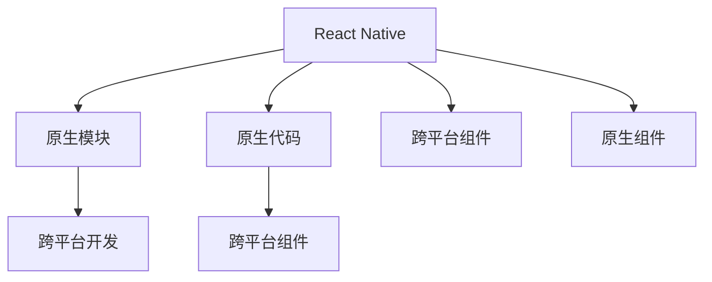

                 

# React Native原生模块开发

> 关键词：React Native, Native模块, Java, Kotlin, Python, Android, iOS, 跨平台开发

## 1. 背景介绍

### 1.1 问题由来
随着移动互联网应用的迅速增长，跨平台移动应用开发的需求日益增加。传统的iOS和Android平台开发模式各异，开发成本高，且应用难以跨平台共用。为了解决这个问题，Facebook在2013年推出了React Native这一跨平台移动应用开发框架，允许开发者使用JavaScript和React编写可在iOS和Android上运行的移动应用。

React Native的核心思想是“编写一次，跑在四处”，利用原生组件和样式，实现跨平台应用的高性能和原生体验。然而，React Native在性能和体验上仍有提升空间，特别是在一些需要直接与原生系统交互的场景下，如网络请求、设备传感器、第三方库调用等，原生模块成为不可或缺的工具。

### 1.2 问题核心关键点
原生模块是React Native中用于调用原生系统的API或第三方库的关键组件。通过原生模块，开发者可以实现更加灵活、高效、安全的跨平台功能。原生模块的开发和维护是React Native开发中一个非常重要的环节，需要开发者具备一定的原生编程经验和跨平台开发能力。

本文将详细介绍React Native原生模块的原理、开发步骤、优化技巧以及未来展望，为开发者提供全面的指导。

## 2. 核心概念与联系

### 2.1 核心概念概述

为更好地理解React Native原生模块开发，本节将介绍几个密切相关的核心概念：

- React Native：由Facebook开发的跨平台移动应用开发框架，利用JavaScript和React编写跨平台应用，同时利用原生组件提供高性能和原生体验。
- 原生模块：允许React Native应用调用原生系统的API或第三方库，实现跨平台应用的高性能和原生体验。
- 原生代码：指React Native应用的底层代码，包括Swift、Java、Kotlin等原生代码，用于实现原生组件和功能。
- 跨平台开发：指一次编写，多平台运行的应用开发模式，利用一个框架实现不同平台的应用开发，如iOS和Android应用开发。
- 原生组件：React Native中的原生UI组件，提供高性能和原生体验，可以调用原生API实现更多功能。
- 跨平台组件：React Native中的跨平台UI组件，如Text、View、Image等，可以在iOS和Android上运行，但功能可能不如原生组件丰富。

这些核心概念之间的逻辑关系可以通过以下Mermaid流程图来展示：



这个流程图展示了一些核心概念之间的逻辑关系：

1. React Native通过原生组件提供高性能和原生体验，通过跨平台组件实现跨平台应用开发。
2. 原生模块是React Native中调用原生API和第三方库的关键组件，实现跨平台应用的功能。
3. 原生代码和原生组件是实现原生模块的基础。
4. 跨平台开发通过React Native实现，利用原生模块调用原生API。

这些概念共同构成了React Native应用的开发框架，使其能够在不同平台上提供高性能和原生体验。

## 3. 核心算法原理 & 具体操作步骤
### 3.1 算法原理概述

React Native原生模块的开发主要包括以下几个关键步骤：

1. 设计原生模块的接口和功能。
2. 编写原生模块的代码，实现其功能。
3. 在React Native应用中调用原生模块，实现跨平台功能。
4. 测试和优化原生模块，确保其在不同平台上的性能和稳定性。

这些步骤主要依赖于React Native提供的模块化编程模型，将原生模块的接口、实现和调用封装在一起，实现跨平台应用的功能。

### 3.2 算法步骤详解

#### 3.2.1 设计原生模块的接口和功能

原生模块的接口和功能设计是原生模块开发的关键，决定了其能否被其他开发者有效使用。

原生模块的接口包括两个部分：

- 方法接口：定义原生模块中可供调用的方法。
- 属性接口：定义原生模块中可供获取的属性。

方法接口和属性接口的命名规则为：

- 方法接口：以动词开头，描述该方法的功能，例如`startService()`表示启动服务。
- 属性接口：以名词开头，描述该属性的含义，例如`isRunning`表示服务是否正在运行。

接口设计要考虑以下几个原则：

- 简单易用：接口的命名要直观明了，易于理解。
- 兼容性：接口要在不同平台上提供相同的功能。
- 安全性：避免暴露敏感信息或函数，确保接口的安全性。

#### 3.2.2 编写原生模块的代码

原生模块的代码通常使用Swift、Java或Kotlin等原生语言编写。以下是Java语言编写的原生模块示例：

```java
package com.facebook.react;

public class MyModule implements ReactModule {
    @Override
    public String getName() {
        return "MyModule";
    }

    @Override
    public void initialize() {
        // 初始化代码
    }

    @Override
    public void onCatalystInstanceCreated(CatalystInstance instance) {
        // Catalyst实例创建时调用
    }

    @Override
    public void onCatalystInstanceDestroyed(CatalystInstance instance) {
        // Catalyst实例销毁时调用
    }

    public static native String greet(String name);

    static {
        System.loadLibrary("MyModule");
    }
}
```

在这个示例中，`MyModule`类实现了`ReactModule`接口，并定义了一个名为`greet`的本地方法。`initialize`和`onCatalystInstanceCreated`等方法用于初始化和生命周期管理，确保原生模块的正常运行。

#### 3.2.3 在React Native应用中调用原生模块

在React Native应用中调用原生模块，可以通过以下步骤实现：

1. 导入原生模块：通过`react-native-importmodule`工具生成C++代码，并在React Native应用中导入。
2. 调用原生模块：使用JavaScript调用原生模块的方法或属性。

以下是一个在React Native应用中调用原生模块的示例：

```js
import MyModule from 'MyModule';

MyModule.greet('Tom', function (response) {
    console.log('Hello, ' + response);
});
```

在这个示例中，`MyModule`原生模块被导入到React Native应用中，调用`greet`方法，并传入参数`'Tom'`。`greet`方法会在原生模块中执行，并将结果返回给React Native应用。

#### 3.2.4 测试和优化原生模块

原生模块的测试和优化是确保其性能和稳定性关键步骤。测试和优化主要包括以下几个方面：

- 单元测试：编写单元测试，确保原生模块中每个函数和方法的正常运行。
- 性能测试：使用性能测试工具，评估原生模块的性能瓶颈，优化代码实现。
- 跨平台测试：在不同平台上运行原生模块，确保其在不同平台上的兼容性和稳定性。

### 3.3 算法优缺点

React Native原生模块开发具有以下优点：

1. 性能高：原生模块可以直接调用原生系统的API，实现高性能的应用功能。
2. 跨平台性好：原生模块可以在不同平台上提供相同的功能，实现跨平台应用开发。
3. 安全性高：原生模块可以直接访问原生系统的权限，确保应用的安全性。
4. 开发效率高：利用React Native的组件和API，可以快速实现应用功能。

然而，原生模块开发也存在一些缺点：

1. 开发复杂度高：原生模块的开发需要具备原生编程经验和跨平台开发能力。
2. 跨平台兼容性差：原生模块在不同平台上的兼容性可能存在问题。
3. 维护难度大：原生模块的维护需要具备原生编程和跨平台开发能力。
4. 代码冗余度高：原生模块需要编写大量的原生代码，导致代码冗余度高。

## 4. 数学模型和公式 & 详细讲解 & 举例说明

### 4.1 数学模型构建

原生模块的开发主要依赖于原生代码和React Native API的结合。在数学模型上，原生模块的开发可以简化为原生代码的编写和React Native API的调用。

### 4.2 公式推导过程

在原生模块的开发过程中，涉及的主要公式推导包括：

- 原生模块接口设计：接口的方法和属性命名规则。
- 原生模块代码实现：原生代码的编写和调用。
- 原生模块调用：React Native API的调用。

这些公式推导在原生模块的开发中具有重要意义，确保原生模块的接口、实现和调用符合设计规范，实现高性能和跨平台功能。

### 4.3 案例分析与讲解

以一个简单的原生模块示例进行分析：

```java
package com.facebook.react;

public class MyModule implements ReactModule {
    @Override
    public String getName() {
        return "MyModule";
    }

    @Override
    public void initialize() {
        // 初始化代码
    }

    @Override
    public void onCatalystInstanceCreated(CatalystInstance instance) {
        // Catalyst实例创建时调用
    }

    @Override
    public void onCatalystInstanceDestroyed(CatalystInstance instance) {
        // Catalyst实例销毁时调用
    }

    public static native String greet(String name);

    static {
        System.loadLibrary("MyModule");
    }
}
```

在这个示例中，`MyModule`类实现了`ReactModule`接口，并定义了一个名为`greet`的本地方法。`initialize`和`onCatalystInstanceCreated`等方法用于初始化和生命周期管理，确保原生模块的正常运行。

在React Native应用中调用原生模块的代码示例：

```js
import MyModule from 'MyModule';

MyModule.greet('Tom', function (response) {
    console.log('Hello, ' + response);
});
```

在这个示例中，`MyModule`原生模块被导入到React Native应用中，调用`greet`方法，并传入参数`'Tom'`。`greet`方法会在原生模块中执行，并将结果返回给React Native应用。

## 5. 项目实践：代码实例和详细解释说明
### 5.1 开发环境搭建

在进行React Native原生模块开发前，需要搭建好开发环境。以下是使用Java进行Android原生模块开发的搭建流程：

1. 安装Android Studio：从官网下载并安装Android Studio，用于创建Android应用。
2. 安装Android NDK：从官网下载并安装Android NDK，用于调用原生代码。
3. 安装Java开发环境：确保Android Studio中Java开发环境配置正确，可以编译Java代码。

完成上述步骤后，即可在Android Studio中开始原生模块的开发。

### 5.2 源代码详细实现

以下是Java语言编写的原生模块示例：

```java
package com.facebook.react;

public class MyModule implements ReactModule {
    @Override
    public String getName() {
        return "MyModule";
    }

    @Override
    public void initialize() {
        // 初始化代码
    }

    @Override
    public void onCatalystInstanceCreated(CatalystInstance instance) {
        // Catalyst实例创建时调用
    }

    @Override
    public void onCatalystInstanceDestroyed(CatalystInstance instance) {
        // Catalyst实例销毁时调用
    }

    public static native String greet(String name);

    static {
        System.loadLibrary("MyModule");
    }
}
```

在这个示例中，`MyModule`类实现了`ReactModule`接口，并定义了一个名为`greet`的本地方法。`initialize`和`onCatalystInstanceCreated`等方法用于初始化和生命周期管理，确保原生模块的正常运行。

### 5.3 代码解读与分析

让我们再详细解读一下关键代码的实现细节：

- `MyModule`类：实现`ReactModule`接口，定义原生模块的接口和功能。
- `initialize`和`onCatalystInstanceCreated`方法：用于初始化和生命周期管理，确保原生模块的正常运行。
- `greet`方法：定义一个本地方法，实现该功能。

在React Native应用中调用原生模块的代码示例：

```js
import MyModule from 'MyModule';

MyModule.greet('Tom', function (response) {
    console.log('Hello, ' + response);
});
```

在这个示例中，`MyModule`原生模块被导入到React Native应用中，调用`greet`方法，并传入参数`'Tom'`。`greet`方法会在原生模块中执行，并将结果返回给React Native应用。

### 5.4 运行结果展示

在React Native应用中调用原生模块，可以输出以下结果：

```
Hello, Tom
```

以上代码示例展示了如何在React Native应用中调用原生模块，实现跨平台应用的功能。

## 6. 实际应用场景

### 6.1 跨平台移动应用

原生模块在跨平台移动应用开发中具有重要应用。通过原生模块，开发者可以轻松实现跨平台应用的个性化功能，如推送通知、网络请求、第三方库调用等。这些功能可以大幅提升应用的性能和用户体验，实现更加灵活和高效的应用开发。

### 6.2 增强现实应用

增强现实应用需要与用户交互，实现复杂的实时渲染和数据处理。原生模块可以实现这些功能，提供高性能和原生体验。例如，可以利用原生模块调用设备的传感器数据，实现交互式增强现实应用。

### 6.3 游戏开发

游戏开发需要实现复杂的游戏逻辑和图形渲染。原生模块可以提供高性能和原生体验，实现游戏的跨平台运行。例如，可以利用原生模块调用设备的图形渲染API，实现高性能的图形渲染。

### 6.4 未来应用展望

未来，原生模块将在更多的应用场景中发挥作用，带来更多的创新和突破。例如：

- 跨平台移动应用：原生模块将实现更多的跨平台功能，提供更高的性能和用户体验。
- 增强现实应用：原生模块将实现更复杂、更丰富的交互功能，提升增强现实应用的体验。
- 游戏开发：原生模块将实现更高的性能和更好的图形渲染效果，提升游戏应用的品质。

原生模块将在更多的应用场景中发挥作用，推动跨平台应用开发的发展，提升应用的质量和用户体验。

## 7. 工具和资源推荐
### 7.1 学习资源推荐

为了帮助开发者系统掌握React Native原生模块开发的技术，这里推荐一些优质的学习资源：

1. React Native官方文档：React Native的官方文档，提供了原生模块的详细说明和示例代码。
2. Android NDK官方文档：Android NDK的官方文档，提供了原生代码的详细说明和示例代码。
3. Java核心技术：Java核心技术书籍，介绍了Java语言和Android开发的基础知识。
4. React Native官方培训：React Native的官方培训课程，帮助开发者系统掌握React Native开发技能。
5. Android开发入门指南：Android开发入门指南书籍，介绍了Android开发的基础知识和实践技能。

通过对这些资源的学习实践，相信你一定能够快速掌握React Native原生模块开发的精髓，并用于解决实际的开发问题。

### 7.2 开发工具推荐

高效的开发离不开优秀的工具支持。以下是几款用于React Native原生模块开发的常用工具：

1. Android Studio：由Google开发的Android开发环境，提供了丰富的原生开发工具和调试功能。
2. IntelliJ IDEA：由JetBrains开发的Java开发环境，提供了强大的Java开发功能和调试工具。
3. Xcode：由Apple开发的iOS开发环境，提供了丰富的原生开发工具和调试功能。
4. Visual Studio Code：由Microsoft开发的跨平台IDE，支持JavaScript和Java等语言。

合理利用这些工具，可以显著提升React Native原生模块开发的效率，加快创新迭代的步伐。

### 7.3 相关论文推荐

原生模块的开发和研究一直是React Native开发中的热点话题。以下是几篇奠基性的相关论文，推荐阅读：

1. React Native: A Framework for Building Native Modules and Components
2. Native Modules in React Native: A Survey
3. A Survey on Cross-Platform Mobile App Development Frameworks
4. Building Cross-Platform Applications with React Native and Native Modules
5. Developing Cross-Platform Applications with React Native and Native Modules

这些论文代表了大语言模型微调技术的发展脉络。通过学习这些前沿成果，可以帮助研究者把握学科前进方向，激发更多的创新灵感。

## 8. 总结：未来发展趋势与挑战

### 8.1 总结

本文对React Native原生模块开发进行了全面系统的介绍。首先阐述了原生模块在React Native开发中的重要地位，明确了原生模块对实现高性能和跨平台应用的关键作用。其次，从原理到实践，详细讲解了原生模块的接口设计、代码实现和调用方法，给出了原生模块开发的完整代码实例。同时，本文还探讨了原生模块在跨平台移动应用、增强现实应用、游戏开发等场景中的应用，展示了原生模块的广泛应用前景。最后，本文推荐了原生模块开发的学习资源和开发工具，为开发者提供全面的指导。

通过本文的系统梳理，可以看到，React Native原生模块开发在跨平台应用开发中具有重要应用，能够实现高性能和原生体验，提升应用的性能和用户体验。未来，原生模块将在更多的应用场景中发挥作用，推动跨平台应用开发的发展，提升应用的质量和用户体验。

### 8.2 未来发展趋势

展望未来，React Native原生模块开发将呈现以下几个发展趋势：

1. 性能优化：原生模块的性能优化将更加重要，开发者需要利用原生API优化代码实现，提升应用的性能。
2. 跨平台兼容性：原生模块的跨平台兼容性将进一步提升，开发者需要关注不同平台之间的兼容性问题。
3. 开发者友好：原生模块的开发将更加友好，开发者可以通过简单的接口和API调用原生功能，降低开发难度。
4. 工具支持：原生模块的开发工具将更加丰富，开发者可以利用更多工具提高开发效率。
5. 生态系统：原生模块的生态系统将更加完善，开发者可以利用更多的第三方库和组件，提升开发效率。

这些趋势将进一步推动原生模块的开发，提升React Native应用的质量和用户体验。

### 8.3 面临的挑战

尽管React Native原生模块开发已经取得了一定的进展，但在迈向更加智能化、普适化应用的过程中，它仍面临着诸多挑战：

1. 原生模块开发复杂度高：原生模块的开发需要具备原生编程经验和跨平台开发能力，开发难度较大。
2. 跨平台兼容性差：原生模块在不同平台上的兼容性可能存在问题，需要更多优化和调试。
3. 代码冗余度高：原生模块需要编写大量的原生代码，导致代码冗余度高，维护难度大。
4. 开发者资源匮乏：原生模块的开发者资源匮乏，导致原生模块的开发和维护存在瓶颈。

这些挑战将需要在未来的开发中逐步克服，推动原生模块的进一步发展。

### 8.4 研究展望

面对React Native原生模块开发所面临的挑战，未来的研究需要在以下几个方面寻求新的突破：

1. 简化原生模块开发：开发工具和框架的优化，降低原生模块开发的难度和复杂度。
2. 提升原生模块性能：优化原生代码实现，提升原生模块的性能和用户体验。
3. 增强原生模块兼容性：关注不同平台之间的兼容性问题，提升原生模块的跨平台兼容性。
4. 引入更多第三方库：引入更多的第三方库和组件，提升原生模块的开发效率和功能丰富度。
5. 关注原生模块安全性：原生模块的安全性问题，确保原生模块的安全性和稳定性。

这些研究方向的探索，将推动原生模块的进一步发展，提升React Native应用的性能和用户体验。

## 9. 附录：常见问题与解答

**Q1：React Native原生模块如何调用原生系统的API？**

A: React Native原生模块通过JNI（Java Native Interface）或JNI_OnLoad方法，调用原生系统的API。在Java中，可以使用JNI调用原生系统API；在C++中，可以使用JNI_OnLoad方法注册原生模块，并调用原生系统API。

**Q2：React Native原生模块的性能瓶颈在哪里？**

A: React Native原生模块的性能瓶颈主要在于原生代码的实现和调用。原生代码的实现和调用需要考虑多线程、内存管理等问题，容易导致性能瓶颈。开发者需要优化原生代码的实现，减少内存占用，提高代码执行效率。

**Q3：React Native原生模块如何跨平台兼容？**

A: React Native原生模块的跨平台兼容需要考虑不同平台之间的API差异。开发者可以通过抽象层实现跨平台兼容，使用统一的界面和逻辑，确保原生模块在不同平台上的兼容性。同时，开发者需要关注不同平台之间的API差异，确保原生模块的跨平台兼容性。

**Q4：React Native原生模块如何优化性能？**

A: React Native原生模块的性能优化主要在于原生代码的实现和调用。开发者需要优化原生代码的实现，减少内存占用，提高代码执行效率。同时，开发者需要关注原生模块的跨平台兼容性，确保原生模块在不同平台上的性能表现。

**Q5：React Native原生模块如何调试？**

A: React Native原生模块的调试可以通过日志输出、断点调试等方法进行。开发者可以使用Android Studio等工具，进行调试原生模块的代码实现和调用。同时，开发者可以使用React Native的调试工具，如React Native Debugger，进行调试React Native应用和原生模块的交互。

以上是关于React Native原生模块开发的全方位指导，希望能对开发者有所帮助。

