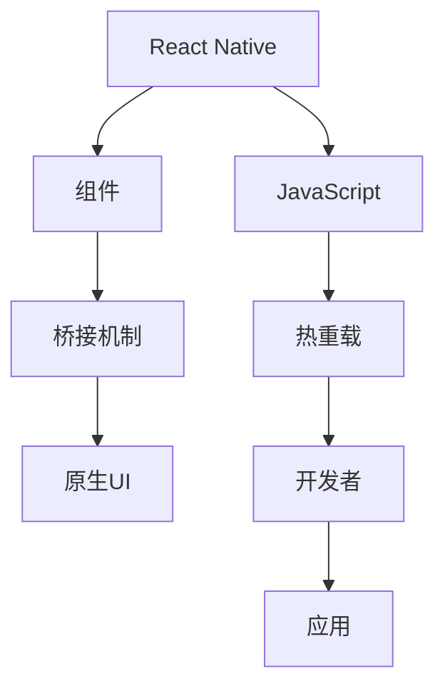

                 

# React Native：JavaScript驱动的原生移动应用开发

> 关键词：React Native, 原生移动应用开发, JavaScript, 跨平台开发, 跨平台移动应用

## 1. 背景介绍

### 1.1 问题由来
随着移动互联网的发展，越来越多的企业希望通过移动应用提升用户体验和业务效率。传统的Native应用开发需要分别针对iOS和Android平台进行独立开发，不仅开发成本高，而且上线后需要分别维护，大大增加了维护成本。为此，各大开发工具商纷纷推出了跨平台移动应用开发框架，帮助企业快速构建高效、一致的原生移动应用。

React Native正是在这样的背景下应运而生。由Facebook推出的React Native是一种基于JavaScript的跨平台移动应用开发框架，它可以让开发者使用JavaScript和React编写一次代码，生成可运行在iOS和Android上的原生应用。React Native的优点在于其原生性能、跨平台兼容性和组件重用性，使得开发者可以高效地开发跨平台应用，提升开发效率和应用性能。

### 1.2 问题核心关键点
React Native的核心在于将JavaScript和React与原生UI框架相结合，允许开发者编写类似Web应用的代码，但运行在原生平台上。其核心技术原理包括以下几个关键点：

- 组件复用：通过组件复用，提升开发效率和代码可维护性。
- 桥接机制：通过JavaScript到原生组件的桥接，实现原生的UI渲染和交互。
- 热重载：通过热重载功能，开发者可以实时看到代码的修改效果，提升开发效率。
- 性能优化：通过原生组件、异步渲染等技术，提升应用的性能。

本文将详细探讨React Native的核心概念与技术原理，结合实例代码，深入讲解React Native的开发流程和性能优化策略，帮助开发者更好地掌握React Native技术，构建高质量的原生移动应用。

## 2. 核心概念与联系

### 2.1 核心概念概述

为更好地理解React Native的技术原理和开发流程，本节将介绍几个密切相关的核心概念：

- React Native：由Facebook推出的基于JavaScript的跨平台移动应用开发框架，用于构建高效、一致的原生应用。
- JavaScript：用于React Native应用开发的脚本语言，用于描述应用的行为和逻辑。
- 组件：React Native中的基本单元，类似于Web应用中的HTML标签，用于描述应用的用户界面和逻辑结构。
- 桥接机制：React Native通过桥接机制，实现JavaScript代码与原生组件之间的通信。
- 热重载：React Native的调试工具，通过热重载，开发者可以实时看到代码修改效果，提升开发效率。

这些核心概念之间的逻辑关系可以通过以下Mermaid流程图来展示：



这个流程图展示React Native的核心概念及其之间的关系：

1. React Native通过JavaScript和React提供应用的行为和逻辑。
2. 组件是React Native中的基本单元，用于描述用户界面和逻辑结构。
3. 桥接机制用于连接JavaScript和原生组件，实现数据的传递和交互。
4. 热重载工具帮助开发者实时查看代码修改效果，提升开发效率。
5. 开发者使用React Native工具构建应用，最终生成原生应用。

## 3. 核心算法原理 & 具体操作步骤
### 3.1 算法原理概述

React Native的核心算法原理主要包括以下几个方面：

1. 组件模型：React Native基于组件模型构建应用，通过组件复用，提升开发效率和代码可维护性。
2. 桥接机制：React Native通过桥接机制，实现JavaScript和原生组件之间的数据传递和交互。
3. 热重载：React Native的热重载功能，允许开发者实时看到代码的修改效果，提升开发效率。
4. 性能优化：通过原生组件、异步渲染等技术，提升应用的性能。

### 3.2 算法步骤详解

React Native的开发流程可以分为以下几个关键步骤：

**Step 1: 环境准备**
- 安装Node.js和React Native CLI
- 安装Android Studio和Xcode
- 创建新项目或克隆现有项目

**Step 2: 配置开发环境**
- 配置Android和iOS的开发环境
- 设置React Native的依赖库

**Step 3: 编写代码**
- 创建新组件或使用现有组件
- 编写JavaScript代码实现应用逻辑
- 调用原生模块实现原生功能

**Step 4: 运行应用**
- 在模拟器或真机上运行应用
- 使用热重载功能调试代码

**Step 5: 测试和优化**
- 进行单元测试和集成测试
- 使用性能分析工具优化应用性能

**Step 6: 发布应用**
- 打包应用生成原生安装包
- 发布应用到应用商店

以下是React Native开发流程的详细描述：

### 3.3 算法优缺点

React Native具有以下优点：
1. 跨平台开发：React Native支持iOS和Android平台，减少多平台开发的成本和时间。
2. 组件复用：React Native组件可以跨平台使用，提升开发效率和代码可维护性。
3. 热重载：热重载功能大大提升开发效率，开发者可以实时看到代码修改效果。
4. 原生性能：React Native使用原生组件和异步渲染，保证应用性能。

同时，React Native也存在以下缺点：
1. 性能瓶颈：原生代码和JavaScript代码的桥接机制存在性能瓶颈，需要开发者注意优化。
2. 组件适配：部分组件在不同平台上的适配存在问题，需要开发者自行解决。
3. 库支持：部分第三方库在React Native上支持不完善，需要开发者自行适配。

### 3.4 算法应用领域

React Native广泛应用于各种移动应用开发，如社交网络、电子商务、企业应用等。其核心技术原理也适用于其他跨平台开发框架，如Ionic、Flutter等。

## 4. 数学模型和公式 & 详细讲解
### 4.1 数学模型构建

React Native的开发基于组件模型，以下是React Native组件的数学模型构建：

**组件模型定义：**

设一个React Native组件为 $C$，其包含的子组件为 $C_1, C_2, \dots, C_n$，对应的状态为 $s_1, s_2, \dots, s_n$。设该组件的状态为 $s$，则组件的数学模型可以表示为：

$$
C = (C_1, C_2, \dots, C_n, s_1, s_2, \dots, s_n, s)
$$

其中，$C_1, C_2, \dots, C_n$ 为子组件，$s_1, s_2, \dots, s_n$ 为子组件的状态，$s$ 为组件的状态。

### 4.2 公式推导过程

在React Native中，组件的状态更新是一个递归的过程。假设组件 $C$ 的状态更新函数为 $f$，则组件状态更新过程可以表示为：

$$
s_{i+1} = f(s_i, C_i)
$$

其中，$s_i$ 为组件 $C_i$ 的状态，$f$ 为状态更新函数。

通过递归调用状态更新函数，可以不断更新组件状态，实现组件的状态更新。

### 4.3 案例分析与讲解

以下是一个React Native组件的状态更新示例：

```javascript
import React, { useState } from 'react';
import { View, Text } from 'react-native';

function Counter() {
  const [count, setCount] = useState(0);
  
  const handleIncrement = () => {
    setCount(count + 1);
  }
  
  return (
    <View>
      <Text>{count}</Text>
      <Button title="Increment" onPress={handleIncrement} />
    </View>
  );
}
```

在这个示例中，Counter组件包含一个状态count和一个子组件Button。当用户点击按钮时，通过调用handleIncrement函数更新count状态。通过递归调用状态更新函数，实现组件状态的更新。

## 5. 项目实践：代码实例和详细解释说明
### 5.1 开发环境搭建

在进行React Native开发前，我们需要准备好开发环境。以下是安装React Native的开发环境的步骤：

1. 安装Node.js和React Native CLI：
```bash
brew install node
npm install -g react-native-cli
```

2. 安装Android Studio和Xcode：
在Android Studio中创建一个新的Android项目，在Xcode中创建一个新的iOS项目。

3. 创建新项目或克隆现有项目：
```bash
react-native init MyProject
```

### 5.2 源代码详细实现

以下是一个React Native应用的示例，实现一个简单的待办事项列表：

```javascript
import React, { useState } from 'react';
import { View, Text, TextInput, Button, FlatList } from 'react-native';

function TodoList() {
  const [todos, setTodos] = useState([]);
  const [newTodo, setNewTodo] = useState('');
  
  const handleAddTodo = () => {
    setTodos([...todos, newTodo]);
    setNewTodo('');
  }
  
  const handleDeleteTodo = (item) => {
    setTodos(todos.filter(todo => todo !== item));
  }
  
  return (
    <View>
      <TextInput
        placeholder="Add new todo"
        value={newTodo}
        onChangeText={setNewTodo}
      />
      <Button title="Add" onPress={handleAddTodo} />
      
      <FlatList
        data={todos}
        renderItem={({ item }) => (
          <View>
            <Text>{item}</Text>
            <Button title="Delete" onPress={() => handleDeleteTodo(item)} />
          </View>
        )}
      />
    </View>
  );
}
```

在这个示例中，TodoList组件包含一个TextInput和一个FlatList，用于输入待办事项并显示待办事项列表。通过useState钩子声明状态，实现待办事项的添加和删除功能。

### 5.3 代码解读与分析

**TodoList组件的实现：**

1. 使用useState钩子声明状态：useState用于声明组件的状态，通过set函数更新状态。
2. 使用TextInput和Button组件：TextInput用于输入待办事项，Button用于添加待办事项。
3. 使用FlatList组件：FlatList用于显示待办事项列表，通过renderItem属性自定义列表项的渲染方式。

**状态更新函数：**

1. 通过useState钩子声明状态：useState用于声明组件的状态，通过set函数更新状态。
2. 使用Array的filter方法：filter方法用于过滤待办事项列表，删除用户删除的待办事项。
3. 使用Array的map方法：map方法用于将待办事项列表映射为列表项，渲染到FlatList中。

## 6. 实际应用场景

### 6.1 智能日历应用

智能日历应用是一种常见的移动应用，用于记录和提醒用户的日程安排。React Native可以用于快速构建智能日历应用，提升用户体验和功能丰富性。

以下是一个React Native智能日历应用的示例：

```javascript
import React, { useState } from 'react';
import { View, Text, TextInput, Button } from 'react-native';

function Calendar() {
  const [events, setEvents] = useState([]);
  const [newEvent, setNewEvent] = useState('');
  
  const handleAddEvent = () => {
    setEvents([...events, newEvent]);
    setNewEvent('');
  }
  
  return (
    <View>
      <TextInput
        placeholder="Add new event"
        value={newEvent}
        onChangeText={setNewEvent}
      />
      <Button title="Add" onPress={handleAddEvent} />
      
      {events.map(event => (
        <Text key={event}>{event}</Text>
      ))}
    </View>
  );
}
```

在这个示例中，Calendar组件包含一个TextInput和一个Button，用于输入事件并添加事件。通过useState钩子声明状态，实现事件的添加和显示功能。

### 6.2 电子商务应用

电子商务应用是一种常见的移动应用，用于展示和购买商品。React Native可以用于快速构建电子商务应用，提升用户体验和交易安全性。

以下是一个React Native电子商务应用的示例：

```javascript
import React, { useState } from 'react';
import { View, Text, TextInput, Button } from 'react-native';

function ECommerce() {
  const [products, setProducts] = useState([]);
  const [newProduct, setNewProduct] = useState('');
  
  const handleAddProduct = () => {
    setProducts([...products, newProduct]);
    setNewProduct('');
  }
  
  return (
    <View>
      <TextInput
        placeholder="Add new product"
        value={newProduct}
        onChangeText={setNewProduct}
      />
      <Button title="Add" onPress={handleAddProduct} />
      
      {products.map(product => (
        <Text key={product}>{product}</Text>
      ))}
    </View>
  );
}
```

在这个示例中，ECommerce组件包含一个TextInput和一个Button，用于输入商品并添加商品。通过useState钩子声明状态，实现商品的添加和显示功能。

### 6.3 企业应用

企业应用是一种常见的移动应用，用于管理企业的各项业务。React Native可以用于快速构建企业应用，提升企业的管理效率和自动化水平。

以下是一个React Native企业应用的示例：

```javascript
import React, { useState } from 'react';
import { View, Text, TextInput, Button } from 'react-native';

function Enterprise() {
  const [employees, setEmployees] = useState([]);
  const [newEmployee, setNewEmployee] = useState('');
  
  const handleAddEmployee = () => {
    setEmployees([...employees, newEmployee]);
    setNewEmployee('');
  }
  
  return (
    <View>
      <TextInput
        placeholder="Add new employee"
        value={newEmployee}
        onChangeText={setNewEmployee}
      />
      <Button title="Add" onPress={handleAddEmployee} />
      
      {employees.map(employee => (
        <Text key={employee}>{employee}</Text>
      ))}
    </View>
  );
}
```

在这个示例中，Enterprise组件包含一个TextInput和一个Button，用于输入员工并添加员工。通过useState钩子声明状态，实现员工的添加和显示功能。

### 6.4 未来应用展望

随着React Native技术的发展，其在移动应用开发中的应用场景将更加广泛。未来的应用趋势包括：

1. 性能优化：React Native的性能优化将是未来研究的一个重要方向。通过原生组件、异步渲染等技术，提升应用的性能。
2. 组件适配：进一步提升React Native组件在不同平台上的适配能力，减少开发者适配工作量。
3. 热重载优化：提升热重载工具的性能和稳定性，提升开发效率。
4. 社区支持：进一步提升社区的活跃度和支持力度，吸引更多的开发者和企业使用React Native。

## 7. 工具和资源推荐

### 7.1 学习资源推荐

为了帮助开发者系统掌握React Native的技术基础和实践技巧，这里推荐一些优质的学习资源：

1. React Native官方文档：React Native的官方文档详细介绍了React Native的技术原理和开发流程，是开发者学习React Native的最佳资源。
2. React Native官网教程：React Native官网提供了丰富的开发教程和示例，帮助开发者快速上手React Native。
3. React Native实战项目：React Native实战项目提供了大量实用的开发案例和代码示例，帮助开发者掌握React Native的实践技巧。
4. React Native社区：React Native社区是一个活跃的技术社区，提供了丰富的技术讨论和资源分享，是开发者获取最新技术动态的好地方。

通过对这些资源的学习实践，相信你一定能够快速掌握React Native技术，并用于解决实际的开发问题。

### 7.2 开发工具推荐

高效的开发离不开优秀的工具支持。以下是几款用于React Native开发常用的工具：

1. VS Code：一款轻量级、高效的代码编辑器，支持React Native开发，插件丰富，使用便捷。
2. Android Studio和Xcode：React Native在Android和iOS平台上的开发工具，提供丰富的开发环境和调试工具。
3. React Native CLI：React Native的命令行工具，提供快速创建和管理项目的功能。
4. Expo：一个React Native开发框架，提供了丰富的开发工具和组件库，帮助开发者快速构建原生应用。

合理利用这些工具，可以显著提升React Native开发的效率，加快创新迭代的步伐。

### 7.3 相关论文推荐

React Native技术的发展源于学界的持续研究。以下是几篇奠基性的相关论文，推荐阅读：

1. React Native官方白皮书：React Native官方发布的《React Native白皮书》详细介绍了React Native的技术原理和开发流程，是开发者学习React Native的重要参考。
2. React Native架构设计：论文《React Native的架构设计》深入探讨了React Native的架构设计和实现细节，帮助开发者理解React Native的核心技术原理。
3. React Native性能优化：论文《React Native性能优化》详细介绍了React Native的性能优化策略，包括原生组件、异步渲染等技术，帮助开发者提升应用性能。

这些论文代表React Native技术的发展脉络。通过学习这些前沿成果，可以帮助研究者把握学科前进方向，激发更多的创新灵感。

## 8. 总结：未来发展趋势与挑战

### 8.1 总结

本文对React Native的技术原理和开发流程进行了全面系统的介绍。首先阐述了React Native的核心概念和技术原理，明确了React Native在跨平台移动应用开发中的重要作用。其次，从组件模型、桥接机制、热重载等角度，详细讲解了React Native的开发流程和性能优化策略，帮助开发者更好地掌握React Native技术。

通过本文的系统梳理，可以看到，React Native技术正在成为跨平台移动应用开发的重要范式，极大地提升了移动应用开发的效率和质量。未来，伴随React Native技术的不断发展，更多的开发者和企业将采用React Native进行移动应用开发，推动移动应用行业的快速发展。

### 8.2 未来发展趋势

展望未来，React Native技术将呈现以下几个发展趋势：

1. 性能优化：React Native的性能优化将是未来研究的一个重要方向。通过原生组件、异步渲染等技术，提升应用的性能。
2. 组件适配：进一步提升React Native组件在不同平台上的适配能力，减少开发者适配工作量。
3. 热重载优化：提升热重载工具的性能和稳定性，提升开发效率。
4. 社区支持：进一步提升社区的活跃度和支持力度，吸引更多的开发者和企业使用React Native。

以上趋势凸显了React Native技术的广阔前景。这些方向的探索发展，必将进一步提升React Native的性能和开发效率，为开发者和企业提供更加高效、一致的原生移动应用开发方案。

### 8.3 面临的挑战

尽管React Native技术已经取得了巨大的成功，但在迈向更加智能化、普适化应用的过程中，它仍面临着诸多挑战：

1. 性能瓶颈：原生代码和JavaScript代码的桥接机制存在性能瓶颈，需要开发者注意优化。
2. 组件适配：部分组件在不同平台上的适配存在问题，需要开发者自行解决。
3. 社区支持：社区生态仍有待完善，需要更多开发者和企业参与，提升社区的活跃度和支持力度。
4. 库支持：部分第三方库在React Native上支持不完善，需要开发者自行适配。

### 8.4 研究展望

面对React Native面临的这些挑战，未来的研究需要在以下几个方面寻求新的突破：

1. 探索无阻塞桥接机制：进一步优化原生代码和JavaScript代码的桥接机制，提升性能。
2. 开发更加完备的组件库：提升React Native组件在不同平台上的适配能力，减少开发者适配工作量。
3. 完善社区生态：提升社区的活跃度和支持力度，吸引更多的开发者和企业使用React Native。
4. 丰富第三方库：开发更多的第三方库，提升React Native的功能丰富性和开发便捷性。

这些研究方向的探索，必将引领React Native技术迈向更高的台阶，为开发者和企业提供更加高效、一致的原生移动应用开发方案。

## 9. 附录：常见问题与解答

**Q1：React Native是否适用于所有平台？**

A: React Native支持iOS和Android平台，但对于其他平台（如Windows、Web等）的兼容性还需要进一步优化。

**Q2：React Native如何实现原生组件的调用？**

A: React Native通过桥接机制实现JavaScript和原生组件之间的数据传递和交互，调用原生组件需要开发者编写相应的Native代码。

**Q3：React Native的热重载功能如何调试？**

A: React Native的热重载功能通过自动化编译和运行，可以帮助开发者实时看到代码的修改效果。开发者需要在开发环境中开启热重载功能，并在代码修改后重新运行应用。

**Q4：React Native如何优化应用性能？**

A: React Native的性能优化主要从原生组件、异步渲染、内存管理等方面入手。开发者可以通过使用原生组件、避免不必要的渲染、优化内存管理等技术，提升应用性能。

**Q5：React Native如何实现跨平台组件复用？**

A: React Native通过组件复用，提升开发效率和代码可维护性。开发者可以通过自定义组件、复用现有组件等方法实现跨平台组件复用。

---

作者：禅与计算机程序设计艺术 / Zen and the Art of Computer Programming

