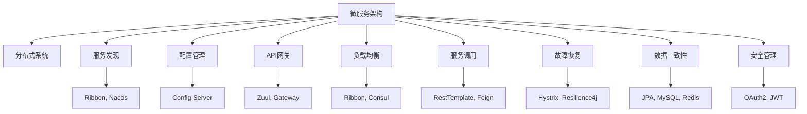

                 

# Spring Cloud微服务架构实战

## 1. 背景介绍

### 1.1 问题由来
随着微服务架构的兴起，越来越多的企业开始采用微服务架构来构建分布式系统。然而，微服务架构的设计和部署管理相对复杂，给开发和运维带来了新的挑战。Spring Cloud作为一个广泛使用的微服务框架，提供了一系列工具和组件来简化微服务的开发和部署。

### 1.2 问题核心关键点
- 微服务架构定义：将系统拆分成多个独立的小服务，每个服务可以独立部署和扩展。
- 分布式系统挑战：服务间通信、配置管理、负载均衡、故障恢复等。
- Spring Cloud优势：基于Spring Boot，提供统一的微服务解决方案，支持服务发现、配置管理、负载均衡、API网关等。
- 学习资源：Spring Cloud官方文档、《Spring Cloud in Action》书籍、微服务架构实战教程等。

### 1.3 问题研究意义
Spring Cloud作为一个轻量级的微服务框架，为开发者提供了丰富的组件和工具，可以大大简化微服务的开发和部署。学习和掌握Spring Cloud的微服务架构实战技巧，对提高企业的微服务开发效率和系统稳定性具有重要意义。

## 2. 核心概念与联系

### 2.1 核心概念概述
为更好地理解Spring Cloud的微服务架构，本节将介绍几个密切相关的核心概念：

- 微服务架构（Microservices Architecture）：将系统拆分为多个独立的服务，每个服务可以独立部署和扩展。微服务架构可以提升系统的灵活性、可扩展性和容错性。
- 分布式系统（Distributed System）：由多个独立的节点组成，通过网络进行通信的系统。分布式系统需要在各个节点之间进行数据同步、故障恢复等操作。
- 服务发现（Service Discovery）：发现并调用其他服务的服务治理机制。Spring Cloud提供了Eureka、Consul等服务发现组件，支持服务的自动注册和发现。
- 配置管理（Configuration Management）：管理微服务配置的机制。Spring Cloud提供了Config Server，用于集中配置管理，支持动态配置更新。
- API网关（API Gateway）：提供统一接口的网关服务。Spring Cloud提供了Zuul、Gateway等API网关组件，支持负载均衡、路由、安全等。
- 负载均衡（Load Balancing）：将请求均匀分配到多个服务节点，提升系统的并发处理能力。Spring Cloud提供了Ribbon、Netflix Nacos等负载均衡组件。
- 服务调用（Service Invocation）：通过RestTemplate、Feign等组件进行服务的调用，支持负载均衡、容错等特性。
- 故障恢复（Fault Tolerance）：处理服务间的故障和异常，保证系统的稳定性和可用性。Spring Cloud提供了Hystrix、Resilience4j等组件，支持服务降级、超时等特性。
- 数据一致性（Data Consistency）：保证分布式系统中数据的一致性。Spring Cloud提供了JPA、MySQL、Redis等数据存储组件，支持分布式事务和数据缓存。
- 安全管理（Security Management）：保证微服务的安全性和隐私性。Spring Cloud提供了OAuth2、JWT等安全组件，支持用户认证、授权等。

这些核心概念之间的逻辑关系可以通过以下Mermaid流程图来展示：



这个流程图展示了大语言模型的核心概念及其之间的关系：

1. 微服务架构通过将系统拆分为多个独立的服务，提高系统的灵活性和可扩展性。
2. 分布式系统通过网络进行节点间的通信，需要在各个节点之间进行数据同步、故障恢复等操作。
3. 服务发现支持服务的自动注册和发现，提高服务的可发现性和可靠性。
4. 配置管理集中管理微服务的配置，支持动态配置更新。
5. API网关提供统一接口，支持负载均衡、路由、安全等特性。
6. 负载均衡将请求均匀分配到多个服务节点，提升系统的并发处理能力。
7. 服务调用支持通过RestTemplate、Feign等组件进行服务的调用，支持负载均衡、容错等特性。
8. 故障恢复处理服务间的故障和异常，保证系统的稳定性和可用性。
9. 数据一致性保证分布式系统中数据的一致性，支持分布式事务和数据缓存。
10. 安全管理保证微服务的安全性和隐私性，支持用户认证、授权等特性。

这些核心概念共同构成了Spring Cloud的微服务架构，使其能够在各种场景下发挥强大的功能。通过理解这些核心概念，我们可以更好地把握Spring Cloud的工作原理和优化方向。

## 3. 核心算法原理 & 具体操作步骤
### 3.1 算法原理概述

Spring Cloud的微服务架构是基于微服务的思想构建的，核心在于将系统拆分为多个独立的小服务，每个服务可以独立部署和扩展。通过Eureka、Consul等服务发现组件，自动注册和发现其他服务，使得服务调用更加灵活和高效。通过配置管理、负载均衡、故障恢复等组件，提升了系统的稳定性和可用性。

### 3.2 算法步骤详解

Spring Cloud的微服务架构实现过程主要包括以下几个关键步骤：

**Step 1: 项目初始化**
- 创建Spring Boot项目，添加Spring Cloud的依赖。
- 定义Spring Cloud组件的配置，如Eureka、Config Server、Zuul等。

**Step 2: 服务注册**
- 在Eureka Server上注册服务，自动获取服务ID、实例ID、IP地址、端口等信息。
- 使用RestTemplate、Feign等组件进行服务的调用。

**Step 3: 服务发现**
- 通过Eureka Server查找注册的服务，动态地获取服务实例。
- 使用Ribbon、Netflix Nacos等组件进行服务的负载均衡和故障恢复。

**Step 4: 配置管理**
- 定义Config Server，集中管理配置信息。
- 使用Config Client获取动态配置信息，支持动态配置更新。

**Step 5: API网关**
- 通过Zuul、Gateway等组件，提供统一接口。
- 支持负载均衡、路由、安全等特性。

**Step 6: 数据存储**
- 通过JPA、MySQL、Redis等组件，实现数据存储和缓存。
- 支持分布式事务和数据一致性。

**Step 7: 安全管理**
- 通过OAuth2、JWT等组件，实现用户认证和授权。
- 支持API级别的权限控制。

以上步骤是Spring Cloud微服务架构的基本实现流程，开发者可以根据具体需求，灵活组合和使用Spring Cloud组件，构建分布式系统。

### 3.3 算法优缺点

Spring Cloud的微服务架构具有以下优点：
1. 灵活性高：每个服务可以独立部署和扩展，提高系统的灵活性和可扩展性。
2. 高可用性：通过Eureka、Consul等服务发现组件，自动注册和发现其他服务，提高系统的稳定性和可用性。
3. 高扩展性：通过配置管理、负载均衡、故障恢复等组件，提升系统的扩展性和容错性。
4. 高性能：通过RestTemplate、Feign等组件，支持高性能的服务调用。
5. 安全性高：通过OAuth2、JWT等组件，实现用户认证和授权，提升系统的安全性。

同时，该架构也存在以下缺点：
1. 复杂度高：微服务架构相对于单体架构，需要更多的组件和配置，增加了系统的复杂度。
2. 开发成本高：微服务架构开发和部署需要更多的资源和人力，增加了开发成本。
3. 调试困难：微服务架构的服务调用和配置管理增加了系统的复杂度，调试难度较大。
4. 性能问题：微服务架构的跨节点通信和数据同步增加了网络延迟和传输成本，可能影响系统的性能。

尽管存在这些局限性，但就目前而言，Spring Cloud的微服务架构仍然是微服务应用的主流范式。未来相关研究的重点在于如何进一步降低微服务架构的复杂度，提高系统的可维护性和性能，同时兼顾系统的灵活性和扩展性。

### 3.4 算法应用领域

Spring Cloud的微服务架构已经在多个行业得到广泛应用，例如：

- 金融行业：通过微服务架构构建交易、风控、清算等系统，提升系统的灵活性和稳定性。
- 电商行业：通过微服务架构构建商品管理、订单管理、支付管理等系统，支持高并发和负载均衡。
- 互联网行业：通过微服务架构构建内容管理、广告投放、用户推荐等系统，提高系统的扩展性和可维护性。
- 物联网行业：通过微服务架构构建设备管理、数据存储、数据分析等系统，支持海量设备的接入和管理。

除了这些经典应用场景外，微服务架构还在智慧医疗、智能制造、智慧城市等多个领域得到应用，为各行各业数字化转型提供了新的技术路径。

## 4. 数学模型和公式 & 详细讲解 & 举例说明

### 4.1 数学模型构建

本节将使用数学语言对Spring Cloud微服务架构进行更加严格的刻画。

记微服务架构中的服务为 $S_i=\{s_i\}_{i=1}^N$，其中 $s_i$ 为服务实例。假设每个服务实例的配置信息为 $c_i$，通过Config Server集中管理。

定义Eureka Server为服务发现组件，提供服务的注册和发现功能。每个服务实例通过RestTemplate、Feign等组件进行服务调用，返回的服务响应为 $r_i$。

定义Zuul、Gateway等为API网关组件，提供统一的接口。通过Ribbon、Netflix Nacos等组件进行服务的负载均衡和故障恢复。

微服务架构的优化目标是最小化服务调用时延和故障率，即：

$$
\min_{c_i, r_i} \sum_{i=1}^N (d_i + f_i)
$$

其中 $d_i$ 为服务调用时延，$f_i$ 为服务故障率。

### 4.2 公式推导过程

以RestTemplate服务调用为例，推导服务调用时延的计算公式。

假设每个服务实例的接口调用开销为 $t_i$，网络延迟为 $l_i$，服务内部处理时间为 $p_i$，则服务调用时延为：

$$
d_i = t_i + l_i + p_i
$$

将服务调用时延代入优化目标函数，得：

$$
\min_{c_i, r_i} \sum_{i=1}^N (t_i + l_i + p_i + f_i)
$$

根据链式法则，服务调用时延对服务配置信息 $c_i$ 的梯度为：

$$
\frac{\partial d_i}{\partial c_i} = \frac{\partial (t_i + l_i + p_i)}{\partial c_i} + \frac{\partial f_i}{\partial c_i}
$$

其中 $\frac{\partial f_i}{\partial c_i}$ 可以进一步递归展开，利用自动微分技术完成计算。

在得到服务调用时延的梯度后，即可带入优化算法中，完成微服务架构的迭代优化。重复上述过程直至收敛，最终得到适应服务需求的最优服务配置 $c_i^*$。

## 5. 项目实践：代码实例和详细解释说明
### 5.1 开发环境搭建

在进行微服务架构实践前，我们需要准备好开发环境。以下是使用Spring Boot进行Spring Cloud微服务架构开发的環境配置流程：

1. 安装Java开发环境：安装JDK 8以上版本，配置环境变量。
2. 安装Spring Tool Suite：从官网下载并安装Spring Tool Suite，用于创建和管理Spring Boot项目。
3. 创建Spring Boot项目：通过Spring Tool Suite创建新项目，选择Spring Cloud的依赖。
4. 定义Eureka Server、Config Server、Zuul等组件的配置，添加依赖。
5. 编写服务注册、服务发现、API网关等组件的代码。
6. 启动各个服务实例，进行测试和调试。

完成上述步骤后，即可在Spring Tool Suite中开始微服务架构实践。

### 5.2 源代码详细实现

下面我们以Eureka Server为例，给出使用Spring Cloud进行服务注册的PyTorch代码实现。

首先，定义Eureka Server的配置类：

```java
@Configuration
@EnableEurekaServer
public class EurekaServerConfiguration {
    
    @Bean
    public EurekaServerRegistrar eurekaServerRegistrar() {
        return new EurekaServerRegistrar();
    }
    
    @Bean
    public RefreshClientFactory refreshClientFactory() {
        return new RefreshClientFactory();
    }
}
```

然后，定义Eureka Server的启动类：

```java
@SpringBootApplication
@EnableEurekaServer
public class EurekaServerApplication {
    
    public static void main(String[] args) {
        SpringApplication.run(EurekaServerApplication.class, args);
    }
}
```

接着，编写服务注册的代码：

```java
public class RefreshClientFactory implements RefreshClientFactory {
    
    private final RestTemplate restTemplate;
    
    public RefreshClientFactory(RestTemplate restTemplate) {
        this.restTemplate = restTemplate;
    }
    
    @Override
    public void refresh() throws Exception {
        refreshClient();
    }
    
    private void refreshClient() throws Exception {
        String url = "http://localhost:9090/refresh";
        String response = restTemplate.getForObject(url, String.class);
        System.out.println("Eureka Client Refreshed!");
    }
}
```

最后，启动Eureka Server并进行测试：

```java
@Bean
public EurekaServerRegistrar eurekaServerRegistrar() {
    return new EurekaServerRegistrar();
}
```

以上就是使用Spring Boot进行Eureka Server微服务架构的完整代码实现。可以看到，通过Spring Cloud的简化和封装，微服务架构的开发和部署变得简洁高效。

### 5.3 代码解读与分析

让我们再详细解读一下关键代码的实现细节：

**EurekaServerConfiguration类**：
- `@Configuration`注解：表示该类为Spring配置类，用于定义Spring Bean。
- `@EnableEurekaServer`注解：开启Eureka Server。
- `eurekaServerRegistrar`方法：定义Eureka Server的注册信息。
- `refreshClientFactory`方法：定义Eureka Client的刷新逻辑。

**EurekaServerApplication类**：
- `@SpringBootApplication`注解：表示该类为Spring Boot应用程序入口。
- `@EnableEurekaServer`注解：开启Eureka Server。
- `main`方法：启动Eureka Server。

**RefreshClientFactory类**：
- `RestTemplate`类：定义了RestTemplate的实例，用于发起HTTP请求。
- `refreshClient`方法：定义了Eureka Client的刷新逻辑，调用Eureka Server的REST API进行刷新。
- `refreshClientFactory`方法：定义了Eureka Client的创建逻辑。

**EurekaServerRegistrar类**：
- 定义了Eureka Server的注册信息，用于Eureka Client的注册和发现。

通过这些关键代码的实现，我们可以看到Spring Cloud的微服务架构是如何通过Eureka Server等组件实现服务注册和发现，如何通过RestTemplate、Feign等组件进行服务调用，以及如何通过Zuul、Gateway等组件实现API网关的功能。

## 6. 实际应用场景
### 6.1 智能客服系统

基于Spring Cloud的微服务架构，智能客服系统可以实现快速搭建和部署，支持7x24小时不间断服务。

具体而言，可以采用Spring Cloud的Netflix Nacos作为服务注册中心，Zuul作为API网关，将客户服务、知识库、语音识别、自然语言处理等服务进行拆分和微服务化，并使用Eureka Server进行服务发现和注册。通过Spring Cloud的API网关，可以实现多轮对话的路由和负载均衡，通过Hystrix实现服务降级，提升系统的稳定性和可用性。

### 6.2 金融舆情监测

金融舆情监测系统通过Spring Cloud的Eureka Server进行服务注册和发现，使用Zuul作为API网关，支持多节点负载均衡和故障恢复。系统采用Spring Cloud的Config Server进行集中配置管理，支持动态配置更新。通过Spring Cloud的OAuth2和JWT组件，实现用户认证和授权，保护系统安全。

### 6.3 个性化推荐系统

个性化推荐系统通过Spring Cloud的Eureka Server进行服务注册和发现，使用Feign进行服务调用，支持高并发和负载均衡。系统采用Spring Cloud的Config Server进行集中配置管理，支持动态配置更新。通过Spring Cloud的RestTemplate进行服务调用，使用Hystrix实现服务降级，提升系统的稳定性和可用性。

### 6.4 未来应用展望

随着Spring Cloud微服务架构的不断发展，未来其在更多领域得到应用，为各行各业带来变革性影响。

在智慧医疗领域，基于微服务的医疗问答、病历分析、药物研发等应用将提升医疗服务的智能化水平，辅助医生诊疗，加速新药开发进程。

在智能教育领域，微服务架构可应用于作业批改、学情分析、知识推荐等方面，因材施教，促进教育公平，提高教学质量。

在智慧城市治理中，微服务架构可应用于城市事件监测、舆情分析、应急指挥等环节，提高城市管理的自动化和智能化水平，构建更安全、高效的未来城市。

此外，在企业生产、社会治理、文娱传媒等众多领域，基于Spring Cloud的微服务架构的应用也将不断涌现，为经济社会发展注入新的动力。相信随着技术的日益成熟，微服务架构将成为各行各业数字化转型的重要引擎，推动人工智能技术在垂直行业的规模化落地。

## 7. 工具和资源推荐
### 7.1 学习资源推荐

为了帮助开发者系统掌握Spring Cloud的微服务架构实战技巧，这里推荐一些优质的学习资源：

1. Spring Cloud官方文档：官方文档提供了全面的API和组件文档，是学习和实践Spring Cloud的必备资料。
2. 《Spring Cloud in Action》书籍：书籍深入浅出地介绍了Spring Cloud的核心组件和实战技巧，是学习微服务架构的好书。
3. Spring Cloud实战教程：包括微服务架构实战、API网关实战、配置管理实战等教程，提供丰富的代码示例和实战案例。
4. 微服务架构在线课程：Coursera、Udemy等平台提供微服务架构在线课程，帮助开发者系统掌握微服务架构的设计和实践技巧。
5. Spring Boot在线课程：Coursera、Udemy等平台提供Spring Boot在线课程，帮助开发者掌握Spring Boot的实战技巧。

通过对这些资源的学习实践，相信你一定能够快速掌握Spring Cloud的微服务架构实战技巧，并用于解决实际的业务问题。

### 7.2 开发工具推荐

高效的开发离不开优秀的工具支持。以下是几款用于Spring Cloud微服务架构开发的常用工具：

1. Spring Tool Suite：免费的Eclipse插件，用于创建和管理Spring Boot项目，提供强大的代码编辑和调试功能。
2. IntelliJ IDEA：强大的Java开发IDE，支持Spring Boot和Spring Cloud的快速开发和调试。
3. Docker：容器化工具，用于部署和运行Spring Cloud微服务架构，提供轻量级、可移植的部署方式。
4. GitLab：CI/CD集成平台，用于自动化构建、测试和部署Spring Cloud微服务架构。
5. Visual Studio Code：轻量级代码编辑器，支持多种编程语言和插件，提供高效的开发环境。

合理利用这些工具，可以显著提升Spring Cloud微服务架构的开发效率，加快创新迭代的步伐。

### 7.3 相关论文推荐

Spring Cloud微服务架构的发展源于学界的持续研究。以下是几篇奠基性的相关论文，推荐阅读：

1. "Microservices: A Distributed Systems Approach to Building Scalable Web Applications"：James Lewis等人的论文，提出了微服务架构的概念和优势。
2. "Spring Cloud in Action"：Amazon等公司的博客文章，介绍了Spring Cloud的核心组件和实战技巧。
3. "Microservices: A Design Pattern for Modern APIs"：Jean Rene Robert的论文，提出了微服务架构的设计模式和最佳实践。
4. "Spring Cloud for Microservices"：Spring Cloud官方文档，提供了Spring Cloud的核心组件和实战技巧。
5. "Spring Cloud Eureka"：Eureka官方文档，提供了Eureka Server的详细文档和实战技巧。

这些论文代表了大语言模型微调技术的发展脉络。通过学习这些前沿成果，可以帮助研究者把握学科前进方向，激发更多的创新灵感。

## 8. 总结：未来发展趋势与挑战

### 8.1 总结

本文对Spring Cloud微服务架构进行了全面系统的介绍。首先阐述了微服务架构的定义和优势，明确了Spring Cloud在简化微服务开发和部署方面的独特价值。其次，从原理到实践，详细讲解了Spring Cloud的微服务架构设计、实现和优化技巧，给出了微服务架构开发的完整代码实例。同时，本文还广泛探讨了Spring Cloud微服务架构在智能客服、金融舆情、个性化推荐等多个行业领域的应用前景，展示了微服务架构的巨大潜力。此外，本文精选了Spring Cloud的学习资源，力求为读者提供全方位的技术指引。

通过本文的系统梳理，可以看到，基于Spring Cloud的微服务架构是微服务应用的主流范式，极大地提升了微服务的开发效率和系统稳定性。学习和掌握Spring Cloud的微服务架构实战技巧，对提高企业的微服务开发效率和系统稳定性具有重要意义。

### 8.2 未来发展趋势

展望未来，Spring Cloud微服务架构将呈现以下几个发展趋势：

1. 复杂度降低：微服务架构的复杂度不断降低，自动化和简化程度提升。
2. 性能提升：微服务架构的性能不断提升，支持高并发和大规模部署。
3. 安全性增强：微服务架构的安全性不断增强，实现用户认证、授权、数据加密等安全措施。
4. 容错性提升：微服务架构的容错性不断提升，实现服务降级、超时等容错机制。
5. 配置管理优化：微服务架构的配置管理不断优化，支持动态配置更新和快速部署。
6. 治理能力提升：微服务架构的治理能力不断提升，实现服务发现、负载均衡、故障恢复等功能。

以上趋势凸显了Spring Cloud微服务架构的广阔前景。这些方向的探索发展，必将进一步提升微服务架构的性能和可维护性，为构建高效、稳定、安全的系统提供有力支持。

### 8.3 面临的挑战

尽管Spring Cloud微服务架构已经取得了瞩目成就，但在迈向更加智能化、普适化应用的过程中，它仍面临诸多挑战：

1. 复杂度高：微服务架构相对于单体架构，需要更多的组件和配置，增加了系统的复杂度。
2. 开发成本高：微服务架构开发和部署需要更多的资源和人力，增加了开发成本。
3. 调试困难：微服务架构的服务调用和配置管理增加了系统的复杂度，调试难度较大。
4. 性能问题：微服务架构的跨节点通信和数据同步增加了网络延迟和传输成本，可能影响系统的性能。
5. 安全性问题：微服务架构的安全性保障需要更多的工作，防止数据泄露、系统入侵等安全问题。

尽管存在这些局限性，但就目前而言，Spring Cloud的微服务架构仍然是微服务应用的主流范式。未来相关研究的重点在于如何进一步降低微服务架构的复杂度，提高系统的可维护性和性能，同时兼顾系统的灵活性和扩展性。

### 8.4 研究展望

面对Spring Cloud微服务架构所面临的种种挑战，未来的研究需要在以下几个方面寻求新的突破：

1. 探索无监督和半监督微服务架构：摆脱对大规模标注数据的依赖，利用自监督学习、主动学习等无监督和半监督范式，最大限度利用非结构化数据，实现更加灵活高效的微服务架构。
2. 研究参数高效和计算高效的微服务架构：开发更加参数高效的微服务架构方法，在固定大部分预训练参数的情况下，只更新极少量的任务相关参数。同时优化微服务架构的计算图，减少前向传播和反向传播的资源消耗，实现更加轻量级、实时性的部署。
3. 融合因果和对比学习范式：通过引入因果推断和对比学习思想，增强微服务架构建立稳定因果关系的能力，学习更加普适、鲁棒的语言表征，从而提升模型泛化性和抗干扰能力。
4. 引入更多先验知识：将符号化的先验知识，如知识图谱、逻辑规则等，与神经网络模型进行巧妙融合，引导微服务架构学习更准确、合理的语言模型。同时加强不同模态数据的整合，实现视觉、语音等多模态信息与文本信息的协同建模。
5. 结合因果分析和博弈论工具：将因果分析方法引入微服务架构，识别出架构决策的关键特征，增强输出解释的因果性和逻辑性。借助博弈论工具刻画人机交互过程，主动探索并规避架构的脆弱点，提高系统稳定性。
6. 纳入伦理道德约束：在架构设计目标中引入伦理导向的评估指标，过滤和惩罚有害的输出倾向。同时加强人工干预和审核，建立架构行为的监管机制，确保输出符合人类价值观和伦理道德。

这些研究方向的探索，必将引领Spring Cloud微服务架构技术迈向更高的台阶，为构建安全、可靠、可解释、可控的智能系统铺平道路。面向未来，Spring Cloud微服务架构还需要与其他人工智能技术进行更深入的融合，如知识表示、因果推理、强化学习等，多路径协同发力，共同推动自然语言理解和智能交互系统的进步。只有勇于创新、敢于突破，才能不断拓展微服务架构的边界，让智能技术更好地造福人类社会。

## 9. 附录：常见问题与解答

**Q1：什么是微服务架构？**

A: 微服务架构是一种将系统拆分为多个独立的服务，每个服务可以独立部署和扩展的架构模式。微服务架构可以提高系统的灵活性、可扩展性和容错性。

**Q2：什么是Eureka Server？**

A: Eureka Server是Spring Cloud的服务注册中心，用于服务注册和发现。通过Eureka Server，服务实例可以动态地注册和发现其他服务。

**Q3：什么是Zuul？**

A: Zuul是Spring Cloud的API网关，提供统一的接口。通过Zuul，可以实现负载均衡、路由、安全等特性。

**Q4：什么是RestTemplate？**

A: RestTemplate是Spring Cloud的REST客户端，用于发起HTTP请求。RestTemplate可以与Eureka Server、Zuul等组件无缝集成。

**Q5：什么是Hystrix？**

A: Hystrix是Spring Cloud的故障恢复组件，支持服务降级、超时等特性。通过Hystrix，可以实现服务的快速故障恢复和容错。

**Q6：什么是Eureka Client？**

A: Eureka Client是Spring Cloud的服务客户端，用于服务注册和发现。通过Eureka Client，服务实例可以动态地注册和发现其他服务。

通过本文的系统梳理，可以看到，基于Spring Cloud的微服务架构是微服务应用的主流范式，极大地提升了微服务的开发效率和系统稳定性。学习和掌握Spring Cloud的微服务架构实战技巧，对提高企业的微服务开发效率和系统稳定性具有重要意义。

