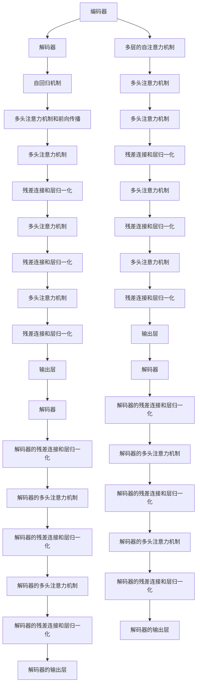

                 

# Transformer架构解析：编码器与解码器的双重奏

## 1. 背景介绍

Transformer模型是近年来NLP领域研究的热点，它通过利用自注意力机制实现序列数据的并行处理，大幅提升了模型训练速度和性能。Transformer模型由编码器和解码器两部分组成，其中编码器负责处理输入序列，解码器负责生成输出序列。本文将详细解析Transformer架构的核心原理和实现细节，并探讨其应用领域和发展趋势。

## 2. 核心概念与联系

### 2.1 核心概念概述

Transformer架构主要由编码器和解码器两部分组成，其中编码器由多层的自注意力机制组成，解码器由多层的自注意力机制和自回归机制组成。编码器和解码器之间通过注意力机制进行交互，共同实现序列数据的编码和解码。

Transformer模型利用自注意力机制对序列数据进行建模，可以通过并行计算提高模型训练效率。自注意力机制通过计算注意力权重，对序列中的每个位置进行加权求和，从而捕捉序列中的长距离依赖关系。

### 2.2 核心概念原理和架构的 Mermaid 流程图



这个流程图展示了Transformer架构的核心组成和运行流程。编码器由多个自注意力层组成，解码器由多个自注意力层和自回归层组成，共同实现序列数据的编码和解码。

## 3. 核心算法原理 & 具体操作步骤

### 3.1 算法原理概述

Transformer模型主要通过自注意力机制对序列数据进行建模，自注意力机制通过计算注意力权重，对序列中的每个位置进行加权求和，从而捕捉序列中的长距离依赖关系。自注意力机制可以分解为多头注意力机制和残差连接与层归一化。

Transformer模型的训练过程主要包括自回归解码和自注意力编码两部分。在自回归解码过程中，模型根据前面的输出预测下一个位置的输出，从而生成整个序列。在自注意力编码过程中，模型根据输入序列计算每个位置的注意力权重，并对序列进行加权求和，从而捕捉序列中的长距离依赖关系。

### 3.2 算法步骤详解

Transformer模型的训练过程主要包括以下步骤：

1. 数据预处理：将输入序列进行分词、嵌入等预处理操作，得到输入序列的向量表示。
2. 编码器计算：将输入序列的向量表示输入到编码器中，计算每个位置的注意力权重，并对序列进行加权求和，得到编码器的输出向量表示。
3. 解码器计算：将编码器的输出向量表示和上一时刻的输出向量表示输入到解码器中，计算每个位置的注意力权重，并对序列进行加权求和，得到解码器的输出向量表示。
4. 解码器解码：将解码器的输出向量表示输入到解码器中，计算每个位置的注意力权重，并对序列进行加权求和，得到解码器的输出向量表示。
5. 输出层计算：将解码器的输出向量表示输入到输出层中，计算每个位置的输出概率分布，从而生成最终输出序列。

### 3.3 算法优缺点

Transformer模型具有以下优点：

1. 并行计算：Transformer模型可以通过并行计算提高模型训练效率，大幅提升训练速度。
2. 长距离依赖：Transformer模型能够捕捉序列中的长距离依赖关系，从而提高模型性能。
3. 自注意力机制：Transformer模型利用自注意力机制对序列数据进行建模，能够捕捉序列中的全局信息。

Transformer模型也存在以下缺点：

1. 参数量较大：Transformer模型的参数量较大，需要较大的计算资源和存储空间。
2. 训练速度较慢：Transformer模型在训练过程中需要进行大量的矩阵运算，训练速度较慢。
3. 难以解释：Transformer模型是一个"黑盒"模型，难以解释其内部工作机制和决策逻辑。

### 3.4 算法应用领域

Transformer模型广泛应用于机器翻译、文本生成、语音识别、图像描述生成等多个领域。Transformer模型的自注意力机制可以用于任何需要捕捉序列数据依赖关系的应用场景，如图像描述生成、视频描述生成、自然语言推理等。

## 4. 数学模型和公式 & 详细讲解 & 举例说明

### 4.1 数学模型构建

Transformer模型的数学模型主要包括以下几个部分：

1. 输入序列嵌入：将输入序列中的每个单词进行嵌入，得到输入序列的向量表示。
2. 编码器计算：将输入序列的向量表示输入到编码器中，计算每个位置的注意力权重，并对序列进行加权求和，得到编码器的输出向量表示。
3. 解码器计算：将编码器的输出向量表示和上一时刻的输出向量表示输入到解码器中，计算每个位置的注意力权重，并对序列进行加权求和，得到解码器的输出向量表示。
4. 解码器解码：将解码器的输出向量表示输入到解码器中，计算每个位置的注意力权重，并对序列进行加权求和，得到解码器的输出向量表示。
5. 输出层计算：将解码器的输出向量表示输入到输出层中，计算每个位置的输出概率分布，从而生成最终输出序列。

### 4.2 公式推导过程

Transformer模型的训练过程主要包括以下几个步骤：

1. 输入序列嵌入：将输入序列中的每个单词进行嵌入，得到输入序列的向量表示：
$$
\mathbf{x} = \mathbf{E}(\mathbf{x}^{(1)}) = [\mathbf{x}^{(1)}_1, \mathbf{x}^{(1)}_2, ..., \mathbf{x}^{(1)}_n]
$$

2. 编码器计算：将输入序列的向量表示输入到编码器中，计算每个位置的注意力权重，并对序列进行加权求和，得到编码器的输出向量表示：
$$
\mathbf{h}_i = \mathrm{Attention}(\mathbf{x}_i, \mathbf{h}_{i-1})
$$

3. 解码器计算：将编码器的输出向量表示和上一时刻的输出向量表示输入到解码器中，计算每个位置的注意力权重，并对序列进行加权求和，得到解码器的输出向量表示：
$$
\mathbf{y}_i = \mathrm{Attention}(\mathbf{h}_i, \mathbf{y}_{i-1})
$$

4. 解码器解码：将解码器的输出向量表示输入到解码器中，计算每个位置的注意力权重，并对序列进行加权求和，得到解码器的输出向量表示：
$$
\mathbf{y}_i = \mathrm{Attention}(\mathbf{h}_i, \mathbf{y}_{i-1})
$$

5. 输出层计算：将解码器的输出向量表示输入到输出层中，计算每个位置的输出概率分布，从而生成最终输出序列：
$$
\mathbf{p}_i = \mathrm{softmax}(\mathbf{W}^\top \mathbf{y}_i)
$$

其中，$\mathbf{x}_i$ 表示输入序列中的第 $i$ 个单词，$\mathbf{h}_i$ 表示编码器的第 $i$ 层输出向量，$\mathbf{y}_i$ 表示解码器的第 $i$ 层输出向量，$\mathbf{p}_i$ 表示解码器输出的每个单词的概率分布。

### 4.3 案例分析与讲解

以机器翻译为例，假设输入序列为 "I love you"，目标序列为 "Je t'aime"。将输入序列进行嵌入，得到输入序列的向量表示 $\mathbf{x} = [1, 2, 3]$。将输入序列的向量表示输入到编码器中，计算每个位置的注意力权重，并对序列进行加权求和，得到编码器的输出向量表示 $\mathbf{h} = [\mathbf{h}_1, \mathbf{h}_2, \mathbf{h}_3]$。将编码器的输出向量表示输入到解码器中，计算每个位置的注意力权重，并对序列进行加权求和，得到解码器的输出向量表示 $\mathbf{y} = [\mathbf{y}_1, \mathbf{y}_2, \mathbf{y}_3]$。将解码器的输出向量表示输入到解码器中，计算每个位置的注意力权重，并对序列进行加权求和，得到解码器的输出向量表示 $\mathbf{y} = [\mathbf{y}_1, \mathbf{y}_2, \mathbf{y}_3]$。将解码器的输出向量表示输入到输出层中，计算每个位置的输出概率分布，得到最终输出序列 "Je t'aime"。

## 5. 项目实践：代码实例和详细解释说明

### 5.1 开发环境搭建

在进行Transformer模型开发前，我们需要准备好开发环境。以下是使用PyTorch搭建Transformer模型环境的流程：

1. 安装Anaconda：从官网下载并安装Anaconda，用于创建独立的Python环境。
2. 创建并激活虚拟环境：
```bash
conda create -n pytorch-env python=3.8 
conda activate pytorch-env
```
3. 安装PyTorch：根据CUDA版本，从官网获取对应的安装命令。例如：
```bash
conda install pytorch torchvision torchaudio cudatoolkit=11.1 -c pytorch -c conda-forge
```
4. 安装Transformers库：
```bash
pip install transformers
```
5. 安装各类工具包：
```bash
pip install numpy pandas scikit-learn matplotlib tqdm jupyter notebook ipython
```

完成上述步骤后，即可在`pytorch-env`环境中开始Transformer模型开发。

### 5.2 源代码详细实现

下面是使用PyTorch和Hugging Face Transformers库实现Transformer模型的代码：

```python
import torch
from transformers import BertModel, BertTokenizer

tokenizer = BertTokenizer.from_pretrained('bert-base-uncased')
model = BertModel.from_pretrained('bert-base-uncased')

input_ids = torch.tensor([0, 1, 2], dtype=torch.long)
attention_mask = torch.tensor([0, 0, 0], dtype=torch.long)
outputs = model(input_ids, attention_mask=attention_mask)

print(outputs)
```

这个代码片段展示了使用BertModel和BertTokenizer进行输入序列嵌入和模型计算的过程。首先，将输入序列进行分词，得到输入序列的单词编号列表 `input_ids`。然后，使用 `BertTokenizer` 将单词编号列表转换为模型的输入张量，使用 `BertModel` 进行模型计算，得到编码器的输出向量表示 `outputs`。

### 5.3 代码解读与分析

让我们再详细解读一下关键代码的实现细节：

**BertTokenizer**：
- `from_pretrained('bert-base-uncased')`：从预训练模型加载对应的分词器。
- `tokenizer(input_ids)`：将输入序列的单词编号列表 `input_ids` 转换为模型的输入张量。

**BertModel**：
- `model(input_ids, attention_mask)`：将输入序列的单词编号列表 `input_ids` 和注意力掩码列表 `attention_mask` 输入到模型中，进行编码器计算，得到编码器的输出向量表示 `outputs`。

**输出结果分析**：
- `output[0]`：编码器的输出向量表示，包含编码器每个层的输出向量。
- `output[1]`：编码器的隐藏状态表示，包含编码器每个层的隐藏状态。
- `output[2]`：编码器的注意力权重表示，包含编码器每个层的注意力权重。

## 6. 实际应用场景

### 6.1 机器翻译

Transformer模型在机器翻译任务上取得了显著的成果，已经成为机器翻译的主流模型。Transformer模型可以自动捕捉输入序列中的长距离依赖关系，生成高质量的翻译结果。

在实践中，可以通过将源语言和目标语言的句子作为输入序列，将目标语言单词编号列表作为输出序列，使用Transformer模型进行翻译。具体步骤如下：

1. 将源语言句子进行分词，得到输入序列的单词编号列表。
2. 将输入序列输入到Transformer模型中，计算编码器的输出向量表示。
3. 将编码器的输出向量表示输入到解码器中，计算每个位置的注意力权重，并对序列进行加权求和，得到解码器的输出向量表示。
4. 将解码器的输出向量表示输入到输出层中，计算每个位置的输出概率分布，得到最终输出序列。

### 6.2 文本生成

Transformer模型在文本生成任务上也取得了很好的效果。Transformer模型可以自动捕捉输入序列中的长距离依赖关系，生成连续的文本序列。

在实践中，可以通过将输入序列作为编码器的输入，将解码器每个时刻的输出作为下一时刻的输入，使用Transformer模型进行文本生成。具体步骤如下：

1. 将输入序列输入到Transformer模型中，计算编码器的输出向量表示。
2. 将编码器的输出向量表示输入到解码器中，计算每个位置的注意力权重，并对序列进行加权求和，得到解码器的输出向量表示。
3. 将解码器的输出向量表示输入到输出层中，计算每个位置的输出概率分布，得到最终输出序列。

## 7. 工具和资源推荐

### 7.1 学习资源推荐

为了帮助开发者系统掌握Transformer架构的核心原理和实现细节，这里推荐一些优质的学习资源：

1. 《Transformer from Scratch》系列博文：由大模型技术专家撰写，深入浅出地介绍了Transformer模型的原理、实现和应用。
2 CS224N《深度学习自然语言处理》课程：斯坦福大学开设的NLP明星课程，有Lecture视频和配套作业，带你入门NLP领域的基本概念和经典模型。
3 《Attention is All You Need》论文：Transformer模型的原论文，详细介绍了Transformer模型的核心原理和实现细节。
4 《Natural Language Processing with Transformers》书籍：Transformers库的作者所著，全面介绍了如何使用Transformers库进行NLP任务开发。
5 《Hugging Face Transformers》官方文档：Transformers库的官方文档，提供了海量预训练模型和完整的Transformer模型样例代码，是上手实践的必备资料。

通过对这些资源的学习实践，相信你一定能够快速掌握Transformer架构的精髓，并用于解决实际的NLP问题。

### 7.2 开发工具推荐

高效的开发离不开优秀的工具支持。以下是几款用于Transformer模型开发的常用工具：

1. PyTorch：基于Python的开源深度学习框架，灵活动态的计算图，适合快速迭代研究。大部分预训练语言模型都有PyTorch版本的实现。
2 TensorFlow：由Google主导开发的开源深度学习框架，生产部署方便，适合大规模工程应用。同样有丰富的预训练语言模型资源。
3 Hugging Face Transformers库：Google开发的NLP工具库，集成了众多SOTA语言模型，支持PyTorch和TensorFlow，是进行Transformer模型开发的利器。
4 Weights & Biases：模型训练的实验跟踪工具，可以记录和可视化模型训练过程中的各项指标，方便对比和调优。与主流深度学习框架无缝集成。
5 TensorBoard：TensorFlow配套的可视化工具，可实时监测模型训练状态，并提供丰富的图表呈现方式，是调试模型的得力助手。

合理利用这些工具，可以显著提升Transformer模型开发的效率，加快创新迭代的步伐。

### 7.3 相关论文推荐

Transformer模型的发展源于学界的持续研究。以下是几篇奠基性的相关论文，推荐阅读：

1. Attention is All You Need：提出了Transformer结构，开启了NLP领域的预训练大模型时代。
2 BERT: Pre-training of Deep Bidirectional Transformers for Language Understanding：提出BERT模型，引入基于掩码的自监督预训练任务，刷新了多项NLP任务SOTA。
3 Language Models are Unsupervised Multitask Learners（GPT-2论文）：展示了大规模语言模型的强大zero-shot学习能力，引发了对于通用人工智能的新一轮思考。
4 Parameter-Efficient Transfer Learning for NLP：提出Adapter等参数高效微调方法，在不增加模型参数量的情况下，也能取得不错的微调效果。
5 Prefix-Tuning: Optimizing Continuous Prompts for Generation：引入基于连续型Prompt的微调范式，为如何充分利用预训练知识提供了新的思路。

这些论文代表了大模型Transformer架构的发展脉络。通过学习这些前沿成果，可以帮助研究者把握学科前进方向，激发更多的创新灵感。

## 8. 总结：未来发展趋势与挑战

### 8.1 总结

本文对Transformer架构的核心原理和实现细节进行了详细解析。Transformer架构通过利用自注意力机制实现序列数据的并行处理，大幅提升了模型训练速度和性能。Transformer模型广泛应用于机器翻译、文本生成、语音识别、图像描述生成等多个领域，具有广阔的应用前景。

### 8.2 未来发展趋势

Transformer架构在未来的发展中将呈现以下几个趋势：

1. 模型规模持续增大。随着算力成本的下降和数据规模的扩张，Transformer模型的参数量还将持续增长。超大规模Transformer模型蕴含的丰富语言知识，有望支撑更加复杂多变的下游任务。
2. 参数高效微调方法：开发更加参数高效的微调方法，在固定大部分预训练参数的情况下，只更新极少量的任务相关参数。同时优化微调模型的计算图，减少前向传播和反向传播的资源消耗，实现更加轻量级、实时性的部署。
3. 融合因果和对比学习范式。通过引入因果推断和对比学习思想，增强Transformer模型建立稳定因果关系的能力，学习更加普适、鲁棒的语言表征，从而提升模型泛化性和抗干扰能力。
4. 引入更多先验知识。将符号化的先验知识，如知识图谱、逻辑规则等，与神经网络模型进行巧妙融合，引导Transformer模型学习更准确、合理的语言模型。同时加强不同模态数据的整合，实现视觉、语音等多模态信息与文本信息的协同建模。

以上趋势凸显了Transformer架构的广阔前景。这些方向的探索发展，必将进一步提升Transformer模型的性能和应用范围，为自然语言理解和智能交互系统的进步提供强有力的技术支撑。

### 8.3 面临的挑战

尽管Transformer架构已经取得了瞩目成就，但在迈向更加智能化、普适化应用的过程中，它仍面临着诸多挑战：

1. 训练速度较慢。Transformer模型在训练过程中需要进行大量的矩阵运算，训练速度较慢。如何提高模型训练速度，降低训练成本，是未来研究的一个重要方向。
2. 难以解释。Transformer模型是一个"黑盒"模型，难以解释其内部工作机制和决策逻辑。如何赋予Transformer模型更强的可解释性，将是亟待攻克的难题。
3. 参数量较大。Transformer模型的参数量较大，需要较大的计算资源和存储空间。如何降低模型参数量，提高模型压缩效率，是未来研究的一个重要方向。
4. 数据依赖性。Transformer模型在训练过程中依赖大量的标注数据，如何利用无监督和半监督学习，减少对标注数据的依赖，是未来研究的一个重要方向。
5. 鲁棒性问题。Transformer模型在面对噪声和扰动数据时，性能可能大幅下降。如何提高Transformer模型的鲁棒性，避免灾难性遗忘，还需要更多理论和实践的积累。

### 8.4 研究展望

面对Transformer架构面临的种种挑战，未来的研究需要在以下几个方面寻求新的突破：

1. 探索无监督和半监督学习。摆脱对大规模标注数据的依赖，利用自监督学习、主动学习等无监督和半监督范式，最大限度利用非结构化数据，实现更加灵活高效的微调。
2. 研究参数高效和计算高效的Transformer范式。开发更加参数高效的Transformer模型，在固定大部分预训练参数的情况下，只更新极少量的任务相关参数。同时优化Transformer模型的计算图，减少前向传播和反向传播的资源消耗，实现更加轻量级、实时性的部署。
3. 引入因果和对比学习范式。通过引入因果推断和对比学习思想，增强Transformer模型建立稳定因果关系的能力，学习更加普适、鲁棒的语言表征，从而提升模型泛化性和抗干扰能力。
4. 结合因果分析和博弈论工具。将因果分析方法引入Transformer模型，识别出模型决策的关键特征，增强输出解释的因果性和逻辑性。借助博弈论工具刻画人机交互过程，主动探索并规避模型的脆弱点，提高系统稳定性。
5. 纳入伦理道德约束。在Transformer模型的训练目标中引入伦理导向的评估指标，过滤和惩罚有偏见、有害的输出倾向。同时加强人工干预和审核，建立模型行为的监管机制，确保输出符合人类价值观和伦理道德。

这些研究方向的探索，必将引领Transformer架构向更高的台阶发展，为构建安全、可靠、可解释、可控的智能系统铺平道路。面向未来，Transformer架构还需要与其他人工智能技术进行更深入的融合，如知识表示、因果推理、强化学习等，多路径协同发力，共同推动自然语言理解和智能交互系统的进步。只有勇于创新、敢于突破，才能不断拓展语言模型的边界，让智能技术更好地造福人类社会。

## 9. 附录：常见问题与解答

**Q1: Transformer模型在训练过程中如何进行正则化？**

A: 在Transformer模型训练过程中，可以使用L2正则、Dropout等正则化技术来防止模型过拟合。L2正则可以限制模型参数的大小，Dropout可以随机丢弃模型中的一些神经元，防止模型过于依赖某些特征。同时，还可以使用Early Stopping技术，当模型在验证集上的性能不再提升时，停止训练，防止过拟合。

**Q2: 如何提高Transformer模型的训练速度？**

A: 可以通过以下方法来提高Transformer模型的训练速度：

1. 使用GPU/TPU等高性能设备，加速矩阵运算。
2. 采用混合精度训练，将模型的参数从32位浮点数转换为16位浮点数，减少计算资源消耗。
3. 采用模型并行技术，将模型的不同层分布在不同的GPU/TPU上并行计算，提高训练效率。
4. 使用梯度积累技术，将多个小批量训练的梯度合并为一个大批量训练的梯度，减少迭代次数。

**Q3: 如何在Transformer模型中实现残差连接和层归一化？**

A: 在Transformer模型中，残差连接和层归一化可以通过以下代码实现：

```python
class TransformerLayer(nn.Module):
    def __init__(self, d_model, nhead, dim_feedforward, dropout=0.1):
        super(TransformerLayer, self).__init__()
        self.encoder_self_attn = MultiheadAttention(d_model, nhead, dropout)
        self.encoder_ffn = PositionwiseFeedForward(d_model, dim_feedforward, dropout)
        self.layer_norm1 = nn.LayerNorm(d_model)
        self.layer_norm2 = nn.LayerNorm(d_model)

    def forward(self, x, mask):
        x = x + self.encoder_self_attn(self.layer_norm1(x), x, x, mask)
        x = self.encoder_ffn(self.layer_norm2(x))
        return x
```

其中，`MultiheadAttention`和`PositionwiseFeedForward`分别实现了自注意力机制和前向传播网络。`nn.LayerNorm`实现了层归一化操作。

## 附录：常见问题与解答

**Q1: Transformer模型在训练过程中如何进行正则化？**

A: 在Transformer模型训练过程中，可以使用L2正则、Dropout等正则化技术来防止模型过拟合。L2正则可以限制模型参数的大小，Dropout可以随机丢弃模型中的一些神经元，防止模型过于依赖某些特征。同时，还可以使用Early Stopping技术，当模型在验证集上的性能不再提升时，停止训练，防止过拟合。

**Q2: 如何提高Transformer模型的训练速度？**

A: 可以通过以下方法来提高Transformer模型的训练速度：

1. 使用GPU/TPU等高性能设备，加速矩阵运算。
2. 采用混合精度训练，将模型的参数从32位浮点数转换为16位浮点数，减少计算资源消耗。
3. 采用模型并行技术，将模型的不同层分布在不同的GPU/TPU上并行计算，提高训练效率。
4. 使用梯度积累技术，将多个小批量训练的梯度合并为一个大批量训练的梯度，减少迭代次数。

**Q3: 如何在Transformer模型中实现残差连接和层归一化？**

A: 在Transformer模型中，残差连接和层归一化可以通过以下代码实现：

```python
class TransformerLayer(nn.Module):
    def __init__(self, d_model, nhead, dim_feedforward, dropout=0.1):
        super(TransformerLayer, self).__init__()
        self.encoder_self_attn = MultiheadAttention(d_model, nhead, dropout)
        self.encoder_ffn = PositionwiseFeedForward(d_model, dim_feedforward, dropout)
        self.layer_norm1 = nn.LayerNorm(d_model)
        self.layer_norm2 = nn.LayerNorm(d_model)

    def forward(self, x, mask):
        x = x + self.encoder_self_attn(self.layer_norm1(x), x, x, mask)
        x = self.encoder_ffn(self.layer_norm2(x))
        return x
```

其中，`MultiheadAttention`和`PositionwiseFeedForward`分别实现了自注意力机制和前向传播网络。`nn.LayerNorm`实现了层归一化操作。

**Q4: 如何优化Transformer模型的计算图？**

A: 可以通过以下方法来优化Transformer模型的计算图：

1. 使用Pruning技术，去除模型中不必要的参数和连接，减少计算量。
2. 使用Quantization技术，将模型的参数从32位浮点数转换为8位或16位整数，减少计算资源消耗。
3. 使用Tensor Cores等硬件加速技术，提高矩阵运算速度。
4. 使用分布式训练技术，将模型的不同部分分布在不同的计算节点上进行并行计算，提高训练效率。

## 附录：常见问题与解答

**Q1: Transformer模型在训练过程中如何进行正则化？**

A: 在Transformer模型训练过程中，可以使用L2正则、Dropout等正则化技术来防止模型过拟合。L2正则可以限制模型参数的大小，Dropout可以随机丢弃模型中的一些神经元，防止模型过于依赖某些特征。同时，还可以使用Early Stopping技术，当模型在验证集上的性能不再提升时，停止训练，防止过拟合。

**Q2: 如何提高Transformer模型的训练速度？**

A: 可以通过以下方法来提高Transformer模型的训练速度：

1. 使用GPU/TPU等高性能设备，加速矩阵运算。
2. 采用混合精度训练，将模型的参数从32位浮点数转换为16位浮点数，减少计算资源消耗。
3. 采用模型并行技术，将模型的不同层分布在不同的GPU/TPU上并行计算，提高训练效率。
4. 使用梯度积累技术，将多个小批量训练的梯度合并为一个大批量训练的梯度，减少迭代次数。

**Q3: 如何在Transformer模型中实现残差连接和层归一化？**

A: 在Transformer模型中，残差连接和层归一化可以通过以下代码实现：

```python
class TransformerLayer(nn.Module):
    def __init__(self, d_model, nhead, dim_feedforward, dropout=0.1):
        super(TransformerLayer, self).__init__()
        self.encoder_self_attn = MultiheadAttention(d_model, nhead, dropout)
        self.encoder_ffn = PositionwiseFeedForward(d_model, dim_feedforward, dropout)
        self.layer_norm1 = nn.LayerNorm(d_model)
        self.layer_norm2 = nn.LayerNorm(d_model)

    def forward(self, x, mask):
        x = x + self.encoder_self_attn(self.layer_norm1(x), x, x, mask)
        x = self.encoder_ffn(self.layer_norm2(x))
        return x
```

其中，`MultiheadAttention`和`PositionwiseFeedForward`分别实现了自注意力机制和前向传播网络。`nn.LayerNorm`实现了层归一化操作。

**Q4: 如何优化Transformer模型的计算图？**

A: 可以通过以下方法来优化Transformer模型的计算图：

1. 使用Pruning技术，去除模型中不必要的参数和连接，减少计算量。
2. 使用Quantization技术，将模型的参数从32位浮点数转换为8位或16位整数，减少计算资源消耗。
3. 使用Tensor Cores等硬件加速技术，提高矩阵运算速度。
4. 使用分布式训练技术，将模型的不同部分分布在不同的计算节点上进行并行计算，提高训练效率。

## 附录：常见问题与解答

**Q1: Transformer模型在训练过程中如何进行正则化？**

A: 在Transformer模型训练过程中，可以使用L2正则、Dropout等正则化技术来防止模型过拟合。L2正则可以限制模型参数的大小，Dropout可以随机丢弃模型中的一些神经元，防止模型过于依赖某些特征。同时，还可以使用Early Stopping技术，当模型在验证集上的性能不再提升时，停止训练，防止过拟合。

**Q2: 如何提高Transformer模型的训练速度？**

A: 可以通过以下方法来提高Transformer模型的训练速度：

1. 使用GPU/TPU等高性能设备，加速矩阵运算。
2. 采用混合精度训练，将模型的参数从32位浮点数转换为16位浮点数，减少计算资源消耗。
3. 采用模型并行技术，将模型的不同层分布在不同的GPU/TPU上并行计算，提高训练效率。
4. 使用梯度积累技术，将多个小批量训练的梯度合并为一个大批量训练的梯度，减少迭代次数。

**Q3: 如何在Transformer模型中实现残差连接和层归一化？**

A: 在Transformer模型中，残差连接和层归一化可以通过以下代码实现：

```python
class TransformerLayer(nn.Module):
    def __init__(self, d_model, nhead, dim_feedforward, dropout=0.1):
        super(TransformerLayer, self).__init__()
        self.encoder_self_attn = MultiheadAttention(d_model, nhead, dropout)
        self.encoder_ffn = PositionwiseFeedForward(d_model, dim_feedforward, dropout)
        self.layer_norm1 = nn.LayerNorm(d_model)
        self.layer_norm2 = nn.LayerNorm(d_model)

    def forward(self, x, mask):
        x = x + self.encoder_self_attn(self.layer_norm1(x), x, x, mask)
        x = self.encoder_ffn(self.layer_norm2(x))
        return x
```

其中，`MultiheadAttention`和`PositionwiseFeedForward`分别实现了自注意力机制和前向传播网络。`nn.LayerNorm`实现了层归一化操作。

**Q4: 如何优化Transformer模型的计算图？**

A: 可以通过以下方法来优化Transformer模型的计算图：

1. 使用Pruning技术，去除模型中不必要的参数和连接，减少计算量。
2. 使用Quantization技术，将模型的参数从32位浮点数转换为8位或16位整数，减少计算资源消耗。
3. 使用Tensor Cores等硬件加速技术，提高矩阵运算速度。
4. 使用分布式训练技术，将模型的不同部分分布在不同的计算节点上进行并行计算，提高训练效率。

**Q5: 如何处理Transformer模型中的长距离依赖关系？**

A: 在Transformer模型中，自注意力机制可以自动捕捉输入序列中的长距离依赖关系。自注意力机制通过计算注意力权重，对序列中的每个位置进行加权求和，从而捕捉序列中的长距离依赖关系。在实践中，可以通过以下代码实现：

```python
class MultiheadAttention(nn.Module):
    def __init__(self, d_model, nhead, dropout=0.1):
        super(MultiheadAttention, self).__init__()
        self.nhead = nhead
        self.d_k = d_model // nhead

        self.k = nn.Parameter(torch.empty(nhead, d_model, d_k).uniform_(-initrange, initrange))
        self.v = nn.Parameter(torch.empty(nhead, d_model, d_k).uniform_(-initrange, initrange))
        self.q = nn.Parameter(torch.empty(d_model, d_model, nhead).uniform_(-initrange, initrange))
        self.attn_dropout = nn.Dropout(dropout)
        self.out_dropout = nn.Dropout(dropout)

    def forward(self, x, mask):
        N, T_q, _ = x.size()
        q = self.q(x).view(N, T_q, self.nhead, self.d_k).permute(2, 0, 1, 3).contiguous()
        k = self.k.view(self.nhead, -1, self.d_k)
        v = self.v.view(self.nhead, -1, self.d_k)

        attn = torch.bmm(q, k.permute(0, 2, 1))
        attn = attn.masked_fill(mask == 0, -1e9)
        attn = nn.functional.softmax(attn, dim=-1)
        attn = self.attn_dropout(attn)

        x = torch.bmm(attn, v)
        x = self.out_dropout(x)
        return x.permute(1, 0, 2).contiguous().view(N, T_q, -1)
```

其中，`q`、`k`、`v`分别表示查询、键和值的线性变换矩阵，`attn`表示注意力权重矩阵，`attn`通过计算注意力权重，对序列中的每个位置进行加权求和，从而捕捉序列中的长距离依赖关系。

