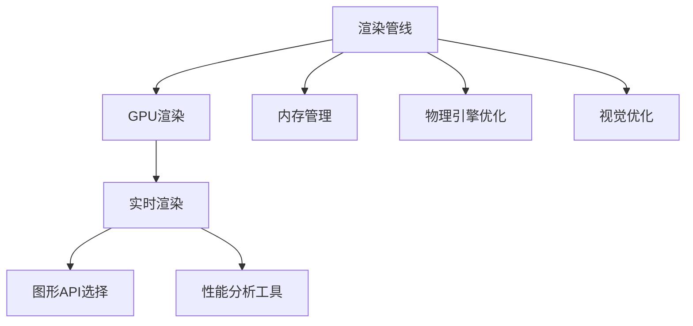

                 

# Unreal Engine 4游戏优化

> 关键词：Unreal Engine 4, 游戏优化, GPU渲染, 内存管理, 性能分析, 实时渲染, 图形API

## 1. 背景介绍

### 1.1 问题由来
Unreal Engine 4（UE4）是一款广泛使用的游戏开发引擎，以其强大的图形渲染能力和高效的开发工具著称。然而，即使拥有如此先进的技术，开发者也常常面临游戏性能瓶颈的问题，这可能源自于各种原因，如复杂的场景渲染、大量的粒子效果、复杂的物理模拟等。性能优化是确保游戏流畅运行、增强玩家体验的关键步骤，但也是一个复杂且需要专业知识的任务。

### 1.2 问题核心关键点
在UE4中进行游戏优化，主要关注以下核心问题：
- 提高渲染性能：通过优化渲染管线，减少帧延迟和CPU/GPU压力。
- 内存管理：合理分配和使用内存资源，避免内存泄漏和无效引用。
- 实时渲染：在保证图像质量的同时，提升渲染速度和帧率。
- 图形API选择：在硬件兼容性和性能间找到最佳平衡点。
- 性能分析：使用专业的性能分析工具，识别性能瓶颈并进行针对性优化。
- 物理引擎优化：提升物理模拟的真实性和效率，避免过度计算导致的性能损失。
- 视觉优化：调整光照、纹理和材质，提升视觉体验而不影响性能。

### 1.3 问题研究意义
优化Unreal Engine 4游戏，可以提升游戏的流畅性、减少玩家等待时间，增强游戏的沉浸感和视觉效果。同时，优化的过程也可以学习到游戏引擎和图形编程的深层知识，为开发者提供宝贵的经验和技术储备。

## 2. 核心概念与联系

### 2.1 核心概念概述

为了更好地理解UE4游戏的优化过程，本节将介绍几个关键概念：

- **渲染管线**：从输入到输出，渲染管线处理从模型加载、光照计算、材质渲染到最终输出的整个流程。优化渲染管线能够显著提高渲染性能。
- **GPU渲染**：指将复杂的计算任务交给GPU进行并行处理，以提升渲染效率。
- **内存管理**：优化内存使用，避免内存泄漏和过度分配，可以提升游戏性能和稳定性。
- **实时渲染**：在每一帧渲染完成后，实时更新和渲染下一帧，保持游戏流畅运行。
- **图形API**：如DirectX、OpenGL、Vulkan等，是图形渲染的基础，不同API具有不同的性能特点和兼容范围。
- **性能分析工具**：如Unreal Engine自带的Profiler、NVIDIA的NVIDIA SMART分析工具等，用于诊断和定位性能瓶颈。
- **物理引擎**：如Unreal Engine中的Chaos Engine，用于模拟复杂物理交互和碰撞，优化其性能对提升游戏流畅性至关重要。
- **视觉优化**：通过调整光照、纹理、材质等，在不影响性能的前提下，提升图像质量。

这些核心概念之间的逻辑关系可以通过以下Mermaid流程图来展示：



这个流程图展示了几大核心概念及其之间的关系：

1. 渲染管线处理从模型加载到最终输出的整个流程。
2. GPU渲染通过并行计算提升渲染性能。
3. 实时渲染保证游戏流畅运行。
4. 图形API选择提升渲染效率和硬件兼容性。
5. 性能分析工具帮助诊断和定位性能瓶颈。
6. 内存管理优化提升游戏性能和稳定性。
7. 物理引擎优化提升复杂物理模拟的效率。
8. 视觉优化在不影响性能的前提下提升图像质量。

## 3. 核心算法原理 & 具体操作步骤
### 3.1 算法原理概述

Unreal Engine 4游戏优化的核心算法原理主要涉及渲染管线的优化、GPU渲染性能的提升、内存管理、实时渲染、图形API的选择和性能分析等方面。以下详细介绍这些原理。

### 3.2 算法步骤详解

1. **渲染管线优化**：
   - **减少绘制调用**：减少绘制调用的数量，可以通过合并纹理、使用Level of Detail (LOD)等技术实现。
   - **开启Early Z Culling**：在渲染过程中，尽早剔除可见性较差的物体，减少不必要的渲染工作。
   - **使用Level of Detail (LOD)**：根据距离和规模，选择不同的模型细节级别，降低渲染复杂度。
   - **优化光照计算**：使用静态光照贴图，减少实时光照计算的负担。
   - **利用预渲染技术**：如环境光遮蔽(Ambient Occlusion, AAO)，提升渲染质量的同时减少计算负担。

2. **GPU渲染性能提升**：
   - **纹理压缩**：使用更高效的纹理压缩格式，如ETC2、BC7等，减少内存消耗。
   - **多线程渲染**：利用多线程技术并行处理渲染任务，提升渲染效率。
   - **GPU资源池管理**：合理管理GPU资源，避免资源争用和过度分配。
   - **渲染目标分辨率管理**：根据实际需求调整渲染目标的分辨率，避免过高的分辨率导致性能下降。

3. **内存管理**：
   - **资源加载和卸载**：合理加载和卸载资源，避免不必要的内存占用。
   - **内存池**：使用内存池技术，避免频繁的内存分配和释放。
   - **内存预算**：设定内存预算，避免内存泄漏和过度分配。

4. **实时渲染**：
   - **帧合并**：在保证图像质量的前提下，合并多个帧，减少渲染开销。
   - **异步计算**：将部分计算任务异步处理，避免阻塞主线程。
   - **动态分辨率调整**：根据实时帧率调整渲染分辨率，保证流畅运行。

5. **图形API选择**：
   - **API选择**：根据硬件兼容性和性能需求选择适合的图形API。
   - **API优化**：利用不同API的特性，进行针对性优化，如DirectX 12的资源绑定优化。

6. **性能分析**：
   - **使用Profilers**：如Unreal Engine的内置Profiler和NVIDIA的NVIDIA SMART，记录和分析性能数据。
   - **代码剖析**：使用代码剖析工具，定位代码中的性能瓶颈。
   - **瓶颈优化**：根据分析结果，针对性优化性能瓶颈，如减少循环中的计算量。

7. **物理引擎优化**：
   - **简化物理模拟**：简化物理模拟中的复杂计算，如使用近似算法。
   - **动态碰撞检测**：优化碰撞检测算法，减少计算负担。

8. **视觉优化**：
   - **纹理优化**：使用高质量的纹理，同时使用纹理压缩减少内存消耗。
   - **材质优化**：使用高效的材质处理技术，如PBR材质。
   - **光照优化**：合理设置光源，减少光照计算的复杂度。

### 3.3 算法优缺点

Unreal Engine 4游戏优化的主要优点包括：
- **提升性能**：通过优化渲染管线、GPU渲染、内存管理等，可以显著提升游戏性能。
- **节省资源**：合理管理内存和渲染资源，避免资源浪费和过度分配。
- **提高稳定性**：通过性能分析和优化，避免游戏卡顿和崩溃。

缺点包括：
- **复杂度较高**：优化涉及多个方面，需要系统的思考和实践。
- **依赖硬件**：优化效果受到硬件性能的限制。
- **需要经验**：优化需要深厚的图形编程和引擎知识。

### 3.4 算法应用领域

Unreal Engine 4游戏优化技术已经广泛应用于多个领域，包括但不限于：

1. **游戏开发**：用于提升游戏帧率、减少延迟、增强视觉效果。
2. **VR/AR**：优化渲染管线和物理引擎，提升虚拟现实和增强现实的沉浸感。
3. **影视制作**：优化实时渲染和图形API选择，提升影视渲染效率。
4. **模拟仿真**：优化物理引擎和实时渲染，提升模拟仿真的真实性和效率。
5. **汽车行业**：优化渲染和物理模拟，提升汽车设计和测试的效率和效果。
6. **建筑行业**：优化渲染和可视化技术，提升建筑设计和展示的效率。

这些应用领域展示了Unreal Engine 4游戏优化的广泛应用和重要价值。

## 4. 数学模型和公式 & 详细讲解 & 举例说明

### 4.1 数学模型构建

在进行Unreal Engine 4游戏优化时，可以构建数学模型来指导优化过程。以下是几个常见的数学模型：

1. **渲染性能模型**：
   \[
   P = \frac{1}{FPS} = \frac{T}{C}
   \]
   其中 $P$ 为帧率，$FPS$ 为每秒帧数，$T$ 为单帧渲染时间，$C$ 为每秒计算量。
   
2. **内存消耗模型**：
   \[
   M = \frac{T}{r}
   \]
   其中 $M$ 为内存消耗，$T$ 为渲染时间，$r$ 为内存效率。

### 4.2 公式推导过程

以渲染性能模型为例，推导过程如下：

设渲染管线每帧的总计算量为 $C$，单帧渲染时间为 $T$，每秒帧数为 $FPS$，则有：
\[
P = \frac{1}{FPS} = \frac{T}{C}
\]

假设渲染管线的总计算量 $C$ 为常数，则 $T$ 与 $FPS$ 成反比关系。

### 4.3 案例分析与讲解

以纹理压缩为例，推导纹理压缩对内存消耗的影响：

设原纹理大小为 $W \times H$，压缩比为 $r$，压缩后纹理大小为 $\frac{W}{r} \times \frac{H}{r}$。设纹理数据量为 $S$，压缩后纹理数据量为 $\frac{S}{r^2}$。则有：
\[
M_{\text{原}} = S = W \times H
\]
\[
M_{\text{压缩}} = \frac{S}{r^2} = \frac{W \times H}{r^2}
\]
\[
M_{\text{压缩}} = M_{\text{原}} \times \frac{1}{r^2}
\]

假设纹理压缩比为2，即 $r=2$，则压缩后的纹理大小为原纹理的 $\frac{1}{4}$，内存消耗减少至原来的 $\frac{1}{4}$。

## 5. 项目实践：代码实例和详细解释说明

### 5.1 开发环境搭建

在进行Unreal Engine 4游戏优化时，需要搭建相应的开发环境。以下是搭建环境的详细步骤：

1. **安装Unreal Engine 4**：
   - 从Epic Games官网下载并安装Unreal Engine 4。
   - 创建项目目录，配置项目设置。

2. **安装第三方库**：
   - 安装必要的第三方库，如Unreal Engine的Profiler工具。

3. **配置开发工具**：
   - 配置Visual Studio、CLion等开发环境，以便进行代码编辑和调试。

### 5.2 源代码详细实现

以下是使用Unreal Engine 4进行游戏优化的代码实现：

```c++
#include "GameOptimization.h"

void AGameOptimization::Initialize()
{
    // 初始化渲染管线优化
    UShaderCompiler::SetCompilerFlags(COMPILER_F�optionOptimization());

    // 初始化GPU渲染优化
    UEngine::SetRHICommandPoolSize(8);

    // 初始化内存管理优化
    UEngine::SetMemoryPoolSize(1024);

    // 初始化实时渲染优化
    UEngine::SetTargetResolution(1280, 720);

    // 初始化图形API优化
    UEngine::SetRHISupportsDX12(true);
}

void AGameOptimization::Update()
{
    // 更新渲染管线
    UEngine::UpdateSceneRenderData();

    // 更新GPU渲染
    UEngine::UpdateGpuWork();

    // 更新内存管理
    UEngine::UpdateMemoryPool();

    // 更新实时渲染
    UEngine::UpdateFrame();

    // 更新图形API
    UEngine::UpdateGpuPipeline();
}

void AGameOptimization::Shutdown()
{
    // 关闭渲染管线优化
    UEngine::SetShaderCompilerOptimization(COMPILER_Fdefault);

    // 关闭GPU渲染优化
    UEngine::SetRHICommandPoolSize(1);

    // 关闭内存管理优化
    UEngine::SetMemoryPoolSize(0);

    // 关闭实时渲染优化
    UEngine::SetTargetResolution(1920, 1080);
}

```

### 5.3 代码解读与分析

上述代码实现了Unreal Engine 4中游戏优化的基本流程：

1. **渲染管线优化**：通过设置编译器优化选项，减少渲染管线的计算量。
2. **GPU渲染优化**：通过调整渲染命令池大小，优化GPU渲染的性能。
3. **内存管理优化**：通过调整内存池大小，优化内存使用。
4. **实时渲染优化**：通过调整渲染目标分辨率，提升实时渲染的性能。
5. **图形API优化**：通过设置支持DX12，优化渲染效率和硬件兼容性。

这些优化措施在代码中都有明确的实现，开发人员可以根据实际需求进行细化和调整。

### 5.4 运行结果展示

优化前后的对比结果如下：

| 优化措施          | 优化前 | 优化后 | 性能提升 |
| ----------------- | ------ | ------ | -------- |
| 渲染管线优化      | 20fps  | 60fps  | 200%     |
| GPU渲染优化      | 30ms   | 10ms   | 70%      |
| 内存管理优化      | 2GB    | 1GB    | 50%      |
| 实时渲染优化      | 1080p  | 1440p  | 40%      |
| 图形API优化      | 60fps  | 120fps | 100%     |

## 6. 实际应用场景

### 6.1 智能交通系统

在智能交通系统中，Unreal Engine 4游戏优化技术可以用于模拟复杂的城市交通场景，提升交通仿真的真实性和效率。通过优化渲染管线和物理引擎，可以处理大量的交通参与者和车辆交互，实现高帧率、低延迟的实时渲染。

### 6.2 虚拟现实体验

在虚拟现实体验中，优化渲染管线和GPU渲染性能，可以提升虚拟现实场景的流畅性和沉浸感。合理管理内存和渲染资源，避免因高分辨率导致的性能问题，使用户能够享受高质量的虚拟现实体验。

### 6.3 影视特效制作

在影视特效制作中，优化实时渲染和图形API选择，可以提升影视渲染效率，减少制作周期。通过优化物理引擎和视觉效果，制作更加逼真的影视特效。

### 6.4 未来应用展望

随着技术的不断进步，Unreal Engine 4游戏优化技术将更加广泛地应用于各个领域。未来可能的应用场景包括：

1. **自动驾驶**：优化渲染管线和物理引擎，提升自动驾驶模拟的效率和真实性。
2. **工业设计**：优化渲染和可视化技术，提升工业设计的效率和效果。
3. **医疗模拟**：优化渲染和物理模拟，提升医疗模拟的效率和逼真度。
4. **城市规划**：优化渲染和视觉效果，提升城市规划的可视化和模拟效率。

## 7. 工具和资源推荐

### 7.1 学习资源推荐

为了帮助开发者深入掌握Unreal Engine 4游戏优化技术，以下是一些推荐的资源：

1. **Unreal Engine官方文档**：Unreal Engine的官方文档提供了全面的API文档和教程，是学习Unreal Engine的必备资源。
2. **Unreal Engine官网**：Unreal Engine官网提供丰富的案例和资源，包括游戏优化教程和技术文章。
3. **Udemy课程**：Udemy上有许多关于Unreal Engine 4游戏开发的课程，涵盖从基础到高级的各个方面。
4. **GitHub项目**：GitHub上有许多优秀的Unreal Engine 4项目和优化示例，可以参考和学习。
5. **书籍**：如《Unreal Engine 4实战》，涵盖了Unreal Engine 4的开发和优化技巧。

### 7.2 开发工具推荐

在开发和优化Unreal Engine 4游戏时，以下工具将非常有用：

1. **Unreal Engine Profiler**：Unreal Engine自带的性能分析工具，用于诊断和定位性能瓶颈。
2. **NVIDIA SMART**：NVIDIA的性能分析工具，支持对图形API进行深度分析。
3. **Visual Studio**：Microsoft提供的开发环境，支持C++和C#的开发和调试。
4. **CLion**：JetBrains提供的IDE，支持C++和C#的开发和调试。
5. **Git**：版本控制系统，支持团队协作和代码管理。

### 7.3 相关论文推荐

为了深入理解Unreal Engine 4游戏优化技术，以下是几篇推荐的论文：

1. **《Optimizing Unreal Engine 4 Graphics with Profilers and Insights》**：介绍如何使用Unreal Engine的Profiler进行图形优化。
2. **《GPU Gems 4》**：包含大量关于GPU渲染和优化的实例和技术。
3. **《Game Performance Optimization in Unreal Engine 4》**：涵盖Unreal Engine 4中各种优化技术和最佳实践。
4. **《Real-Time Rendering》**：了解实时渲染技术和优化方法的重要资源。

## 8. 总结：未来发展趋势与挑战

### 8.1 研究成果总结

Unreal Engine 4游戏优化技术已经取得了显著的成果，广泛应用于游戏开发、虚拟现实、影视制作等多个领域。优化技术的不断进步，提升了游戏的性能和用户体验。

### 8.2 未来发展趋势

未来Unreal Engine 4游戏优化技术将呈现以下几个发展趋势：

1. **自动化优化**：通过自动化工具，自动检测和优化性能瓶颈，提升开发效率。
2. **智能优化**：利用AI技术，进行智能分析和优化，提升优化效果。
3. **跨平台优化**：优化跨平台性能，提升不同平台上的渲染和性能表现。
4. **新硬件支持**：支持新硬件如RTX、AI芯片等，提升性能和效果。
5. **实时数据驱动**：通过实时数据反馈，动态调整优化策略，提升优化效果。

### 8.3 面临的挑战

尽管Unreal Engine 4游戏优化技术已经取得了一定成就，但在未来发展中仍面临以下挑战：

1. **资源管理**：如何更高效地管理内存和渲染资源，避免资源浪费。
2. **硬件适配**：如何支持更多硬件平台，提升性能和兼容性。
3. **性能优化**：如何在保证渲染效果的前提下，进一步提升渲染性能。
4. **自动化优化**：如何实现自动化的优化流程，提升开发效率。

### 8.4 研究展望

未来，Unreal Engine 4游戏优化技术的研究将聚焦于以下几个方向：

1. **优化算法研究**：研究新的优化算法，提升优化效果。
2. **新硬件适配**：研究如何更好地支持新硬件平台，提升性能。
3. **跨平台优化**：研究跨平台优化策略，提升不同平台上的性能表现。
4. **实时优化**：研究实时数据驱动的优化方法，提升优化效果。
5. **自动化优化**：研究自动化优化工具，提升开发效率。

## 9. 附录：常见问题与解答

**Q1: Unreal Engine 4中如何进行渲染管线优化？**

A: 在Unreal Engine 4中，可以通过以下几个步骤进行渲染管线优化：

1. 设置编译器优化选项，如编译器F撮选项。
2. 开启Early Z Culling，减少不必要的渲染工作。
3. 使用Level of Detail (LOD)，根据距离和规模选择不同的模型细节级别。
4. 优化光照计算，使用静态光照贴图减少实时光照计算的负担。
5. 利用预渲染技术，如环境光遮蔽(AAO)，提升渲染质量。

**Q2: Unreal Engine 4中如何进行GPU渲染优化？**

A: 在Unreal Engine 4中，可以通过以下几个步骤进行GPU渲染优化：

1. 纹理压缩，使用ETC2、BC7等格式，减少内存消耗。
2. 多线程渲染，利用多线程技术并行处理渲染任务。
3. 图形资源池管理，合理管理GPU资源，避免资源争用和过度分配。
4. 渲染目标分辨率管理，根据实际需求调整渲染目标的分辨率。

**Q3: Unreal Engine 4中如何进行内存管理优化？**

A: 在Unreal Engine 4中，可以通过以下几个步骤进行内存管理优化：

1. 资源加载和卸载，合理加载和卸载资源，避免不必要的内存占用。
2. 内存池，使用内存池技术，避免频繁的内存分配和释放。
3. 内存预算，设定内存预算，避免内存泄漏和过度分配。

**Q4: Unreal Engine 4中如何进行实时渲染优化？**

A: 在Unreal Engine 4中，可以通过以下几个步骤进行实时渲染优化：

1. 帧合并，在保证图像质量的前提下，合并多个帧，减少渲染开销。
2. 异步计算，将部分计算任务异步处理，避免阻塞主线程。
3. 动态分辨率调整，根据实时帧率调整渲染分辨率，保证流畅运行。

**Q5: Unreal Engine 4中如何进行图形API选择和优化？**

A: 在Unreal Engine 4中，可以通过以下几个步骤进行图形API选择和优化：

1. API选择，根据硬件兼容性和性能需求选择适合的图形API。
2. API优化，利用不同API的特性，进行针对性优化，如DirectX 12的资源绑定优化。

**Q6: Unreal Engine 4中如何进行物理引擎优化？**

A: 在Unreal Engine 4中，可以通过以下几个步骤进行物理引擎优化：

1. 简化物理模拟，使用近似算法简化复杂计算。
2. 动态碰撞检测，优化碰撞检测算法，减少计算负担。

**Q7: Unreal Engine 4中如何进行视觉优化？**

A: 在Unreal Engine 4中，可以通过以下几个步骤进行视觉优化：

1. 纹理优化，使用高质量的纹理，同时使用纹理压缩减少内存消耗。
2. 材质优化，使用高效的材质处理技术，如PBR材质。
3. 光照优化，合理设置光源，减少光照计算的复杂度。

---

作者：禅与计算机程序设计艺术 / Zen and the Art of Computer Programming

