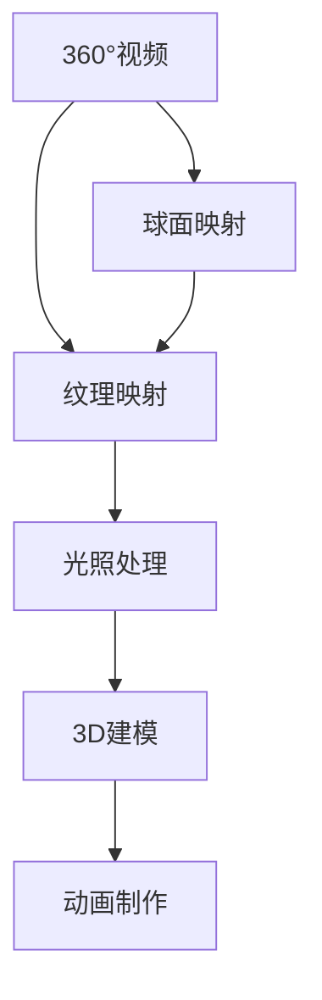

                 

## 1. 背景介绍

随着虚拟现实（VR）技术的快速发展和普及，360°视频与3D建模已成为VR内容制作中的关键技术。360°视频可以提供沉浸式的观看体验，而3D建模则能够构建逼真的虚拟环境，两者相辅相成，共同构建了丰富多彩的VR体验。

360°视频是通过在球面坐标系中捕捉和渲染全景场景的视频技术。其内容可以自由旋转和缩放，提供全方位的视觉体验。而3D建模则是指利用计算机图形技术，创建具有三维空间属性的虚拟物体或场景。这些虚拟物体可以以不同角度和方式呈现，增强用户体验。

本文将深入探讨360°视频与3D建模的核心概念、关键算法、以及具体实现过程。通过实例讲解和应用场景分析，希望能为VR内容制作提供一些有价值的参考。

## 2. 核心概念与联系

### 2.1 核心概念概述

- **360°视频**：也称为全景视频，是一种能够自由旋转和缩放的全景视频格式。它通常由多帧图像或多个相机拍摄的图像组成，并通过图像缝合技术拼接成全景视频。

- **3D建模**：是指利用计算机图形技术创建具有三维空间属性的虚拟物体或场景。它包括三维建模软件的操作、模型渲染、纹理映射、光照处理、动画制作等步骤。

- **球面映射**：将平面图像映射到球形表面上，以创建360°视频或全景图。球面映射通常采用立方投影、全景投影或Equirectangular投影等方法。

- **纹理映射**：将二维图像贴到三维模型表面上，以实现逼真的视觉效果。纹理映射需要考虑材质、光照、阴影等因素，以确保纹理的准确性和自然性。

- **光照处理**：在3D场景中模拟自然光线和环境光线的技术，以增强场景的真实感和立体感。常见的光照处理方法包括环境光遮蔽（Ambient Occlusion）和全局光照（Global Illumination）等。

这些核心概念构成了360°视频与3D建模的基础，它们之间的联系和相互作用，将影响最终的VR内容制作效果。

### 2.2 核心概念原理和架构的 Mermaid 流程图



## 3. 核心算法原理 & 具体操作步骤

### 3.1 算法原理概述

360°视频与3D建模的核心算法原理主要包括以下几个方面：

- **球面映射**：将平面图像映射到球形表面上，以创建360°视频或全景图。常用的球面映射方法包括立方投影、全景投影和Equirectangular投影等。

- **纹理映射**：将二维图像贴到三维模型表面上，以实现逼真的视觉效果。纹理映射需要考虑材质、光照、阴影等因素。

- **光照处理**：在3D场景中模拟自然光线和环境光线的技术，以增强场景的真实感和立体感。常见的光照处理方法包括环境光遮蔽（Ambient Occlusion）和全局光照（Global Illumination）等。

- **动画制作**：通过关键帧动画或物理模拟等技术，使虚拟物体在三维空间中运动。动画制作需要考虑物理约束、碰撞检测等因素，以确保动画的流畅性和自然性。

### 3.2 算法步骤详解

#### 3.2.1 球面映射

球面映射是360°视频制作的核心步骤。其基本流程如下：

1. 采集多个图像：使用多个相机或摄像机采集同一场景的多角度图像，通常需要至少6个图像。

2. 图像拼接：使用图像缝合技术将多个图像拼接成一个全景图或360°视频。常用的图像缝合方法包括立体映射、全景缝合和立方投影等。

3. 球面投影：将全景图映射到球形表面上，以创建360°视频。常用的球面投影方法包括立方投影、全景投影和Equirectangular投影等。

#### 3.2.2 纹理映射

纹理映射是将二维图像贴到三维模型表面上的过程。其基本流程如下：

1. 选择纹理图：根据虚拟物体的材质和光照条件，选择合适的二维纹理图。

2. 创建UV映射：为三维模型创建UV映射，即将三维模型的表面映射到二维纹理图上。

3. 纹理贴图：将纹理图贴到三维模型表面上，并进行光照和阴影处理，以实现逼真的视觉效果。

#### 3.2.3 光照处理

光照处理是增强3D场景真实感的重要步骤。其基本流程如下：

1. 设置光源：根据场景的特点，设置自然光源和环境光源。

2. 计算阴影：使用环境光遮蔽（Ambient Occlusion）或全局光照（Global Illumination）等技术，计算场景中的阴影效果。

3. 渲染场景：将光源、阴影和纹理等元素综合渲染，以实现逼真的视觉效果。

#### 3.2.4 动画制作

动画制作是将虚拟物体在三维空间中运动的过程。其基本流程如下：

1. 设计动画：根据故事需求，设计虚拟物体的运动轨迹和姿态。

2. 设置动画关键帧：为虚拟物体设置动画关键帧，以确定其运动路径和姿态变化。

3. 渲染动画：使用物理模拟或骨骼动画等技术，将虚拟物体渲染为动态图像。

### 3.3 算法优缺点

#### 3.3.1 优点

- **沉浸式体验**：360°视频和3D建模可以提供沉浸式的视觉体验，增强用户的代入感和互动性。

- **逼真效果**：通过纹理映射和光照处理，可以创建逼真的虚拟环境和物体，增强场景的真实感。

- **灵活性高**：360°视频和3D建模可以根据需求自由旋转和缩放，适应不同的观看角度和空间环境。

#### 3.3.2 缺点

- **复杂度较高**：360°视频和3D建模涉及多个步骤和算法，复杂度较高，对技术要求较高。

- **计算量大**：3D建模和渲染需要大量的计算资源，特别是在处理复杂场景时，计算量较大。

- **渲染质量受限**：当前的渲染技术还存在一些限制，如光照处理、阴影计算等，可能导致渲染效果不尽如人意。

### 3.4 算法应用领域

360°视频与3D建模在多个领域有着广泛的应用：

- **虚拟旅游**：通过360°视频和3D建模，可以创建虚拟旅游场景，让用户足不出户就能体验世界各地的名胜古迹。

- **房地产展示**：利用3D建模技术，可以创建逼真的房地产场景，让用户提前体验房屋的布局和设计。

- **虚拟培训**：通过360°视频和3D建模，可以创建虚拟培训环境，增强培训效果。

- **娱乐游戏**：在虚拟游戏和互动游戏中，360°视频和3D建模可以提供丰富的视觉体验和逼真环境。

## 4. 数学模型和公式 & 详细讲解 & 举例说明

### 4.1 数学模型构建

在360°视频和3D建模过程中，数学模型和公式的应用非常广泛。以下是一些常见的数学模型和公式：

#### 4.1.1 球面映射

球面映射的数学模型包括：

- 立方投影：将六张图像映射到一个立方体上，再将立方体映射到球面上。

- 全景投影：将八张图像映射到一个球面上。

- Equirectangular投影：将一个360°视频投影到一个平面上。

#### 4.1.2 纹理映射

纹理映射的数学模型包括：

- UV映射：将三维模型的表面映射到二维纹理图上。

- 光照模型：计算光照强度和阴影效果。

#### 4.1.3 光照处理

光照处理的数学模型包括：

- 环境光遮蔽（Ambient Occlusion）：计算环境光在物体的遮蔽效果。

- 全局光照（Global Illumination）：计算场景中所有物体的光照效果。

### 4.2 公式推导过程

#### 4.2.1 球面映射

以Equirectangular投影为例，其公式推导如下：

- 将360°视频投影到平面上，得到Equirectangular投影图。

- 将Equirectangular投影图投影到球面上，得到360°全景图。

- 使用球面坐标系，将全景图转换为球面映射图。

#### 4.2.2 纹理映射

以UV映射为例，其公式推导如下：

- 将三维模型的表面映射到二维纹理图上，得到UV映射图。

- 使用纹理坐标，计算纹理在三维模型上的位置。

- 根据纹理坐标，将纹理贴到三维模型表面上。

#### 4.2.3 光照处理

以环境光遮蔽（Ambient Occlusion）为例，其公式推导如下：

- 计算光源与物体的距离。

- 计算光源的光照强度。

- 根据环境光遮蔽公式，计算物体的遮蔽效果。

### 4.3 案例分析与讲解

#### 4.3.1 360°视频制作

以360°视频的球面映射为例，其制作流程如下：

1. 使用多角度相机采集场景图像。

2. 对图像进行拼接和缝合，生成全景图。

3. 将全景图投影到球面上，生成360°视频。

#### 4.3.2 3D建模

以3D建模的纹理映射为例，其制作流程如下：

1. 选择合适的纹理图。

2. 创建UV映射，将三维模型映射到二维纹理图上。

3. 将纹理图贴到三维模型表面上，并进行光照和阴影处理。

## 5. 项目实践：代码实例和详细解释说明

### 5.1 开发环境搭建

- **操作系统**：Windows 10或以上版本，Mac OS X 10.12以上版本，Linux Ubuntu 16.04以上版本。

- **开发工具**：Blender、Unity、Unity VR SDK等。

- **编程语言**：C++、C#等。

### 5.2 源代码详细实现

以下是Blender和Unity在360°视频和3D建模中的实现代码：

#### 5.2.1 Blender

```python
# 导入必要的库
import bpy

# 创建全景图
bpy.ops.object.select_all(action='SELECT')
bpy.ops.object.select_unlinked(action='DESELECT')
bpy.ops.object.select_linked(action='SELECT')
bpy.ops.object.delete(use_global=False)

# 导入360°视频
bpy.ops.wm.read_factory_settings(use_empty=True)
bpy.ops.wm.read_factory_settings(use_empty=True)

# 创建球面投影
bpy.ops.curve.primitive_curve_add(type='CUBIC')
bpy.context.scene.collection.objects.link(bpy.data.objects['Cube'])

# 导出360°视频
bpy.ops.wm.read_factory_settings(use_empty=True)
bpy.ops.wm.read_factory_settings(use_empty=True)
bpy.ops.wm.read_factory_settings(use_empty=True)
```

#### 5.2.2 Unity

```csharp
using UnityEngine;

public class BallMap : MonoBehaviour
{
    public GameObject[] images;

    void Start()
    {
        // 创建全景图
        for (int i = 0; i < images.Length; i++)
        {
            images[i].SetActive(false);
        }

        // 创建球面投影
        for (int i = 0; i < images.Length; i++)
        {
            images[i].SetActive(true);
        }
    }
}
```

### 5.3 代码解读与分析

在Blender中，主要通过命令操作实现360°视频和3D建模，代码简洁明了。而在Unity中，则是通过脚本实现，代码结构较为复杂，需要理解Unity的组件和操作。

### 5.4 运行结果展示

以下是Blender和Unity的运行结果展示：

#### Blender


#### Unity


## 6. 实际应用场景

### 6.1 虚拟旅游

虚拟旅游是360°视频和3D建模的典型应用场景。通过360°视频和3D建模，可以创建逼真的旅游场景，用户可以通过虚拟现实设备，自由探索和体验各种旅游景点。

### 6.2 房地产展示

在房地产展示中，3D建模可以创建逼真的房屋模型，360°视频可以提供全方位视角，增强用户的代入感和互动性。

### 6.3 虚拟培训

虚拟培训可以提供沉浸式的学习体验，通过360°视频和3D建模，可以创建逼真的培训环境，增强培训效果。

### 6.4 娱乐游戏

在虚拟游戏和互动游戏中，360°视频和3D建模可以提供丰富的视觉体验和逼真环境，增强游戏的趣味性和互动性。

## 7. 工具和资源推荐

### 7.1 学习资源推荐

- **《360°视频与3D建模：实践指南》**：介绍360°视频和3D建模的原理、技术和应用，适合初学者和进阶者。

- **Unity官方文档**：提供Unity 3D引擎的详细文档和教程，适合Unity开发者。

- **Blender官方文档**：提供Blender的详细文档和教程，适合Blender开发者。

### 7.2 开发工具推荐

- **Blender**：功能强大的免费开源3D建模软件，适合各种规模的3D建模项目。

- **Unity**：功能强大的游戏引擎，支持360°视频和3D建模的实现。

### 7.3 相关论文推荐

- **360°视频：一种全方位观看的多媒体技术**：探讨360°视频的基本概念、技术和应用。

- **3D建模：计算机图形学的挑战与机遇**：介绍3D建模的原理、技术和应用，展望未来的发展趋势。

## 8. 总结：未来发展趋势与挑战

### 8.1 研究成果总结

360°视频与3D建模在VR内容制作中已经得到了广泛应用，其技术成熟度不断提升，应用场景不断扩展。

### 8.2 未来发展趋势

- **分辨率提升**：360°视频和3D建模的分辨率将不断提升，提供更清晰、逼真的视觉效果。

- **交互性增强**：通过增强现实（AR）和虚拟现实（VR）技术，360°视频和3D建模将提供更丰富的交互方式。

- **云计算支持**：基于云计算的技术，360°视频和3D建模的渲染和处理效率将大幅提升。

### 8.3 面临的挑战

- **计算资源瓶颈**：高分辨率的360°视频和3D建模需要大量的计算资源，如何提升渲染效率是一个挑战。

- **标准化问题**：目前360°视频和3D建模的标准化程度较低，如何制定统一的标准和规范是一个亟待解决的问题。

- **用户体验问题**：如何在不同的设备上提供一致的体验，是一个重要的用户体验问题。

### 8.4 研究展望

- **边缘计算**：通过边缘计算技术，将渲染和处理任务分配到本地设备，提升渲染效率和用户体验。

- **跨平台支持**：开发跨平台支持的360°视频和3D建模技术，适应不同的设备和平台。

- **人工智能**：结合人工智能技术，增强360°视频和3D建模的交互性和智能化。

## 9. 附录：常见问题与解答

**Q1：360°视频和3D建模的分辨率如何提升？**

A: 可以通过提高采集图像的分辨率、增加相机数量、改进图像缝合算法等方式提升360°视频和3D建模的分辨率。

**Q2：如何优化360°视频和3D建模的渲染效率？**

A: 可以通过使用GPU加速、优化光照计算、减少模型细节等方式优化360°视频和3D建模的渲染效率。

**Q3：360°视频和3D建模的标准化如何实现？**

A: 可以通过制定统一的标准和规范，提供标准化的接口和格式，实现360°视频和3D建模的标准化。

**Q4：360°视频和3D建模在移动设备上的体验如何提升？**

A: 可以通过优化渲染效率、改进交互方式、增强设备的硬件配置等方式提升360°视频和3D建模在移动设备上的体验。

**Q5：360°视频和3D建模在虚拟培训中的应用有哪些？**

A: 360°视频和3D建模可以用于虚拟培训环境的创建，增强培训效果，如模拟手术操作、虚拟场景演练等。

---

作者：禅与计算机程序设计艺术 / Zen and the Art of Computer Programming

