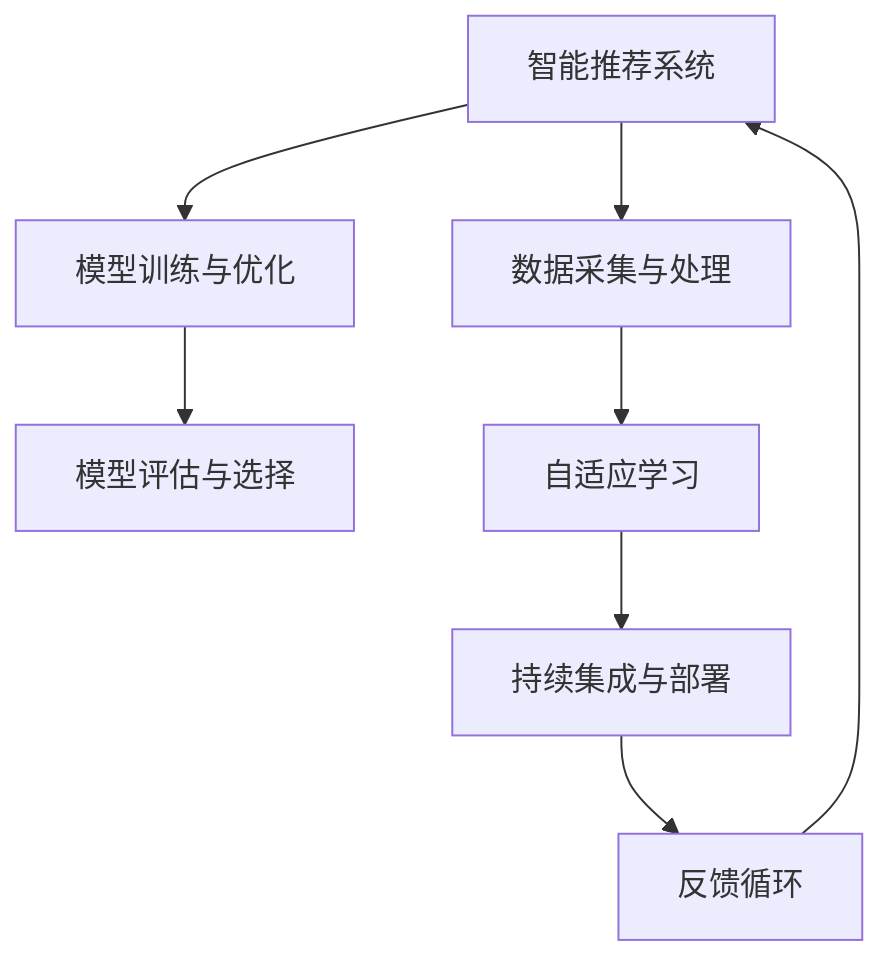

                 

# VUCA时代,快速学习成为制胜关键

## 1. 背景介绍

### 1.1 问题由来
当今世界正处于VUCA（Volatility, Uncertainty, Complexity, Ambiguity）时代，技术更新迭代速度快，市场变化多端，产业环境充满不确定性。在这样的背景下，快速学习并及时掌握新知识、新技术，成为企业和个人在竞争中占据优势的关键。

人工智能技术的快速发展，为快速学习提供了有力支持。深度学习、强化学习、自然语言处理等技术不断涌现，极大地加速了知识和经验的积累与传播。然而，如何高效地学习、使用这些技术，并将其应用到实际工作中，仍然是一个重要的挑战。

### 1.2 问题核心关键点
快速学习成为制胜关键，主要体现在以下几个方面：

1. **快速适应新环境**：快速学习能够使企业和个人迅速适应市场变化，抓住新的机遇。
2. **提升竞争力**：持续学习可以不断提升个人和团队的技术水平，增强核心竞争力。
3. **创造新价值**：通过快速学习，可以在短时间内掌握新技术，创造出新的商业价值和社会价值。
4. **驱动创新**：快速学习是技术创新的重要驱动力，能够不断推动行业进步和突破。

## 2. 核心概念与联系

### 2.1 核心概念概述

为更好地理解如何在VUCA时代高效学习，本节将介绍几个关键概念：

- **快速学习**：指通过高效的方法和工具，迅速掌握和应用新知识的过程。
- **智能推荐系统**：利用大数据和机器学习算法，为用户推荐个性化内容和服务，提升学习效率和效果。
- **自适应学习**：根据用户的反馈和行为，动态调整学习内容和策略，以适应不同的学习需求和环境。
- **模型训练与优化**：通过数据训练和学习算法，不断优化模型性能，提升学习质量和效果。
- **持续集成与部署**：通过自动化流程和工具，持续集成新代码，快速部署和迭代优化模型，加速学习和应用。

这些核心概念之间存在紧密联系，形成一个完整的快速学习生态系统。通过理解这些概念及其相互关系，可以更好地构建高效的学习和应用系统。

### 2.2 核心概念原理和架构的 Mermaid 流程图



这个流程图展示了核心概念之间的逻辑关系：

1. **数据采集与处理**：从各种渠道收集学习资料和反馈数据。
2. **模型训练与优化**：使用数据训练模型，并通过算法优化提升模型性能。
3. **模型评估与选择**：评估模型的效果并选择最合适的模型用于推荐。
4. **自适应学习**：根据用户反馈和行为动态调整学习内容和策略。
5. **持续集成与部署**：通过自动化流程快速集成和部署新模型。
6. **反馈循环**：通过用户反馈和新数据不断优化模型和推荐策略。

## 3. 核心算法原理 & 具体操作步骤

### 3.1 算法原理概述

快速学习的关键在于高效地获取和应用新知识。基于推荐系统和大数据技术的快速学习框架，可以通过对用户行为的分析和学习，精准推荐合适的学习资源，从而加速学习过程。

在算法原理上，快速学习主要依赖以下技术：

1. **协同过滤**：基于用户和项目之间的相似性，推荐相关内容。
2. **矩阵分解**：通过矩阵分解技术，挖掘用户和项目之间的隐式关系。
3. **深度学习**：利用深度神经网络对用户行为进行建模，提高推荐精度。
4. **强化学习**：通过与环境的互动，动态调整推荐策略，提升用户体验。

### 3.2 算法步骤详解

基于推荐系统的快速学习一般包括以下几个关键步骤：

**Step 1: 数据准备与预处理**
- 收集用户的学习行为数据，如浏览、点击、评分等。
- 对数据进行清洗、归一化、特征工程等预处理，以便后续建模使用。

**Step 2: 模型训练与优化**
- 选择合适的推荐算法（如协同过滤、矩阵分解、深度学习等），使用训练数据进行模型训练。
- 使用交叉验证等技术评估模型效果，进行参数调整和模型优化。

**Step 3: 模型评估与选择**
- 在测试数据集上评估模型的推荐效果，如准确率、召回率、F1值等指标。
- 选择性能最佳的模型用于实际推荐。

**Step 4: 自适应学习与个性化推荐**
- 根据用户的行为和反馈，动态调整推荐策略和内容。
- 引入强化学习等技术，实时优化推荐算法，提升用户体验。

**Step 5: 持续集成与部署**
- 将优化后的模型部署到生产环境中，持续接收新数据和反馈。
- 使用持续集成工具（如Jenkins、GitLab CI等）自动化部署流程。

### 3.3 算法优缺点

快速学习推荐系统具有以下优点：
1. 高效性：通过数据分析和算法优化，快速推荐相关学习内容，提升学习效率。
2. 个性化：根据用户兴趣和行为，提供个性化的学习资源，提升学习效果。
3. 实时性：通过实时反馈和自适应学习，动态调整推荐策略，提升用户体验。
4. 可扩展性：适应大规模数据和高并发场景，具有较强的扩展能力。

然而，快速学习也存在一些局限性：
1. 数据依赖：推荐系统的性能高度依赖于数据的丰富性和质量。
2. 冷启动问题：对于新用户和新项目，推荐系统难以提供准确的推荐。
3. 隐私风险：推荐系统涉及大量用户数据，需要严格的数据隐私保护措施。
4. 模型复杂度：深度学习等复杂算法需要较高的计算资源，可能面临性能瓶颈。

尽管存在这些局限性，但快速学习推荐系统在大数据和人工智能的推动下，仍展现出巨大的潜力和应用前景。未来研究将更多地关注如何提升算法的实时性和可解释性，增强系统的稳定性和安全性。

### 3.4 算法应用领域

快速学习推荐系统广泛应用于多个领域，涵盖教育、娱乐、电商等多个场景：

- **在线教育**：通过个性化推荐，提供针对性的课程和学习资源，提升学习效率。
- **视频娱乐**：根据用户观看历史，推荐相关电影、电视剧和综艺节目，增强用户体验。
- **电商零售**：根据用户浏览和购买行为，推荐相关商品，提升销售转化率。
- **新闻阅读**：根据用户阅读习惯，推荐相关新闻和文章，提升信息获取效率。
- **智能家居**：通过个性化推荐，提升智能设备的使用体验和效率。

这些应用场景展示了快速学习推荐系统在各行各业的广泛应用，为用户带来了更加个性化和高效的服务体验。

## 4. 数学模型和公式 & 详细讲解 & 举例说明

### 4.1 数学模型构建

在推荐系统中，常见的数学模型包括协同过滤、矩阵分解和深度学习等。以协同过滤为例，其基本数学模型可以表示为：

$$
r_{ui} = \theta_u^T\phi_i + b_u
$$

其中，$r_{ui}$ 表示用户 $u$ 对项目 $i$ 的评分预测值，$\theta_u$ 和 $\phi_i$ 分别表示用户和项目的隐向量，$b_u$ 为截距项。

### 4.2 公式推导过程

以协同过滤为例，推导其评分预测公式：

1. **假设用户 $u$ 对项目 $i$ 的实际评分 $r_{ui}$ 可以表示为 $u$ 的隐向量 $\theta_u$ 和 $i$ 的隐向量 $\phi_i$ 的内积，再加上截距项 $b_u$**：

$$
r_{ui} = \theta_u^T\phi_i + b_u
$$

2. **假设 $u$ 和 $i$ 的隐向量都是低维的，可以通过矩阵分解将其表示为 $\theta_u = W_uU$ 和 $\phi_i = W_iV$**，其中 $W_u$ 和 $W_i$ 是用户和项目的映射矩阵，$U$ 和 $V$ 是隐向量矩阵：

$$
\theta_u = W_uU, \quad \phi_i = W_iV
$$

3. **将 $r_{ui}$ 表示为 $U$ 和 $V$ 的内积加上截距项**：

$$
r_{ui} = (W_uU)^T(W_iV) + b_u = U^TW_u^TW_iV + b_u
$$

4. **通过求解 $U$ 和 $V$ 使得 $r_{ui}$ 尽可能接近实际评分 $r_{ui}$**，得到协同过滤模型的参数：

$$
U, V = \mathop{\arg\min}_{U,V} \frac{1}{N}\sum_{u,i}(r_{ui} - U^TW_u^TW_iV)^2
$$

5. **在实际应用中，通常使用梯度下降等优化算法求解最小化问题**，得到最终的隐向量 $U$ 和 $V$，进而计算评分预测值 $r_{ui}$。

### 4.3 案例分析与讲解

以Amazon推荐系统为例，分析其快速学习推荐过程：

1. **数据采集与预处理**：Amazon收集用户的浏览、点击和购买数据，并进行清洗和归一化处理。
2. **模型训练与优化**：使用协同过滤算法训练隐向量矩阵 $U$ 和 $V$，通过梯度下降等优化算法调整模型参数。
3. **模型评估与选择**：在测试数据集上评估模型效果，选择性能最佳的模型。
4. **自适应学习与个性化推荐**：根据用户的行为和反馈，动态调整推荐策略，实时更新隐向量矩阵。
5. **持续集成与部署**：通过自动化工具持续集成新数据和反馈，快速部署优化后的模型。

Amazon推荐系统通过快速学习推荐，大幅提升了用户体验和销售转化率，成为电商领域的典型案例。

## 5. 项目实践：代码实例和详细解释说明

### 5.1 开发环境搭建

在进行推荐系统开发前，我们需要准备好开发环境。以下是使用Python进行TensorFlow开发的环境配置流程：

1. 安装Anaconda：从官网下载并安装Anaconda，用于创建独立的Python环境。

2. 创建并激活虚拟环境：
```bash
conda create -n tf-env python=3.8 
conda activate tf-env
```

3. 安装TensorFlow：根据CUDA版本，从官网获取对应的安装命令。例如：
```bash
conda install tensorflow -c conda-forge -c pytorch
```

4. 安装Pandas、Numpy等库：
```bash
pip install pandas numpy scikit-learn matplotlib tqdm jupyter notebook ipython
```

完成上述步骤后，即可在`tf-env`环境中开始推荐系统开发。

### 5.2 源代码详细实现

下面我们以协同过滤为例，给出使用TensorFlow实现推荐系统的代码实现。

```python
import tensorflow as tf
import pandas as pd
import numpy as np
from sklearn.metrics import mean_squared_error

# 导入数据集
data = pd.read_csv('ratings.csv')

# 处理数据集
users = data['user_id'].unique()
items = data['item_id'].unique()
ratings = pd.DataFrame(data.groupby(['user_id', 'item_id'])['rating'].mean().reset_index())

# 构建用户和项目隐向量矩阵
user2vec = np.random.randn(len(users), 10)
item2vec = np.random.randn(len(items), 10)

# 定义评分预测函数
def predict(ratings, user2vec, item2vec):
    user_vec = np.array([user2vec[user] for user in ratings['user_id']])
    item_vec = np.array([item2vec[item] for item in ratings['item_id']])
    pred = np.dot(user_vec, item_vec.T) + ratings['rating'].mean()
    return pred

# 定义损失函数
def loss(pred, actual):
    return tf.reduce_mean(tf.square(pred - actual))

# 定义优化器
optimizer = tf.keras.optimizers.Adam()

# 训练模型
for epoch in range(100):
    for user, item in zip(users, items):
        pred = predict(ratings, user2vec, item2vec)
        loss_val = loss(pred, ratings.loc[(user, item), 'rating'])
        optimizer.apply_gradients(zip(tf.gradients(loss_val, [user2vec, item2vec]), [user2vec, item2vec]))

# 模型评估
preds = predict(ratings, user2vec, item2vec)
rmse = np.sqrt(mean_squared_error(preds, ratings['rating']))
print(f"RMSE: {rmse}")
```

### 5.3 代码解读与分析

让我们再详细解读一下关键代码的实现细节：

**数据预处理**：
- 导入数据集，并进行清洗和归一化处理，去除重复和缺失数据，生成用户和项目的隐向量矩阵。

**评分预测函数**：
- 使用用户和项目的隐向量矩阵计算预测评分，使用均值评分作为基准。

**损失函数**：
- 定义均方误差损失函数，计算预测评分与实际评分的差距。

**优化器**：
- 使用Adam优化器进行模型参数的更新。

**模型训练**：
- 循环训练模型，每次更新用户和项目隐向量矩阵，减小损失值。

**模型评估**：
- 使用均方根误差（RMSE）评估模型效果，输出评估结果。

可以看到，TensorFlow提供的高效计算图和丰富的API，使得快速学习推荐系统的开发变得简洁高效。开发者可以专注于算法设计和模型优化，而不必过多关注底层的实现细节。

当然，工业级的系统实现还需考虑更多因素，如模型的保存和部署、超参数的自动搜索、更灵活的任务适配层等。但核心的快速学习推荐范式基本与此类似。

## 6. 实际应用场景

### 6.1 在线教育平台

在线教育平台通过推荐系统，向用户推荐个性化的学习资源，显著提升学习效率。例如，Coursera根据用户的学习历史和行为，推荐适合其水平和兴趣的课程，帮助用户更快地掌握知识。

在技术实现上，可以收集用户的浏览、点击、评分等行为数据，使用协同过滤、矩阵分解等推荐算法进行模型训练，再通过实时反馈动态调整推荐策略。如此构建的推荐系统，能大幅提升用户体验和学习效果。

### 6.2 视频流媒体平台

视频流媒体平台通过推荐系统，为用户提供个性化的视频内容，提升用户体验和满意度。例如，Netflix根据用户观影历史和评分，推荐相关电影和电视剧，满足用户的观影需求。

在技术实现上，可以收集用户的观看历史、评分和搜索记录，使用协同过滤、深度学习等推荐算法进行模型训练，再通过实时反馈动态调整推荐策略。推荐系统通过持续学习和优化，不断提升推荐精度和用户体验。

### 6.3 电商零售平台

电商零售平台通过推荐系统，向用户推荐个性化商品，提升销售转化率和用户满意度。例如，Amazon根据用户的浏览和购买历史，推荐相关商品，提高销售转化率。

在技术实现上，可以收集用户的浏览、点击和购买数据，使用协同过滤、矩阵分解等推荐算法进行模型训练，再通过实时反馈动态调整推荐策略。推荐系统通过持续学习和优化，不断提升推荐精度和用户满意度。

### 6.4 未来应用展望

随着快速学习推荐技术的不断发展，其在更多领域将得到应用，为各行各业带来变革性影响。

在智慧医疗领域，通过个性化推荐系统，向医生推荐相关文献和临床指南，提升医疗决策的准确性和效率。在智能家居领域，通过推荐系统，向用户推荐个性化的家居设备和服务，提升生活便利性和舒适度。

此外，在金融、交通、能源等多个领域，推荐系统也将不断拓展应用场景，为各行各业带来新的技术支持和应用机会。相信随着技术的日益成熟，推荐系统将成为人工智能落地应用的重要范式，推动各行各业的技术进步和产业升级。

## 7. 工具和资源推荐

### 7.1 学习资源推荐

为了帮助开发者系统掌握快速学习推荐系统的理论基础和实践技巧，这里推荐一些优质的学习资源：

1. 《推荐系统实践》系列博文：由大模型技术专家撰写，深入浅出地介绍了推荐系统原理、算法和实践案例。

2. CS229《机器学习》课程：斯坦福大学开设的机器学习明星课程，有Lecture视频和配套作业，带你深入理解推荐系统的数学原理和算法实现。

3. 《推荐系统》书籍：推荐系统领域的经典著作，全面介绍了推荐系统的理论基础和实际应用。

4. Kaggle推荐系统竞赛：通过实际竞赛项目，体验推荐系统的设计和优化过程，提升实战能力。

5. Google协同过滤白皮书：谷歌发布的协同过滤推荐系统白皮书，详细介绍了谷歌推荐系统的设计和优化方法，是了解大厂实践的重要参考资料。

通过对这些资源的学习实践，相信你一定能够快速掌握推荐系统的精髓，并用于解决实际的业务问题。

### 7.2 开发工具推荐

高效的开发离不开优秀的工具支持。以下是几款用于快速学习推荐系统开发的常用工具：

1. TensorFlow：由Google主导开发的开源深度学习框架，生产部署方便，适合大规模工程应用。同时支持分布式计算和优化器，可以处理大规模数据和模型。

2. PyTorch：基于Python的开源深度学习框架，灵活动态的计算图，适合快速迭代研究。推荐系统可以使用PyTorch的TensorBoard工具进行可视化，方便调试和优化。

3. TensorBoard：TensorFlow配套的可视化工具，可实时监测模型训练状态，并提供丰富的图表呈现方式，是调试推荐模型的得力助手。

4. Scikit-learn：Python的科学计算库，提供丰富的数据处理和模型训练工具，适合推荐系统的数据预处理和基础模型训练。

5. Pandas：Python的数据处理库，可以高效处理推荐系统的数据集，支持多种数据格式和操作。

合理利用这些工具，可以显著提升推荐系统的开发效率，加快创新迭代的步伐。

### 7.3 相关论文推荐

快速学习推荐技术的发展源于学界的持续研究。以下是几篇奠基性的相关论文，推荐阅读：

1. Matrix Factorization Techniques for Recommender Systems（SVD算法）：提出了矩阵分解技术，为推荐系统奠定了基础。

2. Factorization Machines for Recommender Systems：提出FM算法，进一步提升了推荐系统的准确性和可解释性。

3. Deep Matrix Factorization（DMF算法）：引入深度神经网络，通过多层非线性映射提升推荐精度。

4. Attention and Transformers for Recommender Systems：引入注意力机制和Transformer模型，提高了推荐系统的复杂性和精度。

5. Adaptive Matrix Factorization（AMF算法）：通过自适应学习，动态调整推荐策略，提升了推荐系统的实时性和个性化。

这些论文代表了大数据推荐系统的发展脉络。通过学习这些前沿成果，可以帮助研究者把握学科前进方向，激发更多的创新灵感。

## 8. 总结：未来发展趋势与挑战

### 8.1 总结

本文对快速学习推荐系统进行了全面系统的介绍。首先阐述了快速学习在VUCA时代的重要性和应用场景，明确了推荐系统在提高学习效率和用户体验方面的独特价值。其次，从原理到实践，详细讲解了推荐系统的数学原理和关键步骤，给出了推荐系统开发的完整代码实例。同时，本文还广泛探讨了推荐系统在教育、娱乐、电商等多个领域的应用前景，展示了快速学习推荐系统的巨大潜力。

通过本文的系统梳理，可以看到，快速学习推荐系统正在成为数据驱动行业的重要范式，极大地提升了数据处理和知识传播的效率。未来，伴随大数据和人工智能的持续演进，推荐系统必将在更多行业得到应用，为各行各业带来更高效、更个性化的服务体验。

### 8.2 未来发展趋势

展望未来，快速学习推荐系统将呈现以下几个发展趋势：

1. **深度学习应用普及**：深度学习模型将在推荐系统中得到更广泛的应用，提升推荐精度和复杂性。
2. **实时性和个性化增强**：通过引入实时反馈和自适应学习，动态调整推荐策略，提升用户体验和个性化程度。
3. **多模态推荐兴起**：融合视觉、语音等多模态信息，提升推荐系统的表现力和智能化程度。
4. **跨领域推荐技术突破**：通过跨领域协同训练，提升推荐系统的通用性和适应性，拓展应用场景。
5. **隐私保护和安全性提升**：采用隐私保护技术，确保用户数据的安全性和隐私性。
6. **联邦学习与边缘计算**：引入联邦学习等技术，通过边缘计算降低计算和通信成本，提升推荐系统效率。

这些趋势凸显了快速学习推荐技术的广阔前景。这些方向的探索发展，必将进一步提升推荐系统的性能和应用范围，为各行各业带来更多的价值。

### 8.3 面临的挑战

尽管快速学习推荐系统已经取得了瞩目成就，但在迈向更加智能化、普适化应用的过程中，它仍面临着诸多挑战：

1. **数据质量与获取**：推荐系统的性能高度依赖于数据的丰富性和质量，数据获取和质量控制是一个重要挑战。
2. **模型复杂度和计算资源**：深度学习等复杂算法需要较高的计算资源，可能面临性能瓶颈。
3. **用户隐私和数据安全**：推荐系统涉及大量用户数据，需要严格的数据隐私保护措施。
4. **冷启动问题**：对于新用户和新项目，推荐系统难以提供准确的推荐。
5. **个性化与多样性平衡**：如何在提升个性化推荐的同时，保证推荐结果的多样性，避免信息过载。
6. **算法可解释性**：推荐系统的复杂模型往往难以解释，用户和开发者难以理解和调试。

尽管存在这些挑战，但快速学习推荐系统在大数据和人工智能的推动下，仍展现出巨大的潜力和应用前景。未来研究将更多地关注如何提升算法的实时性和可解释性，增强系统的稳定性和安全性。

### 8.4 研究展望

面对快速学习推荐系统所面临的种种挑战，未来的研究需要在以下几个方面寻求新的突破：

1. **提升数据质量与获取效率**：通过数据增强、数据预处理等技术，提高数据质量，降低数据获取成本。
2. **优化模型计算效率**：开发更加高效的推荐算法和计算图，降低计算资源消耗。
3. **加强隐私保护与数据安全**：采用隐私保护技术，确保用户数据的安全性和隐私性。
4. **解决冷启动问题**：引入冷启动策略，如用户画像、物品嵌入等，提高推荐系统的初始化效果。
5. **提升算法可解释性**：引入可解释性技术，如模型可视化、特征解释等，提高推荐系统的透明度和可信度。
6. **融合多模态信息**：融合视觉、语音等多模态信息，提升推荐系统的表现力和智能化程度。

这些研究方向的探索，必将引领快速学习推荐系统技术迈向更高的台阶，为各行各业带来更高效、更智能的服务体验。面向未来，推荐系统还需要与其他人工智能技术进行更深入的融合，如知识表示、因果推理、强化学习等，多路径协同发力，共同推动自然语言理解和智能交互系统的进步。只有勇于创新、敢于突破，才能不断拓展推荐系统的边界，让智能技术更好地造福人类社会。

## 9. 附录：常见问题与解答

**Q1：快速学习推荐系统如何处理冷启动问题？**

A: 冷启动问题是指对于新用户和新项目，推荐系统难以提供准确的推荐。为解决冷启动问题，通常可以采取以下策略：

1. **用户画像**：收集用户的历史行为数据，构建用户画像，预测用户兴趣和偏好。
2. **物品嵌入**：通过自然语言处理等技术，提取物品的语义信息，生成物品嵌入向量，提升推荐系统对新物品的识别能力。
3. **模型复用**：通过迁移学习等技术，复用已有模型的部分参数和结构，加速新模型训练。
4. **数据增强**：通过数据增强技术，扩充新用户和新物品的数据集，提高模型的泛化能力。

这些策略可以结合使用，提升推荐系统对新用户和新物品的处理能力。

**Q2：推荐系统如何实现实时推荐？**

A: 实时推荐是指推荐系统能够动态调整推荐策略，即时更新推荐结果，满足用户需求。为实现实时推荐，通常可以采取以下策略：

1. **流式数据处理**：使用流式处理框架（如Apache Flink、Apache Kafka），实时接收用户行为数据，动态生成推荐结果。
2. **自适应学习**：通过强化学习等技术，根据用户反馈动态调整推荐策略，提升推荐效果。
3. **模型微调**：使用在线学习等技术，实时微调模型参数，保证推荐结果的实时性。
4. **缓存与预热**：通过缓存和预热技术，减少推荐系统的响应时间，提升实时推荐性能。

这些策略可以结合使用，实现推荐系统的实时推荐功能。

**Q3：推荐系统如何处理用户隐私问题？**

A: 推荐系统涉及大量用户数据，需要严格的数据隐私保护措施。为保护用户隐私，通常可以采取以下策略：

1. **差分隐私**：通过加入噪声等技术，保护用户数据的隐私性，防止数据泄露。
2. **联邦学习**：在用户端和服务器端协同训练模型，保护用户数据的本地性和隐私性。
3. **数据脱敏**：通过数据脱敏等技术，保护用户数据的敏感信息，防止数据滥用。
4. **加密技术**：使用数据加密等技术，保护数据在传输和存储过程中的安全性和隐私性。

这些策略可以结合使用，保护用户数据的隐私性，提升推荐系统的可信度和安全性。

**Q4：推荐系统如何提升算法可解释性？**

A: 推荐系统的复杂模型往往难以解释，用户和开发者难以理解和调试。为提升算法可解释性，通常可以采取以下策略：

1. **模型可视化**：使用模型可视化工具（如TensorBoard），展示模型结构和参数，帮助用户理解推荐过程。
2. **特征解释**：通过特征重要性等技术，解释模型对用户行为和物品特征的关注点，提升模型的透明度。
3. **规则与模板**：引入规则和模板，简化推荐系统，提升可解释性和可维护性。
4. **用户反馈机制**：通过用户反馈机制，收集用户对推荐结果的评价和建议，提升推荐系统的可解释性和用户满意度。

这些策略可以结合使用，提升推荐系统的可解释性和用户满意度。

---

作者：禅与计算机程序设计艺术 / Zen and the Art of Computer Programming

