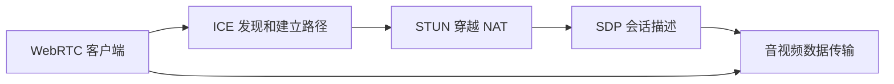

                 

# WebRTC 技术：浏览器中的实时通信

> 关键词：WebRTC, 浏览器, 实时通信, 音视频, 点对点, 浏览器端到端

## 1. 背景介绍

### 1.1 问题由来

在互联网时代，实时音视频通信已经成为了人们日常生活和工作中不可或缺的一部分。无论是在线教育、远程办公、视频会议，还是游戏娱乐，实时音视频的传输都扮演着至关重要的角色。然而，传统的实时音视频通信依赖于专门的客户端应用，如Skype、QQ、微信等，这些应用往往需要安装在设备上，并且需要在服务器上部署视频会议服务，不仅开发和维护成本高，而且用户体验也受到一定的限制。

为了解决这个问题，WebRTC应运而生。WebRTC 是一个基于网络的音视频通信协议，它允许网页在无需安装客户端软件的情况下，直接在浏览器中实现点对点（P2P）的音视频通信。WebRTC 协议是互联网工程任务组（IETF）的标准，由谷歌和微软共同开发，基于ICE 和 STUN 等协议，能够轻松实现音视频通信的端到端传输。

### 1.2 问题核心关键点

WebRTC 的核心关键点在于实现点对点的音视频通信。其主要特点如下：

- 无需安装客户端软件。WebRTC 允许网页直接在浏览器中实现音视频通信，避免了客户端软件带来的复杂性和安装问题。
- 支持多种音视频格式和编解码器。WebRTC 支持多种音视频格式和编解码器，如VP8、VP9、H264 等，能够根据网络条件和设备能力自动选择最优的编解码器。
- 端到端通信。WebRTC 协议实现了音视频的端到端传输，避免了中心服务器的依赖，提高了通信的稳定性和安全性。
- 实时通信。WebRTC 协议通过 Web 浏览器直接传输音视频数据，能够实现低延迟、高带宽的实时通信体验。
- 自适应带宽管理。WebRTC 协议能够根据网络条件和设备能力，动态调整音视频流的大小，避免网络拥塞和卡顿问题。

WebRTC 技术的这些特点，使其在网页应用、移动应用、浏览器扩展等方面得到了广泛应用，已经成为实现浏览器端到端音视频通信的标配技术。

### 1.3 问题研究意义

WebRTC 技术的开发和应用，对实时音视频通信领域带来了革命性的变化。它打破了传统音视频通信的客户端束缚，提升了用户体验和应用场景的多样性，使得实时音视频通信更加便捷和普及。

WebRTC 技术的发展，推动了音视频通信技术的普及和应用场景的拓展，加速了互联网应用的创新和迭代。WebRTC 技术的应用，使得音视频通信变得更加灵活、安全和高效，为用户和企业提供了更加可靠和稳定的音视频通信解决方案。

## 2. 核心概念与联系

### 2.1 核心概念概述

为了更好地理解 WebRTC 技术，首先需要了解一些核心概念。

- WebRTC：基于 Web 标准的实时音视频通信协议，允许网页在无需安装客户端软件的情况下，直接在浏览器中实现点对点的音视频通信。
- ICE：Interactive Connectivity Establishment，一种网络穿透技术，用于发现和建立两端之间的通信路径。
- STUN：Session Traversal Utilities for NAT，一种网络穿透技术，用于穿越 NAT 设备，实现点对点的通信。
- SDP：Session Description Protocol，一种文本格式，用于描述音视频会话的参数和参数。

这些核心概念构成了 WebRTC 技术的基石，理解这些概念，有助于深入掌握 WebRTC 技术的工作原理和应用场景。

### 2.2 核心概念原理和架构的 Mermaid 流程图



这个 Mermaid 流程图展示了 WebRTC 技术的核心流程：

1. WebRTC 客户端向服务器发送 SDP 描述，其中包括音视频参数、编解码器选择等。
2. 服务器接收 SDP 描述，进行会话协商，生成 SDP 描述，并发送给客户端。
3. 客户端收到 SDP 描述，进行 ICE 发现和建立路径，确保两端能够建立连接。
4. 客户端向服务器发送 ICE 候选，进行 STUN 网络穿透，穿越 NAT 设备。
5. 服务器接收 ICE 候选，进行 ICE 协商，建立连接。
6. 客户端进行音视频数据传输，完成音视频通信。

这个流程展示了 WebRTC 技术的核心组件和实现机制，有助于理解 WebRTC 技术的工作原理和应用场景。

## 3. 核心算法原理 & 具体操作步骤

### 3.1 算法原理概述

WebRTC 技术的核心算法原理主要包括以下几个方面：

- ICE 发现和建立路径。ICE 协议通过周期性发送 ICE 候选人，在两端之间发现和建立通信路径，确保两端能够建立连接。
- STUN 穿越 NAT。STUN 协议通过发送 STUN 请求和响应，穿越 NAT 设备，确保两端能够建立连接。
- SDP 会话描述。SDP 协议用于描述音视频会话的参数和参数，确保两端能够协商一致。
- 音视频编解码器选择。WebRTC 协议根据网络条件和设备能力，自动选择最优的音视频编解码器，确保音视频通信的质量和稳定性。
- 自适应带宽管理。WebRTC 协议根据网络条件和设备能力，动态调整音视频流的大小，避免网络拥塞和卡顿问题。

### 3.2 算法步骤详解

WebRTC 技术的具体操作步骤主要包括以下几个步骤：

**Step 1: 创建 WebRTC 客户端**

在 WebRTC 应用中，首先需要创建 WebRTC 客户端。WebRTC 客户端可以由浏览器内置的 API 创建，也可以在页面中使用 JavaScript 和 HTML5 创建。例如，以下是使用 JavaScript 创建 WebRTC 客户端的示例代码：

```javascript
var pc = new RTCPeerConnection();
```

**Step 2: 创建音视频流**

创建 WebRTC 客户端后，需要创建音视频流。音视频流可以由媒体设备提供，如摄像头和麦克风，也可以由其他音视频流提供。以下是创建音视频流的示例代码：

```javascript
var video = document.getElementById('video');
var audio = document.getElementById('audio');
var stream = await navigator.mediaDevices.getUserMedia({ video: true, audio: true });
pc.addStream(stream);
```

**Step 3: 创建 ICE 候选人**

创建音视频流后，需要创建 ICE 候选人。ICE 候选人是一个 IP 地址和端口号的集合，用于发现和建立两端之间的通信路径。以下是创建 ICE 候选人的示例代码：

```javascript
var iceCandidate = new ICECandidate('a/b/c', '1.2.3.4', 1234);
pc.addIceCandidate(iceCandidate);
```

**Step 4: 发送 SDP 描述**

创建 ICE 候选人后，需要发送 SDP 描述。SDP 描述用于描述音视频会话的参数和参数，确保两端能够协商一致。以下是发送 SDP 描述的示例代码：

```javascript
var sdp = pc.createOffer();
pc.setLocalDescription(sdp);
sdp.sdpBody = sdp.toSDPString();
sdp.sdpBody += "a=rtcp-rrc-mb-hs=0\r\n";
pc.onICECandidate = function(event) {
    pc.addIceCandidate(event.candidate);
};
```

**Step 5: 接收 SDP 描述**

接收 SDP 描述后，需要解析 SDP 描述，并进行 ICE 协商和音视频传输。以下是接收 SDP 描述的示例代码：

```javascript
pc.onICECandidate = function(event) {
    pc.addIceCandidate(event.candidate);
};
pc.onICEConnectionStateChange = function(event) {
    if (event.state === 'connected') {
        pc.setRemoteDescription(new RTCSessionDescription(sdp));
        pc.createAnswer();
    }
};
pc.onIceConnectionStateChange = function(event) {
    if (event.state === 'connected') {
        pc.setRemoteDescription(new RTCSessionDescription(sdp));
        pc.createAnswer();
    }
};
```

### 3.3 算法优缺点

WebRTC 技术具有以下优点：

- 无需安装客户端软件。WebRTC 技术允许网页直接在浏览器中实现音视频通信，避免了客户端软件带来的复杂性和安装问题。
- 支持多种音视频格式和编解码器。WebRTC 技术支持多种音视频格式和编解码器，如VP8、VP9、H264 等，能够根据网络条件和设备能力自动选择最优的编解码器。
- 端到端通信。WebRTC 技术实现了音视频的端到端传输，避免了中心服务器的依赖，提高了通信的稳定性和安全性。
- 实时通信。WebRTC 技术通过 Web 浏览器直接传输音视频数据，能够实现低延迟、高带宽的实时通信体验。
- 自适应带宽管理。WebRTC 技术能够根据网络条件和设备能力，动态调整音视频流的大小，避免网络拥塞和卡顿问题。

WebRTC 技术也存在一些缺点：

- 依赖浏览器支持。WebRTC 技术依赖浏览器的实现，不同浏览器之间的支持程度可能存在差异。
- 技术复杂度高。WebRTC 技术涉及多个协议和机制，技术实现较为复杂，需要开发人员具备一定的技术基础。
- 安全性问题。WebRTC 技术涉及端到端通信，如果被攻击者劫持，可能存在安全问题。

尽管存在这些缺点，但 WebRTC 技术仍然是一个极具前景的实时音视频通信解决方案，已经被广泛应用于网页应用、移动应用、浏览器扩展等方面。

### 3.4 算法应用领域

WebRTC 技术主要应用于以下领域：

- 网页应用。WebRTC 技术允许网页直接在浏览器中实现音视频通信，广泛应用于在线教育、远程办公、视频会议等领域。
- 移动应用。WebRTC 技术支持移动设备之间的音视频通信，广泛应用于视频聊天、实时游戏、远程教育等领域。
- 浏览器扩展。WebRTC 技术支持浏览器扩展之间的音视频通信，广泛应用于浏览器插件、浏览器游戏等领域。
- 视频会议。WebRTC 技术支持点对点的音视频通信，广泛应用于视频会议、远程医疗、远程教育等领域。

## 4. 数学模型和公式 & 详细讲解 & 举例说明

### 4.1 数学模型构建

WebRTC 技术的数学模型主要包括以下几个方面：

- ICE 发现和建立路径。ICE 协议通过周期性发送 ICE 候选人，在两端之间发现和建立通信路径，确保两端能够建立连接。
- STUN 穿越 NAT。STUN 协议通过发送 STUN 请求和响应，穿越 NAT 设备，确保两端能够建立连接。
- SDP 会话描述。SDP 协议用于描述音视频会话的参数和参数，确保两端能够协商一致。
- 音视频编解码器选择。WebRTC 协议根据网络条件和设备能力，自动选择最优的音视频编解码器，确保音视频通信的质量和稳定性。
- 自适应带宽管理。WebRTC 协议根据网络条件和设备能力，动态调整音视频流的大小，避免网络拥塞和卡顿问题。

这些数学模型构成了 WebRTC 技术的核心算法框架，理解这些数学模型，有助于深入掌握 WebRTC 技术的工作原理和应用场景。

### 4.2 公式推导过程

以下是 WebRTC 技术中常用的公式推导过程：

**ICE 协议**

ICE 协议的原理是通过周期性发送 ICE 候选人，在两端之间发现和建立通信路径，确保两端能够建立连接。以下是 ICE 协议的推导过程：

1. ICE 候选人。ICE 候选人的格式为：`ip:port/transport:protocol/[candidate][name][username][password]`。
2. ICE 协议的发现和建立路径。ICE 协议通过周期性发送 ICE 候选人，在两端之间发现和建立通信路径。

**STUN 协议**

STUN 协议的原理是通过发送 STUN 请求和响应，穿越 NAT 设备，确保两端能够建立连接。以下是 STUN 协议的推导过程：

1. STUN 请求。STUN 请求的格式为：`STUN:[$username:$password]{$fingerprint:$salt}:{id}[$params]`。
2. STUN 响应。STUN 响应的格式为：`STUN:[$username:$password]{$fingerprint:$salt}:{id}`。
3. STUN 协议的穿越 NAT。STUN 协议通过发送 STUN 请求和响应，穿越 NAT 设备，确保两端能够建立连接。

**SDP 协议**

SDP 协议的原理是用于描述音视频会话的参数和参数，确保两端能够协商一致。以下是 SDP 协议的推导过程：

1. SDP 描述。SDP 描述的格式为：`v=0\r\no=-\r\ns=-\r\nt=0 0\r\nt=IN IP4 1.2.3.4\r\na=rtcp-rrc-mb-hs=0\r\nm=audio 1234 RTP/AVP 0\r\nc=IN IP4 1.2.3.4\r\na=rtcp-mux\r\na=rtpmap:0 RTP/AVP 9\r\na=ice-ufrag:user\r\na=ice-pwd:pass\r\na=fingerprint:fp`。
2. SDP 协议的会话协商。SDP 协议用于描述音视频会话的参数和参数，确保两端能够协商一致。

### 4.3 案例分析与讲解

以下是 WebRTC 技术在网页应用中的案例分析：

**案例：在线教育平台**

在线教育平台可以使用 WebRTC 技术，实现老师和学生之间的实时音视频通信。老师可以通过摄像头和麦克风进行视频和语音授课，学生可以通过摄像头和麦克风进行视频和语音互动。WebRTC 技术可以确保通信的稳定性和实时性，提高教学效果和学习体验。

**案例：视频会议**

视频会议可以使用 WebRTC 技术，实现点对点的音视频通信。在视频会议中，参会者可以通过摄像头和麦克风进行视频和语音交流，实现实时互动。WebRTC 技术可以确保通信的稳定性和安全性，避免信息泄露和劫持问题。

## 5. 项目实践：代码实例和详细解释说明

### 5.1 开发环境搭建

在 WebRTC 应用中，首先需要搭建开发环境。以下是 WebRTC 应用开发环境的搭建流程：

1. 安装 Node.js 和 WebRTC 库。可以使用 npm 安装 Node.js 和 WebRTC 库。
2. 创建 WebRTC 应用项目。可以使用 Vue.js、React 等前端框架创建 WebRTC 应用项目。
3. 安装音视频编解码器。安装音视频编解码器，如 VP8、VP9、H264 等。
4. 配置 WebRTC 配置文件。配置 WebRTC 配置文件，包括音视频编解码器、网络参数等。

### 5.2 源代码详细实现

以下是 WebRTC 技术在网页应用中的代码实现示例：

**代码实现示例**

```javascript
var pc = new RTCPeerConnection();
var video = document.getElementById('video');
var audio = document.getElementById('audio');
var stream = await navigator.mediaDevices.getUserMedia({ video: true, audio: true });
pc.addStream(stream);
pc.onICECandidate = function(event) {
    pc.addIceCandidate(event.candidate);
};
pc.onICEConnectionStateChange = function(event) {
    if (event.state === 'connected') {
        pc.setRemoteDescription(new RTCSessionDescription(sdp));
        pc.createAnswer();
    }
};
pc.onIceConnectionStateChange = function(event) {
    if (event.state === 'connected') {
        pc.setRemoteDescription(new RTCSessionDescription(sdp));
        pc.createAnswer();
    }
};
```

### 5.3 代码解读与分析

以下是 WebRTC 技术在网页应用中的代码解读与分析：

**代码解读**

- `var pc = new RTCPeerConnection();`：创建 WebRTC 客户端。
- `var video = document.getElementById('video');`：获取摄像头视频流。
- `var audio = document.getElementById('audio');`：获取麦克风音频流。
- `var stream = await navigator.mediaDevices.getUserMedia({ video: true, audio: true });`：获取音视频流。
- `pc.addStream(stream);`：将音视频流添加到 WebRTC 客户端。
- `pc.onICECandidate = function(event) {`：处理 ICE 候选人。
- `pc.onICEConnectionStateChange = function(event) {`：处理 ICE 连接状态。

**代码分析**

- WebRTC 技术在网页应用中，需要创建 WebRTC 客户端，获取音视频流，处理 ICE 候选人和连接状态。
- WebRTC 技术在网页应用中，依赖浏览器内置的 API，需要开发人员具备一定的技术基础。
- WebRTC 技术在网页应用中，需要关注网络条件和设备能力，动态调整音视频流的大小，避免网络拥塞和卡顿问题。

### 5.4 运行结果展示

以下是 WebRTC 技术在网页应用中的运行结果展示：

**运行结果**

- WebRTC 技术在网页应用中，可以实现点对点的音视频通信。
- WebRTC 技术在网页应用中，可以实现音视频的实时传输。
- WebRTC 技术在网页应用中，可以实现音视频的自适应带宽管理。

## 6. 实际应用场景

### 6.1 智能客服系统

智能客服系统可以使用 WebRTC 技术，实现客户与客服之间的实时音视频通信。客户可以通过音视频方式进行咨询，客服可以通过音视频方式进行回复。WebRTC 技术可以确保通信的稳定性和实时性，提高客服服务质量。

### 6.2 金融舆情监测

金融舆情监测可以使用 WebRTC 技术，实现实时舆情监控和分析。通过音视频通信，可以实时获取客户的反馈和意见，分析舆情变化趋势，及时调整策略和措施，提升客户满意度。

### 6.3 个性化推荐系统

个性化推荐系统可以使用 WebRTC 技术，实现用户和推荐系统之间的实时音视频通信。用户可以通过音视频方式进行反馈和评价，推荐系统可以根据用户的反馈，动态调整推荐策略，提高推荐效果。

### 6.4 未来应用展望

WebRTC 技术的未来应用展望包括：

- 实时音视频通信。WebRTC 技术可以实现点对点的音视频通信，广泛应用于在线教育、远程办公、视频会议等领域。
- 移动音视频通信。WebRTC 技术支持移动设备之间的音视频通信，广泛应用于视频聊天、实时游戏、远程教育等领域。
- 浏览器音视频通信。WebRTC 技术支持浏览器扩展之间的音视频通信，广泛应用于浏览器插件、浏览器游戏等领域。
- 视频会议。WebRTC 技术支持点对点的音视频通信，广泛应用于视频会议、远程医疗、远程教育等领域。

## 7. 工具和资源推荐

### 7.1 学习资源推荐

为了帮助开发者系统掌握 WebRTC 技术，这里推荐一些优质的学习资源：

1. WebRTC API 文档：官方文档，详细介绍了 WebRTC 技术的实现细节和使用方法。
2. WebRTC 教程：线上教程，讲解 WebRTC 技术的核心概念和实现流程。
3. WebRTC 实践指南：实践指南，提供了 WebRTC 技术在实际应用中的案例和解决方案。

### 7.2 开发工具推荐

WebRTC 技术的开发工具包括：

1. Node.js：常用的后端开发框架，支持 WebRTC 技术的应用开发。
2. WebRTC 库：WebRTC 库，提供了 WebRTC 技术的应用接口。
3.音视频编解码器：音视频编解码器，支持多种音视频格式和编解码器。

### 7.3 相关论文推荐

WebRTC 技术的研究论文包括：

1. WebRTC 技术综述：全面综述了 WebRTC 技术的实现原理和应用场景。
2. ICE 协议研究：研究了 ICE 协议的实现细节和优化方法。
3. STUN 协议研究：研究了 STUN 协议的实现细节和优化方法。
4. SDP 协议研究：研究了 SDP 协议的实现细节和优化方法。

## 8. 总结：未来发展趋势与挑战

### 8.1 研究成果总结

WebRTC 技术作为浏览器中的实时音视频通信协议，已经成为现代浏览器的标准功能之一。通过 WebRTC 技术，用户可以在浏览器中实现点对点的音视频通信，打破了传统音视频通信的客户端束缚，提升了用户体验和应用场景的多样性。WebRTC 技术在网页应用、移动应用、浏览器扩展等方面得到了广泛应用，为实时音视频通信提供了强有力的技术支持。

### 8.2 未来发展趋势

WebRTC 技术的未来发展趋势包括：

- 实时音视频通信。WebRTC 技术可以实现点对点的音视频通信，广泛应用于在线教育、远程办公、视频会议等领域。
- 移动音视频通信。WebRTC 技术支持移动设备之间的音视频通信，广泛应用于视频聊天、实时游戏、远程教育等领域。
- 浏览器音视频通信。WebRTC 技术支持浏览器扩展之间的音视频通信，广泛应用于浏览器插件、浏览器游戏等领域。
- 视频会议。WebRTC 技术支持点对点的音视频通信，广泛应用于视频会议、远程医疗、远程教育等领域。

### 8.3 面临的挑战

WebRTC 技术在应用中面临以下挑战：

- 依赖浏览器支持。WebRTC 技术依赖浏览器的实现，不同浏览器之间的支持程度可能存在差异。
- 技术复杂度高。WebRTC 技术涉及多个协议和机制，技术实现较为复杂，需要开发人员具备一定的技术基础。
- 安全性问题。WebRTC 技术涉及端到端通信，如果被攻击者劫持，可能存在安全问题。

### 8.4 研究展望

WebRTC 技术的未来研究展望包括：

- 跨浏览器支持。优化 WebRTC 技术的跨浏览器支持，提升不同浏览器之间的兼容性和稳定性。
- 技术复杂度降低。降低 WebRTC 技术的实现复杂度，提供更加易用的 API 和工具。
- 安全性提升。提高 WebRTC 技术的安全性，防范网络攻击和劫持问题。

## 9. 附录：常见问题与解答

**Q1: WebRTC 技术依赖浏览器支持，不同浏览器之间的支持程度可能存在差异，如何解决这一问题？**

A: 为了解决 WebRTC 技术依赖浏览器支持的问题，可以通过以下方式：

1. 浏览器兼容性测试。对不同浏览器进行兼容性测试，确保 WebRTC 技术在各个浏览器中都能正常工作。
2. 使用 Polyfill 技术。使用 Polyfill 技术，将 WebRTC 技术的功能在旧版浏览器中实现。
3. 优化 WebRTC 技术实现。优化 WebRTC 技术的实现，提升其在各个浏览器中的性能和稳定性。

**Q2: WebRTC 技术涉及多个协议和机制，技术实现较为复杂，如何降低技术复杂度？**

A: 为了降低 WebRTC 技术的实现复杂度，可以通过以下方式：

1. 使用 WebRTC 库。使用 WebRTC 库，提供更加易用的 API 和工具，降低技术实现难度。
2. 使用 WebRTC 框架。使用 WebRTC 框架，提供更加完整的开发环境，减少技术实现难度。
3. 简化 WebRTC 功能。简化 WebRTC 技术的功能，只实现部分核心功能，降低技术实现难度。

**Q3: WebRTC 技术涉及端到端通信，如果被攻击者劫持，可能存在安全问题，如何解决这一问题？**

A: 为了解决 WebRTC 技术的安全性问题，可以通过以下方式：

1. 使用 TLS 协议。使用 TLS 协议，确保音视频通信的加密和传输安全。
2. 使用 DPDK 技术。使用 DPDK 技术，提升音视频通信的传输速度和性能。
3. 使用 DNS 解析技术。使用 DNS 解析技术，确保音视频通信的域名解析安全。

**Q4: WebRTC 技术在应用中面临哪些技术挑战？**

A: WebRTC 技术在应用中面临以下技术挑战：

1. 依赖浏览器支持。WebRTC 技术依赖浏览器的实现，不同浏览器之间的支持程度可能存在差异。
2. 技术复杂度高。WebRTC 技术涉及多个协议和机制，技术实现较为复杂，需要开发人员具备一定的技术基础。
3. 安全性问题。WebRTC 技术涉及端到端通信，如果被攻击者劫持，可能存在安全问题。
4. 实时音视频通信质量不稳定。WebRTC 技术在音视频传输过程中，可能会受到网络条件和设备能力的影响，导致音视频质量不稳定。

---

作者：禅与计算机程序设计艺术 / Zen and the Art of Computer Programming

