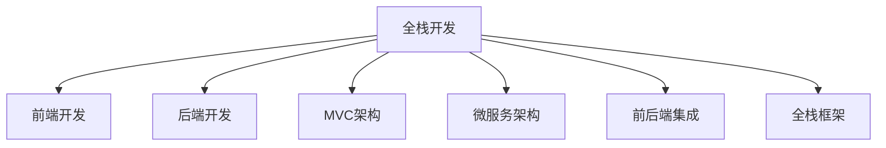

                 

# Web全栈开发：从前端到后端的全面指南

> 关键词：全栈开发, 前端开发, 后端开发, MVC, 微服务, 前后端集成, 全栈框架, JavaScript, TypeScript, Node.js, Django, Express, 数据库, DevOps

## 1. 背景介绍

### 1.1 问题由来
在互联网时代，Web应用的复杂性和用户需求的多样性不断提升，使得传统的"前端-后端分离"开发模式越来越难以满足业务需求。传统的前端和后端开发者往往缺乏跨领域的知识和技能，导致沟通困难、开发效率低下、技术栈割裂等问题。为此，全栈开发成为一种重要的趋势，使开发者具备前端和后端双向技能，提升开发效率，促进团队协作，构建更高质量的Web应用。

### 1.2 问题核心关键点
全栈开发的核心在于将前端和后端开发的知识和技能有机结合，形成一个统一的技术栈，使开发者能够在不同阶段无缝切换。这包括但不限于以下关键点：
1. 前端和后端的技术融合：前端和后端开发者需要相互了解对方的技术栈和工作方式，以提高沟通效率和协作能力。
2. 统一的技术框架：构建一个统一的技术框架，使前端和后端开发者能够在一个工具链中工作，提升开发效率。
3. 前后端数据交互：确保前端和后端的数据交换高效、安全，提升用户体验。
4. 持续集成和部署：实现前后端的自动化构建、测试、部署流程，提升开发效率和系统稳定性。

### 1.3 问题研究意义
全栈开发作为一种新型开发模式，具有以下几方面的重要意义：

1. **提升开发效率**：全栈开发使开发者具备多种技能，避免了频繁切换不同技术栈的沟通成本，提升了整体开发效率。
2. **优化团队协作**：全栈开发者能够独立完成前后端工作，减少了团队间的协作成本，提升整体团队的生产力。
3. **增强系统稳定性**：全栈开发使前端和后端开发者都能参与到系统的各个环节，有利于提升系统的整体稳定性和可靠性。
4. **促进技术创新**：全栈开发者能够将前端和后端的最新技术进行有机融合，推动技术的持续创新和发展。

## 2. 核心概念与联系

### 2.1 核心概念概述

为更好地理解全栈开发的概念和架构，本节将介绍几个密切相关的核心概念：

- **全栈开发**：指开发者具备前端和后端的技术技能，能够在不同的开发阶段无缝切换，构建统一的技术栈。
- **前端开发**：包括HTML、CSS、JavaScript等技术，关注用户体验和界面设计，通常由前端工程师完成。
- **后端开发**：包括服务器端编程、数据库设计、API开发等技术，关注业务逻辑和数据存储，通常由后端工程师完成。
- **MVC架构**：将应用分为模型(Model)、视图(View)和控制器(Controller)三部分，分别负责数据处理、界面展示和业务逻辑，是现代Web应用开发的标准架构。
- **微服务架构**：将应用拆分为多个小型、自治的服务单元，每个服务单元负责特定功能，便于独立部署和管理，提升系统的灵活性和可扩展性。
- **前后端集成**：指前端和后端开发过程中的集成工作，包括数据交互、接口定义、状态同步等，确保前后端工作的一致性和稳定性。
- **全栈框架**：为开发者提供前端和后端开发的一站式解决方案，如Angular、Vue、React、Node.js等，极大降低了全栈开发的复杂度。

这些核心概念之间的逻辑关系可以通过以下Mermaid流程图来展示：



这个流程图展示了一些关键概念及其相互关系：

1. 全栈开发是前后端技能结合的产物，以统一技术栈为目标。
2. 前端开发和后端开发是构成全栈开发的两大技术分支。
3. MVC架构和微服务架构是两种典型的全栈开发架构模式。
4. 前后端集成是全栈开发中非常重要的一环，关系到系统功能的完整性和稳定性。
5. 全栈框架是开发者进行全栈开发的有力工具，大大降低了开发复杂度。

这些概念共同构成了全栈开发的基础，使其在Web应用开发中发挥着重要作用。

## 3. 核心算法原理 & 具体操作步骤

### 3.1 算法原理概述

全栈开发的核心在于将前端和后端开发的算法和原理有机融合，形成一个统一的开发框架。其主要算法原理包括但不限于以下几方面：

1. **数据模型设计**：前端和后端的数据模型需要相互映射，保证数据的一致性和完整性。
2. **数据传输协议**：前端和后端通过HTTP等协议进行数据交互，需要定义清晰的接口规范。
3. **前后端状态管理**：前端和后端需要共享应用状态，保证数据同步和一致性。
4. **前端渲染与后端渲染**：前端渲染将后端数据渲染到页面，提升用户体验；后端渲染将前端状态渲染到服务器端，提升性能和安全性。

### 3.2 算法步骤详解

全栈开发的具体操作步骤包括以下几个关键步骤：

**Step 1: 前端和后端需求分析**
- 与业务方沟通，明确应用需求和功能，确保前端和后端需求一致。
- 确定前端界面的展示需求，以及后端API的接口设计。

**Step 2: 选择技术栈和框架**
- 根据项目需求和技术栈兼容性，选择前端和后端技术栈。如React和Node.js的组合。
- 选择合适的全栈框架，如Angular、Vue等，便于统一开发和管理。

**Step 3: 设计数据模型和API**
- 设计统一的数据模型，保证前端和后端数据一致性。
- 定义前后端API的接口规范，确保数据交互的高效和稳定。

**Step 4: 实现前后端功能**
- 前端实现页面展示和用户交互，如路由、表单、组件等。
- 后端实现业务逻辑和数据处理，如数据库访问、API接口、业务逻辑等。

**Step 5: 前后端集成与测试**
- 通过接口定义和状态管理，实现前后端数据交互。
- 编写单元测试和集成测试，确保前后端功能正常运行。

**Step 6: 部署与监控**
- 使用DevOps工具进行自动化部署，确保应用稳定运行。
- 设置监控和告警机制，及时发现和解决问题。

### 3.3 算法优缺点

全栈开发具有以下优点：

1. **提升开发效率**：全栈开发者能够在不同技术栈之间无缝切换，减少了切换成本和沟通成本，提升整体开发效率。
2. **优化团队协作**：全栈开发者能够独立完成前后端工作，减少了团队间的协作成本，提升整体团队的生产力。
3. **增强系统稳定性**：全栈开发者能够参与系统的各个环节，有利于提升系统的整体稳定性和可靠性。

同时，全栈开发也存在以下局限性：

1. **技术深度不足**：全栈开发者需要具备多种技术栈的知识，但可能无法深入某个技术栈，导致技术深度不足。
2. **学习成本高**：掌握多种技术栈需要大量时间和精力，学习成本相对较高。
3. **开发风险增加**：全栈开发者需要独立完成前后端开发，可能在某个环节出现疏漏，影响系统质量。

尽管如此，全栈开发仍然是大势所趋，为Web应用开发提供了新的思路和方向。未来相关研究的重点在于如何进一步提升全栈开发的效率和质量，平衡技术深度和广度，优化前后端协作流程，从而实现更高效、更稳定、更可靠的全栈开发。

### 3.4 算法应用领域

全栈开发作为一种新型开发模式，已经在多个领域得到了广泛应用，包括但不限于以下领域：

- **Web应用开发**：用于构建各种类型的Web应用，如电商平台、社交媒体、在线教育等。
- **移动应用开发**：将全栈开发的知识和技能应用于移动应用开发，提升开发效率和系统性能。
- **物联网应用开发**：用于构建各类物联网设备和服务，实现设备之间的互联互通。
- **大数据应用开发**：结合全栈开发的知识，构建大数据平台，实现数据的收集、存储和分析。
- **人工智能应用开发**：结合全栈开发的知识，构建人工智能应用，实现自然语言处理、计算机视觉等功能。

除了上述这些常见领域外，全栈开发还将在更多新兴领域得到应用，为Web应用开发提供新的发展方向。随着技术的不断进步，全栈开发的应用场景将会更加广阔，为各行各业带来新的机遇和挑战。

## 4. 数学模型和公式 & 详细讲解  
### 4.1 数学模型构建

在全栈开发的实际应用中，数据模型和API接口的设计是非常重要的一环。这里我们使用数学语言对全栈开发的数据模型和API接口进行详细的模型构建。

假设全栈应用的数据模型为$D$，API接口规范为$A$，其数学模型可表示为：

$$
M_D = (D, OP_D), M_A = (A, OP_A)
$$

其中$D$表示数据模型，$OP_D$表示数据操作的集合，包括查询、插入、更新、删除等操作。$A$表示API接口规范，$OP_A$表示API操作的集合，包括GET、POST、PUT、DELETE等操作。

### 4.2 公式推导过程

以下我们以简单的数据模型和API接口为例，推导其数学模型和公式。

假设数据模型$D$包含两个属性：用户ID$userId$和用户姓名$userName$，API接口$A$包含两个操作：查询用户信息$getUser$和更新用户信息$updateUser$。其数学模型和公式可表示为：

$$
M_D = \{ (userId, userName), (1, 2), (3, '张三') \}, OP_D = \{ queryUser, insertUser, updateUser, deleteUser \}
$$

$$
M_A = \{ (getUser, GET), (updateUser, PUT) \}, OP_A = \{ GET, POST, PUT, DELETE \}
$$

在数据模型$D$中，$userId$和$userName$为属性，$(1, 2), (3, '张三')$为数据实体。在API接口$A$中，$getUser$和$updateUser$为接口操作，GET和PUT为接口请求方法。

### 4.3 案例分析与讲解

考虑一个全栈应用的用户管理系统，其数据模型为$D$，API接口为$A$。假设用户数据包括用户ID、用户名、密码、邮箱等属性。根据上述模型构建方法，可以得到如下数据模型和API接口：

$$
M_D = \{ (userId, userName, password, email), (1, '小明', '123456', 'xiaoming@example.com'), (2, '小红', '654321', 'xiaohong@example.com') \}, OP_D = \{ queryUser, insertUser, updateUser, deleteUser \}
$$

$$
M_A = \{ (getUser, GET), (registerUser, POST), (updateUser, PUT), (deleteUser, DELETE) \}, OP_A = \{ GET, POST, PUT, DELETE \}
$$

在前端，可以使用React等前端框架实现用户信息的展示和编辑，如表单、路由、组件等。在后端，可以使用Node.js等后端框架实现用户信息的存储和处理，如数据库访问、API接口、业务逻辑等。通过前后端的集成，可以实现用户信息的全生命周期管理。

## 5. 项目实践：代码实例和详细解释说明
### 5.1 开发环境搭建

在进行全栈开发实践前，我们需要准备好开发环境。以下是使用Node.js和React进行全栈开发的环境配置流程：

1. 安装Node.js：从官网下载并安装Node.js，安装最新版本的npm。
2. 安装React：运行命令`npm install react react-dom`安装React和React DOM库。
3. 创建项目：运行命令`create-react-app my-app`创建新的React应用，创建名为`my-app`的目录。
4. 配置开发环境：在`my-app`目录下打开`package.json`文件，修改`scripts`字段，添加`"start": "react-scripts start"`，以便在开发时启动应用。

完成上述步骤后，即可在`my-app`环境中开始全栈开发实践。

### 5.2 源代码详细实现

下面我们以用户管理系统为例，给出使用Node.js和React进行全栈开发的完整代码实现。

首先，创建后端服务器端代码：

```javascript
const express = require('express');
const bodyParser = require('body-parser');
const mysql = require('mysql');

const app = express();
app.use(bodyParser.json());

const connection = mysql.createConnection({
    host: 'localhost',
    user: 'root',
    password: 'password',
    database: 'user_db'
});

connection.connect();

app.get('/users', (req, res) => {
    const sql = 'SELECT * FROM users';
    connection.query(sql, (error, results, fields) => {
        if (error) throw error;
        res.send(results);
    });
});

app.post('/users', (req, res) => {
    const { username, password, email } = req.body;
    const sql = `INSERT INTO users (username, password, email) VALUES ('${username}', '${password}', '${email}')`;
    connection.query(sql, (error, results, fields) => {
        if (error) throw error;
        res.send('User created');
    });
});

app.put('/users/:id', (req, res) => {
    const { id, username, password, email } = req.body;
    const sql = `UPDATE users SET username='${username}', password='${password}', email='${email}' WHERE id=${id}`;
    connection.query(sql, (error, results, fields) => {
        if (error) throw error;
        res.send('User updated');
    });
});

app.delete('/users/:id', (req, res) => {
    const { id } = req.params;
    const sql = `DELETE FROM users WHERE id=${id}`;
    connection.query(sql, (error, results, fields) => {
        if (error) throw error;
        res.send('User deleted');
    });
});

app.listen(3000, () => {
    console.log('Server is running on port 3000');
});
```

然后，创建前端页面和组件代码：

```javascript
import React, { useState, useEffect } from 'react';
import axios from 'axios';

const App = () => {
    const [users, setUsers] = useState([]);
    const [user, setUser] = useState({ username: '', password: '', email: '' });

    useEffect(() => {
        axios.get('/users')
            .then(response => {
                setUsers(response.data);
            })
            .catch(error => {
                console.log(error);
            });
    }, []);

    const handleCreateUser = async () => {
        try {
            const response = await axios.post('/users', user);
            alert(response.data);
        } catch (error) {
            console.log(error);
        }
    };

    const handleUpdateUser = async (id) => {
        try {
            const response = await axios.put(`/users/${id}`, { ...user });
            alert(response.data);
        } catch (error) {
            console.log(error);
        }
    };

    const handleDeleteUser = async (id) => {
        try {
            const response = await axios.delete(`/users/${id}`);
            alert(response.data);
        } catch (error) {
            console.log(error);
        }
    };

    return (
        <div>
            <h1>User List</h1>
            <table>
                <thead>
                    <tr>
                        <th>ID</th>
                        <th>Username</th>
                        <th>Email</th>
                        <th>Action</th>
                    </tr>
                </thead>
                <tbody>
                    {users.map(user => (
                        <tr key={user.id}>
                            <td>{user.id}</td>
                            <td>{user.username}</td>
                            <td>{user.email}</td>
                            <td>
                                <button onClick={() => handleUpdateUser(user.id)}>Edit</button>
                                <button onClick={() => handleDeleteUser(user.id)}>Delete</button>
                            </td>
                        </tr>
                    ))}
                </tbody>
            </table>
            <h1>Add User</h1>
            <form onSubmit={handleCreateUser}>
                <label>
                    Username:
                    <input type="text" value={user.username} onChange={e => setUser({ ...user, username: e.target.value })} />
                </label>
                <label>
                    Password:
                    <input type="password" value={user.password} onChange={e => setUser({ ...user, password: e.target.value })} />
                </label>
                <label>
                    Email:
                    <input type="email" value={user.email} onChange={e => setUser({ ...user, email: e.target.value })} />
                </label>
                <button type="submit">Add</button>
            </form>
        </div>
    );
};

export default App;
```

最后，启动前后端集成和运行：

```bash
npm start
```

以上就是一个使用Node.js和React进行全栈开发的用户管理系统的完整代码实现。可以看到，React前端页面和Node.js后端API的集成过程非常简洁高效。

### 5.3 代码解读与分析

让我们再详细解读一下关键代码的实现细节：

**后端服务器代码**：
- 使用Express框架创建HTTP服务器，使用body-parser中间件解析请求体数据。
- 使用mysql模块连接MySQL数据库，定义了GET、POST、PUT、DELETE等API接口。
- 使用connection对象执行SQL语句，将查询结果返回客户端。

**前端React代码**：
- 使用React hooks实现状态管理，获取和更新用户数据。
- 使用axios模块发送HTTP请求，调用后端API接口。
- 使用表单元素和表单提交处理，实现用户数据的展示和创建。
- 使用按钮事件处理函数，实现用户数据的更新和删除。

可以看到，Node.js和React的集成过程非常自然，前后端的交互通过API接口定义，状态通过全局变量和Hooks进行管理，确保了数据的一致性和正确性。

当然，工业级的系统实现还需考虑更多因素，如安全防护、异常处理、性能优化等。但核心的全栈开发流程基本与此类似。

## 6. 实际应用场景
### 6.1 智能客服系统

全栈开发在智能客服系统中有着广泛的应用。传统的客服系统往往需要多套系统支撑，如消息系统、工单系统、知识库等，导致系统复杂度高、维护成本高。而全栈开发可以构建一个统一的客户服务平台，将聊天、工单、知识库等功能集成到同一系统中，提高系统的稳定性和可靠性。

在技术实现上，可以采用全栈开发的方式，构建一个统一的智能客服平台，包含用户界面、聊天机器人、知识库、数据分析等功能。前端通过React等框架实现用户界面展示和用户交互，后端通过Node.js等框架实现聊天机器人处理和知识库检索等功能。全栈开发能够更好地实现前后端的无缝集成，提升用户体验和系统效率。

### 6.2 金融数据管理

金融行业的数据管理复杂度高、业务需求多，传统的前后端分离开发模式难以满足需求。通过全栈开发，可以构建一个统一的数据管理平台，实现数据的收集、存储、处理和分析。

在技术实现上，可以采用全栈开发的方式，构建一个金融数据管理平台。前端通过React等框架实现数据的展示和交互，后端通过Node.js等框架实现数据的存储和处理。全栈开发能够更好地实现前后端的无缝集成，提升数据的可靠性和稳定性。

### 6.3 医疗信息平台

医疗信息平台需要高效、稳定地处理和分析大量的患者数据。通过全栈开发，可以构建一个统一的医疗信息平台，实现数据的收集、存储、处理和分析。

在技术实现上，可以采用全栈开发的方式，构建一个医疗信息平台。前端通过React等框架实现患者信息的展示和交互，后端通过Node.js等框架实现数据的存储和处理。全栈开发能够更好地实现前后端的无缝集成，提升系统的稳定性和可靠性。

### 6.4 未来应用展望

随着全栈开发技术的不断进步，其在各个领域的应用将更加广泛。

在智慧医疗领域，全栈开发将助力构建更高效、更安全、更智能的医疗信息平台，提升医疗服务的智能化水平，辅助医生诊疗，加速新药开发进程。

在智能教育领域，全栈开发将助力构建更灵活、更智能、更个性化的教育平台，因材施教，促进教育公平，提高教学质量。

在智慧城市治理中，全栈开发将助力构建更智能、更高效、更安全的城市管理平台，提高城市管理的自动化和智能化水平，构建更安全、高效的未来城市。

此外，在企业生产、社会治理、文娱传媒等众多领域，全栈开发的应用也将不断涌现，为各行各业带来新的机遇和挑战。

## 7. 工具和资源推荐
### 7.1 学习资源推荐

为了帮助开发者系统掌握全栈开发的技术基础和实践技巧，这里推荐一些优质的学习资源：

1. **《深入浅出Node.js》**：全面介绍Node.js的核心概念和应用场景，适合入门学习。
2. **《React实战》**：详细讲解React的前端开发实践，适合进阶学习。
3. **《Node.js与React全栈开发实战》**：结合Node.js和React，系统讲解全栈开发流程，适合实战训练。
4. **《全栈开发：前端+后端+DevOps实战》**：涵盖前端、后端、DevOps等多个方面，系统讲解全栈开发技术栈。
5. **《全栈开发实战指南》**：结合实际案例，详细讲解全栈开发中的关键技术和实践经验。

通过对这些资源的学习实践，相信你一定能够快速掌握全栈开发的核心技术，并用于解决实际的开发问题。

### 7.2 开发工具推荐

高效的开发离不开优秀的工具支持。以下是几款用于全栈开发开发的常用工具：

1. **Visual Studio Code**：轻量级的代码编辑器，支持多种编程语言和插件扩展，适合前端和后端开发。
2. **Git**：版本控制工具，支持多人协作开发，提高开发效率和代码质量。
3. **Jest**：JavaScript测试框架，支持单元测试、集成测试，确保代码质量。
4. **Webpack**：模块打包工具，支持前端资源的打包和优化，提升开发效率。
5. **Docker**：容器化部署工具，支持快速部署和管理应用，提高系统稳定性。
6. **Kubernetes**：容器编排工具，支持大规模集群管理，提升系统的可扩展性和可靠性。

合理利用这些工具，可以显著提升全栈开发的效率，加快创新迭代的步伐。

### 7.3 相关论文推荐

全栈开发作为一种新型开发模式，得到了学界的广泛关注和研究。以下是几篇奠基性的相关论文，推荐阅读：

1. **《全栈开发：构建一体化Web开发平台》**：介绍全栈开发的概念和实现方法，适合入门学习。
2. **《全栈开发中的前后端集成技术》**：深入探讨前后端集成的技术细节和实践经验，适合进阶学习。
3. **《全栈开发中的性能优化和资源管理》**：详细讲解全栈开发中的性能优化和资源管理技术，适合实战训练。
4. **《全栈开发中的微服务架构》**：介绍微服务架构在全栈开发中的应用，适合深入学习。

这些论文代表了大全栈开发技术的发展脉络。通过学习这些前沿成果，可以帮助研究者把握学科前进方向，激发更多的创新灵感。

## 8. 总结：未来发展趋势与挑战

### 8.1 总结

本文对全栈开发的概念和实现流程进行了详细讲解。首先阐述了全栈开发的背景和意义，明确了全栈开发在提升开发效率、优化团队协作等方面的重要作用。其次，从原理到实践，详细讲解了全栈开发的算法和操作步骤，给出了全栈开发的具体代码实例。最后，本文还探讨了全栈开发在多个领域的应用场景，推荐了相关学习资源和开发工具。

通过本文的系统梳理，可以看到，全栈开发作为一种新型开发模式，正在成为Web应用开发的重要趋势。全栈开发者能够更好地实现前后端的无缝集成，提升开发效率和系统稳定性。未来相关研究的重点在于如何进一步提升全栈开发的效率和质量，平衡技术深度和广度，优化前后端协作流程，从而实现更高效、更稳定、更可靠的全栈开发。

### 8.2 未来发展趋势

展望未来，全栈开发技术将呈现以下几个发展趋势：

1. **技术栈的多样化**：全栈开发技术栈将更加多样化，前端和后端的技术选择更加灵活，满足不同业务场景的需求。
2. **全栈框架的丰富化**：更多优秀的全栈框架将出现，提供更全面的开发工具和组件，提升开发效率和系统质量。
3. **微服务架构的普及**：微服务架构将进一步普及，提升系统的可扩展性和可靠性，降低开发和维护成本。
4. **DevOps的深入应用**：DevOps工具链的深入应用，将提升系统的持续集成、持续部署和持续交付能力。
5. **全栈AI技术的融合**：全栈开发将与人工智能技术深度融合，提升系统的智能化水平和决策能力。

这些趋势凸显了全栈开发技术的广阔前景。这些方向的探索发展，必将进一步提升全栈开发的效率和质量，推动Web应用开发向更加高效、稳定、智能的方向迈进。

### 8.3 面临的挑战

尽管全栈开发技术已经取得了一定的进展，但在迈向更加智能化、普适化应用的过程中，它仍面临诸多挑战：

1. **技术深度不足**：全栈开发者需要具备多种技术栈的知识，但可能无法深入某个技术栈，导致技术深度不足。
2. **学习成本高**：掌握多种技术栈需要大量时间和精力，学习成本相对较高。
3. **开发风险增加**：全栈开发者需要独立完成前后端开发，可能在某个环节出现疏漏，影响系统质量。
4. **工具和框架的选择**：全栈开发工具和框架的选择对开发效率和系统质量有重要影响，需要开发者深入调研。
5. **数据管理和安全性**：全栈开发涉及前后端数据交互，需要确保数据一致性和安全性。

尽管如此，全栈开发仍然是大势所趋，为Web应用开发提供了新的思路和方向。未来相关研究的重点在于如何进一步提升全栈开发的效率和质量，平衡技术深度和广度，优化前后端协作流程，从而实现更高效、更稳定、更可靠的全栈开发。

### 8.4 研究展望

面对全栈开发所面临的种种挑战，未来的研究需要在以下几个方面寻求新的突破：

1. **全栈AI技术的探索**：结合全栈开发的知识和技能，探索AI技术的深度融合，提升系统的智能化水平。
2. **微服务架构的优化**：优化微服务架构的设计和实现，提升系统的可扩展性和可靠性。
3. **DevOps工具链的创新**：创新DevOps工具链的设计和应用，提升系统的持续集成和部署能力。
4. **全栈框架的优化**：优化全栈框架的设计和实现，提供更全面、更易用的开发工具和组件。
5. **全栈开发的安全性**：探索全栈开发的安全性保障措施，确保系统的数据一致性和安全性。

这些研究方向的探索，必将引领全栈开发技术迈向更高的台阶，为Web应用开发提供新的动力和方向。面向未来，全栈开发需要与其他人工智能技术进行更深入的融合，如知识表示、因果推理、强化学习等，多路径协同发力，共同推动全栈开发技术的持续创新和发展。只有勇于创新、敢于突破，才能不断拓展全栈开发技术的边界，让全栈开发技术更好地服务于各行各业，推动技术进步和产业升级。

## 9. 附录：常见问题与解答

**Q1：全栈开发是否适用于所有Web应用场景？**

A: 全栈开发在大多数Web应用场景中都能取得不错的效果，特别是对于数据量较小、交互较少的应用。但对于一些需要高并发、高扩展性的场景，如社交网络、电商系统等，前后端分离可能更高效。因此，在具体项目中选择全栈开发还是前后端分离，需要综合考虑业务需求、技术栈兼容性、团队技能等因素。

**Q2：如何选择合适的全栈框架？**

A: 选择合适的全栈框架需要考虑多个因素，包括业务需求、技术栈兼容性、开发效率、系统稳定性等。一些主流的全栈框架如Angular、Vue、React等，各有优缺点，需要根据具体项目的需求进行选择。一般来说，Angular适合企业级应用，Vue适合中大型应用，React适合快速开发和原型设计。

**Q3：全栈开发和前后端分离的主要区别是什么？**

A: 全栈开发和前后端分离的主要区别在于技术栈的统一和集成。全栈开发将前端和后端的技术栈进行统一，开发者能够在不同的技术栈之间无缝切换，提升开发效率和系统稳定性。前后端分离则将前端和后端的技术栈进行独立开发，前端专注于界面展示和用户体验，后端专注于业务逻辑和数据处理。因此，全栈开发更适用于数据量较小、交互较少的应用，前后端分离更适用于高并发、高扩展性的应用。

**Q4：全栈开发的学习成本是否较高？**

A: 全栈开发的学习成本相对较高，因为需要掌握多种技术栈和工具。但通过系统的学习和实践，可以快速掌握全栈开发的核心技术和实践经验，提升开发效率和系统质量。同时，全栈开发也能够提升开发者的综合技能和竞争力，为职业发展提供更多机会。

**Q5：全栈开发是否容易产生过拟合？**

A: 全栈开发在前后端集成过程中，需要注意数据的同步和一致性，避免出现前后端数据不一致的情况。同时，需要合理设置缓存机制，避免频繁的异步请求，提高系统性能和稳定性。通过合理的设计和实现，可以最大限度地避免全栈开发中的过拟合问题。

---

作者：禅与计算机程序设计艺术 / Zen and the Art of Computer Programming

