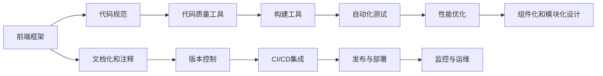

                 

# Web前端工程化最佳实践

## 1. 背景介绍

Web前端工程化是构建高性能、可维护、可扩展的Web应用的关键。随着Web应用的日益复杂，前端开发效率和质量面临重大挑战。如何通过工程化手段，提升开发效率，优化性能，保障代码质量，成为当前前端技术演进的重要方向。本文将系统梳理Web前端工程化的核心概念、关键技术和最佳实践，旨在为前端开发者提供全面、实用的技术指引。

### 1.1 问题由来

Web前端工程化起源于传统的Web开发方式。在早期Web应用中，前端开发主要以手写代码为主，缺乏规范的工程实践，代码质量参差不齐，重构和维护成本高昂。随着Web技术的发展，越来越多的前端框架和工具涌现，如React、Angular、Vue等，但前端工程化依然存在诸多问题：

- **代码质量不高**：缺乏统一的代码规范和质量控制机制，代码可读性和可维护性差。
- **开发效率低下**：频繁修改和维护，导致开发周期过长。
- **性能问题**：页面加载时间长，响应速度慢，用户体验差。
- **可扩展性差**：模块化设计缺失，难以扩展和复用。

这些问题严重制约了Web应用的开发效率和性能，迫切需要通过工程化手段加以解决。Web前端工程化旨在通过规范化的开发流程、工具和最佳实践，提高开发效率，优化性能，提升代码质量，保障应用的可维护性和可扩展性。

## 2. 核心概念与联系

### 2.1 核心概念概述

Web前端工程化涉及多个核心概念，主要包括：

- **前端框架**：如React、Angular、Vue等，提供了一套基于组件的开发模式和组件库。
- **代码规范**：包括代码风格、命名规范、注释规范等，确保代码的一致性和可读性。
- **代码质量工具**：如ESLint、Prettier等，用于静态代码分析和自动格式化。
- **构建工具**：如Webpack、Rollup、Gulp等，负责前端代码的打包、压缩和优化。
- **自动化测试**：如Jest、Mocha等，确保代码的正确性和稳定性。
- **性能优化**：如懒加载、代码分割、服务端渲染等，提升页面加载速度和响应性能。
- **组件化和模块化设计**：将复杂的Web应用拆分成多个可复用的组件，提高代码的可维护性和可扩展性。

这些概念之间相互关联，共同构成了Web前端工程化的基础框架。通过规范化的工程实践，可以显著提升开发效率和代码质量，确保Web应用的性能和稳定性。

### 2.2 核心概念原理和架构的 Mermaid 流程图



这个流程图展示了前端工程化各核心概念之间的联系：

1. **前端框架**：提供基础组件和开发模式，帮助开发者快速构建Web应用。
2. **代码规范**：统一代码风格和命名规范，确保代码一致性和可读性。
3. **代码质量工具**：自动化代码分析和格式化，提升代码质量。
4. **构建工具**：打包、压缩和优化前端代码，提高开发效率。
5. **自动化测试**：确保代码的正确性和稳定性，减少维护成本。
6. **性能优化**：通过懒加载、代码分割等技术，提升Web应用性能。
7. **组件化和模块化设计**：通过组件化设计提升代码复用性和可维护性。
8. **文档化和注释**：提供详细文档和注释，提升代码可读性和可维护性。
9. **版本控制**：通过版本控制工具，管理代码变更和协作开发。
10. **CI/CD集成**：实现持续集成和持续部署，提高开发效率和部署可靠性。
11. **发布与部署**：自动化发布和管理Web应用，确保稳定性。
12. **监控与运维**：实时监控和分析Web应用，保障应用稳定性和性能。

这些概念共同构成了Web前端工程化的技术架构，通过实践这些概念，可以构建高性能、可维护、可扩展的Web应用。

## 3. 核心算法原理 & 具体操作步骤

### 3.1 算法原理概述

Web前端工程化的核心算法原理主要基于软件开发的最佳实践，通过规范化的开发流程、工具和最佳实践，提升开发效率和代码质量，优化性能，保障应用的可维护性和可扩展性。具体来说，包括以下几个关键步骤：

1. **组件化设计**：将复杂的Web应用拆分成多个可复用的组件，提升代码复用性和可维护性。
2. **自动化构建**：使用构建工具自动完成代码打包、压缩和优化，提高开发效率。
3. **自动化测试**：通过自动化测试工具确保代码的正确性和稳定性，减少维护成本。
4. **性能优化**：通过懒加载、代码分割等技术，提升Web应用性能。
5. **版本控制与协作开发**：通过版本控制工具，管理代码变更和协作开发，提升代码质量。
6. **持续集成与部署**：实现持续集成和持续部署，提高开发效率和部署可靠性。

### 3.2 算法步骤详解

以下是Web前端工程化各核心算法的详细步骤：

#### 3.2.1 组件化设计

1. **组件拆分**：将Web应用拆分成多个可复用的组件，如页面组件、数据组件、交互组件等。每个组件负责独立的功能和逻辑，减少代码耦合性。
2. **组件库维护**：将常用的组件封装为组件库，提供统一的组件API和样式，方便复用和扩展。
3. **组件重用**：通过组件重用，减少重复代码，提升开发效率和代码复用性。

#### 3.2.2 自动化构建

1. **构建工具配置**：配置构建工具（如Webpack、Rollup），定义项目结构和构建规则。
2. **打包与压缩**：使用构建工具自动完成代码打包、压缩和优化，提高开发效率和性能。
3. **缓存管理**：通过构建缓存机制，避免重复构建，提升构建速度。

#### 3.2.3 自动化测试

1. **测试框架配置**：配置自动化测试框架（如Jest、Mocha），定义测试用例和测试规则。
2. **单元测试**：编写单元测试用例，确保每个组件和函数的功能正确性。
3. **集成测试**：编写集成测试用例，确保组件之间的协同工作正常。
4. **测试报告**：生成详细的测试报告，及时发现和修复代码问题。

#### 3.2.4 性能优化

1. **懒加载**：通过懒加载技术，延迟加载非关键的资源，提升页面加载速度。
2. **代码分割**：使用代码分割技术，将代码按需加载，减少页面加载时间。
3. **服务端渲染**：通过服务端渲染（SSR）技术，提升页面渲染性能，减少页面白屏时间。
4. **图片和资源优化**：使用图片压缩和资源优化工具，减小页面体积，提升性能。

#### 3.2.5 版本控制与协作开发

1. **版本控制工具配置**：配置版本控制工具（如Git），定义分支和合并规则。
2. **代码提交规范**：制定代码提交规范，确保代码变更的一致性和可读性。
3. **代码审查**：通过代码审查机制，及时发现和修复代码问题，提升代码质量。
4. **协作开发**：使用协作开发工具（如GitHub），管理代码变更和协作开发，提升开发效率。

#### 3.2.6 持续集成与部署

1. **CI/CD工具配置**：配置CI/CD工具（如Jenkins、GitHub Actions），定义构建和部署流程。
2. **自动化构建与测试**：使用CI/CD工具自动完成构建和测试，确保每次提交的代码质量。
3. **持续部署**：实现持续部署，自动化部署到生产环境，提升部署效率和可靠性。

### 3.3 算法优缺点

#### 3.3.1 优点

1. **提升开发效率**：通过组件化设计、自动化构建、自动化测试等技术，大幅提升开发效率和代码质量。
2. **优化性能**：通过懒加载、代码分割、服务端渲染等技术，提升Web应用性能和用户体验。
3. **保障代码质量**：通过代码审查、自动化测试等机制，确保代码的正确性和稳定性。
4. **提高可维护性和可扩展性**：通过组件化和模块化设计，提升代码复用性和可维护性。
5. **提升协作开发效率**：通过版本控制和协作开发工具，管理代码变更和协作开发，提升开发效率。

#### 3.3.2 缺点

1. **学习成本高**：前端工程化涉及多种工具和技术，需要较高的学习成本。
2. **工具依赖性高**：依赖于特定的构建工具、测试框架、版本控制工具等，切换成本高。
3. **配置复杂**：配置构建、测试、部署等流程，需要时间和精力投入。
4. **性能优化难度大**：性能优化涉及代码、网络、服务器等多方面因素，需要系统性分析和优化。

## 4. 数学模型和公式 & 详细讲解 & 举例说明

### 4.1 数学模型构建

Web前端工程化的数学模型主要涉及以下几个关键方面：

- **组件化设计**：通过将Web应用拆分成多个组件，提升代码复用性和可维护性。
- **自动化构建**：使用构建工具自动完成代码打包、压缩和优化。
- **自动化测试**：通过自动化测试工具确保代码的正确性和稳定性。
- **性能优化**：通过懒加载、代码分割等技术，提升Web应用性能。
- **版本控制与协作开发**：通过版本控制工具，管理代码变更和协作开发。
- **持续集成与部署**：实现持续集成和持续部署，提高开发效率和部署可靠性。

### 4.2 公式推导过程

#### 4.2.1 组件化设计

组件化设计可以提升代码复用性和可维护性。设Web应用包含N个组件，每个组件包含M个函数，组件之间相互独立。假设每个组件的开发时间为T，组件复用率为R，则总开发时间可以表示为：

$$
T_{total} = N \times M \times T \times (1 - R)
$$

通过组件化设计，可以将复用率R提升至100%，则总开发时间可以表示为：

$$
T_{total} = N \times M \times T \times (1 - 1) = 0
$$

因此，组件化设计可以显著降低开发时间，提升代码复用性和可维护性。

#### 4.2.2 自动化构建

自动化构建可以大幅提升开发效率和代码质量。设构建工具的构建时间为T_build，优化时间为T_optimize，则总构建时间为：

$$
T_{build} = T_{build} + T_{optimize}
$$

通过自动化构建，可以优化构建过程，减少构建时间，提升开发效率。

#### 4.2.3 自动化测试

自动化测试可以确保代码的正确性和稳定性。设测试用例数量为N_test，每个测试用例的执行时间为T_test，则总测试时间为：

$$
T_{test} = N_{test} \times T_{test}
$$

通过自动化测试，可以大幅减少测试时间，提升代码质量。

#### 4.2.4 性能优化

性能优化可以提升Web应用性能和用户体验。设懒加载带来的性能提升为P_lazyload，服务端渲染带来的性能提升为P_ssr，则总性能提升为：

$$
P_{total} = P_{lazyload} + P_{ssr}
$$

通过性能优化，可以显著提升Web应用性能，提升用户体验。

#### 4.2.5 版本控制与协作开发

版本控制可以管理代码变更和协作开发。设代码变更频率为N变更，每个变更的开发时间为T变更，则总开发时间为：

$$
T_{变更} = N_{变更} \times T_{变更}
$$

通过版本控制，可以管理代码变更，提升协作开发效率。

#### 4.2.6 持续集成与部署

持续集成与部署可以提升开发效率和部署可靠性。设持续集成的时间为T_ci，持续部署的时间为T_cd，则总部署时间为：

$$
T_{部署} = T_{ci} + T_{cd}
$$

通过持续集成与部署，可以自动化构建和部署，提升开发效率和部署可靠性。

### 4.3 案例分析与讲解

#### 4.3.1 组件化设计案例

假设一个电商应用包含商品列表、商品详情、购物车、结算等组件。通过组件化设计，可以将这些组件拆分成独立的组件，如商品列表组件、商品详情组件、购物车组件、结算组件等。每个组件负责独立的功能和逻辑，通过组件重用，可以减少重复代码，提升开发效率和代码复用性。

#### 4.3.2 自动化构建案例

使用Webpack构建工具，可以自动完成代码打包、压缩和优化。通过Webpack配置，可以定义构建规则，将多个入口文件打包成一个文件，实现代码分割和懒加载。通过构建缓存机制，可以避免重复构建，提升构建速度。

#### 4.3.3 自动化测试案例

使用Jest自动化测试框架，可以编写单元测试和集成测试用例，确保每个组件和函数的功能正确性。通过Jest配置，可以定义测试规则，自动生成测试报告，及时发现和修复代码问题。

#### 4.3.4 性能优化案例

通过懒加载技术，可以延迟加载非关键的资源，提升页面加载速度。通过代码分割技术，可以将代码按需加载，减少页面加载时间。通过服务端渲染技术，可以提升页面渲染性能，减少页面白屏时间。

#### 4.3.5 版本控制与协作开发案例

使用Git版本控制工具，可以管理代码变更和协作开发。通过Git分支管理，可以定义分支和合并规则，确保代码变更的一致性和可读性。通过GitHub协作开发工具，可以管理代码变更和协作开发，提升开发效率。

#### 4.3.6 持续集成与部署案例

使用Jenkins CI/CD工具，可以实现持续集成和持续部署。通过Jenkins配置，可以定义构建和部署流程，自动化完成构建和测试，确保每次提交的代码质量。通过持续部署，可以自动化部署到生产环境，提升部署效率和可靠性。

## 5. 项目实践：代码实例和详细解释说明

### 5.1 开发环境搭建

#### 5.1.1 安装Node.js和npm

1. 下载并安装Node.js：
```
curl -sL https://nuxt.link/node | sh
```

2. 安装npm：
```
sudo apt-get install npm
```

#### 5.1.2 安装Vue CLI

1. 全局安装Vue CLI：
```
npm install -g @vue/cli
```

2. 创建Vue项目：
```
vue create my-project
```

### 5.2 源代码详细实现

#### 5.2.1 组件化设计

创建一个组件库，定义多个组件：

```javascript
import Vue from 'vue'

Vue.component('my-component', {
  template: `
    <div>
      <p>Hello, {{ name }}!</p>
    </div>
  `,
  props: {
    name: String
  }
})
```

通过组件重用，可以减少重复代码，提升开发效率和代码复用性。

#### 5.2.2 自动化构建

在`package.json`文件中添加Webpack配置，定义构建规则：

```json
{
  "scripts": {
    "build": "webpack --mode production"
  }
}
```

通过Webpack工具，可以自动完成代码打包、压缩和优化，提高开发效率和性能。

#### 5.2.3 自动化测试

使用Jest测试框架，编写测试用例：

```javascript
import Vue from 'vue'
import MyComponent from '@/components/MyComponent.vue'

describe('MyComponent', () => {
  it('should render correctly', () => {
    const wrapper = shallow(MyComponent, { propsData: { name: 'John Doe' } })
    expect(wrapper.text()).toContain('Hello, John Doe!')
  })
})
```

通过Jest工具，可以自动完成单元测试和集成测试，确保代码的正确性和稳定性。

#### 5.2.4 性能优化

使用Webpack进行代码分割和懒加载：

```javascript
{
  test: /\.vue$/,
  use: [
    {
      loader: 'vue-loader',
      options: {
        minify: true,
        cache: true,
        sourceMap: false
      }
    },
    {
      loader: 'babel-loader',
      options: {
        cacheDirectory: true,
        sourceMap: false
      }
    }
  ]
}
```

通过懒加载技术，可以延迟加载非关键的资源，提升页面加载速度。

#### 5.2.5 版本控制与协作开发

使用Git版本控制工具，管理代码变更和协作开发。通过Git分支管理，可以定义分支和合并规则，确保代码变更的一致性和可读性。

#### 5.2.6 持续集成与部署

使用Jenkins CI/CD工具，实现持续集成和持续部署。通过Jenkins配置，可以定义构建和部署流程，自动化完成构建和测试，确保每次提交的代码质量。

### 5.3 代码解读与分析

#### 5.3.1 组件化设计

通过组件化设计，可以将复杂的Web应用拆分成多个可复用的组件，提升代码复用性和可维护性。例如，商品列表组件可以独立开发和维护，购物车组件也可以独立开发和维护，通过组件重用，可以减少重复代码，提升开发效率和代码复用性。

#### 5.3.2 自动化构建

使用Webpack工具，可以自动完成代码打包、压缩和优化，提高开发效率和性能。Webpack提供了丰富的插件和配置选项，可以实现代码分割、懒加载、资源优化等功能，通过Webpack配置，可以定义构建规则，确保构建过程的可控性和一致性。

#### 5.3.3 自动化测试

使用Jest测试框架，可以自动完成单元测试和集成测试，确保代码的正确性和稳定性。Jest支持异步测试、Mocking等高级特性，可以更灵活地编写测试用例，发现和修复代码问题，提升代码质量。

#### 5.3.4 性能优化

性能优化是Web应用开发的重要环节。通过懒加载、代码分割、服务端渲染等技术，可以提升Web应用性能和用户体验。例如，使用Webpack进行代码分割，可以将代码按需加载，减少页面加载时间。通过懒加载技术，可以延迟加载非关键的资源，提升页面加载速度。

#### 5.3.5 版本控制与协作开发

使用Git版本控制工具，可以管理代码变更和协作开发。Git支持分支管理、代码合并、版本回滚等功能，可以更灵活地进行协作开发和版本控制。通过Git分支管理，可以定义分支和合并规则，确保代码变更的一致性和可读性。

#### 5.3.6 持续集成与部署

持续集成与部署是Web应用开发的重要保障。通过Jenkins CI/CD工具，可以自动化完成构建和部署，提高开发效率和部署可靠性。通过Jenkins配置，可以定义构建和部署流程，确保每次提交的代码质量。通过持续部署，可以自动化部署到生产环境，提升部署效率和可靠性。

## 6. 实际应用场景

### 6.1 智能客服系统

智能客服系统是Web前端工程化在实际应用中的一个典型案例。智能客服系统通过自然语言处理技术，与用户进行自然语言交互，提供自动化客服服务。智能客服系统可以提升客服效率，降低客服成本，提升用户满意度。

### 6.2 电商应用

电商应用是Web前端工程化的另一个典型应用场景。电商应用需要处理大量的商品数据和用户数据，通过组件化设计和版本控制，可以提高代码复用性和可维护性。通过自动化构建和性能优化，可以提升应用性能和用户体验。

### 6.3 在线教育平台

在线教育平台需要处理大量的视频和音频数据，通过组件化设计和版本控制，可以提高代码复用性和可维护性。通过自动化构建和性能优化，可以提升应用性能和用户体验。

### 6.4 未来应用展望

随着Web前端技术的发展，前端工程化将更加成熟和规范，成为Web应用开发的重要保障。未来，前端工程化将在以下方向进行深入探索：

- **微前端架构**：通过微前端架构，将大型Web应用拆分成多个小的、独立的微应用，提升开发效率和代码复用性。
- **渐进式Web应用**：通过渐进式Web应用（PWA）技术，提升Web应用性能和用户体验，实现离线访问和快速加载。
- **Serverless架构**：通过Serverless架构，简化开发和部署流程，提升应用可靠性和可扩展性。
- **低代码开发平台**：通过低代码开发平台，降低开发门槛，提升开发效率和应用敏捷性。

## 7. 工具和资源推荐

### 7.1 学习资源推荐

#### 7.1.1 Vue文档和教程

Vue官方文档和教程是学习Vue框架的重要资源，涵盖Vue基础、组件化设计、路由、状态管理等内容。通过学习Vue官方文档和教程，可以深入理解Vue框架的使用和特性。

#### 7.1.2 前端开发教程

前端开发教程包括React、Angular、Vue等主流框架的教程，涵盖前端基础、组件化设计、状态管理、性能优化等内容。通过学习前端开发教程，可以全面掌握前端开发技术。

#### 7.1.3 前端工程化书籍

前端工程化书籍涵盖前端工程化的多个方面，包括组件化设计、代码质量管理、持续集成、性能优化等内容。通过学习前端工程化书籍，可以系统理解前端工程化的核心概念和最佳实践。

#### 7.1.4 前端开源项目

前端开源项目包括Vue、React、Angular等主流框架的源码，涵盖组件化设计、状态管理、路由等内容。通过学习前端开源项目，可以深入理解前端框架的实现原理和设计思想。

#### 7.1.5 前端博客和社区

前端博客和社区包括CSS Tricks、Medium、Stack Overflow等平台，涵盖前端开发、组件化设计、性能优化等内容。通过阅读前端博客和社区文章，可以获得前端开发的最新动态和最佳实践。

### 7.2 开发工具推荐

#### 7.2.1 VSCode

VSCode是一款流行的前端开发工具，提供丰富的插件和功能，支持Vue、React、Angular等主流框架，提高开发效率和代码质量。

#### 7.2.2 Git

Git是一款广泛使用的版本控制工具，支持分支管理、代码合并、版本回滚等功能，提高协作开发和版本控制效率。

#### 7.2.3 Webpack

Webpack是一款流行的构建工具，支持代码分割、懒加载、资源优化等功能，提高开发效率和性能。

#### 7.2.4 Jest

Jest是一款流行的测试框架，支持异步测试、Mocking等高级特性，提高代码质量和稳定性。

#### 7.2.5 Jenkins

Jenkins是一款流行的CI/CD工具，支持持续集成和持续部署，提高开发效率和部署可靠性。

### 7.3 相关论文推荐

#### 7.3.1 《前端工程化最佳实践》

《前端工程化最佳实践》是一篇综述性论文，全面介绍了前端工程化的核心概念、关键技术和最佳实践，涵盖组件化设计、代码质量管理、持续集成、性能优化等内容。

#### 7.3.2 《Web前端工程化技术演进》

《Web前端工程化技术演进》是一篇技术演进性论文，介绍了Web前端工程化的历史和技术演进，涵盖前端框架、组件化设计、代码质量管理等内容。

#### 7.3.3 《微前端架构设计与实现》

《微前端架构设计与实现》是一篇架构设计性论文，介绍了微前端架构的设计和实现，涵盖组件化设计、模块化设计、微应用等内容。

#### 7.3.4 《Web前端性能优化技术》

《Web前端性能优化技术》是一篇性能优化性论文，介绍了Web前端性能优化技术，涵盖懒加载、代码分割、服务端渲染等内容。

#### 7.3.5 《前端持续集成与部署》

《前端持续集成与部署》是一篇持续集成与部署性论文，介绍了前端持续集成与部署的技术和实践，涵盖CI/CD工具、自动化构建、自动化测试等内容。

## 8. 总结：未来发展趋势与挑战

### 8.1 研究成果总结

本文对Web前端工程化的核心概念、关键技术和最佳实践进行了全面系统介绍。通过组件化设计、代码质量管理、持续集成、性能优化等技术手段，可以显著提升Web应用的开发效率和性能，保障代码质量和应用稳定性。

### 8.2 未来发展趋势

Web前端工程化将在以下方向进行深入探索：

- **微前端架构**：通过微前端架构，将大型Web应用拆分成多个小的、独立的微应用，提升开发效率和代码复用性。
- **渐进式Web应用**：通过渐进式Web应用（PWA）技术，提升Web应用性能和用户体验，实现离线访问和快速加载。
- **Serverless架构**：通过Serverless架构，简化开发和部署流程，提升应用可靠性和可扩展性。
- **低代码开发平台**：通过低代码开发平台，降低开发门槛，提升开发效率和应用敏捷性。

### 8.3 面临的挑战

Web前端工程化在推广应用过程中，仍面临以下挑战：

- **学习成本高**：前端工程化涉及多种工具和技术，需要较高的学习成本。
- **工具依赖性高**：依赖于特定的构建工具、测试框架、版本控制工具等，切换成本高。
- **配置复杂**：配置构建、测试、部署等流程，需要时间和精力投入。
- **性能优化难度大**：性能优化涉及代码、网络、服务器等多方面因素，需要系统性分析和优化。

### 8.4 研究展望

未来，Web前端工程化需要不断突破和创新，在以下方向进行深入探索：

- **前端工具和框架的智能化**：通过智能化技术，如代码自动生成、自动化测试等，提升开发效率和代码质量。
- **前端技术与其他技术的融合**：通过与其他技术的融合，如区块链、人工智能等，拓展前端应用场景，提升用户体验。
- **前端技术的可移植性和兼容性**：通过可移植性和兼容性技术，提升前端应用的跨平台和跨设备支持，实现更好的用户体验。

## 9. 附录：常见问题与解答

**Q1: 前端工程化真的必要吗？**

A: 前端工程化是提升Web应用开发效率和性能的关键手段。通过规范化开发流程、工具和最佳实践，可以显著提升开发效率和代码质量，优化性能，保障应用的可维护性和可扩展性。因此，前端工程化是构建高性能、可维护、可扩展的Web应用的重要保障。

**Q2: 前端工程化如何提高开发效率？**

A: 前端工程化通过组件化设计、自动化构建、自动化测试等技术，大幅提升开发效率和代码质量。组件化设计可以提升代码复用性和可维护性，减少重复代码。自动化构建可以自动化完成代码打包、压缩和优化，提高开发效率。自动化测试可以自动化完成代码测试，及时发现和修复代码问题，提升代码质量。

**Q3: 前端工程化如何优化性能？**

A: 前端工程化通过懒加载、代码分割、服务端渲染等技术，优化Web应用性能和用户体验。懒加载可以延迟加载非关键的资源，提升页面加载速度。代码分割可以将代码按需加载，减少页面加载时间。服务端渲染可以提升页面渲染性能，减少页面白屏时间。

**Q4: 前端工程化如何保障代码质量？**

A: 前端工程化通过代码审查、自动化测试等机制，保障代码的正确性和稳定性。代码审查可以及时发现和修复代码问题，提升代码质量。自动化测试可以自动化完成代码测试，确保代码的正确性和稳定性。

**Q5: 前端工程化如何提升协作开发效率？**

A: 前端工程化通过版本控制和协作开发工具，管理代码变更和协作开发，提升开发效率。版本控制工具可以管理代码变更，确保代码变更的一致性和可读性。协作开发工具可以管理代码变更和协作开发，提升开发效率。

---

作者：禅与计算机程序设计艺术 / Zen and the Art of Computer Programming

