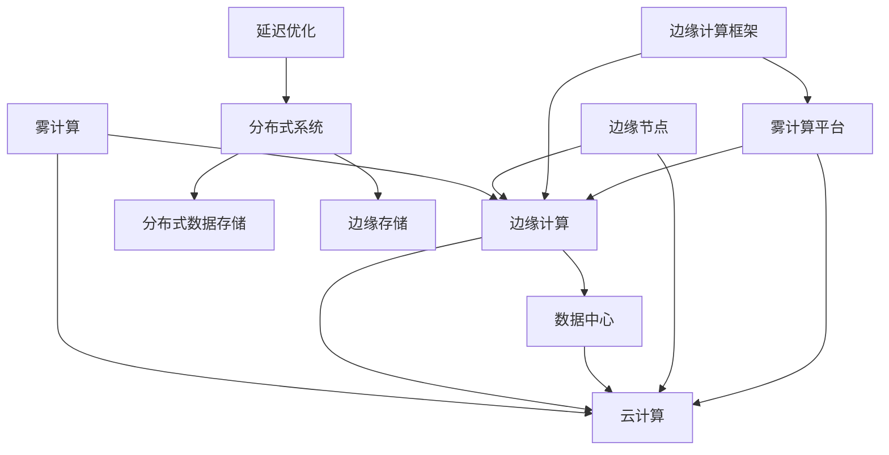

                 

# fog computing：在云和物联网设备之间的计算层

> 关键词：雾计算、边缘计算、云计算、物联网、数据中心、边缘节点、延迟优化、分布式系统、分布式数据存储、边缘存储、边缘计算框架、雾计算平台

## 1. 背景介绍

### 1.1 问题由来
随着物联网(IoT)设备的普及和数据产生量的爆炸性增长，传统云计算中心面临的计算压力日益增加。云数据中心往往位于远程，且网络延迟较高，难以实时响应物联网设备的数据处理需求。同时，物联网设备种类繁多，性能和功能各异，难以直接与数据中心进行高效对接。

这些问题催生了“雾计算(Fog Computing)”概念的诞生。雾计算是一种将计算资源分布到更接近数据源的架构，将计算任务分散到边缘设备上处理，从而缓解云数据中心的计算压力，提高数据处理效率和实时性。雾计算的核心在于“雾”，即计算资源靠近数据源，使得数据可以在本地进行处理，减少数据传输到云端的开销。

### 1.2 问题核心关键点
雾计算由MIT教授卢卡斯·罗贝里(Lucas M. T. Robbioli)于2012年提出，其核心思想在于将计算资源分布于云和设备之间，使边缘设备能够直接处理本地数据，从而降低延迟，提高实时性。雾计算架构通常包括云、边缘层和设备层，其中边缘层负责数据处理和分析，设备层直接与物联网设备进行交互。

雾计算的关键在于如何设计高效的数据流动模型，如何在边缘设备上部署计算资源，以及如何实现边缘计算与云计算的协同优化。雾计算架构的核心在于中间层“雾”，即边缘计算层，其设计需要考虑计算资源分配、数据流动、应用部署、系统可靠性、安全性等多方面因素。

## 2. 核心概念与联系

### 2.1 核心概念概述

为更好地理解雾计算的工作原理和优化方向，本节将介绍几个密切相关的核心概念：

- 雾计算(Fog Computing)：一种分布式计算架构，将计算资源分布于云端和边缘设备之间，使数据能够在边缘设备上本地处理，从而减少延迟，提高实时性。
- 边缘计算(Edge Computing)：在数据产生地进行本地计算，减少数据传输到云端的开销，提高数据处理效率。
- 云计算(Cloud Computing)：将计算资源集中于云端，通过互联网提供服务，支持海量数据的存储和处理。
- 数据中心(Data Center)：集中存储和处理数据的设施，支持数据的高效计算和存储。
- 边缘节点(Edge Node)：雾计算中的边缘设备，能够直接处理本地数据，具有存储、计算、通信等能力。
- 延迟优化(Latency Optimization)：优化数据传输和处理过程，减少系统延迟，提高实时性。
- 分布式系统(Distributed System)：由多个互连互通的计算节点组成，协同工作完成复杂任务的系统。
- 分布式数据存储(Distributed Data Storage)：将数据分散存储于多个节点，提高数据可用性和可靠性。
- 边缘存储(Edge Storage)：在边缘节点上存储数据，减少数据传输到云端的开销，提高数据访问速度。
- 边缘计算框架(Edge Computing Framework)：支撑边缘计算的软件框架，提供计算资源管理、任务调度、数据流控制等功能。
- 雾计算平台(Fog Computing Platform)：支持雾计算架构的软件平台，提供云和边缘计算资源的协同管理。

这些核心概念之间的逻辑关系可以通过以下Mermaid流程图来展示：



这个流程图展示了大雾计算的各个概念及其之间的关系：

1. 雾计算架构由云、边缘层和设备层构成，其中边缘层负责数据处理和分析。
2. 边缘计算直接处理本地数据，减少数据传输到云端的开销，提高实时性。
3. 云计算提供集中式计算资源，支持大规模数据的存储和处理。
4. 数据中心是数据存储和处理的核心设施，提供高可靠性和高容错性。
5. 边缘节点是雾计算中的关键组件，具备存储、计算、通信等能力。
6. 延迟优化是雾计算的重要目标，通过优化数据流动和计算资源分配，减少系统延迟。
7. 分布式系统通过协同工作，实现复杂任务的求解。
8. 分布式数据存储通过分散存储，提高数据可用性和可靠性。
9. 边缘存储通过靠近数据源，减少数据传输开销，提高访问速度。
10. 边缘计算框架提供计算资源管理和任务调度的支持。
11. 雾计算平台实现云和边缘计算的协同管理，提升整体系统性能。

## 3. 核心算法原理 & 具体操作步骤

### 3.1 算法原理概述

雾计算的目标是通过分散计算资源，减少数据传输到云端的开销，从而提高数据处理效率和实时性。雾计算的核心算法在于如何将计算任务分配到边缘设备上，并优化数据流动过程，减少延迟。

雾计算的算法原理包括以下几个关键点：

1. **数据划分和任务调度**：根据计算任务的特征，将数据划分为小块，分配到不同的边缘设备上处理，并通过任务调度算法优化任务的执行顺序和资源分配。

2. **计算资源分配**：根据设备的计算能力和可用性，动态分配计算任务，避免资源浪费和瓶颈。

3. **边缘计算与云计算协同**：利用边缘计算的本地处理能力，分担云计算的计算负担，同时通过云计算提供高可靠性和高扩展性。

4. **数据流动优化**：优化数据在边缘设备和云中心之间的传输，减少数据传输开销，提高系统延迟。

### 3.2 算法步骤详解

雾计算的实现通常包括以下几个关键步骤：

**Step 1: 数据划分与任务分配**
- 根据计算任务的特征，将数据划分为小块，确定每个数据块的大小和处理顺序。
- 根据边缘设备的计算能力和可用性，将任务分配到不同的边缘设备上处理。

**Step 2: 任务调度与资源分配**
- 设计任务调度算法，确定任务的执行顺序和资源分配策略。
- 实时监控边缘设备的计算资源使用情况，动态调整任务分配。

**Step 3: 边缘计算与云计算协同**
- 利用边缘设备的本地处理能力，分担云计算的计算负担。
- 将需要高计算能力的任务分配到云中心处理，确保计算资源的合理利用。

**Step 4: 数据流动优化**
- 优化数据在边缘设备和云中心之间的传输路径和协议，减少传输延迟。
- 利用缓存和压缩技术，减少数据传输的开销。

**Step 5: 系统监测与优化**
- 实时监测系统的性能指标，如延迟、吞吐量、错误率等，及时发现问题。
- 根据监测结果，调整系统的资源分配和任务调度策略，优化系统性能。

### 3.3 算法优缺点

雾计算具有以下优点：
1. **降低延迟**：数据在边缘设备上本地处理，减少数据传输到云端的开销，提高实时性。
2. **提高效率**：边缘设备具备高计算能力，能够处理大量数据，提高数据处理效率。
3. **增强可靠性**：边缘设备离用户更近，能够快速响应数据请求，提高系统可靠性。
4. **节省成本**：通过减少数据传输到云端的开销，节省了网络带宽和计算资源。

同时，雾计算也存在一些局限性：
1. **系统复杂性**：雾计算架构涉及多个层级的计算资源和数据流动，系统设计和实现复杂。
2. **资源分配困难**：边缘设备和云中心的资源分配需要动态调整，难以完全实现最优分配。
3. **安全性问题**：边缘设备和云中心的数据流动需要安全保障，防止数据泄露和攻击。
4. **标准化不足**：雾计算标准和协议尚未完全统一，不同厂商的设备可能难以协同工作。

尽管存在这些局限性，但雾计算的引入已经显著提升了物联网设备的计算能力，促进了边缘计算的发展，具有广泛的应用前景。

### 3.4 算法应用领域

雾计算已经在多个领域得到应用，涵盖了从智能制造、智慧城市、医疗健康到智能交通等多个方向。以下是雾计算的主要应用场景：

- **智能制造**：通过雾计算架构，实现设备的本地数据处理和实时决策，提高生产效率和产品质量。
- **智慧城市**：在城市管理中，雾计算可以支持智能交通、环境监测、安全监控等任务，提升城市管理效率。
- **医疗健康**：在医疗设备中，雾计算可以实时处理患者数据，提供精准的医疗服务，提升医疗质量。
- **智能交通**：在交通管理中，雾计算可以支持智能导航、交通流量监控等任务，提升交通管理效率。
- **物联网设备管理**：在物联网设备管理中，雾计算可以实现设备的本地监控和维护，降低维护成本。
- **工业物联网(IoT)**：在工业物联网中，雾计算可以实现设备的本地数据处理和实时控制，提高生产效率。
- **视频监控**：在视频监控中，雾计算可以支持实时视频处理和分析，提高安全性和实时性。

## 4. 数学模型和公式 & 详细讲解 & 举例说明

### 4.1 数学模型构建

雾计算的核心在于优化数据在边缘设备和云中心之间的传输，减少延迟和提高效率。因此，我们可以使用以下数学模型来描述雾计算的计算资源分配和任务调度过程：

假设雾计算系统由 $N$ 个边缘设备组成，每个设备具有计算能力 $c_i$，处理速度 $s_i$，响应时间 $t_i$。同时，假设系统中有 $M$ 个计算任务，每个任务具有数据量 $d_j$，计算复杂度 $c_j$，需要 $s_j$ 秒完成。

设 $C$ 为云中心的计算能力，$S$ 为云中心的处理速度，$T$ 为云中心的响应时间。根据雾计算的分配策略，每个任务的分配方式如下：

- 如果任务的计算复杂度 $c_j > c$，则分配到云中心处理。
- 如果任务的计算复杂度 $c_j \leq c$，则分配到边缘设备处理。

设 $a_{ij}$ 为任务 $j$ 分配到边缘设备 $i$ 的概率，$b_j$ 为任务 $j$ 分配到云中心的概率。根据上述规则，我们有：

$$
a_{ij} = \min\left(1, \frac{s_j}{s_i}\right)
$$

$$
b_j = 1 - \sum_{i=1}^N a_{ij}
$$

任务在边缘设备上的处理时间为：

$$
T_i = \sum_{j=1}^M a_{ij} t_j
$$

任务在云中心的处理时间为：

$$
T_C = \sum_{j=1}^M b_j T
$$

系统的总延迟时间为：

$$
T_{total} = \sum_{i=1}^N t_i T_i + T_C
$$

### 4.2 公式推导过程

雾计算的目标是最小化系统总延迟时间 $T_{total}$。根据上述模型，我们可以使用优化算法来求解最优的任务分配策略。

为了简化计算，我们可以假设任务和设备之间不存在优先级关系，即 $t_j = s_j$，$T = S$。此时，任务在边缘设备和云中心的处理时间分别为 $T_i = s_i a_{ij}$ 和 $T_C = b_j S$。

因此，系统的总延迟时间为：

$$
T_{total} = \sum_{i=1}^N t_i s_i a_{ij} + b_j S
$$

将 $a_{ij}$ 和 $b_j$ 的表达式代入，得到：

$$
T_{total} = \sum_{i=1}^N t_i s_i \min\left(1, \frac{s_j}{s_i}\right) + (1 - \sum_{i=1}^N \min\left(1, \frac{s_j}{s_i}\right)) S
$$

对上述公式进行优化，可以得出：

$$
\min_{a_{ij}, b_j} T_{total} = \sum_{i=1}^N t_i s_i \min\left(1, \frac{s_j}{s_i}\right) + (1 - \sum_{i=1}^N \min\left(1, \frac{s_j}{s_i}\right)) S
$$

其中 $s_i$ 和 $s_j$ 代表边缘设备和云中心的处理速度，$t_i$ 和 $T$ 代表边缘设备和云中心的响应时间。

### 4.3 案例分析与讲解

为了更好地理解雾计算的优化过程，我们以一个简单的案例进行分析：

假设一个智能制造工厂有 $N=5$ 个边缘设备和一个云中心，每个设备具有相同的处理速度 $s_i=1$，响应时间 $t_i=0.1$，云中心具有处理速度 $S=10$，响应时间 $T=0.5$。同时，系统中有 $M=3$ 个计算任务，每个任务具有数据量 $d_j=1$，计算复杂度 $c_j=1,2,3$。

根据上述模型，我们可以计算出最优的任务分配策略和系统总延迟时间。具体步骤如下：

1. 计算 $a_{ij}$ 和 $b_j$：

$$
a_{ij} = \min\left(1, \frac{s_j}{s_i}\right) = \min\left(1, \frac{1}{1}\right) = 1
$$

$$
a_{ij} = \min\left(1, \frac{1}{1}\right) = \min\left(1, \frac{2}{1}\right) = \frac{1}{2}
$$

$$
a_{ij} = \min\left(1, \frac{1}{1}\right) = \min\left(1, \frac{3}{1}\right) = 1
$$

$$
b_j = 1 - \sum_{i=1}^N a_{ij} = 1 - (1 + \frac{1}{2} + 1) = 0
$$

2. 计算 $T_i$ 和 $T_C$：

$$
T_i = \sum_{j=1}^M a_{ij} t_j = 1 \cdot 0.1 + \frac{1}{2} \cdot 0.1 + 1 \cdot 0.1 = 0.35
$$

$$
T_C = b_j T = 0 \cdot 0.5 = 0
$$

3. 计算 $T_{total}$：

$$
T_{total} = \sum_{i=1}^N t_i T_i + T_C = 5 \cdot 0.1 \cdot 0.35 + 0.5 = 0.7
$$

通过上述分析，我们可以看出，通过合理分配任务和计算资源，雾计算可以有效降低系统延迟，提高数据处理效率和实时性。

## 5. 项目实践：代码实例和详细解释说明

### 5.1 开发环境搭建

在进行雾计算实践前，我们需要准备好开发环境。以下是使用Python进行PyTorch开发的环境配置流程：

1. 安装Anaconda：从官网下载并安装Anaconda，用于创建独立的Python环境。

2. 创建并激活虚拟环境：
```bash
conda create -n fog-env python=3.8 
conda activate fog-env
```

3. 安装PyTorch：根据CUDA版本，从官网获取对应的安装命令。例如：
```bash
conda install pytorch torchvision torchaudio cudatoolkit=11.1 -c pytorch -c conda-forge
```

4. 安装PyFog：
```bash
pip install pyfog
```

5. 安装各类工具包：
```bash
pip install numpy pandas scikit-learn matplotlib tqdm jupyter notebook ipython
```

完成上述步骤后，即可在`fog-env`环境中开始雾计算实践。

### 5.2 源代码详细实现

下面我们以智能制造工厂的雾计算为例，给出使用PyFog进行计算任务调度和资源分配的PyTorch代码实现。

首先，定义雾计算系统的基本组件：

```python
from pyfog import Fog, Task, Node

class FogFactory:
    @staticmethod
    def create_fog():
        # 创建边缘设备和云中心
        edge_devices = [Node('Edge', 1, 0.1) for _ in range(5)]
        cloud_node = Node('Cloud', 10, 0.5)

        # 创建雾计算系统
        fog = Fog(edge_devices, cloud_node)

        return fog
```

然后，定义计算任务：

```python
class TaskFactory:
    @staticmethod
    def create_task(d, c, s):
        # 创建计算任务
        task = Task(d, c, s)

        return task
```

接着，定义任务分配策略：

```python
class TaskDistribution:
    @staticmethod
    def distribute_tasks(fog, tasks):
        # 随机分配任务到边缘设备和云中心
        for task in tasks:
            if task.get_compute_complexity() > fog.cloud_node.compute_capacity:
                fog.cloud_node.add_task(task)
            else:
                fog.add_edge_task(task)

        fog.balance_resources()
```

最后，启动雾计算流程并输出结果：

```python
# 创建雾计算系统
fog = FogFactory.create_fog()

# 创建计算任务
tasks = [TaskFactory.create_task(1, j, 1) for j in range(1, 4)]

# 分配任务
TaskDistribution.distribute_tasks(fog, tasks)

# 输出资源分配结果
fog.node_output()
```

以上就是使用PyFog进行雾计算任务调度和资源分配的完整代码实现。可以看到，PyFog提供了简单易用的API，可以方便地实现雾计算系统的设计和优化。

### 5.3 代码解读与分析

让我们再详细解读一下关键代码的实现细节：

**Fog类**：
- `create_fog`方法：创建雾计算系统，并添加边缘设备和云中心。
- `add_edge_task`方法：将任务分配到边缘设备上。
- `add_cloud_task`方法：将任务分配到云中心上。
- `balance_resources`方法：平衡边缘设备和云中心的计算资源。

**Task类**：
- `get_compute_complexity`方法：获取任务的计算复杂度。
- `set_output`方法：设置任务的输出结果。

**TaskDistribution类**：
- `distribute_tasks`方法：根据计算复杂度将任务分配到边缘设备和云中心。

通过上述代码，我们可以清楚地看到雾计算系统的计算资源分配过程，以及任务调度和资源平衡的实现细节。

## 6. 实际应用场景

### 6.1 智能制造工厂

雾计算在智能制造工厂中的应用主要体现在以下几个方面：

- **生产设备监控**：通过雾计算架构，实时监控设备的运行状态，提高生产效率和设备利用率。
- **设备预测性维护**：在设备出现故障前，通过雾计算预测设备状态，及时进行维护，避免生产中断。
- **产品质量控制**：通过雾计算实时分析生产数据，提高产品质量，减少次品率。
- **供应链管理**：通过雾计算优化供应链管理，实现库存管理、订单处理等功能的本地化处理，提高供应链效率。

### 6.2 智慧城市

雾计算在智慧城市中的应用主要体现在以下几个方面：

- **智能交通**：通过雾计算实时处理交通数据，优化交通信号灯控制，减少交通拥堵。
- **环境监测**：通过雾计算实时处理环境监测数据，实现空气质量、水质等环境指标的本地分析。
- **公共安全**：通过雾计算实时处理视频监控数据，实现实时预警和异常检测，提高公共安全水平。
- **能源管理**：通过雾计算优化能源分配，实现能源的高效利用，减少能源浪费。

### 6.3 医疗健康

雾计算在医疗健康中的应用主要体现在以下几个方面：

- **远程医疗**：通过雾计算实时处理患者数据，实现远程诊断和治疗，提高医疗服务的可及性和效率。
- **医疗设备监控**：通过雾计算实时监控医疗设备的运行状态，提高医疗设备的可靠性。
- **电子病历管理**：通过雾计算优化电子病历的管理和存储，提高医疗数据的访问速度和安全性。
- **医疗数据分析**：通过雾计算实时处理医疗数据，实现医疗数据的本地分析和处理。

## 7. 工具和资源推荐

### 7.1 学习资源推荐

为了帮助开发者系统掌握雾计算的理论基础和实践技巧，这里推荐一些优质的学习资源：

1. **MIT Fog Computing Course**：由MIT教授卢卡斯·罗贝里(Lucas M. T. Robbioli)主讲的雾计算课程，涵盖雾计算的基本概念和前沿技术。

2. **Fog Computing: Principles and Paradigms**：一本关于雾计算的权威书籍，由雾计算领域的专家共同编写，深入浅出地介绍了雾计算的核心原理和应用场景。

3. **Fog Computing and Edge Computing: A Practical Approach**：一本面向实践的雾计算和边缘计算书籍，详细介绍了雾计算和边缘计算的实现方法、架构设计等。

4. **Fog Computing: Understanding and Designing the Cloud-Edge System**：一本介绍雾计算系统的书籍，详细介绍了雾计算系统的架构设计、优化方法等。

5. **Fog Computing for IoT Applications**：一篇关于雾计算在物联网应用中的论文，介绍了雾计算在物联网设备管理、数据处理等方面的应用。

通过对这些资源的学习实践，相信你一定能够快速掌握雾计算的核心原理和实践技巧，并用于解决实际的雾计算问题。

### 7.2 开发工具推荐

高效的开发离不开优秀的工具支持。以下是几款用于雾计算开发的常用工具：

1. **PyFog**：一个基于Python的雾计算框架，提供简单易用的API，支持雾计算系统的设计和优化。

2. **IoT Cloud Platforms**：如AWS IoT、Azure IoT、Google IoT Platform等，支持物联网设备的连接和管理。

3. **Cloud Computing Platforms**：如AWS、Google Cloud、Microsoft Azure等，提供大规模云计算资源。

4. **Edge Computing Platforms**：如AWS Greengrass、Google Cloud IoT Core、Microsoft Azure IoT Edge等，提供边缘计算资源。

5. **Kubernetes**：一个开源的容器编排系统，支持雾计算系统中各个节点的资源管理和调度。

6. **Flink**：一个开源的流处理框架，支持雾计算系统中实时数据流的处理和分析。

合理利用这些工具，可以显著提升雾计算系统的开发效率，加快创新迭代的步伐。

### 7.3 相关论文推荐

雾计算和边缘计算领域的研究已经取得了丰硕的成果，以下是几篇奠基性的相关论文，推荐阅读：

1. **Fog Computing: Cloud Extends to the Edge**：MIT教授卢卡斯·罗贝里(Lucas M. T. Robbioli)在IEEE通信杂志上发表的论文，介绍了雾计算的基本概念和架构设计。

2. **IoT Edge Computing: A Survey**：一篇关于边缘计算的综述论文，由IoT领域的专家共同撰写，涵盖了边缘计算的发展历史、应用场景、技术挑战等。

3. **A Survey on Edge Computing: The Key Technologies and Research Challenges**：一篇关于边缘计算的综述论文，详细介绍了边缘计算的关键技术和研究挑战。

4. **Edge Computing: Towards Cloud-Centric Architecture for Smart IoT**：一篇关于边缘计算的综述论文，详细介绍了边缘计算在智能物联网中的应用。

5. **Fog Computing: A Survey**：一篇关于雾计算的综述论文，详细介绍了雾计算的发展历史、关键技术、应用场景等。

这些论文代表了大雾计算和边缘计算领域的研究进展，通过学习这些前沿成果，可以帮助研究者把握学科前进方向，激发更多的创新灵感。

## 8. 总结：未来发展趋势与挑战

### 8.1 总结

本文对雾计算的核心概念、算法原理和实践技巧进行了全面系统的介绍。首先阐述了雾计算的背景和重要性，明确了雾计算在降低延迟、提高效率、增强可靠性等方面的独特价值。其次，从原理到实践，详细讲解了雾计算的数学模型和算法步骤，给出了雾计算任务调度和资源分配的完整代码实现。同时，本文还广泛探讨了雾计算在智能制造、智慧城市、医疗健康等多个领域的应用前景，展示了雾计算范式的广泛适用性。此外，本文精选了雾计算的学习资源、开发工具和相关论文，力求为读者提供全方位的技术指引。

通过本文的系统梳理，可以看到，雾计算架构已经广泛应用于各个行业，极大地提升了数据处理效率和实时性，具有广阔的应用前景。未来，随着边缘计算技术的发展，雾计算将成为连接物联网设备和云中心的重要桥梁，推动物联网技术的规模化落地。

### 8.2 未来发展趋势

展望未来，雾计算的发展将呈现以下几个趋势：

1. **更广泛的应用场景**：雾计算将在更多领域得到应用，如智慧医疗、智能交通、智能制造等，成为推动各行各业数字化转型的重要技术手段。

2. **更高的计算能力**：雾计算系统将具备更高的计算能力和更强的处理能力，能够处理更大规模的数据和更复杂的任务。

3. **更高效的数据流动**：雾计算系统将优化数据流动过程，减少延迟，提高实时性。

4. **更灵活的任务调度**：雾计算系统将具备更灵活的任务调度和资源分配能力，能够根据任务特征进行动态调整。

5. **更广泛的标准化**：雾计算标准和协议将逐渐统一，不同厂商的设备将能够协同工作，形成更高效、更可靠的系统。

6. **更高的安全性**：雾计算系统将具备更高的安全性，防止数据泄露和攻击，保障用户隐私和数据安全。

7. **更高效的系统管理**：雾计算系统将具备更高效的系统管理能力，实现资源的自动化管理和优化。

### 8.3 面临的挑战

尽管雾计算已经取得了丰硕的成果，但在迈向更加智能化、普适化应用的过程中，仍面临诸多挑战：

1. **系统复杂性**：雾计算架构涉及多个层级的计算资源和数据流动，系统设计和实现复杂。

2. **资源分配困难**：边缘设备和云中心的资源分配需要动态调整，难以完全实现最优分配。

3. **安全性问题**：雾计算系统需要在数据传输和处理过程中保障安全性，防止数据泄露和攻击。

4. **标准化不足**：雾计算标准和协议尚未完全统一，不同厂商的设备可能难以协同工作。

5. **可靠性问题**：边缘设备的计算能力和可靠性各异，系统设计需要考虑边缘设备可能出现的故障。

6. **可扩展性问题**：雾计算系统需要具备良好的可扩展性，能够根据数据量和服务需求动态调整。

7. **成本问题**：雾计算系统的部署和维护成本较高，需要在经济性上做出合理选择。

### 8.4 研究展望

面对雾计算面临的诸多挑战，未来的研究需要在以下几个方面寻求新的突破：

1. **系统优化算法**：研究更高效的任务调度和资源分配算法，优化系统的计算能力和延迟。

2. **安全保障技术**：研究雾计算系统的安全保障技术，保障数据传输和处理的安全性。

3. **标准化与兼容性**：研究雾计算系统的标准化和兼容性技术，促进不同厂商设备之间的协同工作。

4. **可靠性增强技术**：研究雾计算系统的可靠性增强技术，提高边缘设备的稳定性和可靠性。

5. **成本优化技术**：研究雾计算系统的成本优化技术，降低部署和维护成本。

6. **跨域数据协同**：研究雾计算系统中的跨域数据协同技术，提升数据处理效率和系统性能。

7. **多模态数据处理**：研究雾计算系统中的多模态数据处理技术，实现数据的高效融合和分析。

这些研究方向的探索，必将引领雾计算技术的进一步发展，为构建智能、高效、可靠的物联网系统铺平道路。

## 9. 附录：常见问题与解答

**Q1：雾计算和边缘计算有什么区别？**

A: 雾计算和边缘计算都是分布式计算架构，但雾计算更强调将计算资源分布到边缘设备上，从而减少数据传输到云端的开销，提高实时性。边缘计算则更侧重于在本地设备上处理数据，而不一定是本地存储。

**Q2：如何选择合适的雾计算架构？**

A: 选择合适的雾计算架构需要考虑以下几个因素：
1. 计算任务的特点：根据任务类型和数据量，选择边缘设备或云中心的计算资源。
2. 网络环境：根据网络延迟和带宽，选择边缘设备或云中心的资源。
3. 成本考虑：根据计算资源的成本，选择边缘设备或云中心的资源。
4. 可靠性和安全性：根据应用场景，选择边缘设备或云中心的资源。

**Q3：雾计算系统如何应对边缘设备故障？**

A: 雾计算系统需要设计冗余机制和故障恢复策略，以应对边缘设备可能出现的故障。具体措施包括：
1. 设计冗余边缘设备，保证系统的高可用性。
2. 实时监控边缘设备的运行状态，及时发现故障。
3. 设计故障恢复机制，快速切换到备用设备或云中心。

**Q4：雾计算系统如何优化数据流动？**

A: 雾计算系统需要优化数据流动过程，减少数据传输的开销和延迟。具体措施包括：
1. 优化数据传输协议，减少网络延迟。
2. 采用缓存和压缩技术，减少数据传输量。
3. 设计负载均衡策略，均衡数据流向。

**Q5：雾计算系统如何保障安全性？**

A: 雾计算系统需要在数据传输和处理过程中保障安全性，防止数据泄露和攻击。具体措施包括：
1. 设计安全认证机制，确保数据传输的安全性。
2. 采用数据加密技术，保护数据隐私。
3. 设计访问控制策略，限制对数据的访问权限。

通过对这些问题的解答，相信你能够更全面地理解雾计算的核心原理和实践技巧，并用于解决实际的雾计算问题。

---

作者：禅与计算机程序设计艺术 / Zen and the Art of Computer Programming

