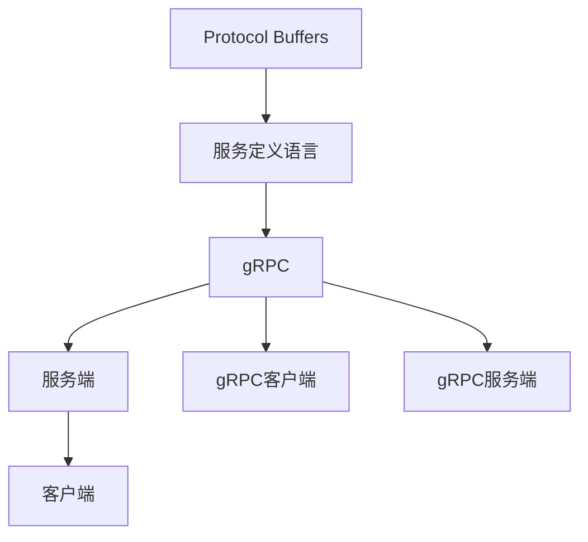

                 

## 1. 背景介绍

### 1.1 问题由来

随着微服务架构的兴起和分布式系统的广泛应用，远程过程调用（RPC）成为了构建大规模、高性能分布式系统的核心组件。然而，传统的RPC框架通常只能支持同一种编程语言，难以跨语言调用。为了打破这种限制，各种跨语言的RPC框架应运而生。这些框架能够通过简单的接口定义和编解码方式，实现不同语言间的相互调用。

### 1.2 问题核心关键点

- **跨语言通信**：允许不同编程语言之间通过统一的接口进行相互调用。
- **高性能**：提供高效的数据传输和通信机制，保证系统性能。
- **版本兼容性**：支持不同版本的客户端和服务端之间的兼容。
- **可扩展性**：支持插件和扩展机制，方便开发者扩展和定制功能。

### 1.3 问题研究意义

gRPC作为一种高性能、跨语言的RPC框架，已经在各大互联网公司得到广泛应用。它不仅支持多种编程语言，还具有轻量级、高性能、版本兼容等诸多优点，是大规模分布式系统中的首选。本文将详细探讨gRPC的核心概念和实现原理，并通过实际案例展示其在高性能跨语言通信中的应用。

## 2. 核心概念与联系

### 2.1 核心概念概述

- **gRPC**：一个高性能、跨语言的RPC框架，由Google开源维护，支持多种编程语言，包括C++、Java、Go、Python、Ruby、Node.js等。
- **Protocol Buffers (protobuf)**：gRPC的通信协议，用于序列化数据，提供高效的编码和解码机制。
- **服务定义语言 (Service Definition Language)**：gRPC用于定义服务的语言，类似于RESTful的API定义方式，包括服务名、方法名、参数和返回值等。
- **服务端**：提供服务的程序，通常运行在服务器端，通过gRPC接口接收客户端请求。
- **客户端**：调用服务的程序，通常运行在客户端，通过gRPC接口向服务端发送请求，并获取响应。

这些核心概念构成了gRPC的基础框架，使得不同编程语言之间的通信变得高效、灵活、可靠。

### 2.2 核心概念原理和架构的 Mermaid 流程图



此图展示了gRPC的核心架构：使用Protocol Buffers进行数据序列化，通过服务定义语言定义服务接口，服务端和客户端分别使用gRPC服务端和客户端进行通信。

## 3. 核心算法原理 & 具体操作步骤

### 3.1 算法原理概述

gRPC的核心算法原理基于高性能的Protocol Buffers和gRPC框架的设计理念。Protocol Buffers提供高效的序列化和反序列化机制，gRPC则提供高效的通信模型和灵活的协议。

### 3.2 算法步骤详解

1. **安装依赖**：
   - **服务端**：安装gRPC库和相应的开发工具。
   - **客户端**：安装gRPC库和相应的开发工具。

2. **定义服务**：
   - 使用服务定义语言定义服务接口。
   - 使用Protocol Buffers定义消息格式。

3. **编写服务端代码**：
   - 实现服务接口，定义处理函数。
   - 创建服务实例，并注册到gRPC服务器中。

4. **编写客户端代码**：
   - 创建gRPC客户端，连接gRPC服务。
   - 发送请求，处理响应。

### 3.3 算法优缺点

**优点**：
- **高性能**：基于Protocol Buffers的序列化和反序列化，传输效率高。
- **跨语言**：支持多种编程语言，易于跨语言开发。
- **版本兼容**：通过服务定义语言和Protocol Buffers，支持服务接口的向后兼容。

**缺点**：
- **学习曲线陡峭**：需要学习Protocol Buffers和gRPC框架的使用方式。
- **工具链依赖**：需要安装和配置多种工具和依赖。

### 3.4 算法应用领域

gRPC广泛应用于大规模分布式系统中，如微服务架构、大数据处理、物联网、人工智能等。

## 4. 数学模型和公式 & 详细讲解 & 举例说明

### 4.1 数学模型构建

gRPC的核心数学模型基于Protocol Buffers和gRPC框架的实现。Protocol Buffers使用google::protobuf::Message作为消息类，定义了消息的字段、类型和标签。gRPC使用grpc::Service作为服务类，定义了服务的接口和方法。

### 4.2 公式推导过程

- **Protocol Buffers**：
  - **序列化**：将Message对象序列化为二进制数据。
  - **反序列化**：将二进制数据反序列化为Message对象。

- **gRPC**：
  - **发送请求**：将请求数据编码为二进制数据，并发送给服务端。
  - **接收响应**：从服务端接收响应数据，并解码为Response对象。

### 4.3 案例分析与讲解

以一个简单的gRPC服务为例，分析其核心流程：

- **服务定义**：
  ```proto
  service Greeter {
    rpc SayHello (HelloRequest) returns (HelloResponse);
  }

  message HelloRequest {
    string name = 1;
  }

  message HelloResponse {
    string message = 1;
  }
  ```

- **服务端实现**：
  ```cpp
  class GreeterService : public ::grpc::Server {
   public:
    GreeterService(::grpc::ServerBuilder* builder);
    void SayHello(::grpc::ServerContext* context, const ::gRPC::Greeter::HelloRequest* request, ::gRPC::ServerWriter<::gRPC::Greeter::HelloResponse> writer) override;
    ~GreeterService();
  };

  void GreeterService::SayHello(::grpc::ServerContext* context, const ::gRPC::Greeter::HelloRequest* request, ::grpc::ServerWriter<::gRPC::Greeter::HelloResponse> writer) {
    writer->Write(::gRPC::Greeter::HelloResponse{.message = "Hello, " + request->name()});
    writer->WritesDone();
  }

  GreeterService::GreeterService(::grpc::ServerBuilder* builder) {
    builder->RegisterService(&GreeterService::AsService);
  }

  void GreeterService::AsService(::grpc::ServerBuilder* builder, const std::string& /* unused */) {
    ::grpc::Service::AsService(builder, this);
  }

  GreeterService::~GreeterService() {}
  ```

- **客户端实现**：
  ```cpp
  int main(int argc, char** argv) {
    ::grpc::ServerBuilder builder;
    ::grpc::ServiceBuilder builder2(&builder);
    builder.RegisterService(new GreeterService(&builder2));
    builder.BuildAndStart();
    std::cout << "Server listening on port " << builder.AddListeningPort().port() << std::endl;
    return 0;
  }
  ```

此案例展示了gRPC服务端和客户端的基本实现流程，包括服务定义、服务端实现、客户端调用等步骤。

## 5. 项目实践：代码实例和详细解释说明

### 5.1 开发环境搭建

1. **安装gRPC库**：
   - **服务端**：安装gRPC C++库和相应的开发工具。
   - **客户端**：安装gRPC对应的语言库和相应的开发工具。

2. **配置开发环境**：
   - 在服务端配置GRPC_GZIP_MINIMUM_SIZE参数，开启GZIP压缩。
   - 在客户端配置GRPC_PCOMPRESSION_TYPE参数，设置使用的压缩类型。

### 5.2 源代码详细实现

以一个简单的gRPC服务为例，展示服务端和客户端的实现过程：

**服务端代码**：
```cpp
#include <grpcpp/grpcpp.h>

class GreeterService : public ::grpc::Server {
 public:
  GreeterService(::grpc::ServerBuilder* builder);
  void SayHello(::grpc::ServerContext* context, const ::gRPC::Greeter::HelloRequest* request, ::grpc::ServerWriter<::gRPC::Greeter::HelloResponse> writer) override;
  ~GreeterService();
};

void GreeterService::SayHello(::grpc::ServerContext* context, const ::gRPC::Greeter::HelloRequest* request, ::grpc::ServerWriter<::gRPC::Greeter::HelloResponse> writer) {
  writer->Write(::gRPC::Greeter::HelloResponse{.message = "Hello, " + request->name()});
  writer->WritesDone();
}

GreeterService::GreeterService(::grpc::ServerBuilder* builder) {
  builder->RegisterService(&GreeterService::AsService);
}

void GreeterService::AsService(::grpc::ServerBuilder* builder, const std::string& /* unused */) {
  ::grpc::Service::AsService(builder, this);
}

GreeterService::~GreeterService() {}

int main(int argc, char** argv) {
  ::grpc::ServerBuilder builder;
  ::grpc::ServiceBuilder builder2(&builder);
  builder.RegisterService(new GreeterService(&builder2));
  builder.BuildAndStart();
  std::cout << "Server listening on port " << builder.AddListeningPort().port() << std::endl;
  return 0;
}
```

**客户端代码**：
```cpp
#include <grpcpp/grpcpp.h>

class GreeterClient {
 public:
  GreeterClient(::grpc::Channel* channel);
  ~GreeterClient();
  ::grpc::Status SayHello(::grpc::ClientContext* context, const ::gRPC::Greeter::HelloRequest* request, ::gRPC::Greeter::HelloResponse* response);
 private:
  std::unique_ptr< ::grpc::ClientReaderWriter< ::gRPC::Greeter::HelloRequest, ::gRPC::Greeter::HelloResponse>> stub_;
};

GreeterClient::GreeterClient(::grpc::Channel* channel) : stub_(::grpc::Greeter::NewStub(channel)) {}

GreeterClient::~GreeterClient() {}

::grpc::Status GreeterClient::SayHello(::grpc::ClientContext* context, const ::gRPC::Greeter::HelloRequest* request, ::gRPC::Greeter::HelloResponse* response) {
  ::grpc::ClientReaderWriter< ::gRPC::Greeter::HelloRequest, ::gRPC::Greeter::HelloResponse> stream(stub_->SayHello(context));
  stream.Write(request);
  stream.Close();
  return ::grpc::Status::OK;
}

int main(int argc, char** argv) {
  ::grpc::ChannelCredentials credentials(::grpc::InsecureChannelCredentials());
  ::grpc::ChannelArguments args;
  args.SetInt(GRPC_ARG_COMPRESSION, GRPC_COMPRESS_GZIP);
  ::grpc::ClientContext context(args);
  ::grpc::Channel* channel = ::grpc::CreateChannel("localhost:50051", credentials);
  GreeterClient client(channel);
  ::gRPC::Greeter::HelloRequest request;
  request.set_name("world");
  ::gRPC::Greeter::HelloResponse response;
  ::grpc::Status status = client.SayHello(&context, &request, &response);
  if (status.ok()) {
    std::cout << "Greeting : " << response.message() << std::endl;
  } else {
    std::cout << status.error_message() << std::endl;
  }
  delete channel;
}
```

### 5.3 代码解读与分析

**服务端代码解读**：
- **GreeterService类**：继承自`::grpc::Server`，实现`SayHello`方法，处理客户端请求。
- **AsService方法**：注册服务到gRPC服务器中。
- **GreeterService构造函数和析构函数**：初始化和销毁服务对象。

**客户端代码解读**：
- **GreeterClient类**：继承自`::grpc::ClientReaderWriter`，实现`SayHello`方法，发送请求并接收响应。
- **SayHello方法**：发送请求并处理响应。

## 6. 实际应用场景

### 6.1 高性能跨语言通信

gRPC的高性能特点使其在分布式系统中的应用非常广泛。例如，在微服务架构中，不同的服务模块之间可以通过gRPC进行高效通信，实现快速、可靠、灵活的调用。gRPC还支持异步通信，能够大幅提高系统的并发能力和吞吐量。

### 6.2 分布式数据处理

gRPC在分布式数据处理中也得到了广泛应用。例如，在大数据处理框架中，各个节点之间的通信可以使用gRPC，实现高效的数据传输和处理。gRPC还支持GRPC-GZIP压缩，进一步提升了数据传输效率。

### 6.3 物联网

gRPC在物联网中的应用也非常广泛。例如，在智能家居系统中，各个智能设备之间的通信可以使用gRPC，实现设备的互联互通和数据交换。gRPC的高性能和可靠性，能够保证系统稳定、高效地运行。

### 6.4 未来应用展望

未来，gRPC将继续在分布式系统中发挥重要作用，特别是在高性能、跨语言通信方面。gRPC还将支持更多的编程语言和协议，进一步扩展其应用范围。

## 7. 工具和资源推荐

### 7.1 学习资源推荐

- **gRPC官方文档**：详细的gRPC文档和教程，帮助开发者掌握gRPC的使用和实践。
- **Protocol Buffers官方文档**：详细的Protocol Buffers文档和教程，帮助开发者掌握序列化和反序列化机制。
- **Google Cloud Platform gRPC教程**：详细的gRPC教程，帮助开发者掌握gRPC在云平台中的应用。

### 7.2 开发工具推荐

- **gRPC C++库**：高性能、跨语言的gRPC库，支持多种编程语言。
- **Protocol Buffers库**：序列化和反序列化库，支持多种数据格式。
- **GRPC-GZIP库**：支持GZIP压缩，提高数据传输效率。

### 7.3 相关论文推荐

- **"Building the gRPC Client Library and Service Framework in C++"**：gRPC C++库的实现和应用。
- **"Protocol Buffers: Google's data interchange format"**：Protocol Buffers的实现和应用。
- **"Efficient Compression of Protocol Buffers in gRPC"**：gRPC中的GZIP压缩技术。

## 8. 总结：未来发展趋势与挑战

### 8.1 研究成果总结

gRPC作为高性能、跨语言的RPC框架，已经在各大互联网公司得到广泛应用。它不仅支持多种编程语言，还具有高效、灵活、可扩展等诸多优点，是大规模分布式系统中的首选。

### 8.2 未来发展趋势

未来，gRPC将继续在分布式系统中发挥重要作用，特别是在高性能、跨语言通信方面。gRPC还将支持更多的编程语言和协议，进一步扩展其应用范围。

### 8.3 面临的挑战

虽然gRPC已经取得了显著的进展，但仍面临一些挑战：
- **学习曲线陡峭**：需要学习Protocol Buffers和gRPC框架的使用方式。
- **工具链依赖**：需要安装和配置多种工具和依赖。

### 8.4 研究展望

未来，gRPC需要在以下几个方面进行改进：
- **简化工具链**：提供更加简洁的工具和接口，降低使用门槛。
- **提升性能**：优化序列化和反序列化过程，提升传输效率。
- **增强跨语言支持**：支持更多编程语言和协议，提高兼容性。

## 9. 附录：常见问题与解答

**Q1：如何优化gRPC的性能？**

A：可以通过以下方式优化gRPC的性能：
- **使用GRPC_GZIP参数**：启用GZIP压缩，减少传输数据量。
- **使用GRPC_PCOMPRESSION_TYPE参数**：设置使用的压缩类型。
- **减少传输数据量**：只传输必要的字段，减少数据传输量。

**Q2：如何使用gRPC实现跨语言通信？**

A：可以使用gRPC定义的服务接口，在多个编程语言中实现跨语言通信。例如，在C++中实现服务端，在Python中实现客户端，通过gRPC进行通信。

**Q3：如何处理gRPC中的异常？**

A：gRPC中的异常处理可以通过以下方式进行：
- **捕获异常**：在服务端和客户端代码中，捕获异常并进行处理。
- **设置超时时间**：设置请求超时时间，避免长时间等待。
- **设置重试机制**：设置请求重试机制，提高系统的鲁棒性。

**Q4：如何在gRPC中使用GRPC_GZIP参数？**

A：在gRPC中使用GRPC_GZIP参数，可以通过以下方式进行：
- **设置GRPC_GZIP参数**：在客户端和服务端的gRPC选项中，设置GRPC_GZIP参数为True。
- **启用GZIP压缩**：启用GZIP压缩，减少传输数据量。

本文对gRPC的核心概念、实现原理和操作步骤进行了详细介绍，并通过实际案例展示了其在高性能跨语言通信中的应用。未来，gRPC将继续在分布式系统中发挥重要作用，特别是在高性能、跨语言通信方面。开发者可以通过学习gRPC和Protocol Buffers，掌握高性能跨语言通信的技术，构建高效、可靠、灵活的分布式系统。

