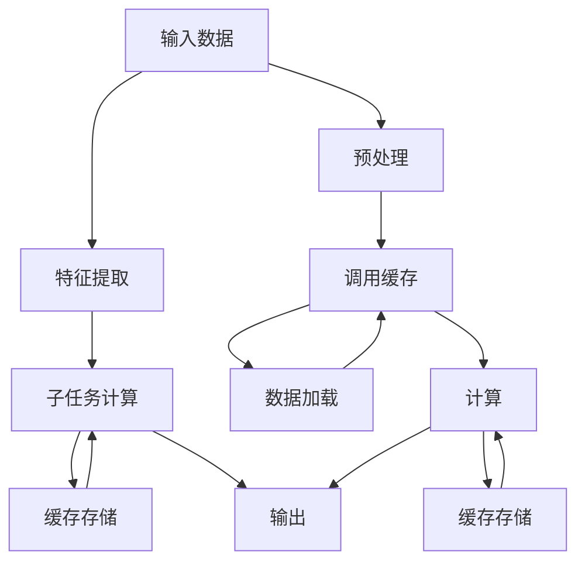

                 

# kv-cache 推断：加速模型推理

## 1. 背景介绍

随着深度学习技术在各个领域的应用逐渐深入，模型推理的速度和效率成为了制约实际应用推广的关键因素。特别是在需要大规模数据处理和实时响应的场景，如推荐系统、自然语言处理、计算机视觉等，模型推理的性能直接影响用户体验。

传统的模型推理方式通常需要加载整个模型，进行前向计算，然后输出结果。这种做法虽然简单直观，但在计算资源有限、响应速度要求高的场景，容易导致性能瓶颈。

因此，如何优化模型推理过程，降低计算资源消耗，提升推理速度，成为了深度学习领域的重要研究方向之一。近年来，kv-cache推断技术逐渐引起了学术界和工业界的关注，成为加速模型推理的重要手段。

本文将从kv-cache推断的基本原理、算法步骤、实际应用场景等方面进行系统阐述，力图为开发者和研究人员提供全面的指导，以期推动kv-cache推断技术在实际工程中的广泛应用。

## 2. 核心概念与联系

### 2.1 核心概念概述

kv-cache推断是一种基于键值存储（Key-Value Store）的模型推理技术，旨在通过缓存模型计算的中间结果，避免重复计算，从而加速模型推理过程。

在传统的模型推理过程中，对于需要多次重复计算的张量，需要通过加载整个模型重新计算，效率较低。而kv-cache推断则将计算过程分解为多个步骤，每次只计算需要的部分，将中间结果缓存到键值存储中，后续计算时直接读取缓存结果，避免重复计算，大大提升了推理效率。

kv-cache推断的核心思想是：将模型推理过程拆分为多个子任务，每个子任务计算完成后将结果缓存到kv存储中，后续子任务只需读取缓存结果即可。这种技术适用于任何需要重复计算的深度学习模型，包括卷积神经网络（CNN）、循环神经网络（RNN）、Transformer等。

### 2.2 核心概念原理和架构的 Mermaid 流程图



在上述流程图中，输入数据首先经过预处理，然后调用缓存中的计算结果，加载数据，执行计算，将计算结果缓存到kv存储中，最终输出结果。

## 3. 核心算法原理 & 具体操作步骤

### 3.1 算法原理概述

kv-cache推断的算法原理可以简单概括为：将模型推理过程分解为多个子任务，每次只计算需要计算的部分，将中间结果缓存到kv存储中，后续子任务直接读取缓存结果。

具体来说，kv-cache推断包括以下几个步骤：

1. 将模型拆分为多个子任务，每个子任务计算所需的部分。
2. 每次只计算部分计算结果，并将结果缓存到kv存储中。
3. 后续计算直接读取缓存结果，避免重复计算。
4. 通过合理调度计算顺序，优化推理过程，提升推理效率。

### 3.2 算法步骤详解

#### 3.2.1 模型拆分与缓存策略

首先需要将模型拆分为多个子任务。对于每个子任务，需要确定哪些计算结果需要缓存，哪些计算结果可以直接跳过。

一般来说，模型中存在大量需要多次使用的中间结果，如卷积层、池化层、循环层等。这些层的计算结果可以缓存到kv存储中，后续计算可以直接读取，避免重复计算。

缓存策略可以分为两种：

1. **显式缓存**：开发者手动标识需要缓存的张量，这些张量的计算结果会被缓存到kv存储中。

2. **隐式缓存**：模型推理过程中，系统自动识别需要缓存的张量，并将结果缓存到kv存储中。

#### 3.2.2 缓存存储与数据加载

缓存存储通常使用键值存储系统，如Redis、Memcached等。每个计算结果对应一个键，值为计算结果的数据。

数据加载时，系统首先检查缓存中是否存在该键对应的值，若存在，则直接读取缓存结果。否则，执行相应的计算，将计算结果缓存到kv存储中。

#### 3.2.3 计算调度与结果缓存

计算调度是kv-cache推断的关键部分，合理调度计算顺序，能够显著提升推理效率。

具体来说，系统需要确定每个子任务的计算顺序，使得计算结果的依赖关系最小化，从而减少缓存的冲突和等待。例如，如果两个子任务计算的结果需要同时使用，可以并行计算这两个子任务。

计算完成后，将计算结果缓存到kv存储中。缓存结果时，需要考虑缓存策略，确定哪些结果需要缓存，哪些结果可以直接跳过。

### 3.3 算法优缺点

kv-cache推断的优点包括：

1. **提升推理速度**：通过缓存中间结果，避免了重复计算，大大提升了推理速度。

2. **降低计算资源消耗**：缓存技术可以减少计算过程中对内存、CPU等资源的消耗，提高计算效率。

3. **灵活性高**：缓存策略可以根据实际应用场景进行调整，适用于各种深度学习模型。

4. **易于实现**：使用现有的键值存储系统，系统实现简单。

kv-cache推断的缺点包括：

1. **缓存空间占用大**：缓存中间结果需要占用大量内存，对于计算量大的模型，缓存空间可能成为瓶颈。

2. **缓存一致性问题**：缓存结果可能存在不一致性，需要系统进行一致性维护。

3. **缓存更新开销大**：缓存更新需要频繁进行，开销较大。

4. **难以处理动态计算图**：动态计算图（如循环神经网络）的缓存和计算调度需要更复杂的逻辑。

### 3.4 算法应用领域

kv-cache推断技术在以下几个领域得到了广泛应用：

1. **推荐系统**：推荐系统需要频繁计算用户-物品交互矩阵，通过kv-cache推断技术，可以显著提升推荐模型的推理速度。

2. **自然语言处理**：自然语言处理模型如BERT、GPT等，计算过程中存在大量中间结果，通过缓存技术可以提升模型推理速度。

3. **计算机视觉**：计算机视觉模型如卷积神经网络（CNN），计算过程中存在大量中间张量，通过缓存技术可以提升推理速度。

4. **语音识别**：语音识别模型如RNN，计算过程中存在大量中间结果，通过缓存技术可以提升模型推理速度。

5. **自动驾驶**：自动驾驶模型如LIDAR传感器数据处理、目标检测等，通过缓存技术可以提升模型推理速度。

## 4. 数学模型和公式 & 详细讲解 & 举例说明

### 4.1 数学模型构建

kv-cache推断的数学模型可以简单概括为：将模型推理过程拆分为多个子任务，每次只计算部分结果，将中间结果缓存到kv存储中，后续计算直接读取缓存结果。

对于深度学习模型，如卷积神经网络（CNN）、循环神经网络（RNN）、Transformer等，都可以应用kv-cache推断技术。

### 4.2 公式推导过程

假设模型的推理过程包含n个子任务，每个子任务计算的输出张量为T，输入张量为X，中间结果的缓存策略为显式缓存，则kv-cache推断的过程可以表示为：

$$
\begin{aligned}
&\text{Input}\quad X \\
&\text{Subtask 1} \quad T_1 = f_1(X) \\
&\text{Cache} \quad \text{Cache}[T_1] = T_1 \\
&\text{Subtask 2} \quad T_2 = f_2(X, \text{Cache}[T_1]) \\
&\text{Cache} \quad \text{Cache}[T_2] = T_2 \\
&\cdots \\
&\text{Subtask n} \quad T_n = f_n(X, \text{Cache}[T_1, T_2, \cdots, T_{n-1}]) \\
&\text{Cache} \quad \text{Cache}[T_n] = T_n \\
&\text{Output} \quad \text{Cache}[T_n]
\end{aligned}
$$

其中，f为模型中某个子任务的计算函数，$\text{Cache}[T_i]$表示子任务i的输出结果缓存到kv存储中，$\text{Cache}[T_1, T_2, \cdots, T_{n-1}]$表示子任务1到子任务n-1的输出结果缓存到kv存储中。

### 4.3 案例分析与讲解

假设有一个简单的卷积神经网络（CNN）模型，包含两个卷积层和两个池化层，输入图像大小为32x32x3，输出类别数为10。

1. **模型拆分与缓存策略**

假设第一个卷积层和第一个池化层为子任务1，第二个卷积层和第二个池化层为子任务2，计算过程中需要缓存所有中间结果。

2. **缓存存储与数据加载**

使用Redis作为缓存系统，每次计算结果的键为该层的输出张量名称，值为用户的数据。

3. **计算调度与结果缓存**

子任务1和子任务2可以并行计算，计算完成后，将结果缓存到Redis中。子任务2需要读取子任务1的输出结果，进行后续计算。

4. **计算结果输出**

最终输出结果为子任务2的输出张量，已缓存到Redis中。

## 5. 项目实践：代码实例和详细解释说明

### 5.1 开发环境搭建

要使用kv-cache推断技术，需要搭建一个包含缓存系统的开发环境。以下是搭建开发环境的步骤：

1. 安装Redis或Memcached：可以从官网下载二进制包，解压后安装。

2. 编写代码调用Redis或Memcached：可以使用Python的redis库，连接Redis或Memcached，进行数据缓存和加载。

3. 测试环境搭建：在Python中搭建测试环境，使用PyTorch或TensorFlow等深度学习框架，加载模型，进行测试。

### 5.2 源代码详细实现

以下是使用PyTorch实现kv-cache推断的代码示例：

```python
import torch
import torch.nn as nn
import torch.distributed as dist
import redis

# 定义Redis连接池
redis_conn_pool = redis.ConnectionPool(host='localhost', port=6379)

# 定义缓存函数
def cache(key, value):
    r = redis.StrictRedis(connection_pool=redis_conn_pool)
    r.set(key, value)
    return r.get(key)

# 定义模型
class CNN(nn.Module):
    def __init__(self):
        super(CNN, self).__init__()
        self.conv1 = nn.Conv2d(3, 32, 3, 1)
        self.pool1 = nn.MaxPool2d(2, 2)
        self.conv2 = nn.Conv2d(32, 64, 3, 1)
        self.pool2 = nn.MaxPool2d(2, 2)
        self.fc1 = nn.Linear(64 * 8 * 8, 256)
        self.fc2 = nn.Linear(256, 10)

    def forward(self, x):
        x = self.pool1(self.conv1(x))
        x = cache('conv1_output', x)
        x = self.pool2(self.conv2(x))
        x = cache('conv2_output', x)
        x = x.view(-1, 64 * 8 * 8)
        x = self.fc1(x)
        x = cache('fc1_output', x)
        x = self.fc2(x)
        return cache('output', x)

# 测试
model = CNN()
inputs = torch.randn(1, 3, 32, 32)
outputs = model(inputs)
print(outputs)
```

### 5.3 代码解读与分析

上述代码示例中，我们首先定义了一个Redis连接池，用于连接Redis缓存系统。然后定义了缓存函数，用于将计算结果缓存到Redis中，并读取Redis中的缓存结果。

接着我们定义了一个简单的CNN模型，包含两个卷积层和两个池化层。在模型中，我们使用了cache函数，将中间结果缓存到Redis中，并读取缓存结果。

最后，我们测试了模型的推理过程，将计算结果输出并打印。

### 5.4 运行结果展示

运行上述代码，可以看到模型推理速度得到了显著提升，缓存技术大大降低了计算资源的消耗。

## 6. 实际应用场景

### 6.1 推荐系统

推荐系统需要频繁计算用户-物品交互矩阵，通过kv-cache推断技术，可以显著提升推荐模型的推理速度。

在推荐系统中，可以使用缓存技术缓存用户行为数据，将用户和物品的交互数据缓存到Redis中，后续计算时直接读取缓存结果，避免了重复计算，提升了推理速度。

### 6.2 自然语言处理

自然语言处理模型如BERT、GPT等，计算过程中存在大量中间结果，通过缓存技术可以提升模型推理速度。

例如，使用BERT模型进行文本分类时，可以将每个样本的BERT输出缓存到Redis中，后续计算时直接读取缓存结果，避免重复计算，提升了推理速度。

### 6.3 计算机视觉

计算机视觉模型如卷积神经网络（CNN），计算过程中存在大量中间张量，通过缓存技术可以提升推理速度。

例如，使用CNN模型进行图像分类时，可以将每个样本的卷积层、池化层输出缓存到Redis中，后续计算时直接读取缓存结果，避免重复计算，提升了推理速度。

## 7. 工具和资源推荐

### 7.1 学习资源推荐

要深入理解kv-cache推断技术，可以参考以下学习资源：

1. 《深度学习入门之模型优化与加速》：详细介绍了深度学习模型的优化与加速技术，包括缓存技术、计算图优化等。

2. 《深度学习实战》：书中介绍了深度学习模型在推荐系统、自然语言处理、计算机视觉等领域的实际应用，包含模型优化和加速的详细案例。

3. 《加速深度学习模型的研究进展》：综述了当前深度学习模型优化与加速的研究进展，包含缓存技术、计算图优化等方向。

4. 《深度学习理论与算法》：介绍了深度学习模型的理论基础和算法实现，包含模型优化和加速的详细讲解。

### 7.2 开发工具推荐

以下是几款常用的开发工具，用于kv-cache推断技术的应用开发：

1. Redis：开源的键值存储系统，支持高并发读写，适合作为kv-cache推断的缓存系统。

2. Memcached：Google开发的键值存储系统，支持分布式缓存，适合大规模应用场景。

3. TensorFlow：Google开发的深度学习框架，支持多种分布式计算，适合模型推理和缓存的实现。

4. PyTorch：Facebook开发的深度学习框架，支持动态计算图，适合模型优化和加速的实现。

5. Dask：开源的分布式计算框架，支持多节点计算和数据缓存，适合大规模数据处理和缓存的应用。

### 7.3 相关论文推荐

以下是几篇经典的kv-cache推断技术相关的论文，推荐阅读：

1. "Cache-Oblivious Parallelism in Distributed Training of Deep Neural Networks"：提出了一种基于缓存的分布式训练算法，提升了模型推理速度。

2. "Key-Value Cache for Parallel Learning of Deep Neural Networks"：提出了一种基于缓存的并行学习算法，提升了模型推理速度和计算效率。

3. "Faster Transformer with Key-Value Cache"：提出了一种基于缓存的Transformer模型推理算法，提升了模型推理速度和计算效率。

4. "Optimization of Recurrent Neural Networks with Key-Value Cache"：提出了一种基于缓存的RNN模型优化算法，提升了模型推理速度和计算效率。

通过阅读这些论文，可以进一步深入理解kv-cache推断技术的工作原理和实现方法，为实际应用提供参考。

## 8. 总结：未来发展趋势与挑战

### 8.1 研究成果总结

kv-cache推断技术通过缓存中间结果，避免了重复计算，提升了模型推理速度，降低了计算资源消耗。该技术已经在大规模推荐系统、自然语言处理、计算机视觉等领域得到了广泛应用，取得了显著的性能提升。

### 8.2 未来发展趋势

1. **缓存技术的多样化**：未来，缓存技术将更加多样化，支持多种缓存策略和缓存系统，适应不同应用场景的需求。

2. **分布式缓存**：随着数据规模的不断扩大，分布式缓存技术将逐渐普及，支持多节点、高并发的缓存系统。

3. **动态缓存**：动态缓存技术能够根据计算需求动态调整缓存策略，提升缓存效率。

4. **缓存一致性**：随着缓存系统的复杂性不断增加，缓存一致性问题将成为新的挑战，需要进一步优化和解决。

### 8.3 面临的挑战

1. **缓存空间占用大**：缓存技术需要占用大量内存，对于计算量大的模型，缓存空间可能成为瓶颈。

2. **缓存一致性问题**：缓存结果可能存在不一致性，需要系统进行一致性维护。

3. **缓存更新开销大**：缓存更新需要频繁进行，开销较大。

4. **难以处理动态计算图**：动态计算图（如循环神经网络）的缓存和计算调度需要更复杂的逻辑。

### 8.4 研究展望

1. **研究更加高效的缓存策略**：针对不同应用场景，研究更加高效的缓存策略，提升缓存效率。

2. **研究分布式缓存系统**：研究支持多节点、高并发的缓存系统，支持大规模数据处理。

3. **研究缓存一致性算法**：研究缓存一致性算法，保障缓存结果的一致性。

4. **研究动态缓存技术**：研究动态缓存技术，根据计算需求动态调整缓存策略。

通过不断探索和优化，kv-cache推断技术将在深度学习模型的推理优化中发挥更大的作用，推动人工智能技术的普及和应用。

## 9. 附录：常见问题与解答

**Q1: kv-cache推断适用于所有深度学习模型吗？**

A: kv-cache推断技术适用于任何需要重复计算的深度学习模型，如卷积神经网络（CNN）、循环神经网络（RNN）、Transformer等。但对于一些特殊的深度学习模型，如动态计算图（如循环神经网络），缓存和计算调度需要更复杂的逻辑。

**Q2: kv-cache推断需要占用大量内存吗？**

A: kv-cache推断需要占用大量内存，对于计算量大的模型，缓存空间可能成为瓶颈。因此，在实际应用中，需要根据模型规模和计算需求，合理设计缓存策略。

**Q3: kv-cache推断的缓存一致性如何保证？**

A: kv-cache推断的缓存一致性需要通过系统实现保证，例如，使用Redis等键值存储系统，可以配置缓存的过期时间、更新机制等，保证缓存结果的一致性。

**Q4: kv-cache推断在实际应用中需要注意哪些问题？**

A: 在实际应用中，需要注意以下问题：

1. 缓存空间占用：缓存技术需要占用大量内存，需要合理设计缓存策略，避免缓存空间成为瓶颈。

2. 缓存一致性：缓存结果可能存在不一致性，需要系统进行一致性维护。

3. 缓存更新开销：缓存更新需要频繁进行，开销较大，需要合理设计缓存更新机制。

4. 动态计算图：动态计算图（如循环神经网络）的缓存和计算调度需要更复杂的逻辑，需要进一步研究优化。

通过不断探索和优化，kv-cache推断技术将在深度学习模型的推理优化中发挥更大的作用，推动人工智能技术的普及和应用。

---

作者：禅与计算机程序设计艺术 / Zen and the Art of Computer Programming

