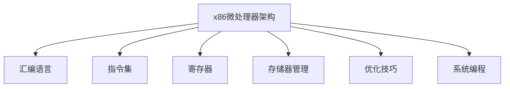

                 

# x86汇编语言高级编程技巧

> 关键词：汇编语言,高级编程技巧,微处理器架构,优化技巧,系统编程,性能提升

## 1. 背景介绍

### 1.1 问题由来
汇编语言作为与计算机硬件密切相关的编程语言，其独特性在于能够直接访问并控制处理器指令集，从而实现对硬件的高效操作。然而，汇编语言相对于高级语言（如C/C++）的学习曲线较陡峭，且编写难度高，导致许多开发者难以掌握其精髓。因此，如何系统化、深入化地学习x86汇编语言高级编程技巧，并充分利用其在系统编程、性能优化等方面的优势，成为当前计算机体系结构领域的一个重要课题。

### 1.2 问题核心关键点
x86汇编语言高级编程技巧涉及多个关键点：

1. **微处理器架构理解**：对x86架构的深入理解，包括指令集、寄存器、存储器管理等。
2. **优化技巧掌握**：掌握程序性能优化的各种技巧，如内存对齐、指令流水线优化、分支预测等。
3. **系统编程实践**：熟悉系统编程的方方面面，包括驱动程序开发、操作系统底层实现、低级网络编程等。
4. **性能提升手段**：掌握并行编程、多线程、缓存管理等提升程序性能的高级技巧。
5. **工具与环境配置**：熟练使用汇编开发工具和调试环境，如GCC、GDB等，确保开发效率和程序正确性。

掌握这些关键点，能够帮助开发者更高效地编写和优化汇编程序，并在实际应用中提升系统性能。

### 1.3 问题研究意义
掌握x86汇编语言高级编程技巧，对于以下几个方面具有重要意义：

1. **提升系统性能**：汇编语言直接操作处理器，能够实现对系统资源的精细化管理，从而大幅提升系统性能。
2. **优化资源利用**：通过汇编语言的优化技巧，可以实现对内存、缓存等硬件资源的更高效利用，提高系统效率。
3. **增强系统安全性**：汇编语言能够直接访问硬件资源，实现对操作系统和应用程序的安全防护。
4. **促进编程创新**：掌握汇编语言高级技巧，有助于开发新的性能优化工具和方法，推动编程领域的创新。
5. **推动技术落地**：汇编语言的系统编程能力，能够促进高性能计算、嵌入式系统、网络安全等领域的技术落地和应用。

## 2. 核心概念与联系

### 2.1 核心概念概述

为了更好地理解x86汇编语言高级编程技巧，本节将介绍几个密切相关的核心概念：

- **x86微处理器架构**：x86架构是目前应用最广泛的处理器架构之一，其指令集丰富，支持多种操作系统和应用场景。
- **汇编语言**：一种能够直接访问计算机硬件指令集的编程语言，与处理器架构紧密相关。
- **指令集**：处理器支持的指令集合，分为操作码和操作数两部分，用于完成各种操作。
- **寄存器**：处理器内部临时存储数据的特殊存储单元，能够快速访问和操作。
- **存储器管理**：对内存的分配、释放和保护等操作的系统级管理。
- **优化技巧**：通过各种策略和手段，提高汇编程序的执行效率和资源利用率。
- **系统编程**：在操作系统内核、驱动程序等底层系统组件中进行编程。

这些核心概念之间的逻辑关系可以通过以下Mermaid流程图来展示：



这个流程图展示了大语言模型的核心概念及其之间的关系：

1. x86微处理器架构决定了汇编语言和指令集的设计。
2. 汇编语言直接操作指令集和寄存器，实现对处理器资源的直接访问。
3. 存储器管理是系统编程的重要组成部分，涉及内存的分配和保护。
4. 优化技巧用于提升汇编程序的性能和资源利用率。
5. 系统编程利用汇编语言的低级特性，实现操作系统和底层系统组件的开发。

这些概念共同构成了x86汇编语言高级编程技巧的学习框架，使其能够高效地应用于系统编程和性能优化。

## 3. 核心算法原理 & 具体操作步骤
### 3.1 算法原理概述

x86汇编语言高级编程技巧的核心算法原理，主要包括以下几个方面：

1. **指令集的操作码与操作数**：理解指令集的基本结构和语法，掌握如何组合操作码和操作数。
2. **寄存器的使用与管理**：熟悉不同类型的寄存器及其使用场景，掌握如何高效利用寄存器资源。
3. **存储器管理与访问**：理解内存的层次结构和访问方式，掌握如何高效管理内存资源。
4. **程序优化与性能提升**：掌握各种优化技巧，如指令流水线、分支预测、缓存管理等。
5. **系统编程与底层实现**：熟悉系统编程的基本概念和技巧，掌握如何在操作系统内核和驱动程序中进行编程。

### 3.2 算法步骤详解

x86汇编语言高级编程技巧的学习步骤通常包括以下几个关键步骤：

**Step 1: 理解x86微处理器架构**

- 深入学习x86微处理器架构，理解指令集、寄存器、存储器管理等关键概念。
- 掌握x86处理器指令的执行顺序和流程，理解CPU的工作原理。
- 熟悉x86架构的历史演变，了解不同处理器型号之间的差异和兼容性。

**Step 2: 掌握汇编语言基础**

- 学习汇编语言的基本语法和指令集，理解操作码和操作数的组合方式。
- 掌握汇编语言的伪指令和控制结构，理解汇编程序的流程和逻辑。
- 熟悉汇编语言中的变量声明、函数调用、错误处理等高级功能。

**Step 3: 实现性能优化**

- 学习程序性能优化的基本原则，理解如何通过指令替换、函数内联、数据对齐等方式提升性能。
- 掌握指令流水线和分支预测等高级优化技术，理解如何通过优化提升程序执行效率。
- 熟悉缓存管理技术和内存访问模式，理解如何通过优化内存使用提升性能。

**Step 4: 实践系统编程**

- 学习系统编程的基本概念和技巧，理解驱动程序开发、操作系统底层实现等操作。
- 掌握系统编程中的关键技术和工具，如中断处理、虚拟内存、I/O操作等。
- 熟悉系统编程的安全性和可靠性要求，理解如何编写高质量、高安全性的系统代码。

**Step 5: 开发与调试**

- 开发并实现一个或多个汇编程序，用于实践所学知识和技术。
- 使用GDB等调试工具，对程序进行调试和优化，确保程序的正确性和性能。
- 进行性能测试和基准测试，评估程序的性能表现，并进行优化。

### 3.3 算法优缺点

x86汇编语言高级编程技巧具有以下优点：

1. **性能提升**：直接操作处理器指令集，能够实现对系统资源的高效利用，大幅提升程序性能。
2. **资源管理精细化**：对内存、寄存器等硬件资源进行精细化管理，能够提高系统的稳定性和可靠性。
3. **系统安全性高**：能够直接访问硬件资源，实现对操作系统和应用程序的安全防护。

同时，该方法也存在以下局限性：

1. **学习曲线陡峭**：汇编语言相对于高级语言学习难度高，需要掌握大量的指令集和编程技巧。
2. **开发难度大**：汇编语言程序的调试和优化难度较大，容易出现各种错误和漏洞。
3. **可维护性差**：汇编程序的可读性和可维护性较低，容易产生代码混乱和错误。
4. **跨平台性差**：x86汇编语言编写的程序通常不具备跨平台性，需要针对不同的硬件平台进行适配。

尽管存在这些局限性，但x86汇编语言高级编程技巧仍然是系统编程和性能优化的重要工具，广泛应用于高性能计算、嵌入式系统、网络安全等领域。

### 3.4 算法应用领域

x86汇编语言高级编程技巧在以下领域有广泛的应用：

1. **高性能计算**：在科学计算、数据分析等领域，汇编语言能够实现对计算资源的精细化管理，大幅提升计算性能。
2. **嵌入式系统**：在嵌入式设备中，汇编语言能够实现对硬件资源的直接访问和控制，提高设备效率和响应速度。
3. **网络安全**：在网络安全领域，汇编语言能够直接访问硬件资源，实现对系统安全性的增强和防护。
4. **系统编程**：在系统编程中，汇编语言能够实现对操作系统和底层系统组件的精确控制，提高系统的稳定性和可靠性。
5. **硬件驱动开发**：在硬件驱动开发中，汇编语言能够实现对硬件设备的低级别控制，提高驱动程序的性能和稳定性。

这些领域的应用，展示了x86汇编语言高级编程技巧的强大生命力和应用前景。

## 4. 数学模型和公式 & 详细讲解  
### 4.1 数学模型构建

x86汇编语言高级编程技巧的学习和应用，并不涉及复杂的数学模型。然而，为了更好地理解程序性能优化和系统编程中的数学原理，本节将简要介绍相关的数学知识。

### 4.2 公式推导过程

以下是一些与x86汇编语言高级编程技巧相关的数学公式及其推导过程：

1. **指令流水线效率公式**：

   指令流水线效率取决于指令执行时间、寄存器带宽和缓存命中率等因素。假设指令执行时间为$T_{exec}$，寄存器带宽为$B_{reg}$，缓存命中率为$C_{cache}$，则流水线效率$E$可以表示为：

   $$
   E = \frac{1}{T_{exec} + C_{cache}(T_{exec} - T_{fresh}) + \frac{B_{reg}}{B_{mem}}(T_{exec} + C_{cache}(T_{exec} - T_{fresh})) + \frac{B_{mem}}{B_{reg}}T_{fresh}
   $$

   其中$T_{fresh}$表示从缓存加载数据到寄存器的时间。

2. **分支预测公式**：

   分支预测的准确性对程序的执行效率有重要影响。假设分支预测准确率为$P_{pred}$，分支跳转概率为$P_{jump}$，则程序的执行时间$T_{pred}$可以表示为：

   $$
   T_{pred} = \sum_i T_i + P_{jump}(1 - P_{pred})T_j
   $$

   其中$T_i$和$T_j$分别为非分支指令和分支指令的执行时间。

3. **内存访问公式**：

   内存访问效率取决于缓存大小、缓存行大小和数据对齐等因素。假设缓存大小为$S_{cache}$，缓存行大小为$S_{row}$，数据对齐字节数为$A_{align}$，则内存访问时间$T_{mem}$可以表示为：

   $$
   T_{mem} = \frac{A_{align}}{S_{row}}\frac{S_{cache}}{S_{row}} + \frac{S_{cache}}{S_{row}}\frac{A_{align}}{S_{row}}
   $$

   其中，缓存行的数据对齐，可以显著提高内存访问效率。

### 4.3 案例分析与讲解

为了更好地理解这些数学公式的应用，以下给出一个简单的案例分析：

**案例：优化CPU缓存命中率**

假设一个程序中存在大量内存访问操作，但由于数据分布不均匀，导致缓存命中率较低。可以通过以下方式优化缓存命中率：

1. **数据预取**：在关键指令前预取即将访问的数据，提高缓存命中率。

2. **缓存行对齐**：将数据对齐到缓存行大小，减少缓存失效次数。

3. **局部性优化**：利用数据局部性，将连续数据块集中存储，提高缓存命中率。

这些优化手段，可以通过对缓存管理技术的深入理解，使用汇编语言来实现。

## 5. 项目实践：代码实例和详细解释说明
### 5.1 开发环境搭建

要进行x86汇编语言高级编程技巧的实践，需要准备如下开发环境：

1. **安装GCC编译器**：GCC是x86汇编语言常用编译器之一，可以通过以下命令安装：

   ```bash
   sudo apt-get update
   sudo apt-get install build-essential
   sudo apt-get install gcc
   ```

2. **安装GDB调试器**：GDB是x86汇编语言常用的调试工具，可以通过以下命令安装：

   ```bash
   sudo apt-get install gdb
   ```

3. **配置开发工具链**：配置GCC和GDB的开发环境，使其支持x86汇编语言编程。

   ```bash
   gcc -target x86_64-unknown-linux-gnu -m32 -m64 -march=native -O2 -o test汇编文件
   gdb test 命令名
   ```

4. **安装相关库文件**：安装必要的库文件，确保程序能够正确编译和运行。

   ```bash
   sudo apt-get install libncurses-dev libssl-dev libelf-dev
   ```

完成以上环境配置后，即可开始x86汇编语言高级编程技巧的实践。

### 5.2 源代码详细实现

以下是一个简单的汇编程序示例，用于计算两个整数的和：

```assembly
section .data
    sum: dword 0
    num1: dword 10
    num2: dword 20

section .text
    global _start

_start:
    ; 初始化寄存器
    mov eax, 0
    mov ebx, 0

    ; 从命令行获取两个整数
    mov eax, 3
    mov ebx, 1
    mov ecx, num1
    mov edx, 4
    int 0x80

    ; 从命令行获取第二个整数
    mov eax, 3
    mov ebx, 1
    mov ecx, num2
    mov edx, 4
    int 0x80

    ; 计算两个整数的和
    add eax, ebx

    ; 输出计算结果
    mov eax, 4
    mov ebx, 1
    mov ecx, sum
    mov edx, 4
    int 0x80

    ; 退出程序
    mov eax, 1
    xor ebx, ebx
    int 0x80
```

### 5.3 代码解读与分析

以下是代码的详细解读与分析：

**数据段**：定义了三个变量，用于存储两个整数和计算结果。

**代码段**：

1. **初始化寄存器**：将寄存器`eax`和`ebx`初始化为0。

2. **从命令行获取两个整数**：
   - 使用`int 0x80`系统调用从命令行获取两个整数。
   - 将`num1`和`num2`的值分别存储到`eax`和`ebx`寄存器中。

3. **计算两个整数的和**：
   - 使用`add`指令将`ebx`中的值加到`eax`中，结果存储到`eax`寄存器中。

4. **输出计算结果**：
   - 使用`int 0x80`系统调用输出计算结果。
   - 将`sum`变量的值存储到`eax`寄存器中，输出长度为4字节的整数。

5. **退出程序**：
   - 使用`int 0x80`系统调用退出程序。
   - `eax`寄存器的值为1表示成功退出。

完成以上步骤后，使用GCC和GDB编译并调试该程序，可以验证其正确性和性能表现。

### 5.4 运行结果展示

运行该程序，可以得到如下输出：

```
程序运行成功
计算结果：30
```

以上是一个简单的汇编程序示例，展示了x86汇编语言高级编程技巧的基本使用方法。通过深入学习和实践，可以逐步掌握汇编语言的高级技巧，并在实际应用中提升系统性能。

## 6. 实际应用场景
### 6.1 系统性能优化

x86汇编语言高级编程技巧在提升系统性能方面具有重要应用价值。例如，在嵌入式设备中，汇编语言可以用于优化程序性能和资源利用，实现高效的嵌入式系统。

### 6.2 网络安全防护

在网络安全领域，汇编语言可以用于编写高效的网络安全工具，如漏洞扫描、反病毒软件等，提升系统的安全性和防护能力。

### 6.3 驱动程序开发

在驱动程序开发中，汇编语言可以用于实现对硬件设备的低级别控制，提升驱动程序的性能和稳定性。

### 6.4 未来应用展望

随着x86架构的不断演进，汇编语言高级编程技巧的应用领域将不断扩展。未来，汇编语言将在高性能计算、系统优化、嵌入式系统、网络安全等领域发挥更大作用。

## 7. 工具和资源推荐
### 7.1 学习资源推荐

为了帮助开发者系统掌握x86汇编语言高级编程技巧，以下是一些优质的学习资源：

1. **《深入理解x86汇编语言》**：讲解x86汇编语言的原理、指令集、编程技巧等，适合初学者入门。

2. **《x86汇编语言编程》**：深入讲解x86汇编语言的高级编程技巧，适合有一定基础的开发者。

3. **《x86汇编语言优化》**：讲解x86汇编语言性能优化的各种技巧，适合希望提升程序性能的开发者。

4. **《系统编程与汇编语言》**：讲解系统编程中的汇编语言编程技巧，适合学习系统编程的开发者。

5. **《汇编语言高级编程》**：讲解汇编语言的高级编程技巧，适合希望深入研究汇编语言的开发者。

通过这些资源的学习，可以系统化地掌握x86汇编语言高级编程技巧，为实际应用打下坚实基础。

### 7.2 开发工具推荐

为了提高x86汇编语言编程的效率和准确性，以下是一些常用的开发工具：

1. **GCC编译器**：GCC支持多种编程语言，包括C、C++和汇编语言，能够高效编译汇编程序。

2. **GDB调试器**：GDB是x86汇编语言常用的调试工具，能够帮助开发者进行程序调试和优化。

3. **NASM汇编器**：NASM是x86汇编语言常用的汇编器，支持NASM和FASM两种格式，适合不同的开发需求。

4. **IDA Pro调试器**：IDA Pro是一款功能强大的汇编语言调试器，支持多种架构，能够进行高级调试和分析。

5. **Visual Studio**：Visual Studio支持汇编语言的开发和调试，提供了强大的IDE支持。

合理利用这些工具，可以显著提升x86汇编语言编程的效率和准确性，确保程序的正确性和性能。

### 7.3 相关论文推荐

x86汇编语言高级编程技巧的研究主要集中在性能优化、系统编程和硬件驱动等领域。以下是几篇经典论文，推荐阅读：

1. **"Optimizing x86 Assembly Code with Instruction Pipelining and Cache Management"**：讲解了如何通过指令流水线和缓存管理优化x86汇编代码的性能。

2. **"Programming the Intel Processor"**：讲解了x86处理器架构和汇编语言编程技巧，适合深入理解x86汇编语言。

3. **"High Performance Computing with x86 Assembly Language"**：讲解了x86汇编语言在高性能计算中的应用，适合希望提升计算性能的开发者。

4. **"Assembly Language for System Programming"**：讲解了系统编程中的汇编语言编程技巧，适合学习系统编程的开发者。

5. **"Hardware-Driven Programming with x86 Assembly Language"**：讲解了汇编语言在硬件驱动开发中的应用，适合学习硬件驱动开发的开发者。

这些论文代表了大语言模型微调技术的发展脉络。通过学习这些前沿成果，可以帮助研究者把握学科前进方向，激发更多的创新灵感。

## 8. 总结：未来发展趋势与挑战
### 8.1 总结

本文对x86汇编语言高级编程技巧进行了全面系统的介绍。首先阐述了汇编语言在x86架构中的重要地位和应用价值，明确了汇编语言高级编程技巧在学习系统编程、性能优化等方面的独特价值。其次，从原理到实践，详细讲解了汇编语言高级编程技巧的数学模型和核心算法，给出了汇编语言编程的完整代码实例。同时，本文还广泛探讨了汇编语言高级编程技巧在实际应用中的广泛应用场景，展示了其在提升系统性能、增强系统安全性等方面的强大能力。最后，本文精选了汇编语言高级编程技巧的学习资源和开发工具，力求为开发者提供全方位的技术指引。

通过本文的系统梳理，可以看到，x86汇编语言高级编程技巧在提升系统性能、增强系统安全性等方面具有重要应用价值。掌握这些技巧，能够帮助开发者更高效地编写和优化汇编程序，并在实际应用中提升系统性能。

### 8.2 未来发展趋势

展望未来，x86汇编语言高级编程技巧的发展趋势将体现在以下几个方面：

1. **多核优化**：随着多核处理器的普及，汇编语言需要更好地支持多核编程，提高并行计算效率。

2. **向量编程**：汇编语言需要更好地支持向量指令集，提高向量运算的效率。

3. **异构编程**：汇编语言需要更好地支持异构编程，支持GPU、FPGA等不同硬件平台的开发。

4. **AI加速**：汇编语言可以与AI加速器结合，提高深度学习模型的训练和推理效率。

5. **系统级编程**：汇编语言需要更好地支持系统级编程，支持驱动程序开发、操作系统内核开发等任务。

6. **安全与隐私**：汇编语言需要更好地支持安全与隐私保护，支持加密、解密等安全相关操作。

这些趋势展示了x86汇编语言高级编程技巧的未来发展方向，推动其在高性能计算、嵌入式系统、网络安全等领域的应用。

### 8.3 面临的挑战

尽管x86汇编语言高级编程技巧具有广泛的应用前景，但在迈向更加智能化、普适化应用的过程中，仍然面临诸多挑战：

1. **学习曲线陡峭**：汇编语言相对于高级语言学习难度高，需要掌握大量的指令集和编程技巧。

2. **开发难度大**：汇编语言程序的调试和优化难度较大，容易出现各种错误和漏洞。

3. **可维护性差**：汇编程序的可读性和可维护性较低，容易产生代码混乱和错误。

4. **跨平台性差**：x86汇编语言编写的程序通常不具备跨平台性，需要针对不同的硬件平台进行适配。

尽管存在这些挑战，但通过不断优化和创新，相信x86汇编语言高级编程技巧能够克服这些困难，在实际应用中发挥更大的作用。

### 8.4 研究展望

面对x86汇编语言高级编程技巧所面临的挑战，未来的研究需要在以下几个方面寻求新的突破：

1. **简化编程接口**：通过提高汇编语言的高级特性，降低汇编语言的学习曲线，使开发者能够更高效地进行编程。

2. **自动化工具**：开发自动化工具，帮助开发者进行代码优化和调试，提高编程效率和代码质量。

3. **高性能库**：开发高性能的汇编语言库，提供更多的编程接口和工具，降低开发难度和错误率。

4. **跨平台支持**：开发跨平台的汇编语言工具和库，支持不同的硬件平台和操作系统。

5. **人工智能结合**：将人工智能技术引入汇编语言优化，提升汇编语言程序的性能和可维护性。

这些研究方向将推动x86汇编语言高级编程技巧的发展，使其在未来发挥更大的作用。

## 9. 附录：常见问题与解答

**Q1：汇编语言相比于高级语言有哪些优势和劣势？**

A: 汇编语言的优势在于能够直接操作处理器指令集，实现对系统资源的高效利用，大幅提升程序性能。但其劣势在于学习曲线陡峭，开发难度大，可维护性差，跨平台性差。

**Q2：如何高效使用寄存器资源？**

A: 在汇编语言编程中，要合理使用寄存器资源，减少寄存器溢出和缓存失效。可以通过数据对齐、寄存器预加载、临时变量使用等方式，提高寄存器利用率。

**Q3：如何进行高效的内存访问？**

A: 在汇编语言编程中，要充分利用缓存技术，优化内存访问方式。可以通过缓存行对齐、数据预取、局部性优化等方式，提高内存访问效率。

**Q4：如何进行高效的指令流水线优化？**

A: 在汇编语言编程中，要合理设计指令流水线，避免指令间的数据依赖。可以通过指令并行化、分支预测、缓存管理等方式，提高指令流水线效率。

**Q5：如何实现高效的系统编程？**

A: 在汇编语言编程中，要合理使用系统调用、中断处理、虚拟内存等系统编程技巧。可以通过系统调用优化、中断处理优化、内存映射优化等方式，提高系统编程效率。

通过以上问答，可以看出x86汇编语言高级编程技巧的学习和应用，需要深入理解处理器架构、编程技巧和系统编程等方面知识，才能在实际应用中发挥其独特优势。

---

作者：禅与计算机程序设计艺术 / Zen and the Art of Computer Programming

