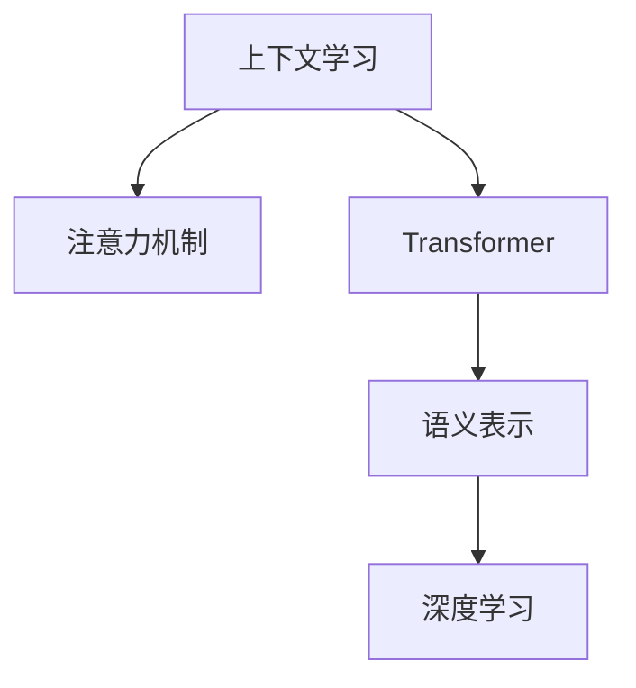

                 

# 上下文学习与思维链能力

> 关键词：上下文学习, 思维链能力, 注意力机制, Transformer, 语义表示, 深度学习, 自然语言处理(NLP), 认知心理学

## 1. 背景介绍

### 1.1 问题由来

随着深度学习技术的飞速发展，自然语言处理（NLP）领域取得了显著的进展，尤其是在机器翻译、文本分类、问答系统等任务上。然而，这些模型常常被指责为“黑盒”模型，缺乏对语言含义的理解。为了解决这个问题，研究者们提出了上下文学习的概念，希望构建能够理解句子含义的模型，从而提升自然语言处理的性能。

上下文学习（Contextual Learning）指的是在处理自然语言时，不仅要考虑当前单词的含义，还要考虑前后的上下文信息。传统的词袋模型（Bag of Words, BoW）或统计语言模型只考虑单词的频率或邻接关系，忽略了上下文信息的重要性。上下文学习则通过引入注意力机制（Attention Mechanism），在处理文本时能够捕捉到上下文信息，提升了模型的性能。

### 1.2 问题核心关键点

上下文学习与思维链能力（Thought Chain Capability）的核心关键点包括：
- 注意力机制：在处理文本时，通过引入注意力机制，模型能够关注与当前单词相关的上下文信息，提升了模型的理解能力。
- 语义表示：上下文学习关注于语义表示，即如何通过模型表示单词和句子的语义关系，而不仅仅是单词的词频或邻接关系。
- 认知心理学：上下文学习受到认知心理学中“思维链”概念的启发，希望构建能够理解句子含义的模型，从而提升自然语言处理的性能。

这些关键点共同构成了上下文学习与思维链能力的理论基础，使得自然语言处理模型在处理文本时能够更好地理解上下文信息，从而提升了模型的性能和应用效果。

### 1.3 问题研究意义

研究上下文学习与思维链能力，对于拓展自然语言处理（NLP）的应用范围，提升模型的性能和可解释性，具有重要意义：

1. **提升模型性能**：上下文学习能够帮助模型更好地理解文本的含义，从而提升自然语言处理任务的性能，如文本分类、情感分析、问答系统等。
2. **增强可解释性**：通过上下文学习，模型能够理解句子中的上下文信息，从而提升模型的可解释性，帮助理解模型的推理过程。
3. **适应性强**：上下文学习能够适应不同领域的自然语言处理任务，如金融、法律、医疗等，提升了模型在不同领域的应用效果。
4. **降低开发成本**：上下文学习能够帮助开发人员快速构建高性能的NLP模型，降低了开发成本，加速了NLP技术的产业化进程。
5. **促进技术创新**：上下文学习引发了自然语言处理领域的诸多创新，如Transformer、BERT等模型，推动了NLP技术的不断进步。

## 2. 核心概念与联系

### 2.1 核心概念概述

为了更好地理解上下文学习与思维链能力的概念，本节将介绍几个密切相关的核心概念：

- **上下文学习**：指的是在处理自然语言时，不仅要考虑当前单词的含义，还要考虑前后的上下文信息。
- **注意力机制**：在处理文本时，通过引入注意力机制，模型能够关注与当前单词相关的上下文信息，提升了模型的理解能力。
- **Transformer**：一种基于自注意力机制的深度学习模型，广泛应用于自然语言处理任务中。
- **语义表示**：关注于如何通过模型表示单词和句子的语义关系，而不仅仅是单词的词频或邻接关系。
- **深度学习**：一种通过构建神经网络模型，从数据中学习并提取特征的机器学习方法。

这些核心概念之间的逻辑关系可以通过以下Mermaid流程图来展示：



这个流程图展示了大语言模型中上下文学习与思维链能力的基本框架：

1. 上下文学习通过注意力机制，使得模型能够关注与当前单词相关的上下文信息。
2. Transformer模型基于自注意力机制，提升了模型的理解能力。
3. 语义表示关注于如何通过模型表示单词和句子的语义关系，而不仅仅是单词的词频或邻接关系。
4. 深度学习通过构建神经网络模型，从数据中学习并提取特征。

这些概念共同构成了大语言模型中上下文学习与思维链能力的学习框架，使得自然语言处理模型在处理文本时能够更好地理解上下文信息，从而提升了模型的性能和应用效果。

## 3. 核心算法原理 & 具体操作步骤
### 3.1 算法原理概述

上下文学习与思维链能力的核心算法是Transformer模型，它通过引入自注意力机制（Self-Attention Mechanism），使得模型能够关注与当前单词相关的上下文信息，提升了模型的理解能力。

Transformer模型的核心思想是将输入序列的每个单词表示为向量形式，然后通过自注意力机制，对所有单词的向量进行加权求和，从而得到每个单词的上下文表示。具体来说，Transformer模型由编码器（Encoder）和解码器（Decoder）两部分组成，编码器用于将输入序列转换为上下文表示，解码器用于生成输出序列。

### 3.2 算法步骤详解

Transformer模型的训练过程可以分为以下几个步骤：

1. **数据准备**：将输入序列和输出序列转换为模型所需的向量形式，并对输入序列进行分批处理。
2. **编码器处理**：通过多层的编码器，对输入序列的每个单词进行上下文表示的计算。每个编码器的输入是一个包含所有单词的向量序列，输出是一个上下文表示向量。
3. **解码器处理**：通过多层的解码器，对上下文表示进行生成输出序列的计算。每个解码器的输入是一个上下文表示向量，输出是一个生成的单词向量。
4. **损失计算**：通过计算模型输出的单词向量与真实输出之间的损失函数，反向传播更新模型参数。

具体来说，Transformer模型的训练过程可以通过以下代码实现：

```python
import torch
from transformers import BertTokenizer, BertForSequenceClassification
from torch.utils.data import DataLoader
from torch.nn import CrossEntropyLoss
from tqdm import tqdm

# 加载预训练模型和分词器
model = BertForSequenceClassification.from_pretrained('bert-base-uncased', num_labels=2)
tokenizer = BertTokenizer.from_pretrained('bert-base-uncased')

# 准备训练数据
train_dataset = ...
train_loader = DataLoader(train_dataset, batch_size=32)

# 定义损失函数和优化器
criterion = CrossEntropyLoss()
optimizer = AdamW(model.parameters(), lr=2e-5)

# 训练过程
for epoch in range(10):
    for batch in tqdm(train_loader):
        inputs, labels = batch
        outputs = model(inputs)
        loss = criterion(outputs, labels)
        optimizer.zero_grad()
        loss.backward()
        optimizer.step()
```

### 3.3 算法优缺点

Transformer模型具有以下优点：
1. 能够捕捉上下文信息：Transformer模型通过自注意力机制，能够关注与当前单词相关的上下文信息，提升了模型的理解能力。
2. 能够处理长序列：Transformer模型能够处理较长的输入序列，不会因序列长度过长而丢失信息。
3. 计算效率高：Transformer模型采用了并行计算的方式，能够在GPU上快速训练和推理。

同时，Transformer模型也存在一些缺点：
1. 需要大量的计算资源：Transformer模型参数量较大，训练和推理需要大量的计算资源。
2. 训练时间长：Transformer模型训练时间较长，需要大量的计算资源。
3. 存在信息丢失风险：由于模型通过自注意力机制处理上下文信息，存在信息丢失的风险。

### 3.4 算法应用领域

Transformer模型在自然语言处理领域得到了广泛的应用，包括文本分类、情感分析、机器翻译、问答系统等任务。

具体来说，Transformer模型可以用于以下应用场景：
1. **文本分类**：将输入文本分为不同的类别，如新闻分类、情感分类等。
2. **情感分析**：对输入文本进行情感分类，如正面、负面、中性等。
3. **机器翻译**：将输入文本从一种语言翻译成另一种语言。
4. **问答系统**：对输入问题进行回答，如智能客服、智能助手等。

除了上述这些经典任务外，Transformer模型还被创新性地应用到更多场景中，如文本摘要、文本生成、知识图谱构建等，为自然语言处理技术带来了新的突破。

## 4. 数学模型和公式 & 详细讲解 & 举例说明

### 4.1 数学模型构建

Transformer模型通过引入自注意力机制，使得模型能够关注与当前单词相关的上下文信息。模型的核心数学公式为：

$$
H = \mathrm{Attention}(Q, K, V)
$$

其中，$Q$、$K$、$V$分别代表查询、键、值矩阵，$\mathrm{Attention}$表示注意力机制的计算过程。

注意力机制的计算过程可以分为三个步骤：
1. **计算注意力得分**：通过计算查询向量与键向量之间的相似度，得到每个单词的注意力得分。
2. **归一化注意力得分**：将注意力得分进行归一化处理，得到每个单词的注意力权重。
3. **计算上下文表示**：将注意力权重与值向量进行加权求和，得到每个单词的上下文表示。

Transformer模型的计算过程可以总结为以下步骤：
1. **编码器**：通过多层编码器，对输入序列的每个单词进行上下文表示的计算。
2. **解码器**：通过多层解码器，对上下文表示进行生成输出序列的计算。

### 4.2 公式推导过程

以Bert模型为例，Transformer模型的注意力机制的计算过程可以总结为以下步骤：

1. **计算查询向量**：
   $$
   Q = XW_Q + b_Q
   $$
   其中，$X$表示输入向量，$W_Q$表示查询矩阵，$b_Q$表示偏置向量。

2. **计算键向量**：
   $$
   K = XW_K + b_K
   $$

3. **计算值向量**：
   $$
   V = XW_V + b_V
   $$

4. **计算注意力得分**：
   $$
   \mathrm{Attention}(Q, K, V) = \mathrm{softmax}(QK^T)
   $$

5. **计算上下文表示**：
   $$
   H = \mathrm{Attention}(Q, K, V)V
   $$

通过以上步骤，Transformer模型能够对输入序列进行上下文表示的计算，并生成输出序列。

### 4.3 案例分析与讲解

以Bert模型为例，以下是Transformer模型在文本分类任务中的实现：

```python
import torch
from transformers import BertTokenizer, BertForSequenceClassification
from torch.utils.data import DataLoader
from torch.nn import CrossEntropyLoss
from tqdm import tqdm

# 加载预训练模型和分词器
model = BertForSequenceClassification.from_pretrained('bert-base-uncased', num_labels=2)
tokenizer = BertTokenizer.from_pretrained('bert-base-uncased')

# 准备训练数据
train_dataset = ...
train_loader = DataLoader(train_dataset, batch_size=32)

# 定义损失函数和优化器
criterion = CrossEntropyLoss()
optimizer = AdamW(model.parameters(), lr=2e-5)

# 训练过程
for epoch in range(10):
    for batch in tqdm(train_loader):
        inputs, labels = batch
        outputs = model(inputs)
        loss = criterion(outputs, labels)
        optimizer.zero_grad()
        loss.backward()
        optimizer.step()
```

通过以上代码，我们可以看到，Transformer模型在文本分类任务中的实现过程非常简单。首先，加载预训练模型和分词器，然后准备训练数据和损失函数，最后通过训练过程进行模型参数的更新。

## 5. 项目实践：代码实例和详细解释说明

### 5.1 开发环境搭建

在进行Transformer模型微调之前，我们需要准备好开发环境。以下是使用Python进行PyTorch开发的环境配置流程：

1. 安装Anaconda：从官网下载并安装Anaconda，用于创建独立的Python环境。

2. 创建并激活虚拟环境：
```bash
conda create -n pytorch-env python=3.8 
conda activate pytorch-env
```

3. 安装PyTorch：根据CUDA版本，从官网获取对应的安装命令。例如：
```bash
conda install pytorch torchvision torchaudio cudatoolkit=11.1 -c pytorch -c conda-forge
```

4. 安装Transformers库：
```bash
pip install transformers
```

5. 安装各类工具包：
```bash
pip install numpy pandas scikit-learn matplotlib tqdm jupyter notebook ipython
```

完成上述步骤后，即可在`pytorch-env`环境中开始Transformer模型的微调实践。

### 5.2 源代码详细实现

以下是在情感分类任务中，使用Transformer模型进行微调的PyTorch代码实现：

```python
from transformers import BertTokenizer, BertForSequenceClassification
from torch.utils.data import DataLoader
from torch.nn import CrossEntropyLoss
from tqdm import tqdm

# 加载预训练模型和分词器
model = BertForSequenceClassification.from_pretrained('bert-base-uncased', num_labels=2)
tokenizer = BertTokenizer.from_pretrained('bert-base-uncased')

# 准备训练数据
train_dataset = ...
train_loader = DataLoader(train_dataset, batch_size=32)

# 定义损失函数和优化器
criterion = CrossEntropyLoss()
optimizer = AdamW(model.parameters(), lr=2e-5)

# 训练过程
for epoch in range(10):
    for batch in tqdm(train_loader):
        inputs, labels = batch
        outputs = model(inputs)
        loss = criterion(outputs, labels)
        optimizer.zero_grad()
        loss.backward()
        optimizer.step()
```

### 5.3 代码解读与分析

让我们再详细解读一下关键代码的实现细节：

**BERT模型加载**：
- `BertForSequenceClassification.from_pretrained('bert-base-uncased', num_labels=2)`：加载预训练的BERT模型，并设置标签数为2，即二分类任务。
- `BertTokenizer.from_pretrained('bert-base-uncased')`：加载BERT分词器。

**训练数据准备**：
- 需要准备训练数据，包括文本和标签，并使用`DataLoader`进行批处理。

**损失函数和优化器**：
- `CrossEntropyLoss()`：定义交叉熵损失函数。
- `AdamW(model.parameters(), lr=2e-5)`：定义优化器，设置学习率为2e-5。

**训练过程**：
- 在每个epoch内，对每个批次的输入和标签进行前向传播和反向传播，计算损失函数并更新模型参数。

## 6. 实际应用场景

### 6.1 智能客服系统

基于Transformer模型的上下文学习，可以广泛应用于智能客服系统的构建。传统客服往往需要配备大量人力，高峰期响应缓慢，且一致性和专业性难以保证。而使用Transformer模型，可以7x24小时不间断服务，快速响应客户咨询，用自然流畅的语言解答各类常见问题。

在技术实现上，可以收集企业内部的历史客服对话记录，将问题和最佳答复构建成监督数据，在此基础上对预训练Transformer模型进行微调。微调后的模型能够自动理解用户意图，匹配最合适的答复模板进行回复。对于客户提出的新问题，还可以接入检索系统实时搜索相关内容，动态组织生成回答。如此构建的智能客服系统，能大幅提升客户咨询体验和问题解决效率。

### 6.2 金融舆情监测

金融机构需要实时监测市场舆论动向，以便及时应对负面信息传播，规避金融风险。传统的人工监测方式成本高、效率低，难以应对网络时代海量信息爆发的挑战。基于Transformer模型的上下文学习，为金融舆情监测提供了新的解决方案。

具体而言，可以收集金融领域相关的新闻、报道、评论等文本数据，并对其进行主题标注和情感标注。在此基础上对预训练Transformer模型进行微调，使其能够自动判断文本属于何种主题，情感倾向是正面、中性还是负面。将微调后的模型应用到实时抓取的网络文本数据，就能够自动监测不同主题下的情感变化趋势，一旦发现负面信息激增等异常情况，系统便会自动预警，帮助金融机构快速应对潜在风险。

### 6.3 个性化推荐系统

当前的推荐系统往往只依赖用户的历史行为数据进行物品推荐，无法深入理解用户的真实兴趣偏好。基于Transformer模型的上下文学习，个性化推荐系统可以更好地挖掘用户行为背后的语义信息，从而提供更精准、多样的推荐内容。

在实践中，可以收集用户浏览、点击、评论、分享等行为数据，提取和用户交互的物品标题、描述、标签等文本内容。将文本内容作为模型输入，用户的后续行为（如是否点击、购买等）作为监督信号，在此基础上微调Transformer模型。微调后的模型能够从文本内容中准确把握用户的兴趣点。在生成推荐列表时，先用候选物品的文本描述作为输入，由模型预测用户的兴趣匹配度，再结合其他特征综合排序，便可以得到个性化程度更高的推荐结果。

### 6.4 未来应用展望

随着Transformer模型的不断发展，上下文学习在更多领域得到应用，为传统行业带来变革性影响。

在智慧医疗领域，基于Transformer模型的上下文学习，可以用于构建智能问答系统、病历分析、药物研发等应用，提升医疗服务的智能化水平，辅助医生诊疗，加速新药开发进程。

在智能教育领域，上下文学习可应用于作业批改、学情分析、知识推荐等方面，因材施教，促进教育公平，提高教学质量。

在智慧城市治理中，上下文学习可以用于城市事件监测、舆情分析、应急指挥等环节，提高城市管理的自动化和智能化水平，构建更安全、高效的未来城市。

此外，在企业生产、社会治理、文娱传媒等众多领域，基于Transformer模型的上下文学习的应用也将不断涌现，为NLP技术带来新的突破。相信随着模型的持续演进和微调技术的不断优化，上下文学习在自然语言处理领域将发挥更大的作用。

## 7. 工具和资源推荐
### 7.1 学习资源推荐

为了帮助开发者系统掌握Transformer模型的理论基础和实践技巧，这里推荐一些优质的学习资源：

1. 《Transformer from Scratch》系列博文：由大模型技术专家撰写，深入浅出地介绍了Transformer模型的原理和实现。

2. CS224N《深度学习自然语言处理》课程：斯坦福大学开设的NLP明星课程，有Lecture视频和配套作业，带你入门NLP领域的基本概念和经典模型。

3. 《Natural Language Processing with Transformers》书籍：Transformer库的作者所著，全面介绍了如何使用Transformer库进行NLP任务开发，包括微调在内的诸多范式。

4. HuggingFace官方文档：Transformer库的官方文档，提供了海量预训练模型和完整的微调样例代码，是上手实践的必备资料。

5. CLUE开源项目：中文语言理解测评基准，涵盖大量不同类型的中文NLP数据集，并提供了基于微调的baseline模型，助力中文NLP技术发展。

通过对这些资源的学习实践，相信你一定能够快速掌握Transformer模型的精髓，并用于解决实际的NLP问题。

### 7.2 开发工具推荐

高效的开发离不开优秀的工具支持。以下是几款用于Transformer模型微调开发的常用工具：

1. PyTorch：基于Python的开源深度学习框架，灵活动态的计算图，适合快速迭代研究。大部分预训练语言模型都有PyTorch版本的实现。

2. TensorFlow：由Google主导开发的开源深度学习框架，生产部署方便，适合大规模工程应用。同样有丰富的预训练语言模型资源。

3. Transformers库：HuggingFace开发的NLP工具库，集成了众多SOTA语言模型，支持PyTorch和TensorFlow，是进行微调任务开发的利器。

4. Weights & Biases：模型训练的实验跟踪工具，可以记录和可视化模型训练过程中的各项指标，方便对比和调优。与主流深度学习框架无缝集成。

5. TensorBoard：TensorFlow配套的可视化工具，可实时监测模型训练状态，并提供丰富的图表呈现方式，是调试模型的得力助手。

6. Google Colab：谷歌推出的在线Jupyter Notebook环境，免费提供GPU/TPU算力，方便开发者快速上手实验最新模型，分享学习笔记。

合理利用这些工具，可以显著提升Transformer模型微调的开发效率，加快创新迭代的步伐。

### 7.3 相关论文推荐

Transformer模型的发展源于学界的持续研究。以下是几篇奠基性的相关论文，推荐阅读：

1. Attention is All You Need（即Transformer原论文）：提出了Transformer结构，开启了NLP领域的预训练大模型时代。

2. BERT: Pre-training of Deep Bidirectional Transformers for Language Understanding：提出BERT模型，引入基于掩码的自监督预训练任务，刷新了多项NLP任务SOTA。

3. Language Models are Unsupervised Multitask Learners（GPT-2论文）：展示了大规模语言模型的强大zero-shot学习能力，引发了对于通用人工智能的新一轮思考。

4. Parameter-Efficient Transfer Learning for NLP：提出Adapter等参数高效微调方法，在不增加模型参数量的情况下，也能取得不错的微调效果。

5. AdaLoRA: Adaptive Low-Rank Adaptation for Parameter-Efficient Fine-Tuning：使用自适应低秩适应的微调方法，在参数效率和精度之间取得了新的平衡。

这些论文代表了大语言模型微调技术的发展脉络。通过学习这些前沿成果，可以帮助研究者把握学科前进方向，激发更多的创新灵感。

## 8. 总结：未来发展趋势与挑战

### 8.1 总结

本文对基于Transformer模型的上下文学习与思维链能力进行了全面系统的介绍。首先阐述了上下文学习与思维链能力的研究背景和意义，明确了Transformer模型在自然语言处理中的应用价值。其次，从原理到实践，详细讲解了Transformer模型的数学原理和关键步骤，给出了微调任务开发的完整代码实例。同时，本文还广泛探讨了Transformer模型在智能客服、金融舆情、个性化推荐等多个行业领域的应用前景，展示了Transformer模型的巨大潜力。此外，本文精选了微调技术的各类学习资源，力求为读者提供全方位的技术指引。

通过本文的系统梳理，可以看到，基于Transformer模型的上下文学习与思维链能力正在成为自然语言处理的重要范式，极大地拓展了预训练语言模型的应用边界，催生了更多的落地场景。受益于大规模语料的预训练，上下文学习与思维链能力的模型在处理文本时能够更好地理解上下文信息，从而提升了模型的性能和应用效果。未来，伴随Transformer模型的持续演进和微调技术的不断优化，上下文学习与思维链能力必将在自然语言处理领域发挥更大的作用。

### 8.2 未来发展趋势

展望未来，Transformer模型上下文学习与思维链能力的发展将呈现以下几个趋势：

1. 模型规模持续增大。随着算力成本的下降和数据规模的扩张，Transformer模型参数量还将持续增长。超大规模语言模型蕴含的丰富语言知识，有望支撑更加复杂多变的下游任务微调。

2. 微调方法日趋多样。除了传统的全参数微调外，未来会涌现更多参数高效的微调方法，如Adapter、LoRA等，在节省计算资源的同时也能保证微调精度。

3. 持续学习成为常态。随着数据分布的不断变化，微调模型也需要持续学习新知识以保持性能。如何在不遗忘原有知识的同时，高效吸收新样本信息，将成为重要的研究课题。

4. 标注样本需求降低。受启发于提示学习(Prompt-based Learning)的思路，未来的微调方法将更好地利用Transformer模型的语言理解能力，通过更加巧妙的任务描述，在更少的标注样本上也能实现理想的微调效果。

5. 多模态微调崛起。当前的微调主要聚焦于纯文本数据，未来会进一步拓展到图像、视频、语音等多模态数据微调。多模态信息的融合，将显著提升语言模型对现实世界的理解和建模能力。

6. 模型通用性增强。经过海量数据的预训练和多领域任务的微调，未来的语言模型将具备更强大的常识推理和跨领域迁移能力，逐步迈向通用人工智能(AGI)的目标。

以上趋势凸显了Transformer模型上下文学习与思维链能力的发展前景。这些方向的探索发展，必将进一步提升自然语言处理系统的性能和应用范围，为人类认知智能的进化带来深远影响。

### 8.3 面临的挑战

尽管Transformer模型上下文学习与思维链能力已经取得了显著进展，但在迈向更加智能化、普适化应用的过程中，它仍面临诸多挑战：

1. 标注成本瓶颈。虽然微调方法可以显著降低标注数据的需求，但对于长尾应用场景，难以获得充足的高质量标注数据，成为制约微调性能的瓶颈。如何进一步降低微调对标注样本的依赖，将是一大难题。

2. 模型鲁棒性不足。当前微调模型面对域外数据时，泛化性能往往大打折扣。对于测试样本的微小扰动，微调模型的预测也容易发生波动。如何提高微调模型的鲁棒性，避免灾难性遗忘，还需要更多理论和实践的积累。

3. 推理效率有待提高。大规模语言模型虽然精度高，但在实际部署时往往面临推理速度慢、内存占用大等效率问题。如何在保证性能的同时，简化模型结构，提升推理速度，优化资源占用，将是重要的优化方向。

4. 可解释性亟需加强。当前微调模型更像是"黑盒"系统，难以解释其内部工作机制和决策逻辑。对于医疗、金融等高风险应用，算法的可解释性和可审计性尤为重要。如何赋予微调模型更强的可解释性，将是亟待攻克的难题。

5. 安全性有待保障。预训练语言模型难免会学习到有偏见、有害的信息，通过微调传递到下游任务，产生误导性、歧视性的输出，给实际应用带来安全隐患。如何从数据和算法层面消除模型偏见，避免恶意用途，确保输出的安全性，也将是重要的研究课题。

6. 知识整合能力不足。现有的微调模型往往局限于任务内数据，难以灵活吸收和运用更广泛的先验知识。如何让微调过程更好地与外部知识库、规则库等专家知识结合，形成更加全面、准确的信息整合能力，还有很大的想象空间。

正视微调面临的这些挑战，积极应对并寻求突破，将是大语言模型微调走向成熟的必由之路。相信随着学界和产业界的共同努力，这些挑战终将一一被克服，Transformer模型上下文学习与思维链能力必将在构建人机协同的智能时代中扮演越来越重要的角色。

### 8.4 研究展望

面对Transformer模型上下文学习与思维链能力所面临的种种挑战，未来的研究需要在以下几个方面寻求新的突破：

1. 探索无监督和半监督微调方法。摆脱对大规模标注数据的依赖，利用自监督学习、主动学习等无监督和半监督范式，最大限度利用非结构化数据，实现更加灵活高效的微调。

2. 研究参数高效和计算高效的微调范式。开发更加参数高效的微调方法，在固定大部分预训练参数的同时，只更新极少量的任务相关参数。同时优化微调模型的计算图，减少前向传播和反向传播的资源消耗，实现更加轻量级、实时性的部署。

3. 融合因果和对比学习范式。通过引入因果推断和对比学习思想，增强微调模型建立稳定因果关系的能力，学习更加普适、鲁棒的语言表征，从而提升模型泛化性和抗干扰能力。

4. 引入更多先验知识。将符号化的先验知识，如知识图谱、逻辑规则等，与神经网络模型进行巧妙融合，引导微调过程学习更准确、合理的语言模型。同时加强不同模态数据的整合，实现视觉、语音等多模态信息与文本信息的协同建模。

5. 结合因果分析和博弈论工具。将因果分析方法引入微调模型，识别出模型决策的关键特征，增强输出解释的因果性和逻辑性。借助博弈论工具刻画人机交互过程，主动探索并规避模型的脆弱点，提高系统稳定性。

6. 纳入伦理道德约束。在模型训练目标中引入伦理导向的评估指标，过滤和惩罚有偏见、有害的输出倾向。同时加强人工干预和审核，建立模型行为的监管机制，确保输出符合人类价值观和伦理道德。

这些研究方向的探索，必将引领Transformer模型上下文学习与思维链能力技术迈向更高的台阶，为构建安全、可靠、可解释、可控的智能系统铺平道路。面向未来，Transformer模型上下文学习与思维链能力需要与其他人工智能技术进行更深入的融合，如知识表示、因果推理、强化学习等，多路径协同发力，共同推动自然语言理解和智能交互系统的进步。只有勇于创新、敢于突破，才能不断拓展语言模型的边界，让智能技术更好地造福人类社会。

## 9. 附录：常见问题与解答

**Q1：Transformer模型上下文学习是否适用于所有NLP任务？**

A: 上下文学习能够处理自然语言，但在处理某些特定类型的任务时，效果可能不如传统的词袋模型或统计语言模型。例如，对于短文本生成、填空题等任务，上下文学习的效果可能不佳。因此，需要根据具体任务的特点选择适合的模型。

**Q2：Transformer模型如何处理长文本序列？**

A: 上下文学习能够处理长文本序列，这是Transformer模型的一大优势。通过自注意力机制，Transformer模型能够对长文本进行有效的处理，避免了传统模型在处理长文本时出现的信息丢失问题。

**Q3：Transformer模型上下文学习如何避免过拟合？**

A: 上下文学习模型容易过拟合，特别是在标注数据不足的情况下。为避免过拟合，可以采用正则化技术，如L2正则、Dropout、Early Stopping等。同时，可以采用数据增强技术，如回译、近义替换等，增加训练集的多样性。

**Q4：Transformer模型上下文学习的计算复杂度如何？**

A: 上下文学习模型的计算复杂度较高，主要原因是自注意力机制的计算量较大。为了降低计算复杂度，可以采用参数高效的微调方法，如Adapter、LoRA等，在不增加模型参数量的情况下，实现更好的微调效果。

**Q5：Transformer模型上下文学习的可解释性如何？**

A: 上下文学习模型通常被视为“黑盒”模型，难以解释其内部工作机制和决策逻辑。为了提高模型的可解释性，可以采用可解释性技术，如LIME、SHAP等，帮助理解模型的推理过程。同时，可以结合认知心理学中的“思维链”概念，增强模型的可解释性。

通过本文的系统梳理，可以看到，基于Transformer模型的上下文学习与思维链能力正在成为自然语言处理的重要范式，极大地拓展了预训练语言模型的应用边界，催生了更多的落地场景。受益于大规模语料的预训练，上下文学习与思维链能力的模型在处理文本时能够更好地理解上下文信息，从而提升了模型的性能和应用效果。未来，伴随Transformer模型的持续演进和微调技术的不断优化，上下文学习与思维链能力必将在自然语言处理领域发挥更大的作用。

