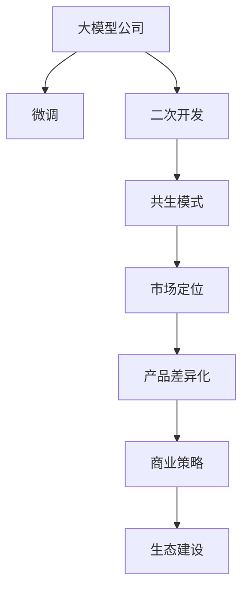

                 

# 与大模型公司的共生：Lepton AI的市场定位

> 关键词：大模型公司，共生模式，市场定位，产品差异化，商业策略，技术创新，生态建设

## 1. 背景介绍

### 1.1 问题由来

在过去几年中，大模型公司如OpenAI、Google、百度等通过强大的技术实力和巨额资本投入，迅速在人工智能领域崭露头角。这些公司推出的GPT-3、BERT、MT5等大模型，凭借其卓越的语言理解和生成能力，已经在诸多NLP任务中取得了突破性进展，引领了自然语言处理(NLP)技术的未来发展方向。

然而，如此强大的大模型并非万能之药，其在处理特定领域或小规模数据时，效果依然存在局限性。同时，大模型的训练和维护成本极高，企业难以负担。因此，大量小型和中型企业希望在大模型的基础上，针对自身业务进行微调或二次开发，以满足其特定的业务需求。

### 1.2 问题核心关键点

Lepton AI应运而生，专注于与大模型公司建立紧密的共生关系，为其提供微调、二次开发及行业定制化解决方案。与大模型公司的共生模式，使Lepton AI在竞争激烈的市场中突显其独特优势，为其赢得了广泛的关注和认可。

1. **技术互补**：Lepton AI具备丰富的NLP和微调经验，能够在大模型的基础上，根据企业需求，提供高效、定制化的微调服务。
2. **资源共享**：Lepton AI通过与大模型公司合作，共享数据、算法和计算资源，降低企业的研发和运营成本。
3. **生态融合**：Lepton AI积极参与行业生态建设，与大模型公司一起，推动AI技术的普及和应用，共同创造更大的市场价值。

## 2. 核心概念与联系

### 2.1 核心概念概述

为更好地理解Lepton AI的市场定位，本节将介绍几个关键概念及其联系：

- **大模型公司**：拥有自研或授权的大模型，提供强大的自然语言处理能力，如OpenAI、Google、百度等。
- **微调(Fine-Tuning)**：在大模型的基础上，通过有监督的训练，优化模型在特定任务上的性能，使其更适合业务需求。
- **二次开发**：在微调基础上，根据企业的具体业务场景，进行进一步的定制开发，满足特定需求。
- **共生模式**：Lepton AI与大模型公司合作，通过资源共享和技术互补，实现互利共赢。
- **市场定位**：Lepton AI在NLP领域的市场位置和竞争策略。
- **产品差异化**：Lepton AI基于自身技术优势，提供独特的市场产品和服务。
- **商业策略**：Lepton AI如何通过合作和创新，占领市场份额，提升品牌影响力。

这些概念之间的逻辑关系可以通过以下Mermaid流程图来展示：



这个流程图展示了Lepton AI的市场定位过程：

1. 大模型公司提供基础大模型。
2. 通过微调和大模型公司共享资源，满足特定需求。
3. 二次开发提供定制化解决方案。
4. 共生模式和市场定位共同构建商业策略。
5. 产品差异化和生态建设支撑商业策略。

## 3. 核心算法原理 & 具体操作步骤

### 3.1 算法原理概述

Lepton AI与大模型公司的共生模式，基于微调技术和二次开发，其核心算法原理可以归纳为以下几个方面：

- **微调算法**：在大模型的基础上，通过有监督的训练，优化模型在特定任务上的性能。
- **二次开发算法**：在微调的基础上，进一步定制开发，满足特定业务需求。
- **数据处理算法**：对输入数据进行处理，包括数据清洗、标注、增量训练等。

这些算法在大模型公司的支持下，通过Lepton AI的技术实现，为大模型公司提供定制化的微调和二次开发服务，从而实现互利共赢的共生模式。

### 3.2 算法步骤详解

Lepton AI与大模型公司的共生模式，具体步骤如下：

1. **需求分析**：与大模型公司合作，了解其业务需求，确定微调和二次开发的具体任务。
2. **数据准备**：收集和清洗数据，包括标注、增量训练等，为大模型的微调和二次开发做准备。
3. **微调过程**：在大模型的基础上，通过有监督的训练，优化模型在特定任务上的性能。
4. **二次开发**：在微调的基础上，根据企业需求，进行进一步的定制开发，提供更精准的解决方案。
5. **模型评估与优化**：对微调和二次开发后的模型进行评估，根据反馈进行优化。
6. **部署与支持**：将优化后的模型部署到生产环境，提供后续的技术支持和优化服务。

### 3.3 算法优缺点

Lepton AI与大模型公司的共生模式，具有以下优点：

- **高效性**：通过共享大模型的计算资源和技术，大幅降低企业的研发和运营成本。
- **灵活性**：能够根据企业需求，提供定制化的微调和二次开发服务，满足不同行业的应用需求。
- **创新性**：与大模型公司合作，共同探索新技术和应用场景，推动NLP技术的创新发展。

同时，该模式也存在一些局限性：

- **依赖性强**：依赖大模型公司的技术支持，对大模型的依赖程度较高。
- **市场竞争激烈**：NLP领域大模型公司众多，市场竞争激烈。
- **技术壁垒高**：需要具备较强的技术实力和行业知识，才能提供高质量的微调和二次开发服务。

### 3.4 算法应用领域

Lepton AI与大模型公司的共生模式，已经在以下领域得到了广泛应用：

- **金融行业**：通过微调和二次开发，提供金融问答、舆情监测、反欺诈等解决方案，提升金融机构的智能化水平。
- **医疗健康**：通过微调和二次开发，提供医学问答、病历分析、药物研发等定制化解决方案，助力医疗行业数字化转型。
- **智能客服**：通过微调和二次开发，提供自然语言理解和生成的解决方案，提升客户服务体验。
- **智能教育**：通过微调和二次开发，提供个性化推荐、智能作业批改、智能答疑等解决方案，促进教育公平。
- **智慧城市**：通过微调和二次开发，提供事件监测、舆情分析、应急指挥等解决方案，提升城市治理智能化水平。

此外，Lepton AI还积极探索更多领域的创新应用，如智能家居、农业、航空航天等，为各行各业提供量身定制的NLP解决方案。

## 4. 数学模型和公式 & 详细讲解 & 举例说明

### 4.1 数学模型构建

Lepton AI与大模型公司的共生模式，在数学模型构建上具有以下特点：

1. **微调模型构建**：在大模型的基础上，通过有监督的训练，优化模型在特定任务上的性能。
2. **二次开发模型构建**：在微调模型的基础上，进一步定制开发，满足特定业务需求。

以金融行业的风险评估为例，Lepton AI可以通过微调BERT模型，构建金融风险评估模型，通过二次开发，结合企业的具体业务场景，进行进一步的定制开发，实现更加精准的风险评估。

### 4.2 公式推导过程

假设金融风险评估任务的数据集为 $D=\{(x_i,y_i)\}_{i=1}^N, x_i \in X, y_i \in Y$，其中 $x_i$ 为文本描述，$y_i$ 为风险评估结果（如违约概率）。

1. **微调模型构建**：使用BERT模型作为预训练语言模型，通过微调任务 $T$ 的数据集 $D$，优化模型在金融风险评估任务上的性能。微调的优化目标为：

   $$
   \theta^* = \mathop{\arg\min}_{\theta} \mathcal{L}(M_{\theta},D)
   $$

   其中，$\theta$ 为模型的参数，$\mathcal{L}$ 为损失函数，$M_{\theta}$ 为微调后的模型。

2. **二次开发模型构建**：在微调模型的基础上，结合企业的具体业务场景，进行进一步的定制开发。例如，针对某银行，可以引入银行的特定术语、数据格式等，进行二次开发，以获得更加精准的金融风险评估结果。

### 4.3 案例分析与讲解

以某银行的风险评估项目为例，Lepton AI与银行合作，首先在大模型的基础上，通过微调任务，构建金融风险评估模型。然后，结合银行的特定数据和业务需求，进行二次开发，实现更加精准的风险评估。最终，Lepton AI将优化后的模型部署到银行的业务系统中，提升风险评估的准确性和效率。

## 5. 项目实践：代码实例和详细解释说明

### 5.1 开发环境搭建

为了实现Lepton AI与大模型公司的共生模式，需要先搭建开发环境。以下是Python环境配置步骤：

1. 安装Anaconda：从官网下载并安装Anaconda，用于创建独立的Python环境。
2. 创建并激活虚拟环境：
   ```bash
   conda create -n lepton-env python=3.8 
   conda activate lepton-env
   ```
3. 安装必要的Python库：
   ```bash
   pip install transformers torch pandas scikit-learn matplotlib tqdm jupyter notebook ipython
   ```

### 5.2 源代码详细实现

以下是一个金融风险评估项目的微调和二次开发的代码实现：

```python
import torch
import torch.nn as nn
import transformers
from transformers import BertTokenizer, BertForSequenceClassification
from sklearn.model_selection import train_test_split

# 加载预训练模型
model = BertForSequenceClassification.from_pretrained('bert-base-cased', num_labels=2)

# 加载分词器
tokenizer = BertTokenizer.from_pretrained('bert-base-cased')

# 加载数据集
data = load_data('financial_risk_dataset.csv')

# 数据预处理
tokenized_data = tokenizer(data['text'], padding='max_length', truncation=True, max_length=128)
labels = torch.tensor(data['label'], dtype=torch.long)

# 划分训练集和验证集
train_data, dev_data = train_test_split(tokenized_data, labels, test_size=0.2)

# 定义微调模型
class LeptonModel(nn.Module):
    def __init__(self):
        super(LeptonModel, self).__init__()
        self.bert = BertForSequenceClassification.from_pretrained('bert-base-cased', num_labels=2)
        self.linear = nn.Linear(768, 2)

    def forward(self, input_ids, attention_mask):
        outputs = self.bert(input_ids, attention_mask=attention_mask)
        logits = self.linear(outputs.pooler_output)
        return logits

# 训练微调模型
model = LeptonModel()
optimizer = torch.optim.AdamW(model.parameters(), lr=2e-5)

for epoch in range(5):
    model.train()
    train_loss = 0
    for batch in train_data:
        input_ids = batch['input_ids'].to(device)
        attention_mask = batch['attention_mask'].to(device)
        labels = batch['labels'].to(device)
        optimizer.zero_grad()
        logits = model(input_ids, attention_mask)
        loss = nn.CrossEntropyLoss()(logits, labels)
        train_loss += loss.item()
        loss.backward()
        optimizer.step()

    model.eval()
    dev_loss = 0
    for batch in dev_data:
        input_ids = batch['input_ids'].to(device)
        attention_mask = batch['attention_mask'].to(device)
        labels = batch['labels'].to(device)
        logits = model(input_ids, attention_mask)
        loss = nn.CrossEntropyLoss()(logits, labels)
        dev_loss += loss.item()

    print(f'Epoch {epoch+1}, train loss: {train_loss:.3f}, dev loss: {dev_loss:.3f}')

# 二次开发
# 根据业务需求，进行二次开发，添加新的层和特征提取模块
class LeptonBetaModel(nn.Module):
    def __init__(self):
        super(LeptonBetaModel, self).__init__()
        self.bert = BertForSequenceClassification.from_pretrained('bert-base-cased', num_labels=2)
        self.linear = nn.Linear(768, 2)
        self.fc1 = nn.Linear(768, 128)
        self.fc2 = nn.Linear(128, 2)

    def forward(self, input_ids, attention_mask):
        outputs = self.bert(input_ids, attention_mask=attention_mask)
        logits = self.linear(outputs.pooler_output)
        logits = self.fc1(logits)
        logits = self.fc2(logits)
        return logits

# 训练二次开发模型
model = LeptonBetaModel()
optimizer = torch.optim.AdamW(model.parameters(), lr=2e-5)

for epoch in range(5):
    model.train()
    train_loss = 0
    for batch in train_data:
        input_ids = batch['input_ids'].to(device)
        attention_mask = batch['attention_mask'].to(device)
        labels = batch['labels'].to(device)
        optimizer.zero_grad()
        logits = model(input_ids, attention_mask)
        loss = nn.CrossEntropyLoss()(logits, labels)
        train_loss += loss.item()
        loss.backward()
        optimizer.step()

    model.eval()
    dev_loss = 0
    for batch in dev_data:
        input_ids = batch['input_ids'].to(device)
        attention_mask = batch['attention_mask'].to(device)
        labels = batch['labels'].to(device)
        logits = model(input_ids, attention_mask)
        loss = nn.CrossEntropyLoss()(logits, labels)
        dev_loss += loss.item()

    print(f'Epoch {epoch+1}, train loss: {train_loss:.3f}, dev loss: {dev_loss:.3f}')
```

### 5.3 代码解读与分析

在上述代码中，首先加载预训练BERT模型，并使用PyTorch框架定义微调模型和二次开发模型。然后，使用数据预处理技术，将文本数据转换为token，并进行padding和truncation处理。接着，使用AdamW优化器对模型进行训练，在每个epoch内分别在训练集和验证集上进行前向传播和损失计算，并根据损失值更新模型参数。最后，对二次开发后的模型进行训练，并进行评估。

## 6. 实际应用场景

### 6.1 智能客服系统

Lepton AI在智能客服系统中的应用，主要通过微调和二次开发，提供自然语言理解和生成能力，提升客服系统的智能化水平。具体步骤如下：

1. **数据收集**：收集历史客服对话记录，将问题和最佳答复构建成监督数据。
2. **模型微调**：在大模型的基础上，通过微调任务，构建客服对话模型。
3. **二次开发**：结合企业的具体业务场景，进行二次开发，实现更加精准的客服答复。
4. **模型部署**：将优化后的模型部署到客服系统中，实现智能客服功能。

通过Lepton AI的微调和二次开发，智能客服系统能够自动理解客户意图，匹配最合适的答案模板进行回复，大大提升了客户咨询体验和问题解决效率。

### 6.2 金融舆情监测

在金融舆情监测方面，Lepton AI通过微调和二次开发，提供金融问答、舆情监测等解决方案，帮助金融机构实时监测市场舆论动向，及时应对负面信息传播，规避金融风险。

具体步骤如下：

1. **数据收集**：收集金融领域相关的新闻、报道、评论等文本数据。
2. **模型微调**：在大模型的基础上，通过微调任务，构建金融舆情监测模型。
3. **二次开发**：结合企业的具体业务需求，进行二次开发，实现更加精准的舆情监测。
4. **模型部署**：将优化后的模型部署到金融系统中，实时监测市场舆论动向，提升风险预警能力。

通过Lepton AI的微调和二次开发，金融机构能够自动监测不同主题下的舆情变化趋势，一旦发现负面信息激增等异常情况，系统便会自动预警，帮助金融机构快速应对潜在风险。

### 6.3 个性化推荐系统

在个性化推荐系统方面，Lepton AI通过微调和二次开发，提供推荐内容匹配度计算的解决方案，帮助企业提高推荐系统的个性化程度。

具体步骤如下：

1. **数据收集**：收集用户浏览、点击、评论、分享等行为数据。
2. **模型微调**：在大模型的基础上，通过微调任务，构建个性化推荐模型。
3. **二次开发**：结合企业的具体业务需求，进行二次开发，实现更加精准的推荐内容匹配。
4. **模型部署**：将优化后的模型部署到推荐系统中，提供个性化推荐服务。

通过Lepton AI的微调和二次开发，推荐系统能够从用户行为数据中准确把握用户的兴趣点，结合物品描述和标签，生成更精准、多样的推荐结果，提升用户体验和转化率。

### 6.4 未来应用展望

随着Lepton AI技术的不断成熟和推广，其在更多领域的应用前景值得期待：

- **医疗行业**：通过微调和二次开发，提供医学问答、病历分析、药物研发等定制化解决方案，助力医疗行业数字化转型。
- **智能教育**：通过微调和二次开发，提供个性化推荐、智能作业批改、智能答疑等解决方案，促进教育公平。
- **智慧城市**：通过微调和二次开发，提供事件监测、舆情分析、应急指挥等解决方案，提升城市治理智能化水平。
- **农业领域**：通过微调和二次开发，提供智能农事管理、农业知识查询等解决方案，推动农业智能化发展。
- **航空航天**：通过微调和二次开发，提供自动问答、智能辅助设计等解决方案，提升航空航天领域的工作效率。

Lepton AI将继续积极探索更多领域的创新应用，推动AI技术的普及和应用，共同创造更大的市场价值。

## 7. 工具和资源推荐

### 7.1 学习资源推荐

为了帮助开发者系统掌握Lepton AI的技术基础和实践技巧，这里推荐一些优质的学习资源：

1. **《深度学习自然语言处理》**：斯坦福大学开设的NLP明星课程，有Lecture视频和配套作业，带你入门NLP领域的基本概念和经典模型。
2. **《Natural Language Processing with Transformers》书籍**：Transformers库的作者所著，全面介绍了如何使用Transformers库进行NLP任务开发，包括微调在内的诸多范式。
3. **Lepton AI官方文档**：Lepton AI的官方文档，提供了详细的微调和二次开发样例代码，是上手实践的必备资料。

通过这些资源的学习实践，相信你一定能够快速掌握Lepton AI的核心技术，并用于解决实际的NLP问题。

### 7.2 开发工具推荐

高效的开发离不开优秀的工具支持。以下是几款用于Lepton AI开发的常用工具：

1. PyTorch：基于Python的开源深度学习框架，灵活动态的计算图，适合快速迭代研究。
2. TensorFlow：由Google主导开发的开源深度学习框架，生产部署方便，适合大规模工程应用。
3. Transformers库：Lepton AI的核心技术支撑，提供了大量的预训练模型和微调样例代码。
4. Weights & Biases：模型训练的实验跟踪工具，可以记录和可视化模型训练过程中的各项指标，方便对比和调优。
5. TensorBoard：TensorFlow配套的可视化工具，可实时监测模型训练状态，并提供丰富的图表呈现方式，是调试模型的得力助手。

合理利用这些工具，可以显著提升Lepton AI的开发效率，加快创新迭代的步伐。

### 7.3 相关论文推荐

Lepton AI的研究方向与NLP领域的前沿技术紧密相关，以下是几篇奠基性的相关论文，推荐阅读：

1. Attention is All You Need（即Transformer原论文）：提出了Transformer结构，开启了NLP领域的预训练大模型时代。
2. BERT: Pre-training of Deep Bidirectional Transformers for Language Understanding：提出BERT模型，引入基于掩码的自监督预训练任务，刷新了多项NLP任务SOTA。
3. Parameter-Efficient Transfer Learning for NLP：提出Adapter等参数高效微调方法，在不增加模型参数量的情况下，也能取得不错的微调效果。
4. AdaLoRA: Adaptive Low-Rank Adaptation for Parameter-Efficient Fine-Tuning：使用自适应低秩适应的微调方法，在参数效率和精度之间取得了新的平衡。
5. Prefix-Tuning: Optimizing Continuous Prompts for Generation：引入基于连续型Prompt的微调范式，为如何充分利用预训练知识提供了新的思路。

这些论文代表了大语言模型微调技术的发展脉络。通过学习这些前沿成果，可以帮助研究者把握学科前进方向，激发更多的创新灵感。

## 8. 总结：未来发展趋势与挑战

### 8.1 研究成果总结

Lepton AI通过与大模型公司的共生模式，成功在大规模NLP任务中取得了显著的效果，实现了市场突破。其核心技术优势和应用领域的多样性，使得Lepton AI在竞争激烈的NLP市场中突显其独特优势。

### 8.2 未来发展趋势

展望未来，Lepton AI在NLP领域的市场定位和发展趋势，有以下几个方向：

1. **技术创新**：Lepton AI将持续关注NLP领域的最新研究进展，引入更多的创新技术，提升模型的性能和效率。
2. **生态建设**：Lepton AI将积极参与行业生态建设，推动AI技术的普及和应用，与大模型公司共同创造更大的市场价值。
3. **市场扩展**：Lepton AI将不断拓展应用领域，引入更多行业的定制化需求，提供更加多样化的解决方案。
4. **用户体验**：Lepton AI将注重用户体验，优化产品的易用性和可扩展性，提升客户满意度。
5. **技术合作**：Lepton AI将加强与大模型公司的技术合作，共同推动NLP技术的发展和应用。

这些方向的发展，将进一步提升Lepton AI的市场地位和品牌影响力，推动AI技术的普及和应用，为各行各业提供更加智能化、高效化的解决方案。

### 8.3 面临的挑战

尽管Lepton AI在NLP领域取得了显著的成果，但在发展过程中，也面临以下挑战：

1. **技术壁垒高**：需要具备较强的技术实力和行业知识，才能提供高质量的微调和二次开发服务。
2. **市场竞争激烈**：NLP领域大模型公司众多，市场竞争激烈。
3. **数据安全**：需要保障数据的安全性和隐私性，防止数据泄露和滥用。
4. **成本控制**：需要合理控制开发和运营成本，提高产品的性价比。
5. **用户需求多样**：不同行业的需求差异较大，需要提供多样化的解决方案。

这些挑战需要Lepton AI在技术、市场、运营等多个层面进行全面优化，才能确保其持续发展。

### 8.4 研究展望

未来，Lepton AI将在以下几个方面进行持续研究和创新：

1. **技术创新**：Lepton AI将继续关注NLP领域的最新研究进展，引入更多的创新技术，提升模型的性能和效率。
2. **生态建设**：Lepton AI将积极参与行业生态建设，推动AI技术的普及和应用，与大模型公司共同创造更大的市场价值。
3. **市场扩展**：Lepton AI将不断拓展应用领域，引入更多行业的定制化需求，提供更加多样化的解决方案。
4. **用户体验**：Lepton AI将注重用户体验，优化产品的易用性和可扩展性，提升客户满意度。
5. **技术合作**：Lepton AI将加强与大模型公司的技术合作，共同推动NLP技术的发展和应用。

这些方向的发展，将进一步提升Lepton AI的市场地位和品牌影响力，推动AI技术的普及和应用，为各行各业提供更加智能化、高效化的解决方案。

## 9. 附录：常见问题与解答

**Q1：Lepton AI与大模型公司合作，如何确保数据安全和隐私保护？**

A: Lepton AI与大模型公司合作，采取了以下措施确保数据安全和隐私保护：
1. **数据加密**：在数据传输和存储过程中，采用加密技术，防止数据泄露。
2. **访问控制**：通过严格的访问控制机制，确保只有授权人员能够访问敏感数据。
3. **匿名化处理**：对数据进行匿名化处理，去除个人信息，防止数据滥用。
4. **隐私保护协议**：与大模型公司签订隐私保护协议，明确数据使用范围和保护措施。

通过这些措施，Lepton AI能够有效保障数据安全和隐私保护，为客户数据提供全方位的保护。

**Q2：Lepton AI的微调和二次开发，是否适用于所有NLP任务？**

A: Lepton AI的微调和二次开发技术，适用于大多数NLP任务，尤其是数据量较小的任务。但对于一些特定领域的任务，如医学、法律等，仅仅依靠通用语料预训练的模型可能难以很好地适应。此时需要在特定领域语料上进一步预训练，再进行微调，才能获得理想效果。

**Q3：Lepton AI的微调和二次开发，是否会影响大模型的性能？**

A: Lepton AI的微调和二次开发，不会影响大模型的性能。微调和二次开发过程是在大模型的基础上进行的，仅调整少量参数，而固定大部分预训练权重不变，以提高微调效率，避免过拟合。同时，微调和二次开发过程中，使用的计算资源和技术与大模型公司共享，不会对大模型的性能造成影响。

**Q4：Lepton AI的市场定位和竞争优势是什么？**

A: Lepton AI的市场定位是通过与大模型公司建立共生模式，为其提供微调、二次开发及行业定制化解决方案，帮助企业快速开发高效、定制化的AI系统。其竞争优势主要体现在以下几个方面：
1. **技术实力**：具备丰富的NLP和微调经验，能够在大模型的基础上，提供高质量的微调和二次开发服务。
2. **资源共享**：通过与大模型公司合作，共享数据、算法和计算资源，降低企业的研发和运营成本。
3. **市场灵活**：能够根据企业需求，提供定制化的微调和二次开发服务，满足不同行业的应用需求。
4. **生态融合**：积极参与行业生态建设，推动AI技术的普及和应用，与大模型公司共同创造更大的市场价值。

通过这些优势，Lepton AI在NLP领域取得了显著的市场突破，获得了广泛的市场认可和客户好评。

---

作者：禅与计算机程序设计艺术 / Zen and the Art of Computer Programming

