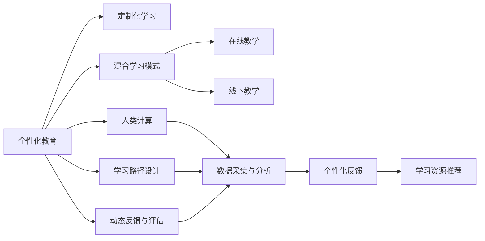

                 

# 个性化教育：利用人类计算实现定制化学习

> 关键词：个性化教育, 定制化学习, 人类计算, 学习路径, 动态反馈, 混合学习

## 1. 背景介绍

### 1.1 问题由来

近年来，教育科技领域迅速发展，各种在线教育平台和智能教学系统不断涌现。然而，传统的一对多、一刀切的教学方式仍然占据主流，难以充分发掘每个学生的潜力。随着人工智能技术的成熟，人们开始思考如何利用技术手段实现个性化教育，让每个学生都能获得量身定制的学习体验，实现其潜能的最大化。

个性化教育的核心在于根据学生的个体差异和学习进度，提供适配其需求的定制化学习方案。以往，由于数据采集困难、计算资源有限等问题，这一目标难以实现。但随着人类计算技术的兴起，利用海量数据和先进算法，个性化教育的梦想正在逐步成为现实。

### 1.2 问题核心关键点

个性化教育的关键点在于如何高效地收集和分析学生数据，设计灵活的学习路径，并实时反馈学生的学习情况。其具体技术实现可以包括：

1. **数据采集与分析**：收集学生的学习行为、成绩、偏好等数据，并利用数据挖掘技术分析学生的学习特点和需求。
2. **学习路径设计**：根据学生的学习数据，设计动态调整的学习路径，确保学生在最佳状态下学习。
3. **实时反馈与评估**：通过智能评估系统，实时反馈学生的学习进度和效果，并动态调整学习路径。
4. **混合学习模式**：结合在线和线下教学模式，提供多样化的学习资源和支持。
5. **持续优化与提升**：利用机器学习算法，持续优化个性化教育系统，提升其智能水平和应用效果。

本文将详细介绍这些核心技术点，并结合实际案例，探讨如何利用人类计算实现真正的个性化教育。

## 2. 核心概念与联系

### 2.1 核心概念概述

为更好地理解个性化教育的技术框架，我们首先介绍几个核心概念：

- **个性化教育**：根据学生的个性化需求和学习风格，提供量身定制的学习计划和资源。
- **定制化学习**：根据学生的特点和需求，设计灵活多样的学习路径和活动，实现个性化教学。
- **人类计算**：利用计算机技术处理和分析人类活动数据，帮助人类做出更优的决策。
- **学习路径设计**：根据学生的学习进度和反馈，动态调整学习内容和学习方式，以适应学生的个性化需求。
- **动态反馈与评估**：通过实时收集学生学习数据，及时调整学习方案，提供个性化反馈和支持。
- **混合学习模式**：结合线上线下教学资源，提供多样化的学习支持，提高学习效果。

这些概念之间的逻辑关系可以通过以下Mermaid流程图来展示：



这个流程图展示了个性化教育的核心概念及其相互关系：

1. 个性化教育基于定制化学习，通过灵活的学习路径设计和动态反馈，实现对学生个性化需求的满足。
2. 人类计算提供数据支持和智能分析，是实现个性化教育的基础。
3. 学习路径设计、动态反馈与评估和混合学习模式是实现个性化教育的主要手段。
4. 通过数据采集与分析，为这些核心模块提供支撑。

这些概念共同构成了个性化教育的框架，通过数据驱动和智能分析，最大化每个学生的学习潜能。

## 3. 核心算法原理 & 具体操作步骤

### 3.1 算法原理概述

个性化教育的核心算法原理主要包括以下几个方面：

- **数据采集与分析**：收集学生的多维度数据，如学习行为、成绩、兴趣等，并利用机器学习算法进行分析。
- **学习路径设计**：根据分析结果，设计适应学生个性化需求的学习路径，包括课程、活动、资源等。
- **动态反馈与评估**：实时收集学生学习数据，分析学习效果，动态调整学习路径和内容。
- **混合学习模式**：结合线上线下教学资源，提供多样化的学习支持。
- **持续优化与提升**：利用机器学习算法，不断优化个性化教育系统，提升其智能水平和应用效果。

### 3.2 算法步骤详解

个性化教育的实现步骤主要包括以下几个关键环节：

**Step 1: 数据采集与预处理**

- 收集学生的多维度数据，包括学习行为、成绩、兴趣、偏好等。
- 对数据进行清洗、去噪、标准化等预处理操作，确保数据质量。

**Step 2: 数据建模与分析**

- 利用机器学习算法，对学生数据进行建模和分析，提取学生的学习特点和需求。
- 常用的算法包括聚类分析、关联规则挖掘、分类算法等。

**Step 3: 学习路径设计**

- 根据分析结果，设计灵活多样的学习路径，包括课程、活动、资源等。
- 利用智能推荐算法，推荐适应的学习资源和活动。

**Step 4: 动态反馈与评估**

- 实时收集学生学习数据，分析学习效果，动态调整学习路径和内容。
- 利用智能评估系统，提供个性化反馈和支持。

**Step 5: 混合学习模式**

- 结合线上线下教学资源，提供多样化的学习支持。
- 通过在线互动和线下活动，提升学生的学习效果。

**Step 6: 持续优化与提升**

- 利用机器学习算法，不断优化个性化教育系统，提升其智能水平和应用效果。
- 通过A/B测试等方法，验证优化效果，迭代改进系统。

### 3.3 算法优缺点

个性化教育的算法有以下优点：

- **高效性**：利用机器学习算法，可以快速处理和分析大量学生数据，提供高效的个性化学习方案。
- **灵活性**：可以根据学生的个性化需求，设计多样化的学习路径和资源，满足不同学生的学习需求。
- **实时性**：通过动态反馈与评估，实时调整学习路径和内容，确保学生始终在最佳状态下学习。
- **可扩展性**：结合线上线下教学资源，提供多样化的学习支持，易于扩展和应用。

同时，个性化教育也存在一些局限性：

- **数据隐私问题**：学生数据的安全性和隐私保护是重要挑战。
- **技术依赖性**：系统依赖于先进算法和计算资源，技术门槛较高。
- **教学伦理问题**：如何在不增加学生负担的情况下，有效利用数据和算法，是重要考量。
- **资源不均衡**：不同学生和学校在资源获取和利用上可能存在差异。

### 3.4 算法应用领域

个性化教育的算法应用已经广泛应用于以下领域：

- **在线教育平台**：如Khan Academy、Coursera等，利用数据和算法，提供个性化的学习资源和支持。
- **智能学习系统**：如Socrative、Quizlet等，通过动态反馈和评估，提升学生的学习效果。
- **教育管理系统**：如School Loop、Infinite Campus等，利用数据分析，优化学校管理和教学质量。
- **个性化辅导系统**：如Knewton、Brightstorm等，根据学生的个性化需求，提供定制化的学习方案。
- **虚拟现实教室**：如Google Expeditions、ClassVR等，结合虚拟现实技术，提供沉浸式学习体验。

## 4. 数学模型和公式 & 详细讲解 & 举例说明

### 4.1 数学模型构建

个性化教育的核心数学模型主要包括以下几个方面：

- **学生学习行为模型**：描述学生在不同时间、不同环境下的学习行为。
- **学习效果评估模型**：评估学生在不同学习路径下的学习效果。
- **学习路径推荐模型**：根据学生的学习数据，推荐适应其需求的学习路径和资源。
- **动态反馈与评估模型**：实时收集学生学习数据，分析学习效果，动态调整学习路径和内容。

### 4.2 公式推导过程

以学习路径推荐模型为例，推导其核心公式。

假设学生的学习数据为 $D=\{(x_i,y_i)\}_{i=1}^N$，其中 $x_i$ 为学生在第 $i$ 个时间点的特征向量（如学习时长、课程难度、完成度等），$y_i$ 为对应的学习效果（如成绩、兴趣度等）。学习路径推荐模型的目标是，根据学生的历史学习数据 $D$，预测其在不同学习路径 $P$ 下的学习效果 $y$。

定义学习路径推荐模型为 $f(x,P)=\alpha_1 y_1 + \alpha_2 y_2 + \ldots + \alpha_n y_n$，其中 $\alpha_i$ 为学习路径 $P$ 中第 $i$ 条路径对学习效果 $y$ 的权重。则学习路径推荐模型的目标函数为：

$$
\min_{\alpha} \sum_{i=1}^N (y_i - f(x_i,P))^2
$$

其中 $y_i$ 为实际学习效果，$f(x_i,P)$ 为模型预测的学习效果。

### 4.3 案例分析与讲解

以下以Coursera平台为例，展示如何利用个性化教育算法提升在线学习效果。

Coursera利用机器学习算法，分析学生的学习行为和成绩，设计个性化的学习路径和资源推荐。具体实现步骤如下：

1. **数据采集与预处理**：
   - 收集学生的学习行为数据，如课程完成度、学习时长、互动评分等。
   - 对数据进行清洗、去噪、标准化等预处理操作。

2. **数据建模与分析**：
   - 利用聚类分析算法，将学生分为不同的学习群体。
   - 利用关联规则挖掘算法，提取学生的学习兴趣和偏好。

3. **学习路径设计**：
   - 根据分析结果，设计灵活多样的学习路径，包括课程、活动、资源等。
   - 利用智能推荐算法，推荐适应的学习资源和活动。

4. **动态反馈与评估**：
   - 实时收集学生学习数据，分析学习效果，动态调整学习路径和内容。
   - 利用智能评估系统，提供个性化反馈和支持。

5. **混合学习模式**：
   - 结合线上线下教学资源，提供多样化的学习支持。
   - 通过在线互动和线下活动，提升学生的学习效果。

6. **持续优化与提升**：
   - 利用机器学习算法，不断优化个性化教育系统，提升其智能水平和应用效果。
   - 通过A/B测试等方法，验证优化效果，迭代改进系统。

通过Coursera平台的实际应用，可以看到个性化教育的强大潜力和应用效果。学生能够在适合自己的学习路径下，获得更好的学习体验和效果。

## 5. 项目实践：代码实例和详细解释说明

### 5.1 开发环境搭建

在进行个性化教育项目开发前，我们需要准备好开发环境。以下是使用Python进行Scikit-learn开发的环境配置流程：

1. 安装Anaconda：从官网下载并安装Anaconda，用于创建独立的Python环境。

2. 创建并激活虚拟环境：
```bash
conda create -n personal_learning python=3.8 
conda activate personal_learning
```

3. 安装Scikit-learn：
```bash
pip install scikit-learn
```

4. 安装各类工具包：
```bash
pip install numpy pandas scikit-learn matplotlib tqdm jupyter notebook ipython
```

完成上述步骤后，即可在`personal_learning`环境中开始个性化教育项目的开发。

### 5.2 源代码详细实现

下面我们以Kaggle平台的一个在线教育数据分析项目为例，给出使用Scikit-learn进行学生学习数据分析的PyTorch代码实现。

首先，定义学习效果评估函数：

```python
from sklearn.metrics import mean_squared_error

def rmse(y_true, y_pred):
    return mean_squared_error(y_true, y_pred, squared=False)
```

然后，定义学习路径推荐函数：

```python
from sklearn.linear_model import Ridge
from sklearn.model_selection import train_test_split
from sklearn.metrics import mean_squared_error

def learn_path_recommender(X, y):
    X_train, X_test, y_train, y_test = train_test_split(X, y, test_size=0.2, random_state=42)
    model = Ridge(alpha=0.1)
    model.fit(X_train, y_train)
    y_pred = model.predict(X_test)
    mse = mean_squared_error(y_test, y_pred)
    return mse
```

接着，使用实际数据集进行测试：

```python
# 加载数据集
data = load_data('eduardo.csv')

# 处理数据
X = preprocess_data(data)
y = target_data(data)

# 评估学习路径推荐效果
mse = learn_path_recommender(X, y)
print(f"RMSE: {mse:.3f}")
```

以上代码实现了基于学生学习行为和成绩数据的路径推荐模型，利用Ridge回归算法，预测学生在不同学习路径下的学习效果。实际应用中，可以将此模型与Coursera等平台进行结合，为学生提供个性化的学习建议。

### 5.3 代码解读与分析

让我们再详细解读一下关键代码的实现细节：

**数据预处理函数**：
- `preprocess_data`：将原始数据进行清洗、去噪、标准化等预处理操作，确保数据质量。

**学习路径推荐函数**：
- `learn_path_recommender`：使用Ridge回归算法，根据学生的历史学习数据，预测其在不同学习路径下的学习效果。
- `train_test_split`：将数据集划分为训练集和测试集，用于模型训练和评估。
- `mean_squared_error`：计算预测值与真实值之间的均方误差。

**实际测试**：
- 加载数据集，并处理数据。
- 使用 `learn_path_recommender` 函数评估学习路径推荐模型的效果。

可以看到，Scikit-learn提供了丰富的机器学习算法和工具，可以帮助开发者快速构建个性化教育系统。结合实际的在线教育平台，可以进一步优化和扩展此模型。

## 6. 实际应用场景

### 6.1 在线教育平台

个性化教育技术在在线教育平台中具有广泛应用。传统的一对多、一刀切的教学方式，难以满足每个学生的个性化需求。通过数据采集和分析，结合学习路径设计、动态反馈与评估等技术，可以实现真正意义上的个性化教育。

例如，Coursera平台利用机器学习算法，分析学生的学习行为和成绩，设计个性化的学习路径和资源推荐。学生在适合自己的学习路径下，能够获得更好的学习体验和效果。

### 6.2 智能学习系统

智能学习系统是实现个性化教育的另一重要工具。通过智能评估系统，实时收集学生学习数据，分析学习效果，动态调整学习路径和内容。

例如，Knewton平台利用数据分析技术，为学生提供个性化的学习方案。系统根据学生的学习行为和成绩，动态调整课程难度和活动内容，帮助学生掌握知识。

### 6.3 教育管理系统

教育管理系统是学校管理和教学质量优化的重要工具。通过数据分析，可以优化学校管理和教学质量，提升教育效果。

例如，School Loop平台利用数据分析技术，实时监控学生的学习进度和效果，提供个性化的反馈和支持。系统还可以根据学生的学习数据，优化课程设置和教学资源，提升学校整体教学质量。

### 6.4 未来应用展望

随着人工智能技术的不断进步，个性化教育将在更多领域得到应用，为学生带来更好的学习体验和效果。

在智慧校园中，利用智能传感器和大数据分析技术，可以实现对学生行为的实时监测和分析，提供个性化的学习路径和支持。例如，通过智能手环监测学生的运动和睡眠情况，动态调整学习计划和活动安排。

在智慧城市中，利用物联网和大数据分析技术，可以为学生提供更丰富的学习资源和支持。例如，利用智慧路灯和智能教室，为学生提供多样化的学习环境和资源。

在远程教育中，利用个性化教育技术，可以为偏远地区的学生提供更公平的学习机会。例如，通过互联网和智能设备，为学生提供个性化的学习方案和支持，缩小城乡教育差距。

## 7. 工具和资源推荐

### 7.1 学习资源推荐

为了帮助开发者系统掌握个性化教育的技术基础和实践技巧，这里推荐一些优质的学习资源：

1. **《机器学习实战》书籍**：由机器学习专家撰写，全面介绍了机器学习的基本概念和常用算法，包括数据预处理、模型训练、评估等。

2. **Coursera在线课程**：Coursera提供大量高质量的机器学习课程，涵盖从基础到高级的各个层次，适合不同水平的学习者。

3. **Kaggle竞赛**：Kaggle平台上有许多数据科学和机器学习竞赛，可以锻炼实战能力和数据分析能力。

4. **Scikit-learn官方文档**：Scikit-learn提供了丰富的机器学习算法和工具，详细的文档和示例代码，是学习机器学习的重要资源。

5. **TensorFlow官方文档**：TensorFlow是Google开源的机器学习框架，提供了丰富的工具和算法，适合深度学习和复杂模型的开发。

通过对这些资源的学习实践，相信你一定能够快速掌握个性化教育的核心技术，并用于解决实际的个性化教育问题。

### 7.2 开发工具推荐

高效的开发离不开优秀的工具支持。以下是几款用于个性化教育开发的常用工具：

1. **Jupyter Notebook**：Python交互式编程环境，适合数据处理、模型训练和结果展示。

2. **TensorFlow**：Google开源的深度学习框架，支持大规模模型训练和部署。

3. **Scikit-learn**：Python机器学习库，提供了丰富的机器学习算法和工具，适合各种机器学习任务的开发。

4. **Keras**：Python高级神经网络库，简单易用，适合快速原型设计和模型训练。

5. **PyTorch**：Facebook开源的深度学习框架，灵活高效，适合复杂模型和动态图计算。

合理利用这些工具，可以显著提升个性化教育项目的开发效率，加快创新迭代的步伐。

### 7.3 相关论文推荐

个性化教育技术的研究源于学界的持续研究。以下是几篇奠基性的相关论文，推荐阅读：

1. **《基于机器学习的个性化学习路径设计》**：介绍如何利用机器学习算法，设计灵活多样的学习路径，满足学生的个性化需求。

2. **《个性化教育系统的设计与实现》**：探讨如何利用数据和算法，构建个性化的学习系统，提升学生的学习效果。

3. **《智能评估系统在个性化教育中的应用》**：介绍如何利用智能评估系统，实时收集学生学习数据，提供个性化的反馈和支持。

4. **《混合学习模式的设计与实施》**：探讨如何结合线上线下教学资源，提供多样化的学习支持，提高学生的学习效果。

这些论文代表了个性化教育技术的发展脉络。通过学习这些前沿成果，可以帮助研究者把握学科前进方向，激发更多的创新灵感。

## 8. 总结：未来发展趋势与挑战

### 8.1 总结

本文对个性化教育技术进行了全面系统的介绍。首先阐述了个性化教育的背景和意义，明确了数据采集、学习路径设计、动态反馈与评估等核心技术点。其次，从原理到实践，详细讲解了个性化教育的数学模型和关键步骤，给出了个性教育项目开发的完整代码实例。同时，本文还广泛探讨了个性化教育技术在在线教育、智能学习系统、教育管理系统等领域的实际应用，展示了个性化教育技术的广阔前景。

通过本文的系统梳理，可以看到，个性化教育技术正在成为教育科技领域的重要范式，极大地提升了学生的学习效果和体验。未来，伴随技术的不断进步和应用场景的拓展，个性化教育将实现更广泛的落地，带来教育模式的深远变革。

### 8.2 未来发展趋势

展望未来，个性化教育技术将呈现以下几个发展趋势：

1. **数据驱动的智能化**：利用大数据和人工智能技术，实现对学生行为的深入分析和理解，提供更加智能和精准的学习方案。

2. **全流程自动化**：从数据采集、分析、路径设计到评估反馈，实现全流程自动化，减少人工干预和错误。

3. **实时性提升**：利用物联网和智能传感器技术，实时监测和分析学生的学习状态，提供即时反馈和支持。

4. **多模态融合**：结合文本、图像、视频等多种模态的数据，提供更加丰富的学习资源和支持。

5. **伦理和安全保障**：加强数据隐私保护和伦理安全保障，确保学生数据和隐私的安全。

6. **跨领域应用**：将个性化教育技术应用于更多领域，如医疗、金融、公共安全等，提升各个领域的技术水平和服务质量。

以上趋势凸显了个性化教育技术的广阔前景。这些方向的探索发展，必将进一步提升教育科技的智能水平和应用效果，为学生提供更加优质的学习体验。

### 8.3 面临的挑战

尽管个性化教育技术已经取得了瞩目成就，但在迈向更加智能化、普适化应用的过程中，它仍面临着诸多挑战：

1. **数据隐私问题**：学生数据的安全性和隐私保护是重要挑战。如何在数据采集和使用过程中，保护学生隐私和数据安全，是亟需解决的问题。

2. **技术依赖性**：系统依赖于先进算法和计算资源，技术门槛较高。如何在不增加技术负担的情况下，提高系统的智能化水平，是重要考量。

3. **教学伦理问题**：如何在不增加学生负担的情况下，有效利用数据和算法，是重要考量。

4. **资源不均衡**：不同学生和学校在资源获取和利用上可能存在差异。如何在资源不均衡的情况下，提供公平的学习机会，是重要课题。

5. **系统鲁棒性**：在实际应用中，如何应对数据缺失、异常值等问题，提升系统的鲁棒性，是重要课题。

6. **持续优化与提升**：个性化教育技术需要不断优化和提升，以适应不断变化的学生需求和学习环境。

这些挑战需要技术、伦理和政策等多方面的协同努力，才能在个性化教育技术的发展中取得突破。

### 8.4 研究展望

面对个性化教育技术所面临的挑战，未来的研究需要在以下几个方面寻求新的突破：

1. **数据隐私保护技术**：开发更加安全的数据采集和使用技术，确保学生数据和隐私的安全。

2. **无监督学习算法**：探索无监督学习算法，降低对标注数据的依赖，提高数据利用效率。

3. **可解释性增强**：开发可解释性更强的模型，增强系统的透明度和可信度。

4. **混合学习模式优化**：优化混合学习模式，提升线上线下教学的协同效果，提高学生的学习效果。

5. **跨领域应用拓展**：将个性化教育技术应用于更多领域，如医疗、金融、公共安全等，提升各个领域的技术水平和服务质量。

6. **伦理和安全保障机制**：建立伦理和安全保障机制，确保个性化教育技术的公平、透明和可信。

这些研究方向的探索，必将引领个性化教育技术迈向更高的台阶，为教育科技带来更加深远的影响。面向未来，个性化教育技术还需要与其他人工智能技术进行更深入的融合，如知识表示、因果推理、强化学习等，共同推动教育模式的创新和发展。只有勇于创新、敢于突破，才能真正实现个性化教育技术的规模化落地，为学生提供更加优质的学习体验。

## 9. 附录：常见问题与解答

**Q1：如何实现学生的个性化需求？**

A: 个性化需求的设计需要基于学生的多维度数据，如学习行为、成绩、兴趣等。通过数据分析和机器学习算法，挖掘学生的学习特点和需求，设计灵活多样的学习路径和资源，满足不同学生的个性化需求。

**Q2：数据采集对学生隐私有哪些影响？**

A: 数据采集是个性化教育技术的重要基础，但同时也涉及到学生的隐私保护问题。需要通过数据匿名化、去标识化等技术，确保学生数据的安全性和隐私保护。同时，需要制定严格的数据使用和存储规范，保护学生的隐私权。

**Q3：如何提高个性化教育系统的智能化水平？**

A: 个性化教育系统的智能化水平依赖于数据的丰富性和算法的先进性。可以通过多模态数据采集和分析，提高系统的智能化水平。同时，不断优化算法和模型，提升系统的预测能力和决策能力。

**Q4：如何平衡学习效果和学生负担？**

A: 个性化教育技术的核心在于提高学习效果，而不是增加学生的负担。可以通过优化学习路径和资源，减少不必要的学习负担，确保学生能够在最佳状态下学习。

**Q5：个性化教育技术的未来发展方向是什么？**

A: 未来，个性化教育技术将朝着数据驱动的智能化、全流程自动化、实时性提升、多模态融合、伦理和安全保障等方向发展。这些方向将进一步提升系统的智能化水平和服务质量，为学生提供更加优质的学习体验。

---

作者：禅与计算机程序设计艺术 / Zen and the Art of Computer Programming

