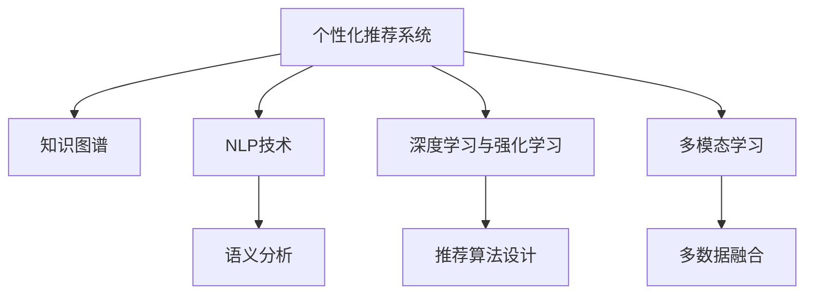

                 

# 个性化知识订阅提高知识获取的针对性

## 1. 背景介绍

在信息爆炸的时代，我们每天都在接受海量的知识信息，如何有效地筛选和获取最相关的知识，成为每个学习者面临的重大挑战。传统的新闻门户、搜索引擎等获取知识的渠道，往往依赖于简单的关键词匹配，无法准确理解和满足个体的个性化需求。个性化知识订阅的兴起，正是为了解决这一问题。

### 1.1 问题由来
知识获取方式的单一性是当前技术面临的主要问题。用户在获取知识时，往往需要花费大量时间和精力进行手动筛选，容易陷入信息过载的困境。此外，传统的个性化推荐算法依赖于用户的历史行为数据，对于新用户或少有行为数据的用户，推荐效果往往较差。

### 1.2 问题核心关键点
个性化知识订阅的核心在于通过对用户兴趣和需求的精准理解，推荐最相关的知识资源。其主要包括以下几个关键点：

1. 数据收集与用户画像构建。收集用户的历史行为数据，如浏览、点击、搜索等，构建多维度的用户兴趣模型。
2. 知识图谱与语义理解。利用知识图谱、自然语言处理技术，理解知识资源的语义信息。
3. 推荐算法设计。设计高效的推荐算法，通过理解用户画像和知识图谱，推荐最匹配的知识资源。
4. 反馈机制优化。建立用户反馈机制，持续优化推荐算法，提升推荐精度和用户体验。

这些关键点共同构成了个性化知识订阅的核心技术框架，旨在为用户提供更加精准、个性化的知识获取服务。

## 2. 核心概念与联系

### 2.1 核心概念概述

为更好地理解个性化知识订阅的核心技术，本节将介绍几个密切相关的核心概念：

- 个性化推荐系统：通过分析用户历史行为数据，构建用户画像，推荐最相关的知识资源。个性化推荐系统在电商、新闻、视频等多个领域广泛应用。
- 知识图谱：利用图结构描述知识实体和它们之间的语义关系，用于知识检索、推荐等应用。知识图谱包含大量领域知识，能够有效提升知识获取的准确性和全面性。
- 自然语言处理(NLP)：研究计算机如何处理和理解人类语言，包括语言模型、语义分析、信息抽取等技术。NLP技术在个性化知识订阅中用于理解和分析知识资源。
- 深度学习与强化学习：通过深度神经网络模型和强化学习算法，个性化推荐系统能够自动学习用户偏好，并动态优化推荐策略。
- 多模态学习：结合文本、图像、视频等多种数据类型，全面理解用户需求和知识资源，提升推荐精度。

这些核心概念之间的逻辑关系可以通过以下Mermaid流程图来展示：



这个流程图展示了个性化推荐系统的核心概念及其之间的关系：

1. 个性化推荐系统作为系统入口，接收用户需求和知识资源，并调用其他技术组件进行处理。
2. 知识图谱为个性化推荐系统提供领域知识，提升推荐的准确性和全面性。
3. NLP技术用于理解知识资源的语义信息，进一步提升推荐精度。
4. 深度学习与强化学习算法用于个性化推荐模型的训练和优化，实现动态调整。
5. 多模态学习技术用于融合多种数据类型，全面理解用户需求和知识资源。

这些概念共同构成了个性化知识订阅的技术基础，使得系统能够全面满足用户的多样化需求。

## 3. 核心算法原理 & 具体操作步骤
### 3.1 算法原理概述

个性化知识订阅的核心在于推荐算法的设计和优化。其核心思想是：通过构建用户画像和知识图谱，找到与用户兴趣最匹配的知识资源，并动态调整推荐策略。

形式化地，假设用户画像为 $U$，知识图谱为 $K$，推荐模型为 $M$，则推荐过程的目标是最大化用户满意度：

$$
\max_{U,K} \text{Satisfaction}(U,K,M)
$$

其中，$\text{Satisfaction}$ 为用户满意度函数，可以根据用户的行为数据和反馈进行动态调整。

在实际推荐过程中，需要首先构建用户画像 $U$，然后将其与知识图谱 $K$ 进行匹配，得到最相关的知识资源集合，最后利用推荐模型 $M$ 进行动态优化，最终得到推荐的知识资源集合。

### 3.2 算法步骤详解

个性化知识订阅的推荐过程一般包括以下几个关键步骤：

**Step 1: 数据收集与用户画像构建**
- 收集用户的历史行为数据，如浏览、点击、搜索等，构建多维度的用户兴趣模型。
- 设计特征工程流程，提取用户画像的关键特征，如兴趣点、活跃时间等。

**Step 2: 知识图谱构建与语义理解**
- 构建领域知识图谱，描述知识实体和它们之间的语义关系。
- 利用NLP技术，如BERT、ELMo等，对知识资源进行语义分析，提取关键信息。

**Step 3: 推荐算法设计**
- 设计高效的推荐算法，如协同过滤、矩阵分解、深度学习等，通过用户画像和知识图谱，推荐最匹配的知识资源。
- 根据用户反馈数据，动态调整推荐模型，提升推荐精度。

**Step 4: 推荐结果展示与反馈收集**
- 将推荐结果展示给用户，并收集用户的反馈数据，如点击、浏览等。
- 分析用户反馈数据，更新用户画像和知识图谱，持续优化推荐算法。

### 3.3 算法优缺点

个性化知识订阅具有以下优点：

1. 个性化程度高。通过用户画像和知识图谱，能够根据用户的具体需求推荐最相关的知识资源。
2. 推荐精度高。结合深度学习、强化学习等技术，推荐模型能够自动学习用户偏好，动态优化推荐策略。
3. 覆盖范围广。利用知识图谱的多领域知识，能够提供更加全面、多样的推荐内容。

同时，该方法也存在一定的局限性：

1. 用户画像构建难度大。需要收集大量用户行为数据，构建高维度的用户画像，工作量大且容易过拟合。
2. 知识图谱构建复杂。需要大量领域专家知识，构建高精度的知识图谱，成本高且更新慢。
3. 数据隐私问题。用户行为数据的收集和存储，涉及到用户隐私保护，需要采取严格的隐私保护措施。

尽管存在这些局限性，但就目前而言，个性化知识订阅仍然是一种高效、精准的知识获取方式。未来相关研究的重点在于如何进一步优化用户画像和知识图谱的构建方法，提高推荐精度和用户体验，同时兼顾隐私保护。

### 3.4 算法应用领域

个性化知识订阅方法在多个领域得到了广泛应用，例如：

- 在线教育：个性化推荐学生感兴趣的学习资源，提升学习效率。
- 图书推荐：推荐用户感兴趣的书籍，丰富阅读体验。
- 医疗知识查询：推荐与用户健康问题相关的医学知识，提高医疗咨询的精准性。
- 金融投资：推荐与用户投资偏好相关的金融知识，提高投资收益。
- 媒体内容推荐：推荐用户感兴趣的文章、视频等内容，丰富信息获取渠道。

除了上述这些经典应用外，个性化知识订阅还被创新性地应用到更多场景中，如新闻个性化、旅游攻略、职业培训等，为人们提供了更加个性化、精准的信息获取服务。

## 4. 数学模型和公式 & 详细讲解
### 4.1 数学模型构建

本节将使用数学语言对个性化知识订阅的推荐过程进行更加严格的刻画。

记用户画像为 $U=\{u_1, u_2, \dots, u_n\}$，其中 $u_i$ 为第 $i$ 个用户的兴趣特征向量，$u_i \in \mathbb{R}^d$，$d$ 为用户画像的维度。

知识图谱为 $K=\{k_1, k_2, \dots, k_m\}$，其中 $k_i$ 为第 $i$ 个知识资源的语义特征向量，$k_i \in \mathbb{R}^d$。

推荐模型为 $M=\{m_1, m_2, \dots, m_n\}$，其中 $m_i$ 为第 $i$ 个推荐算法的模型参数，$m_i \in \mathbb{R}^p$，$p$ 为模型的参数量。

推荐过程的目标是最大化用户满意度函数 $\text{Satisfaction}(U,K,M)$。假设用户对推荐结果的满意度函数为：

$$
\text{Satisfaction}(U,K,M) = \frac{1}{N}\sum_{i=1}^N \frac{y_i}{s_i} - \frac{1-y_i}{1-s_i}
$$

其中 $y_i$ 为用户对第 $i$ 个推荐结果的满意度，$s_i$ 为模型推荐的概率。

### 4.2 公式推导过程

以下我们以协同过滤算法为例，推导推荐过程的数学模型。

假设用户 $u_i$ 对知识资源 $k_j$ 的评分向量为 $R_{ij} \in [0,1]$，推荐模型 $m_i$ 对知识资源 $k_j$ 的推荐概率为 $s_{ij} \in [0,1]$。则协同过滤算法的推荐过程如下：

1. 计算用户 $u_i$ 对知识资源 $k_j$ 的评分向量 $R_{ij}$：

$$
R_{ij} = \frac{\alpha}{\sqrt{\sum_{i'=1}^n \alpha^2R_{i'j}^2}} R_{ij}
$$

其中 $\alpha$ 为归一化系数。

2. 计算知识资源 $k_j$ 的加权评分向量 $W_j$：

$$
W_j = \frac{1}{\sqrt{\sum_{j'=1}^m \beta^2R_{i'j'}^2}} R_{ij'}
$$

3. 计算知识资源 $k_j$ 的推荐概率 $s_{ij}$：

$$
s_{ij} = \frac{\exp(\beta W_j^T m_i)}{\sum_{j''=1}^m \exp(\beta W_{j''}^T m_i)}
$$

4. 最终推荐知识资源 $k_j$：

$$
k_j^{(i)} = \mathop{\arg\max}_{j''} s_{i,j''}
$$

其中 $k_j^{(i)}$ 表示用户 $u_i$ 对知识资源 $k_j$ 的推荐结果。

通过上述推导过程，可以看到，协同过滤算法的推荐过程依赖于用户评分和知识资源的评分向量，通过矩阵分解和梯度下降优化，动态调整推荐模型参数，最大化用户满意度。

## 5. 项目实践：代码实例和详细解释说明
### 5.1 开发环境搭建

在进行个性化知识订阅开发前，我们需要准备好开发环境。以下是使用Python进行PyTorch开发的环境配置流程：

1. 安装Anaconda：从官网下载并安装Anaconda，用于创建独立的Python环境。

2. 创建并激活虚拟环境：
```bash
conda create -n recommendation-env python=3.8 
conda activate recommendation-env
```

3. 安装PyTorch：根据CUDA版本，从官网获取对应的安装命令。例如：
```bash
conda install pytorch torchvision torchaudio cudatoolkit=11.1 -c pytorch -c conda-forge
```

4. 安装TensorFlow：
```bash
pip install tensorflow
```

5. 安装各类工具包：
```bash
pip install numpy pandas scikit-learn matplotlib tqdm jupyter notebook ipython
```

完成上述步骤后，即可在`recommendation-env`环境中开始个性化知识订阅的开发。

### 5.2 源代码详细实现

这里我们以协同过滤算法为例，给出使用TensorFlow实现个性化推荐系统的代码。

首先，定义协同过滤算法：

```python
import tensorflow as tf
import numpy as np

class CollaborativeFiltering(tf.keras.Model):
    def __init__(self, num_users, num_items, embedding_dim):
        super(CollaborativeFiltering, self).__init__()
        self.num_users = num_users
        self.num_items = num_items
        self.embedding_dim = embedding_dim
        
        self.u_embeddings = tf.keras.layers.Embedding(num_users, embedding_dim)
        self.i_embeddings = tf.keras.layers.Embedding(num_items, embedding_dim)
        self.dot_product = tf.keras.layers.Dot(axes=(1, 1), normalize=False)

    def call(self, user_ids, item_ids):
        user_embeddings = self.u_embeddings(user_ids)
        item_embeddings = self.i_embeddings(item_ids)
        dot_product = self.dot_product([user_embeddings, item_embeddings])
        return tf.nn.softmax(dot_product)
```

然后，定义数据加载和处理函数：

```python
def load_data():
    # 从文件中加载用户评分矩阵
    # 用户ID，知识资源ID，用户评分
    # 将数据转换为TensorFlow张量格式
    return user_ids, item_ids, ratings
```

接着，定义训练和评估函数：

```python
def train_epoch(model, data, batch_size, optimizer):
    dataloader = tf.data.Dataset.from_tensor_slices((user_ids, item_ids))
    dataloader = dataloader.batch(batch_size).shuffle(buffer_size=1000).repeat().prefetch(buffer_size=32)
    
    with tf.GradientTape() as tape:
        for user_ids, item_ids in dataloader:
            ratings = tf.convert_to_tensor(ratings)
            preds = model(user_ids, item_ids)
            loss = tf.keras.losses.mean_squared_error(ratings, preds)
            grads = tape.gradient(loss, model.trainable_variables)
    optimizer.apply_gradients(zip(grads, model.trainable_variables))

def evaluate(model, data, batch_size):
    dataloader = tf.data.Dataset.from_tensor_slices((user_ids, item_ids))
    dataloader = datalooader.batch(batch_size).shuffle(buffer_size=1000).repeat().prefetch(buffer_size=32)
    
    total_preds = np.zeros((len(user_ids), len(item_ids)))
    total_gt = np.zeros((len(user_ids), len(item_ids)))
    for user_ids, item_ids in dataloader:
        ratings = tf.convert_to_tensor(ratings)
        preds = model(user_ids, item_ids)
        total_preds += preds.numpy()
        total_gt += ratings.numpy()
    
    rmse = np.sqrt(np.mean((total_preds - total_gt)**2))
    print(f"RMSE: {rmse:.4f}")
```

最后，启动训练流程并在测试集上评估：

```python
epochs = 10
batch_size = 256

for epoch in range(epochs):
    train_epoch(model, train_data, batch_size, optimizer)
    evaluate(model, dev_data, batch_size)
    
print("Test results:")
evaluate(model, test_data, batch_size)
```

以上就是使用TensorFlow进行协同过滤算法个性化推荐系统的完整代码实现。可以看到，得益于TensorFlow的强大封装，我们可以用相对简洁的代码完成协同过滤算法的实现。

### 5.3 代码解读与分析

让我们再详细解读一下关键代码的实现细节：

**CollaborativeFiltering类**：
- `__init__`方法：初始化用户数、知识资源数和嵌入维度，创建用户嵌入层、知识资源嵌入层和点积层。
- `call`方法：将用户ID和知识资源ID转换为嵌入向量，计算点积，并通过softmax函数得到推荐概率。

**load_data函数**：
- 从数据文件中加载用户评分矩阵，将其转换为TensorFlow张量格式，方便模型训练和推理。

**train_epoch和evaluate函数**：
- 定义数据加载器，进行批次化处理和随机打乱。
- 使用梯度下降优化器，根据损失函数计算梯度，并更新模型参数。
- 在测试集上评估推荐模型的均方根误差(RMSE)，对比微调前后的精度提升。

可以看到，TensorFlow提供了丰富的图计算框架和优化器，使得协同过滤算法的实现变得相对简单高效。开发者可以将更多精力放在数据处理、模型改进等高层逻辑上，而不必过多关注底层的实现细节。

当然，工业级的系统实现还需考虑更多因素，如模型的保存和部署、超参数的自动搜索、更灵活的任务适配层等。但核心的推荐范式基本与此类似。

## 6. 实际应用场景
### 6.1 智能学习平台

个性化知识订阅在智能学习平台中的应用非常广泛。传统学习平台往往采用“一刀切”的方式，提供统一的学习资源，无法满足学生的多样化需求。利用个性化知识订阅，智能学习平台可以精准推荐适合学生的学习内容，提升学习效率和效果。

在技术实现上，可以收集学生的历史学习行为数据，如观看视频、做作业等，构建学生画像。同时构建知识图谱，描述各科目的知识点和关联关系。在推荐算法的设计上，可以采用协同过滤、矩阵分解等技术，设计高效推荐模型，根据学生画像和知识图谱，推荐最适合的学习资源。学生可以通过推荐系统自主选择学习内容，提升学习体验和效果。

### 6.2 电商个性化推荐

电商行业同样可以利用个性化知识订阅技术，提升用户的购物体验。传统电商推荐系统往往依赖于用户的浏览和购买历史，对于新用户或少有行为数据的用户，推荐效果往往较差。利用个性化知识订阅，电商平台可以精准推荐用户感兴趣的商品，提升用户满意度和复购率。

在技术实现上，可以收集用户的历史浏览和购买数据，构建用户画像。同时构建商品知识图谱，描述商品的属性和关联关系。在推荐算法的设计上，可以采用协同过滤、深度学习等技术，设计高效推荐模型，根据用户画像和商品图谱，推荐最适合的商品。用户可以通过推荐系统找到满意的商品，提升购物体验。

### 6.3 医疗健康咨询

医疗行业对个性化知识订阅的需求也非常强烈。传统医疗咨询往往依赖于医生的经验和知识，无法满足患者的多样化需求。利用个性化知识订阅，医疗平台可以精准推荐与患者健康问题相关的医学知识，提高医疗咨询的精准性。

在技术实现上，可以收集患者的历史健康查询数据，构建患者画像。同时构建医学知识图谱，描述疾病的症状和关联关系。在推荐算法的设计上，可以采用协同过滤、知识图谱嵌入等技术，设计高效推荐模型，根据患者画像和医学图谱，推荐最适合的医学知识。患者可以通过推荐系统快速获取有用的健康信息，提升医疗体验。

### 6.4 未来应用展望

随着个性化推荐技术的不断发展，个性化知识订阅将会在更多领域得到应用，为传统行业带来变革性影响。

在智慧教育领域，个性化知识订阅可以为每个学生量身定制学习路径，提供更精准、个性化的教育服务。

在智能医疗领域，个性化知识订阅可以提升医疗咨询的精准性和效率，降低误诊风险。

在智能制造领域，个性化知识订阅可以为工人提供更精准、高效的生产工具和工艺指导，提升生产效率和产品质量。

此外，在智能交通、智能家居、智能营销等领域，个性化知识订阅也将带来颠覆性变革，为传统行业带来新的发展机遇。相信随着技术的不断进步，个性化知识订阅必将在更广泛的场景下发挥重要作用。

## 7. 工具和资源推荐
### 7.1 学习资源推荐

为了帮助开发者系统掌握个性化知识订阅的理论基础和实践技巧，这里推荐一些优质的学习资源：

1. 《推荐系统实战》书籍：全面介绍了推荐系统的前沿理论和算法，提供了大量的代码示例和项目案例。
2. 《Python推荐系统》课程：由南京大学开设的推荐系统在线课程，深入浅出地讲解了推荐系统的各个组件和算法。
3. KDD竞赛：每年举办的KDD推荐系统竞赛，涵盖了推荐系统领域的最新研究和实践进展。
4. GitHub推荐系统开源项目：收集了大量的推荐系统开源代码和项目，是学习推荐系统的最佳资源。
5. 《深度学习理论与实现》书籍：介绍了深度学习的基础理论和实践技巧，推荐系统作为深度学习的重要应用领域之一。

通过对这些资源的学习实践，相信你一定能够快速掌握个性化知识订阅的精髓，并用于解决实际的推荐问题。

### 7.2 开发工具推荐

高效的开发离不开优秀的工具支持。以下是几款用于个性化知识订阅开发的常用工具：

1. PyTorch：基于Python的开源深度学习框架，灵活动态的计算图，适合快速迭代研究。大部分推荐系统都有PyTorch版本的实现。
2. TensorFlow：由Google主导开发的开源深度学习框架，生产部署方便，适合大规模工程应用。
3. Scikit-learn：Python的机器学习库，提供了大量的经典算法和工具，方便快速原型开发。
4. Python：简单易学的编程语言，具有强大的数据处理和分析能力，推荐系统开发的首选语言。
5. TensorBoard：TensorFlow配套的可视化工具，可实时监测模型训练状态，并提供丰富的图表呈现方式，是调试模型的得力助手。

合理利用这些工具，可以显著提升个性化知识订阅任务的开发效率，加快创新迭代的步伐。

### 7.3 相关论文推荐

个性化知识订阅的研究源于学界的持续研究。以下是几篇奠基性的相关论文，推荐阅读：

1. Implicit Collaborative Filtering Based on Matrix Factorization：利用矩阵分解方法进行协同过滤推荐算法。
2. Deep Collaborative Filtering with Neural Networks：利用深度神经网络进行协同过滤推荐算法。
3. Knowledge Graphs for Recommender Systems：利用知识图谱进行推荐算法的研究。
4. Attention-based Recommender Systems：引入注意力机制提升推荐算法的精度和效率。
5. Multi-Modal Recommendation Systems：结合多模态数据进行推荐算法的研究。

这些论文代表了个性化推荐技术的发展脉络。通过学习这些前沿成果，可以帮助研究者把握学科前进方向，激发更多的创新灵感。

## 8. 总结：未来发展趋势与挑战

### 8.1 总结

本文对个性化知识订阅进行了全面系统的介绍。首先阐述了个性化推荐系统的研究背景和意义，明确了个性化知识订阅在提升知识获取的针对性的独特价值。其次，从原理到实践，详细讲解了个性化推荐算法的数学原理和关键步骤，给出了个性化知识订阅任务开发的完整代码实例。同时，本文还广泛探讨了个性化知识订阅在智能学习、电商、医疗等多个领域的应用前景，展示了个性化推荐技术的发展潜力。此外，本文精选了个性化推荐技术的各类学习资源，力求为读者提供全方位的技术指引。

通过本文的系统梳理，可以看到，个性化知识订阅技术正在成为推荐系统的重要范式，极大地提升了知识获取的个性化程度和推荐精度。未来，伴随推荐技术的持续演进，个性化知识订阅必将在更多领域得到应用，为人们提供更加精准、个性化的知识服务。

### 8.2 未来发展趋势

展望未来，个性化知识订阅技术将呈现以下几个发展趋势：

1. 推荐模型的深度化。随着深度学习技术的不断发展，推荐模型的深度将进一步提升，能够更好地捕捉用户偏好和知识资源之间的复杂关系。
2. 多模态数据融合。结合文本、图像、视频等多种数据类型，全面理解用户需求和知识资源，提升推荐精度。
3. 在线实时推荐。利用流式处理和在线学习技术，实现实时推荐，提升用户体验。
4. 分布式推荐系统。面对海量用户和知识资源，分布式推荐系统将发挥重要作用，实现高效、可扩展的推荐服务。
5. 个性化推荐算法的设计和优化。研究高效、可解释、鲁棒性的个性化推荐算法，提升推荐效果和用户体验。

以上趋势凸显了个性化推荐技术的发展方向。这些方向的探索发展，必将进一步提升推荐系统的性能和应用范围，为人们提供更加精准、个性化的知识服务。

### 8.3 面临的挑战

尽管个性化推荐技术已经取得了瞩目成就，但在迈向更加智能化、普适化应用的过程中，它仍面临着诸多挑战：

1. 数据隐私问题。用户行为数据的收集和存储，涉及到用户隐私保护，需要采取严格的隐私保护措施。
2. 推荐算法的公平性。推荐算法容易产生偏见，导致不同用户之间的推荐不公平。如何设计公平、无偏见的推荐算法，是一个亟待解决的问题。
3. 推荐系统的可解释性。用户难以理解推荐算法的内部逻辑和决策机制，缺乏信任感。如何提高推荐系统的可解释性，增强用户对系统的信任，是未来的一个重要研究方向。
4. 推荐系统的鲁棒性。推荐系统面对异常数据或攻击时，容易产生误导性的推荐。如何设计鲁棒、抗干扰的推荐算法，提高系统的稳定性和可靠性，是另一个重要挑战。
5. 推荐系统的实时性。推荐系统需要处理海量数据，实时响应用户的查询，对计算资源和算法优化提出了更高的要求。

尽管存在这些挑战，但个性化推荐技术的前景依然广阔。通过多路径协同发力，相信个性化知识订阅必将在更广泛的场景下发挥重要作用，为人们提供更加精准、个性化的知识服务。

### 8.4 研究展望

面对个性化知识订阅技术面临的挑战，未来的研究需要在以下几个方面寻求新的突破：

1. 探索无监督和半监督推荐算法。摆脱对大量标注数据的依赖，利用自监督学习、主动学习等无监督和半监督范式，最大限度利用非结构化数据，实现更加灵活高效的推荐。
2. 研究多任务学习推荐算法。结合多个推荐任务，进行联合训练和优化，提升推荐精度和覆盖范围。
3. 引入因果推断技术。研究因果推断方法，分析用户行为背后的因果关系，提升推荐模型的可解释性和公平性。
4. 结合推荐与强化学习。利用强化学习技术，动态优化推荐算法，提升推荐效果和用户体验。
5. 设计公平、鲁棒的推荐算法。研究公平、无偏见的推荐算法，确保不同用户之间的推荐公平性，提高推荐系统的可信度和接受度。

这些研究方向的探索，必将引领个性化推荐技术迈向更高的台阶，为构建安全、可靠、可解释、可控的推荐系统铺平道路。面向未来，个性化知识订阅技术还需要与其他人工智能技术进行更深入的融合，如知识表示、因果推理、强化学习等，多路径协同发力，共同推动推荐系统的进步。只有勇于创新、敢于突破，才能不断拓展推荐系统的边界，让推荐技术更好地造福人类社会。

## 9. 附录：常见问题与解答

**Q1：个性化知识订阅如何处理冷启动问题？**

A: 冷启动问题是个性化知识订阅面临的一个重大挑战。对于新用户或少有行为数据的用户，推荐系统无法准确判断其兴趣和需求。常见的方法包括：

1. 利用上下文信息。结合用户的基本信息、地理位置、设备类型等上下文信息，构建用户画像，推荐相关知识资源。
2. 利用协同过滤。通过协同过滤算法，根据相似用户的兴趣和行为，推荐新用户可能感兴趣的知识资源。
3. 利用知识图谱。结合知识图谱的多领域知识，推荐新用户可能感兴趣的知识资源。

这些方法可以结合使用，最大化提升推荐效果，解决冷启动问题。

**Q2：如何设计公平、无偏见的个性化推荐算法？**

A: 个性化推荐算法容易产生偏见，导致不同用户之间的推荐不公平。设计公平、无偏见的推荐算法可以从以下几个方面入手：

1. 收集公平性数据。收集用户的行为数据和反馈数据，分析推荐算法的公平性，发现存在的偏见问题。
2. 引入公平性约束。在推荐算法的优化目标中引入公平性约束，限制推荐算法产生偏见。
3. 设计无偏见的推荐算法。研究无偏见的推荐算法，确保不同用户之间的推荐公平性，提高推荐系统的可信度和接受度。

这些方法可以结合使用，设计公平、无偏见的推荐算法，提升推荐系统的公平性和可信度。

**Q3：如何提高个性化推荐系统的可解释性？**

A: 个性化推荐系统的可解释性是其推广应用的关键因素之一。提高推荐系统的可解释性可以从以下几个方面入手：

1. 设计可解释的推荐算法。研究可解释的推荐算法，确保推荐系统的决策逻辑透明、可理解。
2. 引入因果推断技术。利用因果推断方法，分析推荐系统决策的因果关系，提高推荐系统的可解释性。
3. 提供用户反馈机制。建立用户反馈机制，收集用户对推荐结果的反馈，进行动态优化，提升推荐系统的可信度。

这些方法可以结合使用，提高个性化推荐系统的可解释性，增强用户对系统的信任，提升推荐效果。

**Q4：个性化知识订阅如何应对大规模数据处理？**

A: 个性化知识订阅需要处理海量数据，实时响应用户的查询，对计算资源和算法优化提出了更高的要求。应对大规模数据处理可以从以下几个方面入手：

1. 利用分布式计算。利用分布式计算框架，如Apache Spark、Hadoop等，处理大规模数据，实现高效、可扩展的推荐服务。
2. 采用流式处理技术。利用流式处理技术，如Apache Kafka、Flink等，实现实时推荐，提升用户体验。
3. 优化推荐算法。设计高效的推荐算法，如深度学习、知识图谱嵌入等，减少计算资源消耗，提升推荐效率。

这些方法可以结合使用，实现个性化知识订阅的高效、可扩展的推荐服务。

**Q5：个性化知识订阅如何确保数据隐私保护？**

A: 个性化知识订阅需要收集用户的行为数据，涉及到用户隐私保护，需要采取严格的隐私保护措施。确保数据隐私保护可以从以下几个方面入手：

1. 数据匿名化。对用户的行为数据进行匿名化处理，保护用户隐私。
2. 数据加密。对用户的行为数据进行加密处理，防止数据泄露。
3. 数据访问控制。限制数据访问权限，确保数据安全。
4. 隐私保护算法。采用隐私保护算法，如差分隐私、联邦学习等，保护用户隐私。

这些方法可以结合使用，确保个性化知识订阅的数据隐私保护，提升用户信任度。

---

作者：禅与计算机程序设计艺术 / Zen and the Art of Computer Programming

