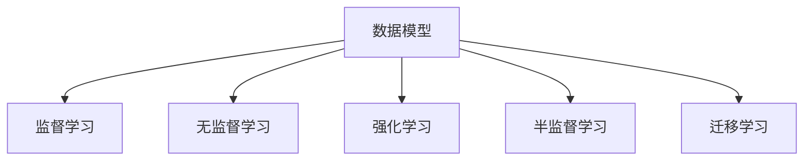

                 

# 丰富模型思维:增强管理者洞悉力

在当今数字化转型的大潮中，数据和计算能力已经成为企业获取竞争优势的重要资产。然而，对于绝大多数管理者和决策者而言，如何从海量数据中提炼出洞见，实现精准决策，仍然是一大挑战。本文将从数据科学的角度，探讨如何通过模型思维，提升管理者的洞悉力和决策质量。

## 1. 背景介绍

### 1.1 问题由来

随着大数据时代的到来，企业面临着前所未有的数据冲击。数据驱动决策已经成为新常态，但对数据的深度理解、分析和应用，却远远超越了传统决策者的能力范围。传统的数据可视化、统计分析等方法，已经无法满足复杂数据环境下的洞见需求。

### 1.2 问题核心关键点

数据模型是数据分析的核心工具，通过构建和应用模型，可以从数据中提取规律，发现趋势，预测未来，实现精准决策。模型思维在数据驱动决策中的应用，主要体现在以下几个方面：

1. **数据采集与整理**：将原始数据转化为模型输入，建立统一的数据规范和标准。
2. **模型构建与训练**：选择合适的模型，利用历史数据进行训练，生成预测和洞见。
3. **模型评估与优化**：对模型性能进行评估，不断调整和优化，提升预测精度。
4. **模型应用与迭代**：将训练好的模型应用到实际业务场景中，持续反馈和优化，实现动态调整。

这些关键步骤构成了一个闭环的模型应用框架，通过不断迭代和优化，管理者和决策者可以逐步提升数据理解和应用的能力。

## 2. 核心概念与联系

### 2.1 核心概念概述

为更好地理解模型思维在管理决策中的应用，本节将介绍几个密切相关的核心概念：

- **数据模型**：用于描述数据特征和关系的数学模型，通过数学公式和算法来分析和预测数据。
- **监督学习**：在已有标注数据下，通过模型学习输入-输出映射，生成预测和洞见。
- **无监督学习**：在没有标注数据的情况下，通过模型发现数据内在结构和规律，实现数据聚类、降维等操作。
- **强化学习**：通过奖励机制，指导模型学习最优决策策略，适用于智能推荐、自动驾驶等场景。
- **半监督学习**：结合有标注数据和无标注数据，利用两者优势，提高模型性能。
- **迁移学习**：将一个领域学习到的知识，迁移到另一个相关领域，实现知识共享和泛化。

这些概念之间的逻辑关系可以通过以下Mermaid流程图来展示：



这个流程图展示了一些关键数据科学概念及其之间的关系：

1. 数据模型是所有学习范式的基础，包括监督、无监督、强化和半监督学习。
2. 监督学习通过标注数据训练模型，生成预测。
3. 无监督学习在无标注数据下发现规律，适用于探索性分析。
4. 强化学习通过奖励机制指导模型学习最优策略。
5. 半监督学习结合两种数据类型，提高模型性能。
6. 迁移学习在不同领域间共享知识，实现知识泛化。

## 3. 核心算法原理 & 具体操作步骤
### 3.1 算法原理概述

模型思维的核心在于通过数据模型，提取、分析和预测数据，生成有价值的洞见。这一过程大致分为以下几个步骤：

1. **数据采集与整理**：收集相关数据，进行清洗、去重、标准化等预处理操作。
2. **特征工程**：选择和构造能够反映数据特征的变量，提高模型预测准确性。
3. **模型构建与训练**：选择合适的模型，利用训练数据进行模型参数的优化。
4. **模型评估与优化**：在测试集上评估模型性能，根据评估结果不断调整模型参数，提升预测精度。
5. **模型应用与迭代**：将训练好的模型应用于实际业务场景，持续收集反馈，优化模型。

### 3.2 算法步骤详解

以监督学习为例，具体步骤可以进一步细化为：

1. **数据准备**：收集训练数据，进行清洗和标准化，转化为模型输入。
2. **特征选择**：选择对目标变量影响较大的特征，构建特征矩阵。
3. **模型选择**：根据任务特点选择适当的监督学习模型，如线性回归、决策树、随机森林等。
4. **模型训练**：利用训练数据对模型进行参数优化，生成预测模型。
5. **模型评估**：在测试集上评估模型性能，计算误差指标，如均方误差、准确率等。
6. **模型应用**：将训练好的模型应用于新数据，进行预测和洞见生成。
7. **模型迭代**：根据反馈不断调整和优化模型，提升预测精度。

### 3.3 算法优缺点

模型思维在决策支持中的应用，有以下优点：

1. **提高决策质量**：模型可以系统性地分析数据，提取规律和洞见，提高决策的科学性和准确性。
2. **可解释性强**：通过模型解释和可视化，管理者可以更好地理解数据和预测结果。
3. **自动化分析**：模型自动化处理大量数据，减少人工干预，提高效率。
4. **易于迭代优化**：模型可以持续收集反馈，进行动态调整，不断优化预测效果。

同时，模型思维也存在一些局限性：

1. **数据质量要求高**：模型的性能依赖于高质量的数据输入，数据噪声和错误会影响模型预测。
2. **模型复杂度高**：复杂的模型可能导致过拟合，影响泛化能力。
3. **需要专业知识**：构建和优化模型需要专业知识，非专业人士难以操作。
4. **模型理解门槛**：模型往往比较复杂，理解和使用需要时间和学习成本。

尽管存在这些局限性，但模型思维在管理决策中的应用，已经显示出其巨大的潜力和价值。通过系统学习和应用模型思维，管理者可以显著提升数据理解和应用的能力，实现更科学、精准的决策。

### 3.4 算法应用领域

模型思维在多个领域的应用已经得到了验证，以下是一些典型应用场景：

1. **市场营销**：通过市场数据分析模型，预测消费者行为，实现精准营销和销售策略优化。
2. **客户服务**：利用客户行为预测模型，实现个性化推荐和服务，提升客户满意度。
3. **供应链管理**：通过需求预测模型，优化库存管理和供应链流程，降低运营成本。
4. **金融风险管理**：利用信用评分模型，评估客户信用风险，实现风险控制和精准授信。
5. **人力资源管理**：通过员工绩效预测模型，优化招聘和绩效管理，提升人力资源效率。
6. **智能制造**：通过生产预测模型，优化生产计划和资源配置，提升制造效率和质量。

这些应用场景展示了模型思维在提升企业管理和决策质量方面的巨大潜力。

## 4. 数学模型和公式 & 详细讲解  
### 4.1 数学模型构建

数据模型的核心是数学公式和算法，用于描述和预测数据。以下是一些常见的数据模型和其基本公式：

- **线性回归模型**：用于描述因变量与自变量之间的线性关系，公式为：$Y = \beta_0 + \beta_1X_1 + \ldots + \beta_pX_p + \epsilon$。
- **逻辑回归模型**：用于二分类问题，输出概率值，公式为：$P(Y=1|X) = \frac{1}{1+\exp(-\beta_0 - \beta_1X_1 - \ldots - \beta_pX_p)}$。
- **决策树模型**：通过树形结构进行决策，公式为：$Tree(T,X) = \max_{\hat{X}} \sum_{\hat{y}} P(\hat{y}|\hat{X})$。
- **随机森林模型**：多个决策树的集成，公式为：$Forest(F,X) = \sum_{i=1}^{n} \max_{\hat{y}_i} P(\hat{y}_i|X)$。
- **支持向量机模型**：利用最大间隔分割数据，公式为：$\min_{w,b} \frac{1}{2}\|w\|^2 + C\sum_{i=1}^{n} \max\{0,1-y_i(w^T\phi(x_i)+b)\}$。

这些模型公式展示了数据科学中常见的数学工具和算法，用于描述和预测数据。

### 4.2 公式推导过程

以线性回归模型为例，其推导过程如下：

假设有一组样本数据 $(x_1,y_1),(x_2,y_2),\ldots,(x_n,y_n)$，其中 $x_1,x_2,\ldots,x_n$ 为自变量，$y_1,y_2,\ldots,y_n$ 为因变量。线性回归模型假设因变量与自变量之间存在线性关系，即：

$$
y = \beta_0 + \beta_1x_1 + \ldots + \beta_px_p + \epsilon
$$

其中 $\beta_0,\beta_1,\ldots,\beta_p$ 为模型参数，$\epsilon$ 为误差项。

根据最小二乘法，通过最小化误差平方和 $\sum_{i=1}^{n}(y_i - \hat{y}_i)^2$，可以求解模型参数 $\beta_0,\beta_1,\ldots,\beta_p$：

$$
\hat{\beta} = (X^TX)^{-1}X^Ty
$$

其中 $X = \begin{bmatrix} 1 & x_{11} & \ldots & x_{1p} \\ 1 & x_{21} & \ldots & x_{2p} \\ \vdots & \vdots & \ddots & \vdots \\ 1 & x_{n1} & \ldots & x_{np} \end{bmatrix}$，$y = \begin{bmatrix} y_1 \\ y_2 \\ \vdots \\ y_n \end{bmatrix}$，$\hat{y} = \begin{bmatrix} \hat{y}_1 \\ \hat{y}_2 \\ \vdots \\ \hat{y}_n \end{bmatrix}$。

通过上述推导，可以看到，线性回归模型的参数求解依赖于数据的特征和样本数量，可以通过训练数据自动求解，生成预测模型。

### 4.3 案例分析与讲解

以某电商平台的数据为例，展示线性回归模型在预测用户购买行为中的应用。假设该电商平台收集了用户的历史购买记录和特征数据，包括年龄、性别、购物频次、购买金额等，希望预测用户未来的购买行为。

1. **数据准备**：收集用户购买记录和特征数据，进行清洗和标准化处理，转化为模型输入。
2. **特征选择**：选择对购买行为影响较大的特征，如年龄、购物频次等。
3. **模型选择**：选择线性回归模型，利用训练数据对模型参数进行优化。
4. **模型训练**：利用训练数据对模型进行参数优化，生成预测模型。
5. **模型评估**：在测试集上评估模型性能，计算误差指标，如均方误差。
6. **模型应用**：将训练好的模型应用于新用户数据，进行购买行为预测。
7. **模型迭代**：根据预测结果和反馈，不断调整和优化模型，提升预测精度。

## 5. 项目实践：代码实例和详细解释说明
### 5.1 开发环境搭建

在进行模型思维实践前，我们需要准备好开发环境。以下是使用Python进行Scikit-Learn开发的环境配置流程：

1. 安装Anaconda：从官网下载并安装Anaconda，用于创建独立的Python环境。

2. 创建并激活虚拟环境：
```bash
conda create -n sklearn-env python=3.8 
conda activate sklearn-env
```

3. 安装Scikit-Learn：
```bash
pip install scikit-learn
```

4. 安装各类工具包：
```bash
pip install numpy pandas matplotlib scikit-learn statsmodels matplotlib 
```

完成上述步骤后，即可在`sklearn-env`环境中开始模型思维实践。

### 5.2 源代码详细实现

下面我们以线性回归模型为例，给出使用Scikit-Learn库进行数据模型构建和训练的Python代码实现。

```python
from sklearn.linear_model import LinearRegression
from sklearn.metrics import mean_squared_error
from sklearn.model_selection import train_test_split

# 加载数据
X = df[['age', 'shopping_frequency']]
y = df['purchase_amount']
X_train, X_test, y_train, y_test = train_test_split(X, y, test_size=0.2, random_state=42)

# 创建模型
model = LinearRegression()

# 训练模型
model.fit(X_train, y_train)

# 评估模型
y_pred = model.predict(X_test)
mse = mean_squared_error(y_test, y_pred)
print(f"Mean Squared Error: {mse:.2f}")
```

以上代码展示了使用Scikit-Learn库构建和训练线性回归模型的基本流程。

### 5.3 代码解读与分析

让我们再详细解读一下关键代码的实现细节：

**train_test_split函数**：
- 用于将数据集划分为训练集和测试集，参数test_size和random_state用于设置划分数和随机种子，确保结果的可重复性。

**LinearRegression类**：
- 用于创建线性回归模型，fit方法用于训练模型，predict方法用于生成预测。

**mean_squared_error函数**：
- 用于计算测试集上的均方误差，评估模型预测性能。

**代码实现**：
- 首先，加载数据集，进行特征选择和数据划分。
- 创建线性回归模型，并利用训练数据进行模型训练。
- 在测试集上生成预测，并计算均方误差，评估模型性能。

可以看到，Scikit-Learn库提供了便捷高效的模型构建和评估工具，使得模型思维的实践变得相对简单。

当然，工业级的系统实现还需考虑更多因素，如模型参数调优、超参数搜索、模型应用接口等。但核心的模型思维和构建流程基本与此类似。

## 6. 实际应用场景
### 6.1 智能客服系统

智能客服系统利用数据模型进行客户需求预测和智能调度，提升了客户服务质量和效率。通过收集客户历史对话记录和反馈数据，训练预测模型，可以实现对客户需求的快速响应和精准匹配，提升客户满意度。

具体而言，可以构建基于机器学习的客户行为预测模型，对客户的需求进行预测和分类。根据预测结果，智能客服系统可以自动分配最优客服人员，提供个性化服务，提升服务质量。

### 6.2 智能推荐系统

智能推荐系统通过数据模型进行用户行为分析和产品推荐，提升了用户满意度和转化率。通过收集用户浏览、点击、购买等行为数据，训练推荐模型，可以实现对用户兴趣的精准匹配和推荐。

具体而言，可以构建基于协同过滤和矩阵分解的推荐模型，对用户行为进行分析和建模，生成个性化推荐列表。通过不断优化推荐算法和模型，可以实现更精准的推荐效果，提升用户体验。

### 6.3 金融风险管理

金融风险管理利用数据模型进行信用评估和风险控制，提升了金融机构的运营效率和风险控制能力。通过收集客户历史交易记录和信用信息，训练风险模型，可以实现对客户信用风险的精准评估和控制。

具体而言，可以构建基于逻辑回归和决策树的信用评估模型，对客户信用进行综合评估。通过不断优化模型和调整信用政策，可以实现更精准的风险控制，提升金融机构的运营效率。

### 6.4 未来应用展望

随着数据科学和模型思维的不断发展，数据模型将在更多领域得到应用，为传统行业带来变革性影响。

在智慧医疗领域，基于数据模型的医疗诊断和治疗方案推荐，提升了医疗服务的智能化水平，辅助医生诊疗，提升治疗效果。

在智能教育领域，利用数据模型进行学生行为分析和个性化教学，因材施教，提升教学效果和学生满意度。

在智慧城市治理中，基于数据模型的城市事件监测和应急响应，提高了城市管理的自动化和智能化水平，构建更安全、高效的未来城市。

此外，在企业生产、社会治理、文娱传媒等众多领域，基于数据模型的智能决策系统也将不断涌现，为经济社会发展注入新的动力。

## 7. 工具和资源推荐
### 7.1 学习资源推荐

为了帮助开发者系统掌握模型思维的理论基础和实践技巧，这里推荐一些优质的学习资源：

1. 《数据科学实战》系列博文：由数据科学专家撰写，深入浅出地介绍了数据模型构建、特征工程、模型训练和评估等基本概念和技术。

2. 《Python数据科学手册》书籍：全面介绍了Python在数据科学中的应用，涵盖Scikit-Learn、Pandas等常用工具，适合初学者入门。

3. Coursera《机器学习》课程：斯坦福大学开设的机器学习课程，系统讲解了数据模型构建和应用，包括监督、无监督、强化学习等范式。

4. Kaggle平台：全球最大的数据科学竞赛平台，提供大量数据集和算法竞赛，帮助你快速提升数据建模能力。

5. Weights & Biases：模型训练的实验跟踪工具，可以记录和可视化模型训练过程中的各项指标，方便对比和调优。

通过对这些资源的学习实践，相信你一定能够快速掌握模型思维的精髓，并用于解决实际的业务问题。

### 7.2 开发工具推荐

高效的开发离不开优秀的工具支持。以下是几款用于模型思维开发的常用工具：

1. Jupyter Notebook：开源的交互式编程环境，支持Python、R等语言，提供丰富的可视化功能，适合数据分析和模型构建。

2. Scikit-Learn：Python数据科学库，提供了丰富的模型和算法，支持数据预处理、模型训练、评估和优化等功能，适合数据建模和分析。

3. TensorFlow：由Google主导开发的深度学习框架，支持复杂的模型构建和训练，适合大规模数据建模任务。

4. PyTorch：基于Python的深度学习框架，灵活动态的计算图，适合快速迭代研究。

5. Tableau：数据可视化工具，支持拖放操作，适合数据探索和模型评估。

合理利用这些工具，可以显著提升模型思维的开发效率，加快创新迭代的步伐。

### 7.3 相关论文推荐

模型思维的研究源于学界的持续研究。以下是几篇奠基性的相关论文，推荐阅读：

1. 《机器学习：一种方法论》书籍：全面介绍了机器学习的理论基础和应用方法，适合初学者入门。

2. 《统计学习方法》书籍：介绍了统计学习的基本原理和方法，涵盖监督、无监督和强化学习等范式。

3. 《深度学习》书籍：介绍了深度学习的基本原理和算法，适合对深度学习感兴趣的研究者。

4. 《数据挖掘与统计学习基础》书籍：系统讲解了数据挖掘和统计学习的基本原理和方法，适合进阶学习。

这些论文代表了大数据科学和模型思维的发展脉络。通过学习这些前沿成果，可以帮助研究者把握学科前进方向，激发更多的创新灵感。

## 8. 总结：未来发展趋势与挑战
### 8.1 总结

本文对数据模型在企业管理和决策中的应用进行了全面系统的介绍。首先阐述了模型思维在数据驱动决策中的重要性，明确了模型思维在提升企业管理和决策质量方面的独特价值。其次，从原理到实践，详细讲解了数据模型的构建和应用流程，给出了模型思维任务开发的完整代码实例。同时，本文还广泛探讨了模型思维在多个行业领域的应用前景，展示了模型思维的巨大潜力。

通过本文的系统梳理，可以看到，数据模型在提升企业管理和决策质量方面的巨大潜力和价值。未来，伴随数据科学和模型思维的持续演进，数据模型必将在更多领域得到应用，为企业管理和决策带来深刻变革。

### 8.2 未来发展趋势

展望未来，数据模型将在多个领域得到应用，为传统行业带来变革性影响。

1. **人工智能与数据模型的结合**：结合人工智能技术和数据模型，可以实现更精准、智能的决策支持。例如，通过深度学习对数据进行预处理和特征提取，提升模型预测精度。

2. **大数据技术的应用**：随着大数据技术的发展，数据模型可以处理更大规模、更复杂的数据集，提升模型性能和应用效果。例如，利用大数据技术进行数据清洗、去重和标准化，提升模型输入质量。

3. **云计算技术的应用**：云计算技术提供了更强大的计算和存储能力，支持大规模数据模型的训练和应用。例如，通过云平台进行模型训练和推理，降低计算成本，提升模型应用效率。

4. **边缘计算技术的应用**：边缘计算技术可以在本地设备上进行数据模型训练和推理，提升模型响应速度和安全性。例如，通过边缘计算设备进行实时数据处理和模型推理，提升系统效率。

5. **区块链技术的应用**：区块链技术可以提供透明、可信的数据来源，提升数据模型的可信度和安全性。例如，通过区块链技术进行数据采集和存储，保障数据安全和隐私保护。

以上趋势展示了数据模型在提升企业管理和决策质量方面的巨大潜力。这些方向的探索发展，必将进一步提升数据模型的性能和应用范围，为企业管理和决策带来深刻变革。

### 8.3 面临的挑战

尽管数据模型在企业管理和决策中的应用已经取得了显著成效，但在迈向更加智能化、普适化应用的过程中，它仍面临诸多挑战：

1. **数据质量问题**：数据模型依赖高质量的数据输入，数据噪声和错误会影响模型预测。如何从海量数据中筛选出高质量数据，提升数据质量，是一个亟待解决的问题。

2. **模型复杂性问题**：复杂的模型可能导致过拟合，影响泛化能力。如何设计简单有效的模型，提升模型泛化能力，是一个重要的研究方向。

3. **模型理解问题**：模型往往比较复杂，理解和使用需要时间和学习成本。如何通过简化模型和优化算法，提升模型理解和应用效果，是一个重要的研究方向。

4. **模型解释问题**：模型输出缺乏可解释性，难以进行业务理解和决策支持。如何通过模型解释和可视化，提升模型应用效果，是一个重要的研究方向。

5. **模型鲁棒性问题**：模型面对数据分布变化时，可能出现预测错误。如何提高模型鲁棒性，避免模型过拟合和泛化能力不足，是一个重要的研究方向。

6. **模型安全问题**：模型可能受到攻击，导致数据泄露和模型滥用。如何保障模型安全和隐私保护，是一个重要的研究方向。

这些挑战需要学界和产业界共同努力，不断优化和提升模型思维的技术和方法，才能实现更加智能化、普适化的企业管理和决策支持。

### 8.4 研究展望

未来，数据模型在企业管理和决策中的应用将更加广泛和深入。以下是一些研究展望：

1. **自适应学习技术**：结合自适应学习技术，实现模型动态调整和优化，提升模型应用效果。

2. **多模态数据融合**：结合多模态数据，提升模型对复杂数据的理解和预测能力。

3. **模型集成与优化**：通过模型集成和优化，提升模型的性能和泛化能力，实现更精准的决策支持。

4. **模型解释与可视化**：通过模型解释和可视化，提升模型的应用效果和业务理解，实现更透明的决策支持。

5. **模型鲁棒性提升**：通过提升模型鲁棒性，提升模型的泛化能力和应用效果，实现更可靠的决策支持。

这些研究方向展示了数据模型在提升企业管理和决策质量方面的巨大潜力。这些方向的探索发展，必将进一步提升数据模型的性能和应用范围，为企业管理和决策带来深刻变革。

## 9. 附录：常见问题与解答

**Q1：数据模型是否适用于所有企业决策场景？**

A: 数据模型在多数企业决策场景中具有广泛的应用潜力。但某些特定场景下，如高风险金融决策、敏感信息处理等，需要结合领域知识和专家经验，才能实现最佳决策。

**Q2：如何选择合适的数据模型？**

A: 选择合适的数据模型需要综合考虑多个因素，如数据类型、任务特点、应用场景等。可以采用模型对比和实验验证的方式，选择最优模型。

**Q3：数据模型是否需要进行持续优化？**

A: 数据模型需要根据业务需求和数据变化进行持续优化，以提升模型性能和应用效果。持续优化包括模型参数调优、模型评估和优化等环节。

**Q4：数据模型如何保障数据隐私和安全性？**

A: 数据模型需要采用数据加密、访问控制等技术，保障数据隐私和安全性。同时，需要对模型输出进行限制和监管，防止模型滥用和数据泄露。

**Q5：数据模型是否需要与业务系统集成？**

A: 数据模型需要与业务系统集成，才能实现实时数据处理和决策支持。合理设计API接口和数据接口，可以提升模型应用效果和业务协同效率。

通过本文的系统梳理，可以看到，数据模型在提升企业管理和决策质量方面的巨大潜力和价值。未来，伴随数据科学和模型思维的持续演进，数据模型必将在更多领域得到应用，为企业管理和决策带来深刻变革。相信通过学界和产业界的共同努力，数据模型必将在提升企业管理和决策质量方面发挥更大作用，推动企业管理和决策科学化的进程。

---

作者：禅与计算机程序设计艺术 / Zen and the Art of Computer Programming

