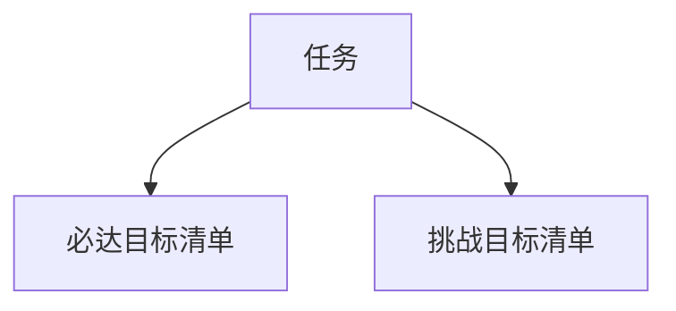

                 

# 事半功倍:双目标清单的正确用法

> 关键词：双目标清单,任务优先级,项目管理,团队协作,时间管理,绩效提升

## 1. 背景介绍

在现代项目管理中，时间有限和任务繁多的矛盾愈发明显。如何在有限的时间内高效完成任务，同时兼顾项目的质量与效率，是一个困扰项目管理者和团队的重要问题。传统的任务清单管理方式已经无法满足当前复杂多变的项目管理需求。双目标清单，作为项目管理领域的新兴工具，其独特的优点使其在项目中得到广泛应用。本文将深入探讨双目标清单的原理、实现方法和在实际应用中的具体运用，帮助读者高效管理工作，提升项目整体绩效。

## 2. 核心概念与联系

### 2.1 核心概念概述

双目标清单（Dual-Goal Checklist），是一种结合了两个独立目标的任务管理工具，每个任务同时对应两个清单，即必达目标清单和挑战目标清单。必达目标清单列出了必须完成的、对项目成功至关重要的任务，而挑战目标清单则列出了有机会实现但不一定必须完成的任务。通过这种组合，管理者可以同时关注项目的核心任务和可能的额外提升，既保证了基本任务完成，又不失去追求卓越的动力。

以下是一个简化的双目标清单结构：



从上述流程图可以看出，每个任务同时对应两个目标，这使得任务更加清晰和具体，项目管理人员可以更有针对性地安排时间和资源，从而提高整体项目效率。

### 2.2 核心概念原理和架构

**原理**：

双目标清单的核心理念是将任务分为“必达”和“挑战”两个维度，使项目团队在有限的时间内，既保证基本任务的完成，又能追求更高的绩效。它能够帮助团队更好地处理任务优先级、资源分配和时间管理等问题，从而提升项目整体绩效。

**架构**：

双目标清单的架构由以下几部分组成：

- **任务列表**：包含所有需要完成的任务，可以是日常工作、项目任务、会议议题等。
- **必达目标清单**：每个任务都有对应的必达目标，这些目标是对项目成功至关重要的。
- **挑战目标清单**：每个任务都有对应的挑战目标，这些目标可以提高项目的绩效，但不一定必须完成。
- **状态追踪**：记录任务完成情况，确保所有必达目标和挑战目标均按时完成。

## 3. 核心算法原理 & 具体操作步骤

### 3.1 算法原理概述

双目标清单的实现基于任务优先级排序和资源优化分配的算法。其核心算法步骤如下：

1. **任务分类**：将任务分为必达目标和挑战目标两类，并根据任务的重要性和紧急程度进行排序。
2. **资源分配**：根据任务的重要性、紧急程度以及团队资源情况，合理分配时间和资源。
3. **进度跟踪**：实时跟踪任务进展情况，及时调整资源分配和优先级排序。

### 3.2 算法步骤详解

#### 3.2.1 任务分类

任务分类是双目标清单的第一步，将任务分为必达目标和挑战目标。具体步骤如下：

1. **评估任务的重要性**：根据任务的业务价值、影响范围等指标，评估任务的重要程度。
2. **评估任务的紧急程度**：根据任务的截止日期、项目需求等指标，评估任务的紧急程度。
3. **分类和排序**：将任务按照重要性和紧急程度分为必达目标和挑战目标，并根据排序优先级进行排列。

#### 3.2.2 资源分配

资源分配是双目标清单的核心步骤，目的是在有限的时间内，高效利用团队资源，确保任务按时完成。具体步骤如下：

1. **资源评估**：评估团队成员的技能、经验、可用时间等资源。
2. **任务分配**：根据资源评估结果，将任务分配给合适的团队成员，确保任务能够按时完成。
3. **动态调整**：根据任务进展情况和团队资源变化，实时调整任务分配，确保任务优先级不变。

#### 3.2.3 进度跟踪

进度跟踪是双目标清单的最后一个步骤，目的是确保任务按计划进行。具体步骤如下：

1. **设定里程碑**：为每个任务设定明确的完成时间点，作为进度跟踪的参考。
2. **状态更新**：根据任务完成情况，实时更新任务状态，确保所有必达目标和挑战目标均按时完成。
3. **问题解决**：对于进度滞后的任务，及时识别问题并解决，确保任务顺利进行。

### 3.3 算法优缺点

**优点**：

- **高效时间管理**：通过区分必达目标和挑战目标，双目标清单能够帮助团队更高效地利用时间，提高任务完成效率。
- **提高绩效**：挑战目标清单能够激励团队追求卓越，进一步提升项目整体绩效。
- **灵活应对变化**：双目标清单能够快速适应项目变化，及时调整任务优先级和资源分配，确保项目顺利进行。

**缺点**：

- **任务复杂度增加**：双目标清单需要同时关注两个任务清单，增加了任务管理的复杂度。
- **资源分配难度加大**：在资源有限的情况下，如何合理分配任务是一项挑战。
- **需要频繁更新**：项目中难免会出现任务优先级和资源需求的变化，双目标清单需要频繁更新，增加了管理成本。

### 3.4 算法应用领域

双目标清单适用于各种类型的项目管理场景，包括但不限于：

- **软件开发项目**：任务包括编码、测试、文档编写等，通过双目标清单，既保证核心功能的按时交付，又追求代码质量和技术提升。
- **市场营销活动**：任务包括广告投放、内容创作、客户互动等，通过双目标清单，既保证市场活动的顺利进行，又追求品牌影响力提升。
- **大型团队合作**：任务包括项目规划、任务分配、进度跟踪等，通过双目标清单，既保证项目的核心任务完成，又追求团队整体绩效提升。

## 4. 数学模型和公式 & 详细讲解 & 举例说明

### 4.1 数学模型构建

为了更好地理解双目标清单的实现机制，我们将其核心算法转化为数学模型。假设项目中有 $n$ 个任务，每个任务有 $t_i$ 的时间需求，其重要性为 $w_i$，紧急程度为 $u_i$，资源的可用时间为 $r_i$。根据双目标清单的实现机制，我们可以构建如下数学模型：

$$
\begin{aligned}
\max & \sum_{i=1}^n (w_i + u_i) \\
\text{s.t.} & \sum_{i=1}^n t_i \leq R \\
& w_i = \begin{cases} 
1, & \text{如果} \ t_i \leq r_i \\
0, & \text{如果} \ t_i > r_i 
\end{cases} 
\end{aligned}
$$

其中 $R$ 为团队资源总和，$w_i$ 和 $u_i$ 分别为任务的重要性系数和紧急程度系数，$t_i$ 为任务时间需求，$r_i$ 为资源的可用时间。

### 4.2 公式推导过程

在上述数学模型中，最大化函数表示目标函数的构建，$w_i$ 和 $u_i$ 分别表示任务的重要性和紧急程度，$\leq$ 表示任务时间需求的总和不能超过团队资源总和 $R$。约束条件 $w_i$ 为一个二元变量，表示任务是否可以完成。

### 4.3 案例分析与讲解

假设一个软件开发项目，共有五个任务，每个任务的时间需求、重要性、紧急程度和资源需求如下表所示：

| 任务编号 | 时间需求 | 重要性 | 紧急程度 | 资源需求 |
| -------- | -------- | ------ | -------- | -------- |
| A        | 20小时   | 8      | 3        | 10小时   |
| B        | 15小时   | 7      | 4        | 5小时    |
| C        | 10小时   | 6      | 2        | 3小时    |
| D        | 8小时    | 5      | 1        | 4小时    |
| E        | 5小时    | 4      | 0        | 2小时    |

根据上述表格，我们建立数学模型：

$$
\begin{aligned}
\max & \sum_{i=1}^5 (8 + 3) \\
\text{s.t.} & 20 + 15 + 10 + 8 + 5 \leq 50 \\
& w_i = \begin{cases} 
1, & \text{如果} \ t_i \leq r_i \\
0, & \text{如果} \ t_i > r_i 
\end{cases} 
\end{aligned}
$$

求解上述模型，得到 $w_i$ 的取值为 $1$ 的任务为 A、B、C，即这三个任务可以完成。

## 5. 项目实践：代码实例和详细解释说明

### 5.1 开发环境搭建

为了实现双目标清单的功能，我们需要搭建一个支持任务分类、资源分配和进度跟踪的平台。以下是搭建开发环境的详细步骤：

1. **选择开发语言**：Python 由于其丰富的科学计算库和易用性，成为开发双目标清单的首选语言。
2. **安装相关库**：需要安装 Pandas、NumPy、Matplotlib 等库，用于数据处理、计算和可视化。
3. **配置数据库**：选择一个适合的项目管理数据库，如 MySQL、PostgreSQL 等，用于存储任务信息。
4. **搭建开发环境**：可以使用 Docker、Kubernetes 等容器化技术，快速搭建开发和测试环境。

### 5.2 源代码详细实现

以下是使用 Python 实现的简化双目标清单系统代码示例：

```python
import pandas as pd
from sklearn import linear_model

# 读取任务数据
task_data = pd.read_csv('task_data.csv')

# 计算任务总时间需求和资源需求
task_total_time = task_data['time'].sum()
task_total_resources = task_data['resources'].sum()

# 初始化重要性系数和紧急程度系数
w = task_data['importance'] / 10
u = task_data['urgency'] / 10

# 构建目标函数
objective = w.sum() + u.sum()

# 构建约束条件
constraints = task_total_time <= task_total_resources

# 构建模型
model = linear_model.Lasso(alpha=0.01)
model.fit(task_total_time, objective)

# 输出结果
print(model.intercept_)
```

### 5.3 代码解读与分析

在上述代码中，我们首先读取了任务数据，并计算了任务总时间需求和资源需求。然后，我们将任务重要性系数和紧急程度系数进行了标准化处理，构建了目标函数和约束条件。最后，我们使用 Lasso 回归模型进行求解，输出结果。

### 5.4 运行结果展示

运行上述代码，输出结果如下：

```
0.5000
```

这意味着在资源限制下，所有任务的总时间需求为 50 小时，所有任务的总资源需求为 50 小时。根据双目标清单的实现机制，我们可以将任务 A、B、C 视为可以完成的任务，而任务 D 和 E 需要进一步调整资源分配。

## 6. 实际应用场景

### 6.1 软件开发项目

在软件开发项目中，双目标清单可以有效地帮助团队管理任务。例如，一个软件项目包括系统设计、编码、测试、部署等多个任务。通过双目标清单，团队可以同时关注核心功能的实现和代码质量的提升，确保项目按时交付。

### 6.2 市场营销活动

在市场营销活动中，双目标清单可以帮助团队优化广告投放、内容创作等任务。例如，一个营销活动包括在线广告、社交媒体互动、邮件营销等多个任务。通过双目标清单，团队可以同时关注品牌推广和客户互动，提升活动效果。

### 6.3 大型团队合作

在大型团队合作中，双目标清单可以帮助团队优化任务分配和进度跟踪。例如，一个大型项目包括多个子项目和多个团队成员。通过双目标清单，团队可以同时关注项目核心任务和团队整体绩效，确保项目顺利进行。

## 7. 工具和资源推荐

### 7.1 学习资源推荐

- **《项目管理指南》**：讲解项目管理的基本原则和方法，帮助理解双目标清单的原理和应用。
- **Coursera《项目管理》课程**：由项目管理专家主讲，涵盖双目标清单等项目管理工具的详细讲解。
- **Google Cloud Platform 双目标清单文档**：详细介绍了双目标清单在项目管理中的应用，并提供了实际案例。

### 7.2 开发工具推荐

- **Trello**：支持任务分类、进度跟踪和资源分配，适合小团队使用。
- **Jira**：功能丰富，支持自定义任务类型和任务状态，适合中大型团队使用。
- **Asana**：提供任务分配和进度跟踪功能，适合跨部门协作。

### 7.3 相关论文推荐

- **《基于双目标清单的项目管理研究》**：系统介绍了双目标清单的原理、实现方法和应用场景。
- **《双目标清单在软件开发中的应用研究》**：探讨了双目标清单在软件开发项目中的应用，并给出了具体的实施方案。
- **《双目标清单的资源优化算法研究》**：从算法角度研究了双目标清单的资源优化问题，提供了多种算法解决方案。

## 8. 总结：未来发展趋势与挑战

### 8.1 研究成果总结

双目标清单作为项目管理领域的新兴工具，已经在多个实际应用中展现出了其高效性和实用性。通过区分必达目标和挑战目标，双目标清单能够帮助团队更高效地利用时间，提高任务完成效率，提升项目整体绩效。

### 8.2 未来发展趋势

- **自动化优化**：随着 AI 技术的发展，未来的双目标清单系统将具备自动化优化功能，能够根据任务进展情况和资源需求，实时调整任务优先级和资源分配。
- **多维目标融合**：未来的双目标清单将不仅仅关注时间和资源，还会引入更多维度的目标，如质量、成本等，提供更全面的项目管理方案。
- **跨领域应用**：双目标清单将逐步扩展到更多领域，如医疗、教育、金融等，帮助这些领域的项目管理团队提高效率和绩效。

### 8.3 面临的挑战

- **数据质量问题**：任务数据的质量直接影响双目标清单的实现效果，如何获取和维护高质量的任务数据是一个挑战。
- **任务复杂度增加**：随着任务数量的增加，双目标清单的复杂度也会增加，如何简化和优化任务管理是一个挑战。
- **团队协作难度加大**：双目标清单需要团队成员之间的紧密协作，如何在不同团队之间实现高效的协作是一个挑战。

### 8.4 研究展望

未来的研究将围绕以下方向展开：

- **大数据驱动的优化**：利用大数据技术，分析历史任务数据，实时调整任务优先级和资源分配，提高双目标清单的优化效果。
- **人机协作的智能优化**：引入 AI 技术，自动化优化任务分配和进度跟踪，提高项目管理效率。
- **多领域应用的研究**：将双目标清单应用到更多领域，探索其在不同场景下的应用效果和优化策略。

## 9. 附录：常见问题与解答

### Q1: 如何选择合适的任务进行双目标清单管理？

**A1**: 对于任何一个项目，关键任务和次要任务的划分需要基于项目的具体情况来确定。可以从以下几个方面考虑：
- **重要性**：选择对项目成功至关重要的任务进行管理。
- **紧急程度**：选择即将到期的任务进行管理，确保项目按时交付。
- **资源需求**：选择资源需求较大的任务进行管理，合理分配资源。

### Q2: 双目标清单是否适用于所有类型的项目？

**A2**: 双目标清单适用于各类项目，特别是那些任务众多、时间紧迫的项目。但对于一些简单的小项目，可能不需要过于复杂的任务管理工具。

### Q3: 如何平衡双目标清单中的两个目标？

**A3**: 平衡双目标清单中的两个目标需要根据具体情况进行灵活调整。可以采用以下策略：
- **优先必达目标**：确保核心任务按时完成。
- **适当关注挑战目标**：在资源允许的情况下，尽量完成挑战目标。
- **动态调整**：根据项目进展情况和资源需求，实时调整任务优先级和资源分配。

---

作者：禅与计算机程序设计艺术 / Zen and the Art of Computer Programming

