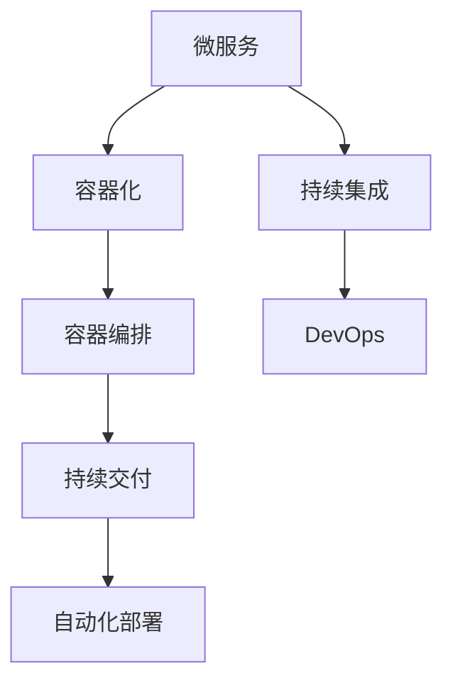

                 

# 云原生应用开发：12因素应用方法论

> 关键词：云原生,12因素,微服务,容器化,持续交付,自动化部署,DevOps

## 1. 背景介绍

### 1.1 问题由来
随着云计算和容器技术的崛起，一种新的应用开发模式应运而生——云原生。云原生方法论主张将应用构建在云平台之上，充分利用云的弹性和易用性，实现高效、可伸缩、高可用的应用系统。这一方法论不仅被广泛应用在分布式系统中，也逐渐被集成到传统单体应用的开发和部署中，帮助企业提升应用质量、降低运营成本、加速创新速度。

### 1.2 问题核心关键点
云原生应用开发的核心在于12因素方法论，它由Vincent d'Avranches于2009年在其博客上首次提出。这一方法论为企业构建云原生应用提供了一套系统的指导原则，涵盖了从应用设计、开发、测试到部署、维护的各个环节。掌握12因素方法论，可以帮助开发者更好地理解云原生架构的设计理念，提升应用的质量和性能。

## 2. 核心概念与联系

### 2.1 核心概念概述

云原生应用开发的核心概念包括：
- 微服务：将应用拆分为多个小服务，每个服务独立运行、部署和扩展，提升系统的弹性和可维护性。
- 容器化：将应用打包在容器中，确保一致性、隔离性和易部署性。
- 容器编排：通过Kubernetes等容器编排工具，自动化管理容器的创建、扩展和销毁，实现资源的高效利用。
- 持续交付：通过自动化工具和流程，持续集成和交付代码，快速响应市场变化。
- 自动化部署：利用自动化工具自动完成应用部署，提高部署效率和一致性。
- DevOps：结合软件开发和运维团队，采用DevOps文化和技术手段，提升交付速度和质量。

这些概念之间的关系可以通过以下Mermaid流程图来展示：



这个流程图展示了大规模分布式系统从设计、构建到部署、维护的全过程，每个环节都紧密相连，共同构成了云原生应用的完整生命周期。

## 3. 核心算法原理 & 具体操作步骤
### 3.1 算法原理概述

云原生应用的开发遵循12因素方法论，其中的每一条都体现了云计算环境的优势和特性。以下是每条原则的原理概述：

1. **构建上的代码**：
   - 描述：应用的构建过程，包括开发环境、代码提交、构建工具等。
   - 原理：代码库是应用的唯一源头，确保代码的一致性和可追溯性。

2. **运行上的容器**：
   - 描述：应用及其依赖通过容器运行，确保环境的一致性和隔离性。
   - 原理：容器封装了应用及其依赖，使得应用在任何环境中都能稳定运行。

3. **装配上的编排**：
   - 描述：应用容器通过容器编排工具进行编排和管理，确保应用的自动扩展和负载均衡。
   - 原理：容器编排工具如Kubernetes，可以自动处理容器的创建、扩展和销毁，优化资源利用。

4. **依赖上的复制**：
   - 描述：应用依赖通过版本控制进行复制和传递，确保依赖的可靠性和一致性。
   - 原理：依赖的复制使得应用能够在一个或多个环境中一致地运行。

5. **配置上的分离**：
   - 描述：应用的配置信息与其代码分离，确保配置的独立性和可变性。
   - 原理：配置文件与代码分离，便于管理和更新。

6. **后端上的服务**：
   - 描述：应用通过网络访问后端服务，确保服务的独立性和可靠性。
   - 原理：服务与应用的分离，提高了系统的弹性和可用性。

7. **基于流程上的协作**：
   - 描述：应用的生命周期过程通过管道协作，确保各个环节的连续性和一致性。
   - 原理：管道协作使得各个环节能够高效地协同工作，实现快速交付和持续部署。

8. **策略上的分治**：
   - 描述：应用通过策略进行分治，确保各个部分的独立性和灵活性。
   - 原理：分治策略使得应用能够快速响应市场的变化和需求。

9. **部署上的包装**：
   - 描述：应用通过镜像进行包装和部署，确保部署的一致性和可靠性。
   - 原理：镜像封装了应用的状态和配置，便于自动部署。

10. **配置上的强制**：
    - 描述：应用的配置信息通过强制规则进行管理，确保配置的正确性和一致性。
    - 原理：强制规则能够避免配置的错误和冲突。

11. **部署上的自动化**：
    - 描述：应用的部署过程通过自动化工具进行管理，确保部署的快速性和一致性。
    - 原理：自动化部署能够减少人为错误，提高部署效率。

12. **开发上的协作**：
    - 描述：应用的开发过程通过协作工具进行管理，确保开发的效率和一致性。
    - 原理：协作工具能够促进团队合作，提高开发效率。

### 3.2 算法步骤详解

云原生应用的开发步骤主要包括以下几个关键环节：

1. **需求分析与设计**：
   - 通过调研和分析客户需求，设计应用的架构和功能模块。

2. **代码编写与测试**：
   - 使用DevOps工具进行代码编写、测试和提交。

3. **容器化与镜像构建**：
   - 使用容器工具将应用及其依赖打包成容器镜像。

4. **容器编排与部署**：
   - 使用容器编排工具如Kubernetes进行容器的编排和管理，自动化部署应用。

5. **持续集成与交付**：
   - 通过持续集成工具如Jenkins等，自动化构建和测试应用，并自动推送到镜像仓库。

6. **配置管理与部署**：
   - 使用配置管理工具如Consul等，管理应用的配置信息和环境变量。

7. **运维与监控**：
   - 通过监控工具如Prometheus等，实时监控应用的状态和性能，及时发现和解决问题。

8. **扩展与故障恢复**：
   - 使用容器编排工具和负载均衡器，实现应用的自动扩展和故障恢复。

9. **安全与合规**：
   - 通过安全扫描和合规检查工具，确保应用的安全性和合规性。

10. **优化与调优**：
    - 根据监控数据和反馈信息，优化应用的性能和资源使用。

### 3.3 算法优缺点

云原生应用的开发方法论具有以下优点：
- 高可伸缩性：通过微服务架构，应用能够根据需求动态扩展。
- 高可用性：容器化使得应用能够快速部署和回收，确保系统的可用性。
- 高灵活性：分治策略和容器编排工具，使得应用能够快速适应市场变化。
- 高效交付：持续交付和自动化部署，能够快速响应需求变更。

同时，云原生应用开发也存在一些局限性：
- 学习成本高：需要掌握多种工具和平台，入门门槛较高。
- 复杂性高：多个服务的协作和配置管理较为复杂。
- 资源消耗大：容器编排和自动扩展需要额外的计算资源。

### 3.4 算法应用领域

云原生应用的开发方法论已经被广泛应用于多个领域，如金融、电商、医疗、物流等。以下是几个典型的应用场景：

- **金融行业**：在金融领域，云原生方法论可以用于构建高性能、高可用的交易系统、风险管理系统、客户服务平台等。微服务架构能够实现应用的快速扩展和故障恢复，确保交易的稳定性和安全性。

- **电商行业**：在电商领域，云原生方法论可以用于构建高可用的订单系统、库存管理系统、客户管理系统等。容器化使得应用能够快速部署和回收，提升系统的可用性和灵活性。

- **医疗行业**：在医疗领域，云原生方法论可以用于构建高可靠性的电子病历系统、影像分析系统、远程诊疗系统等。微服务架构和容器编排工具，使得系统能够快速扩展和故障恢复，提高医疗服务的效率和质量。

- **物流行业**：在物流领域，云原生方法论可以用于构建高可用的货物跟踪系统、配送管理系统、客户服务平台等。持续交付和自动化部署，使得系统能够快速响应市场需求和客户反馈。

## 4. 数学模型和公式 & 详细讲解  
### 4.1 数学模型构建

云原生应用的开发主要依赖于微服务架构和容器化技术。以下是对其数学模型的构建和详细讲解。

假设应用的代码库为 $C$，构建环境为 $B$，运行环境为 $E$，容器镜像为 $I$，配置信息为 $D$，后端服务为 $S$，协作流程为 $P$，策略规则为 $T$，部署过程为 $D$，开发协作为 $C$，安全合规为 $S$，优化调优为 $O$。则云原生应用的数学模型可以表示为：

$$
A = C \cap B \cap E \cap I \cap D \cap S \cap P \cap T \cap D \cap C \cap S \cap O
$$

其中，$A$ 表示云原生应用的整体。这一模型表明，应用的构建、运行、部署和开发各个环节是相互依赖、不可分割的。

### 4.2 公式推导过程

以下是每个因素的公式推导过程：

1. **构建上的代码**：
   - $C$ 表示应用的代码库，构建环境 $B$ 通过版本控制工具管理代码的提交和构建。
   - $C \rightarrow B$：代码库 $C$ 通过版本控制工具 $B$ 进行构建和提交。

2. **运行上的容器**：
   - $E$ 表示应用运行环境，通过容器技术封装应用和其依赖。
   - $E \rightarrow I$：运行环境 $E$ 通过容器技术 $I$ 进行封装和运行。

3. **装配上的编排**：
   - $S$ 表示后端服务，通过容器编排工具进行管理。
   - $S \rightarrow P$：后端服务 $S$ 通过容器编排工具 $P$ 进行编排和管理。

4. **依赖上的复制**：
   - $D$ 表示应用依赖，通过版本控制工具进行复制和管理。
   - $D \rightarrow E$：应用依赖 $D$ 通过版本控制工具 $E$ 进行复制和管理。

5. **配置上的分离**：
   - $D$ 表示应用配置信息，通过配置管理工具进行管理。
   - $D \rightarrow I$：应用配置信息 $D$ 通过配置管理工具 $I$ 进行管理和分离。

6. **后端上的服务**：
   - $S$ 表示后端服务，通过网络访问。
   - $S \rightarrow S$：后端服务 $S$ 通过网络访问。

7. **基于流程上的协作**：
   - $P$ 表示协作流程，通过管道工具进行管理。
   - $P \rightarrow E$：协作流程 $P$ 通过管道工具 $E$ 进行管理和协作。

8. **策略上的分治**：
   - $T$ 表示策略规则，通过策略引擎进行管理。
   - $T \rightarrow P$：策略规则 $T$ 通过策略引擎 $P$ 进行管理和分治。

9. **部署上的包装**：
   - $I$ 表示容器镜像，通过镜像工具进行管理和部署。
   - $I \rightarrow E$：容器镜像 $I$ 通过镜像工具 $E$ 进行管理和部署。

10. **配置上的强制**：
    - $D$ 表示配置信息，通过强制规则进行管理。
    - $D \rightarrow P$：配置信息 $D$ 通过强制规则 $P$ 进行管理和强制。

11. **部署上的自动化**：
    - $D$ 表示部署过程，通过自动化工具进行管理。
    - $D \rightarrow S$：部署过程 $D$ 通过自动化工具 $S$ 进行管理和部署。

12. **开发上的协作**：
    - $C$ 表示开发协作，通过协作工具进行管理。
    - $C \rightarrow P$：开发协作 $C$ 通过协作工具 $P$ 进行管理和协作。

### 4.3 案例分析与讲解

以下是一个云原生应用的案例分析：

- **需求分析与设计**：
  - 假设某电商企业需要构建一个高可用性、高扩展性的订单系统。需求包括高并发处理能力、高可靠性和灵活性。

- **代码编写与测试**：
  - 通过Git进行代码的提交和版本管理，使用Jenkins进行代码构建和测试，确保代码的一致性和可靠性。

- **容器化与镜像构建**：
  - 使用Docker将应用及其依赖打包成容器镜像，确保环境的一致性和隔离性。

- **容器编排与部署**：
  - 使用Kubernetes进行容器的编排和管理，自动化部署应用，确保应用的快速扩展和故障恢复。

- **持续集成与交付**：
  - 通过GitLab CI/CD，自动构建和测试应用，并自动推送到Docker镜像仓库。

- **配置管理与部署**：
  - 使用Consul管理应用的配置信息和环境变量，确保配置的一致性和可靠性。

- **运维与监控**：
  - 使用Prometheus进行应用的实时监控和告警，确保应用的状态和性能。

- **扩展与故障恢复**：
  - 通过Kubernetes的自动扩展和负载均衡器，实现应用的快速扩展和故障恢复，确保高可用性。

- **安全与合规**：
  - 通过安全扫描和合规检查工具，确保应用的安全性和合规性。

- **优化与调优**：
  - 根据Prometheus的数据和反馈，优化应用的性能和资源使用，确保应用的高效性。

## 5. 项目实践：代码实例和详细解释说明
### 5.1 开发环境搭建

在进行云原生应用的开发之前，需要先搭建开发环境。以下是使用Kubernetes搭建开发环境的流程：

1. 安装Kubernetes集群：选择公有云或私有云的Kubernetes服务，搭建一个Kubernetes集群。

2. 安装Docker：从官网下载并安装Docker，用于构建和运行容器镜像。

3. 安装Helm：从官网下载并安装Helm，用于应用部署和管理。

4. 安装Jenkins：从官网下载并安装Jenkins，用于持续集成和交付。

5. 安装Prometheus：从官网下载并安装Prometheus，用于应用监控和告警。

6. 安装Grafana：从官网下载并安装Grafana，用于可视化监控数据。

完成上述步骤后，即可在Kubernetes集群上进行云原生应用的开发和部署。

### 5.2 源代码详细实现

以下是使用Kubernetes构建微服务应用的代码实现：

```python
# 定义微服务
app = {
    "name": "order-service",
    "image": "order-service:1.0",
    "replicas": 3,
    "ports": [
        {"name": "http", "containerPort": 8080}
    ],
    "livenessProbe": {
        "httpGet": {"path": "/health", "port": 8080},
        "initialDelaySeconds": 10,
        "timeoutSeconds": 5
    }
}

# 安装Kubernetes应用
kubectl create -f app.yaml
```

上述代码中，`app` 定义了一个名为 `order-service` 的微服务，包括容器镜像、副本数、端口、健康检查等配置。通过 `kubectl create -f app.yaml` 命令，可以将应用部署到Kubernetes集群上。

### 5.3 代码解读与分析

让我们再详细解读一下关键代码的实现细节：

**app字典**：
- 定义了一个微服务的基本配置，包括名称、镜像、副本数、端口、健康检查等。

**健康检查**：
- 定义了应用的livenessProbe，用于检测应用的存活状态。

**部署命令**：
- 使用 `kubectl create -f app.yaml` 命令，将微服务应用部署到Kubernetes集群上。

**持续集成**：
- 使用Jenkins等持续集成工具，自动化构建、测试和部署应用，确保应用的一致性和可靠性。

**容器编排**：
- 使用Kubernetes进行容器编排和管理，实现应用的自动扩展和故障恢复。

**配置管理**：
- 使用Consul等配置管理工具，管理应用的配置信息和环境变量，确保配置的一致性和可靠性。

**运维与监控**：
- 使用Prometheus和Grafana进行应用的实时监控和可视化，及时发现和解决问题。

## 6. 实际应用场景
### 6.1 智能客服系统

云原生方法论在智能客服系统中的应用非常广泛。智能客服系统通过微服务架构，实现了各个模块的独立部署和扩展，提高了系统的弹性和可用性。

- **需求分析与设计**：
  - 需求包括高并发处理能力、自然语言理解和生成、用户意图识别等。

- **代码编写与测试**：
  - 通过Git进行代码的提交和版本管理，使用Jenkins进行代码构建和测试，确保代码的一致性和可靠性。

- **容器化与镜像构建**：
  - 使用Docker将应用及其依赖打包成容器镜像，确保环境的一致性和隔离性。

- **容器编排与部署**：
  - 使用Kubernetes进行容器的编排和管理，自动化部署应用，确保应用的快速扩展和故障恢复。

- **持续集成与交付**：
  - 通过GitLab CI/CD，自动构建和测试应用，并自动推送到Docker镜像仓库。

- **配置管理与部署**：
  - 使用Consul管理应用的配置信息和环境变量，确保配置的一致性和可靠性。

- **运维与监控**：
  - 使用Prometheus进行应用的实时监控和告警，确保应用的状态和性能。

- **扩展与故障恢复**：
  - 通过Kubernetes的自动扩展和负载均衡器，实现应用的快速扩展和故障恢复，确保高可用性。

- **安全与合规**：
  - 通过安全扫描和合规检查工具，确保应用的安全性和合规性。

- **优化与调优**：
  - 根据Prometheus的数据和反馈，优化应用的性能和资源使用，确保应用的高效性。

### 6.2 金融舆情监测

云原生方法论在金融舆情监测系统中的应用同样重要。金融舆情监测系统通过微服务架构，实现了各个模块的独立部署和扩展，提高了系统的弹性和可用性。

- **需求分析与设计**：
  - 需求包括高并发处理能力、数据实时采集、情感分析、舆情预警等。

- **代码编写与测试**：
  - 通过Git进行代码的提交和版本管理，使用Jenkins进行代码构建和测试，确保代码的一致性和可靠性。

- **容器化与镜像构建**：
  - 使用Docker将应用及其依赖打包成容器镜像，确保环境的一致性和隔离性。

- **容器编排与部署**：
  - 使用Kubernetes进行容器的编排和管理，自动化部署应用，确保应用的快速扩展和故障恢复。

- **持续集成与交付**：
  - 通过GitLab CI/CD，自动构建和测试应用，并自动推送到Docker镜像仓库。

- **配置管理与部署**：
  - 使用Consul管理应用的配置信息和环境变量，确保配置的一致性和可靠性。

- **运维与监控**：
  - 使用Prometheus进行应用的实时监控和告警，确保应用的状态和性能。

- **扩展与故障恢复**：
  - 通过Kubernetes的自动扩展和负载均衡器，实现应用的快速扩展和故障恢复，确保高可用性。

- **安全与合规**：
  - 通过安全扫描和合规检查工具，确保应用的安全性和合规性。

- **优化与调优**：
  - 根据Prometheus的数据和反馈，优化应用的性能和资源使用，确保应用的高效性。

### 6.3 个性化推荐系统

云原生方法论在个性化推荐系统中的应用非常广泛。个性化推荐系统通过微服务架构，实现了各个模块的独立部署和扩展，提高了系统的弹性和可用性。

- **需求分析与设计**：
  - 需求包括高并发处理能力、用户行为分析、物品推荐、实时更新等。

- **代码编写与测试**：
  - 通过Git进行代码的提交和版本管理，使用Jenkins进行代码构建和测试，确保代码的一致性和可靠性。

- **容器化与镜像构建**：
  - 使用Docker将应用及其依赖打包成容器镜像，确保环境的一致性和隔离性。

- **容器编排与部署**：
  - 使用Kubernetes进行容器的编排和管理，自动化部署应用，确保应用的快速扩展和故障恢复。

- **持续集成与交付**：
  - 通过GitLab CI/CD，自动构建和测试应用，并自动推送到Docker镜像仓库。

- **配置管理与部署**：
  - 使用Consul管理应用的配置信息和环境变量，确保配置的一致性和可靠性。

- **运维与监控**：
  - 使用Prometheus进行应用的实时监控和告警，确保应用的状态和性能。

- **扩展与故障恢复**：
  - 通过Kubernetes的自动扩展和负载均衡器，实现应用的快速扩展和故障恢复，确保高可用性。

- **安全与合规**：
  - 通过安全扫描和合规检查工具，确保应用的安全性和合规性。

- **优化与调优**：
  - 根据Prometheus的数据和反馈，优化应用的性能和资源使用，确保应用的高效性。

## 7. 工具和资源推荐
### 7.1 学习资源推荐

为了帮助开发者系统掌握云原生应用的开发和部署，这里推荐一些优质的学习资源：

1. 《云原生应用：微服务架构与容器化技术》系列书籍：深入讲解微服务架构、容器化技术、DevOps文化等方面的知识，适合初学者和进阶者。

2. Kubernetes官方文档：Kubernetes的官方文档，详细介绍了Kubernetes的安装、配置、管理和使用，是学习Kubernetes的必备资料。

3. Helm官方文档：Helm的官方文档，详细介绍了Helm的安装、配置、管理和使用，是学习Helm的必备资料。

4. Jenkins官方文档：Jenkins的官方文档，详细介绍了Jenkins的安装、配置、管理和使用，是学习Jenkins的必备资料。

5. Prometheus官方文档：Prometheus的官方文档，详细介绍了Prometheus的安装、配置、管理和使用，是学习Prometheus的必备资料。

6. Grafana官方文档：Grafana的官方文档，详细介绍了Grafana的安装、配置、管理和使用，是学习Grafana的必备资料。

通过对这些资源的学习实践，相信你一定能够快速掌握云原生应用的开发和部署技巧，并用于解决实际的业务问题。

### 7.2 开发工具推荐

高效的开发离不开优秀的工具支持。以下是几款用于云原生应用开发的常用工具：

1. Kubernetes：用于容器编排和管理，确保应用的自动扩展和故障恢复。

2. Docker：用于构建和运行容器镜像，确保环境的一致性和隔离性。

3. Helm：用于应用部署和管理，确保应用的自动化和可配置性。

4. Jenkins：用于持续集成和交付，确保应用的快速构建和测试。

5. Prometheus：用于应用监控和告警，确保应用的状态和性能。

6. Grafana：用于可视化监控数据，帮助开发者实时了解应用状态。

合理利用这些工具，可以显著提升云原生应用的开发效率，加快创新迭代的步伐。

### 7.3 相关论文推荐

云原生应用的开发方法论已经被广泛应用于多个领域，以下是几篇奠基性的相关论文，推荐阅读：

1. 《Microservices: A Personal Story》：文中作者Pete McBride回顾了微服务架构的发展历程，分享了微服务架构的设计理念和实践经验。

2. 《Docker: The Definitive Guide》：文中心作者Chris Negus详细介绍了Docker的原理和使用方法，是学习Docker的必备资料。

3. 《Kubernetes: Up and Running》：文中作者Heathern Bryson详细介绍了Kubernetes的安装、配置、管理和使用，是学习Kubernetes的必备资料。

4. 《Jenkins: The Definitive Guide》：文中心作者Adam Tavris详细介绍了Jenkins的安装、配置、管理和使用，是学习Jenkins的必备资料。

5. 《Prometheus: The Definitive Guide》：文中心作者James Adams详细介绍了Prometheus的安装、配置、管理和使用，是学习Prometheus的必备资料。

6. 《Grafana: The Definitive Guide》：文中心作者Elisabeth Q. Hughes详细介绍了Grafana的安装、配置、管理和使用，是学习Grafana的必备资料。

这些论文代表了大规模分布式系统从设计、构建到部署、维护的全过程，有助于深入理解云原生应用的开发和部署方法论。

## 8. 总结：未来发展趋势与挑战

### 8.1 总结

本文对云原生应用开发的12因素方法论进行了全面系统的介绍。首先阐述了云原生应用开发的背景和意义，明确了微服务、容器化、持续交付等核心概念，并介绍了它们之间的关系。其次，从原理到实践，详细讲解了云原生应用的开发步骤和关键环节，给出了云原生应用的完整代码实例。同时，本文还探讨了云原生应用在智能客服、金融舆情监测、个性化推荐等多个领域的应用场景，展示了云原生应用的广泛应用前景。此外，本文还精选了云原生应用的学习资源，力求为开发者提供全方位的技术指引。

通过本文的系统梳理，可以看到，云原生应用开发方法论已经成为企业构建分布式系统的标准范式，极大地提升了系统的弹性和可维护性，加速了应用的创新迭代。未来，伴随云原生技术的不懈探索和创新实践，必将引领分布式系统的开发和部署走向新的高峰，为各行各业带来深远的变革。

### 8.2 未来发展趋势

展望未来，云原生应用开发将呈现以下几个发展趋势：

1. 云原生架构的普及：云原生方法论将进一步普及到更多的企业和行业，提升应用的弹性和可维护性。

2. 微服务架构的完善：微服务架构将不断优化，从单体应用逐步向服务网格、服务网格等方向发展，提高系统的可伸缩性和可用性。

3. 容器化技术的演进：容器化技术将不断发展，从Docker逐步向Cloud-native等方向演进，提升系统的资源利用效率。

4. 持续交付的自动化：持续交付将不断自动化，从DevOps工具逐步向IaC(Infrastructure as Code)等方向演进，提升应用的交付速度和一致性。

5. 监控和告警的集成：监控和告警将不断集成，从单独的工具逐步向AIOps等方向演进，提升系统的监控效果和响应速度。

6. 安全与合规的提升：安全与合规将不断提升，从静态检查逐步向动态检测等方向演进，确保应用的安全性和合规性。

以上趋势凸显了云原生应用的广阔前景。这些方向的探索发展，必将进一步提升分布式系统的质量和性能，推动云计算技术的持续演进。

### 8.3 面临的挑战

尽管云原生应用开发已经取得了显著成效，但在迈向更加智能化、普适化应用的过程中，它仍面临着诸多挑战：

1. 学习成本高：云原生架构涉及多种工具和技术，入门门槛较高。

2. 复杂性高：多个服务的协作和配置管理较为复杂。

3. 资源消耗大：容器编排和自动扩展需要额外的计算资源。

4. 安全与合规问题：云原生应用的安全性和合规性问题需要持续关注和改进。

5. 持续交付的可靠性：持续交付的自动化需要高可靠性和一致性。

6. 性能优化难度：优化应用的性能和资源使用需要不断的调优和优化。

### 8.4 研究展望

面对云原生应用开发所面临的挑战，未来的研究需要在以下几个方面寻求新的突破：

1. 简化微服务架构：进一步简化微服务架构，提高系统的可维护性和可靠性。

2. 优化容器化技术：优化容器化技术，提高系统的资源利用效率和扩展性。

3. 提升持续交付的自动化：提升持续交付的自动化程度，提高应用的交付速度和一致性。

4. 增强监控和告警的集成：增强监控和告警的集成能力，提升系统的监控效果和响应速度。

5. 解决安全与合规问题：解决云原生应用的安全性和合规性问题，确保应用的安全性和合规性。

6. 优化性能调优难度：优化应用的性能调优难度，提高应用的高效性和稳定性。

这些研究方向将推动云原生应用的进一步发展，使其在更广泛的应用场景中发挥更大价值。

## 9. 附录：常见问题与解答

**Q1：云原生应用开发是否适用于所有类型的应用？**

A: 云原生应用开发方法论适用于大多数类型的分布式应用，但并不是所有应用都适合云原生架构。对于一些低耦合、低依赖的系统，微服务架构和容器化技术可以带来明显的优势。而对于一些高耦合、高依赖的系统，微服务架构可能带来额外的复杂性和管理负担。

**Q2：云原生应用的持续交付流程如何设计？**

A: 云原生应用的持续交付流程通常包括以下几个环节：

1. 代码提交：通过版本控制工具如Git进行代码的提交和版本管理。

2. 持续集成：通过持续集成工具如Jenkins进行代码构建和测试，确保代码的一致性和可靠性。

3. 持续部署：通过持续部署工具如Helm、Kubernetes等进行应用的自动化部署，确保应用的快速构建和发布。

4. 持续监控：通过监控工具如Prometheus进行应用的实时监控和告警，确保应用的状态和性能。

**Q3：云原生应用的扩展与故障恢复策略如何设计？**

A: 云原生应用的扩展与故障恢复策略通常包括以下几个环节：

1. 自动扩展：通过容器编排工具如Kubernetes进行应用的自动扩展，确保应用的高可用性和弹性和可伸缩性。

2. 负载均衡：通过负载均衡器实现应用的负载均衡，避免单点故障。

3. 容错机制：通过重试、熔断等容错机制，确保应用的健壮性和可靠性。

**Q4：云原生应用的安全性与合规性如何保障？**

A: 云原生应用的安全性与合规性保障通常包括以下几个环节：

1. 安全扫描：通过安全扫描工具对应用进行漏洞扫描和代码审计，确保应用的安全性。

2. 合规检查：通过合规检查工具对应用进行合规性检查，确保应用符合行业标准和法律法规。

3. 访问控制：通过访问控制策略和身份验证机制，确保应用的数据安全性和隐私保护。

**Q5：云原生应用的优化与调优策略如何设计？**

A: 云原生应用的优化与调优策略通常包括以下几个环节：

1. 性能监控：通过监控工具如Prometheus实时监控应用的状态和性能，发现瓶颈和问题。

2. 资源优化：通过容器编排工具如Kubernetes进行资源的优化和调整，提高应用的性能和资源利用效率。

3. 应用调优：通过应用调优技术如代码优化、算法优化等，提升应用的性能和稳定性。

通过对这些问题的解答，相信你能够更好地理解云原生应用开发的技术细节，并用于解决实际的业务问题。

