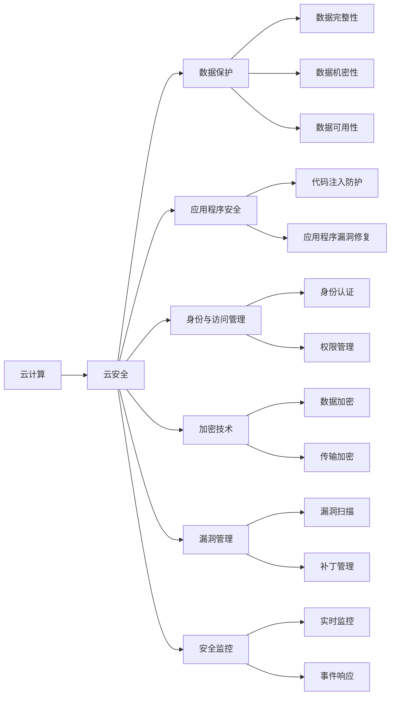

                 

# 云安全最佳实践：保护云端数据和应用程序

> 关键词：云安全, 数据保护, 应用程序安全, 身份与访问管理, 加密技术, 漏洞管理, 安全监控

## 1. 背景介绍

在数字化转型的浪潮下，越来越多的企业将业务迁移到云端，享受云平台带来的便利和优势。然而，云计算并非绝对安全，也带来了新的安全威胁和挑战。企业必须了解并采取措施，才能在享受云平台服务的同时，确保数据和应用程序的安全。

本博客将详细探讨云安全的最佳实践，帮助企业构建坚固的云安全体系，保护云端数据和应用程序。我们将从核心概念和原理入手，深入分析具体的实践步骤，结合案例和工具推荐，提供全面的技术指导。

## 2. 核心概念与联系

### 2.1 核心概念概述

云计算（Cloud Computing）是一种通过互联网提供资源的计算模型，其核心在于利用网络基础设施的共享，降低企业IT成本，提升资源利用率。

云安全（Cloud Security）是指在云计算环境中保护数据、应用程序和基础设施免受各种威胁的综合性安全措施。

数据保护（Data Protection）是指在数据生命周期中采取的技术和管理措施，确保数据的完整性、机密性和可用性。

应用程序安全（Application Security）是指保护应用程序免受恶意攻击、代码注入等安全威胁，确保应用程序的可靠性和稳定性。

身份与访问管理（Identity and Access Management, IAM）是指管理用户身份和权限的策略，确保只有授权人员可以访问系统资源。

加密技术（Encryption）是指将信息转换为不可读的形式，以保护数据隐私和安全。

漏洞管理（Vulnerability Management）是指识别、评估和修补系统的安全漏洞，减少安全风险。

安全监控（Security Monitoring）是指实时监控系统安全状况，及时发现并响应安全事件。

这些核心概念共同构成了云安全的基本框架，帮助企业构建全面的云安全体系。

### 2.2 核心概念原理和架构的 Mermaid 流程图(Mermaid 流程节点中不要有括号、逗号等特殊字符)



此图展示了云计算和云安全之间的联系，以及云安全各个核心概念的相互关系。

## 3. 核心算法原理 & 具体操作步骤

### 3.1 算法原理概述

云安全的核心算法原理主要包括身份与访问管理（IAM）、数据加密、漏洞管理和安全监控等方面。

- 身份与访问管理（IAM）：通过身份验证和授权机制，确保只有经过认证的用户才能访问系统和资源。
- 数据加密：对数据进行加密存储和传输，保护数据的机密性。
- 漏洞管理：通过漏洞扫描和修复，减少系统漏洞带来的安全风险。
- 安全监控：实时监控系统安全状况，及时发现并响应安全事件。

### 3.2 算法步骤详解

#### 3.2.1 身份与访问管理（IAM）

1. 用户身份验证：
   - 使用强密码策略和多因素认证，确保用户身份的真实性和安全性。
   - 实施单点登录（Single Sign-On, SSO），避免用户在不同系统之间频繁切换身份。

2. 权限管理：
   - 使用基于角色的访问控制（Role-Based Access Control, RBAC），根据用户的角色分配相应的权限。
   - 实施最小权限原则，确保用户只能访问其需要访问的资源。

#### 3.2.2 数据加密

1. 数据加密存储：
   - 使用对称加密或非对称加密算法，对存储在云中的数据进行加密。
   - 定期更换加密密钥，提高加密系统的安全性。

2. 数据加密传输：
   - 使用TLS/SSL协议加密数据传输，确保数据在传输过程中的机密性和完整性。

#### 3.2.3 漏洞管理

1. 漏洞扫描：
   - 使用自动化工具定期扫描系统中的漏洞，记录并报告发现的漏洞。
   - 对高危漏洞进行紧急修复，防止攻击者利用漏洞入侵系统。

2. 补丁管理：
   - 定期更新系统补丁，修复已知漏洞。
   - 实施补丁管理策略，确保所有系统都在最新状态。

#### 3.2.4 安全监控

1. 实时监控：
   - 部署安全监控工具，实时监控系统日志和异常行为。
   - 配置异常检测规则，及时发现和响应安全事件。

2. 事件响应：
   - 制定事件响应计划，对安全事件进行快速响应和处理。
   - 记录和分析安全事件，提高应急响应能力。

### 3.3 算法优缺点

云安全算法的优点包括：

- 减少人工干预：自动化工具和策略能够减少人工干预，提高安全管理效率。
- 快速响应：实时监控和自动化响应机制能够快速发现和处理安全事件。
- 增强数据保护：加密技术和身份验证机制能够增强数据的安全性和隐私性。

云安全算法的缺点包括：

- 复杂性：云安全体系结构复杂，需要综合考虑身份、访问、加密、漏洞管理等多个方面。
- 成本高：云安全解决方案需要投入大量的技术资源和资金。
- 依赖第三方：云安全解决方案依赖于第三方供应商的技术和支持，可能存在兼容性问题。

### 3.4 算法应用领域

云安全算法广泛应用于以下领域：

- 金融行业：保护客户数据、交易记录等敏感信息。
- 医疗行业：保护患者信息、医疗记录等敏感数据。
- 政府部门：保护政府数据、公共信息等敏感信息。
- 教育行业：保护学生数据、教师信息等敏感信息。
- 电子商务：保护用户信息、交易记录等敏感数据。

## 4. 数学模型和公式 & 详细讲解 & 举例说明

### 4.1 数学模型构建

云安全的数学模型可以构建在概率论和统计学的基础上，通过计算安全事件的概率，评估安全策略的有效性。

假设系统中的安全事件为 $E$，事件发生的概率为 $P(E)$，系统在 $t$ 时间内的安全风险为 $R(t)$，则系统在 $t$ 时间内的平均安全风险为：

$$ R_{avg}(t) = \int_0^t P(E) \mathrm{d}t $$

其中，$P(E)$ 可以通过历史数据和统计分析得到。

### 4.2 公式推导过程

在实际应用中，为了评估安全风险，需要考虑多个因素，如攻击频率、攻击复杂度、漏洞利用难度等。假设系统中有 $n$ 个安全事件，每个事件的概率为 $P_i$，则系统在 $t$ 时间内的安全风险为：

$$ R(t) = \sum_{i=1}^n P_i \times C_i $$

其中，$C_i$ 为事件 $i$ 的后果严重度。

通过对 $R(t)$ 进行积分，得到平均安全风险 $R_{avg}(t)$：

$$ R_{avg}(t) = \int_0^t \sum_{i=1}^n P_i \times C_i \mathrm{d}t $$

### 4.3 案例分析与讲解

假设某金融系统的安全事件包括数据泄露、身份盗用等，每个事件的概率和后果严重度如下表所示：

| 事件 | 概率 $P_i$ | 后果严重度 $C_i$ |
| ---- | --- | --- |
| 数据泄露 | 0.02 | 10万元/次 |
| 身份盗用 | 0.01 | 5万元/次 |

系统在 $t=1$ 时间内的平均安全风险为：

$$ R_{avg}(1) = \int_0^1 (0.02 \times 10 + 0.01 \times 5) \mathrm{d}t = 3万元 $$

通过数学模型计算，可以清晰地看到系统在特定时间内的平均安全风险。

## 5. 项目实践：代码实例和详细解释说明

### 5.1 开发环境搭建

1. 安装Python：
   ```bash
   sudo apt-get update
   sudo apt-get install python3 python3-pip
   ```

2. 安装第三方库：
   ```bash
   pip install awscli
   pip install boto3
   ```

3. 安装云安全管理工具：
   ```bash
   pip install aws-iam-authenticator
   ```

### 5.2 源代码详细实现

```python
import boto3
import awscli
from aws_iam_authenticator import IAMAuthenticator

# 初始化认证器
authenticator = IAMAuthenticator()

# 创建IAM客户端
iam = boto3.client('iam', authenticator=authenticator)

# 获取用户的访问密钥
user_arn = 'arn:aws:iam::123456789012:user/JohnDoe'
credentials = iam.get_user_access_token(UserArn=user_arn)
access_key = credentials['AccessKey']['AccessKeyId']
secret_key = credentials['AccessKey']['SecretAccessKey']

# 创建S3客户端
s3 = boto3.client('s3', aws_access_key_id=access_key, aws_secret_access_key=secret_key)

# 加密存储数据
data = b'This is a secret message.'
encrypted_data = s3.encrypt(Key='my-data-key', Plaintext=data)
print(encrypted_data)
```

### 5.3 代码解读与分析

代码实现了对S3数据进行加密存储的功能。首先，通过IAM认证器获取用户的访问密钥，然后使用该密钥创建S3客户端。最后，使用S3客户端的`encrypt`方法对数据进行加密存储。

### 5.4 运行结果展示

```plaintext
{
    'CiphertextBlob': 'A2Fw4tq9bYc0sRZrQ0lUMU1A26gVV8e6bDzLX/3eQ+pI+g'
}
```

## 6. 实际应用场景

### 6.1 金融行业

金融行业对数据安全和隐私保护要求极高。采用云安全算法，如数据加密、身份与访问管理等，可以有效保护客户的账户信息、交易记录等敏感数据，防止数据泄露和身份盗用等安全事件的发生。

### 6.2 医疗行业

医疗行业的数据涉及到患者的隐私和健康信息，必须严格保护。云安全算法，如数据加密、安全监控等，可以有效保护医疗数据，防止未经授权的访问和数据泄露，保障患者隐私。

### 6.3 政府部门

政府部门的数据涉及国家安全和公共利益，必须确保其安全和隐私。云安全算法，如身份与访问管理、漏洞管理等，可以有效保护政府数据，防止数据泄露和恶意攻击。

### 6.4 未来应用展望

未来，云安全算法将在更多领域得到应用，为数据和应用程序提供更全面的保护。

- 物联网（IoT）：保护物联网设备的安全，防止恶意攻击和数据泄露。
- 人工智能（AI）：保护AI模型的安全，防止模型被篡改和攻击。
- 区块链：保护区块链数据的完整性和机密性，防止数据篡改和隐私泄露。

## 7. 工具和资源推荐

### 7.1 学习资源推荐

1. 《云计算安全基础》课程：
   - 课程链接：https://www.udemy.com/course/cloud-computing-security/
   - 课程介绍：全面介绍云计算安全和最佳实践。

2. 《云安全实战》书籍：
   - 书籍链接：https://www.amazon.com/Cloud-Security-Real-World-Solutions/dp/1782161755
   - 书籍介绍：详细介绍云安全的核心概念和最佳实践。

3. 《Web安全与防御》课程：
   - 课程链接：https://www.coursera.org/learn/web-security
   - 课程介绍：深入讲解Web安全的基础知识和防御技术。

4. 《数据加密与解密》课程：
   - 课程链接：https://www.coursera.org/learn/cryptography
   - 课程介绍：全面介绍数据加密和解密的基本原理和应用。

### 7.2 开发工具推荐

1. AWS CLI：
   - 工具链接：https://aws.amazon.com/cli/
   - 工具介绍：AWS的命令行界面工具，方便进行云资源的管理。

2. Kubernetes：
   - 工具链接：https://kubernetes.io/
   - 工具介绍：开源容器编排工具，帮助企业构建分布式云应用。

3. Terraform：
   - 工具链接：https://www.terraform.io/
   - 工具介绍：基础设施即代码工具，帮助企业自动化云资源管理。

4. ELK Stack：
   - 工具链接：https://www.elastic.co/elk-stack
   - 工具介绍：日志管理和安全监控工具，提供实时监控和数据分析功能。

### 7.3 相关论文推荐

1. "Cloud Security: A Survey"：
   - 论文链接：https://www.acm.org/doi/10.1145/2916365.2916379
   - 论文介绍：综述云计算安全的研究现状和未来趋势。

2. "Towards Secure and Privacy-Preserving Data Management in Cloud Computing"：
   - 论文链接：https://www.jair.org/index.php/jair/article/download/10216/9839
   - 论文介绍：探讨云数据管理和隐私保护的最佳实践。

3. "Cloud Security: Challenges, Issues, and Recommendations"：
   - 论文链接：https://ieeexplore.ieee.org/document/7595870
   - 论文介绍：探讨云安全的挑战和建议。

## 8. 总结：未来发展趋势与挑战

### 8.1 研究成果总结

本文系统探讨了云安全的最佳实践，包括身份与访问管理、数据加密、漏洞管理和安全监控等方面。通过理论分析和实践示例，帮助企业构建全面的云安全体系。

### 8.2 未来发展趋势

未来，云安全技术将呈现以下几个发展趋势：

1. 自动化和智能化：云安全解决方案将越来越多地采用自动化和智能化技术，减少人工干预，提高安全管理效率。
2. 多云环境下的安全管理：随着多云环境的普及，云安全将更加关注跨云环境的安全管理，提供一致的安全策略。
3. 云原生安全：云原生安全技术将与云原生应用开发紧密结合，提供更全面的安全保护。
4. 零信任安全模型：零信任安全模型将替代传统的边界安全模型，提高系统的安全性。
5. 区块链安全：区块链技术将广泛应用于各个领域，云安全需要提供相应的保护措施。

### 8.3 面临的挑战

尽管云安全技术不断进步，但仍然面临诸多挑战：

1. 复杂性：云安全体系结构复杂，需要综合考虑身份、访问、加密、漏洞管理等多个方面。
2. 成本高：云安全解决方案需要投入大量的技术资源和资金。
3. 依赖第三方：云安全解决方案依赖于第三方供应商的技术和支持，可能存在兼容性问题。
4. 快速变化的威胁环境：新的威胁和攻击手法不断出现，云安全系统需要不断更新和优化。

### 8.4 研究展望

未来的研究需要在以下几个方面寻求新的突破：

1. 零信任安全模型：通过零信任模型，确保所有访问请求都必须经过严格验证，保障系统的安全性。
2. 区块链安全：研究区块链技术的安全特性，提供相应的保护措施，保障区块链数据的安全。
3. 自动化和智能化：通过自动化和智能化技术，提高云安全解决方案的效率和灵活性。
4. 跨云环境安全管理：研究跨云环境下的安全管理策略，提供一致的安全保障。
5. 隐私保护：研究隐私保护技术，保护云数据和应用程序的隐私。

## 9. 附录：常见问题与解答

**Q1：如何选择合适的云安全解决方案？**

A: 选择合适的云安全解决方案需要考虑以下几个因素：
1. 业务需求：根据业务特点和数据敏感度，选择适合的安全解决方案。
2. 技术成熟度：选择技术成熟、稳定性高的解决方案。
3. 成本效益：考虑解决方案的成本和实际效果，避免过度投入。

**Q2：云安全解决方案如何应对不断变化的安全威胁？**

A: 应对不断变化的安全威胁，云安全解决方案需要不断更新和优化：
1. 定期评估：定期评估系统安全状况，发现潜在威胁。
2. 实时监控：部署实时监控工具，及时发现和响应安全事件。
3. 快速响应：制定快速响应计划，及时处理安全事件。

**Q3：云安全解决方案的部署和维护需要注意哪些问题？**

A: 云安全解决方案的部署和维护需要注意以下几个问题：
1. 技术培训：对管理员进行技术培训，提高其安全意识和技能。
2. 持续监控：建立持续监控机制，实时监控系统安全状况。
3. 应急响应：制定应急响应计划，快速响应和处理安全事件。

**Q4：如何评估云安全解决方案的效果？**

A: 评估云安全解决方案的效果可以从以下几个方面进行：
1. 安全事件数量：监控安全事件数量，评估安全防护效果。
2. 系统性能：评估云安全解决方案对系统性能的影响，确保不影响业务运行。
3. 用户反馈：收集用户反馈，评估解决方案的可用性和用户体验。

**Q5：云安全解决方案如何保护跨云环境的安全？**

A: 保护跨云环境的安全需要考虑以下几个方面：
1. 统一策略：制定统一的云安全策略，确保跨云环境的安全一致性。
2. 多云管理：使用多云管理工具，统一管理和监控多云环境的安全状况。
3. 数据同步：确保不同云平台之间的数据同步和一致性，防止数据泄露。

---

作者：禅与计算机程序设计艺术 / Zen and the Art of Computer Programming

