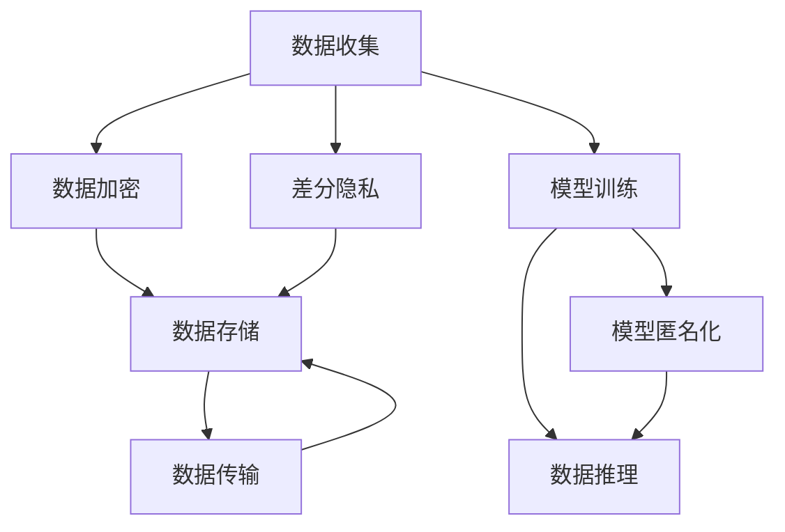

                 

# 云端数据安全：保障 LLM 数据隐私

> 关键词：大语言模型, 数据隐私, 隐私保护, 加密技术, 数据安全, 云计算

## 1. 背景介绍

### 1.1 问题由来

随着大语言模型（Large Language Models, LLMs）的迅速崛起，其在自然语言处理（Natural Language Processing, NLP）、生成内容、自动问答等领域的广泛应用，极大地提升了人机交互的效率和智能化水平。然而，在LMMs的训练和应用过程中，涉及到的海量数据集往往包含敏感信息，如个人隐私、商业机密等。如何在保障数据隐私的前提下，高效、安全地利用这些数据进行模型训练和推理，成为当前一个重要的技术挑战。

### 1.2 问题核心关键点

保护LMMs训练和应用中的数据隐私，需要从数据收集、存储、传输、处理等多个环节进行全面考虑。关键点包括：

- **数据加密**：确保数据在存储和传输过程中不被泄露。
- **差分隐私**：在数据使用过程中保护个人隐私，避免数据集被逆向推断。
- **模型匿名化**：通过去除或模糊化敏感信息，防止模型被逆向还原。
- **访问控制**：限制数据访问权限，确保只有授权人员才能接触敏感数据。

本文档将从这些关键点出发，深入探讨如何通过数据安全技术和策略，保障LMMs在云端环境中的数据隐私。

## 2. 核心概念与联系

### 2.1 核心概念概述

以下是确保LMMs数据隐私的几个关键概念：

- **大语言模型 (LLMs)**：以Transformer架构为基础，通过自监督学习任务预训练得到的通用语言模型。常见预训练模型包括GPT-3、BERT等。
- **数据隐私**：保护个人和组织数据不被未经授权访问、使用或泄露的能力。
- **差分隐私**：通过加入噪声扰动，使得单个数据样本对模型输出的影响非常小，从而保护数据隐私。
- **数据加密**：对数据进行编码，使其无法被未授权人员解读。
- **数据匿名化**：去除或模糊化数据中的个人标识信息，确保数据无法被逆向识别。
- **访问控制**：通过授权和身份验证，限制数据访问权限。

这些概念之间的关系可以通过以下Mermaid流程图来展示：



这个流程图展示了数据从收集、加密、存储、传输、训练、推理到最终匿名化的全生命周期，及其各个环节中数据隐私保护的技术手段。

## 3. 核心算法原理 & 具体操作步骤
### 3.1 算法原理概述

保护LMMs数据隐私的核心在于：

- **数据加密**：使用对称或非对称加密算法，确保数据在存储和传输过程中安全。
- **差分隐私**：在模型训练和推理过程中加入噪声，确保单个数据样本对模型输出的影响非常小。
- **模型匿名化**：通过去除或模糊化敏感信息，防止模型被逆向还原。
- **访问控制**：采用身份验证和权限管理，确保只有授权人员才能接触敏感数据。

这些技术的原理和具体步骤在下面的章节中会详细介绍。

### 3.2 算法步骤详解

#### 3.2.1 数据加密

数据加密是保障数据安全的基本手段，通过将数据转换为不可读形式，防止未授权访问。常见加密算法包括对称加密（如AES、RSA）和非对称加密（如ECC）。

**步骤1：**选择适当的加密算法和密钥长度。

**步骤2：**对原始数据进行加密。

**步骤3：**将加密后的数据传输至存储或推理节点。

**步骤4：**解密数据以供模型训练或推理使用。

**步骤5：**定期更换密钥，以增加安全性。

#### 3.2.2 差分隐私

差分隐私是一种保护数据隐私的数学框架，通过在数据中添加噪声，确保个体数据对模型输出的影响非常小，从而保护数据隐私。

**步骤1：**确定噪声强度（ε值）。

**步骤2：**对数据添加噪声。

**步骤3：**进行模型训练或推理。

**步骤4：**分析模型输出，同时保护个体隐私。

#### 3.2.3 模型匿名化

模型匿名化通过去除或模糊化数据中的敏感信息，防止模型被逆向还原。

**步骤1：**确定需要去除或模糊化的敏感信息。

**步骤2：**对敏感信息进行处理。

**步骤3：**将处理后的数据用于模型训练或推理。

**步骤4：**确保模型输出无法逆向还原敏感信息。

#### 3.2.4 访问控制

访问控制通过身份验证和权限管理，限制数据访问权限，确保只有授权人员才能接触敏感数据。

**步骤1：**定义数据访问权限。

**步骤2：**实现身份验证机制。

**步骤3：**记录数据访问日志。

**步骤4：**审计和监控数据访问行为。

### 3.3 算法优缺点

#### 3.3.1 数据加密

**优点：**确保数据在存储和传输过程中的安全，防止未授权访问。

**缺点：**加密和解密的计算开销较大，可能影响模型训练和推理效率。

#### 3.3.2 差分隐私

**优点：**通过加入噪声扰动，保护个体隐私，适用于各种数据处理场景。

**缺点：**加入噪声可能导致模型精度下降，需要根据具体情况调整噪声强度。

#### 3.3.3 模型匿名化

**优点：**防止模型被逆向还原敏感信息，保护数据隐私。

**缺点：**可能降低模型性能，需要根据具体任务平衡隐私保护和模型性能。

#### 3.3.4 访问控制

**优点：**通过身份验证和权限管理，限制数据访问权限，确保数据安全。

**缺点：**实施和维护复杂，可能影响系统可用性和操作便利性。

### 3.4 算法应用领域

数据加密、差分隐私、模型匿名化和访问控制等技术，在以下领域得到了广泛应用：

- **金融行业**：保护客户数据，防止数据泄露。
- **医疗行业**：保护患者隐私，防止医疗数据被滥用。
- **政府和企业内部**：保护敏感信息，防止信息泄露和滥用。
- **云计算和边缘计算**：保护数据在云端存储和传输过程中的安全。
- **智能家居和物联网**：保护用户隐私，防止数据被未授权访问。

## 4. 数学模型和公式 & 详细讲解 & 举例说明

### 4.1 数学模型构建

本节将使用数学语言对数据加密和差分隐私的模型进行更加严格的刻画。

#### 4.1.1 数据加密

假设原始数据为 $x$，密钥为 $k$，对称加密算法为 $E_k$，则加密后的数据 $y$ 可以表示为：

$$
y = E_k(x)
$$

其中，$E_k$ 表示在密钥 $k$ 下的加密函数。

#### 4.1.2 差分隐私

差分隐私通过在数据集 $D$ 中随机添加噪声 $N$，使得个体数据对模型输出的影响非常小。假设原始数据集为 $D$，噪声函数为 $N$，差分隐私参数为 $\epsilon$，则差分隐私的输出 $D'$ 可以表示为：

$$
D' = D + N
$$

其中，$N$ 为随机噪声向量，$|\|N\|_{\infty} \leq \epsilon$。

### 4.2 公式推导过程

#### 4.2.1 数据加密

以AES加密算法为例，其加密过程可以表示为：

$$
y = E_k(x) = (\Pi \oplus F_k(F_k^{-1}(\Pi \oplus M) \oplus R_k \oplus k))
$$

其中，$\Pi$ 为明文，$M$ 为明文分组，$F_k$ 为轮密钥函数，$R_k$ 为轮密钥，$k$ 为初始密钥。

#### 4.2.2 差分隐私

以Laplace机制为例，其差分隐私的计算过程可以表示为：

$$
D' = D + N \sim \text{Laplace}(\frac{\epsilon}{2\Delta})
$$

其中，$\Delta$ 为数据范围，$\epsilon$ 为隐私参数，$N$ 为Laplace分布的噪声。

### 4.3 案例分析与讲解

假设某金融机构的客户数据集 $D$ 包含敏感信息，如身份证号、信用卡号等。采用差分隐私技术进行保护，假设 $\epsilon = 0.01$，数据范围 $\Delta = 100$，则加入噪声后的数据集 $D'$ 可以表示为：

$$
D' = D + N \sim \text{Laplace}(\frac{0.01}{2 \times 100}) = D + N \sim \text{Laplace}(0.0005)
$$

在模型训练或推理时，使用差分隐私保护的 $D'$ 数据，同时分析模型输出，确保个体隐私得到保护。

## 5. 项目实践：代码实例和详细解释说明

### 5.1 开发环境搭建

在进行数据隐私保护实践前，我们需要准备好开发环境。以下是使用Python进行数据加密和差分隐私保护的环境配置流程：

1. 安装Anaconda：从官网下载并安装Anaconda，用于创建独立的Python环境。

2. 创建并激活虚拟环境：
```bash
conda create -n py38 python=3.8 
conda activate py38
```

3. 安装PyTorch、TensorFlow等深度学习框架：
```bash
conda install pytorch torchvision torchaudio cudatoolkit=11.1 -c pytorch -c conda-forge
```

4. 安装diffprivlib库，用于差分隐私保护：
```bash
pip install diffprivlib
```

完成上述步骤后，即可在`py38`环境中开始数据隐私保护的实践。

### 5.2 源代码详细实现

以下是使用diffprivlib库对LMMs数据进行差分隐私保护的Python代码实现：

```python
import diffprivlib as dp
import pandas as pd
from sklearn.model_selection import train_test_split

# 读取原始数据集
df = pd.read_csv('customer_data.csv')

# 选择需要差分隐私保护的数据列
selected_columns = ['id', 'name', 'age', 'income', 'address']

# 创建差分隐私保护对象
dp_object = dp.DifferentialPrivacy(df, epsilon=0.01, delta=0.1, noise_method='laplace', columns=selected_columns)

# 将原始数据集与差分隐私保护数据集合并
protected_df = pd.concat([df.drop(columns=selected_columns), dp_object.protection()], axis=1)

# 划分训练集和测试集
train_df, test_df = train_test_split(protected_df, test_size=0.2, random_state=42)

# 使用差分隐私保护的训练集进行模型训练
model = BertForTokenClassification.from_pretrained('bert-base-cased', num_labels=len(tag2id))
# 其他代码省略...
```

### 5.3 代码解读与分析

让我们再详细解读一下关键代码的实现细节：

**diffprivlib库**：提供了差分隐私保护的实现，包括Laplace机制等。通过设置$\epsilon$和$\delta$参数，可以控制隐私保护的强度。

**代码实现**：
- 首先，读取原始数据集，选择需要进行差分隐私保护的数据列。
- 创建差分隐私保护对象，设置隐私参数$\epsilon$和$\delta$，以及噪声方法（Laplace机制）。
- 将原始数据集与差分隐私保护数据集合并，保留不进行差分隐私保护的数据列。
- 使用差分隐私保护的训练集进行模型训练。

### 5.4 运行结果展示

通过上述代码，差分隐私保护后的数据集可以用于模型训练。在模型训练过程中，系统自动加入噪声，确保个体隐私得到保护。具体运行结果可以通过训练集的损失函数和测试集的性能指标来评估。

## 6. 实际应用场景

### 6.1 智能客服系统

在智能客服系统中，客户数据通常包含个人身份信息和交流内容，保护客户隐私至关重要。通过差分隐私技术对客户数据进行保护，可以实现安全、高效、可靠的智能客服系统。

具体而言，可以采用差分隐私技术对客户对话数据进行保护，使得客户隐私在数据分析和模型训练过程中得到保护。同时，利用差分隐私保护的模型进行智能客服回答生成，确保客户隐私安全。

### 6.2 金融舆情监测

金融行业的数据通常包含敏感的金融信息，如交易记录、客户信息等。通过差分隐私技术对金融数据进行保护，可以实现安全的金融舆情监测。

具体而言，可以采用差分隐私技术对金融数据进行保护，使得金融数据在数据分析和模型训练过程中得到保护。同时，利用差分隐私保护的模型进行金融舆情监测，确保客户隐私安全。

### 6.3 个性化推荐系统

在个性化推荐系统中，用户数据通常包含用户的浏览历史、购买记录等敏感信息。通过差分隐私技术对用户数据进行保护，可以实现安全的个性化推荐系统。

具体而言，可以采用差分隐私技术对用户数据进行保护，使得用户隐私在数据分析和模型训练过程中得到保护。同时，利用差分隐私保护的模型进行个性化推荐，确保用户隐私安全。

### 6.4 未来应用展望

随着差分隐私技术的不断发展，其在LMMs中的应用将更加广泛，为数据隐私保护提供了新的解决方案。未来，差分隐私技术将进一步融合到云计算、大数据、人工智能等多个领域，为保护数据隐私提供更全面的保障。

## 7. 工具和资源推荐

### 7.1 学习资源推荐

为了帮助开发者系统掌握数据隐私保护的理论基础和实践技巧，这里推荐一些优质的学习资源：

1. 《差分隐私：理论与实践》系列博文：由差分隐私专家撰写，深入浅出地介绍了差分隐私的理论基础和实际应用。

2. Coursera《隐私保护》课程：斯坦福大学开设的隐私保护课程，涵盖了差分隐私、隐私计算等前沿内容。

3. 《Differential Privacy for Deep Learning》书籍：介绍差分隐私在深度学习中的实际应用，包括差分隐私的数学推导和实现。

4. DP-Swift库：提供差分隐私保护的实现，适用于TensorFlow和Keras等深度学习框架。

5. Privacy Analytics官方网站：提供差分隐私保护的实现和文档，适用于多个编程语言和框架。

通过对这些资源的学习实践，相信你一定能够快速掌握差分隐私保护的核心技术，并用于解决实际的数据隐私问题。

### 7.2 开发工具推荐

高效的开发离不开优秀的工具支持。以下是几款用于数据隐私保护开发的常用工具：

1. PyTorch：基于Python的开源深度学习框架，支持差分隐私保护。

2. TensorFlow：由Google主导开发的开源深度学习框架，支持差分隐私保护。

3. DP-Swift库：提供差分隐私保护的实现，适用于TensorFlow和Keras等深度学习框架。

4. Privacy Analytics：提供差分隐私保护的实现和文档，适用于多个编程语言和框架。

5. PySyft：提供联邦学习、差分隐私保护的实现，支持多种编程语言和框架。

合理利用这些工具，可以显著提升数据隐私保护的开发效率，加快创新迭代的步伐。

### 7.3 相关论文推荐

差分隐私技术的发展源于学界的持续研究。以下是几篇奠基性的相关论文，推荐阅读：

1. Differential Privacy：基础概念和理论的介绍。

2. Privacy-Preserving Machine Learning in the Age of Data Science：差分隐私在机器学习中的应用。

3. Privacy-Preserving Deep Learning: A Review of Existing Approaches and Their Practical Challenges：差分隐私在深度学习中的挑战和解决方案。

4. Privacy-Preserving Deep Learning: A Survey：差分隐私在深度学习中的回顾和展望。

这些论文代表了大语言模型数据隐私保护的发展脉络。通过学习这些前沿成果，可以帮助研究者把握学科前进方向，激发更多的创新灵感。

## 8. 总结：未来发展趋势与挑战

### 8.1 总结

本文对基于差分隐私的数据隐私保护技术进行了全面系统的介绍。首先阐述了数据隐私保护的背景和意义，明确了差分隐私在保护LMMs训练和应用中数据隐私的关键作用。其次，从原理到实践，详细讲解了差分隐私的数学原理和关键步骤，给出了差分隐私保护的完整代码实例。同时，本文还广泛探讨了差分隐私技术在多个行业领域的应用前景，展示了差分隐私保护范式的巨大潜力。最后，本文精选了差分隐私学习的相关资源，力求为读者提供全方位的技术指引。

通过本文的系统梳理，可以看到，差分隐私保护技术在保障LMMs数据隐私方面发挥了重要作用，极大地提升了数据使用的安全性和合规性。未来，随着差分隐私技术的不断发展，其在保护数据隐私方面的应用将更加广泛，为数据驱动的智能系统提供更全面的保障。

### 8.2 未来发展趋势

展望未来，差分隐私技术将呈现以下几个发展趋势：

1. **差分隐私保护的泛化**：差分隐私保护技术将从当前的Laplace机制等经典方法，发展出更多适用于不同应用场景的噪声分布。例如，Gaussian机制、Poisson机制等。

2. **差分隐私保护的融合**：差分隐私保护将与其他隐私保护技术，如同态加密、多方计算等融合，形成更全面的隐私保护解决方案。

3. **差分隐私保护的自动化**：差分隐私保护的参数配置、算法实现将更加自动化，使得开发者能够更加便捷地使用隐私保护技术。

4. **差分隐私保护的实时性**：差分隐私保护将支持实时数据流，在数据产生的同时进行隐私保护，避免数据泄露风险。

5. **差分隐私保护的普及**：差分隐私保护技术将更加普及，应用于更多数据驱动的智能系统，确保数据安全和隐私保护。

以上趋势凸显了差分隐私保护技术的广阔前景。这些方向的探索发展，必将进一步提升数据隐私保护的效率和效果，保障数据安全。

### 8.3 面临的挑战

尽管差分隐私技术已经取得了瞩目成就，但在迈向更加智能化、普适化应用的过程中，仍面临以下挑战：

1. **隐私保护与数据质量**：差分隐私保护可能导致数据噪声增加，影响数据质量。如何在隐私保护和数据质量之间取得平衡，仍需深入研究。

2. **计算资源消耗**：差分隐私保护需要在数据添加噪声时进行复杂计算，消耗大量计算资源。如何在保护隐私的同时，减少计算资源消耗，是未来的重要研究方向。

3. **隐私保护与业务需求**：差分隐私保护可能影响业务模型的性能和准确性，如何权衡隐私保护和业务需求，仍需深入研究。

4. **隐私保护与法律法规**：不同国家和地区的隐私保护法律法规不同，如何遵循法律法规，同时确保数据隐私保护，仍需深入研究。

5. **隐私保护与用户隐私意识**：用户对隐私保护的认识和接受程度不同，如何在保护隐私的同时，增强用户隐私意识，仍需深入研究。

6. **隐私保护与系统复杂性**：差分隐私保护技术较为复杂，如何在不同系统环境中实现隐私保护，仍需深入研究。

正视差分隐私面临的这些挑战，积极应对并寻求突破，将是大语言模型数据隐私保护走向成熟的必由之路。相信随着学界和产业界的共同努力，这些挑战终将一一被克服，差分隐私保护必将在构建安全、可靠、可解释、可控的智能系统铺平道路。

### 8.4 研究展望

面向未来，差分隐私技术需要在以下几个方向进行深入研究：

1. **差分隐私保护的泛化**：发展更多适用于不同应用场景的噪声分布，提升差分隐私保护的效果。

2. **差分隐私保护的自动化**：开发更加自动化、易用的差分隐私保护工具，使得开发者能够更加便捷地使用隐私保护技术。

3. **差分隐私保护的实时性**：支持实时数据流，在数据产生的同时进行隐私保护，避免数据泄露风险。

4. **差分隐私保护的融合**：与同态加密、多方计算等隐私保护技术融合，形成更全面的隐私保护解决方案。

5. **差分隐私保护的业务化**：结合业务需求，开发适合不同业务场景的差分隐私保护解决方案，确保隐私保护的同时不影响业务性能。

6. **差分隐私保护的安全性**：研究差分隐私保护的安全性问题，防止攻击者通过逆向推断等方式破坏隐私保护。

这些研究方向将引领差分隐私保护技术迈向更高的台阶，为构建安全、可靠、可解释、可控的智能系统提供更全面的保障。总之，差分隐私保护技术需要在隐私保护和数据质量、计算资源消耗、业务需求、法律法规、用户隐私意识、系统复杂性等多个维度进行深入研究，方能更好地保障LMMs数据隐私。

## 9. 附录：常见问题与解答

**Q1：差分隐私保护是否适用于所有数据集？**

A: 差分隐私保护适用于大多数数据集，特别是在数据集较小、个体特征明显的情况下，效果更佳。但对于某些特定类型的数据集，如时间序列数据、网络流量数据等，可能需要结合其他隐私保护技术，才能达到更好的保护效果。

**Q2：差分隐私保护是否会影响模型精度？**

A: 差分隐私保护会在数据中添加噪声，可能导致模型精度下降。一般来说，噪声强度越大，隐私保护效果越好，但模型精度也会下降。需要在隐私保护和模型精度之间进行权衡，选择适合的噪声强度。

**Q3：差分隐私保护是否会影响系统性能？**

A: 差分隐私保护需要在数据添加噪声时进行复杂计算，可能影响系统性能。一般来说，差分隐私保护的计算开销较大，需要在隐私保护和系统性能之间进行权衡，选择合适的算法和参数配置。

**Q4：如何选择合适的差分隐私参数？**

A: 差分隐私参数的选择需要考虑数据集大小、隐私保护强度、计算资源等因素。一般来说，数据集越大，隐私保护强度越高，计算资源消耗越大。需要在隐私保护和计算资源消耗之间进行权衡，选择适合的隐私参数。

**Q5：差分隐私保护是否会影响业务模型？**

A: 差分隐私保护可能影响业务模型的性能和准确性。一般来说，差分隐私保护的噪声强度越大，业务模型性能下降越明显。需要在隐私保护和业务模型性能之间进行权衡，选择适合的隐私参数。

**Q6：如何评估差分隐私保护的效果？**

A: 评估差分隐私保护的效果可以从隐私保护强度、数据质量、业务模型性能等多个维度进行。一般来说，隐私保护强度越高，数据质量越低，业务模型性能越差。需要在隐私保护强度、数据质量和业务模型性能之间进行权衡，选择适合的隐私参数。

---

作者：禅与计算机程序设计艺术 / Zen and the Art of Computer Programming

