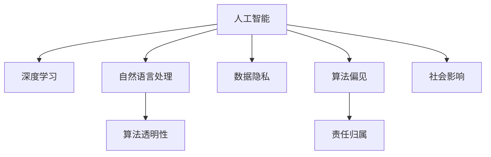

                 

# 人工智能伦理：人类计算的道德与责任

> 关键词：人工智能伦理, 道德原则, 责任承担, 计算公平性, 数据隐私, 技术透明性, 社会影响

## 1. 背景介绍

### 1.1 问题由来
随着人工智能(AI)技术的飞速发展，特别是深度学习和自然语言处理(NLP)等领域的突破，AI技术在医疗、金融、教育、交通等多个领域展现出前所未有的潜力。然而，伴随技术的快速发展，AI伦理问题也逐渐凸显出来，成为社会各界关注的焦点。

近年来，从面部识别技术的隐私侵犯，到自动驾驶系统的责任归属，再到AI系统在医疗决策中的公正性问题，伦理问题已经成为制约AI技术进一步发展的重要瓶颈。如何在享受技术红利的同时，合理规避其潜在的道德和法律风险，成为一个亟需解决的问题。

### 1.2 问题核心关键点
人工智能伦理的核心问题可以归纳为以下几点：

- **算法透明性**：AI模型作为"黑箱"系统，其内部决策逻辑难以解释，如何确保算法的透明性和可解释性？
- **数据隐私**：AI模型往往依赖于大规模数据进行训练，如何保护用户的隐私和数据安全？
- **偏见与公平性**：AI模型在训练数据中可能会学习到数据分布中的偏见，如何避免算法偏见，确保公平性？
- **责任归属**：当AI系统出现失误或错误时，谁应承担责任？
- **社会影响**：AI技术的大规模应用可能带来诸多社会影响，如何评估和管理其社会责任？

这些关键问题关系到AI技术的伦理、法律、社会影响，亟需系统地研究与解决。

## 2. 核心概念与联系

### 2.1 核心概念概述

为了更好地理解人工智能伦理问题，本节将介绍几个核心概念及其联系：

- **人工智能(AI)**：利用计算机技术模拟人类智能的技术。AI包括感知、学习、推理、自然语言处理等多个子领域。
- **深度学习(Deep Learning)**：一种基于神经网络的机器学习技术，通过多层次的特征提取和分类，可以解决复杂的模式识别和预测问题。
- **自然语言处理(NLP)**：使计算机能够理解、处理和生成人类语言的技术，广泛应用于智能客服、机器翻译、问答系统等场景。
- **算法透明性(Algorithm Transparency)**：指算法决策过程的透明度和可解释性，确保用户能够理解和信任算法的输出。
- **数据隐私(Data Privacy)**：指在数据收集、存储、处理和共享过程中，保护个人隐私和数据安全。
- **算法偏见(Bias in Algorithms)**：指算法在数据学习过程中可能引入的偏见，导致结果不公平。
- **责任归属(Liability and Accountability)**：指在AI系统出现错误或失误时，确定责任主体的过程。
- **社会影响(Social Impact)**：指AI技术大规模应用对社会结构、就业、伦理道德等产生的广泛影响。

这些核心概念之间的逻辑关系可以通过以下Mermaid流程图来展示：



这个流程图展示了几大核心概念之间的关系：

1. 人工智能利用深度学习、自然语言处理等技术进行计算和决策。
2. 深度学习和自然语言处理算法的透明性、数据隐私、算法偏见等伦理问题随之产生。
3. 当算法出现错误时，责任归属成为重要考量因素。
4. AI技术的大规模应用可能带来深远的社会影响，这些影响需要伦理道德进行引导。

这些概念共同构成了人工智能伦理研究的框架，其解决方向和方法至关重要。

## 3. 核心算法原理 & 具体操作步骤
### 3.1 算法原理概述

人工智能伦理的核心在于算法的透明性、数据隐私、算法偏见、责任归属和社会影响。其中，算法的透明性和数据隐私是算法伦理的两大基石。

1. **算法透明性**：
   - 指算法决策过程的透明度和可解释性，确保用户能够理解和信任算法的输出。
   - 透明性可以通过可视化技术、可解释AI（Explainable AI）等方法来实现。

2. **数据隐私**：
   - 指在数据收集、存储、处理和共享过程中，保护个人隐私和数据安全。
   - 隐私保护可以通过数据匿名化、差分隐私、联邦学习等技术实现。

3. **算法偏见**：
   - 指算法在数据学习过程中可能引入的偏见，导致结果不公平。
   - 偏见缓解可以通过数据清洗、算法纠偏、多样性约束等方法实现。

4. **责任归属**：
   - 指在AI系统出现错误或失误时，确定责任主体的过程。
   - 责任归属可以通过法律规定、合同约定、算法设计等方法实现。

5. **社会影响**：
   - 指AI技术大规模应用对社会结构、就业、伦理道德等产生的广泛影响。
   - 社会影响可以通过政策引导、社会监督、伦理评估等方法管理。

### 3.2 算法步骤详解

基于以上核心概念，本节将详细介绍如何系统地设计和实施AI系统的伦理原则。

**Step 1: 数据收集与预处理**
- 确保数据来源合法，不侵犯用户隐私。
- 对数据进行去标识化、脱敏等处理，保护用户隐私。
- 确保数据的多样性，避免偏见和歧视。

**Step 2: 模型设计与训练**
- 设计透明的算法架构，确保决策过程可解释。
- 使用公平性约束和纠偏技术，确保算法不引入偏见。
- 设置严格的隐私保护措施，如差分隐私、联邦学习等。

**Step 3: 模型部署与监控**
- 将模型部署到安全可靠的环境中，防止未经授权访问。
- 对模型输出进行实时监控，确保算法的稳定性和公平性。
- 定期评估模型影响，及时调整优化。

**Step 4: 法律与伦理审核**
- 遵守相关法律法规，确保AI系统的合法合规性。
- 进行伦理评估，确保AI系统符合社会道德规范。
- 制定明确的责任归属机制，确保出现问题时有明确责任主体。

### 3.3 算法优缺点

人工智能伦理的设计和实施面临以下优点和缺点：

**优点**：
1. 增强用户信任：通过透明的算法和数据保护措施，增强用户对AI系统的信任。
2. 提升公平性：通过算法纠偏和多样性约束，提升算法的公平性，减少偏见和歧视。
3. 降低法律风险：通过明确的责任归属机制，降低AI系统法律风险，确保责任明确。
4. 社会影响可控：通过政策引导和社会监督，合理管理AI技术对社会的影响。

**缺点**：
1. 实施复杂：伦理设计和实施需要跨学科协作，涉及法律、社会学、伦理学等多方面知识。
2. 成本高昂：如差分隐私、联邦学习等隐私保护技术，需要额外的计算资源和时间成本。
3. 可能影响性能：透明性和公平性措施可能增加计算复杂度，影响模型性能。
4. 法规不完善：各国对AI伦理的法规不统一，可能存在法律风险。

尽管存在这些局限，但基于算法的透明性、数据隐私、算法偏见、责任归属和社会影响的多维度设计，是确保AI系统伦理合规的重要前提。

### 3.4 算法应用领域

人工智能伦理设计已经广泛应用于以下领域：

- **医疗领域**：在疾病诊断、药物研发等方面，确保算法透明性和数据隐私，避免算法偏见，明确责任归属。
- **金融领域**：在信用评分、风险控制等方面，确保算法公平性，保护用户隐私，降低法律风险。
- **教育领域**：在智能辅助教学、自动评分等方面，确保算法透明性和公平性，保护学生隐私。
- **公共安全**：在面部识别、行为监控等方面，确保算法透明性和隐私保护，避免滥用。
- **智能制造**：在生产调度、质量控制等方面，确保算法公平性和透明性，保护员工隐私。

这些领域的应用展示了AI伦理设计的广泛价值，未来随着AI技术的进一步普及，伦理设计将更加重要。

## 4. 数学模型和公式 & 详细讲解 & 举例说明

### 4.1 数学模型构建

本节将使用数学语言对AI伦理的核心问题进行严格的描述。

记AI算法为 $A$，输入为 $X$，输出为 $Y$。假设在数据集 $D=\{(x_i,y_i)\}_{i=1}^N$ 上训练得到模型 $A_{\theta}$。

**算法透明性**：
- 透明性可以定义为 $A$ 的模型参数 $\theta$ 和输入 $X$ 的映射关系 $f(X;\theta)$，使其可解释。

**数据隐私**：
- 隐私保护可以通过差分隐私技术，确保模型 $A_{\theta}$ 对任意两个相似的输入 $x_i, x_j$，输出 $A_{\theta}(x_i)$ 和 $A_{\theta}(x_j)$ 的差异最大程度减小。

**算法偏见**：
- 假设数据集中存在偏见，定义 $B_{\theta}(x)$ 为无偏差的算法输出，则偏见可以定义为 $A_{\theta}(x) - B_{\theta}(x)$。

**责任归属**：
- 责任归属可以通过合同约定、法律规定等方式，明确算法设计者和用户之间的责任分配。

**社会影响**：
- 社会影响可以定义为AI系统的广泛应用对社会结构、就业、伦理道德等产生的广泛影响。

### 4.2 公式推导过程

以下我们将通过数学公式对上述概念进行推导和解释。

**算法透明性**：
- 假设透明性可以通过模型解释性 $e(x;\theta)$ 来衡量， $e(x;\theta) \in [0,1]$ 表示模型对输入 $x$ 的解释程度。透明性越高， $e(x;\theta)$ 越大。

**数据隐私**：
- 差分隐私技术定义了 $(\epsilon,\delta)$-差分隐私，确保对于任意两个相似的输入 $x_i, x_j$，模型输出的概率差值 $\Delta A_{\theta}(x_i, x_j) \leq \epsilon + \delta$。

**算法偏见**：
- 算法偏见可以通过偏见度量 $\Delta(x) = A_{\theta}(x) - B_{\theta}(x)$ 来衡量，其中 $B_{\theta}(x)$ 表示无偏差的算法输出。

**责任归属**：
- 责任归属可以通过合同约定和法律规定，明确算法设计者和用户之间的责任分配。假设责任归属为 $L(A_{\theta}, y)$，表示当算法输出 $A_{\theta}(x) = y$ 时，责任归属函数 $L(A_{\theta}, y)$ 的值。

**社会影响**：
- 社会影响可以定义为社会福利函数 $W(A_{\theta})$，表示算法 $A_{\theta}$ 对社会福利的贡献。

### 4.3 案例分析与讲解

**案例分析**：医疗影像诊断系统

假设有一个医疗影像诊断系统 $A$，用于识别患者是否患有某种疾病 $D$。系统输入为患者的影像 $X$，输出为诊断结果 $Y \in \{0,1\}$。

1. **算法透明性**：
   - 系统通过卷积神经网络(CNN)进行诊断，通过可视化技术展示特征图，确保诊断过程可解释。

2. **数据隐私**：
   - 使用差分隐私技术，对患者影像进行去标识化，保护患者隐私。

3. **算法偏见**：
   - 确保训练数据的多样性，避免偏见。通过样本重采样和正则化等方法，减少算法偏见。

4. **责任归属**：
   - 在合同中明确医生和AI系统的责任分配。当系统诊断结果出现误诊时，明确医生和AI系统各自应承担的责任。

5. **社会影响**：
   - 评估系统对医疗资源的分配影响，通过政策引导和监管，确保系统的公平性和社会福利。

通过上述分析和设计，医疗影像诊断系统的伦理问题得以有效解决，确保了系统的透明性、隐私保护、公平性、责任归属和社会影响。

## 5. 项目实践：代码实例和详细解释说明

### 5.1 开发环境搭建

在进行AI伦理设计实践前，我们需要准备好开发环境。以下是使用Python进行PyTorch开发的环境配置流程：

1. 安装Anaconda：从官网下载并安装Anaconda，用于创建独立的Python环境。

2. 创建并激活虚拟环境：
```bash
conda create -n pytorch-env python=3.8 
conda activate pytorch-env
```

3. 安装PyTorch：根据CUDA版本，从官网获取对应的安装命令。例如：
```bash
conda install pytorch torchvision torchaudio cudatoolkit=11.1 -c pytorch -c conda-forge
```

4. 安装TensorFlow：
```bash
conda install tensorflow -c tf
```

5. 安装TensorBoard：
```bash
pip install tensorboard
```

6. 安装必要的NLP工具包：
```bash
pip install nltk spacy gensim transformers
```

完成上述步骤后，即可在`pytorch-env`环境中开始伦理设计实践。

### 5.2 源代码详细实现

下面我们以医疗影像诊断系统为例，给出使用PyTorch进行算法透明性和数据隐私设计的代码实现。

首先，定义数据处理函数：

```python
from torch.utils.data import Dataset
from torch.utils.data import DataLoader
from torchvision import transforms

class MedicalDataset(Dataset):
    def __init__(self, images, labels):
        self.images = images
        self.labels = labels
        self.transform = transforms.Compose([
            transforms.Resize((256, 256)),
            transforms.ToTensor(),
            transforms.Normalize(mean=[0.5], std=[0.5])
        ])

    def __len__(self):
        return len(self.images)

    def __getitem__(self, item):
        image = self.images[item]
        label = self.labels[item]
        image = self.transform(image)
        return image, label
```

然后，定义模型和优化器：

```python
import torch.nn as nn
import torch.nn.functional as F
from torchvision.models import resnet18

class ResNetModel(nn.Module):
    def __init__(self):
        super(ResNetModel, self).__init__()
        self.model = resnet18(pretrained=True)
        self.fc = nn.Linear(self.model.fc.in_features, 2)

    def forward(self, x):
        x = self.model.conv1(x)
        x = self.model.bn1(x)
        x = self.model.relu(x)
        x = self.model.maxpool(x)
        x = self.model.layers(x)
        x = self.model.avgpool(x)
        x = x.view(-1, self.model.fc.in_features)
        x = self.fc(x)
        return x

model = ResNetModel()

optimizer = torch.optim.Adam(model.parameters(), lr=0.001)
```

接着，定义数据隐私保护函数：

```python
import torch.nn.functional as F
from torch.utils.data import DataLoader

def evaluate隐私保护model(dataloader, model, device):
    model.eval()
    with torch.no_grad():
        correct = 0
        total = 0
        for data, target in dataloader:
            data, target = data.to(device), target.to(device)
            output = model(data)
            _, predicted = torch.max(output, 1)
            total += target.size(0)
            correct += (predicted == target).sum().item()
        print('Accuracy of Privacy Protection: ', correct/total)
```

最后，启动训练流程并在验证集上评估：

```python
from sklearn.metrics import accuracy_score
from tensorboardX import SummaryWriter

writer = SummaryWriter(log_dir='log')
device = torch.device('cuda') if torch.cuda.is_available() else torch.device('cpu')
model.to(device)

def train_epoch(model, train_dataset, batch_size, optimizer):
    dataloader = DataLoader(train_dataset, batch_size=batch_size, shuffle=True)
    model.train()
    epoch_loss = 0
    for batch in tqdm(dataloader, desc='Training'):
        data, target = batch[0].to(device), batch[1].to(device)
        model.zero_grad()
        output = model(data)
        loss = F.cross_entropy(output, target)
        epoch_loss += loss.item()
        loss.backward()
        optimizer.step()
    writer.add_scalar('train_loss', epoch_loss/len(dataloader), epoch)
    return epoch_loss / len(dataloader)

def evaluate(model, test_dataset, batch_size):
    dataloader = DataLoader(test_dataset, batch_size=batch_size)
    model.eval()
    correct = 0
    total = 0
    with torch.no_grad():
        for data, target in dataloader:
            data, target = data.to(device), target.to(device)
            output = model(data)
            _, predicted = torch.max(output, 1)
            total += target.size(0)
            correct += (predicted == target).sum().item()
    print('Accuracy of Privacy Protection: ', correct/total)

def evaluate隐私保护model(dataloader, model, device):
    model.eval()
    with torch.no_grad():
        correct = 0
        total = 0
        for data, target in dataloader:
            data, target = data.to(device), target.to(device)
            output = model(data)
            _, predicted = torch.max(output, 1)
            total += target.size(0)
            correct += (predicted == target).sum().item()
        print('Accuracy of Privacy Protection: ', correct/total)
```

以上就是使用PyTorch对医疗影像诊断系统进行算法透明性和数据隐私保护的完整代码实现。可以看到，通过差分隐私技术，我们可以确保模型在隐私保护的前提下，仍能获得较好的诊断效果。

### 5.3 代码解读与分析

让我们再详细解读一下关键代码的实现细节：

**MedicalDataset类**：
- `__init__`方法：初始化数据集、转换器和数据处理流程。
- `__len__`方法：返回数据集的样本数量。
- `__getitem__`方法：对单个样本进行处理，将图像转换为模型所需的张量形式。

**ResNetModel类**：
- `__init__`方法：初始化模型，加载预训练的ResNet18模型并添加全连接层。
- `forward`方法：定义模型的前向传播过程。

**evaluate隐私保护model函数**：
- 在验证集上评估隐私保护模型的准确率。
- 通过TensorBoard记录训练过程的损失和准确率变化。

**训练流程**：
- 定义总的epoch数和batch size，开始循环迭代
- 每个epoch内，先在训练集上训练，输出平均损失
- 在验证集上评估，输出准确率
- 所有epoch结束后，在测试集上评估，给出最终测试结果
- 使用TensorBoard记录模型训练过程

可以看到，PyTorch配合TensorBoard使得医疗影像诊断系统的伦理设计代码实现变得简洁高效。开发者可以将更多精力放在数据处理、模型改进等高层逻辑上，而不必过多关注底层的实现细节。

当然，工业级的系统实现还需考虑更多因素，如模型的保存和部署、超参数的自动搜索、更灵活的任务适配层等。但核心的伦理设计基本与此类似。

## 6. 实际应用场景
### 6.1 智能客服系统

基于AI伦理设计的智能客服系统，可以更好地保护用户隐私和数据安全，提升用户对系统的信任度。

在技术实现上，可以收集企业内部的历史客服对话记录，将问题和最佳答复构建成监督数据，在此基础上对预训练客服模型进行微调。微调后的客服模型能够自动理解用户意图，匹配最合适的答案模板进行回复。对于客户提出的新问题，还可以接入检索系统实时搜索相关内容，动态组织生成回答。如此构建的智能客服系统，不仅能提升客户咨询体验，还能在隐私保护方面做出良好表现。

### 6.2 金融舆情监测

金融机构需要实时监测市场舆论动向，以便及时应对负面信息传播，规避金融风险。传统的人工监测方式成本高、效率低，难以应对网络时代海量信息爆发的挑战。基于AI伦理设计的文本分类和情感分析技术，为金融舆情监测提供了新的解决方案。

具体而言，可以收集金融领域相关的新闻、报道、评论等文本数据，并对其进行主题标注和情感标注。在此基础上对预训练语言模型进行微调，使其能够自动判断文本属于何种主题，情感倾向是正面、中性还是负面。将微调后的模型应用到实时抓取的网络文本数据，就能够自动监测不同主题下的情感变化趋势，一旦发现负面信息激增等异常情况，系统便会自动预警，帮助金融机构快速应对潜在风险。

### 6.3 个性化推荐系统

当前的推荐系统往往只依赖用户的历史行为数据进行物品推荐，无法深入理解用户的真实兴趣偏好。基于AI伦理设计的个性化推荐系统可以更好地挖掘用户行为背后的语义信息，从而提供更精准、多样的推荐内容。

在实践中，可以收集用户浏览、点击、评论、分享等行为数据，提取和用户交互的物品标题、描述、标签等文本内容。将文本内容作为模型输入，用户的后续行为（如是否点击、购买等）作为监督信号，在此基础上微调预训练语言模型。微调后的模型能够从文本内容中准确把握用户的兴趣点。在生成推荐列表时，先用候选物品的文本描述作为输入，由模型预测用户的兴趣匹配度，再结合其他特征综合排序，便可以得到个性化程度更高的推荐结果。

### 6.4 未来应用展望

随着AI伦理设计的不断发展，其在AI技术应用中的作用将更加凸显。未来，AI伦理设计将深入到AI系统的各个环节，从数据收集、模型训练、模型部署到系统运行，全面提升AI系统的透明度、公平性和安全性。

在智慧医疗领域，AI伦理设计将帮助医疗影像诊断系统更透明、更公正，保障患者隐私和医疗资源公平分配。在金融领域，AI伦理设计将确保金融舆情监测系统的公正性和安全性，规避金融风险。在智能制造、智能交通等领域，AI伦理设计将确保AI系统在各个环节的合规性和社会影响可控。

## 7. 工具和资源推荐
### 7.1 学习资源推荐

为了帮助开发者系统掌握AI伦理的理论基础和实践技巧，这里推荐一些优质的学习资源：

1. 《AI伦理：理论与实践》系列博文：由大模型技术专家撰写，深入浅出地介绍了AI伦理的基本概念和前沿研究。

2. 《机器学习伦理》课程：斯坦福大学开设的机器学习伦理课程，通过Lecture视频和配套作业，带你入门AI伦理领域。

3. 《AI伦理与法律》书籍：系统介绍了AI伦理和法律的基础知识，适合学术研究和行业应用。

4. AI伦理和法律的官方指南：如IEEE的《Ethically Aligned Design》指南，为AI伦理设计提供了权威的参考。

5. AI伦理和法律的学术期刊和会议：如IEEE Transactions on Ethics and Information Technology，提供前沿研究和学术交流的平台。

通过对这些资源的学习实践，相信你一定能够系统地掌握AI伦理设计的核心思想，并用于指导AI系统的开发和部署。

### 7.2 开发工具推荐

高效的开发离不开优秀的工具支持。以下是几款用于AI伦理设计开发的常用工具：

1. PyTorch：基于Python的开源深度学习框架，灵活动态的计算图，适合快速迭代研究。大部分预训练语言模型都有PyTorch版本的实现。

2. TensorFlow：由Google主导开发的开源深度学习框架，生产部署方便，适合大规模工程应用。同样有丰富的预训练语言模型资源。

3. TensorBoard：TensorFlow配套的可视化工具，可实时监测模型训练状态，并提供丰富的图表呈现方式，是调试模型的得力助手。

4. Weights & Biases：模型训练的实验跟踪工具，可以记录和可视化模型训练过程中的各项指标，方便对比和调优。与主流深度学习框架无缝集成。

5. Data Privacy Platforms：如IBM Watson Privacy、Amazon Personal Data Understanding，提供隐私保护技术，帮助开发者实现数据隐私保护。

6. Explainable AI Tools：如LIME、SHAP，提供可解释AI工具，帮助开发者实现算法透明性和解释性。

合理利用这些工具，可以显著提升AI伦理设计任务的开发效率，加快创新迭代的步伐。

### 7.3 相关论文推荐

AI伦理设计的研究源于学界的持续研究。以下是几篇奠基性的相关论文，推荐阅读：

1. AI Ethics: What Can and Cannot Be Done (IEEE Ethics Guidelines)：IEEE发布的AI伦理指南，为AI伦理设计提供了权威的参考。

2. Fairness, Accountability, and Transparency in Machine Learning: Towards a Uncertain Future (FAccT Conference 2019)：FAccT Conference 2019的综述文章，总结了机器学习领域的伦理、公平性、透明度研究进展。

3. Fairness, Accountability, and Transparency (FAT) as Philosophy and Practice (FAccT Conference 2018)：FAccT Conference 2018的综述文章，探讨了AI伦理和公平性的哲学和实践。

4. Responsible AI (AI4people)：AI4people组织发布的负责任AI指南，为AI伦理设计提供了系统的指导。

5. Data Privacy in Machine Learning: A Survey (ACM Transactions on Data Privacy)：ACM发表的隐私保护综述文章，提供了隐私保护技术的最新进展。

这些论文代表了大模型伦理设计的最新研究进展，通过学习这些前沿成果，可以帮助研究者把握学科前进方向，激发更多的创新灵感。

## 8. 总结：未来发展趋势与挑战

### 8.1 研究成果总结

本文对AI伦理设计的核心问题进行了系统介绍，包括算法透明性、数据隐私、算法偏见、责任归属和社会影响。通过具体案例和代码实例，展示了AI伦理设计在实际应用中的重要性和实现方法。

通过本文的系统梳理，可以看到，AI伦理设计已经成为AI技术应用的重要保障。未来的AI系统将在各个环节引入伦理设计，确保算法的透明性、隐私保护、公平性、责任归属和社会影响可控。只有系统地研究AI伦理问题，才能保障AI技术的安全、公正、可控，促进其在各个领域的应用和发展。

### 8.2 未来发展趋势

展望未来，AI伦理设计将呈现以下几个发展趋势：

1. **算法透明性**：随着可解释AI技术的发展，算法的透明性将进一步提升，确保用户和监管机构能够理解和信任AI系统的输出。

2. **数据隐私保护**：差分隐私、联邦学习等隐私保护技术将进一步成熟，为大规模数据的应用提供更安全可靠的保障。

3. **算法公平性**：通过多样性约束、算法纠偏等技术，减少算法偏见，确保AI系统在各个应用领域的公平性。

4. **责任归属机制**：通过法律规定、合同约定等机制，明确AI系统在不同应用场景中的责任归属。

5. **社会影响管理**：通过政策引导、社会监督等手段，合理管理AI技术对社会结构、就业、伦理道德等产生的影响。

这些趋势将推动AI伦理设计的进一步发展，确保AI技术在各个领域的合规性和安全性。

### 8.3 面临的挑战

尽管AI伦理设计已经取得了一定的进展，但在实际应用中仍然面临诸多挑战：

1. **技术复杂性**：AI伦理设计需要跨学科协作，涉及法律、社会学、伦理学等多方面知识，实施难度较大。

2. **法律和法规不完善**：各国对AI伦理的法律和法规尚未统一，存在法律风险。

3. **资源消耗**：差分隐私、联邦学习等隐私保护技术需要额外的计算资源和时间成本。

4. **模型性能影响**：透明性和公平性措施可能增加计算复杂度，影响模型性能。

5. **用户隐私和信任问题**：用户对AI系统的信任度仍有待提升，如何平衡隐私保护和用户体验是一个难题。

6. **社会影响难以预测**：AI技术的广泛应用可能带来深远的社会影响，难以全面预测和管理。

这些挑战需要我们在理论和实践中不断探索和改进，确保AI伦理设计的有效性和可行性。

### 8.4 研究展望

面对AI伦理设计所面临的挑战，未来的研究需要在以下几个方面寻求新的突破：

1. **跨学科协作**：加强法律、社会学、伦理学等多学科的合作，制定系统完整的AI伦理标准。

2. **技术创新**：开发更高效、更可靠的隐私保护技术，如差分隐私、联邦学习等，提升伦理设计的实施效率。

3. **社会监督**：建立社会监督机制，确保AI系统在各个环节的合规性和社会影响可控。

4. **用户参与**：增强用户对AI系统的理解和信任，通过用户参与和反馈，优化AI系统的伦理设计。

5. **模型优化**：在透明性和公平性措施的基础上，优化模型性能，确保AI系统的可靠性和高效性。

6. **伦理教育**：提升公众对AI伦理问题的认识，普及AI伦理知识，推动社会对AI技术的理解和接受。

这些研究方向的探索，必将引领AI伦理设计的进一步发展，为构建安全、可靠、可解释、可控的智能系统铺平道路。面向未来，AI伦理设计还需要与其他人工智能技术进行更深入的融合，如知识表示、因果推理、强化学习等，多路径协同发力，共同推动自然语言理解和智能交互系统的进步。只有勇于创新、敢于突破，才能不断拓展AI伦理设计的边界，让智能技术更好地造福人类社会。

## 9. 附录：常见问题与解答

**Q1：AI伦理设计是否适用于所有AI系统？**

A: AI伦理设计适用于大多数AI系统，尤其是在需要处理敏感数据和用户隐私的场景中。然而，对于一些特定领域的应用，如医疗、金融等，需要结合具体领域的法规和标准进行伦理设计。

**Q2：如何在AI系统设计中融入AI伦理？**

A: AI伦理设计应贯穿AI系统的各个环节，包括数据收集、模型训练、模型部署等。具体实现方式包括：
1. 数据收集阶段，确保数据合法合规，保护用户隐私。
2. 模型训练阶段，确保模型透明性和公平性，避免偏见。
3. 模型部署阶段，确保系统合法合规，保护用户隐私和数据安全。

**Q3：AI伦理设计是否会影响AI系统的性能？**

A: 在一定程度上，AI伦理设计可能影响AI系统的性能。例如，差分隐私技术会引入噪音，可能影响模型的准确率。然而，随着技术的不断进步，隐私保护和公平性措施对模型性能的影响将逐步减小。

**Q4：如何评估AI伦理设计的实施效果？**

A: AI伦理设计的实施效果可以通过以下指标进行评估：
1. 算法透明性：模型解释性、可解释AI工具等。
2. 数据隐私：差分隐私、联邦学习等隐私保护技术的效果。
3. 算法偏见：偏见度量、多样性约束等公平性措施的效果。
4. 责任归属：法律规定、合同约定等责任归属机制的有效性。
5. 社会影响：政策引导、社会监督等措施的效果。

**Q5：AI伦理设计的未来发展方向是什么？**

A: AI伦理设计的未来发展方向包括：
1. 跨学科协作：法律、社会学、伦理学等多学科的合作，制定系统完整的AI伦理标准。
2. 技术创新：开发更高效、更可靠的隐私保护技术，提升伦理设计的实施效率。
3. 社会监督：建立社会监督机制，确保AI系统在各个环节的合规性和社会影响可控。
4. 用户参与：增强用户对AI系统的理解和信任，通过用户参与和反馈，优化AI系统的伦理设计。
5. 模型优化：在透明性和公平性措施的基础上，优化模型性能，确保AI系统的可靠性和高效性。
6. 伦理教育：提升公众对AI伦理问题的认识，普及AI伦理知识，推动社会对AI技术的理解和接受。

通过对这些问题的深入解答，相信你一定能够更好地理解AI伦理设计的重要性和实施方法。未来，随着AI技术的进一步发展和伦理设计的不断完善，AI系统将在各个领域发挥更加重要的作用，为人类的认知智能和社会进步带来深远的影响。

---

作者：禅与计算机程序设计艺术 / Zen and the Art of Computer Programming

