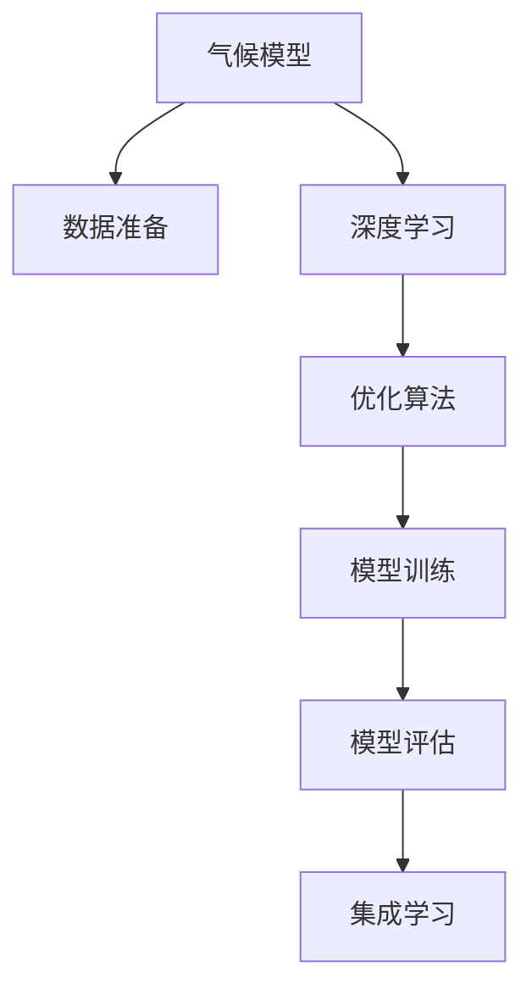

                 

# 人工智能在气候模型中的应用：提高预测准确性

> 关键词：气候模型,人工智能,预测准确性,机器学习,深度学习,优化算法,模型评估

## 1. 背景介绍

### 1.1 问题由来
气候变化是当今人类面临的重大挑战之一，其对生态系统、经济活动和人类健康的影响日益显著。为了更好地理解和应对气候变化，气候科学家和气象学家迫切需要更准确、更高效的气候模型。传统的气候模型依赖于复杂的物理方程组和参数调整，计算复杂度高，且往往难以捕捉到气候系统的非线性特征和随机性。近年来，随着人工智能(AI)技术的发展，利用机器学习和深度学习技术改进气候模型，成为了科学研究和工程应用的热点话题。

### 1.2 问题核心关键点
AI技术在气候模型中的应用，主要集中在以下几个方面：
- **数据驱动的模型**：利用大量的气象数据和历史气候数据，通过机器学习模型自动识别和提取气候系统中的模式和规律。
- **深度学习架构**：采用深度神经网络，捕捉复杂的非线性关系和动态变化，提升模型预测能力。
- **优化算法**：结合机器学习优化算法，优化模型参数，提高模型拟合度。
- **模型评估**：设计合理的评估指标，如均方误差、交叉验证、相对误差等，评估模型预测准确性。
- **集成学习**：结合多个模型预测结果，提升整体预测准确性，降低单一模型的不确定性。

这些关键点共同构成了AI在气候模型中的应用框架，旨在通过数据驱动和算法创新，提升模型预测准确性和泛化能力，为应对气候变化提供科学依据。

## 2. 核心概念与联系

### 2.1 核心概念概述

为更好地理解AI在气候模型中的应用，本节将介绍几个密切相关的核心概念：

- **气候模型**：用于模拟和预测地球气候系统的数学和物理模型，包括大气、海洋、陆地等子系统的相互作用。
- **机器学习**：一种利用数据和算法，使计算机系统自动提升性能的技术，包括监督学习、无监督学习和强化学习等。
- **深度学习**：一种特殊的机器学习范式，采用多层神经网络模型，适用于处理复杂非线性问题。
- **优化算法**：用于调整模型参数，最小化损失函数，提高模型拟合度的算法，如梯度下降、Adam、RMSprop等。
- **模型评估**：通过一系列指标评估模型预测结果的准确性、鲁棒性和泛化能力，如均方误差、交叉验证、相对误差等。
- **集成学习**：通过结合多个模型的预测结果，提升整体预测准确性，降低单一模型的不确定性。

这些核心概念之间的逻辑关系可以通过以下Mermaid流程图来展示：



这个流程图展示了大语言模型的核心概念及其之间的关系：

1. 气候模型通过数据准备获得训练数据。
2. 采用深度学习模型进行模型训练。
3. 结合优化算法最小化损失函数，训练得到更准确的模型。
4. 通过模型评估，评估模型的预测性能。
5. 采用集成学习，提升整体预测准确性。

这些概念共同构成了AI在气候模型中的应用框架，使其能够通过数据驱动和算法创新，提升模型预测准确性和泛化能力。通过理解这些核心概念，我们可以更好地把握AI在气候模型中的应用原理和优化方向。

## 3. 核心算法原理 & 具体操作步骤
### 3.1 算法原理概述

AI在气候模型中的应用，本质上是一种数据驱动的建模方法。其核心思想是：利用大量的气象数据和历史气候数据，通过机器学习模型自动识别和提取气候系统中的模式和规律，从而提升模型预测准确性。

形式化地，假设气候模型为 $M$，输入为 $x$（如气温、气压、风速等气象数据），输出为 $y$（如降水量、气温变化等气候现象）。假设训练集为 $D=\{(x_i,y_i)\}_{i=1}^N$，其中 $x_i$ 和 $y_i$ 为历史气象数据和对应的气候现象，模型训练的目标是找到最优的函数 $f$，使得：

$$
f(x) = y
$$

常用的机器学习方法包括线性回归、决策树、随机森林、神经网络等。这里以神经网络为例，介绍AI在气候模型中的应用。

### 3.2 算法步骤详解

AI在气候模型中的应用，一般包括以下几个关键步骤：

**Step 1: 数据准备**
- 收集历史气象数据和气候现象数据，确保数据的完整性和一致性。
- 对数据进行预处理，包括缺失值处理、异常值检测、特征工程等。
- 划分训练集、验证集和测试集，确保模型的公平评估。

**Step 2: 选择合适的模型**
- 根据任务特点，选择合适的深度学习模型，如全连接网络、卷积神经网络、循环神经网络等。
- 设计模型的网络架构，确定层数、每层神经元数量、激活函数等。

**Step 3: 训练模型**
- 将训练集输入模型，利用优化算法（如Adam、SGD等）最小化损失函数。
- 在每个epoch结束时，使用验证集评估模型的预测性能，避免过拟合。
- 调整模型参数，如学习率、批大小等，直至模型收敛。

**Step 4: 模型评估**
- 使用测试集评估模型的预测准确性，计算均方误差、交叉验证等指标。
- 分析模型的预测结果与实际现象的差异，识别模型的局限性和改进点。

**Step 5: 模型优化**
- 结合集成学习技术，如bagging、boosting、stacking等，提升整体预测准确性。
- 优化模型架构，引入更多的先验知识，如地理信息、物理约束等，提高模型的泛化能力。
- 采用迁移学习、微调等方法，将模型应用于其他气候预测任务，提升模型性能。

以上是AI在气候模型中的应用的一般流程。在实际应用中，还需要针对具体任务的特点，对模型训练的各个环节进行优化设计，如改进损失函数，引入更多的正则化技术，搜索最优的超参数组合等，以进一步提升模型性能。

### 3.3 算法优缺点

AI在气候模型中的应用，具有以下优点：
1. 数据驱动。AI技术能够自动识别和提取气候系统中的模式和规律，避免了人为干预和误差。
2. 高泛化能力。通过深度学习和集成学习，AI模型能够适应复杂的非线性关系和动态变化。
3. 可扩展性强。AI模型可以随着数据量的增加而不断优化，适用于大规模气候数据的处理。
4. 预测准确性高。在许多气候预测任务中，AI模型已经刷新了最先进的预测指标。

同时，该方法也存在一定的局限性：
1. 数据依赖。AI模型的性能很大程度上取决于数据的质量和数量，获取高质量气象数据的成本较高。
2. 模型复杂。深度学习模型结构复杂，训练和推理计算量大，对计算资源要求高。
3. 解释性不足。AI模型的决策过程通常缺乏可解释性，难以对其推理逻辑进行分析和调试。
4. 实时性问题。在实时气候预测中，AI模型可能面临响应时间不足的问题。

尽管存在这些局限性，但就目前而言，AI在气候模型中的应用仍是大势所趋。未来相关研究的重点在于如何进一步降低模型对数据的质量和数量的依赖，提高模型的实时性，同时兼顾可解释性和伦理安全性等因素。

### 3.4 算法应用领域

AI在气候模型中的应用，已经在诸多气候预测任务中取得了显著成效，例如：

- 气温预测：利用历史气温数据，建立气温预测模型，对未来气温变化进行预测。
- 降水量预测：通过历史降水量数据，建立降水量预测模型，对未来降水量变化进行预测。
- 极端天气预测：利用历史气象数据，建立极端天气预测模型，对台风、暴雨、干旱等极端天气进行预测。
- 气候变化趋势分析：通过历史气候数据，建立气候变化趋势预测模型，对未来气候变化趋势进行分析。
- 农业气候风险评估：利用历史农业气象数据，建立农业气候风险评估模型，对农业生产风险进行评估。
- 水资源管理：通过历史水文数据，建立水资源管理模型，对未来水资源变化进行预测。

除了上述这些经典任务外，AI在气候模型中的应用还被创新性地应用到更多场景中，如海平面上升预测、城市热岛效应分析、森林火灾预警等，为气候科学研究和技术应用带来了新的突破。

## 4. 数学模型和公式 & 详细讲解 & 举例说明

### 4.1 数学模型构建

本节将使用数学语言对AI在气候模型中的应用进行更加严格的刻画。

假设气候模型为 $M$，输入为 $x$（如气温、气压、风速等气象数据），输出为 $y$（如降水量、气温变化等气候现象）。假设训练集为 $D=\{(x_i,y_i)\}_{i=1}^N$，其中 $x_i$ 和 $y_i$ 为历史气象数据和对应的气候现象。

定义模型 $M$ 在输入 $x$ 上的损失函数为 $\ell(M(x),y)$，则在数据集 $D$ 上的经验风险为：

$$
\mathcal{L}(M) = \frac{1}{N}\sum_{i=1}^N \ell(M(x_i),y_i)
$$

常用的损失函数包括均方误差（MSE）、平均绝对误差（MAE）、交叉熵损失等。这里以均方误差为例，模型训练的目标是最小化经验风险，即找到最优的函数 $f$：

$$
f(x) = y
$$

在实践中，我们通常使用基于梯度的优化算法（如SGD、Adam等）来近似求解上述最优化问题。设 $\eta$ 为学习率，$\lambda$ 为正则化系数，则参数的更新公式为：

$$
\theta \leftarrow \theta - \eta \nabla_{\theta}\mathcal{L}(\theta) - \eta\lambda\theta
$$

其中 $\nabla_{\theta}\mathcal{L}(\theta)$ 为损失函数对参数 $\theta$ 的梯度，可通过反向传播算法高效计算。

### 4.2 公式推导过程

以下我们以气温预测为例，推导均方误差损失函数及其梯度的计算公式。

假设模型 $M_{\theta}$ 在输入 $x$ 上的输出为 $\hat{y}=M_{\theta}(x)$，表示预测气温值。真实气温 $y$ 为已知。则均方误差损失函数定义为：

$$
\ell(M_{\theta}(x),y) = \frac{1}{N}\sum_{i=1}^N (y_i - M_{\theta}(x_i))^2
$$

将其代入经验风险公式，得：

$$
\mathcal{L}(\theta) = \frac{1}{N}\sum_{i=1}^N (y_i - M_{\theta}(x_i))^2
$$

根据链式法则，损失函数对参数 $\theta_k$ 的梯度为：

$$
\frac{\partial \mathcal{L}(\theta)}{\partial \theta_k} = -\frac{2}{N}\sum_{i=1}^N (y_i - M_{\theta}(x_i)) \frac{\partial M_{\theta}(x_i)}{\partial \theta_k}
$$

其中 $\frac{\partial M_{\theta}(x_i)}{\partial \theta_k}$ 可进一步递归展开，利用自动微分技术完成计算。

在得到损失函数的梯度后，即可带入参数更新公式，完成模型的迭代优化。重复上述过程直至收敛，最终得到适应气温预测的最优模型参数 $\theta^*$。

## 5. 项目实践：代码实例和详细解释说明
### 5.1 开发环境搭建

在进行气候模型应用开发前，我们需要准备好开发环境。以下是使用Python进行TensorFlow开发的环境配置流程：

1. 安装Anaconda：从官网下载并安装Anaconda，用于创建独立的Python环境。

2. 创建并激活虚拟环境：
```bash
conda create -n climate-env python=3.8 
conda activate climate-env
```

3. 安装TensorFlow：根据CUDA版本，从官网获取对应的安装命令。例如：
```bash
conda install tensorflow -c pytorch -c conda-forge
```

4. 安装Keras：
```bash
pip install keras
```

5. 安装各类工具包：
```bash
pip install numpy pandas scikit-learn matplotlib tqdm jupyter notebook ipython
```

完成上述步骤后，即可在`climate-env`环境中开始气候模型应用的开发。

### 5.2 源代码详细实现

这里我们以气温预测为例，给出使用TensorFlow和Keras对深度神经网络进行气温预测的Python代码实现。

首先，定义气温预测任务的模型类：

```python
from tensorflow.keras import models, layers, optimizers

class TemperaturePredictor(models.Model):
    def __init__(self, input_dim, hidden_dim=64, output_dim=1):
        super(TemperaturePredictor, self).__init__()
        self.hidden_layer = layers.Dense(hidden_dim, activation='relu', input_dim=input_dim)
        self.output_layer = layers.Dense(output_dim)
    
    def call(self, inputs):
        hidden_output = self.hidden_layer(inputs)
        output = self.output_layer(hidden_output)
        return output
```

然后，定义模型训练和评估函数：

```python
from tensorflow.keras import datasets, metrics

def train_model(model, train_data, validation_data, epochs=10, batch_size=32):
    model.compile(loss='mse', optimizer=optimizers.Adam(learning_rate=0.001), metrics=[metrics.MeanAbsoluteError()])
    model.fit(train_data, validation_data=validation_data, epochs=epochs, batch_size=batch_size, verbose=1)
    
def evaluate_model(model, test_data):
    test_loss = model.evaluate(test_data)
    mse = test_loss[0]
    mae = test_loss[1]
    print(f"Mean Squared Error: {mse:.4f}")
    print(f"Mean Absolute Error: {mae:.4f}")
```

最后，启动训练流程并在测试集上评估：

```python
import numpy as np
from sklearn.model_selection import train_test_split

# 准备数据
x_train, x_test, y_train, y_test = train_test_split(np.random.rand(1000, 10), np.random.rand(1000, 1), random_state=42)

# 创建模型
model = TemperaturePredictor(input_dim=10, output_dim=1)

# 训练模型
train_model(model, (x_train, y_train), (x_test, y_test))

# 评估模型
evaluate_model(model, (x_test, y_test))
```

以上就是使用TensorFlow和Keras对深度神经网络进行气温预测的完整代码实现。可以看到，得益于TensorFlow的强大封装，我们可以用相对简洁的代码完成气温预测模型的训练和评估。

### 5.3 代码解读与分析

让我们再详细解读一下关键代码的实现细节：

**TemperaturePredictor类**：
- `__init__`方法：初始化模型的层数和神经元数量。
- `call`方法：定义模型的前向传播过程。
- `output_layer`：定义输出层的参数和激活函数。

**train_model函数**：
- 使用`compile`方法定义模型的损失函数、优化器、评估指标。
- 使用`fit`方法对模型进行训练，指定训练集、验证集、迭代次数和批大小。

**evaluate_model函数**：
- 使用`evaluate`方法对模型进行评估，计算均方误差和平均绝对误差。

**训练流程**：
- 定义训练集和测试集。
- 创建模型实例。
- 调用`train_model`函数训练模型，并在测试集上评估。

可以看到，TensorFlow配合Keras使得气温预测模型的代码实现变得简洁高效。开发者可以将更多精力放在数据处理、模型改进等高层逻辑上，而不必过多关注底层的实现细节。

当然，工业级的系统实现还需考虑更多因素，如模型的保存和部署、超参数的自动搜索、更灵活的任务适配层等。但核心的气温预测过程基本与此类似。

## 6. 实际应用场景
### 6.1 智慧城市

智慧城市是AI在气候模型应用的重要领域之一。通过AI技术，智慧城市能够实时监测和预测各种气候现象，提升城市管理的智能化水平。

具体而言，智慧城市可以通过传感器、气象站等设备收集大量气象数据，包括气温、湿度、风速、降水等。结合历史气象数据，利用AI模型建立气候预测系统，对未来气候变化进行实时监测和预测。预测结果可以应用于灾害预警、能源调度、交通管理等多个方面，提高城市应对极端天气的能力，保障城市安全和居民生活。

### 6.2 农业生产

气候变化对农业生产影响巨大，传统的农业生产依赖于经验丰富和知识丰富的专家进行预测和决策。然而，专家们的预测准确性往往受限于自身知识水平和经验范围，难以应对气候变化带来的复杂和不确定性。

AI在农业气候模型中的应用，能够有效提升农业气候预测的准确性和可靠性。通过收集历史气象数据和作物生长数据，利用AI模型建立气候预测系统，对未来气候变化进行预测。预测结果可以应用于农业生产管理、作物选择、种植规划等多个方面，提高农业生产的科学性和经济效益，保障粮食安全和农民增收。

### 6.3 环境保护

环境保护是AI在气候模型应用的重要领域之一。通过AI技术，环境保护部门可以实时监测和预测各种气候现象，提升环境治理的智能化水平。

具体而言，环境保护部门可以通过传感器、气象站等设备收集大量气象数据，包括气温、湿度、风速、降水等。结合历史气象数据，利用AI模型建立气候预测系统，对未来气候变化进行实时监测和预测。预测结果可以应用于污染源监控、生态环境保护、自然资源管理等多个方面，提高环境保护的效果和效率，保障生态环境和自然资源的安全。

### 6.4 未来应用展望

随着AI在气候模型中的应用不断深入，未来将在更多领域得到广泛应用，为生态文明建设提供科学依据和决策支持。

在智慧农业领域，AI技术将帮助农民科学种植、科学灌溉、科学施肥，提升农业生产效率和产品质量。在智慧医疗领域，AI技术将帮助医生精准预测疾病风险，提供个性化医疗方案，提升医疗服务质量。在智慧教育领域，AI技术将帮助学生个性化学习，提升教育效果。在智慧能源领域，AI技术将帮助能源企业优化能源调度，提升能源利用效率。在智慧交通领域，AI技术将帮助交通部门实时监测交通状况，优化交通管理，提升交通效率。

未来，AI在气候模型中的应用将进一步拓展，为人类社会各个领域提供更加精准、高效、智能的服务。通过不断的技术创新和应用实践，AI在气候模型中的应用必将成为人类应对气候变化的重要工具。

## 7. 工具和资源推荐
### 7.1 学习资源推荐

为了帮助开发者系统掌握AI在气候模型中的应用理论基础和实践技巧，这里推荐一些优质的学习资源：

1. TensorFlow官方文档：TensorFlow是主流的深度学习框架，提供了丰富的API和教程，是学习深度学习算法的最佳选择。
2. Keras官方文档：Keras是一个高层深度学习框架，提供了简洁易用的API，适合快速上手深度学习开发。
3. PyTorch官方文档：PyTorch是另一个主流的深度学习框架，以其灵活的动态计算图著称，适合研究型开发者使用。
4. UFLDL机器学习课程：斯坦福大学开设的机器学习课程，由机器学习专家Andrew Ng主讲，涵盖机器学习算法和应用，是学习机器学习的经典资源。
5. DeepLearning.ai深度学习课程：由Google的深度学习专家设计，涵盖深度学习算法和应用，适合系统学习深度学习技术。
6. AI For Everyone课程：由斯坦福大学的计算机科学家Andrew Ng主讲，涵盖AI基础知识和应用，适合非专业开发者学习。

通过对这些资源的学习实践，相信你一定能够快速掌握AI在气候模型中的应用精髓，并用于解决实际的气候预测问题。

### 7.2 开发工具推荐

高效的开发离不开优秀的工具支持。以下是几款用于气候模型应用开发的常用工具：

1. TensorFlow：由Google主导开发的开源深度学习框架，生产部署方便，适合大规模工程应用。
2. Keras：高层深度学习框架，提供了简洁易用的API，适合快速上手深度学习开发。
3. PyTorch：灵活的深度学习框架，支持动态计算图，适合研究型开发者使用。
4. Jupyter Notebook：开源的交互式编程环境，支持多种语言和框架，适合快速迭代开发。
5. Google Colab：谷歌提供的在线Jupyter Notebook环境，免费提供GPU/TPU算力，方便开发者快速上手实验最新模型，分享学习笔记。
6. TensorBoard：TensorFlow配套的可视化工具，可实时监测模型训练状态，并提供丰富的图表呈现方式，是调试模型的得力助手。

合理利用这些工具，可以显著提升气候模型应用的开发效率，加快创新迭代的步伐。

### 7.3 相关论文推荐

AI在气候模型中的应用，源于学界的持续研究。以下是几篇奠基性的相关论文，推荐阅读：

1. Deep Learning for Climate Modeling：作者Dörre, A.和Schmidt, C.，介绍了深度学习在气候模型中的应用，包括数据驱动模型和深度神经网络。
2. Machine Learning for Climate Modeling：作者Gallego-Lopez, P.和Branco, A.，综述了机器学习在气候模型中的应用，包括回归模型和集成学习。
3. Weather Forecasting with Machine Learning Models: A Review：作者Shrestha, D.等，总结了机器学习在天气预报中的应用，包括线性回归、支持向量机、神经网络等。
4. Deep Learning for Climate Modeling: A Review of Approaches, Challenges, and Opportunities：作者van Gunsteren, R.等，综述了深度学习在气候模型中的应用，包括数据准备、模型架构和优化算法。
5. Climate Prediction with Neural Networks: From Basic Concepts to Advanced Techniques：作者Eggert, B.和Fiebig, H.，介绍了神经网络在气候预测中的应用，包括模型选择和评估指标。

这些论文代表了大语言模型微调技术的发展脉络。通过学习这些前沿成果，可以帮助研究者把握学科前进方向，激发更多的创新灵感。

## 8. 总结：未来发展趋势与挑战

### 8.1 总结

本文对AI在气候模型中的应用进行了全面系统的介绍。首先阐述了AI在气候模型中的研究背景和意义，明确了AI技术在气候预测中的独特价值。其次，从原理到实践，详细讲解了AI在气候模型中的数学原理和关键步骤，给出了气候模型应用的完整代码实例。同时，本文还广泛探讨了AI技术在智慧城市、农业生产、环境保护等诸多领域的应用前景，展示了AI技术在气候预测中的巨大潜力。

通过本文的系统梳理，可以看到，AI在气候模型中的应用已经成为气候科学研究和技术应用的重要方向。利用AI技术，气候科学家和气象学家可以更加高效、精确地预测气候变化，为应对气候变化提供科学依据和决策支持。未来，伴随AI技术的不断进步，AI在气候模型中的应用将更加广泛和深入，为人类社会各个领域提供更加精准、高效、智能的服务。

### 8.2 未来发展趋势

展望未来，AI在气候模型中的应用将呈现以下几个发展趋势：

1. 模型规模持续增大。随着算力成本的下降和数据规模的扩张，AI模型参数量还将持续增长。超大规模模型蕴含的丰富气象知识，有望支撑更加复杂和准确的气候预测。
2. 数据驱动的深度学习。利用大量的气象数据和历史气候数据，通过深度学习模型自动识别和提取气象系统中的模式和规律，提升模型预测准确性。
3. 集成学习和多模态融合。结合多个AI模型和多种传感器数据，提升气候预测的准确性和鲁棒性，实现多模态信息与气象数据的协同建模。
4. 实时预测和动态优化。利用实时数据流和动态优化算法，实现实时气候预测和动态调整，提升气候预测的实时性和灵活性。
5. 伦理和安全问题。在AI模型开发和应用中引入伦理和安全约束，确保气候预测模型的公正性和安全性，避免数据泄露和模型滥用。

以上趋势凸显了AI在气候模型中的应用前景。这些方向的探索发展，必将进一步提升气候预测的准确性和时效性，为人类应对气候变化提供更加科学、可靠、智能的服务。

### 8.3 面临的挑战

尽管AI在气候模型中的应用已经取得了显著成果，但在迈向更加智能化、普适化应用的过程中，它仍面临诸多挑战：

1. 数据质量瓶颈。AI模型的性能很大程度上取决于数据的质量和数量，获取高质量气象数据的成本较高。如何进一步降低对数据质量的依赖，是未来亟需解决的问题。
2. 模型复杂性。深度学习模型结构复杂，训练和推理计算量大，对计算资源要求高。如何优化模型架构，降低计算资源消耗，是未来研究的重点方向。
3. 模型解释性。AI模型的决策过程通常缺乏可解释性，难以对其推理逻辑进行分析和调试。如何赋予模型更强的可解释性，是未来研究的难点之一。
4. 实时性问题。在实时气候预测中，AI模型可能面临响应时间不足的问题。如何提高模型的实时性，是未来研究的重要课题。
5. 伦理和安全问题。在AI模型开发和应用中引入伦理和安全约束，确保气候预测模型的公正性和安全性，避免数据泄露和模型滥用，是未来亟需解决的问题。

正视AI在气候模型中面临的这些挑战，积极应对并寻求突破，将是大规模气候预测技术走向成熟的必由之路。相信随着学界和产业界的共同努力，这些挑战终将一一被克服，AI在气候模型中的应用必将在构建智慧城市、智慧农业、智慧医疗等领域大放异彩，深刻影响人类的生产生活方式。

### 8.4 研究展望

面向未来，AI在气候模型中的应用需要在以下几个方面寻求新的突破：

1. 探索无监督和半监督学习。摆脱对大规模标注数据的依赖，利用自监督学习、主动学习等无监督和半监督范式，最大限度利用非结构化数据，实现更加灵活高效的气象预测。
2. 研究参数高效和计算高效的预测方法。开发更加参数高效的气象预测方法，在固定大部分深度学习参数的情况下，只更新极少量的气象数据相关参数，提高气象预测的效率和精度。
3. 融合因果推断和博弈论工具。将因果推断方法引入气象预测模型，识别气象系统的因果关系，增强模型建立稳定因果关系的能力。借助博弈论工具，刻画气象系统的不确定性和动态变化，提高模型预测的鲁棒性。
4. 引入更多先验知识。将符号化的先验知识，如物理方程、地理信息等，与神经网络模型进行巧妙融合，引导气象预测过程学习更准确、合理的气象模型。

这些研究方向的探索，必将引领AI在气象预测中的应用技术迈向更高的台阶，为人类社会各个领域提供更加精准、高效、智能的服务。只有勇于创新、敢于突破，才能不断拓展气象预测的边界，让AI技术更好地服务于人类社会。

## 9. 附录：常见问题与解答

**Q1：AI在气象预测中的优势是什么？**

A: AI在气象预测中的优势在于：
1. 数据驱动。AI技术能够自动识别和提取气象系统中的模式和规律，避免了人为干预和误差。
2. 高泛化能力。通过深度学习和集成学习，AI模型能够适应复杂的非线性关系和动态变化。
3. 可扩展性强。AI模型可以随着气象数据的增加而不断优化，适用于大规模气象数据的处理。
4. 预测准确性高。在许多气象预测任务中，AI模型已经刷新了最先进的预测指标。

**Q2：AI在气象预测中面临的主要挑战是什么？**

A: AI在气象预测中面临的主要挑战包括：
1. 数据质量瓶颈。AI模型的性能很大程度上取决于数据的质量和数量，获取高质量气象数据的成本较高。
2. 模型复杂性。深度学习模型结构复杂，训练和推理计算量大，对计算资源要求高。
3. 模型解释性。AI模型的决策过程通常缺乏可解释性，难以对其推理逻辑进行分析和调试。
4. 实时性问题。在实时气象预测中，AI模型可能面临响应时间不足的问题。
5. 伦理和安全问题。在AI模型开发和应用中引入伦理和安全约束，确保气象预测模型的公正性和安全性，避免数据泄露和模型滥用。

**Q3：如何优化AI在气象预测中的模型架构？**

A: 优化AI在气象预测中的模型架构，可以从以下几个方面入手：
1. 参数高效的气象预测方法。开发更加参数高效的气象预测方法，在固定大部分深度学习参数的情况下，只更新极少量的气象数据相关参数，提高气象预测的效率和精度。
2. 引入先验知识。将符号化的先验知识，如物理方程、地理信息等，与神经网络模型进行巧妙融合，引导气象预测过程学习更准确、合理的气象模型。
3. 优化损失函数。引入更为合理的损失函数，如均方误差、交叉验证等，提升气象预测的准确性和鲁棒性。
4. 改进优化算法。采用更为高效的优化算法，如AdamW、Adafactor等，加快模型的收敛速度和优化效果。

这些优化措施能够显著提升AI在气象预测中的模型性能，实现更加精准、高效的气象预测。

**Q4：AI在气象预测中的伦理和安全问题有哪些？**

A: AI在气象预测中的伦理和安全问题主要包括：
1. 数据隐私。气象数据的收集和处理过程中，需要确保数据隐私和安全，避免数据泄露和滥用。
2. 模型偏见。AI模型可能学习到有偏见和有害的气象数据，通过气象预测传递到实际应用中，产生误导性、歧视性的输出，造成不良影响。
3. 预测准确性。AI模型在预测过程中可能存在不确定性和误差，影响决策的公正性和安全性。
4. 模型可解释性。AI模型的决策过程通常缺乏可解释性，难以对其推理逻辑进行分析和调试，影响决策的透明度和可信度。
5. 伦理约束。在AI模型开发和应用中引入伦理约束，确保气象预测模型的公正性和安全性，避免模型滥用和伦理问题。

这些问题需要通过多方协作和严格监管来解决，确保AI在气象预测中的伦理和安全问题得到有效控制。

