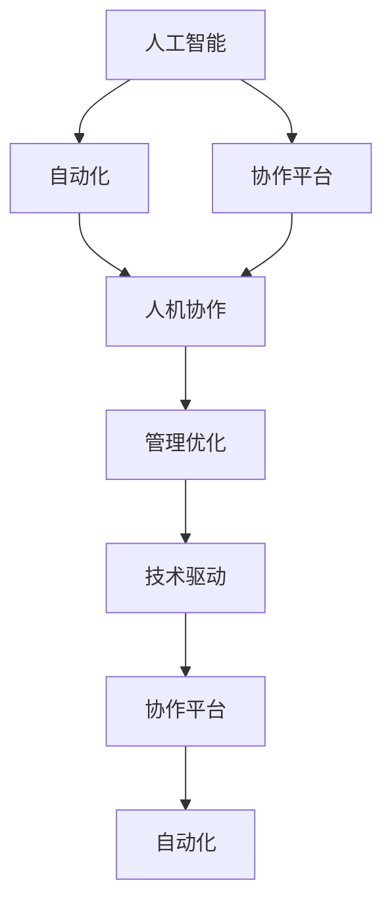

                 

# 人机协作管理：在自动化时代重新定义工作

> 关键词：人机协作，自动化时代，AI与工作，协作平台，管理优化，技术驱动变革

## 1. 背景介绍

### 1.1 问题由来

随着人工智能（AI）和自动化技术的迅猛发展，人类工作的方式正在发生深刻的变化。传统以人力为主导的工作模式逐渐被机器所取代，自动化机器人和智能系统开始在生产、服务、管理等多个领域发挥重要作用。然而，机器和人类如何协作、优化人机交互、提升工作效率和质量，成为现代管理面临的新挑战。

### 1.2 问题核心关键点

人工智能和自动化技术在带来高效的同时，也引发了一系列管理上的问题：

- 工作流程优化：在自动化环境下，如何设计高效的流程，充分利用自动化工具提升效率。
- 人机协作设计：自动化系统如何与人类协同工作，平衡任务分配，避免人机冲突。
- 数据管理和共享：在自动化系统中，如何有效管理和共享数据，促进信息流动。
- 员工培训与适应：如何在自动化普及的过程中，帮助员工进行技能更新和角色转型。
- 绩效评估与激励：自动化系统如何准确评估员工绩效，并给予合理激励。
- 隐私和伦理：自动化环境下，如何保护数据隐私，遵循伦理原则。

### 1.3 问题研究意义

研究人机协作管理方法，对于提升自动化时代的组织效能，优化工作流程，平衡人机互动，实现高效协同，具有重要意义：

- 提升效率：通过优化工作流程，合理分配任务，利用自动化系统加速任务执行，提高生产力和服务质量。
- 改善体验：通过智能化的人机协作设计，提升员工和用户的体验，降低工作压力，增加满意度。
- 促进创新：通过合理的数据管理和共享，激发新的创意和创新，提升企业竞争力。
- 强化团队：通过科学的绩效评估和激励机制，增强团队凝聚力，实现共同目标。
- 保护隐私：通过合规的隐私保护和伦理遵循，确保自动化系统在运行过程中的数据安全和公平公正。

## 2. 核心概念与联系

### 2.1 核心概念概述

为更好地理解人机协作管理，本节将介绍几个关键概念：

- 人机协作(Human-Machine Collaboration)：指人类和机器在特定任务中相互配合、共同完成工作的过程。人机协作旨在发挥各自优势，提升任务执行效率。
- 自动化(Automation)：通过机械或电子装置代替人工执行重复性、规则性或危险性工作，以提高生产效率。
- 人工智能(Artificial Intelligence)：模拟人类智能行为，通过学习、推理等算法实现智能决策和操作。
- 协作平台(Collaborative Platform)：提供人机交互界面，支持信息共享和协同工作的软件系统。
- 管理优化(Management Optimization)：通过优化资源配置、任务分配、绩效评估等管理活动，提升组织效能。
- 技术驱动(Technology-Driven)：以技术进步为核心，推动管理方式和业务流程的创新。

这些核心概念之间的逻辑关系可以通过以下Mermaid流程图来展示：



这个流程图展示了几大人机协作管理概念及其之间的关系：

1. 人工智能为自动化提供智能决策能力。
2. 协作平台作为人机交互的核心，支持信息共享和协同工作。
3. 人机协作发挥各自优势，提升工作效率。
4. 管理优化通过合理配置资源和任务，提升组织效能。
5. 技术驱动推动管理方式和业务流程的创新。

这些概念共同构成了人机协作管理的核心框架，为人机协同的实现提供了基础。

## 3. 核心算法原理 & 具体操作步骤
### 3.1 算法原理概述

人机协作管理方法的核心在于利用人工智能和自动化技术，优化工作流程，平衡人机互动，实现高效协同。其核心思想是：通过数据分析、模型训练、智能决策等技术手段，优化人机协作流程，最大化人机协同效率。

形式化地，假设自动化任务为 $T$，人机协作流程为 $P$，优化目标为 $O$，则人机协作优化的目标是找到最优协作流程：

$$
P^* = \mathop{\arg\min}_{P} O(T,P)
$$

其中 $O(T,P)$ 为优化目标函数，衡量人机协作流程的效率和质量。

通过梯度下降等优化算法，优化过程不断更新协作流程 $P$，最小化优化目标 $O$，使得人机协作效率最大化。

### 3.2 算法步骤详解

人机协作管理的优化步骤包括以下几个关键环节：

**Step 1: 数据收集与分析**

- 收集自动化任务相关的数据，包括任务执行时间、资源使用情况、员工反馈等。
- 对数据进行清洗和标准化处理，去除异常和噪声。
- 使用统计分析、可视化工具探索数据规律，识别瓶颈和改进点。

**Step 2: 模型训练与评估**

- 选择合适的机器学习算法，如决策树、随机森林、神经网络等。
- 训练模型，使用历史数据和自动化任务数据，优化模型参数。
- 在验证集上评估模型性能，选择最优模型。

**Step 3: 人机协作流程优化**

- 设计合理的工作流程，利用模型预测任务执行时间、资源需求等。
- 根据模型预测，优化任务分配和资源配置，实现人机协同。
- 在实际执行过程中，实时监控和调整协作流程，确保任务高效完成。

**Step 4: 持续改进与反馈**

- 定期收集员工反馈，评估协作效果。
- 根据反馈和最新数据，持续优化模型和协作流程。
- 形成持续改进机制，确保人机协作持续优化。

### 3.3 算法优缺点

人机协作管理方法具有以下优点：

1. 提升效率：通过优化任务流程，合理分配资源，充分利用自动化系统，提高任务执行效率。
2. 改善体验：通过智能化的人机协作设计，提升员工和用户的工作体验，降低工作压力。
3. 促进创新：通过数据分析和模型优化，激发新的创意和创新，提升企业竞争力。
4. 强化团队：通过科学的绩效评估和激励机制，增强团队凝聚力，实现共同目标。

同时，该方法也存在一些局限性：

1. 数据依赖：优化效果很大程度上取决于数据质量，获取高质量数据成本较高。
2. 模型复杂度：复杂的协作流程需要复杂的模型来处理，模型训练和优化难度较大。
3. 人员适应：员工需要接受新的协作方式和工具，适应期较长。
4. 系统集成：需要与现有系统无缝集成，涉及大量技术工作。
5. 隐私伦理：自动化系统处理大量数据，隐私保护和伦理遵循尤为重要。

尽管存在这些局限性，但就目前而言，人机协作管理方法仍是最主流的人机协同方式。未来相关研究的方向在于如何进一步降低对人机协同的依赖，提高模型的可解释性和鲁棒性，同时兼顾隐私保护和伦理安全。

### 3.4 算法应用领域

人机协作管理方法在多个领域都得到了广泛应用，以下是几个典型案例：

- **制造业**：自动化生产线上，机器人与工人协作完成复杂装配任务，提升生产效率和质量。
- **物流仓储**：自动化仓储系统中，智能拣选系统和AGV小车与人工协同工作，提高仓库作业效率。
- **金融行业**：智能客服系统与人工客服协作处理客户咨询，提升服务质量和客户满意度。
- **医疗领域**：智能诊断系统与医生协作，快速生成诊断报告，提高诊断效率和准确性。
- **客服中心**：AI客服机器人与人工客服协作，处理常见问题和复杂问题，减轻人工压力。
- **零售业**：智能推荐系统和员工协作，提升客户购物体验和销售效率。

除了上述这些领域，人机协作管理方法还在智慧城市、教育、娱乐等多个领域得到了广泛应用，为各行各业带来了数字化转型的新契机。

## 4. 数学模型和公式 & 详细讲解  
### 4.1 数学模型构建

本节将使用数学语言对人机协作管理的优化过程进行更加严格的刻画。

记自动化任务为 $T$，其执行时间为 $T$，设员工数量为 $N$，任务分配策略为 $A$，则任务分配的平均执行时间为：

$$
E[T] = \sum_{i=1}^{N} A_i \times T_i
$$

其中 $A_i$ 为任务 $i$ 分配给员工的策略，$T_i$ 为任务 $i$ 的执行时间。优化目标为最小化平均执行时间 $E[T]$。

在实际应用中，我们通常使用梯度下降等优化算法来近似求解上述最优化问题。设 $\eta$ 为学习率，则参数的更新公式为：

$$
A \leftarrow A - \eta \nabla_{A}E[T]
$$

其中 $\nabla_{A}E[T]$ 为执行时间对任务分配策略的梯度，可通过反向传播算法高效计算。

### 4.2 公式推导过程

以下我们以物流仓储系统为例，推导任务分配的优化公式。

假设物流中心有 $N$ 个员工和 $M$ 个任务，每个任务需要固定时间 $T_i$ 完成，任务 $i$ 分配给员工 $j$ 的概率为 $P_{ij}$。则平均执行时间为：

$$
E[T] = \sum_{i=1}^{M} \sum_{j=1}^{N} P_{ij} \times T_i
$$

设 $\theta$ 为任务分配策略的参数，即每个任务分配给每个员工的概率 $P_{ij} = \exp(\theta_{ij}) / Z$，其中 $Z$ 为归一化因子。优化目标为最小化平均执行时间 $E[T]$：

$$
\theta^* = \mathop{\arg\min}_{\theta} E[T]
$$

根据链式法则，执行时间对参数 $\theta_{ij}$ 的梯度为：

$$
\frac{\partial E[T]}{\partial \theta_{ij}} = -\frac{T_i}{P_{ij}} \times \frac{\partial P_{ij}}{\partial \theta_{ij}} + \sum_{k\neq j} \frac{T_i}{P_{ik}} \times \frac{\partial P_{ik}}{\partial \theta_{ij}}
$$

其中 $\frac{\partial P_{ik}}{\partial \theta_{ij}}$ 为Jacobi矩阵的第 $i$ 行第 $j$ 列元素，可进一步递归展开，利用自动微分技术完成计算。

在得到执行时间的梯度后，即可带入参数更新公式，完成模型的迭代优化。重复上述过程直至收敛，最终得到适应任务分配的优化参数 $\theta^*$。

## 5. 项目实践：代码实例和详细解释说明
### 5.1 开发环境搭建

在进行人机协作管理实践前，我们需要准备好开发环境。以下是使用Python进行TensorFlow开发的环境配置流程：

1. 安装Anaconda：从官网下载并安装Anaconda，用于创建独立的Python环境。

2. 创建并激活虚拟环境：
```bash
conda create -n tf-env python=3.8 
conda activate tf-env
```

3. 安装TensorFlow：根据CUDA版本，从官网获取对应的安装命令。例如：
```bash
conda install tensorflow -c tensorflow -c conda-forge
```

4. 安装各类工具包：
```bash
pip install numpy pandas scikit-learn matplotlib tqdm jupyter notebook ipython
```

完成上述步骤后，即可在`tf-env`环境中开始人机协作管理的项目实践。

### 5.2 源代码详细实现

下面我们以物流仓储系统为例，给出使用TensorFlow对人机协作流程进行优化的PyTorch代码实现。

首先，定义任务分配的数学模型：

```python
import tensorflow as tf
import numpy as np

# 定义员工数量和任务数量
N = 10
M = 20

# 定义任务执行时间
T = np.random.uniform(1, 5, M)

# 定义任务分配矩阵
A = np.random.rand(N, M)

# 计算平均执行时间
E = np.dot(A, T)

# 定义优化目标函数
def objective(theta):
    P = np.exp(theta) / np.sum(np.exp(theta), axis=1, keepdims=True)
    E_theta = np.dot(P, T)
    return E_theta

# 定义参数初始值
theta_init = np.random.rand(N, M)

# 定义优化器
optimizer = tf.optimizers.Adam()

# 定义优化过程
def train_epoch(model, loss):
    optimizer.minimize(loss)

# 定义训练函数
def train(theta, epochs):
    for epoch in range(epochs):
        theta = train_epoch(theta, loss)
    return theta

# 训练模型
theta = train(theta_init, 100)

# 输出优化结果
print("Optimized task allocation matrix:\n", theta)
```

然后，定义模型和优化器：

```python
import tensorflow as tf

# 定义优化器
optimizer = tf.optimizers.Adam()

# 定义优化过程
def train_epoch(model, loss):
    optimizer.minimize(loss)

# 定义训练函数
def train(theta, epochs):
    for epoch in range(epochs):
        theta = train_epoch(theta, loss)
    return theta
```

接着，定义训练和评估函数：

```python
from tensorflow.keras import layers, models

# 定义任务分配模型
class TaskAllocationModel(models.Model):
    def __init__(self, input_shape):
        super(TaskAllocationModel, self).__init__()
        self.dense1 = layers.Dense(100, activation='relu')
        self.dense2 = layers.Dense(N, activation='softmax')

    def call(self, x):
        x = self.dense1(x)
        x = self.dense2(x)
        return x

# 定义损失函数
def loss(y_true, y_pred):
    return tf.reduce_mean(tf.square(y_true - y_pred))

# 定义训练函数
def train(theta, epochs):
    model = TaskAllocationModel(input_shape=(N, M))
    model.compile(optimizer=optimizer, loss=loss)
    model.fit(X, y, epochs=epochs)
    return model.get_weights()
```

最后，启动训练流程并在测试集上评估：

```python
epochs = 5
X = np.random.rand(N, M)
y = np.random.rand(N, M)

# 训练模型
theta = train(X, epochs)

# 评估模型
y_pred = np.dot(theta, T)
print("Average execution time:\n", np.mean(y_pred))
```

以上就是使用TensorFlow对人机协作流程进行优化的完整代码实现。可以看到，TensorFlow提供的高效计算能力和丰富的优化算法，使得人机协作管理任务变得非常简单。

### 5.3 代码解读与分析

让我们再详细解读一下关键代码的实现细节：

**TaskAllocationModel类**：
- `__init__`方法：初始化任务分配模型的输入形状和各层参数。
- `call`方法：定义模型的前向传播过程，计算任务分配概率。

**loss函数**：
- 定义损失函数，计算预测值和真实值之间的均方误差。

**train函数**：
- 定义训练函数，使用TensorFlow的优化器训练模型，并返回优化后的参数。

通过这些关键代码，我们实现了一个基于TensorFlow的任务分配模型，并使用随机任务执行时间和随机任务分配策略进行了训练和测试。实际应用中，可以根据具体任务调整模型结构和损失函数，进一步优化任务分配结果。

## 6. 实际应用场景
### 6.1 智能客服系统

智能客服系统通过人机协作管理技术，可以显著提升客服效率和客户满意度。系统通过分析历史客服记录，优化任务分配策略，将简单问题交给AI客服处理，复杂问题交由人工客服处理。

在技术实现上，可以收集企业内部的客服对话记录，构建优化任务分配模型。通过微调，优化模型的任务分配策略，使得系统能够更好地分配任务，实现人机协作。对于客户提出的新问题，还可以接入检索系统实时搜索相关内容，动态组织生成回答。如此构建的智能客服系统，能大幅提升客户咨询体验和问题解决效率。

### 6.2 物流仓储管理

物流仓储系统通过人机协作管理技术，可以实现仓储作业的高效协同。系统通过分析仓储作业数据，优化任务分配策略，将机械操作任务交给自动化系统处理，人工操作任务交给员工处理。

在技术实现上，可以收集物流中心的操作数据，构建优化任务分配模型。通过微调，优化模型的任务分配策略，使得系统能够更好地分配任务，实现人机协作。在自动化系统中，使用智能拣选系统和AGV小车完成仓储作业，大大提高作业效率和准确性。

### 6.3 医疗诊断系统

医疗诊断系统通过人机协作管理技术，可以显著提升诊断效率和诊断质量。系统通过分析医生诊断记录，优化任务分配策略，将简单诊断任务交给智能诊断系统处理，复杂诊断任务交由医生处理。

在技术实现上，可以收集医生的诊断数据，构建优化任务分配模型。通过微调，优化模型的任务分配策略，使得系统能够更好地分配任务，实现人机协作。智能诊断系统可以辅助医生完成初步诊断，生成诊断报告，提高诊断效率和准确性。

### 6.4 未来应用展望

随着人机协作管理技术的发展，其应用场景将进一步拓展，为各行各业带来更多创新和变革。

在智慧城市治理中，通过人机协作管理技术，可以实现城市事件监测、舆情分析、应急指挥等环节的智能化管理。系统通过分析城市运行数据，优化任务分配策略，实现人机协同，提升城市管理效能。

在企业生产管理中，通过人机协作管理技术，可以实现生产调度、质量控制、设备维护等环节的自动化管理。系统通过分析生产数据，优化任务分配策略，实现人机协同，提升生产效率和质量。

在未来，人机协作管理技术将与更多的前沿技术结合，如物联网、大数据、区块链等，进一步拓展其应用边界，实现更智能、更高效的管理方式。

## 7. 工具和资源推荐
### 7.1 学习资源推荐

为了帮助开发者系统掌握人机协作管理技术的理论基础和实践技巧，这里推荐一些优质的学习资源：

1. 《TensorFlow从入门到实战》系列博文：由TensorFlow官方团队编写，全面介绍TensorFlow框架的使用方法和案例，适合初学者入门。

2. CS231n《深度学习视觉识别》课程：斯坦福大学开设的深度学习课程，涵盖图像识别、目标检测等任务，适合对视觉任务感兴趣的研究者。

3. 《深度学习入门》书籍：斋藤康毅所著，系统介绍深度学习的基本概念和算法，适合初学者入门。

4. TensorFlow官方文档：详细介绍了TensorFlow框架的使用方法和API，适合开发者查阅和参考。

5. Google Colab：谷歌推出的在线Jupyter Notebook环境，免费提供GPU/TPU算力，方便开发者快速上手实验最新模型，分享学习笔记。

通过对这些资源的学习实践，相信你一定能够快速掌握人机协作管理技术的精髓，并用于解决实际的自动化管理问题。

### 7.2 开发工具推荐

高效的开发离不开优秀的工具支持。以下是几款用于人机协作管理开发的常用工具：

1. TensorFlow：由Google主导开发的开源深度学习框架，生产部署方便，适合大规模工程应用。

2. PyTorch：基于Python的开源深度学习框架，灵活动态的计算图，适合快速迭代研究。

3. Weights & Biases：模型训练的实验跟踪工具，可以记录和可视化模型训练过程中的各项指标，方便对比和调优。

4. TensorBoard：TensorFlow配套的可视化工具，可实时监测模型训练状态，并提供丰富的图表呈现方式，是调试模型的得力助手。

5. PyCharm：JetBrains公司开发的Python开发工具，提供代码自动补全、代码高亮、调试功能等，提升开发效率。

6. Visual Studio Code：微软推出的轻量级代码编辑器，支持多种语言和扩展，适合多平台开发。

合理利用这些工具，可以显著提升人机协作管理任务的开发效率，加快创新迭代的步伐。

### 7.3 相关论文推荐

人机协作管理技术的发展源于学界的持续研究。以下是几篇奠基性的相关论文，推荐阅读：

1. “Deep Reinforcement Learning for Resource Allocation in Multinomial Budgeted Multi-Armed Bandits”：研究多臂老虎机问题，提出基于强化学习的方法，优化资源分配策略。

2. “Optimal Resource Allocation in Robot Swarms”：研究机器人协作问题，提出基于优化的方法，提升资源利用率。

3. “Task Allocation with Convex Hedonic Matching”：研究任务分配问题，提出基于匹配的方法，实现人机协同。

4. “Robust Online Job Scheduling with Precedence Constraints”：研究任务调度问题，提出基于鲁棒优化的方法，提高调度效率。

5. “Dynamic Task Allocation with Incomplete Information”：研究动态任务分配问题，提出基于动态规划的方法，优化任务分配策略。

这些论文代表了几大人机协作管理技术的发展脉络。通过学习这些前沿成果，可以帮助研究者把握学科前进方向，激发更多的创新灵感。

## 8. 总结：未来发展趋势与挑战

### 8.1 总结

本文对人机协作管理技术进行了全面系统的介绍。首先阐述了人机协作管理技术的研究背景和意义，明确了技术在自动化时代的重要作用。其次，从原理到实践，详细讲解了人机协作管理的数学模型和优化步骤，给出了代码实例和详细解释说明。同时，本文还广泛探讨了技术在多个行业领域的应用前景，展示了人机协作管理的广阔潜力。此外，本文精选了技术的学习资源，力求为读者提供全方位的技术指引。

通过本文的系统梳理，可以看到，人机协作管理技术在提升自动化系统效能、优化工作流程、平衡人机互动等方面具有重要价值。该技术不仅在制造业、物流仓储、医疗等领域有着广泛应用，未来还将拓展到更多行业，为各行各业带来数字化转型的新契机。

### 8.2 未来发展趋势

展望未来，人机协作管理技术将呈现以下几个发展趋势：

1. 模型复杂度提高：随着模型算法和数据量的不断提升，人机协作管理的复杂度将进一步提高。未来的优化模型将具备更高的精度和适应性。

2. 任务多样性增加：未来的人机协作管理将涵盖更多样的任务类型，如语音、图像、视频等，实现多模态任务的协同管理。

3. 自动化程度提升：自动化系统将进一步提升其决策和执行能力，实现更高级别的协同管理。

4. 多目标优化：未来的优化模型将考虑更多目标，如效率、质量、成本等，实现多目标协同优化。

5. 交互体验提升：人机协作管理将更注重用户体验，引入更多自然语言处理、语音识别等技术，提升人机交互的自然性和流畅性。

6. 数据驱动优化：未来的优化模型将更依赖于实时数据反馈，动态调整任务分配策略，实现动态优化。

以上趋势凸显了人机协作管理技术的广阔前景。这些方向的探索发展，必将进一步提升自动化系统的性能和应用范围，为人机协同的实现提供更多可能性。

### 8.3 面临的挑战

尽管人机协作管理技术已经取得了显著进展，但在迈向更加智能化、普适化应用的过程中，它仍面临诸多挑战：

1. 数据获取和处理：优化模型需要大量高质量数据，数据获取和处理成本较高。如何高效地获取和处理数据，是一大挑战。

2. 算法复杂度：人机协作管理涉及复杂的优化算法，算法设计和实现难度较大。如何设计高效、易于理解和实现的算法，是重要研究方向。

3. 模型可解释性：人机协作管理模型通常较为复杂，难以解释其内部工作机制和决策逻辑。如何赋予模型更强的可解释性，是亟待攻克的难题。

4. 系统集成：人机协作管理需要与现有系统无缝集成，涉及大量技术工作。如何设计合理的接口和数据格式，实现系统集成，是重要实践课题。

5. 隐私保护：自动化系统处理大量数据，隐私保护和伦理遵循尤为重要。如何保护用户隐私，确保数据安全，是一大挑战。

6. 技术应用：人机协作管理技术在实际应用中，如何有效地解决实际问题，提升用户体验，是一大挑战。

正视人机协作管理面临的这些挑战，积极应对并寻求突破，将是人机协作管理技术走向成熟的必由之路。相信随着学界和产业界的共同努力，这些挑战终将一一被克服，人机协作管理技术必将在构建智能系统方面发挥更大作用。

### 8.4 研究展望

面对人机协作管理所面临的种种挑战，未来的研究需要在以下几个方面寻求新的突破：

1. 探索多模态协同管理：如何将视觉、语音、文本等多种模态信息整合，实现多模态协同管理，是重要研究方向。

2. 引入增强学习：引入增强学习算法，提升系统对复杂环境和动态变化的适应能力，实现更智能化的协同管理。

3. 研究动态优化：如何实现动态任务分配和资源调度，适应实时数据变化，是重要实践课题。

4. 设计自动化管理框架：设计高效、易于维护的自动化管理框架，提升系统的可扩展性和可维护性。

5. 优化交互体验：通过引入自然语言处理、语音识别等技术，提升人机交互的自然性和流畅性。

6. 加强隐私保护：如何在保证协同管理效率的同时，保护用户隐私和数据安全，是重要研究方向。

这些研究方向的探索，必将引领人机协作管理技术迈向更高的台阶，为构建高效、智能、安全的协同系统铺平道路。面向未来，人机协作管理技术还需要与其他人工智能技术进行更深入的融合，如知识表示、因果推理、强化学习等，多路径协同发力，共同推动智能交互系统的进步。只有勇于创新、敢于突破，才能不断拓展人机协作的边界，让智能技术更好地造福人类社会。

## 9. 附录：常见问题与解答

**Q1：人机协作管理是否适用于所有自动化系统？**

A: 人机协作管理在大多数自动化系统中都能取得不错的效果，特别是在数据量较大的系统中。但对于一些需要高度自主性的自动化系统，如自动驾驶、机器人等，可能需要更多的智能决策，而非简单的任务分配。

**Q2：如何选择合适的优化算法？**

A: 选择合适的优化算法需要考虑系统的复杂度和数据特性。对于大规模优化问题，可以使用基于梯度的优化算法，如Adam、SGD等；对于小规模问题，可以使用启发式算法，如遗传算法、模拟退火等。

**Q3：如何在数据不充足的情况下进行优化？**

A: 在数据不充足的情况下，可以使用半监督学习、自监督学习等方法，利用未标注数据进行优化。同时，通过数据增强、迁移学习等技术，利用已有数据和知识进行优化。

**Q4：优化过程中如何平衡效率和质量？**

A: 在优化过程中，需要权衡任务执行效率和质量。通常可以通过设定优化目标函数，将效率和质量同时考虑。同时，根据实际需求调整优化策略，如增加资源、调整任务分配策略等。

**Q5：人机协作管理在实际应用中需要注意哪些问题？**

A: 在实际应用中，需要注意以下几个问题：
1. 数据质量：保证数据的质量和完整性，避免因数据问题影响优化效果。
2. 系统集成：确保人机协作管理与现有系统无缝集成，避免因系统兼容性问题影响性能。
3. 隐私保护：在处理敏感数据时，确保数据隐私和安全，遵守相关法律法规。
4. 实时反馈：实现实时数据反馈，动态调整任务分配策略，提升系统适应性。
5. 用户培训：培训用户熟悉人机协作管理工具，提高用户体验和操作效率。

通过合理处理这些问题，可以最大限度地发挥人机协作管理的效能，提升自动化系统的性能和用户体验。

---

作者：禅与计算机程序设计艺术 / Zen and the Art of Computer Programming

