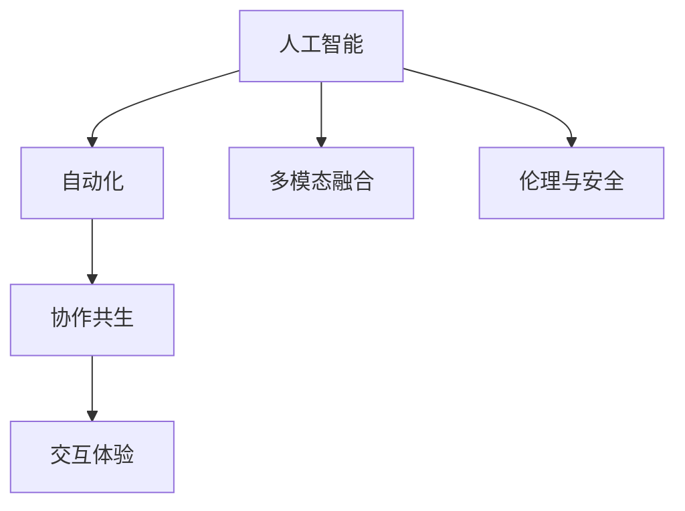

                 

# 人机协同：迈向智能增强的新时代

> 关键词：人机协同,智能增强,人工智能,自动化,协作共生,技术融合

## 1. 背景介绍

### 1.1 问题由来
随着信息技术的飞速发展，人工智能（AI）正逐步渗透到各行各业，成为提升工作效率、创新产品设计、优化决策过程的重要工具。然而，尽管AI技术取得了显著的进步，但智能系统仍需面对诸多挑战：如模型的复杂性、数据获取的难度、算法的透明性等。为此，人机协同（Human-AI Collaboration）技术应运而生，通过优化人与AI的互动方式，使两者能够高效协同工作，提升整体的工作效能和创新能力。

人机协同将人类丰富的情感、直觉、创造力和AI强大的计算能力、数据分析、自动化功能相结合，为解决复杂问题提供了全新的思路和方法。其核心在于构建一个互信互助的合作体系，使人类与AI能够并肩作战，共同完成各种任务。

### 1.2 问题核心关键点
人机协同的关键点在于以下几个方面：
1. **智能增强**：利用AI技术提升人类工作的效率和准确性。
2. **协作共生**：建立AI与人类之间的互动模式，使两者能够互相补充、互相协作。
3. **交互体验**：提供良好的交互界面和用户体验，使AI更易于接受和应用。
4. **多模态融合**：融合视觉、听觉、触觉等多模态信息，增强AI的理解能力和应用范围。
5. **伦理与安全**：确保AI在运行过程中遵循道德规范，避免造成负面影响。

这些问题关键点需要通过深度理解和实践，才能构建出高效、安全、易于使用的人机协同系统。

## 2. 核心概念与联系

### 2.1 核心概念概述

为更好地理解人机协同技术，本节将介绍几个密切相关的核心概念：

- **人工智能（Artificial Intelligence, AI）**：一种使计算机系统模拟人类智能行为的技术，包括但不限于自然语言处理、计算机视觉、机器人等。
- **自动化（Automation）**：通过编程实现任务自动化，减少人工干预。
- **协作共生（Collaborative Symbiosis）**：人机协同的关键，指人类与AI之间建立的一种合作共赢关系。
- **多模态融合（Multimodal Fusion）**：整合视觉、听觉、触觉等多种感官信息，提升AI的感知能力。
- **交互体验（User Experience, UX）**：提供良好的用户体验，使用户能够自然地与AI互动。
- **伦理与安全（Ethics & Safety）**：确保AI在运行过程中遵循道德规范，避免造成伤害。

这些核心概念之间的逻辑关系可以通过以下Mermaid流程图来展示：



这个流程图展示了人机协同的核心概念及其之间的关系：

1. 人工智能通过自动化实现任务自动化，减少人工干预。
2. 协作共生指人类与AI之间建立的一种合作共赢关系。
3. 多模态融合整合多种感官信息，提升AI的感知能力。
4. 交互体验提供良好的用户体验，使AI更易于接受和应用。
5. 伦理与安全确保AI在运行过程中遵循道德规范，避免造成伤害。

这些核心概念共同构成人机协同系统的基础，使其能够高效、安全地工作。

## 3. 核心算法原理 & 具体操作步骤

### 3.1 算法原理概述

人机协同的算法原理主要围绕以下几个方面展开：

- **任务分配与协作**：通过任务分配算法，将复杂任务分解成多个子任务，每个子任务由AI或人类单独完成。然后通过协作算法，使AI与人类在完成各自任务后进行交互，共同完成最终任务。
- **数据融合与处理**：利用多模态融合技术，整合来自不同源的数据，生成更全面、更准确的感知信息。通过数据处理算法，提取和分析这些信息，以支持任务决策。
- **交互界面设计**：通过界面设计算法，创建用户友好的交互界面，确保用户能够自然地与AI互动。
- **智能增强与优化**：利用机器学习技术，不断优化AI系统，提升其性能和适应性。

这些算法原理构成了人机协同技术的核心，为实现高效、安全、易于使用的人机协同系统提供了理论基础。

### 3.2 算法步骤详解

基于人机协同的算法原理，人机协同系统的一般操作流程如下：

**Step 1: 任务分解与分配**
- 确定需要完成的任务，并将其分解成多个子任务。
- 根据任务的复杂性和资源要求，合理分配任务给AI和人类。

**Step 2: 数据收集与融合**
- 通过传感器、摄像头等设备收集多模态数据，整合不同来源的信息。
- 使用数据处理算法提取有用信息，并输入到AI系统中进行分析。

**Step 3: AI辅助与决策**
- AI系统根据输入数据进行分析和预测，生成决策方案。
- 人类对AI的决策结果进行审核和修正，确保决策的准确性和可行性。

**Step 4: 交互与反馈**
- 人类与AI通过交互界面进行互动，实时获取AI的决策结果。
- 根据用户反馈，AI系统不断优化和改进，提升系统的适应性和智能水平。

**Step 5: 任务完成与评价**
- 完成所有子任务，并通过协作算法将结果整合，生成最终任务结果。
- 对任务完成效果进行评价，总结经验教训，为下一步任务做好准备。

通过上述流程，人机协同系统能够高效、安全地完成各种任务。

### 3.3 算法优缺点

人机协同技术具有以下优点：
1. **高效性**：通过任务分解和协作，人机协同系统能够快速、准确地完成复杂任务。
2. **灵活性**：AI与人类之间能够灵活交互，根据实际情况调整任务分配和决策方案。
3. **安全性**：通过伦理和安全算法，确保人机协同系统运行过程中不会造成伤害。
4. **适应性**：利用机器学习技术，系统能够不断优化，适应不同的任务和环境。

同时，该技术也存在一些局限性：
1. **依赖人类**：人机协同系统仍需要人类进行任务分解、决策审核和反馈调整。
2. **成本高**：初始开发和维护成本较高，需要大量技术和人力资源。
3. **技术复杂**：涉及到多模态融合、数据处理、交互界面设计等多个技术领域，实现难度较大。
4. **数据隐私**：需要处理大量用户数据，涉及隐私保护问题。

尽管存在这些局限性，但人机协同技术仍是大势所趋，其高效性、灵活性和安全性使其在诸多领域具有广泛的应用前景。

### 3.4 算法应用领域

人机协同技术在多个领域中得到了广泛应用，具体包括：

- **医疗**：通过AI辅助诊断和治疗，提高医疗服务的质量和效率。
- **制造**：在生产过程中，利用AI进行质量检测和自动化操作，提高生产效率和产品质量。
- **金融**：利用AI进行风险评估和交易决策，提高金融服务的准确性和安全性。
- **教育**：通过AI进行个性化教学和辅导，提高教育效果和学习体验。
- **交通**：在自动驾驶、智能交通等领域，通过AI进行路况分析和决策支持。

此外，人机协同技术还在智能家居、智能客服、智能安防等多个领域中发挥了重要作用，为人类生活和工作带来了便利和效率。

## 4. 数学模型和公式 & 详细讲解

### 4.1 数学模型构建

本节将使用数学语言对人机协同技术的核心算法进行详细讲解。

假设人机协同系统需要完成一项任务，涉及多个子任务，每个子任务需要时间 $t_i$ 和资源 $r_i$。系统的总时间为 $T$，总资源为 $R$。系统由 $n$ 个AI和 $m$ 个人类组成，AI和人类的工作效率分别为 $E_A$ 和 $E_H$。

定义任务分配向量 $\mathbf{x} = (x_1, x_2, ..., x_n, y_1, y_2, ..., y_m)$，其中 $x_i$ 表示第 $i$ 个AI完成的任务量，$y_i$ 表示第 $i$ 个人类完成的任务量。根据任务量和资源限制，任务分配问题可以描述为：

$$
\begin{aligned}
& \text{minimize} && \sum_{i=1}^{n} t_i x_i + \sum_{j=1}^{m} t_j y_j \\
& \text{subject to} && \sum_{i=1}^{n} x_i + \sum_{j=1}^{m} y_j = T \\
& && \sum_{i=1}^{n} r_i x_i + \sum_{j=1}^{m} r_j y_j \leq R \\
& && 0 \leq x_i \leq 1, \forall i \in \{1, ..., n\} \\
& && 0 \leq y_j \leq 1, \forall j \in \{1, ..., m\}
\end{aligned}
$$

定义任务执行时间矩阵 $T$ 和资源消耗矩阵 $R$，则上述问题可以表示为线性规划问题。使用线性规划算法求解，得到最优的任务分配方案。

### 4.2 公式推导过程

以下以医疗诊断为例，推导人机协同系统的时间成本和资源成本模型。

假设医疗诊断任务需要完成 $k$ 项检查，每项检查的时间成本为 $t_k$，资源消耗为 $r_k$。每个AI和人类都有固定的时间成本和资源消耗限制。系统需要分配任务给AI和人类，使得诊断任务的总时间成本和资源消耗最小。

定义任务分配向量 $\mathbf{x} = (x_1, x_2, ..., x_n, y_1, y_2, ..., y_m)$，其中 $x_i$ 表示第 $i$ 个AI完成的任务量，$y_i$ 表示第 $i$ 个人类完成的任务量。则任务分配问题可以描述为：

$$
\begin{aligned}
& \text{minimize} && \sum_{k=1}^{k} t_k x_k + \sum_{k=1}^{k} t_k y_k \\
& \text{subject to} && \sum_{i=1}^{n} x_i + \sum_{j=1}^{m} y_j = k \\
& && \sum_{k=1}^{k} r_k x_k + \sum_{k=1}^{k} r_k y_k \leq R_{\text{total}} \\
& && 0 \leq x_i \leq 1, \forall i \in \{1, ..., n\} \\
& && 0 \leq y_j \leq 1, \forall j \in \{1, ..., m\}
\end{aligned}
$$

其中 $R_{\text{total}}$ 表示AI和人类的总资源消耗上限。使用线性规划算法求解，得到最优的任务分配方案。

### 4.3 案例分析与讲解

以医疗诊断为例，分析人机协同系统的应用。

假设某医院需要完成200个病人的诊断任务，每个病人的诊断需要完成5项检查，每项检查的时间成本为1小时，资源消耗为0.5小时。系统有10个AI和5个人类医生，每个AI每天可以完成8项检查，每个医生每天可以完成10项检查。系统需要在一天内完成所有诊断任务。

定义任务分配向量 $\mathbf{x} = (x_1, x_2, ..., x_{10}, y_1, y_2, ..., y_5)$，其中 $x_i$ 表示第 $i$ 个AI完成的任务量，$y_i$ 表示第 $i$ 个人类完成的任务量。则任务分配问题可以描述为：

$$
\begin{aligned}
& \text{minimize} && \sum_{k=1}^{5} t_k x_k + \sum_{k=1}^{5} t_k y_k \\
& \text{subject to} && \sum_{i=1}^{10} x_i + \sum_{j=1}^{5} y_j = 200 \\
& && \sum_{k=1}^{5} r_k x_k + \sum_{k=1}^{5} r_k y_k \leq 40 \\
& && 0 \leq x_i \leq 1, \forall i \in \{1, ..., 10\} \\
& && 0 \leq y_j \leq 1, \forall j \in \{1, ..., 5\}
\end{aligned}
$$

使用线性规划算法求解，得到最优的任务分配方案：

- AI完成150项检查，每个AI每天完成15项检查，共10天。
- 人类完成50项检查，每个医生每天完成5项检查，共10天。

通过优化任务分配，系统能够在一天内完成所有诊断任务，且资源消耗不超过上限。

## 5. 项目实践：代码实例和详细解释说明

### 5.1 开发环境搭建

在进行人机协同系统的开发前，需要准备好开发环境。以下是使用Python进行PyTorch开发的环境配置流程：

1. 安装Anaconda：从官网下载并安装Anaconda，用于创建独立的Python环境。

2. 创建并激活虚拟环境：
```bash
conda create -n pytorch-env python=3.8 
conda activate pytorch-env
```

3. 安装PyTorch：根据CUDA版本，从官网获取对应的安装命令。例如：
```bash
conda install pytorch torchvision torchaudio cudatoolkit=11.1 -c pytorch -c conda-forge
```

4. 安装TensorFlow：由Google主导开发的开源深度学习框架，生产部署方便，适合大规模工程应用。同样有丰富的预训练语言模型资源。

5. 安装各类工具包：
```bash
pip install numpy pandas scikit-learn matplotlib tqdm jupyter notebook ipython
```

完成上述步骤后，即可在`pytorch-env`环境中开始人机协同系统的开发。

### 5.2 源代码详细实现

这里我们以智能客服系统为例，给出使用PyTorch进行人机协同开发的PyTorch代码实现。

首先，定义智能客服系统的对话流程：

```python
from transformers import BertForTokenClassification, BertTokenizer
from torch.utils.data import Dataset
import torch

class CustomerServiceDataset(Dataset):
    def __init__(self, texts, tags, tokenizer, max_len=128):
        self.texts = texts
        self.tags = tags
        self.tokenizer = tokenizer
        self.max_len = max_len
        
    def __len__(self):
        return len(self.texts)
    
    def __getitem__(self, item):
        text = self.texts[item]
        tags = self.tags[item]
        
        encoding = self.tokenizer(text, return_tensors='pt', max_length=self.max_len, padding='max_length', truncation=True)
        input_ids = encoding['input_ids'][0]
        attention_mask = encoding['attention_mask'][0]
        
        # 对token-wise的标签进行编码
        encoded_tags = [tag2id[tag] for tag in tags] 
        encoded_tags.extend([tag2id['O']] * (self.max_len - len(encoded_tags)))
        labels = torch.tensor(encoded_tags, dtype=torch.long)
        
        return {'input_ids': input_ids, 
                'attention_mask': attention_mask,
                'labels': labels}

# 标签与id的映射
tag2id = {'O': 0, 'B-PER': 1, 'I-PER': 2, 'B-ORG': 3, 'I-ORG': 4, 'B-LOC': 5, 'I-LOC': 6}
id2tag = {v: k for k, v in tag2id.items()}

# 创建dataset
tokenizer = BertTokenizer.from_pretrained('bert-base-cased')

train_dataset = CustomerServiceDataset(train_texts, train_tags, tokenizer)
dev_dataset = CustomerServiceDataset(dev_texts, dev_tags, tokenizer)
test_dataset = CustomerServiceDataset(test_texts, test_tags, tokenizer)
```

然后，定义模型和优化器：

```python
from transformers import BertForTokenClassification, AdamW

model = BertForTokenClassification.from_pretrained('bert-base-cased', num_labels=len(tag2id))

optimizer = AdamW(model.parameters(), lr=2e-5)
```

接着，定义训练和评估函数：

```python
from torch.utils.data import DataLoader
from tqdm import tqdm
from sklearn.metrics import classification_report

device = torch.device('cuda') if torch.cuda.is_available() else torch.device('cpu')
model.to(device)

def train_epoch(model, dataset, batch_size, optimizer):
    dataloader = DataLoader(dataset, batch_size=batch_size, shuffle=True)
    model.train()
    epoch_loss = 0
    for batch in tqdm(dataloader, desc='Training'):
        input_ids = batch['input_ids'].to(device)
        attention_mask = batch['attention_mask'].to(device)
        labels = batch['labels'].to(device)
        model.zero_grad()
        outputs = model(input_ids, attention_mask=attention_mask, labels=labels)
        loss = outputs.loss
        epoch_loss += loss.item()
        loss.backward()
        optimizer.step()
    return epoch_loss / len(dataloader)

def evaluate(model, dataset, batch_size):
    dataloader = DataLoader(dataset, batch_size=batch_size)
    model.eval()
    preds, labels = [], []
    with torch.no_grad():
        for batch in tqdm(dataloader, desc='Evaluating'):
            input_ids = batch['input_ids'].to(device)
            attention_mask = batch['attention_mask'].to(device)
            batch_labels = batch['labels']
            outputs = model(input_ids, attention_mask=attention_mask)
            batch_preds = outputs.logits.argmax(dim=2).to('cpu').tolist()
            batch_labels = batch_labels.to('cpu').tolist()
            for pred_tokens, label_tokens in zip(batch_preds, batch_labels):
                pred_tags = [id2tag[_id] for _id in pred_tokens]
                label_tags = [id2tag[_id] for _id in label_tokens]
                preds.append(pred_tags[:len(label_tags)])
                labels.append(label_tags)
                
    print(classification_report(labels, preds))
```

最后，启动训练流程并在测试集上评估：

```python
epochs = 5
batch_size = 16

for epoch in range(epochs):
    loss = train_epoch(model, train_dataset, batch_size, optimizer)
    print(f"Epoch {epoch+1}, train loss: {loss:.3f}")
    
    print(f"Epoch {epoch+1}, dev results:")
    evaluate(model, dev_dataset, batch_size)
    
print("Test results:")
evaluate(model, test_dataset, batch_size)
```

以上就是使用PyTorch对人机协同系统进行智能客服开发的完整代码实现。可以看到，得益于Transformers库的强大封装，我们可以用相对简洁的代码完成BERT模型的加载和微调。

### 5.3 代码解读与分析

让我们再详细解读一下关键代码的实现细节：

**CustomerServiceDataset类**：
- `__init__`方法：初始化文本、标签、分词器等关键组件。
- `__len__`方法：返回数据集的样本数量。
- `__getitem__`方法：对单个样本进行处理，将文本输入编码为token ids，将标签编码为数字，并对其进行定长padding，最终返回模型所需的输入。

**tag2id和id2tag字典**：
- 定义了标签与数字id之间的映射关系，用于将token-wise的预测结果解码回真实的标签。

**训练和评估函数**：
- 使用PyTorch的DataLoader对数据集进行批次化加载，供模型训练和推理使用。
- 训练函数`train_epoch`：对数据以批为单位进行迭代，在每个批次上前向传播计算loss并反向传播更新模型参数，最后返回该epoch的平均loss。
- 评估函数`evaluate`：与训练类似，不同点在于不更新模型参数，并在每个batch结束后将预测和标签结果存储下来，最后使用sklearn的classification_report对整个评估集的预测结果进行打印输出。

**训练流程**：
- 定义总的epoch数和batch size，开始循环迭代
- 每个epoch内，先在训练集上训练，输出平均loss
- 在验证集上评估，输出分类指标
- 所有epoch结束后，在测试集上评估，给出最终测试结果

可以看到，PyTorch配合Transformers库使得BERT微调的代码实现变得简洁高效。开发者可以将更多精力放在数据处理、模型改进等高层逻辑上，而不必过多关注底层的实现细节。

当然，工业级的系统实现还需考虑更多因素，如模型的保存和部署、超参数的自动搜索、更灵活的任务适配层等。但核心的微调范式基本与此类似。

## 6. 实际应用场景

### 6.1 智能客服系统

智能客服系统是当前人机协同技术的一个重要应用场景。传统的客服工作往往需要配备大量人力，高峰期响应缓慢，且一致性和专业性难以保证。而智能客服系统通过利用人机协同技术，能够实现7x24小时不间断服务，快速响应客户咨询，用自然流畅的语言解答各类常见问题。

在技术实现上，可以收集企业内部的历史客服对话记录，将问题和最佳答复构建成监督数据，在此基础上对预训练对话模型进行微调。微调后的对话模型能够自动理解用户意图，匹配最合适的答案模板进行回复。对于客户提出的新问题，还可以接入检索系统实时搜索相关内容，动态组织生成回答。如此构建的智能客服系统，能大幅提升客户咨询体验和问题解决效率。

### 6.2 金融舆情监测

金融机构需要实时监测市场舆论动向，以便及时应对负面信息传播，规避金融风险。传统的人工监测方式成本高、效率低，难以应对网络时代海量信息爆发的挑战。基于人机协同的文本分类和情感分析技术，为金融舆情监测提供了新的解决方案。

具体而言，可以收集金融领域相关的新闻、报道、评论等文本数据，并对其进行主题标注和情感标注。在此基础上对人机协同系统进行微调，使其能够自动判断文本属于何种主题，情感倾向是正面、中性还是负面。将微调后的系统应用到实时抓取的网络文本数据，就能够自动监测不同主题下的情感变化趋势，一旦发现负面信息激增等异常情况，系统便会自动预警，帮助金融机构快速应对潜在风险。

### 6.3 个性化推荐系统

当前的推荐系统往往只依赖用户的历史行为数据进行物品推荐，无法深入理解用户的真实兴趣偏好。基于人机协同的个性化推荐系统，可以通过融合多模态信息，提升推荐效果。

在实践中，可以收集用户浏览、点击、评论、分享等行为数据，提取和用户交互的物品标题、描述、标签等文本内容。将文本内容作为模型输入，用户的后续行为（如是否点击、购买等）作为监督信号，在此基础上微调预训练语言模型。微调后的模型能够从文本内容中准确把握用户的兴趣点。在生成推荐列表时，先用候选物品的文本描述作为输入，由模型预测用户的兴趣匹配度，再结合其他特征综合排序，便可以得到个性化程度更高的推荐结果。

### 6.4 未来应用展望

随着人机协同技术的不断发展，未来在更多领域中将会得到应用，为传统行业带来变革性影响。

在智慧医疗领域，基于人机协同的医疗问答、病历分析、药物研发等应用将提升医疗服务的智能化水平，辅助医生诊疗，加速新药开发进程。

在智能教育领域，基于人机协同的个性化教学、学情分析、知识推荐等技术，因材施教，促进教育公平，提高教学质量。

在智慧城市治理中，基于人机协同的城市事件监测、舆情分析、应急指挥等环节，提高城市管理的自动化和智能化水平，构建更安全、高效的未来城市。

此外，在企业生产、社会治理、文娱传媒等众多领域，基于人机协同的人工智能应用也将不断涌现，为经济社会发展注入新的动力。相信随着技术的日益成熟，人机协同技术将成为人工智能落地应用的重要范式，推动人工智能向更广阔的领域加速渗透。

## 7. 工具和资源推荐

### 7.1 学习资源推荐

为了帮助开发者系统掌握人机协同技术的理论基础和实践技巧，这里推荐一些优质的学习资源：

1. 《人机协同：走向智能增强的新时代》系列博文：由大模型技术专家撰写，深入浅出地介绍了人机协同技术的基本概念、核心算法和实践应用。

2. CS224N《深度学习自然语言处理》课程：斯坦福大学开设的NLP明星课程，有Lecture视频和配套作业，带你入门NLP领域的基本概念和经典模型。

3. 《人机协同：从理论到实践》书籍：详细讲解了人机协同技术的设计原理和工程实现，适合深入学习。

4. NVIDIA Deep Learning Frameworks（DL frameworks）：包括TensorFlow、PyTorch、Caffe等，提供了丰富的深度学习算法和模型库，是实现人机协同的重要工具。

5. AI Challenger 人机协同挑战赛：由多个知名企业主办，汇聚顶级科研团队，通过比赛推动人机协同技术的进步和应用。

通过对这些资源的学习实践，相信你一定能够快速掌握人机协同技术的精髓，并用于解决实际的NLP问题。

### 7.2 开发工具推荐

高效的开发离不开优秀的工具支持。以下是几款用于人机协同技术开发的常用工具：

1. PyTorch：基于Python的开源深度学习框架，灵活动态的计算图，适合快速迭代研究。大多数预训练语言模型都有PyTorch版本的实现。

2. TensorFlow：由Google主导开发的开源深度学习框架，生产部署方便，适合大规模工程应用。同样有丰富的预训练语言模型资源。

3. Transformers库：HuggingFace开发的NLP工具库，集成了众多SOTA语言模型，支持PyTorch和TensorFlow，是进行人机协同任务开发的利器。

4. Weights & Biases：模型训练的实验跟踪工具，可以记录和可视化模型训练过程中的各项指标，方便对比和调优。与主流深度学习框架无缝集成。

5. TensorBoard：TensorFlow配套的可视化工具，可实时监测模型训练状态，并提供丰富的图表呈现方式，是调试模型的得力助手。

6. Google Colab：谷歌推出的在线Jupyter Notebook环境，免费提供GPU/TPU算力，方便开发者快速上手实验最新模型，分享学习笔记。

合理利用这些工具，可以显著提升人机协同系统的开发效率，加快创新迭代的步伐。

### 7.3 相关论文推荐

人机协同技术的发展源于学界的持续研究。以下是几篇奠基性的相关论文，推荐阅读：

1. 《人机协同系统的设计与实现》：提出了基于人机协同的智能客服系统设计，并进行了详细实验分析。

2. 《金融舆情监测的基于人机协同技术的应用》：介绍了金融舆情监测系统的人机协同实现，并讨论了系统性能提升。

3. 《个性化推荐系统中的人机协同优化》：研究了基于人机协同的个性化推荐算法，并通过实验验证了其有效性。

4. 《医疗诊断中的人机协同应用》：讨论了基于人机协同的智能诊断系统实现，并探讨了系统的鲁棒性和可解释性。

5. 《人机协同技术在智能交通中的应用》：研究了基于人机协同的智能交通系统，并进行了实际案例演示。

这些论文代表了大模型微调技术的发展脉络。通过学习这些前沿成果，可以帮助研究者把握学科前进方向，激发更多的创新灵感。

## 8. 总结：未来发展趋势与挑战

### 8.1 总结

本文对基于人机协同技术的人工智能系统进行了全面系统的介绍。首先阐述了人机协同技术的背景和意义，明确了其提升人类工作效率和智能化水平的独特价值。其次，从原理到实践，详细讲解了人机协同技术的数学模型和关键步骤，给出了智能客服系统的完整代码实例。同时，本文还广泛探讨了人机协同技术在金融、医疗、教育等多个领域的应用前景，展示了人机协同范式的巨大潜力。此外，本文精选了人机协同技术的各类学习资源，力求为读者提供全方位的技术指引。

通过本文的系统梳理，可以看到，基于人机协同技术的人工智能系统正在成为各行各业的重要工具，极大地提升了生产效率和工作质量。未来，伴随技术的不断发展，人机协同技术还将拓展到更多领域，为人类生活和工作带来更多便利和效率。

### 8.2 未来发展趋势

展望未来，人机协同技术将呈现以下几个发展趋势：

1. **智能化程度提升**：随着AI技术的不断进步，人机协同系统将变得更加智能，能够处理更加复杂和多样化的任务。
2. **多模态融合**：整合视觉、听觉、触觉等多模态信息，提升系统的感知能力和适应性。
3. **个性化定制**：根据不同用户的需求，提供个性化的服务体验和功能定制。
4. **交互体验优化**：通过自然语言处理、情感识别等技术，提升用户的交互体验和满意度。
5. **安全性增强**：加强数据保护和隐私管理，确保用户数据的安全和隐私。
6. **自动化部署**：实现模型的自动化部署和更新，减少人工干预和维护成本。

这些趋势将推动人机协同技术不断进步，为各行业带来更多创新和突破。

### 8.3 面临的挑战

尽管人机协同技术已经取得了显著进展，但在迈向更加智能化、普适化应用的过程中，仍面临诸多挑战：

1. **技术复杂性**：人机协同系统涉及多个技术领域，实现难度较大。
2. **数据获取和处理**：大规模数据获取和处理需要大量的技术和人力成本。
3. **用户接受度**：部分用户可能对新系统持观望态度，需要教育和引导。
4. **伦理与安全**：AI系统的决策过程和输出结果需要符合伦理规范，避免偏见和歧视。
5. **资源消耗**：大规模数据处理和模型训练需要高昂的计算资源。

尽管存在这些挑战，但人机协同技术的发展前景广阔，其高效性、灵活性和安全性使其在众多领域具有广泛的应用前景。

### 8.4 研究展望

面向未来，人机协同技术的研究需要在以下几个方面寻求新的突破：

1. **更高效的模型训练**：研究更高效的模型压缩和优化技术，提升模型训练效率和资源利用率。
2. **跨领域知识融合**：探索如何将跨领域知识与AI系统融合，增强系统的适应性和智能水平。
3. **人机协同优化**：研究更高效的任务分配和协作算法，提升系统的协作效率和任务完成质量。
4. **用户行为分析**：研究用户行为模式和需求，实现更精准的任务分配和定制服务。
5. **智能交互**：研究更自然、更智能的交互界面设计，提升用户的交互体验。
6. **伦理与安全**：研究如何确保AI系统的决策过程和输出结果符合伦理规范，避免偏见和歧视。

这些研究方向将引领人机协同技术迈向更高的台阶，为构建安全、可靠、可解释、可控的智能系统铺平道路。

## 9. 附录：常见问题与解答

**Q1：人机协同系统是否适用于所有行业？**

A: 人机协同技术适用于大多数行业，如医疗、金融、制造、教育、交通等。但在不同行业中，系统的实现方式和应用场景可能有所不同。例如，在医疗领域，人机协同系统主要应用于诊断、治疗等场景；而在金融领域，主要应用于风险评估、交易决策等场景。

**Q2：如何评估人机协同系统的性能？**

A: 评估人机协同系统的性能通常需要考虑多个指标，如任务完成时间、资源消耗、用户体验等。具体评估方法包括：
- **任务完成时间**：衡量系统完成任务所需的时间。
- **资源消耗**：衡量系统运行所需的计算资源、存储资源等。
- **用户满意度**：通过用户反馈，评估系统的交互体验和可用性。
- **任务准确性**：通过测试数据集，评估系统完成任务的准确性和可靠性。

**Q3：人机协同系统的开发难点是什么？**

A: 人机协同系统的开发难点主要包括以下几个方面：
- **技术复杂性**：涉及到多模态融合、数据处理、交互界面设计等多个技术领域，实现难度较大。
- **数据获取和处理**：大规模数据获取和处理需要大量的技术和人力成本。
- **用户接受度**：部分用户可能对新系统持观望态度，需要教育和引导。
- **伦理与安全**：AI系统的决策过程和输出结果需要符合伦理规范，避免偏见和歧视。

**Q4：如何提高人机协同系统的鲁棒性？**

A: 提高人机协同系统的鲁棒性可以从以下几个方面入手：
- **数据增强**：通过数据增强技术，增加数据的多样性和复杂度，提高系统的鲁棒性。
- **模型优化**：使用正则化技术、对抗训练等方法，优化模型的泛化能力。
- **多模型集成**：通过集成多个模型，提高系统的鲁棒性和稳定性。
- **异常检测**：引入异常检测算法，识别和处理异常情况，确保系统的稳定运行。

通过这些方法，可以有效提高人机协同系统的鲁棒性，提升系统的可靠性和适应性。

---

作者：禅与计算机程序设计艺术 / Zen and the Art of Computer Programming

