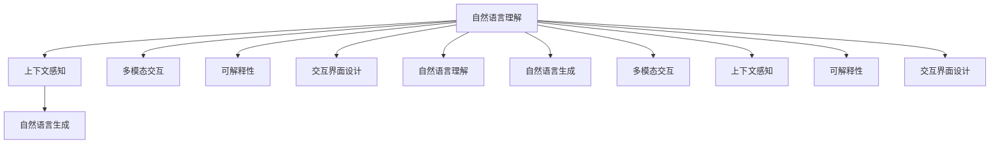

                 

# 人类-AI协作：增强人机沟通

## 1. 背景介绍

### 1.1 问题由来
在当今信息爆炸的时代，人机沟通已成为日常工作和生活中不可或缺的一部分。然而，传统的文本交互方式仍然存在诸多问题，如信息量不足、信息准确性差、交互复杂度高、难以满足复杂场景需求等。这些问题严重制约了人机沟通的效率和效果，亟需新的技术手段来改善这一状况。

### 1.2 问题核心关键点
为解决这些问题，近年来人工智能领域涌现出一种新兴技术——增强人机沟通（Augmented Human-Machine Communication，AHMC）。通过将人工智能技术与人类的自然语言理解、推理、生成能力相结合，能够在减少沟通成本、提升信息量、增强交互体验等方面带来显著提升。

## 2. 核心概念与联系

### 2.1 核心概念概述

为了更好地理解增强人机沟通技术，我们首先介绍几个关键概念：

- **增强人机沟通（AHMC）**：一种融合人工智能与人类智能的技术，旨在通过智能技术增强人机沟通的效率和质量，减少沟通成本，提高信息量和准确性。

- **自然语言理解（NLU）**：使机器能够理解人类自然语言的技术，包括语义理解、实体识别、情感分析、语境理解等。

- **自然语言生成（NLG）**：使机器能够生成符合语法规则和语义逻辑的自然语言文本，如自动摘要、文本创作、对话生成等。

- **多模态交互**：结合文字、语音、图像、视频等多种信息模态，提升人机交互的沉浸感和丰富性。

- **上下文感知**：使机器能够理解上下文关系，如问答、对话、推荐等任务中的情景关系，提升沟通的连贯性和逻辑性。

- **可解释性**：使机器的决策过程透明化，增强用户对系统输出结果的可理解性和信任度。

- **交互界面设计**：设计直观、友好、易用的交互界面，增强用户体验，降低使用门槛。

这些核心概念共同构成了增强人机沟通技术的基本框架，涵盖了从自然语言理解到自然语言生成、从多模态交互到上下文感知等多个方面。通过这些技术手段，AI系统能够更好地理解和生成自然语言，提升人机沟通的质量和效率。

### 2.2 核心概念原理和架构的 Mermaid 流程图



这个流程图展示了增强人机沟通技术的核心组件及其之间的联系：

1. **自然语言理解**：通过语义理解、实体识别等技术，使AI能够理解人类语言内容。
2. **上下文感知**：使AI能够理解上下文关系，提升沟通连贯性和逻辑性。
3. **自然语言生成**：使AI能够生成符合语法和语义的自然语言文本。
4. **多模态交互**：结合文字、语音、图像等多种信息模态，提升交互体验。
5. **可解释性**：使AI的决策过程透明化，增强用户信任度。
6. **交互界面设计**：设计直观、友好的交互界面，增强用户体验。

## 3. 核心算法原理 & 具体操作步骤

### 3.1 算法原理概述

增强人机沟通技术的核心在于利用自然语言处理（NLP）技术，结合人工智能的深度学习、知识图谱、推理等能力，实现高效、准确、自然的人机交互。其基本流程包括：

1. **自然语言理解**：将人类输入的自然语言文本转换为机器可以理解的形式。
2. **上下文感知**：根据对话历史和上下文信息，理解当前输入的语境和含义。
3. **自然语言生成**：基于上下文感知的结果，生成符合语境的自然语言文本。
4. **多模态交互**：结合语音、图像等多种信息模态，提升人机交互的丰富性和沉浸感。
5. **可解释性**：对AI的决策过程进行解释，增强用户理解和信任。

### 3.2 算法步骤详解

以下详细介绍增强人机沟通技术的具体操作步骤：

**Step 1: 数据收集与预处理**

- 收集人机交互历史数据，包括对话内容、情感倾向、上下文关系等。
- 对数据进行清洗、去噪、标注，准备用于训练的监督数据集。

**Step 2: 模型构建与训练**

- 选择适合自然语言理解、自然语言生成等任务的预训练模型，如BERT、GPT、T5等。
- 对模型进行微调，使其适应特定的任务需求。
- 引入多模态交互和上下文感知模块，提升模型在多模态环境下的表现。

**Step 3: 交互过程**

- 设计交互界面，用户可通过文字、语音、图像等多种方式输入。
- 将用户输入转换为机器可理解的形式，如文本、语音特征等。
- 模型对用户输入进行理解和推理，生成响应文本或语音。
- 响应结果通过界面展示或语音播放，供用户反馈。

**Step 4: 反馈与迭代**

- 用户对AI的响应进行反馈，模型根据反馈调整自身参数和逻辑。
- 在不断迭代中，模型逐步提升理解和生成的能力，降低误判和误生成。

### 3.3 算法优缺点

增强人机沟通技术的优点包括：

- **效率高**：通过自动化处理大量自然语言文本，显著减少人工处理的时间和成本。
- **准确性高**：结合深度学习和知识图谱技术，能够理解复杂的语境和逻辑关系。
- **多模态支持**：结合语音、图像等多种信息模态，提升人机交互的丰富性和沉浸感。
- **可解释性强**：通过可解释性技术，使AI的决策过程透明化，增强用户理解和信任。

然而，该技术也存在一些缺点：

- **技术门槛高**：需要高水平的NLP技术和多模态交互设计，开发成本较高。
- **数据依赖性大**：模型的性能依赖于高质量的标注数据，数据收集和预处理成本高。
- **动态环境适应性差**：在动态环境（如实时对话、社交媒体等）中，模型可能难以即时适应新情况。
- **伦理和隐私问题**：需要确保数据隐私和安全，避免数据滥用和误用。

### 3.4 算法应用领域

增强人机沟通技术已经在多个领域得到了广泛应用，包括但不限于：

- **智能客服**：通过自然语言理解和生成技术，自动处理客户咨询，提升服务效率。
- **智能翻译**：结合多模态交互和上下文感知，提升翻译质量和用户体验。
- **智能助手**：在家庭、办公、医疗等领域提供语音交互和情境感知服务。
- **个性化推荐**：结合用户行为和上下文信息，生成个性化推荐结果，提升用户满意度。
- **情感分析**：分析用户情感倾向，提升社交媒体和客户关系管理的效果。

## 4. 数学模型和公式 & 详细讲解 & 举例说明

### 4.1 数学模型构建

增强人机沟通技术的数学模型主要由以下几个部分构成：

- **自然语言理解模型**：如BERT、GPT等，通过自监督或监督学习任务训练，学习语言的语义表示。
- **上下文感知模型**：如Transformer、GNN等，学习上下文关系，提升模型在复杂情景下的表现。
- **自然语言生成模型**：如GPT、T5等，生成符合语法和语义的自然语言文本。
- **多模态交互模型**：如CNN、RNN等，处理图像、语音等多种信息模态，提升交互丰富性。

### 4.2 公式推导过程

以自然语言理解模型BERT为例，其训练过程主要分为自监督和监督两个阶段。自监督阶段通过掩码语言模型（Masked Language Modeling, MLM）等任务，学习语言的语义表示。监督阶段通过下游任务（如问答、分类、生成等）的标注数据，进行微调，提升模型在特定任务上的表现。

BERT的训练过程可以通过以下公式表示：

$$
\min_{\theta} \mathcal{L}(\theta) = \min_{\theta} (\mathcal{L}_{\text{MLM}}(\theta) + \mathcal{L}_{\text{task}}(\theta))
$$

其中 $\mathcal{L}_{\text{MLM}}(\theta)$ 为掩码语言模型的损失函数，$\mathcal{L}_{\text{task}}(\theta)$ 为下游任务的损失函数。

### 4.3 案例分析与讲解

以智能客服为例，自然语言理解模型通过训练数据学习客户咨询的语义表示，上下文感知模型学习对话历史和当前情境的上下文关系，自然语言生成模型生成适当的回复。整个交互过程可以表示为以下公式：

$$
\hat{y} = \text{NLU}(x) \rightarrow \text{CF}(\hat{y}, \text{hist}) \rightarrow \text{NLG}(\text{CF}(\hat{y}, \text{hist}))
$$

其中 $\text{NLU}$ 表示自然语言理解，$\text{CF}$ 表示上下文感知，$\text{NLG}$ 表示自然语言生成，$x$ 表示客户咨询的文本，$\text{hist}$ 表示对话历史，$\hat{y}$ 表示模型生成的回复。

## 5. 项目实践：代码实例和详细解释说明

### 5.1 开发环境搭建

在进行项目实践前，需要搭建好开发环境。以下是使用Python进行TensorFlow开发的环境配置流程：

1. 安装Anaconda：从官网下载并安装Anaconda，用于创建独立的Python环境。

2. 创建并激活虚拟环境：
```bash
conda create -n tf-env python=3.8 
conda activate tf-env
```

3. 安装TensorFlow：根据CUDA版本，从官网获取对应的安装命令。例如：
```bash
conda install tensorflow=2.7-cp38-cp38
```

4. 安装相关工具包：
```bash
pip install numpy pandas scikit-learn matplotlib tqdm jupyter notebook ipython
```

完成上述步骤后，即可在`tf-env`环境中开始项目实践。

### 5.2 源代码详细实现

以下给出使用TensorFlow实现智能客服对话的代码示例：

```python
import tensorflow as tf
from transformers import TFAutoModelForSequenceClassification, AutoTokenizer
import numpy as np

# 加载预训练模型和分词器
model = TFAutoModelForSequenceClassification.from_pretrained('bert-base-uncased')
tokenizer = AutoTokenizer.from_pretrained('bert-base-uncased')

# 定义自然语言理解模型
class NLU(tf.keras.layers.Layer):
    def __init__(self):
        super(NLU, self).__init__()
        self.bert = model

    def call(self, input_ids, attention_mask):
        output = self.bert(input_ids=input_ids, attention_mask=attention_mask)
        return output

# 定义上下文感知模型
class CF(tf.keras.layers.Layer):
    def __init__(self):
        super(CF, self).__init__()
        self.lstm = tf.keras.layers.LSTM(units=64, return_sequences=True, input_shape=(None, 128))
        self.dense = tf.keras.layers.Dense(units=1, activation='sigmoid')

    def call(self, nlu_output, context):
        hidden_state = self.lstm(nlu_output, mask=tf.zeros((context.shape[0], 1)))
        return self.dense(hidden_state)

# 定义自然语言生成模型
class NLG(tf.keras.layers.Layer):
    def __init__(self):
        super(NLG, self).__init__()
        self.decoder = tf.keras.layers.LSTM(units=64, return_sequences=True, input_shape=(None, 128))
        self.out = tf.keras.layers.Dense(units=128, activation='softmax')

    def call(self, cf_output, context):
        hidden_state = self.decoder(cf_output, mask=tf.zeros((1, context.shape[0])))
        return self.out(hidden_state)

# 定义交互过程
def interaction(nlu_model, cf_model, nl_model, input_text):
    input_ids = tokenizer(input_text, return_tensors='tf').input_ids
    attention_mask = tokenizer(input_text, return_tensors='tf').attention_mask
    context = []
    while input_text != 'end':
        nlu_output = nlu_model(input_ids, attention_mask)
        context.append(nlu_output)
        context = np.append(context, np.zeros((1, 128)), axis=0)
        cf_output = cf_model(nlu_output, context)
        input_text = nl_model(cf_output, context)
    return input_text

# 示例交互
nlu_model = NLU()
cf_model = CF()
nl_model = NLG()
input_text = '你好，可以帮我查询一下最近的天气吗？'
output_text = interaction(nlu_model, cf_model, nl_model, input_text)
print(output_text)
```

在这个代码示例中，我们首先加载了预训练的BERT模型和分词器，然后定义了自然语言理解、上下文感知和自然语言生成三个模型模块。最后通过`interaction`函数模拟了一个简单的智能客服对话过程。

### 5.3 代码解读与分析

这个代码示例展示了如何构建基于BERT的智能客服对话模型。

- **NLU模型**：通过加载预训练的BERT模型，实现自然语言理解功能。在实际应用中，NLU模型需要与具体的客服场景进行适配，如添加特定领域的实体识别模块、情感分析模块等。

- **CF模型**：通过LSTM和Dense层，实现上下文感知功能。在对话过程中，CF模型会根据当前对话历史和上下文关系，调整生成回复的概率分布。

- **NLG模型**：通过LSTM和Softmax层，实现自然语言生成功能。在对话过程中，NLG模型会根据上下文关系和用户意图，生成符合语境的回复文本。

- **interaction函数**：实现了整个对话交互过程。用户输入自然语言文本，NLU模型进行理解，CF模型进行上下文感知，NLG模型生成回复，不断迭代直到用户输入"end"。

通过这个代码示例，我们可以看到增强人机沟通技术的基本实现流程，包括自然语言理解、上下文感知、自然语言生成等核心模块。在实际应用中，还需要进一步优化模型性能、设计交互界面、增强数据收集等，才能实现高效、准确、自然的人机沟通。

## 6. 实际应用场景

### 6.1 智能客服系统

智能客服系统是增强人机沟通技术的重要应用场景之一。传统客服系统依赖大量人工，响应慢、效率低、准确性差，无法满足用户日益增长的需求。通过自然语言理解、上下文感知和自然语言生成技术，智能客服系统可以大幅提升服务效率和质量。

具体应用包括：

- **自动回复**：通过自然语言理解模型，自动理解用户意图，生成符合语境的回复文本。
- **对话引导**：根据上下文感知模型，引导用户逐步完成咨询过程，提供更精准的服务。
- **知识图谱集成**：结合知识图谱技术，提供更全面的问题解答和信息推荐。
- **多模态交互**：结合语音、图像等多种信息模态，提升用户体验。

### 6.2 智能翻译系统

智能翻译系统是增强人机沟通技术的另一重要应用。传统翻译系统依赖人工，效率低、成本高、准确性差，难以满足快速、准确的翻译需求。通过自然语言理解、上下文感知和自然语言生成技术，智能翻译系统可以大幅提升翻译质量和效率。

具体应用包括：

- **实时翻译**：通过自然语言理解模型，实时理解输入文本，生成目标语言的翻译结果。
- **上下文翻译**：根据上下文感知模型，理解文本的语境和含义，生成更准确的翻译结果。
- **多模态翻译**：结合语音、图像等多种信息模态，提供更全面的翻译服务。
- **情感翻译**：通过情感分析技术，理解输入文本的情感倾向，生成更符合情感的翻译结果。

### 6.3 智能助手

智能助手是增强人机沟通技术在家庭、办公、医疗等多个领域的广泛应用。通过自然语言理解、上下文感知和自然语言生成技术，智能助手可以提供更智能、更个性化的服务。

具体应用包括：

- **家庭助理**：通过自然语言理解，自动处理家务、娱乐、信息查询等任务。
- **办公助理**：通过自然语言理解，自动处理日程安排、邮件管理、信息推荐等任务。
- **医疗助理**：通过自然语言理解，自动处理病情查询、健康咨询、诊疗建议等任务。
- **客服助理**：通过自然语言理解，自动处理客户咨询、投诉、投诉跟进等任务。

### 6.4 未来应用展望

未来，随着增强人机沟通技术的不断进步，将在更多领域得到应用，为人类生产生活带来深刻变革。

- **智能医疗**：通过自然语言理解、上下文感知和自然语言生成技术，提升医疗服务水平，改善患者体验。
- **智能教育**：通过自然语言理解、上下文感知和自然语言生成技术，提供个性化教育服务，提升学习效果。
- **智能家居**：通过自然语言理解、上下文感知和自然语言生成技术，提升家居智能化水平，改善生活体验。
- **智能交通**：通过自然语言理解、上下文感知和自然语言生成技术，提升交通管理水平，改善出行体验。
- **智能城市**：通过自然语言理解、上下文感知和自然语言生成技术，提升城市治理水平，改善城市环境。

## 7. 工具和资源推荐

### 7.1 学习资源推荐

为了帮助开发者系统掌握增强人机沟通技术，以下是推荐的优质学习资源：

1. **自然语言处理基础教程**：如斯坦福大学《自然语言处理与深度学习》课程，详细介绍了NLP基础概念和深度学习算法。

2. **BERT模型文档**：Hugging Face提供的BERT模型官方文档，包括模型架构、训练、微调等详细说明。

3. **TensorFlow官方文档**：TensorFlow的官方文档，提供了丰富的API和样例代码，帮助开发者快速上手TensorFlow。

4. **Transformers官方文档**：Hugging Face的Transformers库官方文档，详细介绍了多种预训练语言模型的使用和微调方法。

5. **论文和博客**：阅读最新的自然语言处理相关论文和博客，了解最新研究进展和技术趋势。

6. **在线课程**：如Coursera、Udacity等平台上的自然语言处理相关课程，系统学习NLP理论和实践。

### 7.2 开发工具推荐

为了提高增强人机沟通技术的开发效率，以下是推荐的开发工具：

1. **Jupyter Notebook**：支持Python环境下的代码编写和数据分析，方便进行模型实验和调试。

2. **TensorFlow**：高性能的深度学习框架，提供丰富的API和样例代码，支持分布式训练和推理。

3. **Transformers**：Hugging Face提供的NLP库，支持多种预训练语言模型的使用和微调。

4. **NLTK**：自然语言处理工具包，提供丰富的NLP处理功能，如分词、词性标注、命名实体识别等。

5. **spaCy**：Python NLP库，提供高效的文本处理和模型训练功能，支持多语言处理。

6. **PyTorch**：深度学习框架，支持动态计算图和自动微分，适合研究性NLP任务。

### 7.3 相关论文推荐

增强人机沟通技术的发展源于学界的持续研究。以下是几篇奠基性的相关论文，推荐阅读：

1. **Sequence to Sequence Learning with Neural Networks**：Sutskever等人，提出了Seq2Seq模型，用于机器翻译等任务。

2. **Attention is All You Need**：Vaswani等人，提出了Transformer模型，用于自然语言理解、生成等任务。

3. **BERT: Pre-training of Deep Bidirectional Transformers for Language Understanding**：Devlin等人，提出了BERT模型，通过预训练和微调提升自然语言理解效果。

4. **T5: Exploring the Limits of Transfer Learning with a Unified Text-to-Text Transformer**：Raffel等人，提出了T5模型，结合多任务学习和自监督学习，提升自然语言生成效果。

5. **GPT-2: Language Models are Unsupervised Multitask Learners**：Radford等人，提出了GPT-2模型，展示了基于自监督学习的自然语言生成能力。

这些论文代表了大语言模型和增强人机沟通技术的发展脉络，通过学习这些前沿成果，可以帮助研究者把握学科前进方向，激发更多的创新灵感。

## 8. 总结：未来发展趋势与挑战

### 8.1 研究成果总结

增强人机沟通技术在自然语言处理、机器翻译、智能客服等多个领域取得了显著进展，提升了人机沟通的效率和质量，带来了深刻变革。主要成果包括：

- **自然语言理解**：通过BERT、GPT等预训练模型，提升了自然语言理解的效果和效率。
- **上下文感知**：通过Transformer、GNN等模型，提升了上下文感知的准确性和鲁棒性。
- **自然语言生成**：通过T5、GPT等模型，提升了自然语言生成的自然度和多样性。
- **多模态交互**：结合语音、图像等多种信息模态，提升了人机交互的丰富性和沉浸感。

### 8.2 未来发展趋势

未来，增强人机沟通技术将继续深化发展，呈现出以下几个趋势：

1. **深度学习和知识图谱的结合**：将深度学习和知识图谱技术相结合，提升模型在复杂情景下的表现。

2. **多模态交互的扩展**：结合语音、图像、视频等多种信息模态，提升人机交互的丰富性和沉浸感。

3. **上下文感知能力的提升**：提升上下文感知模型的鲁棒性和泛化能力，使其能够处理更复杂的上下文关系。

4. **可解释性和透明度的增强**：增强模型决策过程的可解释性和透明度，提升用户信任度和满意度。

5. **模型的持续学习和动态适应**：通过在线学习、增量学习等方法，使模型能够持续学习新知识，适应动态环境。

6. **伦理和隐私的保障**：在模型设计和应用过程中，注重数据隐私和安全，避免数据滥用和误用。

### 8.3 面临的挑战

尽管增强人机沟通技术已经取得了显著进展，但仍面临一些挑战：

1. **数据质量和标注成本**：高质量的数据和标注成本高，制约了模型性能的提升。

2. **模型的可解释性和透明性**：现有模型往往是"黑盒"系统，难以解释其内部工作机制和决策逻辑。

3. **跨语言和跨领域的适应性**：不同语言和领域的模型难以通用，需要大量数据和预训练模型进行适配。

4. **动态环境下的鲁棒性**：在动态环境（如实时对话、社交媒体等）中，模型可能难以即时适应新情况。

5. **模型的伦理和隐私问题**：需要确保数据隐私和安全，避免数据滥用和误用。

### 8.4 研究展望

面对增强人机沟通技术所面临的挑战，未来的研究需要在以下几个方面寻求新的突破：

1. **数据增强和迁移学习**：通过数据增强和迁移学习，提高模型对小样本和跨领域数据的学习能力。

2. **多模态交互和上下文感知**：结合多模态交互和上下文感知，提升模型的全面性和智能性。

3. **可解释性和透明性**：通过可解释性技术和知识图谱，增强模型决策过程的透明性和可解释性。

4. **伦理和隐私保护**：在模型设计和应用过程中，注重数据隐私和安全，避免数据滥用和误用。

5. **动态环境的适应性**：通过在线学习、增量学习等方法，使模型能够持续学习新知识，适应动态环境。

6. **通用性和跨领域性**：开发通用性强的模型，支持多语言和多领域的适应和应用。

## 9. 附录：常见问题与解答

**Q1: 什么是增强人机沟通技术？**

A: 增强人机沟通技术是一种融合人工智能与人类智能的技术，旨在通过智能技术增强人机沟通的效率和质量，减少沟通成本，提高信息量和准确性。

**Q2: 如何构建自然语言理解模型？**

A: 构建自然语言理解模型通常包括以下步骤：
1. 收集并预处理数据，准备训练集和测试集。
2. 选择适合任务的预训练模型，如BERT、GPT等。
3. 对模型进行微调，使其适应特定任务需求。
4. 进行测试和评估，调整模型参数和训练策略，直到达到预期效果。

**Q3: 什么是上下文感知模型？**

A: 上下文感知模型通过学习上下文关系，提升模型在复杂情景下的表现。例如，在对话系统中，上下文感知模型可以根据对话历史和上下文关系，生成符合语境的回复。

**Q4: 如何提升自然语言生成模型的效果？**

A: 提升自然语言生成模型的效果通常有以下方法：
1. 增加数据量和数据多样性，提高模型的泛化能力。
2. 引入更多的先验知识，如知识图谱、逻辑规则等，引导模型学习更准确、合理的语言模型。
3. 结合多种生成方法，如解码器、变分自编码器等，提升生成效果和多样性。

**Q5: 什么是多模态交互？**

A: 多模态交互是指结合文字、语音、图像等多种信息模态，提升人机交互的丰富性和沉浸感。例如，在智能翻译系统中，可以结合语音识别和图像识别技术，提供更全面、自然的翻译服务。

通过这些回答，可以看出增强人机沟通技术在提升人机沟通效率和质量方面的巨大潜力，同时也指出了当前面临的一些挑战和未来研究方向。未来，随着技术的不断进步，增强人机沟通技术将在更多领域得到应用，带来更深远的影响。

---

作者：禅与计算机程序设计艺术 / Zen and the Art of Computer Programming

