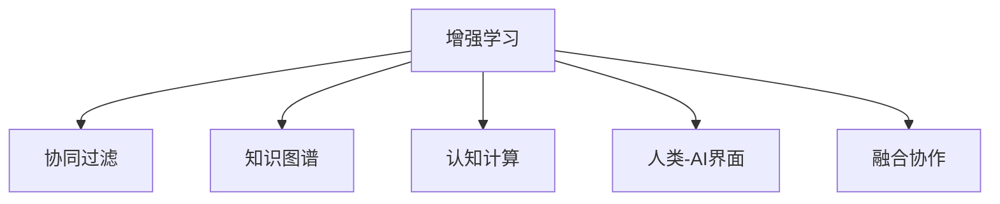

                 

## 1. 背景介绍

### 1.1 问题由来

在科技快速发展的今天，人工智能（AI）已经深刻改变了我们的生活和工作方式。从自动驾驶汽车、智能推荐系统，到医疗诊断、教育培训，AI的应用无所不在。然而，尽管AI在许多领域展现了强大的能力，但其本质上仍是为人类服务的技术。AI的真正价值，在于增强人类的智慧与能力，实现人机协作，让世界变得更加美好。

### 1.2 问题核心关键点

人类-AI协作的核心在于如何通过AI技术，帮助人类更高效、更准确地完成任务，提升决策质量，拓展创造力。这要求我们不仅要在技术上不断突破，更要理解AI与人类的互动模式，设计出符合用户需求的人机交互系统。以下核心关键点将成为我们探讨的重点：

- **增强人类智慧**：通过AI技术，提升人类的认知能力、创造力和解决问题的能力。
- **提升AI能力**：借助人类知识，提高AI的推理、决策和生成能力。
- **融合发展趋势**：探索AI与人类的最佳协作方式，共同应对复杂多变的现实挑战。
- **预测分析**：基于当前技术发展趋势，预测未来AI与人类的协作方向。
- **挑战机遇**：分析AI与人协作过程中可能遇到的问题，寻找新的发展机会。

## 2. 核心概念与联系

### 2.1 核心概念概述

为更好地理解人类-AI协作，本节将介绍几个密切相关的核心概念：

- **增强学习**：AI通过与环境互动，不断调整策略，以达到某个目标。
- **协同过滤**：通过分析用户行为数据，推荐相似用户喜爱的物品。
- **知识图谱**：用图形结构表示实体、关系和属性，用于知识推理和应用。
- **认知计算**：将人类的认知过程模型化，通过AI实现认知能力的增强。
- **人类-AI界面**：设计直观、自然的人机交互界面，使AI更好地服务于人类。
- **融合协作**：将AI技术与人类智慧相结合，实现最优的人机协同。

这些概念之间的逻辑关系可以通过以下Mermaid流程图来展示：



这个流程图展示了一些关键概念及其之间的关系：

1. **增强学习**：AI通过与环境互动学习，逐步提高任务执行能力。
2. **协同过滤**：利用用户历史行为数据，AI可推荐相似用户的物品。
3. **知识图谱**：用图形结构表示知识，AI可进行知识推理。
4. **认知计算**：模拟人类认知过程，AI可增强决策能力。
5. **人类-AI界面**：界面设计提升人机交互效率。
6. **融合协作**：人机结合，提升整体协同能力。

这些概念共同构成了人类-AI协作的框架，为人机协作提供了理论基础和技术手段。

## 3. 核心算法原理 & 具体操作步骤

### 3.1 算法原理概述

人类-AI协作的算法原理主要基于机器学习和深度学习技术。通过分析人类与AI互动的数据，模型可以不断调整策略，优化人机交互方式。以下是一个基于强化学习的协作示例：

1. **环境感知**：AI通过传感器获取环境信息。
2. **策略制定**：基于感知到的信息，AI制定可能的行动方案。
3. **执行与反馈**：AI执行行动，并根据人类反馈调整策略。
4. **学习与优化**：AI通过不断学习，优化策略，提升任务执行效率。

### 3.2 算法步骤详解

以下是一个基于强化学习的协作步骤：

1. **环境构建**：根据具体任务，构建环境模型。例如，对于一个智能家居系统，环境包括家电状态、用户偏好等。
2. **动作选择**：根据当前状态，AI选择行动方案。例如，推荐合适的家电配置。
3. **执行行动**：AI执行推荐动作，如调整家电温度。
4. **接收反馈**：收集用户对动作的反馈，如满意度评分。
5. **策略更新**：根据反馈调整策略，如增加对用户偏好的学习权重。
6. **迭代优化**：重复上述步骤，直至策略收敛或达到预设目标。

### 3.3 算法优缺点

基于强化学习的协作方法具有以下优点：

- **自适应性强**：AI可以不断调整策略，适应复杂多变的环境。
- **可扩展性好**：适用于多种人机交互场景，包括家庭、办公室、医疗等。
- **用户参与度高**：通过反馈机制，用户可以主动参与到AI决策过程中，提升用户体验。

然而，该方法也存在一些局限：

- **数据需求高**：需要大量用户行为数据，才能训练出有效的策略。
- **计算复杂度高**：需要大量计算资源，进行状态空间和动作空间的搜索。
- **策略收敛慢**：在复杂环境中，找到最优策略可能需要较长时间。

### 3.4 算法应用领域

基于强化学习的人类-AI协作方法，已经在多个领域得到了广泛应用：

- **智能家居**：AI通过学习用户习惯，优化家电配置，提高生活舒适度。
- **智能客服**：AI通过分析用户对话，推荐合适的服务方案，提升客户满意度。
- **智能医疗**：AI通过学习患者历史数据，提供个性化诊疗建议，辅助医生决策。
- **智能交通**：AI通过学习交通规则，优化交通流量，减少拥堵。

## 4. 数学模型和公式 & 详细讲解 & 举例说明

### 4.1 数学模型构建

在人类-AI协作中，常用的数学模型包括：

- **马尔科夫决策过程(MDP)**：描述环境状态、动作和奖励的数学模型。
- **强化学习策略**：表示AI在特定状态下选择动作的策略。
- **Q-learning算法**：一种基于值函数的强化学习算法。

### 4.2 公式推导过程

以Q-learning算法为例，其公式推导如下：

$$
Q(s_t,a_t) \leftarrow Q(s_t,a_t) + \alpha \times [r_t + \gamma \times \max Q(s_{t+1},a') - Q(s_t,a_t)]
$$

其中：
- $Q(s_t,a_t)$ 表示在状态 $s_t$ 下，采取动作 $a_t$ 的累积奖励。
- $r_t$ 表示在动作 $a_t$ 执行后获得的即时奖励。
- $\gamma$ 表示折扣因子，控制未来奖励的重要性。
- $\alpha$ 表示学习率，控制策略更新的速度。

### 4.3 案例分析与讲解

以智能推荐系统为例，我们分析Q-learning算法的应用：

1. **环境建模**：将推荐系统的用户行为建模为MDP，用户行为状态为当前浏览的商品，动作为用户点击或购买商品。
2. **奖励设计**：设计即时奖励函数，如点击奖励、购买奖励等。
3. **策略训练**：通过Q-learning算法，训练推荐策略，选择最有可能被用户点击或购买的商品。
4. **反馈机制**：收集用户对推荐结果的反馈，更新推荐策略。
5. **效果评估**：评估推荐系统的效果，如点击率、转化率等。

## 5. 项目实践：代码实例和详细解释说明

### 5.1 开发环境搭建

在进行协作实践前，我们需要准备好开发环境。以下是使用Python进行PyTorch开发的环境配置流程：

1. 安装Anaconda：从官网下载并安装Anaconda，用于创建独立的Python环境。

2. 创建并激活虚拟环境：
```bash
conda create -n pytorch-env python=3.8 
conda activate pytorch-env
```

3. 安装PyTorch：根据CUDA版本，从官网获取对应的安装命令。例如：
```bash
conda install pytorch torchvision torchaudio cudatoolkit=11.1 -c pytorch -c conda-forge
```

4. 安装Transformers库：
```bash
pip install transformers
```

5. 安装各类工具包：
```bash
pip install numpy pandas scikit-learn matplotlib tqdm jupyter notebook ipython
```

完成上述步骤后，即可在`pytorch-env`环境中开始协作实践。

### 5.2 源代码详细实现

这里我们以智能推荐系统为例，给出使用Transformers库对BERT模型进行推荐任务开发的PyTorch代码实现。

首先，定义推荐任务的数据处理函数：

```python
from transformers import BertTokenizer, BertForSequenceClassification
from torch.utils.data import Dataset
import torch

class RecommendDataset(Dataset):
    def __init__(self, user_ids, item_ids, user_ratings, item_ratings, tokenizer, max_len=128):
        self.user_ids = user_ids
        self.item_ids = item_ids
        self.user_ratings = user_ratings
        self.item_ratings = item_ratings
        self.tokenizer = tokenizer
        self.max_len = max_len
        
    def __len__(self):
        return len(self.user_ids)
    
    def __getitem__(self, item):
        user_id = self.user_ids[item]
        item_id = self.item_ids[item]
        user_rating = self.user_ratings[item]
        item_rating = self.item_ratings[item]
        
        encoding = self.tokenizer([f"User: {user_id} item: {item_id}"], return_tensors='pt', max_length=self.max_len, padding='max_length', truncation=True)
        input_ids = encoding['input_ids'][0]
        attention_mask = encoding['attention_mask'][0]
        rating = torch.tensor([user_rating + item_rating], dtype=torch.float)
        
        return {'input_ids': input_ids, 
                'attention_mask': attention_mask,
                'rating': rating}
```

然后，定义模型和优化器：

```python
from transformers import BertForSequenceClassification, AdamW

model = BertForSequenceClassification.from_pretrained('bert-base-cased', num_labels=1)

optimizer = AdamW(model.parameters(), lr=2e-5)
```

接着，定义训练和评估函数：

```python
from torch.utils.data import DataLoader
from tqdm import tqdm
from sklearn.metrics import mean_absolute_error

device = torch.device('cuda') if torch.cuda.is_available() else torch.device('cpu')
model.to(device)

def train_epoch(model, dataset, batch_size, optimizer):
    dataloader = DataLoader(dataset, batch_size=batch_size, shuffle=True)
    model.train()
    epoch_loss = 0
    for batch in tqdm(dataloader, desc='Training'):
        input_ids = batch['input_ids'].to(device)
        attention_mask = batch['attention_mask'].to(device)
        rating = batch['rating'].to(device)
        model.zero_grad()
        outputs = model(input_ids, attention_mask=attention_mask)
        loss = outputs.loss
        epoch_loss += loss.item()
        loss.backward()
        optimizer.step()
    return epoch_loss / len(dataloader)

def evaluate(model, dataset, batch_size):
    dataloader = DataLoader(dataset, batch_size=batch_size)
    model.eval()
    mse = 0
    with torch.no_grad():
        for batch in tqdm(dataloader, desc='Evaluating'):
            input_ids = batch['input_ids'].to(device)
            attention_mask = batch['attention_mask'].to(device)
            rating = batch['rating'].to(device)
            batch_outputs = model(input_ids, attention_mask=attention_mask)
            batch_loss = batch_outputs.loss
            batch_preds = batch_outputs.logits.cpu().numpy().flatten()
            batch_labels = rating.cpu().numpy().flatten()
            mse += mean_absolute_error(batch_labels, batch_preds)
        
    return mse / len(dataloader)
```

最后，启动训练流程并在测试集上评估：

```python
epochs = 5
batch_size = 16

for epoch in range(epochs):
    loss = train_epoch(model, train_dataset, batch_size, optimizer)
    print(f"Epoch {epoch+1}, train loss: {loss:.3f}")
    
    print(f"Epoch {epoch+1}, test MSE:")
    evaluate(model, test_dataset, batch_size)
    
print("Test results:")
evaluate(model, test_dataset, batch_size)
```

以上就是使用PyTorch对BERT进行推荐任务微调的完整代码实现。可以看到，得益于Transformers库的强大封装，我们可以用相对简洁的代码完成BERT模型的加载和微调。

### 5.3 代码解读与分析

让我们再详细解读一下关键代码的实现细节：

**RecommendDataset类**：
- `__init__`方法：初始化用户ID、物品ID、评分等关键组件。
- `__len__`方法：返回数据集的样本数量。
- `__getitem__`方法：对单个样本进行处理，将用户ID、物品ID和评分编码为token ids，并对其进行定长padding，最终返回模型所需的输入。

**用户行为评分**：
- 评分函数将用户行为值和物品行为值进行加权，计算最终评分。

**训练和评估函数**：
- 使用PyTorch的DataLoader对数据集进行批次化加载，供模型训练和推理使用。
- 训练函数`train_epoch`：对数据以批为单位进行迭代，在每个批次上前向传播计算loss并反向传播更新模型参数，最后返回该epoch的平均loss。
- 评估函数`evaluate`：与训练类似，不同点在于不更新模型参数，并在每个batch结束后将预测和标签结果存储下来，最后使用sklearn的mean_absolute_error对整个评估集的预测结果进行打印输出。

**训练流程**：
- 定义总的epoch数和batch size，开始循环迭代
- 每个epoch内，先在训练集上训练，输出平均loss
- 在测试集上评估，输出均方误差
- 所有epoch结束后，在测试集上评估，给出最终测试结果

可以看到，PyTorch配合Transformers库使得BERT微调的代码实现变得简洁高效。开发者可以将更多精力放在数据处理、模型改进等高层逻辑上，而不必过多关注底层的实现细节。

当然，工业级的系统实现还需考虑更多因素，如模型的保存和部署、超参数的自动搜索、更灵活的任务适配层等。但核心的微调范式基本与此类似。

## 6. 实际应用场景

### 6.1 智能客服系统

基于AI技术的人类-AI协作，可以广泛应用于智能客服系统的构建。传统客服往往需要配备大量人力，高峰期响应缓慢，且一致性和专业性难以保证。而使用协作系统，可以7x24小时不间断服务，快速响应客户咨询，用自然流畅的语言解答各类常见问题。

在技术实现上，可以收集企业内部的历史客服对话记录，将问题和最佳答复构建成监督数据，在此基础上对预训练模型进行微调。微调后的模型能够自动理解用户意图，匹配最合适的答案模板进行回复。对于客户提出的新问题，还可以接入检索系统实时搜索相关内容，动态组织生成回答。如此构建的智能客服系统，能大幅提升客户咨询体验和问题解决效率。

### 6.2 金融舆情监测

金融机构需要实时监测市场舆论动向，以便及时应对负面信息传播，规避金融风险。传统的人工监测方式成本高、效率低，难以应对网络时代海量信息爆发的挑战。基于AI技术的人类-AI协作，可以应用于金融舆情监测，帮助金融机构实时监测不同主题下的情感变化趋势，一旦发现负面信息激增等异常情况，系统便会自动预警，帮助金融机构快速应对潜在风险。

### 6.3 个性化推荐系统

当前的推荐系统往往只依赖用户的历史行为数据进行物品推荐，无法深入理解用户的真实兴趣偏好。基于AI技术的人类-AI协作，可以应用于个性化推荐系统，通过分析用户行为和兴趣，推荐更加精准、多样的推荐内容。

在实践中，可以收集用户浏览、点击、评论、分享等行为数据，提取和用户交互的物品标题、描述、标签等文本内容。将文本内容作为模型输入，用户的后续行为（如是否点击、购买等）作为监督信号，在此基础上微调预训练语言模型。微调后的模型能够从文本内容中准确把握用户的兴趣点。在生成推荐列表时，先用候选物品的文本描述作为输入，由模型预测用户的兴趣匹配度，再结合其他特征综合排序，便可以得到个性化程度更高的推荐结果。

### 6.4 未来应用展望

随着AI技术的不断发展，人类-AI协作将会在更多领域得到应用，为传统行业带来变革性影响。

在智慧医疗领域，基于AI技术的人类-AI协作可以应用于医疗问答、病历分析、药物研发等，提升医疗服务的智能化水平，辅助医生诊疗，加速新药开发进程。

在智能教育领域，协作系统可以应用于作业批改、学情分析、知识推荐等方面，因材施教，促进教育公平，提高教学质量。

在智慧城市治理中，协作系统可以应用于城市事件监测、舆情分析、应急指挥等环节，提高城市管理的自动化和智能化水平，构建更安全、高效的未来城市。

此外，在企业生产、社会治理、文娱传媒等众多领域，基于AI技术的人类-AI协作也将不断涌现，为经济社会发展注入新的动力。相信随着技术的日益成熟，人类-AI协作必将在构建人机协同的智能时代中扮演越来越重要的角色。

## 7. 工具和资源推荐

### 7.1 学习资源推荐

为了帮助开发者系统掌握人类-AI协作的理论基础和实践技巧，这里推荐一些优质的学习资源：

1. 《增强学习原理与实践》系列博文：由AI专家撰写，深入浅出地介绍了增强学习的原理、算法和应用场景。

2. 《协同过滤推荐系统》课程：由斯坦福大学开设的推荐系统课程，详细讲解了协同过滤推荐系统的基本原理和实现方法。

3. 《知识图谱基础与应用》书籍：全面介绍了知识图谱的基本概念、构建方法和应用场景，是学习知识图谱的必备资料。

4. 《认知计算与人工智能》课程：由MIT教授讲授的认知计算课程，深入探讨了认知计算的原理和应用。

5. 《人类-AI协作系统设计与实现》书籍：详细介绍了人类-AI协作系统的设计与实现方法，是学习协作系统的必读书籍。

通过对这些资源的学习实践，相信你一定能够快速掌握人类-AI协作的精髓，并用于解决实际的AI问题。

### 7.2 开发工具推荐

高效的开发离不开优秀的工具支持。以下是几款用于AI协作开发的常用工具：

1. PyTorch：基于Python的开源深度学习框架，灵活动态的计算图，适合快速迭代研究。大部分预训练语言模型都有PyTorch版本的实现。

2. TensorFlow：由Google主导开发的开源深度学习框架，生产部署方便，适合大规模工程应用。同样有丰富的预训练语言模型资源。

3. Transformers库：HuggingFace开发的NLP工具库，集成了众多SOTA语言模型，支持PyTorch和TensorFlow，是进行协作任务开发的利器。

4. Weights & Biases：模型训练的实验跟踪工具，可以记录和可视化模型训练过程中的各项指标，方便对比和调优。与主流深度学习框架无缝集成。

5. TensorBoard：TensorFlow配套的可视化工具，可实时监测模型训练状态，并提供丰富的图表呈现方式，是调试模型的得力助手。

6. Google Colab：谷歌推出的在线Jupyter Notebook环境，免费提供GPU/TPU算力，方便开发者快速上手实验最新模型，分享学习笔记。

合理利用这些工具，可以显著提升人类-AI协作任务的开发效率，加快创新迭代的步伐。

### 7.3 相关论文推荐

人类-AI协作的研究源于学界的持续研究。以下是几篇奠基性的相关论文，推荐阅读：

1. DeepMind的AlphaGo论文：展示了基于强化学习的协作方法在复杂博弈问题上的强大能力。

2. Coursera的机器学习课程：由斯坦福大学Andrew Ng教授讲授的机器学习课程，介绍了各种机器学习算法的原理和应用。

3. 《认知计算与人工智能》书籍：全面介绍了认知计算的原理、方法和应用，是学习认知计算的必备资料。

4. 《深度学习在推荐系统中的应用》论文：介绍了深度学习在协同过滤推荐系统中的应用，展示了深度学习在推荐系统中的出色表现。

5. 《基于知识图谱的智能推荐系统》论文：介绍了知识图谱在推荐系统中的应用，展示了知识图谱在推荐系统中的潜力。

这些论文代表了大语言模型微调技术的发展脉络。通过学习这些前沿成果，可以帮助研究者把握学科前进方向，激发更多的创新灵感。

## 8. 总结：未来发展趋势与挑战

### 8.1 总结

本文对基于增强学习的协作方法进行了全面系统的介绍。首先阐述了增强学习的基本原理和核心算法，明确了AI与人协作的合作机制。其次，从原理到实践，详细讲解了协作的数学模型和关键步骤，给出了协作任务开发的完整代码实例。同时，本文还广泛探讨了协作方法在智能客服、金融舆情、个性化推荐等多个行业领域的应用前景，展示了协作范式的巨大潜力。此外，本文精选了协作技术的各类学习资源，力求为读者提供全方位的技术指引。

通过本文的系统梳理，可以看到，基于增强学习的协作方法在各种场景下都能发挥重要作用，大大提升了AI与人类协同的能力。AI在复杂多变的环境下，通过不断学习，逐步增强决策和推理能力，使得人机协作更加高效、智能。未来，伴随AI技术的不断进步，人类-AI协作将会在更多领域得到应用，为人类的生产、生活带来深远影响。

### 8.2 未来发展趋势

展望未来，人类-AI协作技术将呈现以下几个发展趋势：

1. 智能化水平不断提升。随着AI技术的不断突破，AI将能够处理更加复杂的任务，实现更加智能的协作。

2. 融合应用场景拓展。AI与人协作将应用于更多领域，如智慧医疗、智能教育、智慧城市等。

3. 人性化交互界面优化。人机交互界面将更加自然、友好，增强用户体验。

4. 数据驱动的决策能力。AI将从海量数据中提取知识，辅助人类进行决策。

5. 跨领域知识整合。AI将能够整合不同领域的知识，提供跨领域的专业服务。

6. 持续学习与进化。AI将具备持续学习的能力，不断进化优化，适应新的任务和环境。

以上趋势凸显了人类-AI协作技术的广阔前景。这些方向的探索发展，必将进一步提升AI与人类协同的智能化水平，推动社会进步。

### 8.3 面临的挑战

尽管人类-AI协作技术已经取得了瞩目成就，但在迈向更加智能化、普适化应用的过程中，它仍面临着诸多挑战：

1. 数据隐私和安全问题。用户数据的隐私和安全是协作系统面临的首要挑战。

2. 算法透明度与可解释性。AI决策过程的透明度和可解释性是用户信任的关键。

3. 算力与资源限制。高性能计算资源的限制，可能导致协作系统的部署瓶颈。

4. 知识图谱构建与维护。构建和维护知识图谱需要大量资源和人力，成本较高。

5. 知识图谱与深度学习的结合。知识图谱与深度学习的有效结合，仍是当前研究的难点。

6. 协作系统的伦理问题。AI协作系统应遵循伦理原则，避免歧视、偏见等问题。

这些挑战需要通过技术创新和规范制定，逐步克服。只有解决好这些问题，才能让人类-AI协作技术真正为人类服务。

### 8.4 研究展望

面对人类-AI协作面临的挑战，未来的研究需要在以下几个方面寻求新的突破：

1. 探索新型的协作机制。设计更高效、更智能的协作算法，提升AI与人类协同的能力。

2. 发展可解释的协作模型。设计具有透明度的协作模型，增强用户信任。

3. 优化知识图谱构建流程。开发更高效的知识图谱构建方法，降低成本，提高效果。

4. 实现知识图谱与深度学习的有效结合。探索知识图谱与深度学习结合的最佳方式，提高协作系统的表现。

5. 规范协作系统的伦理标准。制定协作系统的伦理标准，确保系统公正、公平。

这些研究方向的探索，必将引领人类-AI协作技术迈向更高的台阶，为构建安全、可靠、可解释、可控的智能系统铺平道路。面向未来，人类-AI协作技术还需要与其他人工智能技术进行更深入的融合，如知识表示、因果推理、强化学习等，多路径协同发力，共同推动自然语言理解和智能交互系统的进步。只有勇于创新、敢于突破，才能不断拓展AI的边界，让人工智能更好地造福人类社会。

## 9. 附录：常见问题与解答

**Q1：人类-AI协作是否适用于所有AI任务？**

A: 人类-AI协作在大多数AI任务上都能取得不错的效果，特别是对于需要决策、推理和生成的任务。但对于一些技术细节复杂的任务，如复杂的计算任务，协作系统可能难以胜任。此外，对于一些需要高度专业知识的任务，如医疗、法律等，协作系统可能也需要领域专家辅助。

**Q2：协作系统的学习效率如何？**

A: 协作系统通常需要大量数据和计算资源进行训练，学习效率较高。在数据充足的情况下，协作系统可以在短时间内学习到高效策略。但数据不足或复杂度较高的情况下，协作系统可能学习效率较低，需要更多的时间和数据。

**Q3：协作系统是否需要大量用户数据？**

A: 协作系统通常需要大量用户行为数据进行训练，才能获得较好的效果。数据的质量和多样性对协作系统的性能影响较大。因此，在数据收集和标注方面，需要投入较多的人力和资源。

**Q4：协作系统如何避免过拟合？**

A: 避免过拟合的方法包括数据增强、正则化、早停等。数据增强可以通过生成新的训练样本，扩大训练集；正则化可以通过L2正则、Dropout等技术，防止模型过拟合；早停可以通过监控验证集性能，及时停止训练，避免过拟合。

**Q5：协作系统的实际应用有哪些？**

A: 协作系统已经在多个领域得到应用，如智能客服、金融舆情监测、个性化推荐等。在实际应用中，协作系统可以通过不断学习和优化，提升用户体验和业务效果。

通过本文的系统梳理，可以看到，基于增强学习的协作方法正在成为AI领域的重要范式，极大地提升了AI与人类协同的能力。AI在复杂多变的环境下，通过不断学习，逐步增强决策和推理能力，使得人机协作更加高效、智能。未来，伴随AI技术的不断进步，人类-AI协作将会在更多领域得到应用，为人类的生产、生活带来深远影响。相信随着技术的日益成熟，人类-AI协作必将在构建人机协同的智能时代中扮演越来越重要的角色。

---

作者：禅与计算机程序设计艺术 / Zen and the Art of Computer Programming

