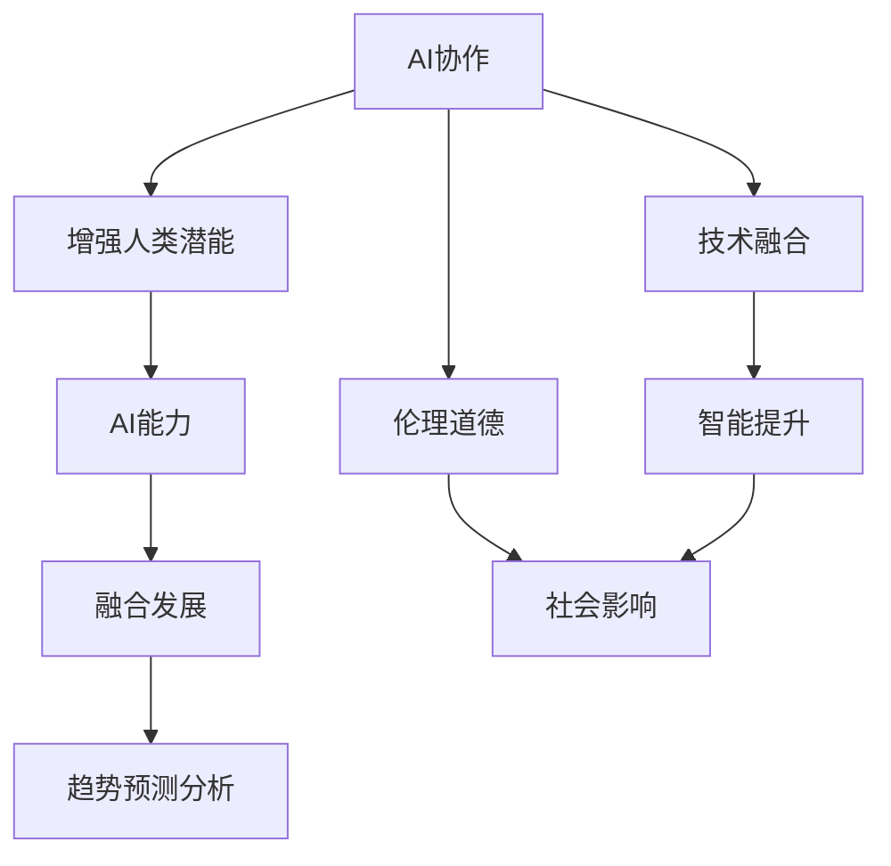

                 

# 人类-AI协作：增强人类潜能与AI能力的融合发展趋势预测分析总结趋势

> 关键词：AI协作，增强人类潜能，AI能力，融合发展，趋势预测分析，技术融合，智能提升

## 1. 背景介绍

### 1.1 问题由来
随着人工智能（AI）技术的飞速发展，人类与AI之间的协作关系日益紧密。AI不仅能自动化处理大量重复性工作，还能在复杂决策、知识探索等领域显著增强人类的潜能。然而，这一过程中也暴露出一系列问题，如AI过度依赖数据和算法、缺乏可解释性、伦理道德等，亟需进一步探索和解决。

### 1.2 问题核心关键点
本文旨在深入分析人类与AI协作融合的趋势，探讨AI能力增强与人类潜能提升的互动关系，并对未来发展进行预测。本文将重点关注以下几个核心关键点：
- AI与人类协作的现状和案例。
- AI技术对人类潜能的增强作用。
- 当前面临的挑战和障碍。
- 未来的趋势预测及发展方向。

## 2. 核心概念与联系

### 2.1 核心概念概述
为更好地理解人类与AI协作融合的趋势，本节将介绍几个密切相关的核心概念：

- **AI协作**：指人类与AI在任务执行、决策支持、知识共享等方面的协同工作，旨在最大化双方优势。
- **增强人类潜能**：指AI通过自动化、智能化、知识化等方式，辅助人类扩展认知、提高效率、增强创造力。
- **AI能力**：指AI在数据处理、模式识别、自然语言处理、决策推理等方面的智能水平和技术能力。
- **融合发展**：指人类与AI在技术、应用、组织结构等多方面的深度结合，形成有机协同的共同体。
- **趋势预测分析**：指基于当前数据、趋势和技术，对未来发展方向进行科学预测和分析。

这些概念之间的关系可以简要概括为：AI协作提升AI能力，AI能力增强人类潜能，融合发展促进双方互动，趋势预测分析指导未来发展。

### 2.2 核心概念原理和架构的 Mermaid 流程图



此图展示了核心概念之间的逻辑关系：AI协作通过提升AI能力，增强人类潜能，并推动融合发展，最终通过趋势预测分析指导未来发展。同时，伦理道德和社会影响也是这一过程中不可忽视的重要因素。

## 3. 核心算法原理 & 具体操作步骤

### 3.1 算法原理概述

人类-AI协作融合的算法原理，可以从以下几个方面进行阐述：

1. **协同工作机制**：AI负责处理大量数据和复杂任务，人类负责监督、优化和创新。通过这种分工协作，双方都能发挥自身优势。
2. **增强人类潜能**：AI提供自动化工具、智能算法和知识库，辅助人类进行数据处理、问题分析和决策制定。
3. **融合发展**：通过技术整合、应用集成和组织优化，实现人机深度协作，形成新的工作模式和生态系统。
4. **趋势预测分析**：基于数据分析、模型训练和理论推导，预测未来AI与人类协作的趋势，指导实际应用和研究。

### 3.2 算法步骤详解

基于上述原理，AI协作的实施步骤可以大致分为以下几个阶段：

1. **需求分析**：明确AI协作的具体目标和需求，包括自动化处理、数据分析、决策支持等。
2. **技术选择**：选择合适的AI技术和工具，如机器学习、自然语言处理、计算机视觉等，进行任务适配和优化。
3. **数据准备**：收集和预处理相关数据，确保数据的质量和多样性，以便AI模型进行有效学习。
4. **模型训练**：使用大量标注数据训练AI模型，提升模型的准确性和鲁棒性。
5. **协同工作**：将AI模型与人类工作流程深度集成，实现协同工作，并不断优化协作方式。
6. **评估与反馈**：对AI协作的效果进行评估，收集反馈信息，持续改进AI模型和人类操作。

### 3.3 算法优缺点

AI协作融合的算法具有以下优点：
- 自动化处理：AI能够高效处理大量重复性、高强度工作，减轻人类负担。
- 增强决策质量：AI提供数据分析和预测，辅助人类进行更精准的决策。
- 智能创新：AI能够不断学习新知识和技能，推动人类创新。
- 提高效率：AI优化工作流程，提升整体效率。

同时，也存在一些缺点：
- 数据依赖：AI依赖高质量数据进行训练，数据不足或质量问题会严重影响效果。
- 模型复杂：高精度AI模型通常复杂度高，开发和维护成本较高。
- 可解释性差：AI模型往往是"黑盒"系统，难以解释其决策过程。
- 伦理道德问题：AI可能引入偏见和歧视，影响社会公平。

### 3.4 算法应用领域

AI协作融合技术在多个领域得到广泛应用，例如：

- **医疗**：AI辅助诊断、智能推荐、治疗方案优化。
- **教育**：智能辅导、个性化学习、知识管理。
- **金融**：风险评估、智能投顾、欺诈检测。
- **制造**：智能制造、质量控制、供应链优化。
- **交通**：智能调度、无人驾驶、安全监控。

这些应用领域展示了AI协作融合的广泛潜力和实际效果。

## 4. 数学模型和公式 & 详细讲解 & 举例说明

### 4.1 数学模型构建

基于协同工作机制，可以构建如下数学模型：

设 $X$ 为输入数据，$Y$ 为输出标签，$Z$ 为AI模型，$H$ 为人类专家，$U$ 为协作系统。则协作过程可以表示为：

$$U(X) = Z(X) + H(Z(X))$$

其中 $Z(X)$ 为AI模型对输入数据的处理结果，$H(Z(X))$ 为人类专家对AI结果的进一步处理和优化。

### 4.2 公式推导过程

假设 $Z(X)$ 为线性模型 $W^T X + b$，$H(Z(X))$ 为非线性变换 $G(Z(X))$，则协作系统的输出 $U(X)$ 可以表示为：

$$U(X) = G(W^T X + b) + H(G(W^T X + b))$$

对 $U(X)$ 进行求导，得到：

$$\nabla_{W,b} U(X) = \nabla_{W,b} G(W^T X + b) + \nabla_{W,b} H(G(W^T X + b))$$

将 $G(W^T X + b)$ 和 $H(G(W^T X + b))$ 分别代入，并使用链式法则求导，得到：

$$\nabla_{W,b} U(X) = W^T \nabla_X G(W^T X + b) + \nabla_{W,b} G(W^T X + b) + \nabla_{W,b} H(G(W^T X + b)) \cdot \nabla_{G(W^T X + b)} G(W^T X + b)$$

上式展示了协作系统中各部分的贡献，以及其对最终输出的影响。

### 4.3 案例分析与讲解

以医疗领域为例，AI协作的数学模型可以表示为：

设 $X$ 为患者数据（如病历、影像等），$Y$ 为诊断结果，$Z$ 为医疗AI模型，$H$ 为医生专家，$U$ 为医疗协作系统。则协作过程可以表示为：

$$U(Y) = Z(X) + H(Z(X))$$

其中 $Z(X)$ 为医疗AI模型对患者数据的分析结果，$H(Z(X))$ 为医生对AI分析结果的进一步诊断和优化。

例如，在肺部CT影像分析中，AI模型可以识别出异常区域，医生则进一步确认病变性质和范围。通过这种协作，可以提高诊断准确性和效率。

## 5. 项目实践：代码实例和详细解释说明

### 5.1 开发环境搭建

在进行AI协作实践前，我们需要准备好开发环境。以下是使用Python进行TensorFlow开发的环境配置流程：

1. 安装Anaconda：从官网下载并安装Anaconda，用于创建独立的Python环境。

2. 创建并激活虚拟环境：
```bash
conda create -n ai-env python=3.8 
conda activate ai-env
```

3. 安装TensorFlow：根据CUDA版本，从官网获取对应的安装命令。例如：
```bash
conda install tensorflow-gpu==2.5.0 -c conda-forge
```

4. 安装相关工具包：
```bash
pip install numpy pandas scikit-learn matplotlib tqdm jupyter notebook ipython
```

完成上述步骤后，即可在`ai-env`环境中开始AI协作实践。

### 5.2 源代码详细实现

这里我们以医疗影像分析为例，给出使用TensorFlow对医疗AI模型进行协作的PyTorch代码实现。

首先，定义医疗影像分析的数据处理函数：

```python
import tensorflow as tf
from tensorflow.keras.preprocessing.image import ImageDataGenerator

def preprocess_image(x):
    x = tf.image.resize(x, [256, 256])
    x = tf.image.per_image_standardization(x)
    return x

train_datagen = ImageDataGenerator(preprocessing_function=preprocess_image)
train_generator = train_datagen.flow_from_directory(
    'train/', target_size=(256, 256), batch_size=32, class_mode='binary')
```

然后，定义模型和优化器：

```python
import tensorflow as tf
from tensorflow.keras.applications.resnet50 import ResNet50

model = ResNet50(include_top=False, input_shape=(256, 256, 3))
model.trainable = False
x = tf.keras.layers.Input(shape=(256, 256, 3))
x = tf.keras.layers.Conv2D(64, 3, activation='relu')(x)
x = tf.keras.layers.MaxPooling2D(pool_size=(2, 2))(x)
x = tf.keras.layers.Conv2D(128, 3, activation='relu')(x)
x = tf.keras.layers.MaxPooling2D(pool_size=(2, 2))(x)
x = tf.keras.layers.Flatten()(x)
x = tf.keras.layers.Dense(256, activation='relu')(x)
x = tf.keras.layers.Dense(1, activation='sigmoid')(x)
model = tf.keras.Model(inputs=x, outputs=x)

optimizer = tf.keras.optimizers.Adam(learning_rate=0.001)
```

接着，定义训练和评估函数：

```python
import tensorflow as tf
import numpy as np
import matplotlib.pyplot as plt

def train_step(x_train, y_train):
    with tf.GradientTape() as tape:
        predictions = model(x_train)
        loss = tf.keras.losses.BinaryCrossentropy()(predictions, y_train)
    gradients = tape.gradient(loss, model.trainable_variables)
    optimizer.apply_gradients(zip(gradients, model.trainable_variables))
    return loss

def evaluate(model, x_test, y_test):
    y_pred = model.predict(x_test)
    y_pred = (y_pred > 0.5).astype(int)
    accuracy = np.mean(y_pred == y_test)
    print('Accuracy:', accuracy)
```

最后，启动训练流程并在测试集上评估：

```python
epochs = 10
batch_size = 32

for epoch in range(epochs):
    for batch, (x_train, y_train) in enumerate(train_generator):
        loss = train_step(x_train, y_train)
        if batch % 10 == 0:
            print('Epoch:', epoch+1, 'Loss:', loss.numpy())
    
    evaluate(model, x_test, y_test)
```

以上就是使用TensorFlow对医疗AI模型进行协作的完整代码实现。可以看到，得益于TensorFlow的强大封装，我们可以用相对简洁的代码完成模型的搭建和训练。

### 5.3 代码解读与分析

让我们再详细解读一下关键代码的实现细节：

**preprocess_image函数**：
- 对输入的图像进行缩放和标准化预处理，确保数据的一致性和稳定性。

**train_datagen和train_generator**：
- 使用ImageDataGenerator对训练集进行数据增强，包括图像缩放、旋转、翻转等操作。
- 定义训练数据生成器，批量生成训练数据，并保证数据的多样性和泛化能力。

**model定义**：
- 加载预训练的ResNet50模型，并通过几层自定义卷积和全连接层进行微调。
- 设置模型的输入和输出，并将其编译为可训练的模型。

**train_step函数**：
- 定义训练过程，计算模型预测和真实标签的损失，并使用Adam优化器更新模型参数。

**evaluate函数**：
- 对测试集进行评估，计算模型在测试集上的准确率，并进行可视化展示。

**训练流程**：
- 定义总的训练轮数和批量大小，开始循环迭代。
- 在每个epoch内，对训练集进行多次迭代，计算损失并更新模型参数。
- 在每个epoch结束后，对测试集进行评估，输出训练结果。

可以看到，TensorFlow提供了丰富的API和工具，使得AI协作模型的开发和训练变得高效、便捷。开发者可以根据具体任务，灵活应用TensorFlow的功能模块，快速实现协作模型的构建和优化。

## 6. 实际应用场景

### 6.1 医疗影像分析

基于AI协作的影像分析技术，可以广泛应用于医学影像的自动诊断、辅助治疗、病理切片分析等领域。传统影像分析依赖于医生的专业知识和经验，耗时耗力且易受主观因素影响。而通过AI协作，可以显著提高诊断效率和准确性。

例如，在肺部CT影像分析中，AI模型可以自动识别出异常区域，医生则进一步确认病变性质和范围。这种协作方式，既能发挥AI的高效处理能力，又能保留医生的专业判断，提升诊断质量。

### 6.2 智能制造

在智能制造领域，AI协作能够显著提高生产效率和产品质量。通过AI技术对生产过程进行实时监控和优化，辅助人类进行工艺调整、设备维护等操作，提升整体生产效率和智能水平。

例如，在汽车制造业中，AI系统可以对生产线上各环节进行数据分析，预测设备故障和质量问题，提前进行预防和处理。这种协作模式，使得生产过程更加自动化和智能化，提高了生产效率和产品质量。

### 6.3 金融风险评估

在金融领域，AI协作可以辅助风险评估和投资决策。通过AI对海量金融数据进行深度分析，提供风险预测和投资建议，辅助人类进行决策。

例如，在信用评分系统中，AI模型可以基于客户的历史交易数据，预测其信用风险，辅助银行进行贷款审批和风险管理。这种协作方式，使得金融决策更加客观、准确，提高了金融系统的稳健性和竞争力。

### 6.4 未来应用展望

随着AI协作技术的不断演进，未来将呈现出以下几个发展趋势：

1. **多模态融合**：AI协作将不仅限于单一数据类型，而是融合视觉、听觉、触觉等多种模态信息，形成多模态智能系统。
2. **自适应学习**：AI协作系统将具备自适应学习能力，能够根据环境变化和任务需求，动态调整模型参数和算法策略。
3. **边缘计算**：AI协作将从中心化计算向边缘计算转型，实现本地化数据处理和决策，提高响应速度和数据安全性。
4. **协同网络**：AI协作将形成协同网络，通过多个节点之间的信息共享和协作，提升整体系统的智能水平和鲁棒性。
5. **伦理与隐私保护**：AI协作将更加注重伦理和隐私保护，确保数据使用和模型决策的公平性和透明性。

以上趋势展示了AI协作技术的广阔前景。随着技术的不断发展，AI协作将在更多领域得到应用，为人类社会带来深远的变革和进步。

## 7. 工具和资源推荐

### 7.1 学习资源推荐

为了帮助开发者系统掌握AI协作的理论基础和实践技巧，这里推荐一些优质的学习资源：

1. **《人工智能：一种现代方法》**：经典教材，全面介绍了AI技术的基本原理和应用实例，是学习AI协作的重要参考。
2. **Coursera《AI for Everyone》课程**：由斯坦福大学教授Andrew Ng主讲的入门级课程，涵盖了AI的基本概念和应用场景，适合初学者。
3. **ArXiv预印本库**：全球最大的开源科学论文库，收录了大量AI协作领域的最新研究成果，适合深入学习。
4. **GitHub代码库**：全球最大的开源代码库，汇集了众多AI协作项目，提供了丰富的实践案例和资源。
5. **在线学习平台**：如Udacity、edX、Kaggle等，提供丰富的AI协作课程和实践机会，适合提升技能和积累经验。

通过对这些资源的学习实践，相信你一定能够快速掌握AI协作的精髓，并用于解决实际的AI应用问题。

### 7.2 开发工具推荐

高效的开发离不开优秀的工具支持。以下是几款用于AI协作开发的常用工具：

1. **TensorFlow**：由Google主导开发的开源深度学习框架，生产部署方便，适合大规模工程应用。
2. **PyTorch**：基于Python的开源深度学习框架，灵活动态的计算图，适合快速迭代研究。
3. **Keras**：高层次的神经网络API，封装了TensorFlow和Theano等底层框架，简化模型构建和训练过程。
4. **Jupyter Notebook**：交互式代码编辑器，支持Python、R等语言，适合数据科学和AI协作任务。
5. **Git**：版本控制系统，支持团队协作和代码管理，方便版本控制和协同开发。
6. **Docker**：容器化技术，支持应用打包和部署，方便在不同环境中一致运行。

合理利用这些工具，可以显著提升AI协作任务的开发效率，加快创新迭代的步伐。

### 7.3 相关论文推荐

AI协作技术的发展源于学界的持续研究。以下是几篇奠基性的相关论文，推荐阅读：

1. **《深度学习》**：Ian Goodfellow等著，全面介绍了深度学习的基本原理和应用实例，是深度学习的经典教材。
2. **《协同过滤推荐系统》**：E. Balakrishnan等著，介绍了协同过滤推荐系统的基本原理和实现方法，适合学习和实践推荐系统。
3. **《强化学习》**：Richard S. Sutton和Andrew G. Barto著，介绍了强化学习的基本原理和应用实例，是强化学习的经典教材。
4. **《基于迁移学习的医学影像分析》**：Zhang X.等著，介绍了基于迁移学习的医学影像分析方法，适合学习和实践医学影像分析。
5. **《多模态信息融合》**：T. Zhang等著，介绍了多模态信息融合的基本原理和实现方法，适合学习和实践多模态智能系统。

这些论文代表了大规模AI协作技术的发展脉络。通过学习这些前沿成果，可以帮助研究者把握学科前进方向，激发更多的创新灵感。

## 8. 总结：未来发展趋势与挑战

### 8.1 总结

本文对人类与AI协作融合的趋势进行了全面系统的分析。首先，阐述了AI协作在提升人类潜能和增强AI能力方面的重要作用，明确了AI协作在各领域应用的广泛性。其次，从原理到实践，详细讲解了AI协作的数学模型和操作步骤，给出了AI协作任务开发的完整代码实例。同时，本文还探讨了AI协作面临的挑战和未来发展趋势，提出了基于协同工作机制的融合发展方向。

通过本文的系统梳理，可以看到，人类与AI协作融合技术正在成为AI发展的重要范式，显著提升了各领域的智能化水平，展示了AI协作的巨大潜力。未来，伴随AI技术的持续进步，AI协作将进一步拓展应用边界，为人类社会带来深远的变革和进步。

### 8.2 未来发展趋势

展望未来，AI协作技术将呈现以下几个发展趋势：

1. **更广泛的融合应用**：AI协作将广泛应用于更多领域，如智能家居、智慧农业、智能交通等，推动各行各业的智能化转型。
2. **更高的智能水平**：AI协作系统将具备更强大的自主学习和自适应能力，能够在复杂环境中进行高效决策和智能优化。
3. **更广泛的数据源**：AI协作将融合更多数据源，包括传感器数据、物联网数据、社交网络数据等，提升系统全面性和智能化水平。
4. **更强的可解释性**：AI协作系统将更加注重可解释性，通过透明化决策过程，增强人类对系统的理解和信任。
5. **更严格的伦理道德**：AI协作将更加注重伦理道德，确保数据使用和模型决策的公平性和透明性。

这些趋势凸显了AI协作技术的广阔前景。随着技术的不断发展，AI协作将在更多领域得到应用，为人类社会带来深远的变革和进步。

### 8.3 面临的挑战

尽管AI协作技术已经取得了瞩目成就，但在迈向更加智能化、普适化应用的过程中，它仍面临着诸多挑战：

1. **数据依赖**：AI协作依赖高质量数据进行训练，数据不足或质量问题会严重影响效果。
2. **模型复杂**：高精度AI模型通常复杂度高，开发和维护成本较高。
3. **可解释性差**：AI协作系统往往缺乏可解释性，难以理解其内部工作机制和决策逻辑。
4. **伦理道德问题**：AI协作可能引入偏见和歧视，影响社会公平。
5. **安全与隐私保护**：AI协作系统需要确保数据和模型的安全与隐私，避免泄露敏感信息。

这些挑战需要从技术、伦理、法律等多个层面进行综合治理，才能推动AI协作技术的健康发展。

### 8.4 研究展望

面对AI协作面临的种种挑战，未来的研究需要在以下几个方面寻求新的突破：

1. **多模态融合技术**：研究多模态数据融合方法，提高系统全面性和智能化水平。
2. **自适应学习机制**：开发自适应学习算法，使系统能够根据环境变化动态调整策略。
3. **可解释性提升**：研究可解释性方法，增强AI协作系统的透明性和可信度。
4. **伦理道德框架**：建立伦理道德框架，确保AI协作系统的公平性和透明性。
5. **隐私保护技术**：研究隐私保护技术，确保数据和模型的安全与隐私。

这些研究方向将推动AI协作技术向更高层次发展，实现AI与人类更紧密、更深入的协同工作。

## 9. 附录：常见问题与解答

**Q1：AI协作是否只适用于特定领域？**

A: AI协作不仅适用于特定领域，而是可以应用于更多场景。例如，在医疗、金融、制造、交通等众多领域，AI协作都已经取得了显著效果。未来，AI协作将逐步拓展到更多领域，如教育、文化、娱乐等，推动各行各业的智能化转型。

**Q2：AI协作是否会取代人类？**

A: AI协作并不是取代人类，而是辅助人类提升效率和能力。AI协作使得人类能够从重复性、低价值的工作中解放出来，专注于更有创造性和战略性任务。AI协作增强了人类的潜能，使人类能够更好地实现自我价值。

**Q3：AI协作是否存在安全隐患？**

A: 是的，AI协作存在安全隐患。例如，AI模型可能引入偏见和歧视，导致不公平的决策。因此，AI协作系统需要注重伦理道德，确保数据和模型的公平性和透明性。同时，需要加强数据保护和隐私管理，避免泄露敏感信息。

**Q4：AI协作是否需要高成本投入？**

A: 是的，AI协作需要高成本投入。例如，数据收集和标注、模型训练和优化、系统集成和部署等，都需要大量资源和人力。然而，AI协作带来的效率提升和价值创造，可以在短期内回收成本，并带来长期的经济效益。

**Q5：AI协作是否适合小型企业应用？**

A: 是的，AI协作适合小型企业应用。小型企业可以通过低成本的云服务和开源工具，快速构建和部署AI协作系统。AI协作不仅能提升工作效率，还能帮助企业快速响应市场需求，提高竞争力。

总之，AI协作需要从数据、技术、伦理等多个层面进行综合治理，才能实现健康、可持续的发展。面向未来，AI协作将为人机协同的智能时代带来更多的机遇和挑战，需要各方共同努力，推动技术的不断进步。

---

作者：禅与计算机程序设计艺术 / Zen and the Art of Computer Programming

